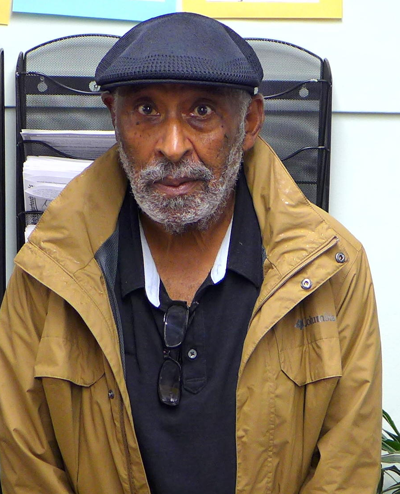
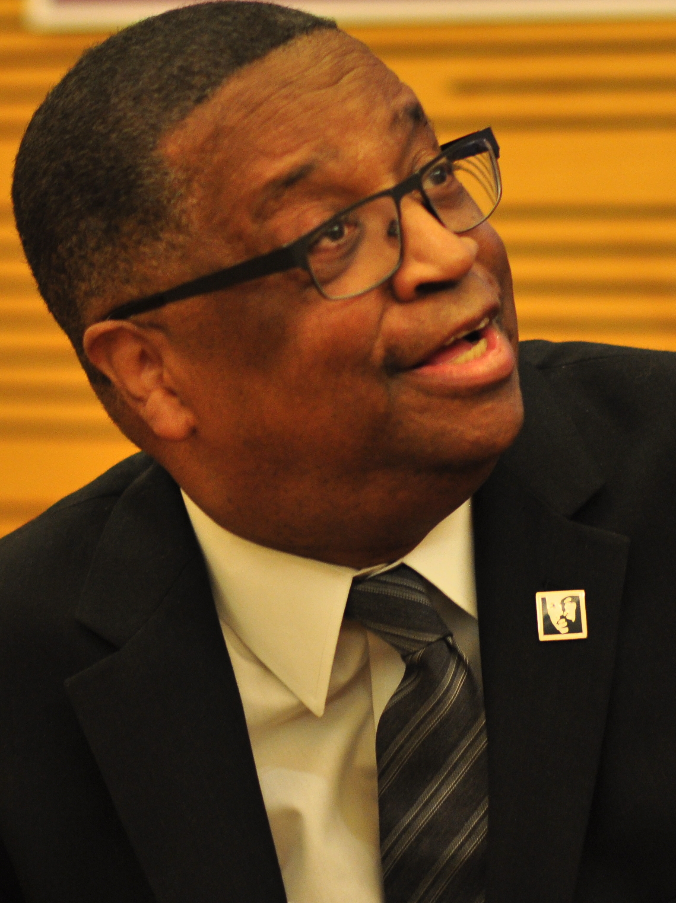
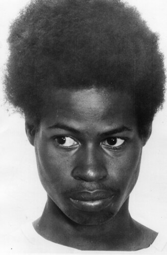
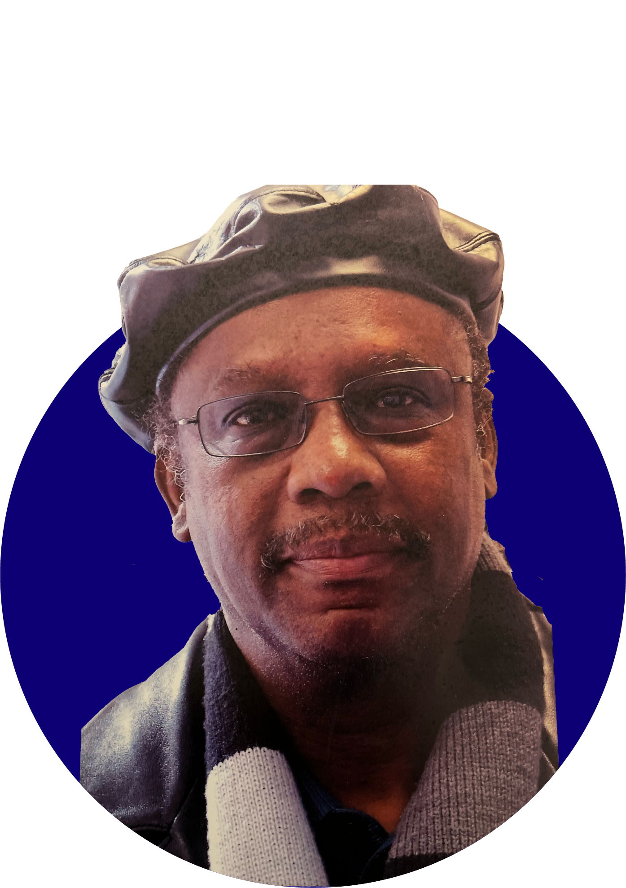
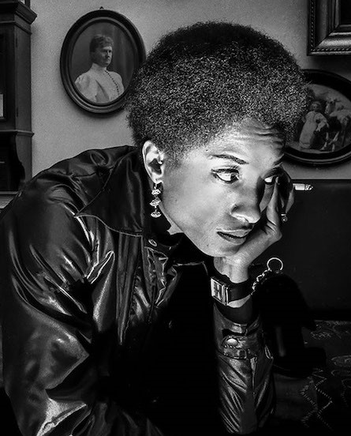
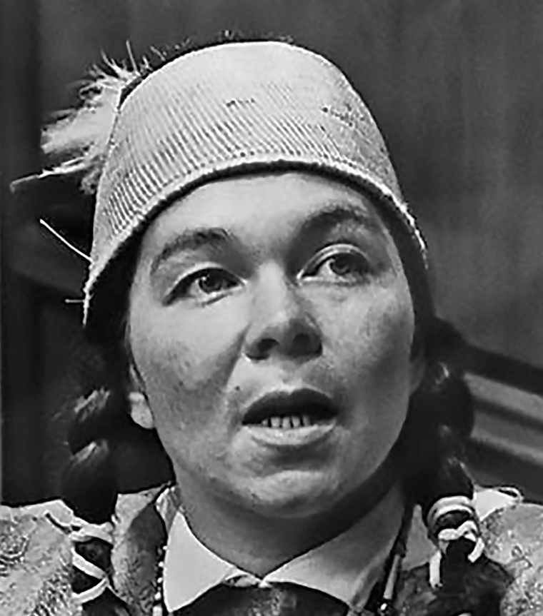
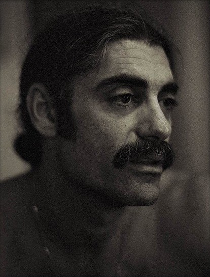
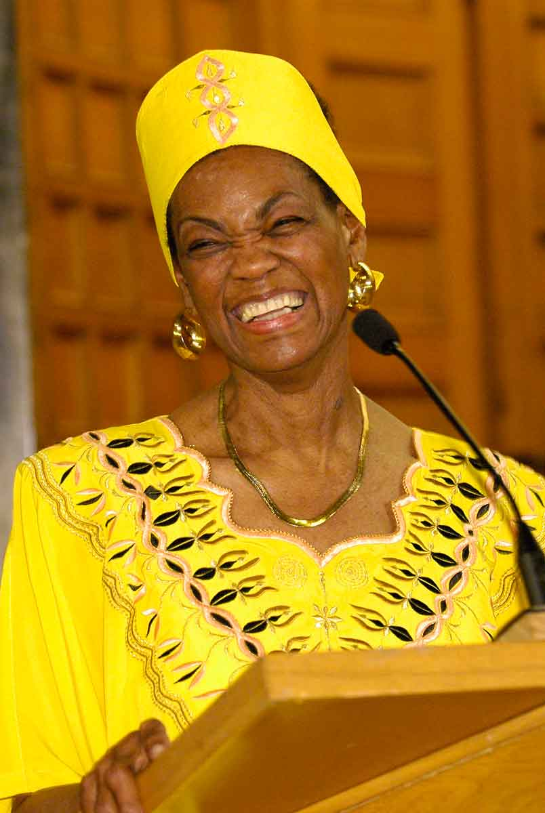

# Batch 254 photo credits

Retrieved September 8, 2026. Four photos are unchanged; Kent Ford, Connie Matthews, Janet McCloud and Scott Camil have exact rectangular framing crops requested by the user. Original files are retained beside the cropped PNGs. No generative images are included. Credits identify the source rights statements; inclusion does not imply an open license or endorsement. Research links stay in this audit trail, never in personal/support website fields.

## Kent Ford

- File: `kent-ford-pete-forsyth-crop.png`
- Source: [Kent Ford](https://commons.wikimedia.org/wiki/File:Kent_Ford_by_Pete_Forsyth.jpg)
- [Downloaded image](https://upload.wikimedia.org/wikipedia/commons/7/77/Kent_Ford_by_Pete_Forsyth.jpg)
- Credit: Pete Forsyth, Wiki Strategies (https://wikistrategies.net/pete-forsyth); October 11, 2020. Source credited crop retained as original; additional framing crop by NPPC.
- Rights: CC BY 4.0: https://creativecommons.org/licenses/by/4.0/
- Identification: Source identifies Kent Ford; Commons subject category Kent Ford, Portland activist.
- SHA-256: `002a2c970a6697898c524d46d4adab252476e262a7411d9d4f7f8fd5eceeeb56`

- Original: `kent-ford-pete-forsyth.jpg` (1538 × 2318).
- NPPC crop (left, top, right, bottom): `[310, 740, 1210, 1850]`.
- Exact rectangular crop only; retained decoded pixels unchanged; lossless PNG output.
- Original SHA-256: `cbdf11a1abd56e7eda33c9243b9a9bc34c3f72547c1d8ad15cb97a2701ff28e9`

## Larry Gossett

- File: `larry-gossett-joe-mabel.jpg`
- Source: [Larry Gossett](https://commons.wikimedia.org/wiki/File:Larry_Gossett_04_(1).jpg)
- [Downloaded image](https://upload.wikimedia.org/wikipedia/commons/3/39/Larry_Gossett_04_%281%29.jpg)
- Credit: Joe Mabel; February 22, 2016. Existing source crop, unchanged.
- Rights: CC BY-SA 4.0: https://creativecommons.org/licenses/by-sa/4.0/
- Identification: Caption identifies Larry Gossett speaking at Magnolia Branch, Seattle Public Library, at an event with Bob Santos.
- SHA-256: `43929ee5220d38dd33cdf09583873b88b0de18e01cdcce17fb16eac08bf49aa9`

## Carl Hampton

- File: `carl-hampton-washington-area-spark.jpg`
- Source: [Carl Hampton](https://www.flickr.com/photos/washington_area_spark/22482604559)
- [Downloaded image](https://live.staticflickr.com/596/22482604559_a75d44a927.jpg)
- Credit: Photographer unknown; Washington Area Spark collection, auction find. Undated portrait.
- Rights: Uploader labels CC BY-NC 2.0: https://creativecommons.org/licenses/by-nc/2.0/. Original photographer and original publication unknown; uploader label does not establish ownership.
- Identification: Caption identifies Carl Hampton, leader of the Houston Peoples Party II. Only portrait identity is used; surrounding chronology is not imported.
- SHA-256: `261520bdeb5aa03287a6dbfb5b5efff046e448394682b747dc13dd864ece17dc`

## Larry Little

- File: `larry-little-legacy-bridge.png`
- Source: [Larry Little](https://www.legacybridgenc.org/about)
- [Downloaded image](https://static.wixstatic.com/media/8683ef_af45fa8a38f24856b3b26968302a921f~mv2.png)
- Credit: Legacy Bridge NC board headshot; photographer and exposure date not stated.
- Rights: No open reuse license located; site copyright notice Legacy Bridge North Carolina.
- Identification: Image alt text Larry D. Little Headshot, beside board biography identifying Larry Donnell Little, Winston-Salem Black Panther organizer and former alderman.
- SHA-256: `45d78d4dc451432db29a633cf30cd74e9a760c0ae71527ccd857893ecc2411c5`

## Connie Matthews

- File: `connie-matthews-robert-wade-crop.png`
- Source: [Connie Matthews](https://artisttrust.org/2023-interview-robert-wade/)
- [Downloaded image](https://media.artisttrust.org/assets/2023/11/Robert-Wade-work1-1.jpg)
- Credit: Robert Wade; Copenhagen, Denmark, 1969, as captioned in the photographer interview.
- Rights: Copyrighted photograph; no open reuse license located.
- Identification: Photographer interview captions the image as Connie Matthews, Black Panther Party, Copenhagen, Denmark. Wikipedia gives a different year for a related portrait; this batch changes no dates.
- SHA-256: `f11da5032b2a49f81724794a88c27744e90521248d72b97d811d671c9a40a561`

- Original: `connie-matthews-robert-wade.jpg` (1000 × 649).
- NPPC crop (left, top, right, bottom): `[432, 90, 877, 642]`.
- Exact rectangular crop only; retained decoded pixels unchanged; lossless PNG output.
- Original SHA-256: `27b10c44c26ebef92d36d3dc53cd4d581b452a0b3e97436beb86d56f91edf2d3`

## Janet McCloud

- File: `janet-mccloud-nwpb-crop.png`
- Source: [Janet McCloud](https://www.nwpb.org/nw-news/2021-03-31/womens-history-month-4-influential-women-from-the-pacific-northwest)
- [Downloaded image](https://npr-brightspot.s3.amazonaws.com/legacy/wp-content/uploads/2021/03/mccloud.jpg)
- Credit: Northwest Public Broadcasting; photographer not stated; Olympia press conference, 1968.
- Rights: Source caption labels Public Domain; no original photographer specified.
- Identification: Caption explicitly identifies Janet McCloud speaking at an Olympia press conference in 1968.
- SHA-256: `d2255ce3e2b75b6515413268f2e1a72d3cb96e12fca691b8f139055c313c65f9`

- Original: `janet-mccloud-nwpb.jpg` (1000 × 918).
- NPPC crop (left, top, right, bottom): `[120, 55, 880, 918]`.
- Exact rectangular crop only; retained decoded pixels unchanged; lossless PNG output.
- Original SHA-256: `2b45e20014473e70d94ca90bbb32736926b14b8b0f37dbe20a6078cdec5b2b7c`

## Scott Camil

- File: `scott-camil-bud-schultz-crop.png`
- Source: [Scott Camil](https://www.flickr.com/photos/bud1929/4423198710)
- [Downloaded image](https://live.staticflickr.com/4059/4423198710_7c97063412_z.jpg)
- Credit: Bud Schultz (Bud1929), Portraits: Social Activists of the Last Century. Uploaded March 10, 2010; original exposure date not established.
- Rights: All rights reserved, as stated by photographer. No open license claimed.
- Identification: Photographer titles portrait Scott Camil and identifies Vietnam Veterans Against the War and Gainesville Eight involvement. The narrative year 1972 is not treated as an exposure date.
- SHA-256: `2e9146418238a2fdded7bed08b47dcc024cdfc3d434547582d370985b84e90c6`

- Original: `scott-camil-bud-schultz.jpg` (510 × 639).
- NPPC crop (left, top, right, bottom): `[48, 47, 462, 591]`.
- Exact rectangular crop only; retained decoded pixels unchanged; lossless PNG output.
- Original SHA-256: `ab3290e107b1a2627e02296d1c4ca2ff12d0b233b8c1be031869ee17cb2f8573`

## Mabel Williams

- File: `mabel-williams-freedom-archives.jpg`
- Source: [Mabel Williams](https://www.freedomarchives.org/Mabel.html)
- [Downloaded image](https://www.freedomarchives.org/Mabel%20Images/MabelWilliamsWeb.jpg)
- Credit: Freedom Archives memorial-page lead portrait. Photographer and exposure date not specified for this image.
- Rights: No open reuse license located. Page credits Scott Braley for dated 2004/2007 group photos, not unambiguously for this lead portrait; that credit is not assumed.
- Identification: Lead image on memorial page identifying Mabel Williams, Radio Free Dixie organizer and wife of Robert F. Williams.
- SHA-256: `e9b9c08bd3f5dcedc84aeb1ade0a5bf9cfaa9e2eaee36b358ae8ecb5c5ae293c`
