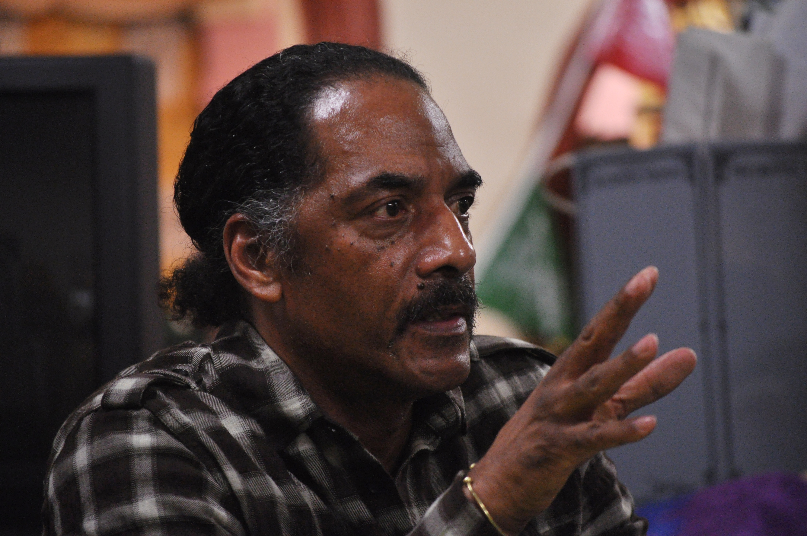
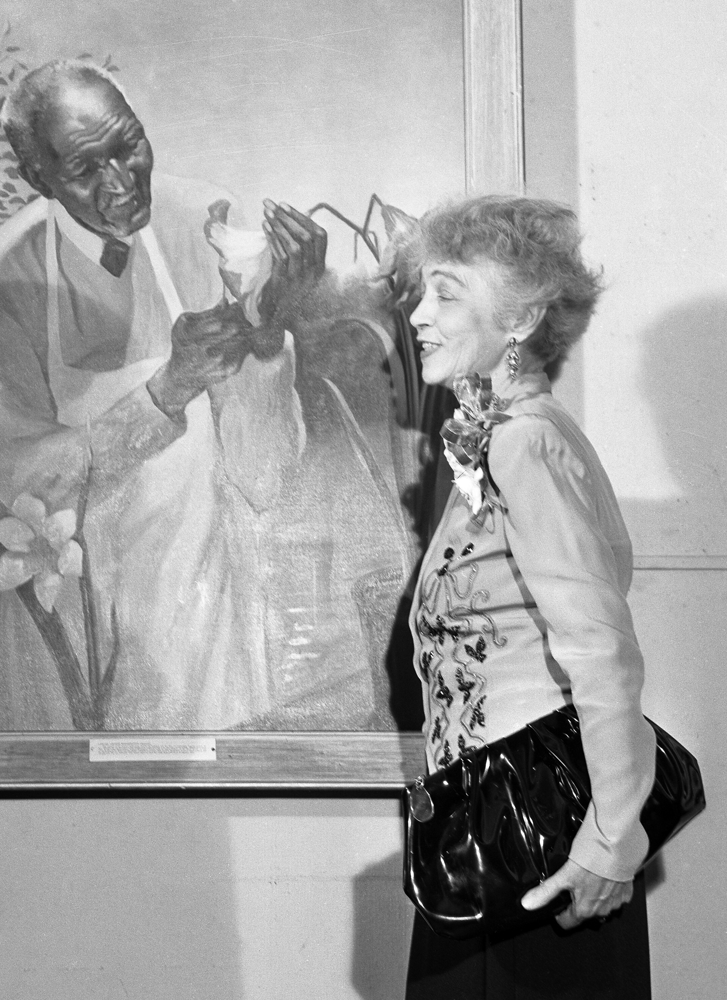
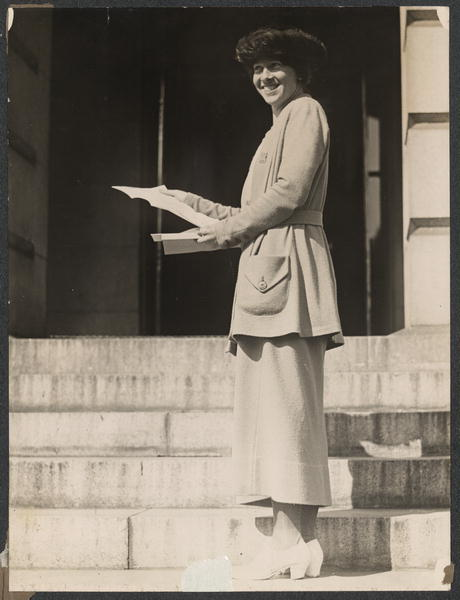
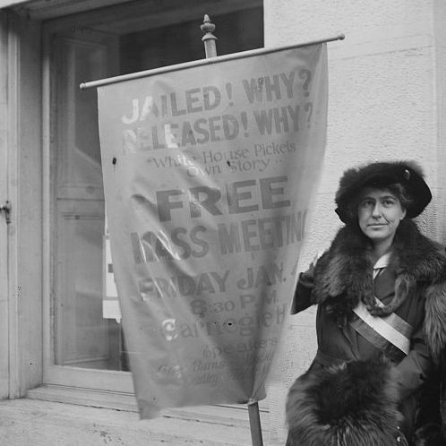
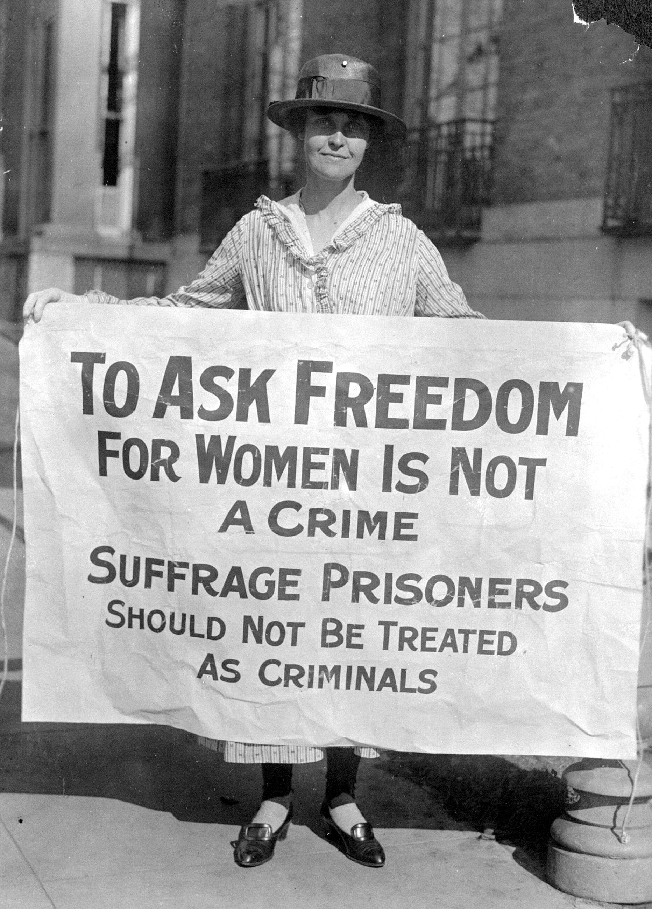
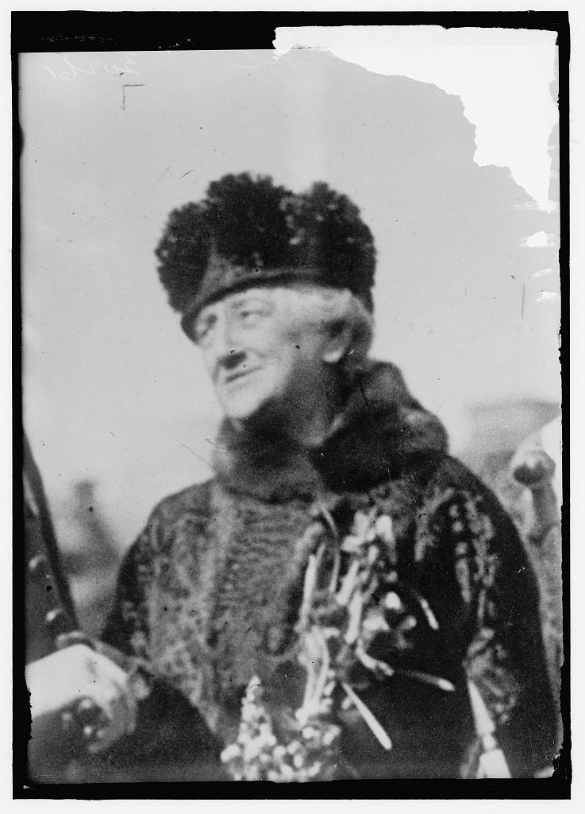

# Batch 258 photo credits and preview

Verified September 8, 2026. Six missing-photo assignments. Every downloaded source file is retained unchanged: no new cropping, retouching, reconstruction or AI generation. Existing source crops are explicitly identified below. Sources are provenance, not prisoner personal/support websites.

## Aaron Dixon

- Source: https://commons.wikimedia.org/wiki/File:Aaron_Dixon_01.jpg
- Original file: https://upload.wikimedia.org/wikipedia/commons/a/af/Aaron_Dixon_01.jpg
- Credit: Joe Mabel, April 20, 2012.
- Rights: CC BY-SA 3.0: https://creativecommons.org/licenses/by-sa/3.0
- Identity: Photographer identifies Aaron Dixon speaking at L.E.M.S. Life Enrichment Bookstore in Seattle; matches the Seattle Black Panther organizer.
- Preparation: Source file unchanged; existing source crop retained where the filename specifies a crop.
- SHA-256: `b5ef6ec390e8733fb82e8bdb568bcdccdf08b38d00ea2e30a3958f8ae046e027`

## Betsy Graves Reyneau

- Source: https://commons.wikimedia.org/wiki/File:Betsy_Graves_Reyneau_1948_crop.jpg
- Original file: https://upload.wikimedia.org/wikipedia/commons/0/09/Betsy_Graves_Reyneau_1948_crop.jpg
- Credit: Los Angeles Times Photographic Collection, UCLA Library Special Collections. Rights holder: The Regents of the University of California. April 5, 1948. https://digital.library.ucla.edu/catalog/ark:/21198/zz0002nbnb
- Rights: CC BY 4.0: https://creativecommons.org/licenses/by/4.0
- Identity: UCLA catalog identifies Betsy Graves Reyneau at right beside her painting of George Washington Carver. This existing Commons crop retains Reyneau and the painting.
- Preparation: Source file unchanged; existing source crop retained where the filename specifies a crop.
- SHA-256: `85c8bcb13b4e35135ad153839e0450284bc2dfa3ac13a9593b20eb8213b2a2a4`

## Catherine M. Flanagan

- Source: https://commons.wikimedia.org/wiki/File:Catherine_Flanagan_1920.jpg
- Original file: https://upload.wikimedia.org/wikipedia/commons/7/76/Catherine_Flanagan_1920.jpg
- Credit: National Photo Company, Library of Congress, 1920. https://www.loc.gov/item/mnwp000015/
- Rights: Public domain in the United States; archival photograph published before 1931, as documented by the linked Commons record.
- Identity: Library of Congress identifies Catherine Flanagan delivering the Connecticut suffrage ratification; matches the Connecticut suffragist.
- Preparation: Source file unchanged; existing source crop retained where the filename specifies a crop.
- SHA-256: `628939e97504d6264991e03e8e5ca81a8f7f9f20c406659712e61fc0f346beed`

## Julia Hurlbut

- Source: https://commons.wikimedia.org/wiki/File:Julia_Hurlbut_suffragist_LOC_23544939844_(cropped).jpg
- Original file: https://upload.wikimedia.org/wikipedia/commons/2/22/Julia_Hurlbut_suffragist_LOC_23544939844_%28cropped%29.jpg
- Credit: Bain News Service, Library of Congress, approximately 1915–1920. https://hdl.loc.gov/loc.pnp/ggbain.25805
- Rights: Public domain in the United States; archival photograph published before 1931, as documented by the linked Commons record.
- Identity: The existing Commons crop identifies Julia Hurlbut in the Bain photograph captioned Julia Hurlbut -- Mrs. J.W. Brannan; retains the suffragist beside the meeting banner.
- Preparation: Source file unchanged; existing source crop retained where the filename specifies a crop.
- SHA-256: `d55c9cef25151b80591b34bcee4bd30d9f4631ef4c48da43a3973049f890cc2e`

## Mary Winsor

- Source: https://commons.wikimedia.org/wiki/File:Mary_Winsor_(suffragist),_cropped_2.jpg
- Original file: https://upload.wikimedia.org/wikipedia/commons/f/fe/Mary_Winsor_%28suffragist%29%2C_cropped_2.jpg
- Credit: Harris & Ewing, Library of Congress, 1917. https://www.loc.gov/item/mnwp000225/
- Rights: Public domain in the United States; archival photograph published before 1931, as documented by the linked Commons record.
- Identity: Library of Congress identifies Mary Winsor of Pennsylvania holding the suffrage prisoners banner; matches the jailed suffragist.
- Preparation: Source file unchanged; existing source crop retained where the filename specifies a crop.
- SHA-256: `0558c63fb9e90f74f657729cc50124287ca7aa2b959e26d210df15a933403fc2`

## Louisine Havemeyer

- Source: https://commons.wikimedia.org/wiki/File:Havemeyer,_Louisine_Elder._Suffragette_LCCN2016869912.jpg
- Original file: https://upload.wikimedia.org/wikipedia/commons/9/94/Havemeyer%2C_Louisine_Elder._Suffragette_LCCN2016869912.jpg
- Credit: Harris & Ewing, Library of Congress, 1919. https://www.loc.gov/pictures/item/2016869912/
- Rights: Public domain in the United States; archival photograph published before 1931, as documented by the linked Commons record.
- Identity: Harris & Ewing catalog identifies Louisine Elder Havemeyer, suffragette; matches the imprisoned suffrage activist.
- Preparation: Source file unchanged; existing source crop retained where the filename specifies a crop.
- SHA-256: `a55851bbd95aebff6e161c6d2ce20c94a648435380419fd749d69ea384d63d8d`
