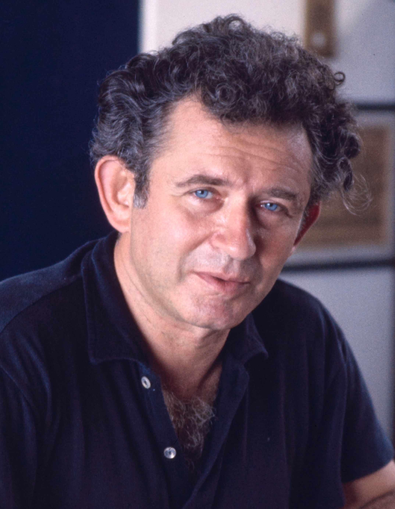
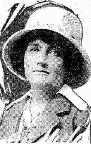
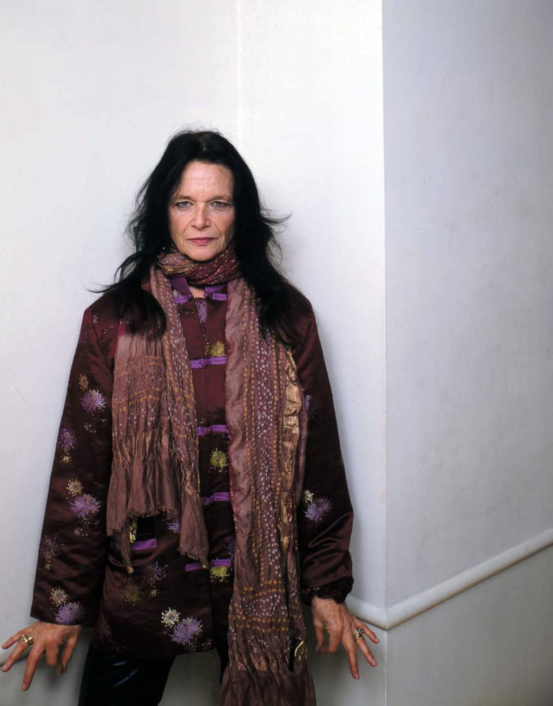
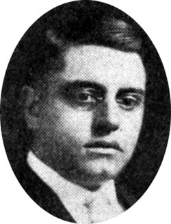
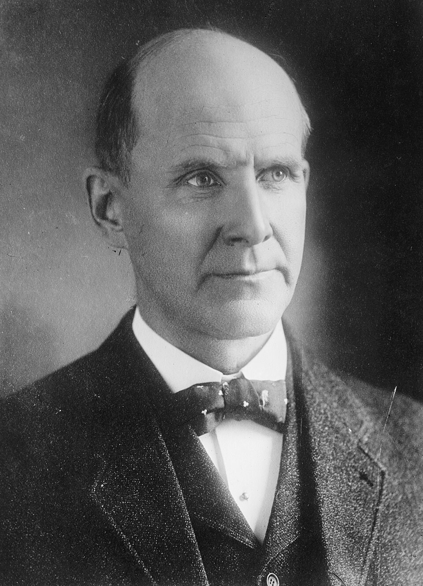
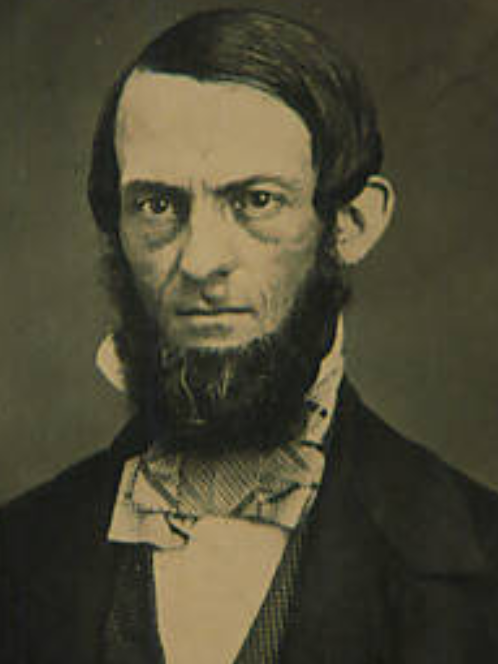
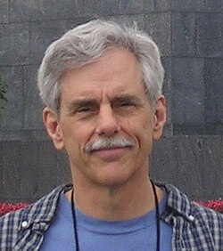
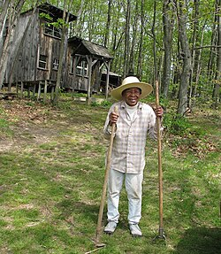
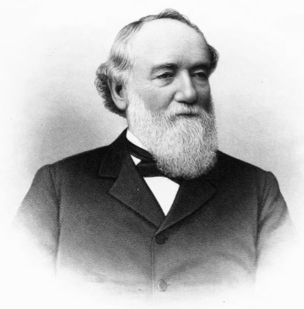
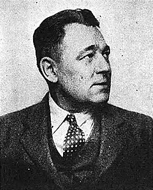

# Batch 259 portrait previews and credits

Ten new missing-photo assignments, researched September 8, 2026. No biographies, dates, cases or personal website fields change. No new cropping, retouching or AI processing. Where Wikimedia supplied a thumbnail, those downloaded bytes are retained unchanged; source-side crops/edits remain as published. Small press photographs and the full-length Juanita Nelson photograph retain their original limitations.

## Norman Mailer

- Source: https://commons.wikimedia.org/wiki/File:Norman_Mailer_writing,_cropped_(2).jpg
- Credit: Bernard Gotfryd, 1967. Library of Congress, LC-DIG-gtfy-02666. https://hdl.loc.gov/loc.pnp/gtfy.02666
- Rights: Library of Congress: no known restrictions on publication; Commons marks public domain. Collection rights: https://hdl.loc.gov/loc.pnp/res.592.gotf
- Identity: Archival caption identifies writer Norman Mailer, matching the novelist arrested during the 1967 Pentagon protest.
- Preparation: Downloaded source file retained unchanged; any existing source-side crop or edit retained.
- Download: https://upload.wikimedia.org/wikipedia/commons/4/46/Norman_Mailer_writing%2C_cropped_%282%29.jpg
- Original image: https://upload.wikimedia.org/wikipedia/commons/4/46/Norman_Mailer_writing%2C_cropped_%282%29.jpg
- SHA-256: `1bbed24497639a67d858b84e166e7b8f137f62c6b8422c3ede867b19e81d2c1d`

## Paula Jakobi

- Source: https://commons.wikimedia.org/wiki/File:Paula_O._Jakobi.jpg
- Credit: Photographer unknown, New York Tribune, January 11, 1914; via Turning Point Suffragist Memorial and Wikimedia Commons.
- Rights: Public domain in the United States; historical publication before 1931, as documented by the source record.
- Identity: Source identifies Paula O. Jakobi, matching Paula Jakobi, the National Woman Party suffragist. Small historical newsprint portrait, 152 by 241 pixels.
- Preparation: Downloaded source file retained unchanged; any existing source-side crop or edit retained.
- Download: https://upload.wikimedia.org/wikipedia/commons/4/41/Paula_O._Jakobi.jpg
- Original image: https://upload.wikimedia.org/wikipedia/commons/4/41/Paula_O._Jakobi.jpg
- SHA-256: `4435603263ee09f8bcd3b588b4478d550e7e56d0b2fc7cf8c45dc6105385a373`

## Anne Waldman

- Source: https://commons.wikimedia.org/wiki/File:Anne_Waldman,_author_photo,_The_Iovis_Trilogy,_Coffee_House_Press,_2011,_Greg_Fuchs.jpg
- Credit: Greg Fuchs for Coffee House Press, 2011.
- Rights: CC BY 4.0: https://creativecommons.org/licenses/by/4.0
- Identity: Publisher author photograph identifies poet Anne Waldman; matches the Naropa co-founder in the existing profile.
- Preparation: Downloaded source file retained unchanged; any existing source-side crop or edit retained.
- Download: https://upload.wikimedia.org/wikipedia/commons/c/ca/Anne_Waldman%2C_author_photo%2C_The_Iovis_Trilogy%2C_Coffee_House_Press%2C_2011%2C_Greg_Fuchs.jpg
- Original image: https://upload.wikimedia.org/wikipedia/commons/c/ca/Anne_Waldman%2C_author_photo%2C_The_Iovis_Trilogy%2C_Coffee_House_Press%2C_2011%2C_Greg_Fuchs.jpg
- SHA-256: `3f0895f472bd96f1c68cfaabd96f572e8be5a9f314a660130799436d7a14a236`

## Dennis Batt

- Source: https://commons.wikimedia.org/wiki/File:Dennis_E._Batt_1924_Edit.png
- Credit: Photographer unknown; 1924 press portrait. https://babel.hathitrust.org/cgi/pt?id=mdp.39015075001332&seq=412&view=1up
- Rights: Public domain in the United States; historical publication before 1931, as documented by the source record.
- Identity: Caption identifies Dennis E. Batt, matching Dennis Elihu Batt, the Michigan labor journalist.
- Preparation: Wikimedia-provided thumbnail; retained unchanged. Original source linked separately.
- Download: https://thumb.wikimedia.org/wikipedia/commons/thumb/2/27/Dennis_E._Batt_1924_Edit.png/250px-Dennis_E._Batt_1924_Edit.png
- Original image: https://upload.wikimedia.org/wikipedia/commons/2/27/Dennis_E._Batt_1924_Edit.png
- SHA-256: `3435f33125726f2ec51c4b694515fd28a7d66f352e4a9b6cf7c7f420930a252b`

## Eugene Debs

- Source: https://commons.wikimedia.org/wiki/File:Eugene_Debs_portrait.jpeg
- Credit: Bain News Service, photographer unknown, circa 1912. Library of Congress: https://www.loc.gov/item/2014680881/
- Rights: Public domain in the United States; historical publication before 1931, as documented by the source record.
- Identity: Archive identifies Eugene V. Debs, the labor organizer and Socialist presidential candidate in this profile.
- Preparation: Wikimedia-provided thumbnail; retained unchanged. Original source linked separately.
- Download: https://thumb.wikimedia.org/wikipedia/commons/thumb/a/a6/Eugene_Debs_portrait.jpeg/960px-Eugene_Debs_portrait.jpeg
- Original image: https://upload.wikimedia.org/wikipedia/commons/a/a6/Eugene_Debs_portrait.jpeg
- SHA-256: `5e39acf568f9e4ed2db2e7518983ada409f6d2969b4ffce9dc56aef5208e08b1`

## Henry E. Peck

- Source: https://commons.wikimedia.org/wiki/File:Henry_Peck_abolitionist_professor_from_Oberlin_College_in_Ohio_and_ambassador_to_Haiti_(cropped).png
- Credit: Photographer unknown; Oberlin College Archives / Ohio Memory. https://ohiomemory.org/digital/collection/p267401coll36/id/10862/
- Rights: Public domain in the United States; historical publication before 1931, as documented by the source record.
- Identity: Source identifies Henry Peck, Oberlin professor, abolitionist and diplomat; matches the Oberlin-Wellington Rescue prisoner.
- Preparation: Downloaded source file retained unchanged; any existing source-side crop or edit retained.
- Download: https://upload.wikimedia.org/wikipedia/commons/b/b6/Henry_Peck_abolitionist_professor_from_Oberlin_College_in_Ohio_and_ambassador_to_Haiti_%28cropped%29.png
- Original image: https://upload.wikimedia.org/wikipedia/commons/b/b6/Henry_Peck_abolitionist_professor_from_Oberlin_College_in_Ohio_and_ambassador_to_Haiti_%28cropped%29.png
- SHA-256: `0223292a6354015af0b0dc4de6126df6494b5ba528f615fdf9cfb0872c36df82`

## Howard Morland

- Source: https://commons.wikimedia.org/wiki/File:Howard_Morland_2008.jpg
- Credit: howard_morland, Flickr, 2008; via Wikimedia Commons.
- Rights: CC BY 2.0: https://creativecommons.org/licenses/by/2.0
- Identity: Self-published photograph identifies Howard Morland, the nuclear-weapons journalist and former Air Force pilot in the profile.
- Preparation: Wikimedia-provided thumbnail; retained unchanged. Original source linked separately.
- Download: https://thumb.wikimedia.org/wikipedia/commons/thumb/d/d3/Howard_Morland_2008.jpg/250px-Howard_Morland_2008.jpg
- Original image: https://upload.wikimedia.org/wikipedia/commons/d/d3/Howard_Morland_2008.jpg
- SHA-256: `091ea2d65d8af18816c6d891634cbc2b73cfdb9ed7c87e6d06e4918e64f217de`

## Juanita Morrow Nelson

- Source: https://commons.wikimedia.org/wiki/File:Juanita_Nelson.jpg
- Credit: Icebar1, 2010, via Wikimedia Commons.
- Rights: CC BY 3.0: https://creativecommons.org/licenses/by/3.0
- Identity: Photographer identifies Juanita Nelson outside her Deerfield, Massachusetts home; matches the war-tax resister Juanita Morrow Nelson.
- Preparation: Wikimedia-provided thumbnail; retained unchanged. Original source linked separately.
- Download: https://thumb.wikimedia.org/wikipedia/commons/thumb/5/52/Juanita_Nelson.jpg/250px-Juanita_Nelson.jpg
- Original image: https://upload.wikimedia.org/wikipedia/commons/5/52/Juanita_Nelson.jpg
- SHA-256: `5fb0b192ec2b47635bfc76af2caec6fc0eccd1013dcff762aacd70280d6783ed`

## Ralph Plumb

- Source: https://commons.wikimedia.org/wiki/File:Ralph_Plumb_(1816%E2%80%931903).png
- Credit: Photographer unknown. Biographical Dictionary and Portrait Gallery of the Representative Men of the United States: Illinois Volume, 1896, pages 230–231.
- Rights: Public domain in the United States; historical publication before 1931, as documented by the source record.
- Identity: Source identifies Ralph Plumb (1816–1903), matching the Oberlin abolitionist and later Illinois congressman.
- Preparation: Downloaded source file retained unchanged; any existing source-side crop or edit retained.
- Download: https://upload.wikimedia.org/wikipedia/commons/e/e2/Ralph_Plumb_%281816%E2%80%931903%29.png
- Original image: https://upload.wikimedia.org/wikipedia/commons/e/e2/Ralph_Plumb_%281816%E2%80%931903%29.png
- SHA-256: `9360a0dd748dc4def31ed5ae27cab41b50b73c08c6b42704f0124b4bb9a448f8`

## William F. Dunne

- Source: https://commons.wikimedia.org/wiki/File:William_F._Dunne_1928_Edit.jpg
- Credit: Photographer unknown, 1928 newspaper portrait. https://babel.hathitrust.org/cgi/pt?id=osu.32435063593891&seq=87&view=1up
- Rights: Public domain in the United States; historical publication before 1931, as documented by the source record.
- Identity: Caption identifies William F. Dunne, Daily Worker editor, matching the labor journalist in the profile.
- Preparation: Wikimedia-provided thumbnail; retained unchanged. Original source linked separately.
- Download: https://thumb.wikimedia.org/wikipedia/commons/thumb/0/07/William_F._Dunne_1928_Edit.jpg/250px-William_F._Dunne_1928_Edit.jpg
- Original image: https://upload.wikimedia.org/wikipedia/commons/0/07/William_F._Dunne_1928_Edit.jpg
- SHA-256: `10c6cd990f97c723347f62c93f19c53fa8d0e9d3cfb9dd22b26c84a41eb2b040`
