# Batch 260 — 50 portrait previews and credits

Fifty additional missing-photo assignments, researched September 8, 2026. Each selected source image was visually inspected. The original downloaded files are retained unchanged, including source-side crops, historical edits and provider-generated thumbnails. No new pixel edits or AI reconstruction were made. Small and grainy historical portraits remain small and grainy.

Rights vary by image. Public-domain and Creative Commons labels below follow the linked archive/file records. Five biographical images have no open reuse license; they are explicitly identified rather than represented as public domain. James Omura has a noncommercial share-alike license. These credits do not grant blanket permission for merchandise or unrelated reuse.

## Abram Flaxer

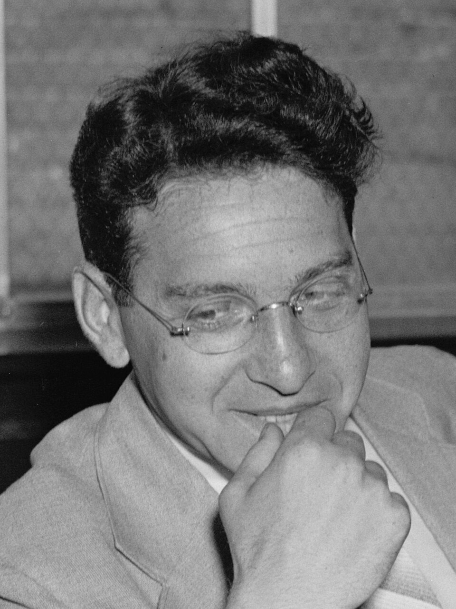

- Source: https://commons.wikimedia.org/wiki/File:C.I.O._to_organize_city_and_state_employees._Washington_D.C.,_July_13._A_nation_wide_campaign_to_organize_state,_county_and_city_employees_was_announced_by_John_L._Lewis,_chief_of_the_LCCN2016871994_Crop.jpg
- Credit: Harris & Ewing, photographer; Library of Congress Catalog: https://lccn.loc.gov/2016871994 Image download: https://cdn.loc.gov/service/pnp/hec/23000/23018v.jpg Original url: https://www.loc.gov/pictures/item/2016871994/; https://lccn.loc.gov/2016871994 ; https://cdn.loc.gov/service/pnp/hec/23000/23018v.jpg
- Rights: Public domain, as documented in the linked source/file record.
- Identity: Harris & Ewing caption identifies United Public Workers organizer Abram Flaxer; the source crop isolates him from a 1937 union announcement photograph.
- Downloaded image: https://thumb.wikimedia.org/wikipedia/commons/thumb/8/80/C.I.O._to_organize_city_and_state_employees._Washington_D.C.%2C_July_13._A_nation_wide_campaign_to_organize_state%2C_county_and_city_employees_was_announced_by_John_L._Lewis%2C_chief_of_the_LCCN2016871994_Crop.jpg/960px-thumbnail.jpg
- Source image: https://upload.wikimedia.org/wikipedia/commons/8/80/C.I.O._to_organize_city_and_state_employees._Washington_D.C.%2C_July_13._A_nation_wide_campaign_to_organize_state%2C_county_and_city_employees_was_announced_by_John_L._Lewis%2C_chief_of_the_LCCN2016871994_Crop.jpg
- Dimensions: 960 × 1279
- SHA-256: `f0981c719b562ddf5406ee65014aeb33ea1d2c2c30a14a0d79bc7f3841ae8a17`

## Arthur Lee Washington Jr.

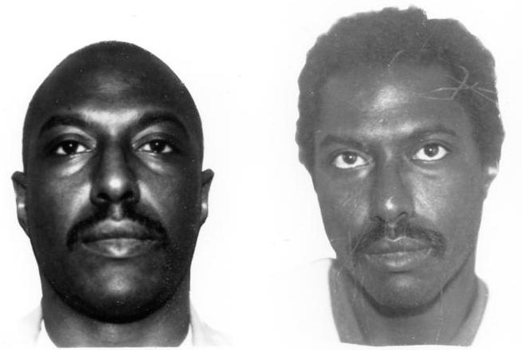

- Source: https://commons.wikimedia.org/wiki/File:Arthur_Lee_Washington,_Jr.jpg
- Credit: Federal Bureau of Investigation; https://www.fbi.gov/wanted/topten/topten-history/hires_images/FBI-427-ArthurLeeWashingtonJr.jpg/view; https://www.fbi.gov/wanted/topten/topten-history/hires_images/FBI-427-ArthurLeeWashingtonJr.jpg/view
- Rights: CC0: http://creativecommons.org/publicdomain/zero/1.0/deed.en
- Identity: FBI identifies Arthur Lee Washington Jr.; both views on the wanted image depict the same person named in this profile.
- Downloaded image: https://thumb.wikimedia.org/wikipedia/commons/thumb/f/f9/Arthur_Lee_Washington%2C_Jr.jpg/250px-Arthur_Lee_Washington%2C_Jr.jpg
- Source image: https://upload.wikimedia.org/wikipedia/commons/f/f9/Arthur_Lee_Washington%2C_Jr.jpg
- Dimensions: 655 × 439
- SHA-256: `581e1613e6704f0c24ab451863f80cafe816487895fc59a89a05b6399fa0ae4f`

## Ben Boloff

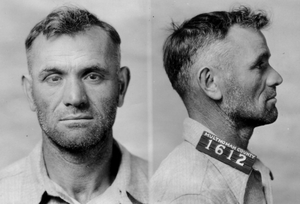

- Source: https://commons.wikimedia.org/wiki/File:Ben_Boloff.png
- Credit: Multnomah County; Portland Auditor's Office
- Rights: Public domain, as documented in the linked source/file record.
- Identity: Multnomah County booking photograph identifies Ben Boloff, the Oregon criminal-syndicalism defendant; front and profile views are retained.
- Downloaded image: https://thumb.wikimedia.org/wikipedia/commons/thumb/1/16/Ben_Boloff.png/250px-Ben_Boloff.png
- Source image: https://upload.wikimedia.org/wikipedia/commons/1/16/Ben_Boloff.png
- Dimensions: 597 × 407
- SHA-256: `412edc47e78bb8f65f6d4cf0edc033cd5b7dfa49ab33d74e85f8105e6f9f9f4e`

## Bill Ayers

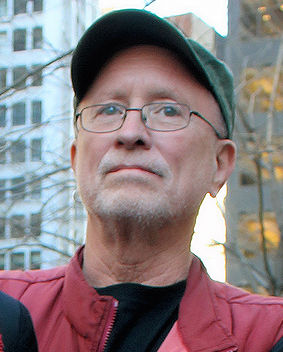

- Source: https://commons.wikimedia.org/wiki/File:Bill_Ayres_2012.jpg
- Credit: Joe Lustri; File:Dohrn and Ayers in Zuccotti Park.jpg
- Rights: CC BY-SA 2.0: https://creativecommons.org/licenses/by-sa/2.0
- Identity: Photographer identifies Bill Ayers at Occupy Wall Street in 2012; matches the Weather Underground organizer and education professor.
- Downloaded image: https://thumb.wikimedia.org/wikipedia/commons/thumb/b/b1/Bill_Ayres_2012.jpg/250px-Bill_Ayres_2012.jpg
- Source image: https://upload.wikimedia.org/wikipedia/commons/b/b1/Bill_Ayres_2012.jpg
- Dimensions: 283 × 352
- SHA-256: `b1aaebadf798ddc15099334c9dce24adbb5d70c265bdfea1ff54b5dc1691e814`

## Bill Gebert

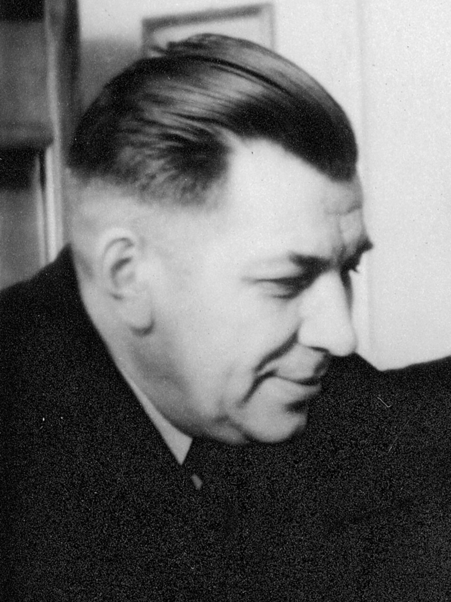

- Source: https://commons.wikimedia.org/wiki/File:Boles%C5%82aw_Gebert_1948.jpg
- Credit: Socialist Press Agency, courtesy of National Digital Archives; https://www.szukajwarchiwach.gov.pl/en/jednostka/-/jednostka/9744057; https://www.szukajwarchiwach.gov.pl/en/jednostka/-/jednostka/9744057
- Rights: CC0: http://creativecommons.org/publicdomain/zero/1.0/deed.en
- Identity: Polish archive identifies Boleslaw Gebert, also known as Bill Gebert, the American Communist labor organizer; an existing individual crop is used.
- Downloaded image: https://thumb.wikimedia.org/wikipedia/commons/thumb/1/15/Boles%C5%82aw_Gebert_1948.jpg/960px-Boles%C5%82aw_Gebert_1948.jpg
- Source image: https://upload.wikimedia.org/wikipedia/commons/1/15/Boles%C5%82aw_Gebert_1948.jpg
- Dimensions: 960 × 1280
- SHA-256: `0327cfe2ddea8f56d89bc6432d115c90474f424851f54b81c37cbc32c3213ec9`

## Charles James Faulkner

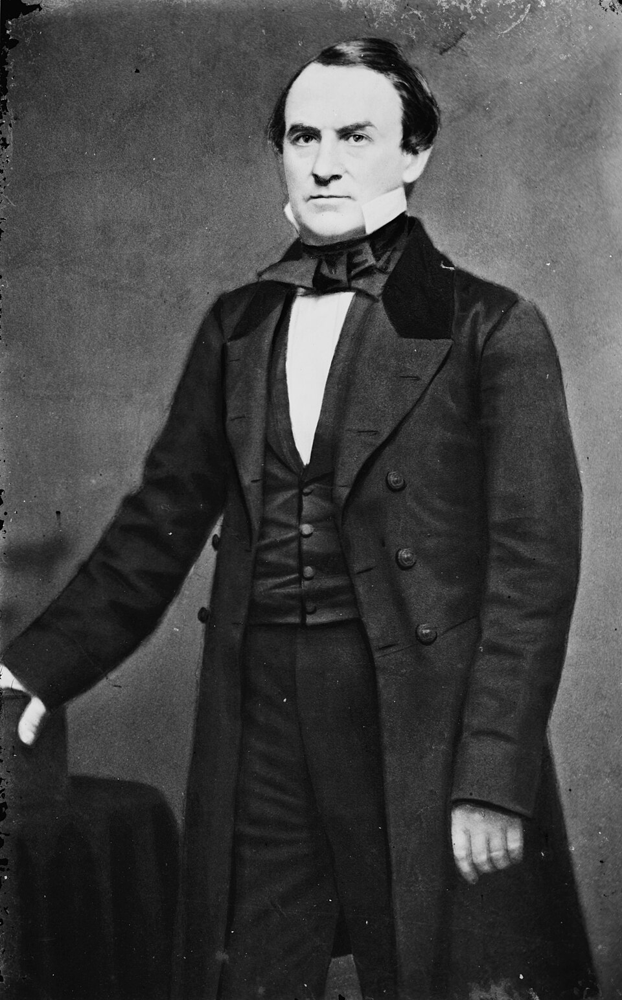

- Source: https://commons.wikimedia.org/wiki/File:Charles_J._Faulkner_1806-1884_-_Brady-Handy.jpg
- Credit: Mathew Benjamin Brady; Library of Congress Prints and Photographs Division. Brady-Handy Photograph Collection. http://hdl.loc.gov/loc.pnp/cwpbh.02424. CALL NUMBER: LC-BH82- 5069 A <P&P>[P&P]; http://hdl.loc.gov/loc.pnp/cwpbh.02424
- Rights: Public domain, as documented in the linked source/file record.
- Identity: Brady-Handy portrait explicitly identifies Charles J. Faulkner (1806–1884), the former minister to France. The younger senator of the same name was rejected.
- Downloaded image: https://thumb.wikimedia.org/wikipedia/commons/thumb/b/b2/Charles_J._Faulkner_1806-1884_-_Brady-Handy.jpg/960px-Charles_J._Faulkner_1806-1884_-_Brady-Handy.jpg
- Source image: https://upload.wikimedia.org/wikipedia/commons/b/b2/Charles_J._Faulkner_1806-1884_-_Brady-Handy.jpg
- Dimensions: 960 × 1543
- SHA-256: `527e58d7f28b7361be7e228b081616d05b8e196621cc2dd2f4ea7f63ee5bee94`

## Charles Krumbein

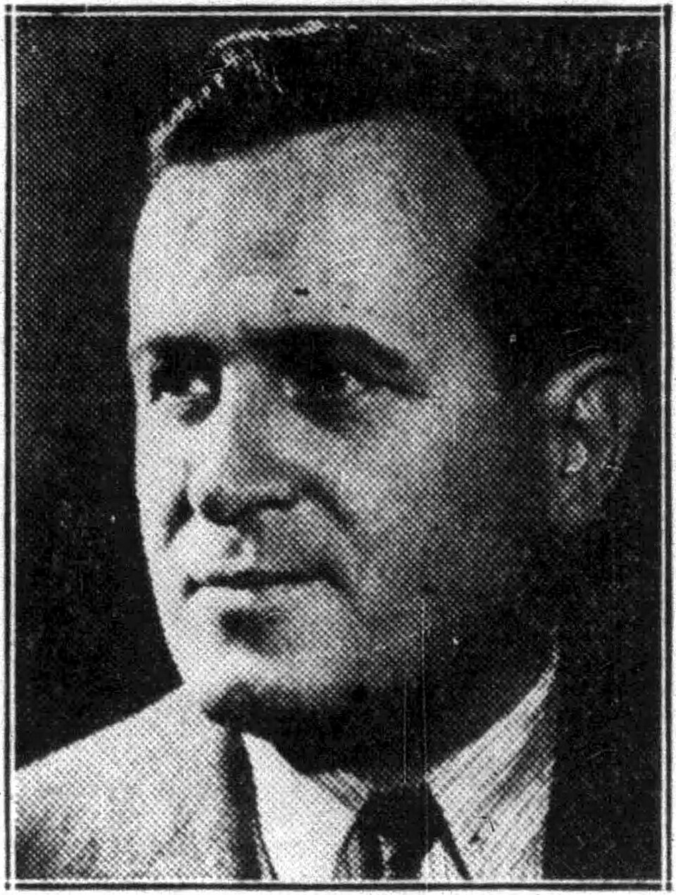

- Source: https://commons.wikimedia.org/wiki/File:Charles_Krumbein_1938_Alt_Edit.jpg
- Credit: Photographer unknown; https://www.newspapers.com/image/1143565668; https://www.newspapers.com/image/1143565668
- Rights: Public domain, as documented in the linked source/file record.
- Identity: Contemporary newspaper portrait caption identifies Charles Krumbein, the New York Communist Party organizer.
- Downloaded image: https://thumb.wikimedia.org/wikipedia/commons/thumb/2/2a/Charles_Krumbein_1938_Alt_Edit.jpg/960px-Charles_Krumbein_1938_Alt_Edit.jpg
- Source image: https://upload.wikimedia.org/wikipedia/commons/2/2a/Charles_Krumbein_1938_Alt_Edit.jpg
- Dimensions: 960 × 1269
- SHA-256: `700118baf0b781ade44370fc3a683d665f02c49675de961e579bd17063be7090`

## Charles S. Morehead

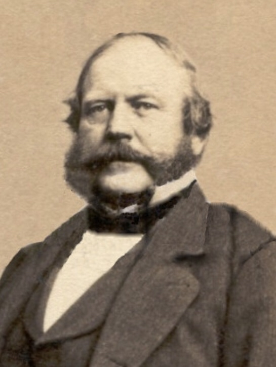

- Source: https://commons.wikimedia.org/wiki/File:Charles_Slaughter_Morehead_(cropped).jpg
- Credit: C. D. Fredricks & Co.; http://www.picturehistory.com/product/id/19569; http://www.picturehistory.com/product/id/19569
- Rights: Public domain, as documented in the linked source/file record.
- Identity: C. D. Fredricks & Co. photograph identifies Charles Slaughter Morehead, the former Kentucky governor detained during the Civil War.
- Downloaded image: https://thumb.wikimedia.org/wikipedia/commons/thumb/5/5c/Charles_Slaughter_Morehead_%28cropped%29.jpg/250px-Charles_Slaughter_Morehead_%28cropped%29.jpg
- Source image: https://upload.wikimedia.org/wikipedia/commons/5/5c/Charles_Slaughter_Morehead_%28cropped%29.jpg
- Dimensions: 545 × 724
- SHA-256: `09beccebce7d736b4127059b46901902ea7b8270951c4b4a6730b056ac463e47`

## Chitto Harjo

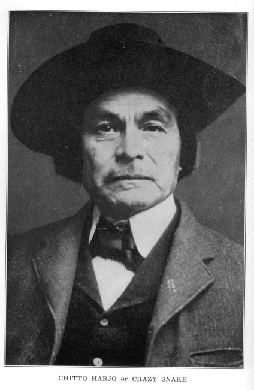

- Source: https://commons.wikimedia.org/wiki/File:Chittoharjo.jpg
- Credit: Photographer not specified; Encyclopedia of Oklahoma History and Culture; http://digital.library.okstate.edu/encyclopedia/entries/H/HA020.html
- Rights: Public domain, as documented in the linked source/file record.
- Identity: Oklahoma historical source and the original caption identify Chitto Harjo, also called Crazy Snake, the Muscogee leader.
- Downloaded image: https://thumb.wikimedia.org/wikipedia/commons/thumb/4/47/Chittoharjo.jpg/250px-Chittoharjo.jpg
- Source image: https://upload.wikimedia.org/wikipedia/commons/4/47/Chittoharjo.jpg
- Dimensions: 424 × 651
- SHA-256: `47f15293a3d0a5a59b7ec4cbc721a5831f81b81a67d08b6f865867e95323a418`

## Clennon Washington King Jr.

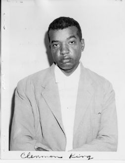

- Source: https://en.wikipedia.org/wiki/File:Clennon_Washington_King_Jr.jpg
- Credit: Unknown; Original publication: Unknown Immediate source: Mississippi Encyclopedia
- Rights: Copyrighted; the linked source supplies this low-resolution biographical image under a fair-use rationale. No open reuse license or permission for unrelated reuse is asserted.
- Identity: Mississippi Encyclopedia portrait identifies Clennon King, the Black educator confined after attempting to enroll at the University of Mississippi.
- Downloaded image: https://upload.wikimedia.org/wikipedia/en/b/b9/Clennon_Washington_King_Jr.jpg
- Source image: https://upload.wikimedia.org/wikipedia/en/b/b9/Clennon_Washington_King_Jr.jpg
- Dimensions: 253 × 328
- SHA-256: `adb4975c44ca2c3b6b8e7190ad1999c31ca6dc69edea89cb9c69312520f31fd1`

## Dominador Gómez

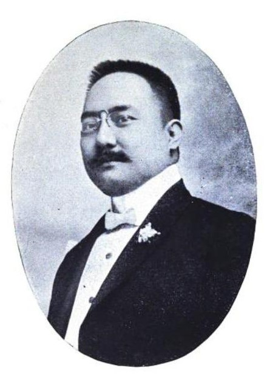

- Source: https://commons.wikimedia.org/wiki/File:Dominador_G%C3%B3mez.jpg
- Credit: Anthony R. Tuohy, suplemento español del The Far Eastern Review, Manila I.F.; Historical Album of the First Philippine Assembly (1908); https://books.google.com.ph/books?id=kUcPAAAAYAAJ&pg=PA45&redir_esc=y#v=onepage&q=dominador%20gomez&f=false
- Rights: Public domain, as documented in the linked source/file record.
- Identity: The 1908 Philippine Assembly album identifies Dominador Gomez, the Philippine labor and nationalist organizer in this profile.
- Downloaded image: https://thumb.wikimedia.org/wikipedia/commons/thumb/1/14/Dominador_G%C3%B3mez.jpg/250px-Dominador_G%C3%B3mez.jpg
- Source image: https://upload.wikimedia.org/wikipedia/commons/1/14/Dominador_G%C3%B3mez.jpg
- Dimensions: 440 × 634
- SHA-256: `a421155ae2931bc69353582ec61fba3f116006899726cc466e6ca9d876fe947c`

## Doris Stevens

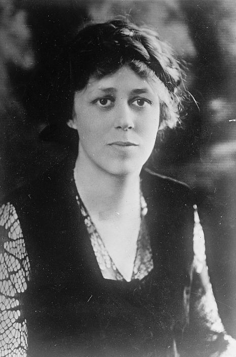

- Source: https://commons.wikimedia.org/wiki/File:Miss_Doris_Stevens,_youngest_member_09395v.jpg
- Credit: Photographer not specified; This image is available from the United States Library of Congress's Prints and Photographs division under the digital ID hec.09395.This tag does not indicate the copyright status of the attached work. A normal copyright tag is still required. See Commons:Licensing.; https://hdl.loc.gov/loc.pnp/hec.09395
- Rights: Public domain, as documented in the linked source/file record.
- Identity: Harris & Ewing caption identifies Doris Stevens of the National Woman Party and explicitly describes her Occoquan sentence.
- Downloaded image: https://thumb.wikimedia.org/wikipedia/commons/thumb/b/b0/Miss_Doris_Stevens%2C_youngest_member_09395v.jpg/250px-Miss_Doris_Stevens%2C_youngest_member_09395v.jpg
- Source image: https://upload.wikimedia.org/wikipedia/commons/b/b0/Miss_Doris_Stevens%2C_youngest_member_09395v.jpg
- Dimensions: 464 × 700
- SHA-256: `40199a05280cd9767dd0ffb5417841858df43620b0daa2c122545a4b4602bf86`

## Edward James Olmos

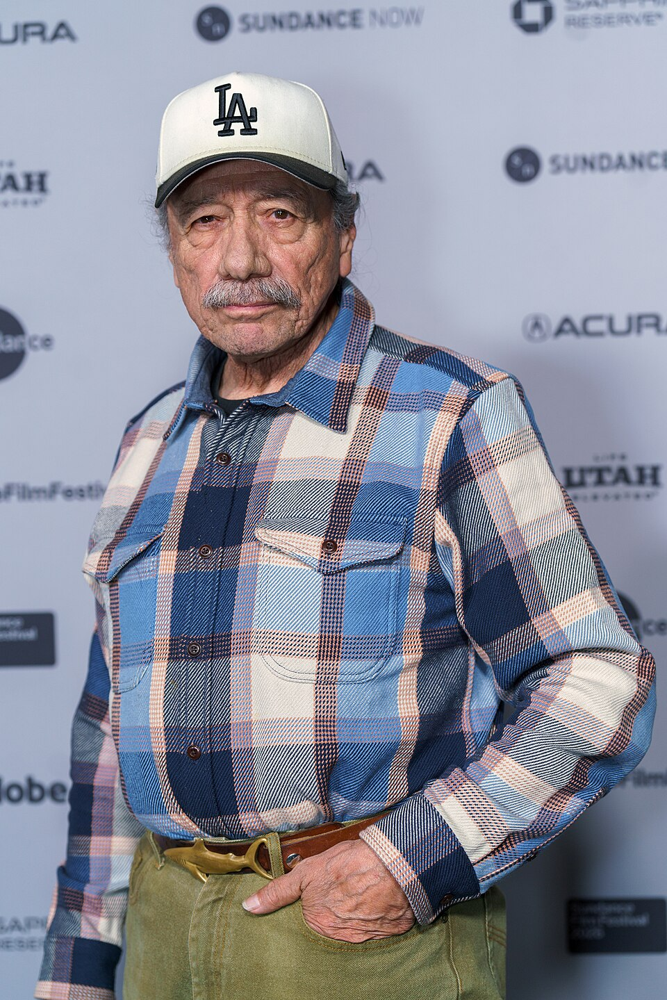

- Source: https://commons.wikimedia.org/wiki/File:Edward_James_Olmos_at_the_2026_Sundance_Film_Festival.jpg
- Credit: Colleen Sturtevant / WikiPortraits
- Rights: CC BY 4.0: https://creativecommons.org/licenses/by/4.0
- Identity: Photographer identifies actor Edward James Olmos at the 2026 Sundance Film Festival; matches the actor jailed for the Vieques protest.
- Downloaded image: https://thumb.wikimedia.org/wikipedia/commons/thumb/1/18/Edward_James_Olmos_at_the_2026_Sundance_Film_Festival.jpg/960px-Edward_James_Olmos_at_the_2026_Sundance_Film_Festival.jpg
- Source image: https://upload.wikimedia.org/wikipedia/commons/1/18/Edward_James_Olmos_at_the_2026_Sundance_Film_Festival.jpg
- Dimensions: 960 × 1439
- SHA-256: `6d1981ef0cd107c6b3db9b99fb2b1b5e3ace0f3271f8175014f42dcf4409d930`

## Harry Winitsky

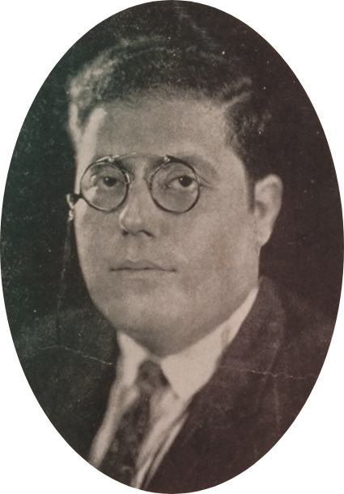

- Source: https://commons.wikimedia.org/wiki/File:Harry_Winitsky_1924_Oval.png
- Credit: Workers Party; https://findingaids.library.nyu.edu/tamwag/graphics_002/images/dz08krzp/; https://findingaids.library.nyu.edu/tamwag/graphics_002/images/dz08krzp/
- Rights: Public domain, as documented in the linked source/file record.
- Identity: Workers Party campaign portrait, preserved by NYU, identifies Harry Winitsky, the New York Communist organizer.
- Downloaded image: https://thumb.wikimedia.org/wikipedia/commons/thumb/f/f4/Harry_Winitsky_1924_Oval.png/250px-Harry_Winitsky_1924_Oval.png
- Source image: https://upload.wikimedia.org/wikipedia/commons/f/f4/Harry_Winitsky_1924_Oval.png
- Dimensions: 425 × 610
- SHA-256: `15242ac97ce8d74b76b620c43949f84be0b23def9552f750781f526e3a1c1e2a`

## Henry David Thoreau

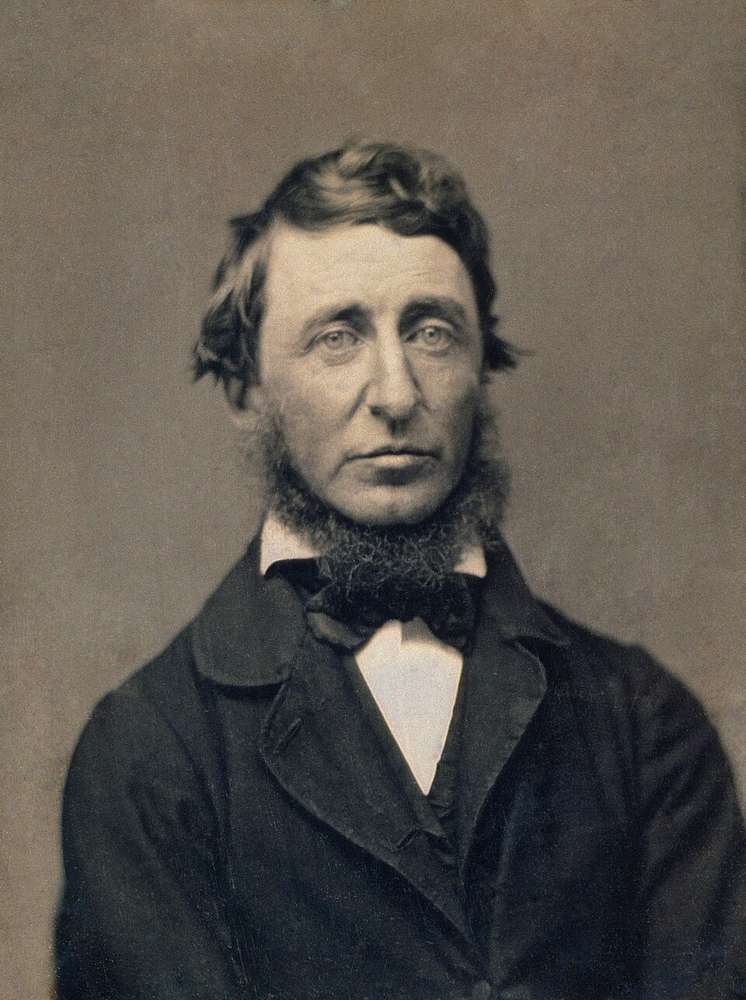

- Source: https://commons.wikimedia.org/wiki/File:Benjamin_D._Maxham_-_Henry_David_Thoreau_-_Restored.jpg
- Credit: Benjamin D. Maxham active 1848 - 1858; National Portrait Gallery; https://en.wikipedia.org/wiki/en:National_Portrait_Gallery_(United_States)
- Rights: Public domain, as documented in the linked source/file record.
- Identity: Benjamin D. Maxham daguerreotype identifies Henry David Thoreau, the Concord writer jailed for refusing the poll tax.
- Downloaded image: https://thumb.wikimedia.org/wikipedia/commons/thumb/f/f0/Benjamin_D._Maxham_-_Henry_David_Thoreau_-_Restored.jpg/960px-Benjamin_D._Maxham_-_Henry_David_Thoreau_-_Restored.jpg
- Source image: https://upload.wikimedia.org/wikipedia/commons/f/f0/Benjamin_D._Maxham_-_Henry_David_Thoreau_-_Restored.jpg
- Dimensions: 960 × 1286
- SHA-256: `6ce84e4e01968625ff8891e5bb772af0d425a36944b538d6aaecba5b73592f45`

## Hosea Williams

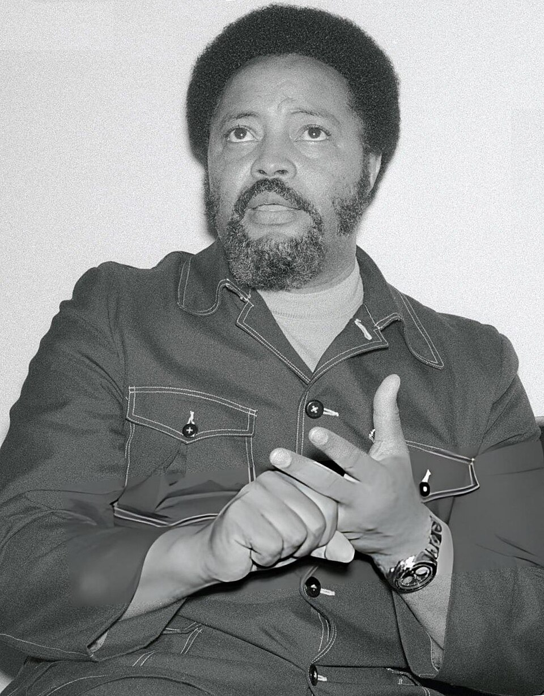

- Source: https://commons.wikimedia.org/wiki/File:Hosea_Williams_1971_by_UPI.jpg
- Credit: United Press International; [1], [2]; https://www.newspapers.com/image/614166021 ; https://www.worthpoint.com/worthopedia/1971-press-photo-reverend-hosea-2106577278
- Rights: Public domain, as documented in the linked source/file record.
- Identity: UPI portrait identifies Hosea Williams, matching the SCLC organizer and Georgia legislator.
- Downloaded image: https://thumb.wikimedia.org/wikipedia/commons/thumb/2/2b/Hosea_Williams_1971_by_UPI.jpg/960px-Hosea_Williams_1971_by_UPI.jpg
- Source image: https://upload.wikimedia.org/wikipedia/commons/2/2b/Hosea_Williams_1971_by_UPI.jpg
- Dimensions: 960 × 1229
- SHA-256: `6e8014b7639cfa98ec4ce9f1f143a6eefbd316fa3f31346216daca8bb54bd277`

## Jack Weinberg

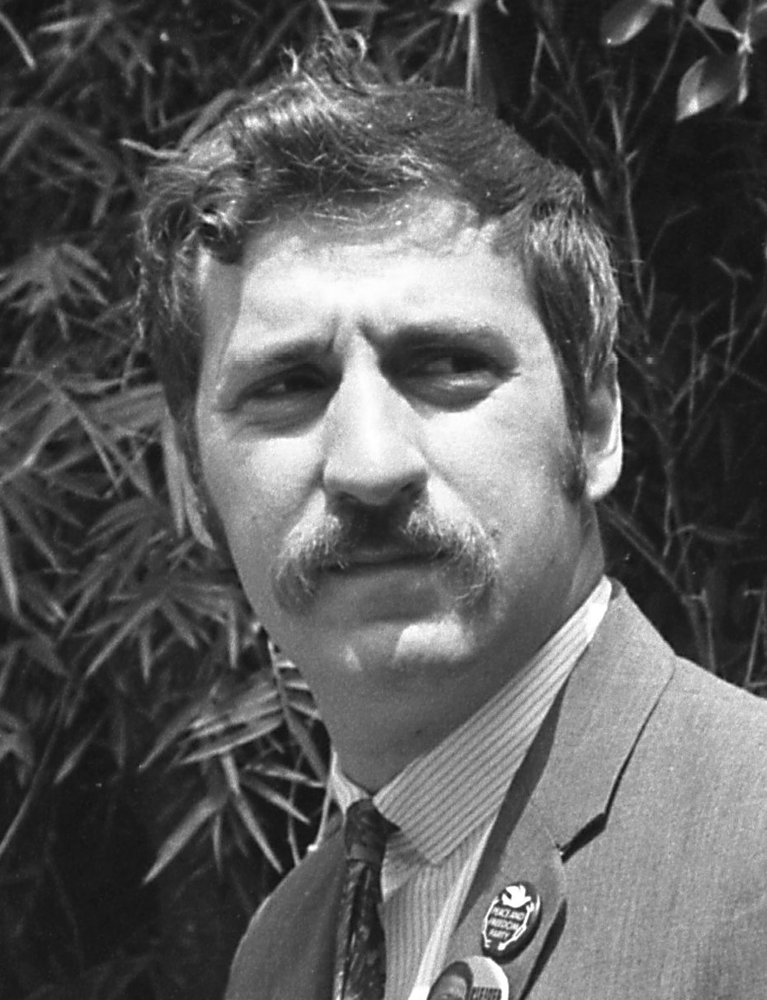

- Source: https://commons.wikimedia.org/wiki/File:Jack_Weinberg,_1968.jpg
- Credit: R. L. Oliver, Los Angeles Times; https://digital.library.ucla.edu/catalog/ark:/21198/zz0002vqdq; https://digital.library.ucla.edu/catalog/ark:/21198/zz0002vqdq
- Rights: CC BY 4.0: https://creativecommons.org/licenses/by/4.0
- Identity: Los Angeles Times/UCLA caption identifies Jack Weinberg at a 1968 press conference. The existing source crop isolates Weinberg.
- Downloaded image: https://thumb.wikimedia.org/wikipedia/commons/thumb/8/89/Jack_Weinberg%2C_1968.jpg/250px-Jack_Weinberg%2C_1968.jpg
- Source image: https://upload.wikimedia.org/wikipedia/commons/8/89/Jack_Weinberg%2C_1968.jpg
- Dimensions: 926 × 1207
- SHA-256: `367337b8eb32356153eced92f31a15ddb73e8c152831686285ab720150258890`

## Jim Wallis

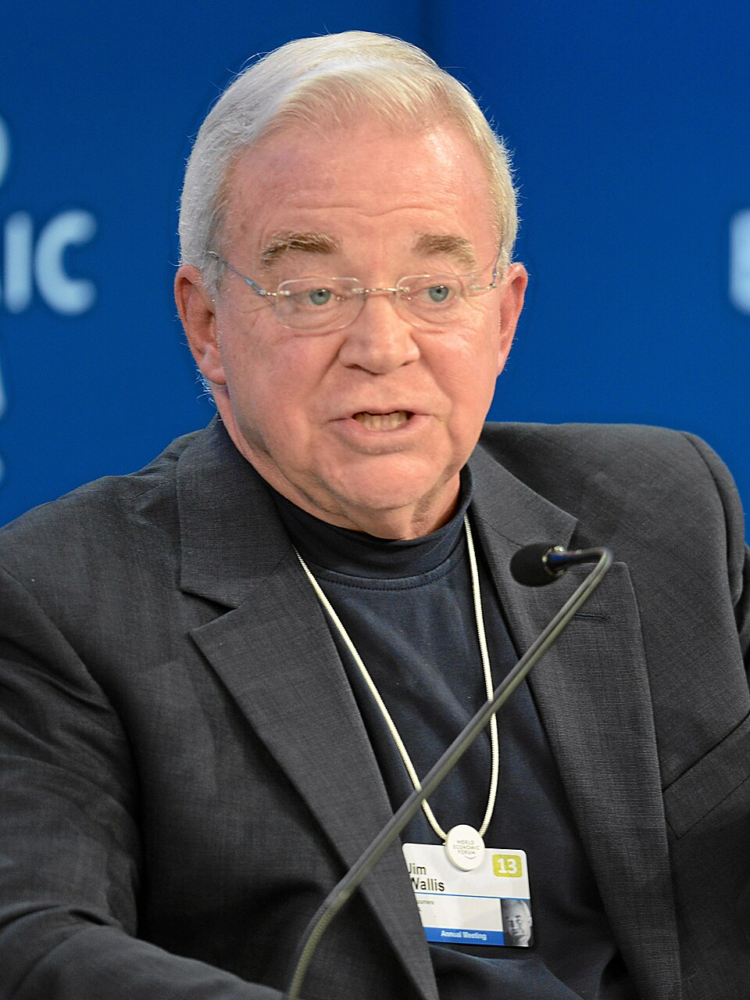

- Source: https://commons.wikimedia.org/wiki/File:Jim_Wallis_World_Economic_Forum_2013_(3x4_cropped).jpg
- Credit: World Economic Forum from Cologny, Switzerland; The Moral Economy: From Social Contract to Social Covenant: Jim Wallis Uploaded by January; https://www.flickr.com/photos/worldeconomicforum/8417324594/
- Rights: CC BY-SA 2.0: https://creativecommons.org/licenses/by-sa/2.0
- Identity: World Economic Forum caption identifies Jim Wallis, Sojourners president, speaking at Davos in 2013.
- Downloaded image: https://thumb.wikimedia.org/wikipedia/commons/thumb/e/e2/Jim_Wallis_World_Economic_Forum_2013_%283x4_cropped%29.jpg/960px-Jim_Wallis_World_Economic_Forum_2013_%283x4_cropped%29.jpg
- Source image: https://upload.wikimedia.org/wikipedia/commons/e/e2/Jim_Wallis_World_Economic_Forum_2013_%283x4_cropped%29.jpg
- Dimensions: 960 × 1279
- SHA-256: `55895b474a4ee919caed8636463a1f90b015cf2c36a77e3093377cb4a9f5bd96`

## John L. Spivak

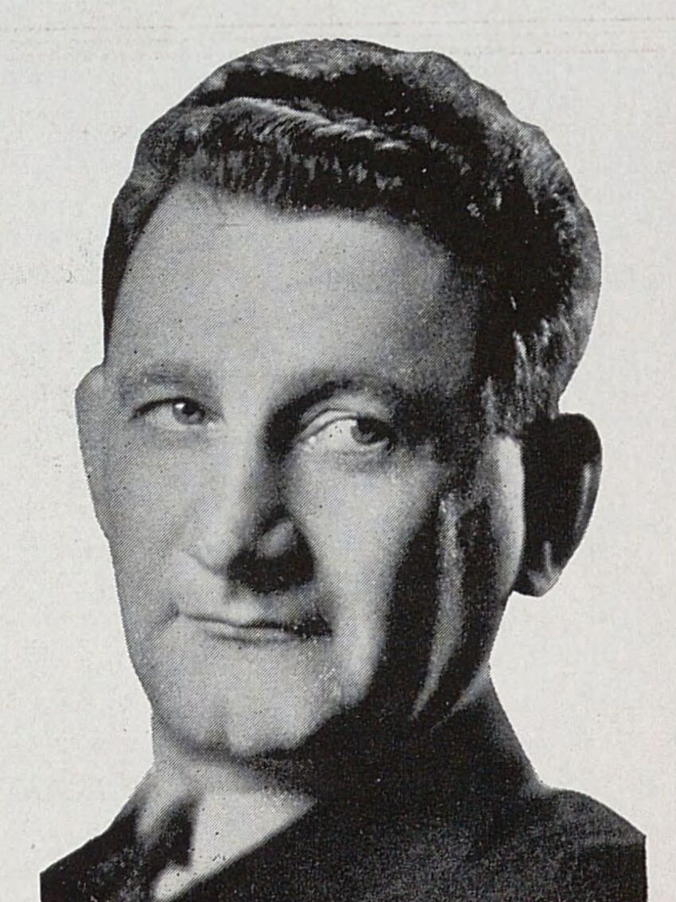

- Source: https://commons.wikimedia.org/wiki/File:Fraternal_Outlook_1939_March_Page_35_Crop.jpg
- Credit: Fraternal Outlook; https://digital.library.pitt.edu/islandora/object/pitt%3A31735047448539/viewer#page/34/mode/2up; https://digital.library.pitt.edu/islandora/object/pitt%3A31735047448539/viewer#page/34/mode/2up
- Rights: Public domain, as documented in the linked source/file record.
- Identity: The March 1939 Fraternal Outlook portrait identifies investigative journalist John L. Spivak; the published individual crop is retained.
- Downloaded image: https://thumb.wikimedia.org/wikipedia/commons/thumb/a/a3/Fraternal_Outlook_1939_March_Page_35_Crop.jpg/250px-Fraternal_Outlook_1939_March_Page_35_Crop.jpg
- Source image: https://upload.wikimedia.org/wikipedia/commons/a/a3/Fraternal_Outlook_1939_March_Page_35_Crop.jpg
- Dimensions: 850 × 1133
- SHA-256: `fac8823d0b3f957c3741111dbb3c73d235649026d4ab42152b40d1865868a82d`

## John R. Lawson

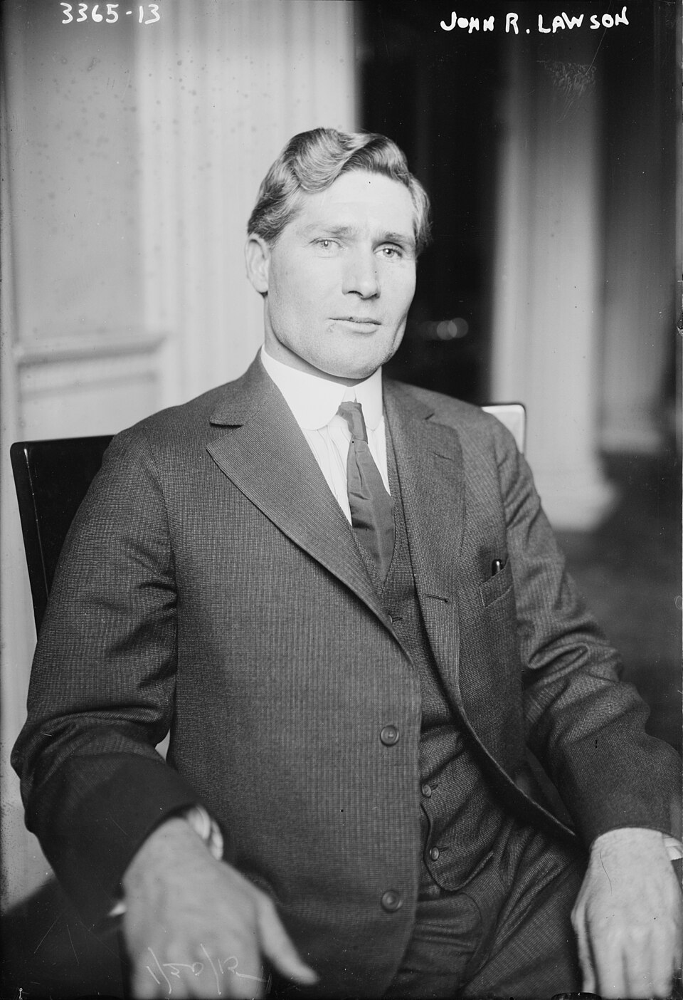

- Source: https://commons.wikimedia.org/wiki/File:John_R._Lawson.jpg
- Credit: Photographer unknown; This image is available from the United States Library of Congress's Prints and Photographs division under the digital ID ggbain.18290.This tag does not indicate the copyright status of the attached work. A normal copyright tag is still required. See Commons:Licensing.; https://hdl.loc.gov/loc.pnp/ggbain.18290
- Rights: Public domain, as documented in the linked source/file record.
- Identity: Bain News Service negative and caption identify John R. Lawson, the United Mine Workers labor leader.
- Downloaded image: https://thumb.wikimedia.org/wikipedia/commons/thumb/f/f8/John_R._Lawson.jpg/960px-John_R._Lawson.jpg
- Source image: https://upload.wikimedia.org/wikipedia/commons/f/f8/John_R._Lawson.jpg
- Dimensions: 960 × 1404
- SHA-256: `7ed98466bbd9fd0556ca6d080242af3712f556dc5d3e29bf6673bae4e64ee2c1`

## Karl Soehnlein

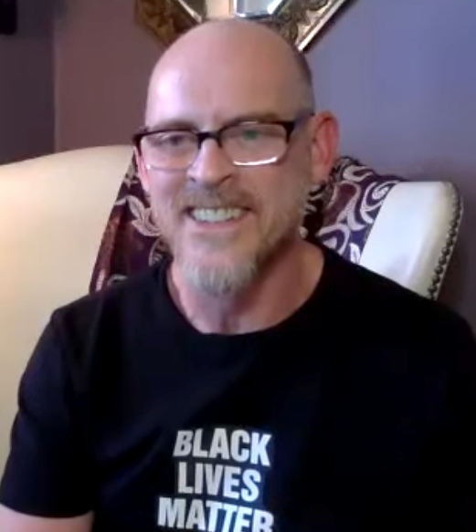

- Source: https://commons.wikimedia.org/wiki/File:K._M._Soehnlein_(born_1965)_in_the_video_%27Author_Talk_%E2%80%93_Alvin_Orloff,_Beth_Lisick_and_K.M._Soehnlein_in_conversation%27.png
- Credit: San Francisco Public Library; YouTube: Author Talk: Alvin Orloff, Beth Lisick and K.M. Soehnlein in conversation – View/save archived versions on archive.org; https://www.youtube.com/watch?v=WmhrK_39IYE ; https://web.archive.org/web/*/https://www.youtube.com/watch?v=WmhrK_39IYE
- Rights: CC BY 3.0: https://creativecommons.org/licenses/by/3.0
- Identity: San Francisco Public Library author-event video identifies K. M. Soehnlein, also Karl Soehnlein, the ACT UP participant and writer.
- Downloaded image: https://thumb.wikimedia.org/wikipedia/commons/thumb/e/e2/K._M._Soehnlein_%28born_1965%29_in_the_video_%27Author_Talk_%E2%80%93_Alvin_Orloff%2C_Beth_Lisick_and_K.M._Soehnlein_in_conversation%27.png/250px-K._M._Soehnlein_%28born_1965%29_in_the_video_%27Author_Talk_%E2%80%93_Alvin_Orloff%2C_Beth_Lisick_and_K.M._Soehnlein_in_conversation%27.png
- Source image: https://upload.wikimedia.org/wikipedia/commons/e/e2/K._M._Soehnlein_%28born_1965%29_in_the_video_%27Author_Talk_%E2%80%93_Alvin_Orloff%2C_Beth_Lisick_and_K.M._Soehnlein_in_conversation%27.png
- Dimensions: 521 × 583
- SHA-256: `07a05a7e03c4352498b4488c940cd088eaa54915d6e3a0d318887475939ab192`

## Leon Czolgosz

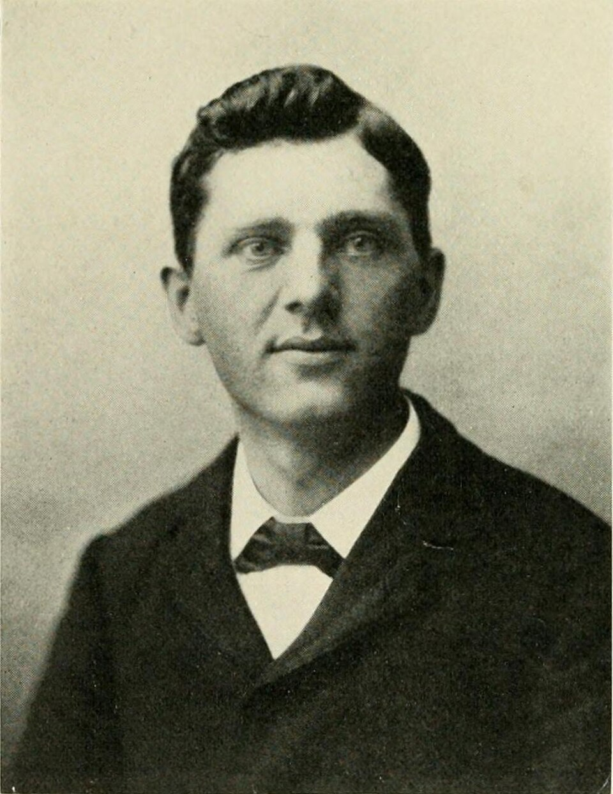

- Source: https://commons.wikimedia.org/wiki/File:Leon_Czolgosz_ca_1900.jpg
- Credit: Wiendenthal Photo Company of Cleveland,Ohio; Appeared on page 274 of "The Manner of Man That Kills" by L. Vernon Briggs link; https://archive.org/stream/mannerofmanthatk00brig#page/274/mode/2up
- Rights: Public domain, as documented in the linked source/file record.
- Identity: Historical portrait identifies Leon F. Czolgosz; source notes the photograph was found among his belongings.
- Downloaded image: https://thumb.wikimedia.org/wikipedia/commons/thumb/1/1e/Leon_Czolgosz_ca_1900.jpg/960px-Leon_Czolgosz_ca_1900.jpg
- Source image: https://upload.wikimedia.org/wikipedia/commons/1/1e/Leon_Czolgosz_ca_1900.jpg
- Dimensions: 960 × 1242
- SHA-256: `b4a359b8a507b534f6581e5bd3fa5c8bd445548ea541d8e0333ab93099b0e905`

## Ludwig E. Katterfeld

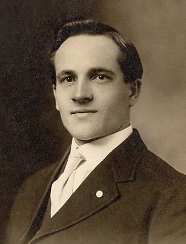

- Source: https://commons.wikimedia.org/wiki/File:Ludwig_E._Katterfeld_(1909).jpg
- Credit: Carrite at English Wikipedia; Transferred from en.wikipedia to Commons.; https://en.wikipedia.org
- Rights: Public domain, as documented in the linked source/file record.
- Identity: 1909 portrait identifies Ludwig Katterfeld, the founding Communist Labor Party organizer.
- Downloaded image: https://thumb.wikimedia.org/wikipedia/commons/thumb/2/22/Ludwig_E._Katterfeld_%281909%29.jpg/250px-Ludwig_E._Katterfeld_%281909%29.jpg
- Source image: https://upload.wikimedia.org/wikipedia/commons/2/22/Ludwig_E._Katterfeld_%281909%29.jpg
- Dimensions: 310 × 407
- SHA-256: `5477b0f591dd94b9af2e516d34bfac2f90677dc5de8a807bf7674cf9cd41a360`

## Maria Butina

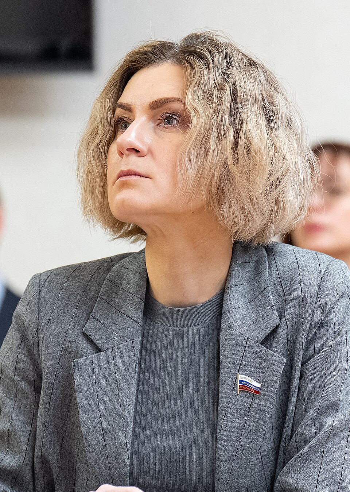

- Source: https://commons.wikimedia.org/wiki/File:%D0%9C%D0%B0%D1%80%D0%B8%D1%8F_%D0%91%D1%83%D1%82%D0%B8%D0%BD%D0%B0_(17-12-2025)_(cropped).jpg
- Credit: Ldpr.ru; Леонид Слуцкий провел встречу по ВКС с депутатами Европарламента; https://ldpr.ru/albums/photo/400037/
- Rights: CC BY 3.0: https://creativecommons.org/licenses/by/3.0
- Identity: LDPR press-service photograph identifies State Duma member Maria Butina, matching the Russian activist prosecuted in the United States.
- Downloaded image: https://thumb.wikimedia.org/wikipedia/commons/thumb/a/a2/%D0%9C%D0%B0%D1%80%D0%B8%D1%8F_%D0%91%D1%83%D1%82%D0%B8%D0%BD%D0%B0_%2817-12-2025%29_%28cropped%29.jpg/960px-%D0%9C%D0%B0%D1%80%D0%B8%D1%8F_%D0%91%D1%83%D1%82%D0%B8%D0%BD%D0%B0_%2817-12-2025%29_%28cropped%29.jpg
- Source image: https://upload.wikimedia.org/wikipedia/commons/a/a2/%D0%9C%D0%B0%D1%80%D0%B8%D1%8F_%D0%91%D1%83%D1%82%D0%B8%D0%BD%D0%B0_%2817-12-2025%29_%28cropped%29.jpg
- Dimensions: 960 × 1348
- SHA-256: `82302e18ca2981b97d9f202caa1f21b7214151f85c61261861f81a82e47e408b`

## Marion Bachrach

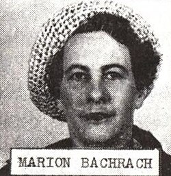

- Source: https://commons.wikimedia.org/wiki/File:Marion_Bachrach_FBI_Mugshot_1951.jpg
- Credit: Federal Bureau of Investigation, 1951, as cataloged by Commons. Newspaper clipping reference: https://archive.org/details/per_tuskegee-institute-news-clippings-file_political-party-affiliation_1951_34d/page/n16/mode/1up
- Rights: Public domain, as documented in the linked source/file record.
- Identity: Named 1951 FBI portrait identifies Marion Bachrach. The archival newspaper-clippings reference is retained; no claims from the polemical tract that also reproduced it are adopted.
- Downloaded image: https://thumb.wikimedia.org/wikipedia/commons/thumb/a/ac/Marion_Bachrach_FBI_Mugshot_1951.jpg/250px-Marion_Bachrach_FBI_Mugshot_1951.jpg
- Source image: https://upload.wikimedia.org/wikipedia/commons/a/ac/Marion_Bachrach_FBI_Mugshot_1951.jpg
- Dimensions: 250 × 257
- SHA-256: `d05922dce6cf46271a7ed0645c32048a2adfd014aa3736ba7679d3ba732c4019`

## Murray Bookchin

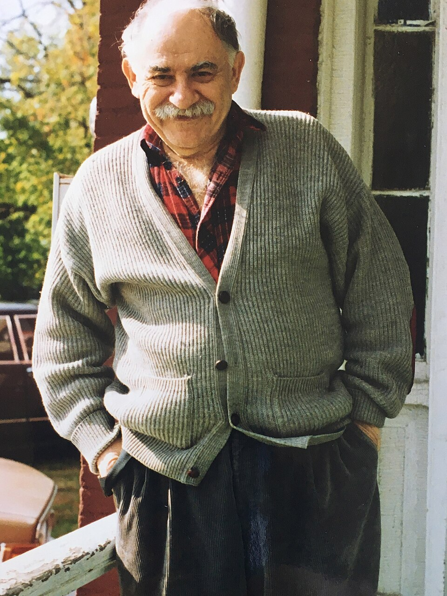

- Source: https://commons.wikimedia.org/wiki/File:Murray_Bookchin,_Burlington_Vermont,_1990.jpg
- Credit: Debbie Bookchin
- Rights: CC BY-SA 4.0: https://creativecommons.org/licenses/by-sa/4.0
- Identity: Photographer Debbie Bookchin identifies Murray Bookchin in Burlington, Vermont, in 1990; matches the social-ecology theorist.
- Downloaded image: https://thumb.wikimedia.org/wikipedia/commons/thumb/8/82/Murray_Bookchin%2C_Burlington_Vermont%2C_1990.jpg/960px-Murray_Bookchin%2C_Burlington_Vermont%2C_1990.jpg
- Source image: https://upload.wikimedia.org/wikipedia/commons/8/82/Murray_Bookchin%2C_Burlington_Vermont%2C_1990.jpg
- Dimensions: 960 × 1280
- SHA-256: `0aef68464708956f033f0fc29e6ec37cd9489c094261a389c43861f477818b77`

## Phil Shinnick

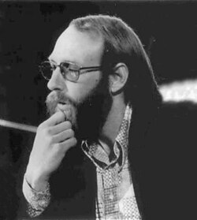

- Source: https://commons.wikimedia.org/wiki/File:Phil_Shinnick_1973.jpg
- Credit: Associated Press; [1]; http://www.ebay.com/itm/1973-Press-Photo-Past-Olympic-athlete-Phil-Shinnick-testifies-before-Senate-/352134186471?hash=item51fcd545e7:g:kdMAAOSw4CFYwOHD&autorefresh=true
- Rights: Public domain, as documented in the linked source/file record.
- Identity: Associated Press portrait identifies Phil Shinnick, the Olympic long jumper and antiwar activist.
- Downloaded image: https://thumb.wikimedia.org/wikipedia/commons/thumb/5/56/Phil_Shinnick_1973.jpg/250px-Phil_Shinnick_1973.jpg
- Source image: https://upload.wikimedia.org/wikipedia/commons/5/56/Phil_Shinnick_1973.jpg
- Dimensions: 250 × 279
- SHA-256: `993f73b7c1aa8c1e107a2dee050fe2e696d1a2fdecc7ca259ccd09542d0e6b9f`

## Rommie Loudd

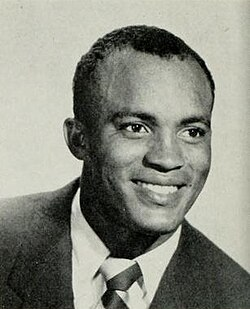

- Source: https://commons.wikimedia.org/wiki/File:Rommie_Loudd.jpg
- Credit: Photographer unknown; Southern Campus, UCLA yearbook, 1956, page 286. https://archive.org/details/southerncampus1956univ
- Rights: Public domain, as documented in the linked source/file record.
- Identity: The 1956 UCLA yearbook identifies Rommie Loudd, the football player who later became a professional football executive.
- Downloaded image: https://thumb.wikimedia.org/wikipedia/commons/thumb/8/8b/Rommie_Loudd.jpg/250px-Rommie_Loudd.jpg
- Source image: https://upload.wikimedia.org/wikipedia/commons/8/8b/Rommie_Loudd.jpg
- Dimensions: 250 × 309
- SHA-256: `dc9d12e60f9a6575b07cb7fd556c0ccb6293c7b49462151f6111eaa2b55d9bb9`

## Rudolf Grossmann

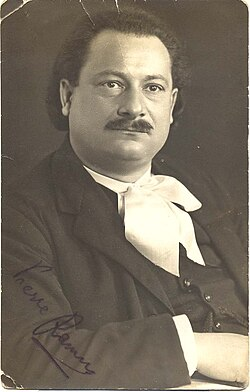

- Source: https://commons.wikimedia.org/wiki/File:Pierre_Ramus.jpg
- Credit: Photographer unknown; http://www.dadaweb.de/wiki/Datei:Ramus_Pierre.jpg; http://www.dadaweb.de/wiki/Datei:Ramus_Pierre.jpg
- Rights: Public domain, as documented in the linked source/file record.
- Identity: Anarchist archive identifies Pierre Ramus, the pseudonym of Rudolf Grossmann, who participated in the 1902 Paterson strike.
- Downloaded image: https://thumb.wikimedia.org/wikipedia/commons/thumb/c/c0/Pierre_Ramus.jpg/250px-Pierre_Ramus.jpg
- Source image: https://upload.wikimedia.org/wikipedia/commons/c/c0/Pierre_Ramus.jpg
- Dimensions: 250 × 392
- SHA-256: `f5a7c10342c4b1c00e9524a58222462a6aa338321fafb0e5efa867452f55549d`

## Tommy Sheridan

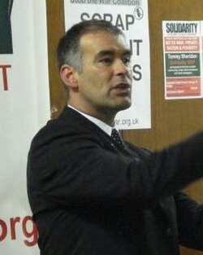

- Source: https://commons.wikimedia.org/wiki/File:TommySheridan2007_(cropped).jpg
- Credit: D. Natanson; Self-photographed
- Rights: CC BY 2.5: https://creativecommons.org/licenses/by/2.5
- Identity: Photograph identifies Scottish politician Tommy Sheridan, matching the former MSP jailed over a Faslane protest fine.
- Downloaded image: https://thumb.wikimedia.org/wikipedia/commons/thumb/7/74/TommySheridan2007_%28cropped%29.jpg/250px-TommySheridan2007_%28cropped%29.jpg
- Source image: https://upload.wikimedia.org/wikipedia/commons/7/74/TommySheridan2007_%28cropped%29.jpg
- Dimensions: 250 × 313
- SHA-256: `6808b52806738442663c9ac6fd287356330ac0c994387d2609589427963562c9`

## Charlie Weems

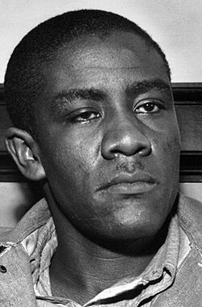

- Source: https://commons.wikimedia.org/wiki/File:Charlie_Weems_1933.jpg
- Credit: Photographer unknown; https://www.gettyimages.com/detail/news-photo/next-to-be-tried-in-scottsboro-case-charlie-weems-the-next-news-photo/515129450?adppopup=true, published in New York Daily News, April 17, 1933; https://www.gettyimages.com/detail/news-photo/next-to-be-tried-in-scottsboro-case-charlie-weems-the-next-news-photo/515129450?adppopup=true ; https://www.newspapers.com/image/416042249/?match=1&terms=charlie%20weems
- Rights: Public domain, as documented in the linked source/file record.
- Identity: 1933 news photograph identifies Charlie Weems, the Scottsboro defendant.
- Downloaded image: https://thumb.wikimedia.org/wikipedia/commons/thumb/4/49/Charlie_Weems_1933.jpg/250px-Charlie_Weems_1933.jpg
- Source image: https://upload.wikimedia.org/wikipedia/commons/4/49/Charlie_Weems_1933.jpg
- Dimensions: 250 × 380
- SHA-256: `db958058b0f0da180b582def8309dd117424fa476ba1e4d563043e86670d47af`

## Olen Montgomery

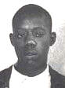

- Source: https://commons.wikimedia.org/wiki/File:Montgomery,_Olen_C1931.jpg
- Credit: Scottsboro Defense Committee; Scottsboro:The Shame of America
- Rights: Public domain, as documented in the linked source/file record.
- Identity: Scottsboro Defense Committee pamphlet individually identifies Olen Montgomery; the small period portrait is retained.
- Downloaded image: https://upload.wikimedia.org/wikipedia/commons/5/58/Montgomery%2C_Olen_C1931.jpg
- Source image: https://upload.wikimedia.org/wikipedia/commons/5/58/Montgomery%2C_Olen_C1931.jpg
- Dimensions: 83 × 112
- SHA-256: `46b831a07abe02d84aeb0a2c67f43de10bec0b8409570441f7174a6a3b05494f`

## Ozie Powell

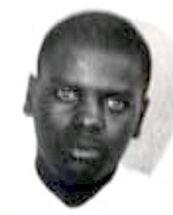

- Source: https://commons.wikimedia.org/wiki/File:Powell,_Ozie_C1931.jpg
- Credit: Photographer not specified; Photo from Scottsboro:The Shame of America', an uncopyrighted pamphlet published in February of 1936 by the Scottsboro Defense Committee.
- Rights: Public domain, as documented in the linked source/file record.
- Identity: Scottsboro Defense Committee pamphlet individually identifies Ozie Powell; the small period portrait is retained.
- Downloaded image: https://thumb.wikimedia.org/wikipedia/commons/thumb/9/94/Powell%2C_Ozie_C1931.jpg/250px-Powell%2C_Ozie_C1931.jpg
- Source image: https://upload.wikimedia.org/wikipedia/commons/9/94/Powell%2C_Ozie_C1931.jpg
- Dimensions: 250 × 311
- SHA-256: `6dc56a63ff174ddd1b685d7145fc080e266eef2c304e9247b7c04d6e99ded956`

## Willie Roberson

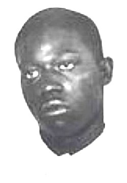

- Source: https://commons.wikimedia.org/wiki/File:Roberson,_Willie_C1931.jpg
- Credit: Scottsboro Defense Committee; Scottsboro:The Shame of America
- Rights: Public domain, as documented in the linked source/file record.
- Identity: Scottsboro Defense Committee pamphlet individually identifies Willie Roberson; the small period portrait is retained.
- Downloaded image: https://thumb.wikimedia.org/wikipedia/commons/thumb/e/e1/Roberson%2C_Willie_C1931.jpg/250px-Roberson%2C_Willie_C1931.jpg
- Source image: https://upload.wikimedia.org/wikipedia/commons/e/e1/Roberson%2C_Willie_C1931.jpg
- Dimensions: 250 × 361
- SHA-256: `87b6a1d7d1110edd481054097e6876fd2ac549b0f1500c18a202ed4e4a3b14fa`

## Inez García

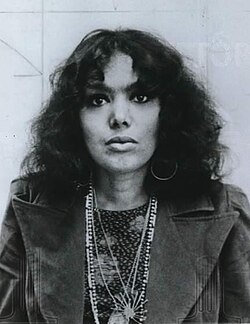

- Source: https://commons.wikimedia.org/wiki/File:Inez_Garc%C3%ADa_1977_PBS_publicity.jpg
- Credit: Photographer unknown; https://megalodon.jp/2025-1106-0200-15/https://www.ebay.com:443/itm/187006748501; https://megalodon.jp/2025-1106-0200-15/https://www.ebay.com:443/itm/187006748501
- Rights: Public domain, as documented in the linked source/file record.
- Identity: 1977 PBS publicity photograph identifies Inez Garcia, matching the California self-defense case defendant.
- Downloaded image: https://thumb.wikimedia.org/wikipedia/commons/thumb/e/ea/Inez_Garc%C3%ADa_1977_PBS_publicity.jpg/250px-Inez_Garc%C3%ADa_1977_PBS_publicity.jpg
- Source image: https://upload.wikimedia.org/wikipedia/commons/e/ea/Inez_Garc%C3%ADa_1977_PBS_publicity.jpg
- Dimensions: 250 × 324
- SHA-256: `0bdd0c0e2b757594bd551a6ebfcb8cecb7a5b38276fb6504d7d3951bf3561f0a`

## Ricardo Chavez-Ortiz

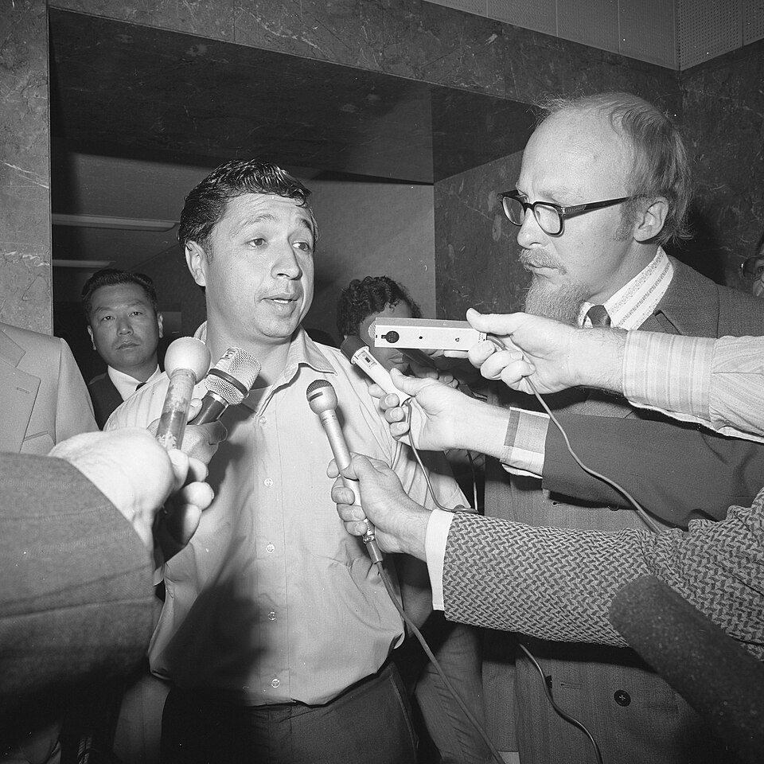

- Source: https://commons.wikimedia.org/wiki/File:Airplane_hijacker_and_Mexican_American_activist_Ricardo_Chavez-Ortiz_talking_with_reporters,_1972.jpg
- Credit: Los Angeles Times; https://digital.library.ucla.edu/catalog/ark:/21198/zz0002nk81; https://digital.library.ucla.edu/catalog/ark:/21198/zz0002nk81
- Rights: CC BY 4.0: https://creativecommons.org/licenses/by/4.0
- Identity: Los Angeles Times/UCLA caption identifies Ricardo Chavez-Ortiz speaking with reporters after the 1972 hijacking; he is the central speaker in the photograph.
- Downloaded image: https://thumb.wikimedia.org/wikipedia/commons/thumb/e/ee/Airplane_hijacker_and_Mexican_American_activist_Ricardo_Chavez-Ortiz_talking_with_reporters%2C_1972.jpg/960px-Airplane_hijacker_and_Mexican_American_activist_Ricardo_Chavez-Ortiz_talking_with_reporters%2C_1972.jpg
- Source image: https://upload.wikimedia.org/wikipedia/commons/e/ee/Airplane_hijacker_and_Mexican_American_activist_Ricardo_Chavez-Ortiz_talking_with_reporters%2C_1972.jpg
- Dimensions: 960 × 960
- SHA-256: `9a89ac673cf076d18d6bfee9b7090bcc46e5574159f00ef1579ba8a3626ddf8e`

## Ross Winans

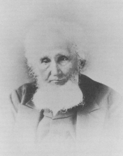

- Source: https://commons.wikimedia.org/wiki/File:Ross_Winans_2.png
- Credit: ProvenceTristram
- Rights: CC BY-SA 4.0: https://creativecommons.org/licenses/by-sa/4.0
- Identity: Historical portrait identifies Ross Winans, the Baltimore inventor and Maryland legislator detained in 1861.
- Downloaded image: https://thumb.wikimedia.org/wikipedia/commons/thumb/2/2f/Ross_Winans_2.png/250px-Ross_Winans_2.png
- Source image: https://upload.wikimedia.org/wikipedia/commons/2/2f/Ross_Winans_2.png
- Dimensions: 250 × 316
- SHA-256: `52e12c512f22ed3025c5e574341bc86815ca038a0f395181c6f15884c73c2095`

## Andy Wright

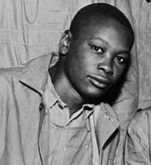

- Source: https://commons.wikimedia.org/wiki/File:Andrew_Wright.jpg
- Credit: Photographer unknown; https://www.pbs.org/wgbh/americanexperience/features/scottsboro-boys-who-were-the-boys/, also published in a fundraising letter from the ACLU (see https://www.aclu.org/news/racial-justice/the-saga-of-the-scottsboro-boys); https://www.pbs.org/wgbh/americanexperience/features/scottsboro-boys-who-were-the-boys/ ; https://www.aclu.org/news/racial-justice/the-saga-of-the-scottsboro-boys
- Rights: Public domain, as documented in the linked source/file record.
- Identity: PBS/ACLU archival source identifies Andrew (Andy) Wright, the Scottsboro defendant.
- Downloaded image: https://thumb.wikimedia.org/wikipedia/commons/thumb/8/82/Andrew_Wright.jpg/250px-Andrew_Wright.jpg
- Source image: https://upload.wikimedia.org/wikipedia/commons/8/82/Andrew_Wright.jpg
- Dimensions: 250 × 274
- SHA-256: `5b8fc7908965bd275530e8f60ab331595defd798ba18f263a3ecefeffc5f7272`

## Roy Wright

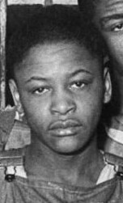

- Source: https://commons.wikimedia.org/wiki/File:Roy_Wright_1933.jpg
- Credit: Fred Hiroshige; https://www.gettyimages.com/detail/news-photo/chief-defense-attorney-samuel-leibowitz-speaks-with-news-photo/515212832; https://www.gettyimages.com/detail/news-photo/chief-defense-attorney-samuel-leibowitz-speaks-with-news-photo/515212832
- Rights: Public domain, as documented in the linked source/file record.
- Identity: 1933 Fred Hiroshige photograph identifies Roy Wright, the younger Wright brother among the Scottsboro defendants.
- Downloaded image: https://upload.wikimedia.org/wikipedia/commons/8/82/Roy_Wright_1933.jpg
- Source image: https://upload.wikimedia.org/wikipedia/commons/8/82/Roy_Wright_1933.jpg
- Dimensions: 152 × 251
- SHA-256: `2347fc0d87bb4fd0fa539e36c2b311880ee3e32bdad8c19e4067954cc265144a`

## Eugene Williams

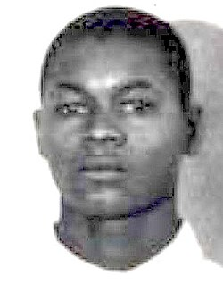

- Source: https://commons.wikimedia.org/wiki/File:Williams,_Eugene_C1931.jpg
- Credit: Scottsboro Defense Committee; Scottsboro:The Shame of America
- Rights: Public domain, as documented in the linked source/file record.
- Identity: Scottsboro Defense Committee pamphlet individually identifies Eugene Williams; matches the Scottsboro case, not another person with that name.
- Downloaded image: https://thumb.wikimedia.org/wikipedia/commons/thumb/d/dd/Williams%2C_Eugene_C1931.jpg/250px-Williams%2C_Eugene_C1931.jpg
- Source image: https://upload.wikimedia.org/wikipedia/commons/d/dd/Williams%2C_Eugene_C1931.jpg
- Dimensions: 250 × 318
- SHA-256: `bc145b658993cffd14d8f81f43b0cfebccabff938229f1c121dad1132231c78d`

## Charles Langston

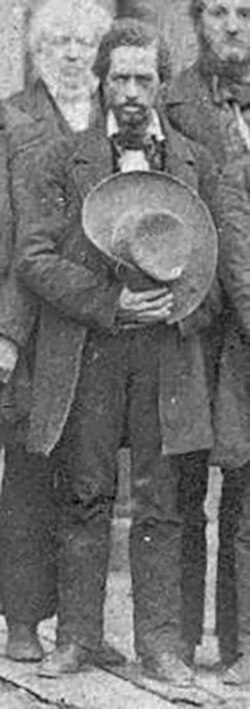

- Source: https://commons.wikimedia.org/wiki/File:Charles_Henry_Langston.jpg
- Credit: Rice, T. J., photographer; https://blackpast.org/african-american-history/langston-charles-henry-1817-1892/ https://hdl.loc.gov/loc.pnp/cph.3b20680; https://blackpast.org/african-american-history/langston-charles-henry-1817-1892/ ; https://hdl.loc.gov/loc.pnp/cph.3b20680
- Rights: Public domain, as documented in the linked source/file record.
- Identity: T. J. Rice photograph of the Oberlin rescuers identifies Charles Henry Langston. An existing individual crop is used.
- Downloaded image: https://thumb.wikimedia.org/wikipedia/commons/thumb/9/94/Charles_Henry_Langston.jpg/250px-Charles_Henry_Langston.jpg
- Source image: https://upload.wikimedia.org/wikipedia/commons/9/94/Charles_Henry_Langston.jpg
- Dimensions: 250 × 709
- SHA-256: `14a725458e740a57efb43f8c0c9f53d14ff07a1fd1a00790d3fb3385cc3257b5`

## J. Tony Serra

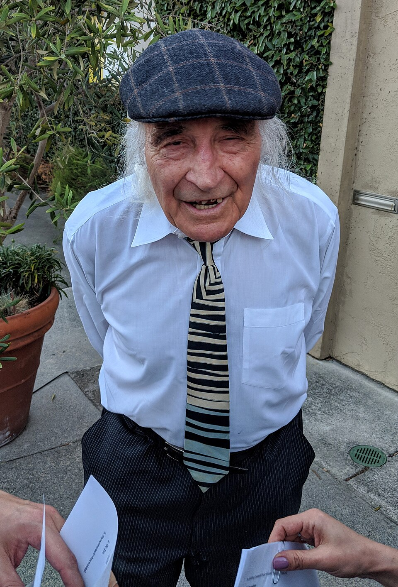

- Source: https://commons.wikimedia.org/wiki/File:Tony_Serra_2018.jpg
- Credit: Cullen328
- Rights: CC BY-SA 3.0: https://creativecommons.org/licenses/by-sa/3.0
- Identity: 2018 photograph identifies defense attorney Tony Serra, matching J. Tony Serra in the database.
- Downloaded image: https://thumb.wikimedia.org/wikipedia/commons/thumb/5/5d/Tony_Serra_2018.jpg/960px-Tony_Serra_2018.jpg
- Source image: https://upload.wikimedia.org/wikipedia/commons/5/5d/Tony_Serra_2018.jpg
- Dimensions: 960 × 1414
- SHA-256: `a2de6d78d580cbd559e8306d63a1fe6ccaf39b2a56372d25557fabafd5790eb1`

## Wendell Furry

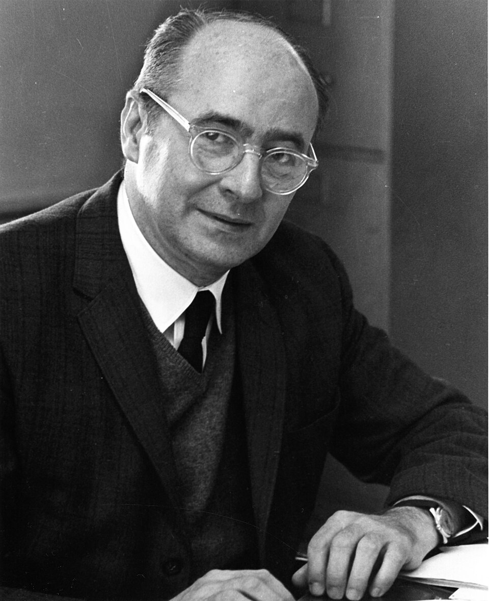

- Source: https://commons.wikimedia.org/wiki/File:Wendell_Furry.jpg
- Credit: Credit Line: AIP Emilio Segrè Visual Archives, Physics Today Collection; https://repository.aip.org/islandora/object/nbla%3A299778; https://repository.aip.org/islandora/object/nbla%3A299778
- Rights: Copyrighted free use
- Identity: American Institute of Physics archive identifies physicist Wendell H. Furry, the Harvard professor in this profile.
- Downloaded image: https://thumb.wikimedia.org/wikipedia/commons/thumb/f/fe/Wendell_Furry.jpg/960px-Wendell_Furry.jpg
- Source image: https://upload.wikimedia.org/wikipedia/commons/f/fe/Wendell_Furry.jpg
- Dimensions: 960 × 1178
- SHA-256: `77b6008c90155e2b80413685e37eb4da12af3f5310fe3e623df91534c825edef`

## Hank Adams

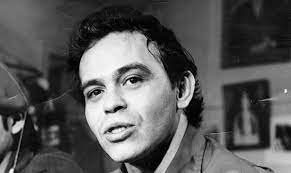

- Source: https://en.wikipedia.org/wiki/File:Hank_Adams.jpeg
- Credit: Photographer not specified; https://www.facebook.com/NAYAPDX/photos/a.286299354777771/5350219068385749/?paipv=0&eav=AfYkueyfkTVTMiGD1bsmPHi_kgE_gF_Zy5WMJRYE1Yz_VzaH1DSfVzW1-fJSnlLrpxE&_rdr; https://www.facebook.com/NAYAPDX/photos/a.286299354777771/5350219068385749/?paipv=0&eav=AfYkueyfkTVTMiGD1bsmPHi_kgE_gF_Zy5WMJRYE1Yz_VzaH1DSfVzW1-fJSnlLrpxE&_rdr
- Rights: Copyrighted; the linked source supplies this low-resolution biographical image under a fair-use rationale. No open reuse license or permission for unrelated reuse is asserted.
- Identity: The biographical portrait source identifies Hank Adams, the Assiniboine-Sioux treaty-rights organizer.
- Downloaded image: https://upload.wikimedia.org/wikipedia/en/3/32/Hank_Adams.jpeg
- Source image: https://upload.wikimedia.org/wikipedia/en/3/32/Hank_Adams.jpeg
- Dimensions: 291 × 173
- SHA-256: `55223b2c69b997ffe080bd88da5d760646a8579816eaa3f59c4063741c0bd026`

## Michael ZinZun

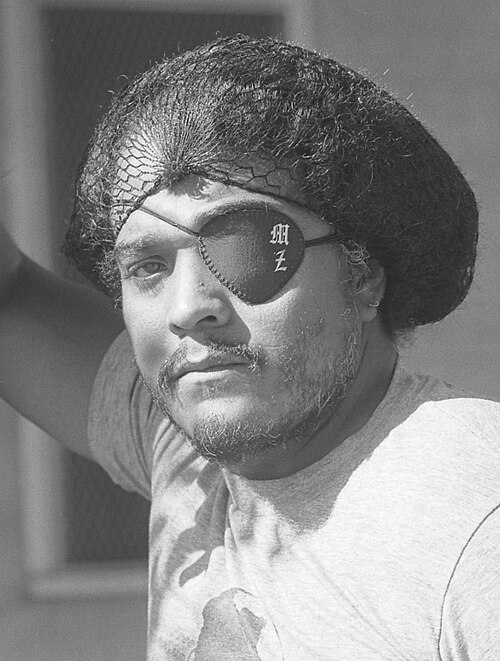

- Source: https://commons.wikimedia.org/wiki/File:Michael_Zinzun,_1986.jpg
- Credit: Lacy Atkins, Los Angeles Times; https://digital.library.ucla.edu/catalog/ark:/21198/zz0002w07f; https://digital.library.ucla.edu/catalog/ark:/21198/zz0002w07f
- Rights: CC BY 4.0: https://creativecommons.org/licenses/by/4.0
- Identity: Los Angeles Times/UCLA caption identifies activist Michael Zinzun in 1986 and describes the loss of vision in his left eye.
- Downloaded image: https://thumb.wikimedia.org/wikipedia/commons/thumb/3/39/Michael_Zinzun%2C_1986.jpg/500px-Michael_Zinzun%2C_1986.jpg
- Source image: https://upload.wikimedia.org/wikipedia/commons/3/39/Michael_Zinzun%2C_1986.jpg
- Dimensions: 500 × 661
- SHA-256: `8c50a747fdf7abdb82d6d47b2b72738c7e4b62ba690164469a39a55203782d71`

## Vernon Bellecourt

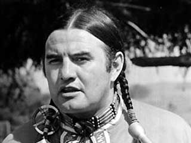

- Source: https://en.wikipedia.org/wiki/File:Vernon_Bellecourt.jpg
- Credit: Photographer not specified; AP; http://www.foxnews.com/images/313733/0_61_101407_bellecourt_vernon.jpg
- Rights: Copyrighted; the linked source supplies this low-resolution biographical image under a fair-use rationale. No open reuse license or permission for unrelated reuse is asserted.
- Identity: Associated Press biographical photograph identifies Vernon Bellecourt, the American Indian Movement organizer.
- Downloaded image: https://upload.wikimedia.org/wikipedia/en/2/25/Vernon_Bellecourt.jpg
- Source image: https://upload.wikimedia.org/wikipedia/en/2/25/Vernon_Bellecourt.jpg
- Dimensions: 320 × 240
- SHA-256: `8aad2f0ee61b6f7c76cc8fce9d8e21914409dcdfb6543392431f5e6b11e20897`

## William Sloane Coffin

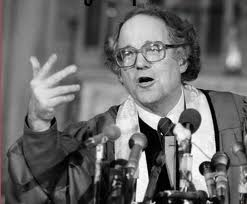

- Source: https://en.wikipedia.org/wiki/File:Photo_of_The_Rev._William_Sloane_Coffin,_Jr._(1924-2006),_Senior_Minister_of_The_Riverside_Church,_New_York,_NY_(1977-87).jpg
- Credit: Unknown photographer, probably from the New York Times; Original publication: Unknown, probably early 1980s in the new York Times; found on Harvard Square Library webpage, and on cover of 2006 book "William Sloane Coffin, Jr.: A Holy Impatience." Immediate source: http://harvardsquarelibrary.org/cfs/images/coffin_william_sloane.jpg; http://harvardsquarelibrary.org/cfs/images/coffin_william_sloane.jpg
- Rights: Copyrighted; the linked source supplies this low-resolution biographical image under a fair-use rationale. No open reuse license or permission for unrelated reuse is asserted.
- Identity: The source identifies Rev. William Sloane Coffin Jr. (1924–2006), Riverside Church senior minister and former Yale chaplain. Portraits of his father were excluded.
- Downloaded image: https://upload.wikimedia.org/wikipedia/en/3/3a/Photo_of_The_Rev._William_Sloane_Coffin%2C_Jr._%281924-2006%29%2C_Senior_Minister_of_The_Riverside_Church%2C_New_York%2C_NY_%281977-87%29.jpg
- Source image: https://upload.wikimedia.org/wikipedia/en/3/3a/Photo_of_The_Rev._William_Sloane_Coffin%2C_Jr._%281924-2006%29%2C_Senior_Minister_of_The_Riverside_Church%2C_New_York%2C_NY_%281977-87%29.jpg
- Dimensions: 247 × 204
- SHA-256: `ce9de080d35ff14243a941e49bb48a794dff2ac2cdcd8298a903e1be5254aac4`

## James Omura

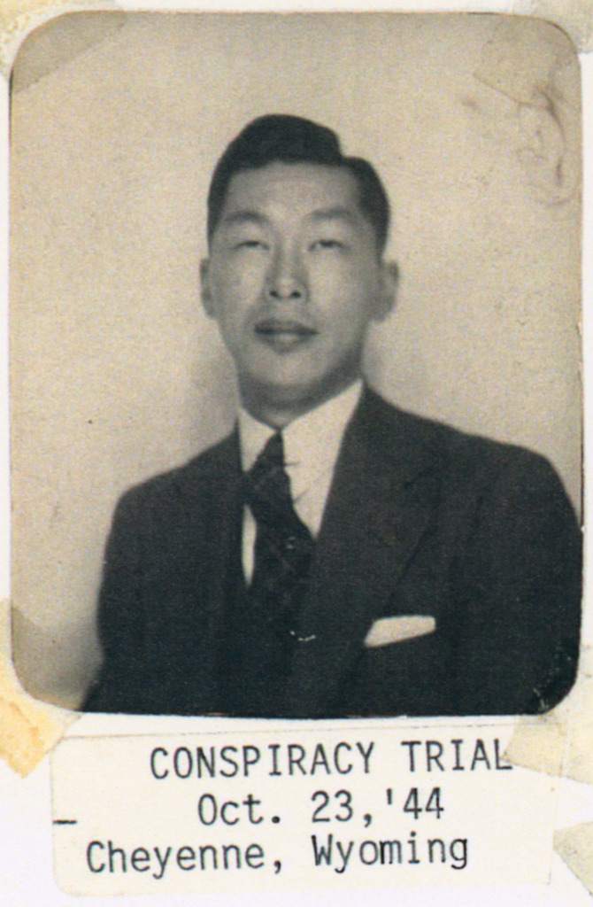

- Source: https://ddr.densho.org/ddr-densho-122-683/
- Credit: Courtesy of Frank Abe, Densho. Photographer not specified. October 23, 1944.
- Rights: CC BY-NC-SA 4.0: https://creativecommons.org/licenses/by-nc-sa/4.0/ . Noncommercial use with attribution and share-alike; not a merchandise license.
- Identity: Densho individually identifies James Omura and dates this portrait to his conspiracy trial in Cheyenne on October 23, 1944.
- Downloaded image: https://ddr.densho.org/media/ddr-densho-122/ddr-densho-122-683-mezzanine-b5b4136d0b-a.jpg
- Source image: https://ddr.densho.org/media/ddr-densho-122/ddr-densho-122-683-mezzanine-b5b4136d0b-a.jpg
- Dimensions: 670 × 1024
- SHA-256: `3bbe528ea9d7ebe2e5e7bae32bab6017a28cb6f61c762a3c52521eabce9d5d4b`

## Frank Emi

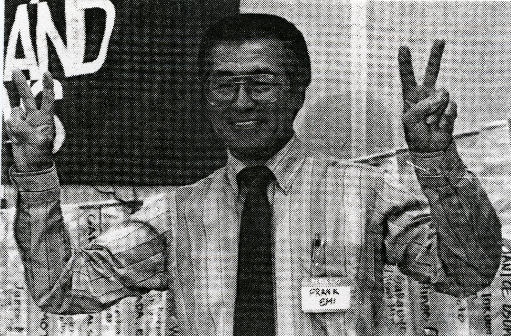

- Source: https://ddr.densho.org/ddr-csujad-29-170/
- Credit: Courtesy of CSU Fullerton Center for Oral and Public History; Japanese American Oral History Project, P111. Photographer not specified.
- Rights: Copyright restricted; copyright held by CSU Fullerton Center for Oral and Public History. No open reuse license is asserted. Archive permits reuse with permission or under a fair-use exception; source terms must accompany further reuse.
- Identity: CSU Fullerton oral-history archive individually identifies Frank S. Emi; the photographed name badge also reads Frank Emi.
- Downloaded image: https://ddr.densho.org/media/ddr-csujad-29/ddr-csujad-29-170-mezzanine-0cd1d602a8-a.jpg
- Source image: https://ddr.densho.org/media/ddr-csujad-29/ddr-csujad-29-170-mezzanine-0cd1d602a8-a.jpg
- Dimensions: 1024 × 675
- SHA-256: `0d5d72f2bb8533002b56eea29365e8df03f1a6dc5fead3a7515e14f20fe79a7d`

## LaNada War Jack

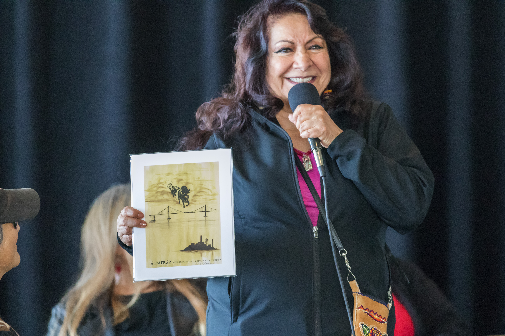

- Source: https://www.nps.gov/media/photo/gallery-item.htm?gid=10C06331-6E2D-4518-9369-DE3C931DD427&id=3266ee10-78e6-49d5-8ea3-0ce32f9c6614
- Credit: Kirke Wrench, National Park Service gallery.
- Rights: NPS asset metadata: Public domain; GrantingRights: Full.
- Identity: NPS gallery identifies Dr. LaNada War Jack speaking at an event related to the Alcatraz occupation; credited to Kirke Wrench.
- Downloaded image: https://www.nps.gov/npgallery/GetAsset/3266ee10-78e6-49d5-8ea3-0ce32f9c6614
- Source image: https://www.nps.gov/npgallery/GetAsset/3266ee10-78e6-49d5-8ea3-0ce32f9c6614
- Dimensions: 5344 × 3563
- SHA-256: `81f52928e620629250c0217bdc5bba1f08a02663bed7c8a077423fb2c50984ac`
