# Batch 261 — 100 portrait previews and credits

One hundred additional portraits for existing records with missing photos. All selected images were visually inspected. Thirty portraits are small crops from the Fort Douglas group photograph and its numbered handwritten name key; six more come from individually named Swarthmore photographs. Twenty-eight are individually cataloged Freedom Rider booking photographs. The remaining thirty-six include archival and contemporary portraits.

The user authorized exact rectangular crops of the originals. Every new crop preserves the retained pixels exactly and is saved losslessly as PNG. The payload records the source file, SHA-256 hash, dimensions, and exclusive-edge crop box. Original files used for crops, including the Fort Douglas name key, are retained in [batch261-originals](batch261-originals/). Original grain, fading and handwritten markings remain; no AI reconstruction was used.

Rights differ. The linked records include public-domain claims, Creative Commons licenses, and copyrighted images with no open license. Wikipedia fair-use rationales do not grant permission to NPPC. MDAH requests a publication-permission form; that has not been submitted by this task. Gordon Kahl’s public-domain claim is not independently established; Roy Tyler’s intermediary licensing labels conflict. These details are recorded rather than treated as blanket reuse or merchandise permission.

## A. D. King

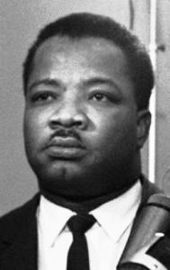

- Source: https://en.wikipedia.org/wiki/File:AD_King.jpg
- Credit: Unknown; http://logicalsoultalk.com/honoring-martin-luther-king-jr/; http://logicalsoultalk.com/honoring-martin-luther-king-jr/
- Rights: Copyrighted biographical image. The linked file record supplies a fair-use rationale for Wikipedia; this is not an open license or a grant of permission to NPPC. Source attribution and restrictions must be retained.
- Identity: Alfred Daniel King, the Baptist minister and civil-rights organizer arrested in the Atlanta sit-ins; source identifies Martin Luther King Jr.’s brother.
- Downloaded image: https://upload.wikimedia.org/wikipedia/en/b/b2/AD_King.jpg?utm_source=en.wikipedia.org&utm_campaign=imageinfo&utm_content=thumbnail_unscaled
- Editing: Downloaded source file retained unchanged, including any source-side crop or provider thumbnail.
- SHA-256: `ed70c4f26f4f22c1489d02613a19bd7aeaca28ded72b892668dc185c99269963`

## Abraham Bassford

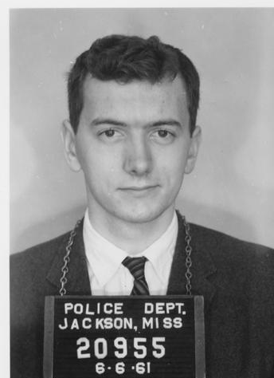

- Source: https://da.mdah.ms.gov/sovcom/photos/135
- Credit: Jackson Police Department booking photograph, 1961-06-06. Mississippi Department of Archives and History, Sovereignty Commission records, Series 2515, SCR ID 2-55-4-5-1-1-1.
- Rights: MDAH archival government record; no blanket public-domain status or permission grant is asserted. MDAH requests a Broadcast/Publication Permission Form before publication. See https://da.mdah.ms.gov/sovcom/generalinfoscweb#rightsmgmt . This batch does not represent that request as completed.
- Identity: MDAH individually catalogs this Freedom Rider booking photograph as Bassford, Abraham, IV, created 1961-06-06. The name and Jackson Freedom Ride context match this record. The crop retains the frontal view of the cataloged person.
- Downloaded image: https://da.mdah.ms.gov/series-files/sovcom/images/large/2-55-4-5-1-1-1.tif.jpg
- Editing: Exact rectangular crop; retained pixels unchanged. No resampling, color change, sharpening or AI reconstruction.
- SHA-256: `45c87b87caae988ca894c7e892124feab57131254fc97cd5f7b8cef35c368ef6`
- Original: [batch261-originals/abraham-bassford-original.jpg](batch261-originals/abraham-bassford-original.jpg)
- Crop box: `[48, 55, 392, 529]`; source dimensions: `[800, 615]`.

## Alexander Mattahan Anderson

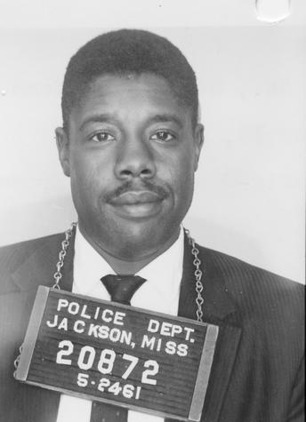

- Source: https://da.mdah.ms.gov/sovcom/photos/72
- Credit: Jackson Police Department booking photograph, 1961-05-24. Mississippi Department of Archives and History, Sovereignty Commission records, Series 2515, SCR ID 2-55-2-69-1-1-1.
- Rights: MDAH archival government record; no blanket public-domain status or permission grant is asserted. MDAH requests a Broadcast/Publication Permission Form before publication. See https://da.mdah.ms.gov/sovcom/generalinfoscweb#rightsmgmt . This batch does not represent that request as completed.
- Identity: MDAH individually catalogs this Freedom Rider booking photograph as Anderson, Alexander Mattahan, created 1961-05-24. The name and Jackson Freedom Ride context match this record. The crop retains the frontal view of the cataloged person.
- Downloaded image: https://da.mdah.ms.gov/series-files/sovcom/images/large/2-55-2-69-1-1-1.tif.jpg
- Editing: Exact rectangular crop; retained pixels unchanged. No resampling, color change, sharpening or AI reconstruction.
- SHA-256: `1bc33afea59b4ec9c76813901655ce40ec9ee5a481f254ffd7efa7519e06de89`
- Original: [batch261-originals/alexander-mattahan-anderson-original.jpg](batch261-originals/alexander-mattahan-anderson-original.jpg)
- Crop box: `[48, 56, 392, 531]`; source dimensions: `[800, 618]`.

## Alfred Buzzi

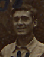

- Source: https://cosandgreatwar.swarthmore.edu/items/show/1076
- Credit: Photographer unidentified; Swarthmore College Peace Collection, William Kantor Papers, CDGA.Kantor.photo-007 (front, catalog date October 18, 1919), with CDGA.Kantor.photo-006 (handwritten key).
- Rights: Archive states that copyright is retained by item authors or their descendants as stipulated by United States law. No open license or separate permission grant is asserted.
- Identity: Number 41 on the original Fort Douglas group photograph corresponds to “A. Buzzi” in its handwritten name key (item 1075). That name/initial and the World War I conscientious-objector imprisonment context match Alfred Buzzi. The selected crop is the numbered subject, not an identification inferred from facial resemblance.
- Downloaded image: https://cosandgreatwar.swarthmore.edu/iiif-img/2869/full/full/0/default.jpg
- Editing: Exact rectangular crop; retained pixels unchanged. No resampling, color change, sharpening or AI reconstruction.
- SHA-256: `73bcf777f7aaef0ab6c634e60a0483c9298bcbfa83da5720f105715fd938715f`
- Original: [batch261-originals/swarthmore-1076-original.jpg](batch261-originals/swarthmore-1076-original.jpg)
- Crop box: `[1365, 619, 1439, 714]`; source dimensions: `[2293, 1648]`.

## Alice Gram

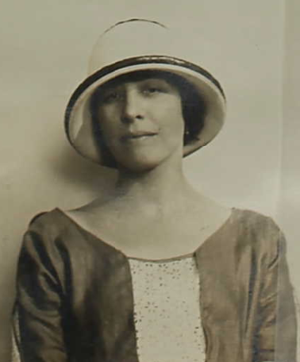

- Source: https://commons.wikimedia.org/wiki/File:AliceGramRobinson1923.png
- Credit: No photographer credited; United States passport application dated June 30, 1923, for Norbonne T. N. Robinson and Alice Gram Robinson, via the National Archives, via Ancestry
- Rights: Public domain according to the linked archive/file record.
- Identity: Alice Gram, the Oregon suffragist; the named 1923 portrait matches the National Woman’s Party prisoner.
- Downloaded image: https://upload.wikimedia.org/wikipedia/commons/3/34/AliceGramRobinson1923.png?utm_source=en.wikipedia.org&utm_campaign=imageinfo&utm_content=thumbnail_unscaled
- Editing: Downloaded source file retained unchanged, including any source-side crop or provider thumbnail.
- SHA-256: `250efef875f406f95accdd6dc907202c5fa6459497af64a9b69076a7fccdec6d`

## Antonio Colonna

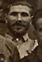

- Source: https://cosandgreatwar.swarthmore.edu/items/show/1076
- Credit: Photographer unidentified; Swarthmore College Peace Collection, William Kantor Papers, CDGA.Kantor.photo-007 (front, catalog date October 18, 1919), with CDGA.Kantor.photo-006 (handwritten key).
- Rights: Archive states that copyright is retained by item authors or their descendants as stipulated by United States law. No open license or separate permission grant is asserted.
- Identity: Number 57 on the original Fort Douglas group photograph corresponds to “A. Colona” in its handwritten name key (item 1075). That name/initial and the World War I conscientious-objector imprisonment context match Antonio Colonna. The selected crop is the numbered subject, not an identification inferred from facial resemblance.
- Downloaded image: https://cosandgreatwar.swarthmore.edu/iiif-img/2869/full/full/0/default.jpg
- Editing: Exact rectangular crop; retained pixels unchanged. No resampling, color change, sharpening or AI reconstruction.
- SHA-256: `d24c68f306bace184452a38eb811f1c334b5c44688cae35e6e93bc42a0808303`
- Original: [batch261-originals/swarthmore-1076-original.jpg](batch261-originals/swarthmore-1076-original.jpg)
- Crop box: `[1219, 514, 1279, 603]`; source dimensions: `[2293, 1648]`.

## Benjamin Breger

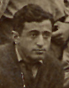

- Source: https://cosandgreatwar.swarthmore.edu/items/show/1076
- Credit: Photographer unidentified; Swarthmore College Peace Collection, William Kantor Papers, CDGA.Kantor.photo-007 (front, catalog date October 18, 1919), with CDGA.Kantor.photo-006 (handwritten key).
- Rights: Archive states that copyright is retained by item authors or their descendants as stipulated by United States law. No open license or separate permission grant is asserted.
- Identity: Number 2 on the original Fort Douglas group photograph corresponds to “B. Breger” in its handwritten name key (item 1075). That name/initial and the World War I conscientious-objector imprisonment context match Benjamin Breger. The selected crop is the numbered subject, not an identification inferred from facial resemblance.
- Downloaded image: https://cosandgreatwar.swarthmore.edu/iiif-img/2869/full/full/0/default.jpg
- Editing: Exact rectangular crop; retained pixels unchanged. No resampling, color change, sharpening or AI reconstruction.
- SHA-256: `c24704a12662563246594ffd3c0cf3314f5dac5516519428cdc913ea85a9d505`
- Original: [batch261-originals/swarthmore-1076-original.jpg](batch261-originals/swarthmore-1076-original.jpg)
- Crop box: `[476, 746, 574, 870]`; source dimensions: `[2293, 1648]`.

## Bert S. Brush

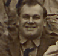

- Source: https://cosandgreatwar.swarthmore.edu/items/show/1076
- Credit: Photographer unidentified; Swarthmore College Peace Collection, William Kantor Papers, CDGA.Kantor.photo-007 (front, catalog date October 18, 1919), with CDGA.Kantor.photo-006 (handwritten key).
- Rights: Archive states that copyright is retained by item authors or their descendants as stipulated by United States law. No open license or separate permission grant is asserted.
- Identity: Number 5 on the original Fort Douglas group photograph corresponds to “B. Brush” in its handwritten name key (item 1075). That name/initial and the World War I conscientious-objector imprisonment context match Bert S. Brush. The selected crop is the numbered subject, not an identification inferred from facial resemblance.
- Downloaded image: https://cosandgreatwar.swarthmore.edu/iiif-img/2869/full/full/0/default.jpg
- Editing: Exact rectangular crop; retained pixels unchanged. No resampling, color change, sharpening or AI reconstruction.
- SHA-256: `492b15888dffefd9f19120dffd5b9700e23ef077628269a1d63132829796c113`
- Original: [batch261-originals/swarthmore-1076-original.jpg](batch261-originals/swarthmore-1076-original.jpg)
- Crop box: `[815, 813, 911, 906]`; source dimensions: `[2293, 1648]`.

## Bobby Rush

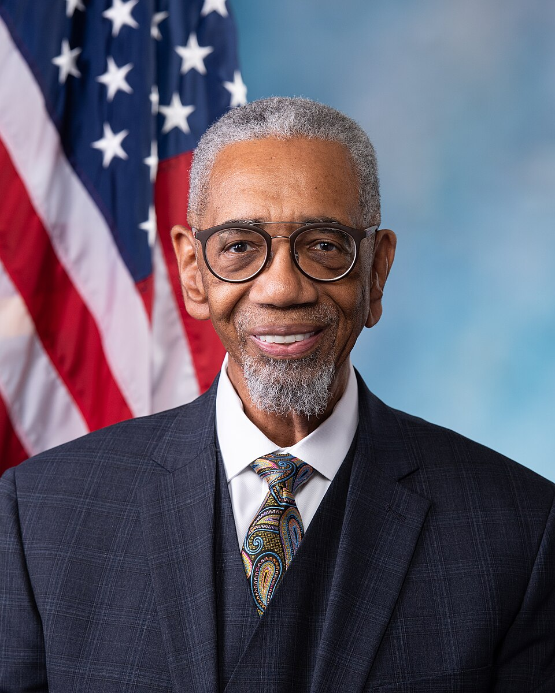

- Source: https://commons.wikimedia.org/wiki/File:Bobby_Rush_official_portrait.jpg
- Credit: Franmarie Metzler; U.S. House Office of Photography; https://rush.house.gov/sites/rush.house.gov/files/wysiwyg_uploaded/Official%20Portrait.jpg; https://rush.house.gov/sites/rush.house.gov/files/wysiwyg_uploaded/Official%20Portrait.jpg
- Rights: Public domain according to the linked archive/file record.
- Identity: Bobby Rush, the Illinois Panther co-founder who later served in Congress; official congressional portrait.
- Downloaded image: https://thumb.wikimedia.org/wikipedia/commons/thumb/1/1f/Bobby_Rush_official_portrait.jpg/960px-Bobby_Rush_official_portrait.jpg?utm_source=en.wikipedia.org&utm_campaign=imageinfo&utm_content=thumbnail
- Editing: Downloaded source file retained unchanged, including any source-side crop or provider thumbnail.
- SHA-256: `1df37c7608bbd9f2e64480ecb358acefe7c3edc51f566f79fe3456c3cf1e2237`

## Bruce Friedrich

- Source: https://commons.wikimedia.org/wiki/File:Bruce_Friedrich.jpeg
- Credit: Jo-Anne McArthur; Bruce Friedrich
- Rights: CC0: http://creativecommons.org/publicdomain/zero/1.0/deed.en
- Identity: Bruce Friedrich, the animal-rights campaigner and Good Food Institute co-founder; photographer’s named headshot.
- Downloaded image: https://upload.wikimedia.org/wikipedia/commons/e/e5/Bruce_Friedrich.jpeg?utm_source=en.wikipedia.org&utm_campaign=imageinfo&utm_content=thumbnail_unscaled
- Editing: Downloaded source file retained unchanged, including any source-side crop or provider thumbnail.
- SHA-256: `3a331cd1d553cb801dc3fa8e012aaf175ad024880bbebf4e0057f99abd0d2c9d`

## Carol Ruth Silver

- Source: https://commons.wikimedia.org/wiki/File:Carol_Ruth_Silver_at_Los_Angeles_Times_Festival_of_Books_2026.jpg
- Credit: Rosiestep
- Rights: CC BY-SA 4.0: https://creativecommons.org/licenses/by-sa/4.0
- Identity: Carol Ruth Silver, the attorney and Freedom Rider, photographed at the 2026 Los Angeles Times Festival of Books. The separate Carol Silver record is not counted again.
- Downloaded image: https://thumb.wikimedia.org/wikipedia/commons/thumb/d/db/Carol_Ruth_Silver_at_Los_Angeles_Times_Festival_of_Books_2026.jpg/960px-Carol_Ruth_Silver_at_Los_Angeles_Times_Festival_of_Books_2026.jpg?utm_source=en.wikipedia.org&utm_campaign=imageinfo&utm_content=thumbnail
- Editing: Downloaded source file retained unchanged, including any source-side crop or provider thumbnail.
- SHA-256: `3923e1b284f1a76f8c603217ccef547b82740df05563b9403bf78a5197a4e38e`

## Carolyn Yvonne Reed

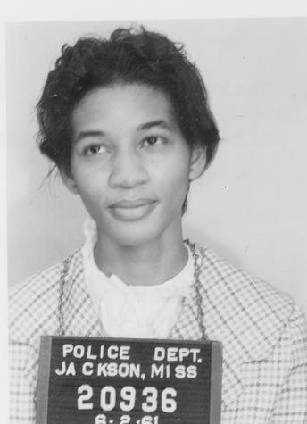

- Source: https://da.mdah.ms.gov/sovcom/photos/142
- Credit: Jackson Police Department booking photograph, 1961-06-02. Mississippi Department of Archives and History, Sovereignty Commission records, Series 2515, SCR ID 2-55-4-14-1-1-1.
- Rights: MDAH archival government record; no blanket public-domain status or permission grant is asserted. MDAH requests a Broadcast/Publication Permission Form before publication. See https://da.mdah.ms.gov/sovcom/generalinfoscweb#rightsmgmt . This batch does not represent that request as completed.
- Identity: MDAH individually catalogs this Freedom Rider booking photograph as Reed, Carolyn Yvonne, created 1961-06-02. The name and Jackson Freedom Ride context match this record. The crop retains the frontal view of the cataloged person.
- Downloaded image: https://da.mdah.ms.gov/series-files/sovcom/images/large/2-55-4-14-1-1-1.tif.jpg
- Editing: Exact rectangular crop; retained pixels unchanged. No resampling, color change, sharpening or AI reconstruction.
- SHA-256: `bfeee6d7d6ce976c34494907c37a37e8e921d9bb4054af70c646e2c785439f37`
- Original: [batch261-originals/carolyn-yvonne-reed-original.jpg](batch261-originals/carolyn-yvonne-reed-original.jpg)
- Crop box: `[48, 56, 392, 531]`; source dimensions: `[800, 618]`.

## David Eichel

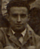

- Source: https://cosandgreatwar.swarthmore.edu/items/show/1076
- Credit: Photographer unidentified; Swarthmore College Peace Collection, William Kantor Papers, CDGA.Kantor.photo-007 (front, catalog date October 18, 1919), with CDGA.Kantor.photo-006 (handwritten key).
- Rights: Archive states that copyright is retained by item authors or their descendants as stipulated by United States law. No open license or separate permission grant is asserted.
- Identity: Number 12 on the original Fort Douglas group photograph corresponds to “D. Eichel” in its handwritten name key (item 1075). That name/initial and the World War I conscientious-objector imprisonment context match David Eichel. The selected crop is the numbered subject, not an identification inferred from facial resemblance.
- Downloaded image: https://cosandgreatwar.swarthmore.edu/iiif-img/2869/full/full/0/default.jpg
- Editing: Exact rectangular crop; retained pixels unchanged. No resampling, color change, sharpening or AI reconstruction.
- SHA-256: `5545adc210125978e1bdc3de3f0db9ac5ef73f7f068931144494507bfbd0fc07`
- Original: [batch261-originals/swarthmore-1076-original.jpg](batch261-originals/swarthmore-1076-original.jpg)
- Crop box: `[1574, 836, 1653, 934]`; source dimensions: `[2293, 1648]`.

## David J. Dennis Sr.

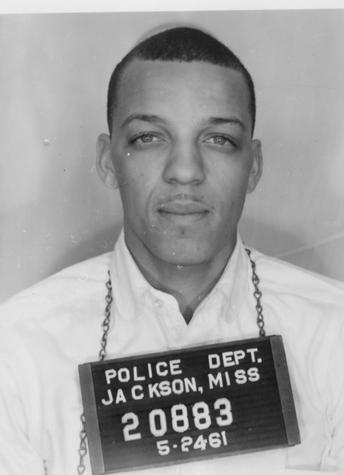

- Source: https://da.mdah.ms.gov/sovcom/photos/74
- Credit: Jackson Police Department booking photograph, 1961-05-24. Mississippi Department of Archives and History, Sovereignty Commission records, Series 2515, SCR ID 2-55-2-71-1-1-1.
- Rights: MDAH archival government record; no blanket public-domain status or permission grant is asserted. MDAH requests a Broadcast/Publication Permission Form before publication. See https://da.mdah.ms.gov/sovcom/generalinfoscweb#rightsmgmt . This batch does not represent that request as completed.
- Identity: MDAH individually catalogs this Freedom Rider booking photograph as Dennis, David, created 1961-05-24. The name and Jackson Freedom Ride context match this record. The crop retains the frontal view of the cataloged person.
- Downloaded image: https://da.mdah.ms.gov/series-files/sovcom/images/large/2-55-2-71-1-1-1.tif.jpg
- Editing: Exact rectangular crop; retained pixels unchanged. No resampling, color change, sharpening or AI reconstruction.
- SHA-256: `6b4f3ea829d96889318ee8541cc3b2bc5a5fd3a13f36220dd4ca09c457295feb`
- Original: [batch261-originals/david-j-dennis-sr-original.jpg](batch261-originals/david-j-dennis-sr-original.jpg)
- Crop box: `[48, 56, 392, 531]`; source dimensions: `[800, 618]`.

## Delbert Tibbs

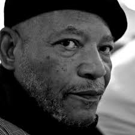

- Source: https://en.wikipedia.org/wiki/File:Delbert_tibbs_by_viewminder.jpg
- Credit: Viewminder; https://www.flickr.com/photos/light_seeker/6560624581/in/photostream/; https://www.flickr.com/photos/light_seeker/6560624581/in/photostream/
- Rights: Copyrighted biographical image. The linked file record supplies a fair-use rationale for Wikipedia; this is not an open license or a grant of permission to NPPC. Source attribution and restrictions must be retained.
- Identity: Delbert Tibbs, the poet and exonerated Florida death-row prisoner; Viewminder’s named biographical photograph.
- Downloaded image: https://upload.wikimedia.org/wikipedia/en/4/4b/Delbert_tibbs_by_viewminder.jpg?utm_source=en.wikipedia.org&utm_campaign=imageinfo&utm_content=thumbnail_unscaled
- Editing: Downloaded source file retained unchanged, including any source-side crop or provider thumbnail.
- SHA-256: `bab226eb903757aa1bace44a2c2e3fff2fe0ca757bcd6e80a56cc0d46aae3d5c`

## Edward William Kale

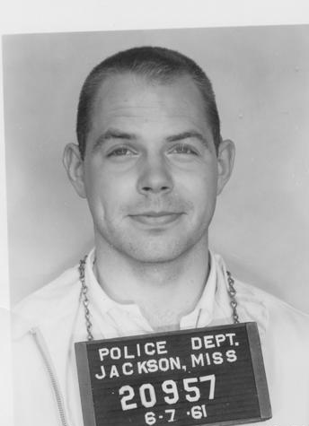

- Source: https://da.mdah.ms.gov/sovcom/photos/126
- Credit: Jackson Police Department booking photograph, 1961-06-07. Mississippi Department of Archives and History, Sovereignty Commission records, Series 2515, SCR ID 2-55-3-96-1-1-1.
- Rights: MDAH archival government record; no blanket public-domain status or permission grant is asserted. MDAH requests a Broadcast/Publication Permission Form before publication. See https://da.mdah.ms.gov/sovcom/generalinfoscweb#rightsmgmt . This batch does not represent that request as completed.
- Identity: MDAH individually catalogs this Freedom Rider booking photograph as Kale, Edward William, created 1961-06-07. The name and Jackson Freedom Ride context match this record. The crop retains the frontal view of the cataloged person.
- Downloaded image: https://da.mdah.ms.gov/series-files/sovcom/images/large/2-55-3-96-1-1-1.tif.jpg
- Editing: Exact rectangular crop; retained pixels unchanged. No resampling, color change, sharpening or AI reconstruction.
- SHA-256: `8cee168005d8b5bccd5e69dc9c3fae6e484179770a87dc510bf3b9fea4cc2aca`
- Original: [batch261-originals/edward-william-kale-original.jpg](batch261-originals/edward-william-kale-original.jpg)
- Crop box: `[48, 56, 392, 531]`; source dimensions: `[800, 618]`.

## Elizabeth Porter Wyckoff

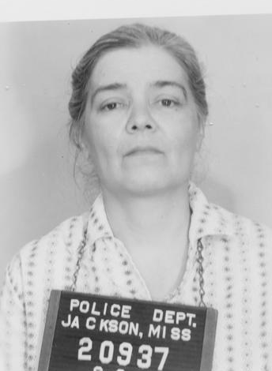

- Source: https://da.mdah.ms.gov/sovcom/photos/141
- Credit: Jackson Police Department booking photograph, 1961-06-02. Mississippi Department of Archives and History, Sovereignty Commission records, Series 2515, SCR ID 2-55-4-13-1-1-1.
- Rights: MDAH archival government record; no blanket public-domain status or permission grant is asserted. MDAH requests a Broadcast/Publication Permission Form before publication. See https://da.mdah.ms.gov/sovcom/generalinfoscweb#rightsmgmt . This batch does not represent that request as completed.
- Identity: MDAH individually catalogs this Freedom Rider booking photograph as Wyckoff, Elizabeth, created 1961-06-02. The name and Jackson Freedom Ride context match this record. The crop retains the frontal view of the cataloged person.
- Downloaded image: https://da.mdah.ms.gov/series-files/sovcom/images/large/2-55-4-13-1-1-1.tif.jpg
- Editing: Exact rectangular crop; retained pixels unchanged. No resampling, color change, sharpening or AI reconstruction.
- SHA-256: `66f40eb1423859f6f60b12591ddfd9a7f3af748cf76d2657f6a1bcabdf82fe1c`
- Original: [batch261-originals/elizabeth-porter-wyckoff-original.jpg](batch261-originals/elizabeth-porter-wyckoff-original.jpg)
- Crop box: `[48, 55, 392, 525]`; source dimensions: `[800, 611]`.

## Elizabeth Selden Rogers

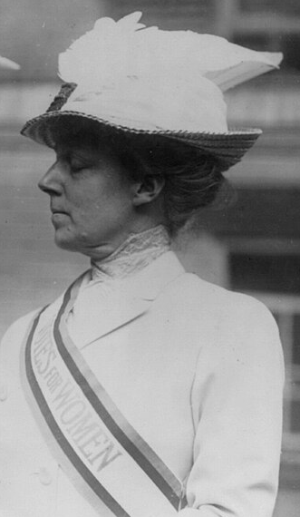

- Source: https://commons.wikimedia.org/wiki/File:Elizabeth_Selden_Rogers.jpg
- Credit: Bain News Service; Library of Congress https://www.loc.gov/pictures/collection/ggbain/item/2001704198/?sid=cfe27538dc1f9eba2daa1c9f2955ef23; https://www.loc.gov/pictures/collection/ggbain/item/2001704198/?sid=cfe27538dc1f9eba2daa1c9f2955ef23
- Rights: Public domain according to the linked archive/file record.
- Identity: Elizabeth Selden Rogers, the suffragist also called Mrs. John Rogers Jr.; the original negative inscription names her on the RIGHT beside Miss Brannan.
- Downloaded image: https://thumb.wikimedia.org/wikipedia/commons/thumb/d/da/Elizabeth_Selden_Rogers.jpg/960px-Elizabeth_Selden_Rogers.jpg?utm_source=en.wikipedia.org&utm_campaign=imageinfo&utm_content=thumbnail
- Editing: Exact rectangular crop; retained pixels unchanged. No resampling, color change, sharpening or AI reconstruction.
- SHA-256: `db19fbeffd5cc57e180bb8fea42e2b6d0b7150b1a141465c1106c0dd9f63e02b`
- Original: [batch261-originals/elizabeth-selden-rogers-original.jpg](batch261-originals/elizabeth-selden-rogers-original.jpg)
- Crop box: `[500, 170, 831, 740]`; source dimensions: `[960, 776]`.

## Emile de Antonio

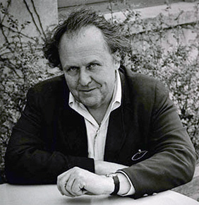

- Source: https://en.wikipedia.org/wiki/File:EmiledeAntonioPic.jpg
- Credit: Photographer unidentified; https://wcftr.commarts.wisc.edu/exhibits/emile-de-antonio; https://wcftr.commarts.wisc.edu/exhibits/emile-de-antonio
- Rights: Copyrighted biographical image. The linked file record supplies a fair-use rationale for Wikipedia; this is not an open license or a grant of permission to NPPC. Source attribution and restrictions must be retained.
- Identity: Emile de Antonio, the documentary filmmaker; photograph cataloged through the Wisconsin Center for Film and Theater Research.
- Downloaded image: https://upload.wikimedia.org/wikipedia/en/8/83/EmiledeAntonioPic.jpg?utm_source=en.wikipedia.org&utm_campaign=imageinfo&utm_content=thumbnail_unscaled
- Editing: Downloaded source file retained unchanged, including any source-side crop or provider thumbnail.
- SHA-256: `33546d20c924f11c78e12652967fe391542f6506d3279450f5fe3ad110ed9ae7`

## Eric Rungnar Platin

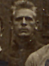

- Source: https://cosandgreatwar.swarthmore.edu/items/show/1076
- Credit: Photographer unidentified; Swarthmore College Peace Collection, William Kantor Papers, CDGA.Kantor.photo-007 (front, catalog date October 18, 1919), with CDGA.Kantor.photo-006 (handwritten key).
- Rights: Archive states that copyright is retained by item authors or their descendants as stipulated by United States law. No open license or separate permission grant is asserted.
- Identity: Number 70 on the original Fort Douglas group photograph corresponds to “E. Platin” in its handwritten name key (item 1075). That name/initial and the World War I conscientious-objector imprisonment context match Eric Rungnar Platin. The selected crop is the numbered subject, not an identification inferred from facial resemblance.
- Downloaded image: https://cosandgreatwar.swarthmore.edu/iiif-img/2869/full/full/0/default.jpg
- Editing: Exact rectangular crop; retained pixels unchanged. No resampling, color change, sharpening or AI reconstruction.
- SHA-256: `078d4c52dceee59b136d1de92adb3b778f5590efd19a18a07b8d5a3f78a16078`
- Original: [batch261-originals/swarthmore-1076-original.jpg](batch261-originals/swarthmore-1076-original.jpg)
- Crop box: `[1405, 513, 1476, 609]`; source dimensions: `[2293, 1648]`.

## Francis Steiner

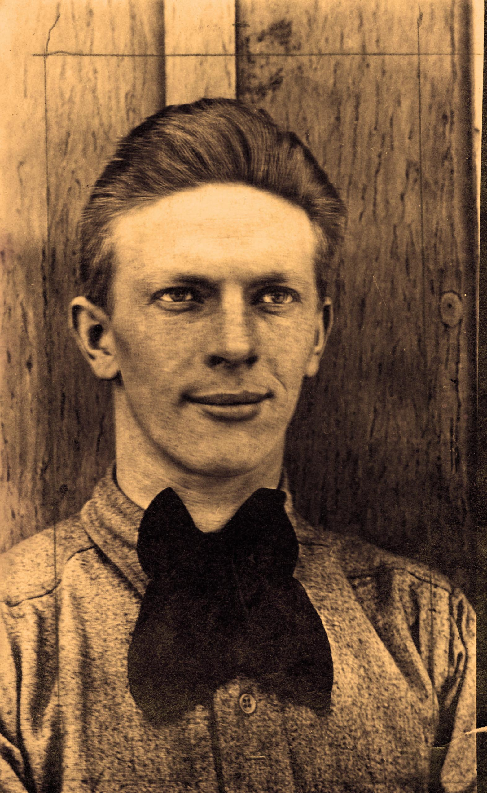

- Source: https://cosandgreatwar.swarthmore.edu/items/show/1069
- Credit: Photographer unidentified; Swarthmore College Peace Collection, DG131.Eichel.photo-014; catalog date 1919.
- Rights: The archive does not supply an open reuse license. Copyright is retained by the authors of items in these papers, or their descendants, as stipulated by United States copyright law.
- Identity: The archival title “Photograph: Francis Steiner” individually names the photographed World War I conscientious objector and matches this profile. No identification from an unnamed group is used.
- Downloaded image: https://cosandgreatwar.swarthmore.edu/iiif-img/2862/full/full/0/default.jpg
- Editing: Downloaded source file retained unchanged, including any source-side crop or provider thumbnail.
- SHA-256: `3864100c11454c5bd34f8ed9323fe00bfbfc8834363dc08a488f5f4ea9a3bb13`

## Francisco Carreón

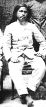

- Source: https://commons.wikimedia.org/wiki/File:Francisco_Carre%C3%B3n.jpg
- Credit: Photographer unidentified; Cropped from File:Sacay and officers.jpg
- Rights: Public domain according to the linked archive/file record.
- Identity: Francisco Carreón, the Filipino revolutionary and vice-president of the Tagalog Republic; named historical photograph.
- Downloaded image: https://upload.wikimedia.org/wikipedia/commons/0/03/Francisco_Carre%C3%B3n.jpg?utm_source=en.wikipedia.org&utm_campaign=imageinfo&utm_content=thumbnail_unscaled
- Editing: Downloaded source file retained unchanged, including any source-side crop or provider thumbnail.
- SHA-256: `5a9afc71ef59495c23e46a208b8cd568a8405b649f8e12b32a5f663a98676e95`

## Frank Minnick

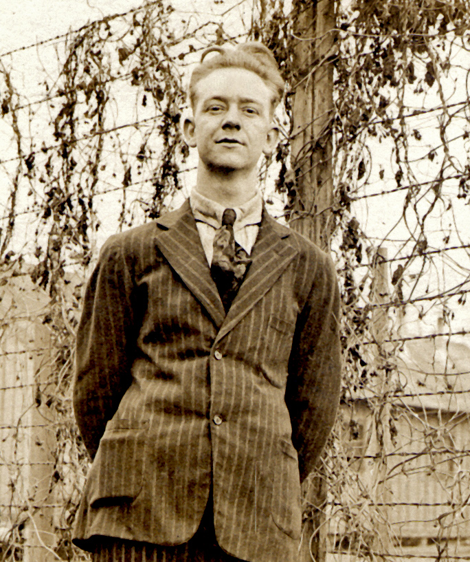

- Source: https://cosandgreatwar.swarthmore.edu/items/show/1101
- Credit: Photographer unidentified; Swarthmore College Peace Collection, CDGA.Kantor.photo-032; catalog date 1917-1920 circa.
- Rights: The archive does not supply an open reuse license. Copyright is retained by the authors of items in these papers, or their descendants, as stipulated by United States copyright law.
- Identity: The archival title “Photograph: Frank Minnick” individually names the photographed World War I conscientious objector and matches this profile. No identification from an unnamed group is used.
- Downloaded image: https://cosandgreatwar.swarthmore.edu/iiif-img/2894/full/full/0/default.jpg
- Editing: Exact rectangular crop; retained pixels unchanged. No resampling, color change, sharpening or AI reconstruction.
- SHA-256: `60160e55d1537b1b59c8cf7a57f75f440de554dd227e805cb853788f9d1d0a31`
- Original: [batch261-originals/swarthmore-1101-original.jpg](batch261-originals/swarthmore-1101-original.jpg)
- Crop box: `[376, 194, 1060, 1011]`; source dimensions: `[1342, 2151]`.

## Frank Moser

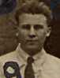

- Source: https://cosandgreatwar.swarthmore.edu/items/show/1076
- Credit: Photographer unidentified; Swarthmore College Peace Collection, William Kantor Papers, CDGA.Kantor.photo-007 (front, catalog date October 18, 1919), with CDGA.Kantor.photo-006 (handwritten key).
- Rights: Archive states that copyright is retained by item authors or their descendants as stipulated by United States law. No open license or separate permission grant is asserted.
- Identity: Number 39 on the original Fort Douglas group photograph corresponds to “F. Moser” in its handwritten name key (item 1075). That name/initial and the World War I conscientious-objector imprisonment context match Frank Moser. The selected crop is the numbered subject, not an identification inferred from facial resemblance.
- Downloaded image: https://cosandgreatwar.swarthmore.edu/iiif-img/2869/full/full/0/default.jpg
- Editing: Exact rectangular crop; retained pixels unchanged. No resampling, color change, sharpening or AI reconstruction.
- SHA-256: `d90d931cae3bdd0a52b01357e0943d6dbe248e14de9aa6dfb6256600c93ca3a0`
- Original: [batch261-originals/swarthmore-1076-original.jpg](batch261-originals/swarthmore-1076-original.jpg)
- Crop box: `[1198, 618, 1274, 717]`; source dimensions: `[2293, 1648]`.

## Fred J. Muhlke

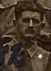

- Source: https://cosandgreatwar.swarthmore.edu/items/show/1076
- Credit: Photographer unidentified; Swarthmore College Peace Collection, William Kantor Papers, CDGA.Kantor.photo-007 (front, catalog date October 18, 1919), with CDGA.Kantor.photo-006 (handwritten key).
- Rights: Archive states that copyright is retained by item authors or their descendants as stipulated by United States law. No open license or separate permission grant is asserted.
- Identity: Number 42 on the original Fort Douglas group photograph corresponds to “F. Muhlke” in its handwritten name key (item 1075). That name/initial and the World War I conscientious-objector imprisonment context match Fred J. Muhlke. The selected crop is the numbered subject, not an identification inferred from facial resemblance.
- Downloaded image: https://cosandgreatwar.swarthmore.edu/iiif-img/2869/full/full/0/default.jpg
- Editing: Exact rectangular crop; retained pixels unchanged. No resampling, color change, sharpening or AI reconstruction.
- SHA-256: `ac57ef3b15268d10679ba456cb11cd244880c352e53d667ced275c88ebe1baac`
- Original: [batch261-originals/swarthmore-1076-original.jpg](batch261-originals/swarthmore-1076-original.jpg)
- Crop box: `[1458, 619, 1531, 720]`; source dimensions: `[2293, 1648]`.

## Garrett Jones

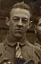

- Source: https://cosandgreatwar.swarthmore.edu/items/show/1076
- Credit: Photographer unidentified; Swarthmore College Peace Collection, William Kantor Papers, CDGA.Kantor.photo-007 (front, catalog date October 18, 1919), with CDGA.Kantor.photo-006 (handwritten key).
- Rights: Archive states that copyright is retained by item authors or their descendants as stipulated by United States law. No open license or separate permission grant is asserted.
- Identity: Number 56 on the original Fort Douglas group photograph corresponds to “G. Jones” in its handwritten name key (item 1075). That name/initial and the World War I conscientious-objector imprisonment context match Garrett Jones. The selected crop is the numbered subject, not an identification inferred from facial resemblance.
- Downloaded image: https://cosandgreatwar.swarthmore.edu/iiif-img/2869/full/full/0/default.jpg
- Editing: Exact rectangular crop; retained pixels unchanged. No resampling, color change, sharpening or AI reconstruction.
- SHA-256: `3b61a7fb18b0ea32bede93f0febc33bbe9f073763e871429e5949e738a68f47d`
- Original: [batch261-originals/swarthmore-1076-original.jpg](batch261-originals/swarthmore-1076-original.jpg)
- Crop box: `[1169, 493, 1237, 598]`; source dimensions: `[2293, 1648]`.

## George Mizo

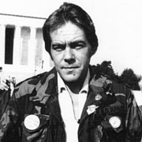

- Source: https://commons.wikimedia.org/wiki/File:George_Mizo.jpg
- Credit: Friendship Village Vietnam; http://www.vietnamfriendship.org/wordpress/project-history; http://www.vietnamfriendship.org/wordpress/project-history
- Rights: CC BY-SA 4.0: https://creativecommons.org/licenses/by-sa/4.0
- Identity: George Mizo, the Vietnam veteran and antiwar organizer; Friendship Village Vietnam identifies him in this 1981 photograph.
- Downloaded image: https://upload.wikimedia.org/wikipedia/commons/a/a5/George_Mizo.jpg?utm_source=en.wikipedia.org&utm_campaign=imageinfo&utm_content=thumbnail_unscaled
- Editing: Downloaded source file retained unchanged, including any source-side crop or provider thumbnail.
- SHA-256: `049ec8e92510da8618adc102dd1d5fe91a224fb5d7efb3a00f7369f454c5f233`

## Glenda Jean Gaither

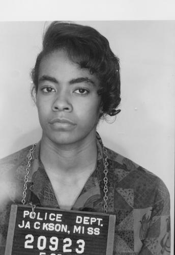

- Source: https://da.mdah.ms.gov/sovcom/photos/154
- Credit: Jackson Police Department booking photograph, 1961-05-30. Mississippi Department of Archives and History, Sovereignty Commission records, Series 2515, SCR ID 2-55-4-29-1-1-1.
- Rights: MDAH archival government record; no blanket public-domain status or permission grant is asserted. MDAH requests a Broadcast/Publication Permission Form before publication. See https://da.mdah.ms.gov/sovcom/generalinfoscweb#rightsmgmt . This batch does not represent that request as completed.
- Identity: MDAH individually catalogs this Freedom Rider booking photograph as Gaither, Glinda, created 1961-05-30. The name and Jackson Freedom Ride context match this record. The crop retains the frontal view of the cataloged person. The source form of the name is retained here as a documented variant; no database name or date is changed.
- Downloaded image: https://da.mdah.ms.gov/series-files/sovcom/images/large/2-55-4-29-1-1-1.tif.jpg
- Editing: Exact rectangular crop; retained pixels unchanged. No resampling, color change, sharpening or AI reconstruction.
- SHA-256: `f016a87b9039f5623f2eb3390d340b6ed4c876bbb46e5a2b0bd50bd43882dafe`
- Original: [batch261-originals/glenda-jean-gaither-original.jpg](batch261-originals/glenda-jean-gaither-original.jpg)
- Crop box: `[48, 24, 392, 525]`; source dimensions: `[800, 611]`.

## Goldie Watson

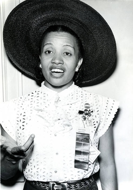

- Source: https://en.wikipedia.org/wiki/File:Goldie_E._Watson_1948.jpg
- Credit: Mosley, John W.; Original publication: 1948-07-23 Immediate source: https://digital.library.temple.edu/digital/collection/p15037coll17/id/306; https://digital.library.temple.edu/digital/collection/p15037coll17/id/306
- Rights: Copyrighted biographical image. The linked file record supplies a fair-use rationale for Wikipedia; this is not an open license or a grant of permission to NPPC. Source attribution and restrictions must be retained.
- Identity: Goldie E. Watson, the Philadelphia activist; John W. Mosley’s individually cataloged 1948 portrait at Temple University.
- Downloaded image: https://upload.wikimedia.org/wikipedia/en/a/a7/Goldie_E._Watson_1948.jpg?utm_source=en.wikipedia.org&utm_campaign=imageinfo&utm_content=thumbnail_unscaled
- Editing: Downloaded source file retained unchanged, including any source-side crop or provider thumbnail.
- SHA-256: `61cbb97c8b43cf0ed347f39bba430125a88fa1bbf9a375ec6853342f04e5ed6e`

## Gordon Wendell Kahl

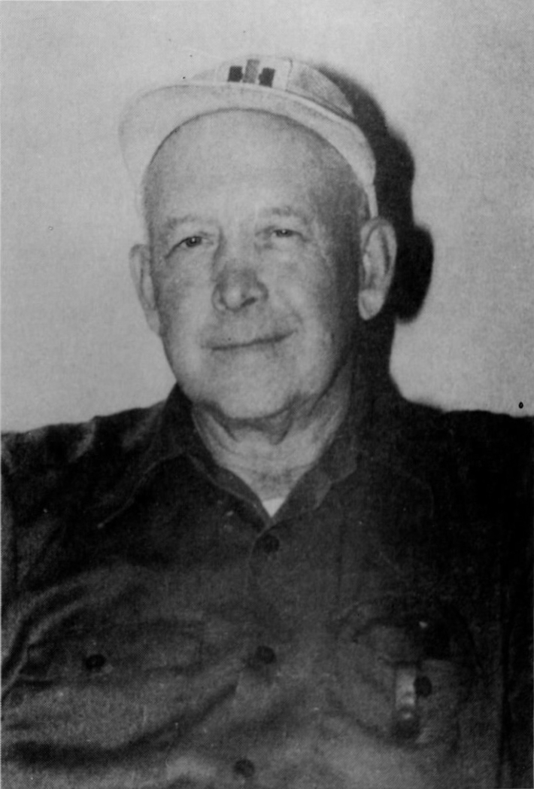

- Source: https://commons.wikimedia.org/wiki/File:Gordon_Kahl_1981.jpg
- Credit: Grosz Studio of Moorhead; https://www.grandforksherald.com/newsmd/thirty-years-after-medina-nd-shooting-some-still-worry-about-patriot-groups; https://www.grandforksherald.com/newsmd/thirty-years-after-medina-nd-shooting-some-still-worry-about-patriot-groups
- Rights: Commons claims PD-US-1989 based on publication without notice and no registration; that claim has not been independently established. Grosz Studio of Moorhead is the named photographer. No separate reuse permission is asserted.
- Identity: Gordon Kahl, the North Dakota tax resister; Grosz Studio’s named 1981 portrait, reproduced in the Grand Forks Herald.
- Downloaded image: https://upload.wikimedia.org/wikipedia/commons/1/10/Gordon_Kahl_1981.jpg?utm_source=en.wikipedia.org&utm_campaign=imageinfo&utm_content=thumbnail_unscaled
- Editing: Downloaded source file retained unchanged, including any source-side crop or provider thumbnail.
- SHA-256: `f612febcf74fcfc144106ca791f77a99d53b611fcc234c278fe75788dd23e0ec`

## Gustus Wortsmann

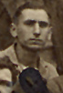

- Source: https://cosandgreatwar.swarthmore.edu/items/show/1076
- Credit: Photographer unidentified; Swarthmore College Peace Collection, William Kantor Papers, CDGA.Kantor.photo-007 (front, catalog date October 18, 1919), with CDGA.Kantor.photo-006 (handwritten key).
- Rights: Archive states that copyright is retained by item authors or their descendants as stipulated by United States law. No open license or separate permission grant is asserted.
- Identity: Number 49 on the original Fort Douglas group photograph corresponds to “G. Wortsman” in its handwritten name key (item 1075). That name/initial and the World War I conscientious-objector imprisonment context match Gustus Wortsmann. The selected crop is the numbered subject, not an identification inferred from facial resemblance.
- Downloaded image: https://cosandgreatwar.swarthmore.edu/iiif-img/2869/full/full/0/default.jpg
- Editing: Exact rectangular crop; retained pixels unchanged. No resampling, color change, sharpening or AI reconstruction.
- SHA-256: `f405defe80abb39e015c0a03d0ebfb94d67c037ac7e3c131019a5ed804d8b4be`
- Original: [batch261-originals/swarthmore-1076-original.jpg](batch261-originals/swarthmore-1076-original.jpg)
- Crop box: `[535, 507, 604, 609]`; source dimensions: `[2293, 1648]`.

## Gwendolyn Green

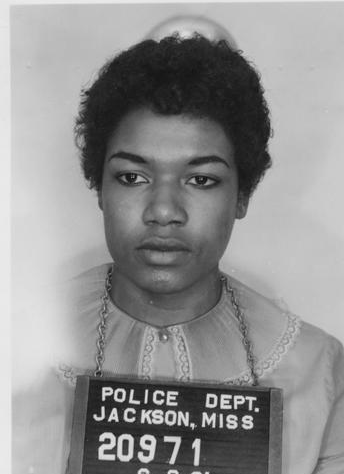

- Source: https://da.mdah.ms.gov/sovcom/photos/116
- Credit: Jackson Police Department booking photograph, 1961-06-08. Mississippi Department of Archives and History, Sovereignty Commission records, Series 2515, SCR ID 2-55-3-80-1-1-1.
- Rights: MDAH archival government record; no blanket public-domain status or permission grant is asserted. MDAH requests a Broadcast/Publication Permission Form before publication. See https://da.mdah.ms.gov/sovcom/generalinfoscweb#rightsmgmt . This batch does not represent that request as completed.
- Identity: MDAH individually catalogs this Freedom Rider booking photograph as Green, Gwendolyn, created 1961-06-08. The name and Jackson Freedom Ride context match this record. The crop retains the frontal view of the cataloged person.
- Downloaded image: https://da.mdah.ms.gov/series-files/sovcom/images/large/2-55-3-80-1-1-1.tif.jpg
- Editing: Exact rectangular crop; retained pixels unchanged. No resampling, color change, sharpening or AI reconstruction.
- SHA-256: `47e16dd19b1f4a0b6b91e834b1b1bd66c07e09f969ae216a6995c928c4e98088`
- Original: [batch261-originals/gwendolyn-green-original.jpg](batch261-originals/gwendolyn-green-original.jpg)
- Crop box: `[48, 55, 392, 529]`; source dimensions: `[800, 615]`.

## Harold Andrews

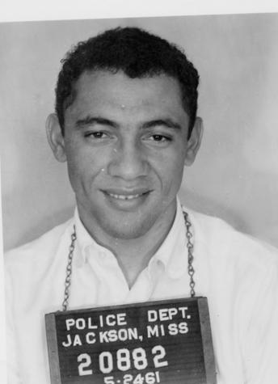

- Source: https://da.mdah.ms.gov/sovcom/photos/75
- Credit: Jackson Police Department booking photograph, 1961-05-24. Mississippi Department of Archives and History, Sovereignty Commission records, Series 2515, SCR ID 2-55-2-72-1-1-1.
- Rights: MDAH archival government record; no blanket public-domain status or permission grant is asserted. MDAH requests a Broadcast/Publication Permission Form before publication. See https://da.mdah.ms.gov/sovcom/generalinfoscweb#rightsmgmt . This batch does not represent that request as completed.
- Identity: MDAH individually catalogs this Freedom Rider booking photograph as Andrews, Harold, created 1961-05-24. The name and Jackson Freedom Ride context match this record. The crop retains the frontal view of the cataloged person.
- Downloaded image: https://da.mdah.ms.gov/series-files/sovcom/images/large/2-55-2-72-1-1-1.tif.jpg
- Editing: Exact rectangular crop; retained pixels unchanged. No resampling, color change, sharpening or AI reconstruction.
- SHA-256: `3cbb025286cedf0a1b5d69bfb03aba787b6886837729e53cbab172127e360524`
- Original: [batch261-originals/harold-andrews-original.jpg](batch261-originals/harold-andrews-original.jpg)
- Crop box: `[48, 56, 392, 531]`; source dimensions: `[800, 618]`.

## Harry M. Clave

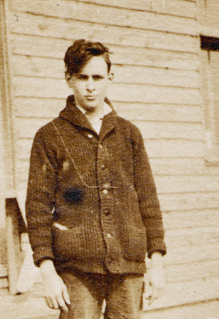

- Source: https://cosandgreatwar.swarthmore.edu/items/show/1094
- Credit: Photographer unidentified; Swarthmore College Peace Collection, CDGA.Kantor.photo-025; catalog date 1918.
- Rights: The archive does not supply an open reuse license. Copyright is retained by the authors of items in these papers, or their descendants, as stipulated by United States copyright law.
- Identity: The archival title “Photograph: Harry Clave” individually names the photographed World War I conscientious objector and matches this profile. No identification from an unnamed group is used.
- Downloaded image: https://cosandgreatwar.swarthmore.edu/iiif-img/2887/full/full/0/default.jpg
- Editing: Exact rectangular crop; retained pixels unchanged. No resampling, color change, sharpening or AI reconstruction.
- SHA-256: `62232d552f11e713dadea7ddd21910cd695c2ee0f534722049755d8c5ce600fd`
- Original: [batch261-originals/swarthmore-1094-original.jpg](batch261-originals/swarthmore-1094-original.jpg)
- Crop box: `[230, 232, 672, 875]`; source dimensions: `[920, 1367]`.

## Heath Cliff Rush

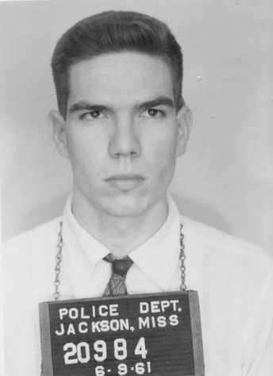

- Source: https://da.mdah.ms.gov/sovcom/photos/872
- Credit: Jackson Police Department booking photograph, 1961-06-09. Mississippi Department of Archives and History, Sovereignty Commission records, Series 2515, SCR ID 2-55-3-105-1-1-1.
- Rights: MDAH archival government record; no blanket public-domain status or permission grant is asserted. MDAH requests a Broadcast/Publication Permission Form before publication. See https://da.mdah.ms.gov/sovcom/generalinfoscweb#rightsmgmt . This batch does not represent that request as completed.
- Identity: MDAH individually catalogs this Freedom Rider booking photograph as Rush, Heath, created 1961-06-09. The name and Jackson Freedom Ride context match this record. The crop retains the frontal view of the cataloged person. The source form of the name is retained here as a documented variant; no database name or date is changed.
- Downloaded image: https://da.mdah.ms.gov/series-files/sovcom/images/large/2-55-3-105-1-1-1.tif.jpg
- Editing: Exact rectangular crop; retained pixels unchanged. No resampling, color change, sharpening or AI reconstruction.
- SHA-256: `89e3c147bc9427d59c72dfa68bce80347658e0ca216a3d64c1d30eb92b44b79e`
- Original: [batch261-originals/heath-cliff-rush-original.jpg](batch261-originals/heath-cliff-rush-original.jpg)
- Crop box: `[48, 55, 392, 529]`; source dimensions: `[800, 615]`.

## Helene Dorothy Wilson

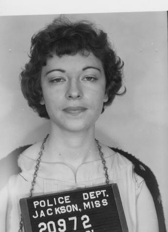

- Source: https://da.mdah.ms.gov/sovcom/photos/122
- Credit: Jackson Police Department booking photograph, 1961-06-08. Mississippi Department of Archives and History, Sovereignty Commission records, Series 2515, SCR ID 2-55-3-86-1-1-1.
- Rights: MDAH archival government record; no blanket public-domain status or permission grant is asserted. MDAH requests a Broadcast/Publication Permission Form before publication. See https://da.mdah.ms.gov/sovcom/generalinfoscweb#rightsmgmt . This batch does not represent that request as completed.
- Identity: MDAH individually catalogs this Freedom Rider booking photograph as Wilson, Helene Dorothy, created 1961-06-08. The name and Jackson Freedom Ride context match this record. The crop retains the frontal view of the cataloged person.
- Downloaded image: https://da.mdah.ms.gov/series-files/sovcom/images/large/2-55-3-86-1-1-1.tif.jpg
- Editing: Exact rectangular crop; retained pixels unchanged. No resampling, color change, sharpening or AI reconstruction.
- SHA-256: `73bd357ddc66f061d9cdff41b923ff7fe85268891a194dbe7eac1111bb8e5fe6`
- Original: [batch261-originals/helene-dorothy-wilson-original.jpg](batch261-originals/helene-dorothy-wilson-original.jpg)
- Crop box: `[48, 56, 392, 531]`; source dimensions: `[800, 617]`.

## Henry Jager

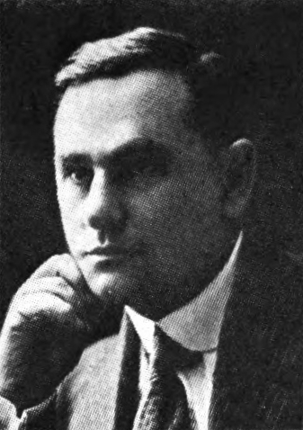

- Source: https://commons.wikimedia.org/wiki/File:Henry_Jager_1921.jpg
- Credit: State of New York; New York Red Book, 1921. Page 128.; https://babel.hathitrust.org/cgi/pt?id=umn.31951d02634310g&seq=216
- Rights: Public domain according to the linked archive/file record.
- Identity: Henry Jager, the New York Socialist assemblyman prosecuted for a Madison Square speech; the state legislative portrait names Assemblyman Henry Jager.
- Downloaded image: https://upload.wikimedia.org/wikipedia/commons/4/49/Henry_Jager_1921.jpg?utm_source=en.wikipedia.org&utm_campaign=imageinfo&utm_content=thumbnail_unscaled
- Editing: Downloaded source file retained unchanged, including any source-side crop or provider thumbnail.
- SHA-256: `8a72b964d73a7dfe4dd33e5f4368f660342357c8d3ef3b47188b542b73f3c783`

## Henry Monsky

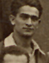

- Source: https://cosandgreatwar.swarthmore.edu/items/show/1076
- Credit: Photographer unidentified; Swarthmore College Peace Collection, William Kantor Papers, CDGA.Kantor.photo-007 (front, catalog date October 18, 1919), with CDGA.Kantor.photo-006 (handwritten key).
- Rights: Archive states that copyright is retained by item authors or their descendants as stipulated by United States law. No open license or separate permission grant is asserted.
- Identity: Number 50 on the original Fort Douglas group photograph corresponds to “H. Monsky” in its handwritten name key (item 1075). That name/initial and the World War I conscientious-objector imprisonment context match Henry Monsky. The selected crop is the numbered subject, not an identification inferred from facial resemblance.
- Downloaded image: https://cosandgreatwar.swarthmore.edu/iiif-img/2869/full/full/0/default.jpg
- Editing: Exact rectangular crop; retained pixels unchanged. No resampling, color change, sharpening or AI reconstruction.
- SHA-256: `2aecb720b3b3baec3611bab8ff041f25a0b8ac2e641bd6fc8cee4070e87a5219`
- Original: [batch261-originals/swarthmore-1076-original.jpg](batch261-originals/swarthmore-1076-original.jpg)
- Crop box: `[605, 528, 676, 619]`; source dimensions: `[2293, 1648]`.

## Henry Pollack

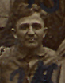

- Source: https://cosandgreatwar.swarthmore.edu/items/show/1076
- Credit: Photographer unidentified; Swarthmore College Peace Collection, William Kantor Papers, CDGA.Kantor.photo-007 (front, catalog date October 18, 1919), with CDGA.Kantor.photo-006 (handwritten key).
- Rights: Archive states that copyright is retained by item authors or their descendants as stipulated by United States law. No open license or separate permission grant is asserted.
- Identity: Number 24 on the original Fort Douglas group photograph corresponds to “H. Pollack” in its handwritten name key (item 1075). That name/initial and the World War I conscientious-objector imprisonment context match Henry Pollack. The selected crop is the numbered subject, not an identification inferred from facial resemblance.
- Downloaded image: https://cosandgreatwar.swarthmore.edu/iiif-img/2869/full/full/0/default.jpg
- Editing: Exact rectangular crop; retained pixels unchanged. No resampling, color change, sharpening or AI reconstruction.
- SHA-256: `564e5d2a1d3515eb55eb09fad253df9644a2b7e57d7f972a43d855adced08232`
- Original: [batch261-originals/swarthmore-1076-original.jpg](batch261-originals/swarthmore-1076-original.jpg)
- Crop box: `[1507, 709, 1589, 813]`; source dimensions: `[2293, 1648]`.

## Henry Schneider

- Source: https://cosandgreatwar.swarthmore.edu/items/show/1076
- Credit: Photographer unidentified; Swarthmore College Peace Collection, William Kantor Papers, CDGA.Kantor.photo-007 (front, catalog date October 18, 1919), with CDGA.Kantor.photo-006 (handwritten key).
- Rights: Archive states that copyright is retained by item authors or their descendants as stipulated by United States law. No open license or separate permission grant is asserted.
- Identity: Number 69 on the original Fort Douglas group photograph corresponds to “H. Schneider” in its handwritten name key (item 1075). That name/initial and the World War I conscientious-objector imprisonment context match Henry Schneider. The selected crop is the numbered subject, not an identification inferred from facial resemblance.
- Downloaded image: https://cosandgreatwar.swarthmore.edu/iiif-img/2869/full/full/0/default.jpg
- Editing: Exact rectangular crop; retained pixels unchanged. No resampling, color change, sharpening or AI reconstruction.
- SHA-256: `219dc5df2840025af2e345661acda0be09d707cad4d9690bfef73bd5807bfad4`
- Original: [batch261-originals/swarthmore-1076-original.jpg](batch261-originals/swarthmore-1076-original.jpg)
- Crop box: `[1321, 513, 1384, 621]`; source dimensions: `[2293, 1648]`.

## Howard Moore

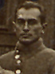

- Source: https://cosandgreatwar.swarthmore.edu/items/show/1076
- Credit: Photographer unidentified; Swarthmore College Peace Collection, William Kantor Papers, CDGA.Kantor.photo-007 (front, catalog date October 18, 1919), with CDGA.Kantor.photo-006 (handwritten key).
- Rights: Archive states that copyright is retained by item authors or their descendants as stipulated by United States law. No open license or separate permission grant is asserted.
- Identity: Number 61 on the original Fort Douglas group photograph corresponds to “H. Moore” in its handwritten name key (item 1075). That name/initial and the World War I conscientious-objector imprisonment context match Howard Moore. The selected crop is the numbered subject, not an identification inferred from facial resemblance.
- Downloaded image: https://cosandgreatwar.swarthmore.edu/iiif-img/2869/full/full/0/default.jpg
- Editing: Exact rectangular crop; retained pixels unchanged. No resampling, color change, sharpening or AI reconstruction.
- SHA-256: `7180667c99f6836abf70353310a44cb28cb2e0721ab2ee9a22d637474b909967`
- Original: [batch261-originals/swarthmore-1076-original.jpg](batch261-originals/swarthmore-1076-original.jpg)
- Crop box: `[1615, 523, 1684, 616]`; source dimensions: `[2293, 1648]`.

## Isabelo de los Reyes

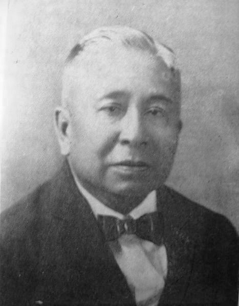

- Source: https://commons.wikimedia.org/wiki/File:Isabelo_de_los_Reyes,_Sr..jpg
- Credit: Photographer unidentified; Unknown sourceUnknown source
- Rights: Public domain according to the linked archive/file record.
- Identity: Isabelo de los Reyes Sr., the Filipino labor organizer and writer; source explicitly distinguishes the elder de los Reyes.
- Downloaded image: https://upload.wikimedia.org/wikipedia/commons/9/95/Isabelo_de_los_Reyes%2C_Sr..jpg?utm_source=en.wikipedia.org&utm_campaign=imageinfo&utm_content=thumbnail_unscaled
- Editing: Downloaded source file retained unchanged, including any source-side crop or provider thumbnail.
- SHA-256: `d0a892eb9cdbb6b6ff2dc0658f558e740876e95708f015c04bff57a11ec10b66`

## Jackie Hudson

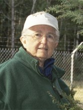

- Source: https://en.wikipedia.org/wiki/File:Jackie_Hudson.jpg
- Credit: Ground Zero Center for Nonviolence; Original publication: Ground Zero Center for Nonviolence Immediate source: http://www.yesmagazine.org/peace-justice/keeping-faith-with-peace; http://www.yesmagazine.org/peace-justice/keeping-faith-with-peace
- Rights: Copyrighted biographical image. The linked file record supplies a fair-use rationale for Wikipedia; this is not an open license or a grant of permission to NPPC. Source attribution and restrictions must be retained.
- Identity: Jackie Hudson, the Dominican sister and anti-nuclear campaigner; Ground Zero Center for Nonviolence’s biographical photograph.
- Downloaded image: https://upload.wikimedia.org/wikipedia/en/f/f4/Jackie_Hudson.jpg?utm_source=en.wikipedia.org&utm_campaign=imageinfo&utm_content=thumbnail_unscaled
- Editing: Downloaded source file retained unchanged, including any source-side crop or provider thumbnail.
- SHA-256: `e4b51c8d4203ce24be8d8b92ba339984abfad0cf3839933c28a5e0e9be5346bf`

## Jacob Conroy

- Source: https://commons.wikimedia.org/wiki/File:Jake_Conroy.jpg
- Credit: Iyo-farm
- Rights: CC BY-SA 4.0: https://creativecommons.org/licenses/by-sa/4.0
- Identity: Jake (Jacob) Conroy, the SHAC campaigner and vegan activist; photographer identifies Jake Conroy, the Cranky Vegan.
- Downloaded image: https://upload.wikimedia.org/wikipedia/commons/e/e4/Jake_Conroy.jpg?utm_source=en.wikipedia.org&utm_campaign=imageinfo&utm_content=thumbnail_unscaled
- Editing: Downloaded source file retained unchanged, including any source-side crop or provider thumbnail.
- SHA-256: `72960a0b01b352418e4bda09b2b97183e4ac804e0920eea87b71b3902bfdd332`

## Jacob E. Haugen

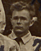

- Source: https://cosandgreatwar.swarthmore.edu/items/show/1076
- Credit: Photographer unidentified; Swarthmore College Peace Collection, William Kantor Papers, CDGA.Kantor.photo-007 (front, catalog date October 18, 1919), with CDGA.Kantor.photo-006 (handwritten key).
- Rights: Archive states that copyright is retained by item authors or their descendants as stipulated by United States law. No open license or separate permission grant is asserted.
- Identity: Number 7 on the original Fort Douglas group photograph corresponds to “J. Haugen” in its handwritten name key (item 1075). That name/initial and the World War I conscientious-objector imprisonment context match Jacob E. Haugen. The selected crop is the numbered subject, not an identification inferred from facial resemblance.
- Downloaded image: https://cosandgreatwar.swarthmore.edu/iiif-img/2869/full/full/0/default.jpg
- Editing: Exact rectangular crop; retained pixels unchanged. No resampling, color change, sharpening or AI reconstruction.
- SHA-256: `4b60987651fe39ccf083531940fb958ef34a9861b5b5ffd425e0ae69d6372ace`
- Original: [batch261-originals/swarthmore-1076-original.jpg](batch261-originals/swarthmore-1076-original.jpg)
- Crop box: `[1006, 803, 1087, 904]`; source dimensions: `[2293, 1648]`.

## Jacob Wortsmann

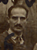

- Source: https://cosandgreatwar.swarthmore.edu/items/show/1076
- Credit: Photographer unidentified; Swarthmore College Peace Collection, William Kantor Papers, CDGA.Kantor.photo-007 (front, catalog date October 18, 1919), with CDGA.Kantor.photo-006 (handwritten key).
- Rights: Archive states that copyright is retained by item authors or their descendants as stipulated by United States law. No open license or separate permission grant is asserted.
- Identity: Number 35 on the original Fort Douglas group photograph corresponds to “J. Wortsman” in its handwritten name key (item 1075). That name/initial and the World War I conscientious-objector imprisonment context match Jacob Wortsmann. The selected crop is the numbered subject, not an identification inferred from facial resemblance.
- Downloaded image: https://cosandgreatwar.swarthmore.edu/iiif-img/2869/full/full/0/default.jpg
- Editing: Exact rectangular crop; retained pixels unchanged. No resampling, color change, sharpening or AI reconstruction.
- SHA-256: `1578301067e91605394a5f471172da524432bb7cf9839096d867b700e296897e`
- Original: [batch261-originals/swarthmore-1076-original.jpg](batch261-originals/swarthmore-1076-original.jpg)
- Crop box: `[822, 618, 897, 719]`; source dimensions: `[2293, 1648]`.

## James B. McNamara

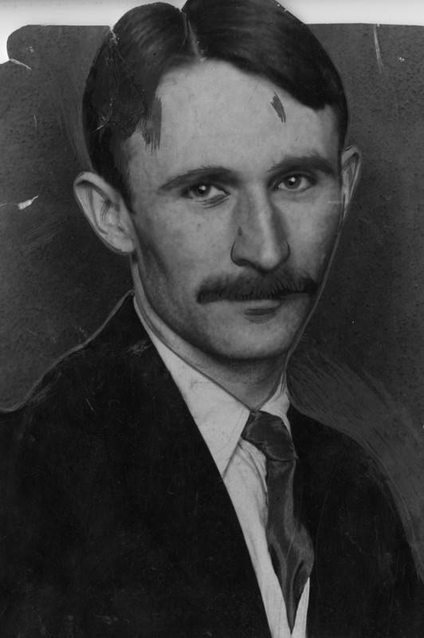

- Source: https://commons.wikimedia.org/wiki/File:James_B._McNamara.jpg
- Credit: Photographer unidentified; https://tessa2.lapl.org/digital/collection/photos/id/28721; https://tessa2.lapl.org/digital/collection/photos/id/28721
- Rights: Public domain according to the linked archive/file record.
- Identity: James B. McNamara, the Los Angeles Times bombing defendant; source names James B., not his brother John J. McNamara.
- Downloaded image: https://upload.wikimedia.org/wikipedia/commons/f/f1/James_B._McNamara.jpg?utm_source=en.wikipedia.org&utm_campaign=imageinfo&utm_content=thumbnail_unscaled
- Editing: Downloaded source file retained unchanged, including any source-side crop or provider thumbnail.
- SHA-256: `ae1a4f7eecab366248743f5d4d8dccc327d09282f2aacc66d37601e7543c70a5`

## Jan Leighton Triggs

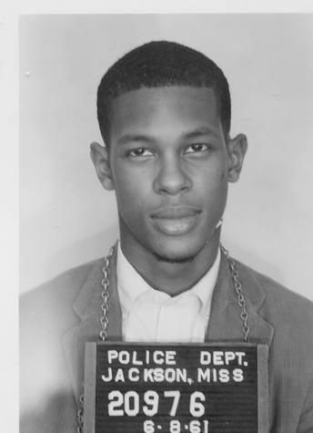

- Source: https://da.mdah.ms.gov/sovcom/photos/120
- Credit: Jackson Police Department booking photograph, 1961-06-08. Mississippi Department of Archives and History, Sovereignty Commission records, Series 2515, SCR ID 2-55-3-84-1-1-1.
- Rights: MDAH archival government record; no blanket public-domain status or permission grant is asserted. MDAH requests a Broadcast/Publication Permission Form before publication. See https://da.mdah.ms.gov/sovcom/generalinfoscweb#rightsmgmt . This batch does not represent that request as completed.
- Identity: MDAH individually catalogs this Freedom Rider booking photograph as Triggs, Jan L., created 1961-06-08. The name and Jackson Freedom Ride context match this record. The crop retains the frontal view of the cataloged person.
- Downloaded image: https://da.mdah.ms.gov/series-files/sovcom/images/large/2-55-3-84-1-1-1.tif.jpg
- Editing: Exact rectangular crop; retained pixels unchanged. No resampling, color change, sharpening or AI reconstruction.
- SHA-256: `66c783419762a088a098d02c6e151b1a1c59ac36532eb30d5f3fc3cb894b5728`
- Original: [batch261-originals/jan-leighton-triggs-original.jpg](batch261-originals/jan-leighton-triggs-original.jpg)
- Crop box: `[48, 56, 392, 531]`; source dimensions: `[800, 617]`.

## Jane Ellen Rosett

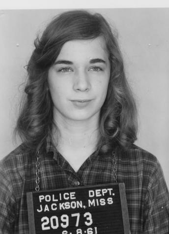

- Source: https://da.mdah.ms.gov/sovcom/photos/117
- Credit: Jackson Police Department booking photograph, 1961-06-08. Mississippi Department of Archives and History, Sovereignty Commission records, Series 2515, SCR ID 2-55-3-81-1-1-1.
- Rights: MDAH archival government record; no blanket public-domain status or permission grant is asserted. MDAH requests a Broadcast/Publication Permission Form before publication. See https://da.mdah.ms.gov/sovcom/generalinfoscweb#rightsmgmt . This batch does not represent that request as completed.
- Identity: MDAH individually catalogs this Freedom Rider booking photograph as Rosett, Jane Ellen, created 1961-06-08. The name and Jackson Freedom Ride context match this record. The crop retains the frontal view of the cataloged person.
- Downloaded image: https://da.mdah.ms.gov/series-files/sovcom/images/large/2-55-3-81-1-1-1.tif.jpg
- Editing: Exact rectangular crop; retained pixels unchanged. No resampling, color change, sharpening or AI reconstruction.
- SHA-256: `af92c69eab4b0a5872a1aa17257819eabfdff2e2dba927c023c5b046afce0e72`
- Original: [batch261-originals/jane-ellen-rosett-original.jpg](batch261-originals/jane-ellen-rosett-original.jpg)
- Crop box: `[48, 55, 392, 529]`; source dimensions: `[800, 615]`.

## Janice Louise Rogers

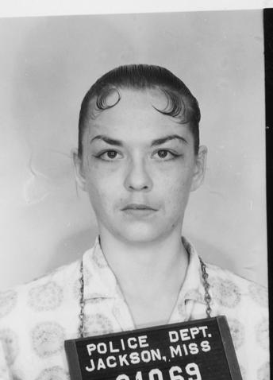

- Source: https://da.mdah.ms.gov/sovcom/photos/289
- Credit: Jackson Police Department booking photograph, 1961-06-25. Mississippi Department of Archives and History, Sovereignty Commission records, Series 2515, SCR ID 2-55-5-130-1-1-1.
- Rights: MDAH archival government record; no blanket public-domain status or permission grant is asserted. MDAH requests a Broadcast/Publication Permission Form before publication. See https://da.mdah.ms.gov/sovcom/generalinfoscweb#rightsmgmt . This batch does not represent that request as completed.
- Identity: MDAH individually catalogs this Freedom Rider booking photograph as Rogers, Janis Louise, created 1961-06-25. The name and Jackson Freedom Ride context match this record. The crop retains the frontal view of the cataloged person. The source form of the name is retained here as a documented variant; no database name or date is changed.
- Downloaded image: https://da.mdah.ms.gov/series-files/sovcom/images/large/2-55-5-130-1-1-1.tif.jpg
- Editing: Exact rectangular crop; retained pixels unchanged. No resampling, color change, sharpening or AI reconstruction.
- SHA-256: `23b05f703c6a57b75300933d4a6699f7b9f9c9be9d1509289b8bf166d490a88c`
- Original: [batch261-originals/janice-louise-rogers-original.jpg](batch261-originals/janice-louise-rogers-original.jpg)
- Crop box: `[48, 56, 392, 534]`; source dimensions: `[800, 621]`.

## Jean Catherine Thompson

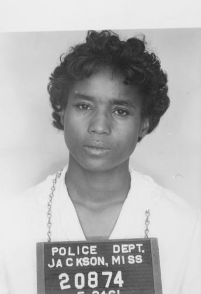

- Source: https://da.mdah.ms.gov/sovcom/photos/79
- Credit: Jackson Police Department booking photograph, 1961-05-24. Mississippi Department of Archives and History, Sovereignty Commission records, Series 2515, SCR ID 2-55-2-76-1-1-1.
- Rights: MDAH archival government record; no blanket public-domain status or permission grant is asserted. MDAH requests a Broadcast/Publication Permission Form before publication. See https://da.mdah.ms.gov/sovcom/generalinfoscweb#rightsmgmt . This batch does not represent that request as completed.
- Identity: MDAH individually catalogs this Freedom Rider booking photograph as Thompson, Jean, created 1961-05-24. The name and Jackson Freedom Ride context match this record. The crop retains the frontal view of the cataloged person.
- Downloaded image: https://da.mdah.ms.gov/series-files/sovcom/images/large/2-55-2-76-1-1-1.tif.jpg
- Editing: Exact rectangular crop; retained pixels unchanged. No resampling, color change, sharpening or AI reconstruction.
- SHA-256: `f8293beb98cefe325af658b7d1b8fbe094a6b4c8456f700b3bc154a5946cabfb`
- Original: [batch261-originals/jean-catherine-thompson-original.jpg](batch261-originals/jean-catherine-thompson-original.jpg)
- Crop box: `[48, 25, 392, 528]`; source dimensions: `[800, 614]`.

## Jesse James Harris

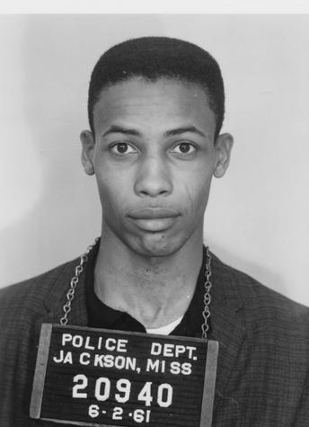

- Source: https://da.mdah.ms.gov/sovcom/photos/144
- Credit: Jackson Police Department booking photograph, 1961-06-02. Mississippi Department of Archives and History, Sovereignty Commission records, Series 2515, SCR ID 2-55-4-16-1-1-1.
- Rights: MDAH archival government record; no blanket public-domain status or permission grant is asserted. MDAH requests a Broadcast/Publication Permission Form before publication. See https://da.mdah.ms.gov/sovcom/generalinfoscweb#rightsmgmt . This batch does not represent that request as completed.
- Identity: MDAH individually catalogs this Freedom Rider booking photograph as Harris, Jesse James, created 1961-06-02. The name and Jackson Freedom Ride context match this record. The crop retains the frontal view of the cataloged person.
- Downloaded image: https://da.mdah.ms.gov/series-files/sovcom/images/large/2-55-4-16-1-1-1.tif.jpg
- Editing: Exact rectangular crop; retained pixels unchanged. No resampling, color change, sharpening or AI reconstruction.
- SHA-256: `7080c159ee4fc9c1035e44dcce98e3d1845b4d9af40dfc471ff7b1c79045df2d`
- Original: [batch261-originals/jesse-james-harris-original.jpg](batch261-originals/jesse-james-harris-original.jpg)
- Crop box: `[48, 56, 392, 531]`; source dimensions: `[800, 618]`.

## John E. Downey

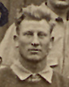

- Source: https://cosandgreatwar.swarthmore.edu/items/show/1076
- Credit: Photographer unidentified; Swarthmore College Peace Collection, William Kantor Papers, CDGA.Kantor.photo-007 (front, catalog date October 18, 1919), with CDGA.Kantor.photo-006 (handwritten key).
- Rights: Archive states that copyright is retained by item authors or their descendants as stipulated by United States law. No open license or separate permission grant is asserted.
- Identity: Number 31 on the original Fort Douglas group photograph corresponds to “J. Downey” in its handwritten name key (item 1075). That name/initial and the World War I conscientious-objector imprisonment context match John E. Downey. The selected crop is the numbered subject, not an identification inferred from facial resemblance.
- Downloaded image: https://cosandgreatwar.swarthmore.edu/iiif-img/2869/full/full/0/default.jpg
- Editing: Exact rectangular crop; retained pixels unchanged. No resampling, color change, sharpening or AI reconstruction.
- SHA-256: `fec9b941e380261d9b9f8b909096e379420feff154f61085f066451bc6a842ea`
- Original: [batch261-originals/swarthmore-1076-original.jpg](batch261-originals/swarthmore-1076-original.jpg)
- Crop box: `[390, 547, 479, 658]`; source dimensions: `[2293, 1648]`.

## John J. Ballam

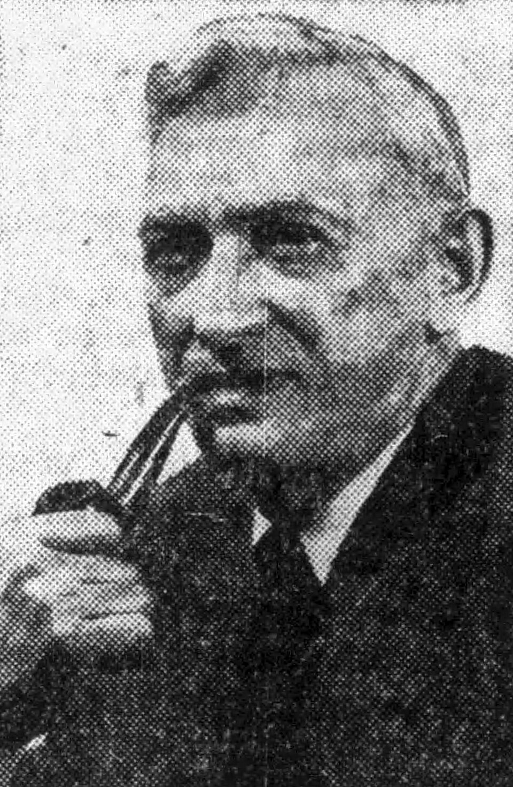

- Source: https://commons.wikimedia.org/wiki/File:John_J._Ballam_1939_Edit.jpg
- Credit: Photographer unidentified; https://www.newspapers.com/image/1143567166/; https://www.newspapers.com/image/1143567166/
- Rights: Public domain according to the linked archive/file record.
- Identity: John J. Ballam, the American Communist and labor organizer; named period portrait.
- Downloaded image: https://thumb.wikimedia.org/wikipedia/commons/thumb/7/7f/John_J._Ballam_1939_Edit.jpg/960px-John_J._Ballam_1939_Edit.jpg?utm_source=en.wikipedia.org&utm_campaign=imageinfo&utm_content=thumbnail
- Editing: Downloaded source file retained unchanged, including any source-side crop or provider thumbnail.
- SHA-256: `abc23a7caf78fa2f01cdc9befda0c4fa3f68cbc5b7402cfe24b72324daa2682b`

## Joseph Carter

- Source: https://da.mdah.ms.gov/sovcom/photos/78
- Credit: Jackson Police Department booking photograph, 1961-05-24. Mississippi Department of Archives and History, Sovereignty Commission records, Series 2515, SCR ID 2-55-2-75-1-1-1.
- Rights: MDAH archival government record; no blanket public-domain status or permission grant is asserted. MDAH requests a Broadcast/Publication Permission Form before publication. See https://da.mdah.ms.gov/sovcom/generalinfoscweb#rightsmgmt . This batch does not represent that request as completed.
- Identity: MDAH individually catalogs this Freedom Rider booking photograph as Carter, Joseph, created 1961-05-24. The name and Jackson Freedom Ride context match this record. The crop retains the frontal view of the cataloged person.
- Downloaded image: https://da.mdah.ms.gov/series-files/sovcom/images/large/2-55-2-75-1-1-1.tif.jpg
- Editing: Exact rectangular crop; retained pixels unchanged. No resampling, color change, sharpening or AI reconstruction.
- SHA-256: `8ee4e4a8d29020d78245ef72a165efd8b6868d76c4259a0fe3e88b2fdccf072b`
- Original: [batch261-originals/joseph-carter-original.jpg](batch261-originals/joseph-carter-original.jpg)
- Crop box: `[48, 55, 392, 528]`; source dimensions: `[800, 614]`.

## Joseph Caruso

- Source: https://commons.wikimedia.org/wiki/File:Caruso_Ettor_Giovannitti_capture.jpg
- Credit: Library of Congress Prints and Photographs Division, LC-USZ62-108488; photographer unidentified. https://hdl.loc.gov/loc.pnp/cph.3c08488
- Rights: Public domain according to the linked archive/file record.
- Identity: Library of Congress caption LC-USZ62-108488 explicitly identifies Joseph Caruso on the LEFT, Joseph J. Ettor in the CENTER and Arturo Giovannitti on the RIGHT. Left subject cropped; matches the Lawrence textile worker and 1912 strike defendant.
- Downloaded image: https://thumb.wikimedia.org/wikipedia/commons/thumb/1/10/Caruso_Ettor_Giovannitti_capture.jpg/960px-Caruso_Ettor_Giovannitti_capture.jpg?utm_source=en.wikipedia.org&utm_campaign=imageinfo&utm_content=thumbnail
- Editing: Exact rectangular crop; retained pixels unchanged. No resampling, color change, sharpening or AI reconstruction.
- SHA-256: `e9424d5b5aa76a03fa27ff07f9c5d000c137c05fe4a3c14dafb6b39a757bf74c`
- Original: [batch261-originals/joseph-ettor-original.jpg](batch261-originals/joseph-ettor-original.jpg)
- Crop box: `[37, 118, 293, 459]`; source dimensions: `[960, 766]`.

## Joseph Ettor

- Source: https://commons.wikimedia.org/wiki/File:Caruso_Ettor_Giovannitti_capture.jpg
- Credit: Library of Congress Prints and Photographs Division, LC-USZ62-108488; photographer unidentified. https://hdl.loc.gov/loc.pnp/cph.3c08488
- Rights: Public domain according to the linked archive/file record.
- Identity: Joseph J. Ettor, the Lawrence strike organizer. Library of Congress caption LC-USZ62-108488 explicitly orders Joseph Caruso LEFT, Ettor CENTER, Arturo Giovannitti RIGHT; center subject cropped.
- Downloaded image: https://thumb.wikimedia.org/wikipedia/commons/thumb/1/10/Caruso_Ettor_Giovannitti_capture.jpg/960px-Caruso_Ettor_Giovannitti_capture.jpg?utm_source=en.wikipedia.org&utm_campaign=imageinfo&utm_content=thumbnail
- Editing: Exact rectangular crop; retained pixels unchanged. No resampling, color change, sharpening or AI reconstruction.
- SHA-256: `6b3f0d33b957c6f0c1bd9e08c0145020e8a0f35574c191527d6eb4ea9b9dba03`
- Original: [batch261-originals/joseph-ettor-original.jpg](batch261-originals/joseph-ettor-original.jpg)
- Crop box: `[293, 83, 643, 515]`; source dimensions: `[960, 766]`.

## Josephine Collins

- Source: https://commons.wikimedia.org/wiki/File:Josephine_Collins.jpg
- Credit: Photographer unidentified; https://framinghamhistory.org/biographies/josephine-collins-1879-1960/; https://framinghamhistory.org/biographies/josephine-collins-1879-1960/
- Rights: Public domain according to the linked archive/file record.
- Identity: Josephine Collins, the American suffragist (1879–1961); source identifies the National Woman’s Party activist, not the British actress of a similar name.
- Downloaded image: https://upload.wikimedia.org/wikipedia/commons/5/59/Josephine_Collins.jpg?utm_source=en.wikipedia.org&utm_campaign=imageinfo&utm_content=thumbnail_unscaled
- Editing: Downloaded source file retained unchanged, including any source-side crop or provider thumbnail.
- SHA-256: `b9a149b6ddb8b13a5628684a1abd3a909316cdb444517f93458781d2cdfa6ddd`

## Josephine Johnson

- Source: https://en.wikipedia.org/wiki/File:Josephine_Johnson.jpg
- Credit: Unknown; Original publication: Unknown Immediate source: https://www.simonandschuster.com/authors/Josephine-Johnson/181441460; https://www.simonandschuster.com/authors/Josephine-Johnson/181441460
- Rights: Copyrighted biographical image. The linked file record supplies a fair-use rationale for Wikipedia; this is not an open license or a grant of permission to NPPC. Source attribution and restrictions must be retained.
- Identity: Josephine Johnson, the novelist jailed during Southern Tenant Farmers’ Union organizing in Arkansas; publisher’s named author portrait.
- Downloaded image: https://upload.wikimedia.org/wikipedia/en/c/cd/Josephine_Johnson.jpg?utm_source=en.wikipedia.org&utm_campaign=imageinfo&utm_content=thumbnail_unscaled
- Editing: Downloaded source file retained unchanged, including any source-side crop or provider thumbnail.
- SHA-256: `5050e77c9c62895c1e106b0cb61a80687881798fc529826bfccc069a8115a6f8`

## Julius Eichel

- Source: https://cosandgreatwar.swarthmore.edu/items/show/1076
- Credit: Photographer unidentified; Swarthmore College Peace Collection, William Kantor Papers, CDGA.Kantor.photo-007 (front, catalog date October 18, 1919), with CDGA.Kantor.photo-006 (handwritten key).
- Rights: Archive states that copyright is retained by item authors or their descendants as stipulated by United States law. No open license or separate permission grant is asserted.
- Identity: Number 34 on the original Fort Douglas group photograph corresponds to “J. Eichel” in its handwritten name key (item 1075). That name/initial and the World War I conscientious-objector imprisonment context match Julius Eichel. The selected crop is the numbered subject, not an identification inferred from facial resemblance.
- Downloaded image: https://cosandgreatwar.swarthmore.edu/iiif-img/2869/full/full/0/default.jpg
- Editing: Exact rectangular crop; retained pixels unchanged. No resampling, color change, sharpening or AI reconstruction.
- SHA-256: `ae45cfc0a56732e9b4b71ca85b4567b7ac919d5a44963b72714ed4f1b4118941`
- Original: [batch261-originals/swarthmore-1076-original.jpg](batch261-originals/swarthmore-1076-original.jpg)
- Crop box: `[717, 607, 797, 720]`; source dimensions: `[2293, 1648]`.

## Knud M. Lassen

- Source: https://cosandgreatwar.swarthmore.edu/items/show/1076
- Credit: Photographer unidentified; Swarthmore College Peace Collection, William Kantor Papers, CDGA.Kantor.photo-007 (front, catalog date October 18, 1919), with CDGA.Kantor.photo-006 (handwritten key).
- Rights: Archive states that copyright is retained by item authors or their descendants as stipulated by United States law. No open license or separate permission grant is asserted.
- Identity: Number 47 on the original Fort Douglas group photograph corresponds to “K. Lassen” in its handwritten name key (item 1075). That name/initial and the World War I conscientious-objector imprisonment context match Knud M. Lassen. The selected crop is the numbered subject, not an identification inferred from facial resemblance.
- Downloaded image: https://cosandgreatwar.swarthmore.edu/iiif-img/2869/full/full/0/default.jpg
- Editing: Exact rectangular crop; retained pixels unchanged. No resampling, color change, sharpening or AI reconstruction.
- SHA-256: `963305051dad0ecc634d90ea3844dd5f2202cb935d50625b01a47222e6cc085d`
- Original: [batch261-originals/swarthmore-1076-original.jpg](batch261-originals/swarthmore-1076-original.jpg)
- Crop box: `[431, 490, 505, 591]`; source dimensions: `[2293, 1648]`.

## L. J. C. Daniels

- Source: https://commons.wikimedia.org/wiki/File:L._J._C._Daniels.png
- Credit: Unknown author; Photograph taken before 1900 https://vermontdailychronicle.com/vermont-suffragette-who-picketed-white-house-in-1917-honored-in-painting/; https://vermontdailychronicle.com/vermont-suffragette-who-picketed-white-house-in-1917-honored-in-painting/
- Rights: Public domain according to the linked archive/file record.
- Identity: L. J. C. Daniels, the American suffragist; individually named historical portrait.
- Downloaded image: https://upload.wikimedia.org/wikipedia/commons/4/4d/L._J._C._Daniels.png?utm_source=en.wikipedia.org&utm_campaign=imageinfo&utm_content=thumbnail_unscaled
- Editing: Downloaded source file retained unchanged, including any source-side crop or provider thumbnail.
- SHA-256: `2a235b26ddb5dcb1efa34ed91d52351875216e37bd208428336864fac8670608`

## Larry Pinkney

- Source: https://commons.wikimedia.org/wiki/File:Larry_Pinkney_2015.jpg
- Credit: K. C. Dehnhard
- Rights: CC BY-SA 4.0: https://creativecommons.org/licenses/by-sa/4.0
- Identity: Larry Pinkney, the former Panther and political activist; photographer identifies Pinkney in 2015.
- Downloaded image: https://upload.wikimedia.org/wikipedia/commons/6/6e/Larry_Pinkney_2015.jpg?utm_source=en.wikipedia.org&utm_campaign=imageinfo&utm_content=thumbnail_unscaled
- Editing: Downloaded source file retained unchanged, including any source-side crop or provider thumbnail.
- SHA-256: `60a74db28eee20f7a8617645e8031a1696085a9b844145a88a5145811a20e1a4`

## Lawrence Williamson

- Source: https://cosandgreatwar.swarthmore.edu/items/show/908
- Credit: Photographer unidentified; Friends Historical Library, FHL.SC/196-014; catalog date 1917.
- Rights: The archive does not supply an open reuse license. Copyrighted material may only be reproduced in accordance with regulations as specified by copyright law. Researchers using the Library assume legal responsibility for observing these regulations and agree to indemnify the Library for any liability incurred through their use of the Library's holdings. As owner of the physical manuscript, Friends Historical Library may assert certain proprietary rights in regard to the physical manuscript, for example permitting or denying access to the property. This assertion of ownership rights, however, is distinct and separate from any copyright consideration affecting the manuscript. Researchers using the Library assume legal responsibility for observing copyright regulations and agree to indemnify the Library for any liability incurred through their use of the Library's holdings.
- Identity: The archival title “Photograph: Lawrence Williamson” individually names the photographed World War I conscientious objector and matches this profile. No identification from an unnamed group is used.
- Downloaded image: https://cosandgreatwar.swarthmore.edu/iiif-img/2613/full/full/0/default.jpg
- Editing: Exact rectangular crop; retained pixels unchanged. No resampling, color change, sharpening or AI reconstruction.
- SHA-256: `f7dc355fbb5d0f25fd5160756482d12296fcf87e578bceb0d787ee6e99e165d6`
- Original: [batch261-originals/swarthmore-908-original.jpg](batch261-originals/swarthmore-908-original.jpg)
- Crop box: `[62, 73, 472, 650]`; source dimensions: `[519, 813]`.

## Leon J. Kamin

- Source: https://en.wikipedia.org/wiki/File:Leon_Kamin.jpg
- Credit: Princeton University; Original publication: Unknown Immediate source: https://psych.princeton.edu/news/kaminmemoriam; https://psych.princeton.edu/news/kaminmemoriam
- Rights: Copyrighted biographical image. The linked file record supplies a fair-use rationale for Wikipedia; this is not an open license or a grant of permission to NPPC. Source attribution and restrictions must be retained.
- Identity: Leon J. Kamin, the psychologist involved in the congressional contempt case; Princeton University’s memorial portrait.
- Downloaded image: https://upload.wikimedia.org/wikipedia/en/a/a5/Leon_Kamin.jpg?utm_source=en.wikipedia.org&utm_campaign=imageinfo&utm_content=thumbnail_unscaled
- Editing: Downloaded source file retained unchanged, including any source-side crop or provider thumbnail.
- SHA-256: `a1e878f46fce7877bcafc662d18442e25577961c84c2edbeb76c65f792ae17f9`

## Leslie Word

- Source: https://da.mdah.ms.gov/sovcom/photos/145
- Credit: Jackson Police Department booking photograph, 1961-06-02. Mississippi Department of Archives and History, Sovereignty Commission records, Series 2515, SCR ID 2-55-4-17-1-1-1.
- Rights: MDAH archival government record; no blanket public-domain status or permission grant is asserted. MDAH requests a Broadcast/Publication Permission Form before publication. See https://da.mdah.ms.gov/sovcom/generalinfoscweb#rightsmgmt . This batch does not represent that request as completed.
- Identity: MDAH individually catalogs this Freedom Rider booking photograph as Word, Leslie, created 1961-06-02. The name and Jackson Freedom Ride context match this record. The crop retains the frontal view of the cataloged person.
- Downloaded image: https://da.mdah.ms.gov/series-files/sovcom/images/large/2-55-4-17-1-1-1.tif.jpg
- Editing: Exact rectangular crop; retained pixels unchanged. No resampling, color change, sharpening or AI reconstruction.
- SHA-256: `08803f32b186254e20c9ada173da9dd9d489d5e3456ee83893f5b3042aa45956`
- Original: [batch261-originals/leslie-word-original.jpg](batch261-originals/leslie-word-original.jpg)
- Crop box: `[48, 56, 392, 531]`; source dimensions: `[800, 618]`.

## Lewis J. Gergotz

- Source: https://cosandgreatwar.swarthmore.edu/items/show/1076
- Credit: Photographer unidentified; Swarthmore College Peace Collection, William Kantor Papers, CDGA.Kantor.photo-007 (front, catalog date October 18, 1919), with CDGA.Kantor.photo-006 (handwritten key).
- Rights: Archive states that copyright is retained by item authors or their descendants as stipulated by United States law. No open license or separate permission grant is asserted.
- Identity: Number 48 on the original Fort Douglas group photograph corresponds to “L. Gergotz” in its handwritten name key (item 1075). That name/initial and the World War I conscientious-objector imprisonment context match Lewis J. Gergotz. The selected crop is the numbered subject, not an identification inferred from facial resemblance.
- Downloaded image: https://cosandgreatwar.swarthmore.edu/iiif-img/2869/full/full/0/default.jpg
- Editing: Exact rectangular crop; retained pixels unchanged. No resampling, color change, sharpening or AI reconstruction.
- SHA-256: `5c6950c668d19396ff162e92d24a0857f496461ec90132a92ce3809c346cab47`
- Original: [batch261-originals/swarthmore-1076-original.jpg](batch261-originals/swarthmore-1076-original.jpg)
- Crop box: `[536, 437, 603, 523]`; source dimensions: `[2293, 1648]`.

## Lucy Gwynne Branham

- Source: https://commons.wikimedia.org/wiki/File:WOMAN_SUFFRAGE._LUCY_BRANHAM_WITH_POSTERS_LCCN2016869829_(cropped).jpg
- Credit: Harris & Ewing, photographer; Library of Congress Catalog: https://lccn.loc.gov/2016869829 Image download: https://cdn.loc.gov/service/pnp/hec/11900/11942v.jpg Original url: https://www.loc.gov/pictures/item/2016869829/; https://lccn.loc.gov/2016869829 ; https://cdn.loc.gov/service/pnp/hec/11900/11942v.jpg ; https://www.loc.gov/pictures/item/2016869829/
- Rights: Public domain according to the linked archive/file record.
- Identity: Lucy Gwynne Branham, the suffragist; Harris & Ewing negative explicitly names Lucy Branham holding suffrage-prisoner posters. The Lucy G. Branham alias record is not counted again.
- Downloaded image: https://thumb.wikimedia.org/wikipedia/commons/thumb/9/91/WOMAN_SUFFRAGE._LUCY_BRANHAM_WITH_POSTERS_LCCN2016869829_%28cropped%29.jpg/960px-WOMAN_SUFFRAGE._LUCY_BRANHAM_WITH_POSTERS_LCCN2016869829_%28cropped%29.jpg?utm_source=en.wikipedia.org&utm_campaign=imageinfo&utm_content=thumbnail
- Editing: Exact rectangular crop; retained pixels unchanged. No resampling, color change, sharpening or AI reconstruction.
- SHA-256: `366f892f5f2746787544d1e0ab18ec678c08f79dd1d935e2f32481d6aa097478`
- Original: [batch261-originals/lucy-gwynne-branham-original.jpg](batch261-originals/lucy-gwynne-branham-original.jpg)
- Crop box: `[298, 45, 701, 383]`; source dimensions: `[960, 1278]`.

## Luis Gutiérrez

- Source: https://commons.wikimedia.org/wiki/File:Luis_Guti%C3%A9rrez_official_photo_(3x4a).jpg
- Credit: U.S. House of Representatives; Congressman Luis V. Gutierrez' Official Facebook Page (administered by the House of Representatives) http://www.facebook.com/photo.php?fbid=10151067794483205&set=a.436895228204.239315.91052833204&type=1&theater; http://www.facebook.com/photo.php?fbid=10151067794483205&set=a.436895228204.239315.91052833204&type=1&theater ; https://www.facebook.com/photo.php?fbid=10151067794483205&set=a.436895228204.239315.91052833204&type=1&theater
- Rights: Public domain according to the linked archive/file record.
- Identity: Luis V. Gutiérrez, the Illinois congressman arrested at Vieques; official House portrait identifies the Fourth District representative.
- Downloaded image: https://thumb.wikimedia.org/wikipedia/commons/thumb/b/bf/Luis_Guti%C3%A9rrez_official_photo_%283x4a%29.jpg/960px-Luis_Guti%C3%A9rrez_official_photo_%283x4a%29.jpg?utm_source=en.wikipedia.org&utm_campaign=imageinfo&utm_content=thumbnail
- Editing: Downloaded source file retained unchanged, including any source-side crop or provider thumbnail.
- SHA-256: `69c75f60b20ab497c7ed07f2718e1d45b43cc51c0dc9a617a8259ec6de8941c1`

## Margaret Winonah Beamer

- Source: https://da.mdah.ms.gov/sovcom/photos/869
- Credit: Jackson Police Department booking photograph, 1961-06-09. Mississippi Department of Archives and History, Sovereignty Commission records, Series 2515, SCR ID 2-55-3-102-1-1-1.
- Rights: MDAH archival government record; no blanket public-domain status or permission grant is asserted. MDAH requests a Broadcast/Publication Permission Form before publication. See https://da.mdah.ms.gov/sovcom/generalinfoscweb#rightsmgmt . This batch does not represent that request as completed.
- Identity: MDAH individually catalogs this Freedom Rider booking photograph as Beamer, Winonah, created 1961-06-09. The name and Jackson Freedom Ride context match this record. The crop retains the frontal view of the cataloged person.
- Downloaded image: https://da.mdah.ms.gov/series-files/sovcom/images/large/2-55-3-102-1-1-1.tif.jpg
- Editing: Exact rectangular crop; retained pixels unchanged. No resampling, color change, sharpening or AI reconstruction.
- SHA-256: `af924c258a3f63d3baa7ee924f14908343aa7fd3a561d1a115ef10a9a7c8b93f`
- Original: [batch261-originals/margaret-winonah-beamer-original.jpg](batch261-originals/margaret-winonah-beamer-original.jpg)
- Crop box: `[48, 55, 392, 529]`; source dimensions: `[800, 615]`.

## Mark Comfort

- Source: https://en.wikipedia.org/wiki/File:Mark_Comfort.jpg
- Credit: Unknown; Original publication: California, May 3, 1967 Immediate source: https://www.sacbee.com/news/local/history/article148667224.html; https://www.sacbee.com/news/local/history/article148667224.html
- Rights: Copyrighted biographical image. The linked file record supplies a fair-use rationale for Wikipedia; this is not an open license or a grant of permission to NPPC. Source attribution and restrictions must be retained.
- Identity: Mark Comfort, the Oakland organizer; source identifies him at the California Capitol on May 2, 1967. Crop isolates Comfort from the adjacent man.
- Downloaded image: https://upload.wikimedia.org/wikipedia/en/f/f4/Mark_Comfort.jpg?utm_source=en.wikipedia.org&utm_campaign=imageinfo&utm_content=thumbnail_unscaled
- Editing: Exact rectangular crop; retained pixels unchanged. No resampling, color change, sharpening or AI reconstruction.
- SHA-256: `4609b51dcd90d21fd9d7a291e824fa0481bfaec60810ceab2c0c29f5a944b945`
- Original: [batch261-originals/mark-comfort-original.jpg](batch261-originals/mark-comfort-original.jpg)
- Crop box: `[60, 50, 208, 237]`; source dimensions: `[273, 363]`.

## Marvin Allen Davidov

- Source: https://da.mdah.ms.gov/sovcom/photos/175
- Credit: Jackson Police Department booking photograph, 1961-06-11. Mississippi Department of Archives and History, Sovereignty Commission records, Series 2515, SCR ID 2-55-4-58-1-1-1.
- Rights: MDAH archival government record; no blanket public-domain status or permission grant is asserted. MDAH requests a Broadcast/Publication Permission Form before publication. See https://da.mdah.ms.gov/sovcom/generalinfoscweb#rightsmgmt . This batch does not represent that request as completed.
- Identity: MDAH individually catalogs this Freedom Rider booking photograph as Davidov, Marvin, created 1961-06-11. The name and Jackson Freedom Ride context match this record. The crop retains the frontal view of the cataloged person.
- Downloaded image: https://da.mdah.ms.gov/series-files/sovcom/images/large/2-55-4-58-1-1-1.tif.jpg
- Editing: Exact rectangular crop; retained pixels unchanged. No resampling, color change, sharpening or AI reconstruction.
- SHA-256: `5983f7d572a66b7825d6d64acf0f934f2758f4b01d7520ab8c8f01cef28d3047`
- Original: [batch261-originals/marvin-allen-davidov-original.jpg](batch261-originals/marvin-allen-davidov-original.jpg)
- Crop box: `[48, 55, 392, 530]`; source dimensions: `[800, 616]`.

## Matthew Walker Jr.

- Source: https://da.mdah.ms.gov/sovcom/photos/77
- Credit: Jackson Police Department booking photograph, 1961-05-24. Mississippi Department of Archives and History, Sovereignty Commission records, Series 2515, SCR ID 2-55-2-74-1-1-1.
- Rights: MDAH archival government record; no blanket public-domain status or permission grant is asserted. MDAH requests a Broadcast/Publication Permission Form before publication. See https://da.mdah.ms.gov/sovcom/generalinfoscweb#rightsmgmt . This batch does not represent that request as completed.
- Identity: MDAH individually catalogs this Freedom Rider booking photograph as Walker, Matthew, Jr., created 1961-05-24. The name and Jackson Freedom Ride context match this record. The crop retains the frontal view of the cataloged person.
- Downloaded image: https://da.mdah.ms.gov/series-files/sovcom/images/large/2-55-2-74-1-1-1.tif.jpg
- Editing: Exact rectangular crop; retained pixels unchanged. No resampling, color change, sharpening or AI reconstruction.
- SHA-256: `0c9918810744cf804c0fab2e8dae0d9038e74df531e77e71edf349e4bd21fc58`
- Original: [batch261-originals/matthew-walker-jr-original.jpg](batch261-originals/matthew-walker-jr-original.jpg)
- Crop box: `[48, 55, 392, 528]`; source dimensions: `[800, 614]`.

## Michael J. Audain

- Source: https://da.mdah.ms.gov/sovcom/photos/114
- Credit: Jackson Police Department booking photograph, 1961-06-08. Mississippi Department of Archives and History, Sovereignty Commission records, Series 2515, SCR ID 2-55-3-77-1-1-1.
- Rights: MDAH archival government record; no blanket public-domain status or permission grant is asserted. MDAH requests a Broadcast/Publication Permission Form before publication. See https://da.mdah.ms.gov/sovcom/generalinfoscweb#rightsmgmt . This batch does not represent that request as completed.
- Identity: MDAH individually catalogs this Freedom Rider booking photograph as Audain, Michael J., created 1961-06-08. The name and Jackson Freedom Ride context match this record. The crop retains the frontal view of the cataloged person.
- Downloaded image: https://da.mdah.ms.gov/series-files/sovcom/images/large/2-55-3-77-1-1-1.tif.jpg
- Editing: Exact rectangular crop; retained pixels unchanged. No resampling, color change, sharpening or AI reconstruction.
- SHA-256: `29d8325e1536d9492c7ff6d3d10e3c1619663fd0adbfba42587b1e93c97920be`
- Original: [batch261-originals/michael-j-audain-original.jpg](batch261-originals/michael-j-audain-original.jpg)
- Crop box: `[48, 56, 392, 533]`; source dimensions: `[800, 620]`.

## Mugo Gatheru

- Source: https://en.wikipedia.org/wiki/File:Portrait_of_Reuel_John_Mugo_Gatheru.jpg
- Credit: Unknown; Original publication: Rear cover of Child of Two Worlds, Mugo Gatheru's autobiography Immediate source: Scan of a physical copy of the book
- Rights: Copyrighted biographical image. The linked file record supplies a fair-use rationale for Wikipedia; this is not an open license or a grant of permission to NPPC. Source attribution and restrictions must be retained.
- Identity: Reuel John Mugo Gatheru, the Kenyan writer and former Lincoln University student; named graduation portrait from the rear cover of his autobiography Child of Two Worlds (1964).
- Downloaded image: https://upload.wikimedia.org/wikipedia/en/b/b0/Portrait_of_Reuel_John_Mugo_Gatheru.jpg?utm_source=en.wikipedia.org&utm_campaign=imageinfo&utm_content=thumbnail_unscaled
- Editing: Downloaded source file retained unchanged, including any source-side crop or provider thumbnail.
- SHA-256: `e382cce9ae18d3c7cb901345f89d4ec8aaf7243f7bb9583cb2fe6171356bb153`

## Ned Cobb

- Source: https://commons.wikimedia.org/wiki/File:Ned_Cobb_with_family.png
- Credit: Courtesy of Theodore Rosengarten; https://www.nytimes.com/2014/04/19/books/all-gods-dangers-a-forgotten-autobiography.html; https://www.nytimes.com/2014/04/19/books/all-gods-dangers-a-forgotten-autobiography.html
- Rights: Public domain according to the linked archive/file record.
- Identity: Ned Cobb, also known as Nate Shaw, the Alabama sharecropper and union activist; 1907 family portrait caption identifies Cobb standing on the LEFT beside his wife Viola and son Andrew.
- Downloaded image: https://upload.wikimedia.org/wikipedia/commons/e/e9/Ned_Cobb_with_family.png?utm_source=en.wikipedia.org&utm_campaign=imageinfo&utm_content=thumbnail_unscaled
- Editing: Exact rectangular crop; retained pixels unchanged. No resampling, color change, sharpening or AI reconstruction.
- SHA-256: `ae71dd4832cf339e4af9eb874d5f076ce3a80b574d8b9551781a52fe49fa2b43`
- Original: [batch261-originals/ned-cobb-original.png](batch261-originals/ned-cobb-original.png)
- Crop box: `[90, 26, 418, 502]`; source dimensions: `[820, 1024]`.

## Nehanda Abiodun

- Source: https://en.wikipedia.org/wiki/File:Nehanda_Abiodun.png
- Credit: CiberCuba; Original publication: obituary Immediate source: https://www.cibercuba.com/noticias/2019-02-09-u1-e20037-s27061-muere-habana-nehanda-abiodun-refugiada-cuba-mujeres-buscadas; https://www.cibercuba.com/noticias/2019-02-09-u1-e20037-s27061-muere-habana-nehanda-abiodun-refugiada-cuba-mujeres-buscadas
- Rights: Copyrighted biographical image. The linked file record supplies a fair-use rationale for Wikipedia; this is not an open license or a grant of permission to NPPC. Source attribution and restrictions must be retained.
- Identity: Nehanda Abiodun, the New Afrikan activist who lived in Cuba; named CiberCuba obituary photograph.
- Downloaded image: https://upload.wikimedia.org/wikipedia/en/e/ee/Nehanda_Abiodun.png?utm_source=en.wikipedia.org&utm_campaign=imageinfo&utm_content=thumbnail_unscaled
- Editing: Downloaded source file retained unchanged, including any source-side crop or provider thumbnail.
- SHA-256: `b2acb0c1c892e9146a730286ce63612bfc078d8994d7a2f3e6dbb6747e7a8a88`

## Noah Jos. Blair

- Source: https://cosandgreatwar.swarthmore.edu/items/show/1076
- Credit: Photographer unidentified; Swarthmore College Peace Collection, William Kantor Papers, CDGA.Kantor.photo-007 (front, catalog date October 18, 1919), with CDGA.Kantor.photo-006 (handwritten key).
- Rights: Archive states that copyright is retained by item authors or their descendants as stipulated by United States law. No open license or separate permission grant is asserted.
- Identity: Number 60 on the original Fort Douglas group photograph corresponds to “N. Blair” in its handwritten name key (item 1075). That name/initial and the World War I conscientious-objector imprisonment context match Noah Jos. Blair. The selected crop is the numbered subject, not an identification inferred from facial resemblance.
- Downloaded image: https://cosandgreatwar.swarthmore.edu/iiif-img/2869/full/full/0/default.jpg
- Editing: Exact rectangular crop; retained pixels unchanged. No resampling, color change, sharpening or AI reconstruction.
- SHA-256: `d249134e546f894e8635c9d9c81806f9f09d36c8fac753d02f879a33c9d8093e`
- Original: [batch261-originals/swarthmore-1076-original.jpg](batch261-originals/swarthmore-1076-original.jpg)
- Crop box: `[1555, 545, 1620, 621]`; source dimensions: `[2293, 1648]`.

## Obadiah Lee Simms

- Source: https://da.mdah.ms.gov/sovcom/photos/129
- Credit: Jackson Police Department booking photograph, 1961-06-07. Mississippi Department of Archives and History, Sovereignty Commission records, Series 2515, SCR ID 2-55-3-99-1-1-1.
- Rights: MDAH archival government record; no blanket public-domain status or permission grant is asserted. MDAH requests a Broadcast/Publication Permission Form before publication. See https://da.mdah.ms.gov/sovcom/generalinfoscweb#rightsmgmt . This batch does not represent that request as completed.
- Identity: MDAH individually catalogs this Freedom Rider booking photograph as Simms, Obadiah, III, created 1961-06-07. The name and Jackson Freedom Ride context match this record. The crop retains the frontal view of the cataloged person. The source form of the name is retained here as a documented variant; no database name or date is changed.
- Downloaded image: https://da.mdah.ms.gov/series-files/sovcom/images/large/2-55-3-99-1-1-1.tif.jpg
- Editing: Exact rectangular crop; retained pixels unchanged. No resampling, color change, sharpening or AI reconstruction.
- SHA-256: `a20917d9a4a3dae52dd96bb163f7bfe4c505048dcf17b9b1f4069722aa7f5c15`
- Original: [batch261-originals/obadiah-lee-simms-original.jpg](batch261-originals/obadiah-lee-simms-original.jpg)
- Crop box: `[48, 55, 392, 529]`; source dimensions: `[800, 615]`.

## Peter Harry Stoner

- Source: https://da.mdah.ms.gov/sovcom/photos/218
- Credit: Jackson Police Department booking photograph, 1961-07-02. Mississippi Department of Archives and History, Sovereignty Commission records, Series 2515, SCR ID 2-55-5-25-1-1-1.
- Rights: MDAH archival government record; no blanket public-domain status or permission grant is asserted. MDAH requests a Broadcast/Publication Permission Form before publication. See https://da.mdah.ms.gov/sovcom/generalinfoscweb#rightsmgmt . This batch does not represent that request as completed.
- Identity: MDAH individually catalogs this Freedom Rider booking photograph as Stoner, Harry Peter, created 1961-07-02. The name and Jackson Freedom Ride context match this record. The crop retains the frontal view of the cataloged person. The source form of the name is retained here as a documented variant; no database name or date is changed.
- Downloaded image: https://da.mdah.ms.gov/series-files/sovcom/images/large/2-55-5-25-1-1-1.tif.jpg
- Editing: Exact rectangular crop; retained pixels unchanged. No resampling, color change, sharpening or AI reconstruction.
- SHA-256: `579e607367244aa49e3a4945f7eef9976857d8e6b3f7f8fac727a2fca9dbc053`
- Original: [batch261-originals/peter-harry-stoner-original.jpg](batch261-originals/peter-harry-stoner-original.jpg)
- Crop box: `[48, 55, 392, 523]`; source dimensions: `[800, 608]`.

## Philip Caplovitz

- Source: https://cosandgreatwar.swarthmore.edu/items/show/1035
- Credit: Photographer unidentified; Swarthmore College Peace Collection, CDGA.Caplovitz.photo-019; catalog date 1919-11.
- Rights: The archive does not supply an open reuse license. Copyright is retained by the authors of items in these papers, or their descendants, as stipulated by United States copyright law.
- Identity: The archival title “Photograph: Caplovitz by a vine” individually names the photographed World War I conscientious objector and matches this profile. No identification from an unnamed group is used.
- Downloaded image: https://cosandgreatwar.swarthmore.edu/iiif-img/2829/full/full/0/default.jpg
- Editing: Exact rectangular crop; retained pixels unchanged. No resampling, color change, sharpening or AI reconstruction.
- SHA-256: `3dec7bcae39f4c2185b7d9a6cb8ef00abc7c69d7f20c344869ef06c3c7f48812`
- Original: [batch261-originals/swarthmore-1035-original.jpg](batch261-originals/swarthmore-1035-original.jpg)
- Crop box: `[284, 115, 815, 873]`; source dimensions: `[948, 1648]`.

## Práxedis G. Guerrero

- Source: https://commons.wikimedia.org/wiki/File:Praxedis_Guerrero.png
- Credit: Photographer unidentified; http://flag.blackened.net/revolt/graphics/guerrero.jpg; http://flag.blackened.net/revolt/graphics/guerrero.jpg
- Rights: Public domain according to the linked archive/file record.
- Identity: Práxedis G. Guerrero (1882–1910), the Mexican anarchist and Partido Liberal Mexicano organizer; named historical portrait.
- Downloaded image: https://upload.wikimedia.org/wikipedia/commons/3/34/Praxedis_Guerrero.png?utm_source=en.wikipedia.org&utm_campaign=imageinfo&utm_content=thumbnail_unscaled
- Editing: Downloaded source file retained unchanged, including any source-side crop or provider thumbnail.
- SHA-256: `3c010213c84ab4f333df0d02d1460da120e8bc889d4d00ff54edc5094ca1c1c5`

## Raymond B. Randolph Jr.

- Source: https://da.mdah.ms.gov/sovcom/photos/128
- Credit: Jackson Police Department booking photograph, 1961-06-07. Mississippi Department of Archives and History, Sovereignty Commission records, Series 2515, SCR ID 2-55-3-98-1-1-1.
- Rights: MDAH archival government record; no blanket public-domain status or permission grant is asserted. MDAH requests a Broadcast/Publication Permission Form before publication. See https://da.mdah.ms.gov/sovcom/generalinfoscweb#rightsmgmt . This batch does not represent that request as completed.
- Identity: MDAH individually catalogs this Freedom Rider booking photograph as Randolph, Raymond B., Jr., created 1961-06-07. The name and Jackson Freedom Ride context match this record. The crop retains the frontal view of the cataloged person.
- Downloaded image: https://da.mdah.ms.gov/series-files/sovcom/images/large/2-55-3-98-1-1-1.tif.jpg
- Editing: Exact rectangular crop; retained pixels unchanged. No resampling, color change, sharpening or AI reconstruction.
- SHA-256: `91e89b0895ea23a8c4f756f6990b23d9d6e89baac20728cb906f227bc2280c15`
- Original: [batch261-originals/raymond-b-randolph-jr-original.jpg](batch261-originals/raymond-b-randolph-jr-original.jpg)
- Crop box: `[48, 55, 392, 529]`; source dimensions: `[800, 615]`.

## Rexford Powell

- Source: https://cosandgreatwar.swarthmore.edu/items/show/1076
- Credit: Photographer unidentified; Swarthmore College Peace Collection, William Kantor Papers, CDGA.Kantor.photo-007 (front, catalog date October 18, 1919), with CDGA.Kantor.photo-006 (handwritten key).
- Rights: Archive states that copyright is retained by item authors or their descendants as stipulated by United States law. No open license or separate permission grant is asserted.
- Identity: Number 29 on the original Fort Douglas group photograph corresponds to “R. Powell” in its handwritten name key (item 1075). That name/initial and the World War I conscientious-objector imprisonment context match Rexford Powell. The selected crop is the numbered subject, not an identification inferred from facial resemblance.
- Downloaded image: https://cosandgreatwar.swarthmore.edu/iiif-img/2869/full/full/0/default.jpg
- Editing: Exact rectangular crop; retained pixels unchanged. No resampling, color change, sharpening or AI reconstruction.
- SHA-256: `82f237c059c78cbe53b03ccd9024b9113efa56c10290f94e32b6dd981b0fc1e2`
- Original: [batch261-originals/swarthmore-1076-original.jpg](batch261-originals/swarthmore-1076-original.jpg)
- Crop box: `[268, 544, 353, 655]`; source dimensions: `[2293, 1648]`.

## Richard LeRoy Gleason

- Source: https://da.mdah.ms.gov/sovcom/photos/140
- Credit: Jackson Police Department booking photograph, 1961-06-02. Mississippi Department of Archives and History, Sovereignty Commission records, Series 2515, SCR ID 2-55-4-12-1-1-1.
- Rights: MDAH archival government record; no blanket public-domain status or permission grant is asserted. MDAH requests a Broadcast/Publication Permission Form before publication. See https://da.mdah.ms.gov/sovcom/generalinfoscweb#rightsmgmt . This batch does not represent that request as completed.
- Identity: MDAH individually catalogs this Freedom Rider booking photograph as Gleason, Rev. Richard LeRoy, created 1961-06-02. The name and Jackson Freedom Ride context match this record. The crop retains the frontal view of the cataloged person.
- Downloaded image: https://da.mdah.ms.gov/series-files/sovcom/images/large/2-55-4-12-1-1-1.tif.jpg
- Editing: Exact rectangular crop; retained pixels unchanged. No resampling, color change, sharpening or AI reconstruction.
- SHA-256: `72111140cab56cc506179f67fa9fabb03eba782d8758012a25375590f5c35eb5`
- Original: [batch261-originals/richard-leroy-gleason-original.jpg](batch261-originals/richard-leroy-gleason-original.jpg)
- Crop box: `[48, 55, 392, 525]`; source dimensions: `[800, 611]`.

## Robert Wesby

- Source: https://da.mdah.ms.gov/sovcom/photos/115
- Credit: Jackson Police Department booking photograph, 1961-06-08. Mississippi Department of Archives and History, Sovereignty Commission records, Series 2515, SCR ID 2-55-3-79-1-1-1.
- Rights: MDAH archival government record; no blanket public-domain status or permission grant is asserted. MDAH requests a Broadcast/Publication Permission Form before publication. See https://da.mdah.ms.gov/sovcom/generalinfoscweb#rightsmgmt . This batch does not represent that request as completed.
- Identity: MDAH individually catalogs this Freedom Rider booking photograph as Wesby, Rev. Robert, created 1961-06-08. The name and Jackson Freedom Ride context match this record. The crop retains the frontal view of the cataloged person.
- Downloaded image: https://da.mdah.ms.gov/series-files/sovcom/images/large/2-55-3-79-1-1-1.tif.jpg
- Editing: Exact rectangular crop; retained pixels unchanged. No resampling, color change, sharpening or AI reconstruction.
- SHA-256: `99817a86d2c59ba404a659f022990c316bab85a7838b0303869e03fdc1176846`
- Original: [batch261-originals/robert-wesby-original.jpg](batch261-originals/robert-wesby-original.jpg)
- Crop box: `[48, 55, 392, 529]`; source dimensions: `[800, 615]`.

## Roy Horlacher

- Source: https://cosandgreatwar.swarthmore.edu/items/show/1097
- Credit: Photographer unidentified; Swarthmore College Peace Collection, CDGA.Kantor.photo-028; catalog date 1918.
- Rights: The archive does not supply an open reuse license. Copyright is retained by the authors of items in these papers, or their descendants, as stipulated by United States copyright law.
- Identity: The archival title “Photograph: Roy Horlacher” individually names the photographed World War I conscientious objector and matches this profile. No identification from an unnamed group is used.
- Downloaded image: https://cosandgreatwar.swarthmore.edu/iiif-img/2890/full/full/0/default.jpg
- Editing: Exact rectangular crop; retained pixels unchanged. No resampling, color change, sharpening or AI reconstruction.
- SHA-256: `5367d7dc1f6ef2e2bedcf7402e4c20ea3273178846c5d8db901211bfba68be63`
- Original: [batch261-originals/swarthmore-1097-original.jpg](batch261-originals/swarthmore-1097-original.jpg)
- Crop box: `[245, 251, 727, 828]`; source dimensions: `[845, 1254]`.

## Roy Tyler

- Source: https://en.wikipedia.org/wiki/File:Roy_Tyler.jpg
- Credit: National Archives, Records of the Bureau of Prisons (RG 129); image reproduced in Prologue, Summer 2004: https://www.archives.gov/publications/prologue/2004/summer/booker-t-four
- Rights: The intermediary file page has conflicting PD-US and non-free labels plus a wrong-license notice. Source is the National Archives Bureau of Prisons photograph; no blanket open license is asserted from the inconsistent intermediary metadata.
- Identity: Roy Tyler, the 24th Infantry veteran and later Negro-league player; National Archives article on the Booker T. Four connects the photographed player to his Houston court-martial and imprisonment.
- Downloaded image: https://upload.wikimedia.org/wikipedia/en/6/6a/Roy_Tyler.jpg?utm_source=en.wikipedia.org&utm_campaign=imageinfo&utm_content=thumbnail_unscaled
- Editing: Downloaded source file retained unchanged, including any source-side crop or provider thumbnail.
- SHA-256: `79c7cfc8c3ac014eb4ce15987c2e498fba769accb8e998770db2f17c8857d6f9`

## Sam Cutler

- Source: https://cosandgreatwar.swarthmore.edu/items/show/1076
- Credit: Photographer unidentified; Swarthmore College Peace Collection, William Kantor Papers, CDGA.Kantor.photo-007 (front, catalog date October 18, 1919), with CDGA.Kantor.photo-006 (handwritten key).
- Rights: Archive states that copyright is retained by item authors or their descendants as stipulated by United States law. No open license or separate permission grant is asserted.
- Identity: Number 11 on the original Fort Douglas group photograph corresponds to “S. Cutler” in its handwritten name key (item 1075). That name/initial and the World War I conscientious-objector imprisonment context match Sam Cutler. The selected crop is the numbered subject, not an identification inferred from facial resemblance.
- Downloaded image: https://cosandgreatwar.swarthmore.edu/iiif-img/2869/full/full/0/default.jpg
- Editing: Exact rectangular crop; retained pixels unchanged. No resampling, color change, sharpening or AI reconstruction.
- SHA-256: `1c092f840790c92dbe8fb7cdf02a5d694da6ba736714e158a4de584715ed351c`
- Original: [batch261-originals/swarthmore-1076-original.jpg](batch261-originals/swarthmore-1076-original.jpg)
- Crop box: `[1473, 841, 1557, 939]`; source dimensions: `[2293, 1648]`.

## Samuel Austin Worcester

- Source: https://commons.wikimedia.org/wiki/File:Worcester.jpg
- Credit: Historical photographer unidentified; reproduction from New Echota Historic Site, uploaded by Cculber007. The uploader is credited for the reproduction, not as the original photographer.
- Rights: Public domain according to the linked archive/file record.
- Identity: Samuel Austin Worcester, the missionary imprisoned in the Cherokee sovereignty case; reproduction of the historical portrait from New Echota Historic Site.
- Downloaded image: https://thumb.wikimedia.org/wikipedia/commons/thumb/4/4e/Worcester.jpg/960px-Worcester.jpg?utm_source=en.wikipedia.org&utm_campaign=imageinfo&utm_content=thumbnail
- Editing: Downloaded source file retained unchanged, including any source-side crop or provider thumbnail.
- SHA-256: `8aef12f748b9e8d28b5a1706cd4ceedbaf95089cfc3bf18a9581b8a881d5de5f`

## Samuel Sterenstein

- Source: https://cosandgreatwar.swarthmore.edu/items/show/1076
- Credit: Photographer unidentified; Swarthmore College Peace Collection, William Kantor Papers, CDGA.Kantor.photo-007 (front, catalog date October 18, 1919), with CDGA.Kantor.photo-006 (handwritten key).
- Rights: Archive states that copyright is retained by item authors or their descendants as stipulated by United States law. No open license or separate permission grant is asserted.
- Identity: Number 55 on the original Fort Douglas group photograph corresponds to “S. Sternstein” in its handwritten name key (item 1075). That name/initial and the World War I conscientious-objector imprisonment context match Samuel Sterenstein. The selected crop is the numbered subject, not an identification inferred from facial resemblance.
- Downloaded image: https://cosandgreatwar.swarthmore.edu/iiif-img/2869/full/full/0/default.jpg
- Editing: Exact rectangular crop; retained pixels unchanged. No resampling, color change, sharpening or AI reconstruction.
- SHA-256: `5df36a3586a2d252c978c85abc6f71531251a3f2f25b6df5c915e3da4ab2c627`
- Original: [batch261-originals/swarthmore-1076-original.jpg](batch261-originals/swarthmore-1076-original.jpg)
- Crop box: `[1051, 518, 1123, 609]`; source dimensions: `[2293, 1648]`.

## Sander Maki

- Source: https://cosandgreatwar.swarthmore.edu/items/show/1076
- Credit: Photographer unidentified; Swarthmore College Peace Collection, William Kantor Papers, CDGA.Kantor.photo-007 (front, catalog date October 18, 1919), with CDGA.Kantor.photo-006 (handwritten key).
- Rights: Archive states that copyright is retained by item authors or their descendants as stipulated by United States law. No open license or separate permission grant is asserted.
- Identity: Number 53 on the original Fort Douglas group photograph corresponds to “S. Maki” in its handwritten name key (item 1075). That name/initial and the World War I conscientious-objector imprisonment context match Sander Maki. The selected crop is the numbered subject, not an identification inferred from facial resemblance.
- Downloaded image: https://cosandgreatwar.swarthmore.edu/iiif-img/2869/full/full/0/default.jpg
- Editing: Exact rectangular crop; retained pixels unchanged. No resampling, color change, sharpening or AI reconstruction.
- SHA-256: `f176705e239a2a4e013c5ffb19f171960f9b9e1a0d7be639b0d689f640411695`
- Original: [batch261-originals/swarthmore-1076-original.jpg](batch261-originals/swarthmore-1076-original.jpg)
- Crop box: `[865, 505, 935, 599]`; source dimensions: `[2293, 1648]`.

## Thomas P. Moran

- Source: https://cosandgreatwar.swarthmore.edu/items/show/1076
- Credit: Photographer unidentified; Swarthmore College Peace Collection, William Kantor Papers, CDGA.Kantor.photo-007 (front, catalog date October 18, 1919), with CDGA.Kantor.photo-006 (handwritten key).
- Rights: Archive states that copyright is retained by item authors or their descendants as stipulated by United States law. No open license or separate permission grant is asserted.
- Identity: Number 43 on the original Fort Douglas group photograph corresponds to “T. Moran” in its handwritten name key (item 1075). That name/initial and the World War I conscientious-objector imprisonment context match Thomas P. Moran. The selected crop is the numbered subject, not an identification inferred from facial resemblance.
- Downloaded image: https://cosandgreatwar.swarthmore.edu/iiif-img/2869/full/full/0/default.jpg
- Editing: Exact rectangular crop; retained pixels unchanged. No resampling, color change, sharpening or AI reconstruction.
- SHA-256: `49e2a739b53526c87c5d555a7f14a2226dd3e2b69a966593b96e1abf5e8eb26f`
- Original: [batch261-originals/swarthmore-1076-original.jpg](batch261-originals/swarthmore-1076-original.jpg)
- Crop box: `[1550, 595, 1625, 707]`; source dimensions: `[2293, 1648]`.

## Walter H. Clark

- Source: https://cosandgreatwar.swarthmore.edu/items/show/1076
- Credit: Photographer unidentified; Swarthmore College Peace Collection, William Kantor Papers, CDGA.Kantor.photo-007 (front, catalog date October 18, 1919), with CDGA.Kantor.photo-006 (handwritten key).
- Rights: Archive states that copyright is retained by item authors or their descendants as stipulated by United States law. No open license or separate permission grant is asserted.
- Identity: Number 6 on the original Fort Douglas group photograph corresponds to “W. Clark” in its handwritten name key (item 1075). That name/initial and the World War I conscientious-objector imprisonment context match Walter H. Clark. The selected crop is the numbered subject, not an identification inferred from facial resemblance.
- Downloaded image: https://cosandgreatwar.swarthmore.edu/iiif-img/2869/full/full/0/default.jpg
- Editing: Exact rectangular crop; retained pixels unchanged. No resampling, color change, sharpening or AI reconstruction.
- SHA-256: `afacaa5e3e2f6cdae04d13531ccf48426cf34eeca6fc9ab0133627726069dfb1`
- Original: [batch261-originals/swarthmore-1076-original.jpg](batch261-originals/swarthmore-1076-original.jpg)
- Crop box: `[927, 799, 1019, 898]`; source dimensions: `[2293, 1648]`.

## William Breidert

- Source: https://cosandgreatwar.swarthmore.edu/items/show/1076
- Credit: Photographer unidentified; Swarthmore College Peace Collection, William Kantor Papers, CDGA.Kantor.photo-007 (front, catalog date October 18, 1919), with CDGA.Kantor.photo-006 (handwritten key).
- Rights: Archive states that copyright is retained by item authors or their descendants as stipulated by United States law. No open license or separate permission grant is asserted.
- Identity: Number 23 on the original Fort Douglas group photograph corresponds to “W. Breidert” in its handwritten name key (item 1075). That name/initial and the World War I conscientious-objector imprisonment context match William Breidert. The selected crop is the numbered subject, not an identification inferred from facial resemblance.
- Downloaded image: https://cosandgreatwar.swarthmore.edu/iiif-img/2869/full/full/0/default.jpg
- Editing: Exact rectangular crop; retained pixels unchanged. No resampling, color change, sharpening or AI reconstruction.
- SHA-256: `a6a124dfafdd2700f14ec1e9b03139ed40f8b46201a7b9cbf922d1bd1f1fdb8e`
- Original: [batch261-originals/swarthmore-1076-original.jpg](batch261-originals/swarthmore-1076-original.jpg)
- Crop box: `[1413, 701, 1491, 803]`; source dimensions: `[2293, 1648]`.

## William C. Sandberg

- Source: https://cosandgreatwar.swarthmore.edu/items/show/1076
- Credit: Photographer unidentified; Swarthmore College Peace Collection, William Kantor Papers, CDGA.Kantor.photo-007 (front, catalog date October 18, 1919), with CDGA.Kantor.photo-006 (handwritten key).
- Rights: Archive states that copyright is retained by item authors or their descendants as stipulated by United States law. No open license or separate permission grant is asserted.
- Identity: Number 65 on the original Fort Douglas group photograph corresponds to “W. Sandberg” in its handwritten name key (item 1075). That name/initial and the World War I conscientious-objector imprisonment context match William C. Sandberg. The selected crop is the numbered subject, not an identification inferred from facial resemblance.
- Downloaded image: https://cosandgreatwar.swarthmore.edu/iiif-img/2869/full/full/0/default.jpg
- Editing: Exact rectangular crop; retained pixels unchanged. No resampling, color change, sharpening or AI reconstruction.
- SHA-256: `a1dfb1492b0247865f36b20f3c39dd5139698892e40869964571b1727b2e4617`
- Original: [batch261-originals/swarthmore-1076-original.jpg](batch261-originals/swarthmore-1076-original.jpg)
- Crop box: `[909, 461, 976, 540]`; source dimensions: `[2293, 1648]`.

## William E. Harbour

- Source: https://da.mdah.ms.gov/sovcom/photos/106
- Credit: Jackson Police Department booking photograph, 1961-05-28. Mississippi Department of Archives and History, Sovereignty Commission records, Series 2515, SCR ID 2-55-3-66-1-1-1.
- Rights: MDAH archival government record; no blanket public-domain status or permission grant is asserted. MDAH requests a Broadcast/Publication Permission Form before publication. See https://da.mdah.ms.gov/sovcom/generalinfoscweb#rightsmgmt . This batch does not represent that request as completed.
- Identity: MDAH individually catalogs this Freedom Rider booking photograph as Harbour, William Edd, created 1961-05-28. The name and Jackson Freedom Ride context match this record. The crop retains the frontal view of the cataloged person.
- Downloaded image: https://da.mdah.ms.gov/series-files/sovcom/images/large/2-55-3-66-1-1-1.tif.jpg
- Editing: Exact rectangular crop; retained pixels unchanged. No resampling, color change, sharpening or AI reconstruction.
- SHA-256: `4c06a4c5fd8a8801b5d9e40e5600b0f10e4d90e05e2439b390a782435e39d068`
- Original: [batch261-originals/william-e-harbour-original.jpg](batch261-originals/william-e-harbour-original.jpg)
- Crop box: `[48, 55, 392, 530]`; source dimensions: `[800, 616]`.

## William Jasmagy

- Source: https://cosandgreatwar.swarthmore.edu/items/show/1076
- Credit: Photographer unidentified; Swarthmore College Peace Collection, William Kantor Papers, CDGA.Kantor.photo-007 (front, catalog date October 18, 1919), with CDGA.Kantor.photo-006 (handwritten key).
- Rights: Archive states that copyright is retained by item authors or their descendants as stipulated by United States law. No open license or separate permission grant is asserted.
- Identity: Number 8 on the original Fort Douglas group photograph corresponds to “W. Jasmagy” in its handwritten name key (item 1075). That name/initial and the World War I conscientious-objector imprisonment context match William Jasmagy. The selected crop is the numbered subject, not an identification inferred from facial resemblance.
- Downloaded image: https://cosandgreatwar.swarthmore.edu/iiif-img/2869/full/full/0/default.jpg
- Editing: Exact rectangular crop; retained pixels unchanged. No resampling, color change, sharpening or AI reconstruction.
- SHA-256: `e8fdbd044dfcc43db52eb5437212bf8845cabd49695bae4228269d648cd46cc5`
- Original: [batch261-originals/swarthmore-1076-original.jpg](batch261-originals/swarthmore-1076-original.jpg)
- Crop box: `[1130, 803, 1208, 902]`; source dimensions: `[2293, 1648]`.

## William MacQueen

- Source: https://commons.wikimedia.org/wiki/File:Anarchist_Billy_MacQueen.gif
- Credit: Photographer unidentified; https://libcom.org/article/macqueen-william-billy-1875-1908; https://libcom.org/article/macqueen-william-billy-1875-1908
- Rights: Public domain according to the linked archive/file record.
- Identity: William (Billy) MacQueen (1875–1908), the British anarchist imprisoned after the Paterson silk strike; source names the anarchist explicitly.
- Downloaded image: https://upload.wikimedia.org/wikipedia/commons/d/d2/Anarchist_Billy_MacQueen.gif?utm_source=en.wikipedia.org&utm_campaign=imageinfo&utm_content=thumbnail_unscaled
- Editing: Lossless full-frame GIF-to-PNG conversion; every original pixel retained unchanged. No resize or other image edits.
- SHA-256: `3d943bd68e7041dfd2a0ddf18fd0e35582bed953c103ded379b8ed10e5e95b95`
- Original: [batch261-originals/william-macqueen-original.gif](batch261-originals/william-macqueen-original.gif)
- Crop box: `[0, 0, 750, 1068]`; source dimensions: `[750, 1068]`.

## William Monroe Trotter

- Source: https://commons.wikimedia.org/wiki/File:William_Monroe_Trotter_B.jpg
- Credit: Photographer unidentified; https://trotter.umich.edu/article/timeline-william-monroe-trotters-life Subject shown in photo is William Monroe Trotter, who was born 1872. If he was 30 yrs old when photo was taken, then photo was taken around 1902. if the photographer was 25 years old, then the photographer was born in 1877. If the photographer lived to be 70, they died in 1947. Adding +70 years to the life of the photographer gives 2017. This photo is uploaded in 2025, so the copyright has expired.; https://trotter.umich.edu/article/timeline-william-monroe-trotters-life
- Rights: Public domain according to the linked archive/file record.
- Identity: William Monroe Trotter, the Boston civil-rights editor jailed following the 1903 meeting; named historical portrait.
- Downloaded image: https://upload.wikimedia.org/wikipedia/commons/7/76/William_Monroe_Trotter_B.jpg?utm_source=en.wikipedia.org&utm_campaign=imageinfo&utm_content=thumbnail_unscaled
- Editing: Downloaded source file retained unchanged, including any source-side crop or provider thumbnail.
- SHA-256: `4f78a8c74071d48320d2c6cc235dea1eacaa1ab67bffd4185b4fb1522fd5b9a4`
