# Batch 262 — 100 portrait previews and credits

One hundred additional portraits for existing prisoners with empty photo fields, sourced from individually named National Archives at Kansas City records. These are federal Leavenworth booking photographs, mainly of World War I labor organizers and antiwar prisoners. All selected photographs were visually checked against the catalog names and inmate numbers.

The user authorized exact rectangular crops. Each PNG preserves the retained pixels of the frontal photograph on the right. Original grain, fading, stains and inscriptions remain. The [original files and catalog metadata](batch262-originals/) are retained for review. No biographies, cases, dates, support websites or existing photos are changed.

NARA marks the selected photographic items as Unrestricted for both use and access. These federal-government booking photographs are public domain in the United States. This statement concerns the photographic items; some parent case files carry separate access restrictions.

## A. M. Blumberg

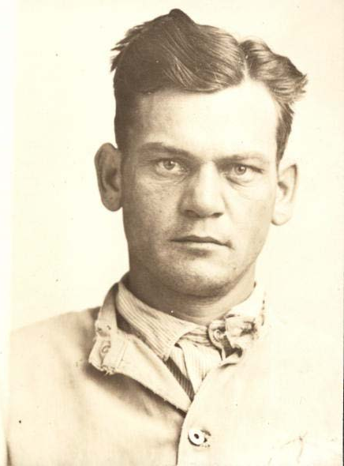

- Source: [National Archives catalog](https://catalog.archives.gov/id/28894496)
- Credit: U.S. Penitentiary, Leavenworth booking photograph; National Archives at Kansas City, Record Group 129, Inmate Case Files (series 571125), inmate 14813, catalog item 28894496.
- Identity: NARA individually catalogs this photograph as Photograph of A. M. Blumberg, inmate 14813. The name, Leavenworth record and wartime context identify the IWW prisoner in the December 1919 Wichita/Kansas group in the existing profile. The original photograph and available reverse were visually checked; the frontal view is on the right.
- Download: [original photograph](https://catalog.archives.gov/medialz/kansas-city/rg-129/571125/14813_Blumberg_A_M_001.jpg)
- Preserved original: [batch262-originals/14813_Blumberg_A_M_001.jpg](batch262-originals/14813_Blumberg_A_M_001.jpg)
- Crop box: `[435, 0, 871, 590]` (left, top, exclusive right, exclusive bottom); original dimensions: `[871, 590]`.
- Original SHA-256: `029690421d600377bf7ddc3da8af9b84f7cc7553cf46ce43dccca821192102d1`
- Portrait SHA-256: `f959b7a42125a71ccad6a24a5f24810e87d077d7e130316a5d2c659e78080d5e`
- Identifying reverse: [batch262-originals/28894488_14813-AMBlumberg_001.jpg](batch262-originals/28894488_14813-AMBlumberg_001.jpg)

## Albert Barr

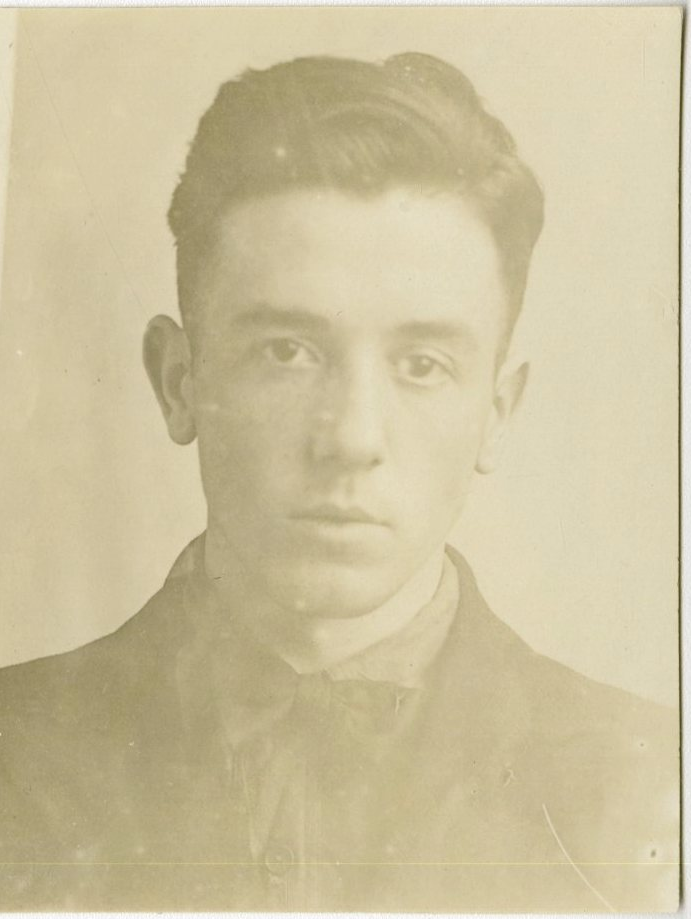

- Source: [National Archives catalog](https://catalog.archives.gov/id/160922089)
- Credit: U.S. Penitentiary, Leavenworth booking photograph; National Archives at Kansas City, Record Group 129, Inmate Case Files (series 571125), inmate 14807, catalog item 160922089.
- Identity: NARA individually catalogs this photograph as Photograph of Albert Barr, inmate 14807. The name, Leavenworth record and wartime context identify the IWW prisoner in the December 1919 Wichita/Kansas group in the existing profile. The original photograph and available reverse were visually checked; the frontal view is on the right.
- Download: [original photograph](https://catalog.archives.gov/medialz/kansas-city/rg-129/571125/571125_14807-AlbertBarr_001.jpg)
- Preserved original: [batch262-originals/571125_14807-AlbertBarr_001.jpg](batch262-originals/571125_14807-AlbertBarr_001.jpg)
- Crop box: `[690, 0, 1381, 919]` (left, top, exclusive right, exclusive bottom); original dimensions: `[1381, 919]`.
- Original SHA-256: `cf7417e38e170c9ba84497260f829f128fdf013c83b09e4a9b3382856abcd0b1`
- Portrait SHA-256: `458a02e796cf093a699ae3317f691f2623d831379938b7362629fa6a84f5872b`
- Identifying reverse: [batch262-originals/571125_14807-AlbertBarr_002.jpg](batch262-originals/571125_14807-AlbertBarr_002.jpg)

## Albert Eberlie

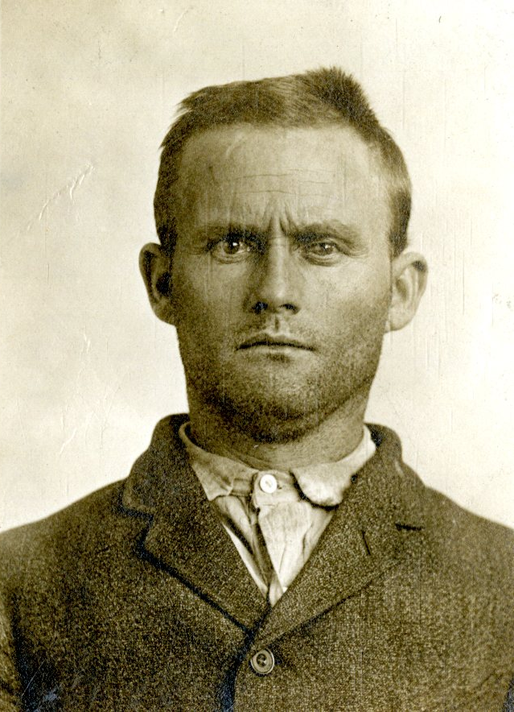

- Source: [National Archives catalog](https://catalog.archives.gov/id/83858526)
- Credit: U.S. Penitentiary, Leavenworth booking photograph; National Archives at Kansas City, Record Group 129, Inmate Case Files (series 571125), inmate 12031, catalog item 83858526.
- Identity: NARA individually catalogs this photograph as Photograph of Albert Eberlie, inmate 12031. The name, Leavenworth record and wartime context identify the Oklahoma wartime conspiracy prisoner in the existing profile. The original photograph and available reverse were visually checked; the frontal view is on the right.
- Download: [original photograph](https://catalog.archives.gov/medialz/kansas-city/rg-129/571125/571125_12031-AlbertEberlie_001.jpg)
- Preserved original: [batch262-originals/571125_12031-AlbertEberlie_001.jpg](batch262-originals/571125_12031-AlbertEberlie_001.jpg)
- Crop box: `[638, 0, 1277, 884]` (left, top, exclusive right, exclusive bottom); original dimensions: `[1277, 884]`.
- Original SHA-256: `47172eef00efc65892d7343c766d467614656416beb5c64e2e5c3cc866551df6`
- Portrait SHA-256: `dfc3ad9cf536cdd329c8be2ef37c2ee92ae38cef76770df653103fd0c4fbdae2`
- Identifying reverse: [batch262-originals/571125_12031-AlbertEberlie_002.jpg](batch262-originals/571125_12031-AlbertEberlie_002.jpg)

## Alexander Cournos

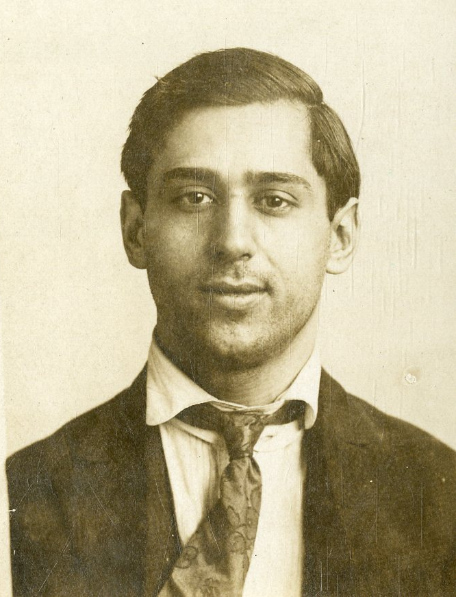

- Source: [National Archives catalog](https://catalog.archives.gov/id/117703298)
- Credit: U.S. Penitentiary, Leavenworth booking photograph; National Archives at Kansas City, Record Group 129, Inmate Case Files (series 571125), inmate 13123, catalog item 117703298.
- Identity: NARA individually catalogs this photograph as Photograph of Alexander Cournos, inmate 13123. The name, Leavenworth record and wartime context identify the Chicago IWW prisoner in the existing profile. The original photograph and available reverse were visually checked; the frontal view is on the right. The IWW inmate roster reproduced by NARA on page 6 independently pairs this name with inmate 13123: https://www.archives.gov/files/kansas-city/press/newsletter/2017-october.pdf#page=6 .
- Download: [original photograph](https://catalog.archives.gov/medialz/kansas-city/rg-129/571125/571125_13123-AlexanderCournos_001.jpg)
- Preserved original: [batch262-originals/571125_13123-AlexanderCournos_001.jpg](batch262-originals/571125_13123-AlexanderCournos_001.jpg)
- Crop box: `[666, 0, 1332, 871]` (left, top, exclusive right, exclusive bottom); original dimensions: `[1332, 871]`.
- Original SHA-256: `120fa56d1bf12b8f8446933e5d17a5b287bce150bd55c3833f10de72c4be791b`
- Portrait SHA-256: `a9d7e96a3ee51b09081ac98745922a4eab02c3fb8e50a933762a721c3531e511`
- Identifying reverse: [batch262-originals/571125_13123-AlexanderCournos_002.jpg](batch262-originals/571125_13123-AlexanderCournos_002.jpg)

## Anthony J. Stopa

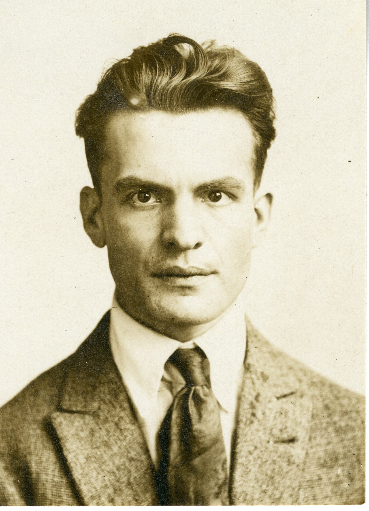

- Source: [National Archives catalog](https://catalog.archives.gov/id/20848799)
- Credit: U.S. Penitentiary, Leavenworth booking photograph; National Archives at Kansas City, Record Group 129, Inmate Case Files (series 571125), inmate 13201, catalog item 20848799.
- Identity: NARA individually catalogs this photograph as Photograph of Anthony J. Stopa, inmate 13201. The name, Leavenworth record and wartime context identify the Detroit prisoner prosecuted for antiwar statements in the existing profile. The original photograph and available reverse were visually checked; the frontal view is on the right.
- Download: [original photograph](https://catalog.archives.gov/medialive/99/8487/20848799/content/kansas-city/rg-129/571125/stopa_before.jpg)
- Preserved original: [batch262-originals/stopa_before.jpg](batch262-originals/stopa_before.jpg)
- Crop box: `[1302, 0, 2605, 1800]` (left, top, exclusive right, exclusive bottom); original dimensions: `[2605, 1800]`.
- Original SHA-256: `6a97d176999a90e4d65fce37958a2527ff5e2b306b5d2301a1e79bb06841db99`
- Portrait SHA-256: `aed297c39696cb0a3d835e2d540d9316579e0579331e40fd0e867b1236bebbe5`
- Identifying reverse: [batch262-originals/20848799_13201-AnthonyJStopa_001.jpg](batch262-originals/20848799_13201-AnthonyJStopa_001.jpg)

## Antonio Caseres

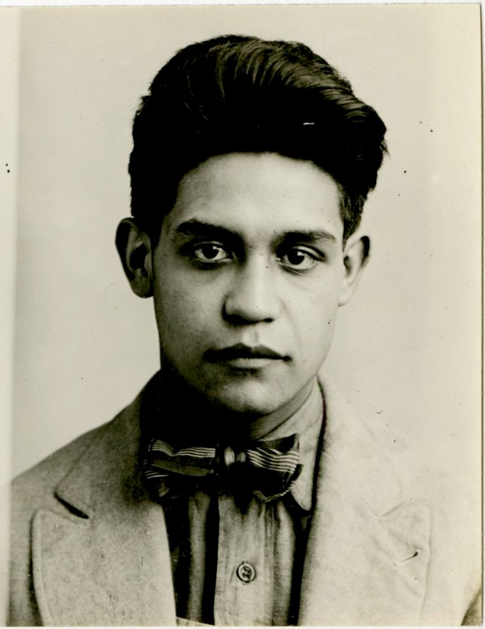

- Source: [National Archives catalog](https://catalog.archives.gov/id/160922437)
- Credit: U.S. Penitentiary, Leavenworth booking photograph; National Archives at Kansas City, Record Group 129, Inmate Case Files (series 571125), inmate 14920, catalog item 160922437.
- Identity: NARA individually catalogs this photograph as Photograph of Antonio Caseres, inmate 14920. The name, Leavenworth record and wartime context identify the western Texas wartime conspiracy prisoner in the existing profile. The original photograph and available reverse were visually checked; the frontal view is on the right. His name and jurisdiction also appear in the Attorney General’s parole list in the 1921 Senate hearing, Amnesty and Pardon for Political Prisoners: https://archive.org/details/amnestyandpardo00stergoog .
- Download: [original photograph](https://catalog.archives.gov/medialz/kansas-city/rg-129/571125/571125_14920-AntonioCaseres_001.jpg)
- Preserved original: [batch262-originals/571125_14920-AntonioCaseres_001.jpg](batch262-originals/571125_14920-AntonioCaseres_001.jpg)
- Crop box: `[698, 0, 1396, 905]` (left, top, exclusive right, exclusive bottom); original dimensions: `[1396, 905]`.
- Original SHA-256: `9cd52e91b6ac203c835e545fe0cb1c89e90c302ca049a6a36a09d331a152930f`
- Portrait SHA-256: `f26092654a2e1d483acadbbf565cba0ea60bbf8528a659b0820c97f909942f82`
- Identifying reverse: [batch262-originals/571125_14920-AntonioCaseres_002.jpg](batch262-originals/571125_14920-AntonioCaseres_002.jpg)

## Arthur Boose

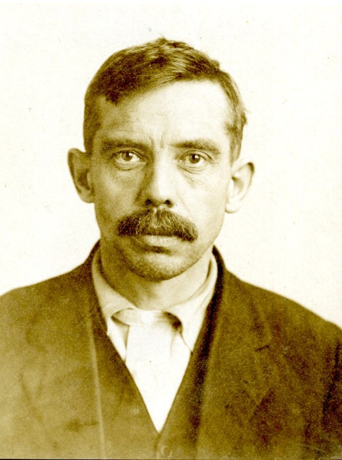

- Source: [National Archives catalog](https://catalog.archives.gov/id/7551613)
- Credit: U.S. Penitentiary, Leavenworth booking photograph; National Archives at Kansas City, Record Group 129, Inmate Case Files (series 571125), inmate 13150, catalog item 7551613.
- Identity: NARA individually catalogs this photograph as Photograph of Arthur Boose, inmate 13150. The name, Leavenworth record and wartime context identify the Chicago IWW prisoner in the existing profile. The original photograph and available reverse were visually checked; the frontal view is on the right. The IWW inmate roster reproduced by NARA on page 6 independently pairs this name with inmate 13150: https://www.archives.gov/files/kansas-city/press/newsletter/2017-october.pdf#page=6 . This catalog item has one digital image; no reverse is supplied. The inmate number is visible on the front.
- Download: [original photograph](https://catalog.archives.gov/medialive/13/5516/7551613/content/arcmedia/central-plains/kansas-city/gallery/ArthurBooseMugshot.jpg)
- Preserved original: [batch262-originals/ArthurBooseMugshot.jpg](batch262-originals/ArthurBooseMugshot.jpg)
- Crop box: `[664, 0, 1329, 894]` (left, top, exclusive right, exclusive bottom); original dimensions: `[1329, 894]`.
- Original SHA-256: `ddc46318616116fb6ae6c373b79d02a5e021977dfc541f30270bdd244bd467f7`
- Portrait SHA-256: `1e7f3945f97cce2477176cb2cacad0b6e20749d170430de107e742ecf2a8f8bc`

## B. F. Bryant

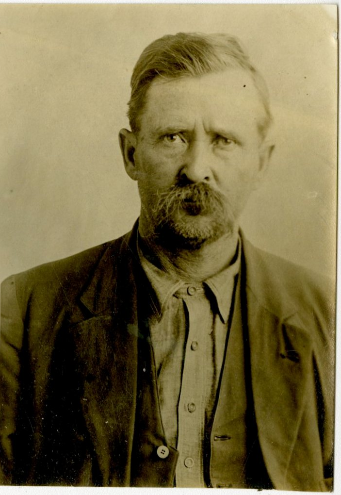

- Source: [National Archives catalog](https://catalog.archives.gov/id/160923132)
- Credit: U.S. Penitentiary, Leavenworth booking photograph; National Archives at Kansas City, Record Group 129, Inmate Case Files (series 571125), inmate 15091, catalog item 160923132.
- Identity: NARA individually catalogs this photograph as Photograph of B. F. Bryant, inmate 15091. The name, Leavenworth record and wartime context identify the Oklahoma Universal Union prisoner in the existing profile. The original photograph and available reverse were visually checked; the frontal view is on the right.
- Download: [original photograph](https://catalog.archives.gov/medialz/kansas-city/rg-129/571125/571125_15091-BFBryant_001.jpg)
- Preserved original: [batch262-originals/571125_15091-BFBryant_001.jpg](batch262-originals/571125_15091-BFBryant_001.jpg)
- Crop box: `[703, 0, 1406, 1020]` (left, top, exclusive right, exclusive bottom); original dimensions: `[1406, 1020]`.
- Original SHA-256: `3dac714153d145ed502066a7832a95845b2696208d97d23b8b63cb5187028ac6`
- Portrait SHA-256: `b479976fc5c66271574699efb81b8d5894ce582f8ca5e6b56ae4967519d1d83c`
- Identifying reverse: [batch262-originals/571125_15091-BFBryant_002.jpg](batch262-originals/571125_15091-BFBryant_002.jpg)

## Billie Rogers

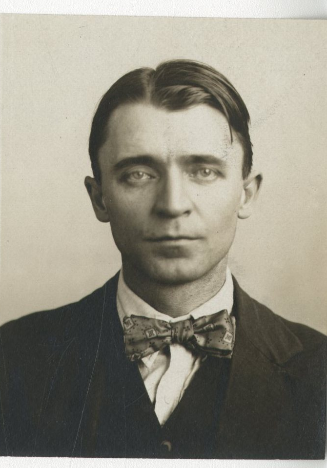

- Source: [National Archives catalog](https://catalog.archives.gov/id/117719709)
- Credit: U.S. Penitentiary, Leavenworth booking photograph; National Archives at Kansas City, Record Group 129, Inmate Case Files (series 571125), inmate 13687, catalog item 117719709.
- Identity: NARA individually catalogs this photograph as Photograph of Billie Rogers, inmate 13687. The name, Leavenworth record and wartime context identify the Oklahoma wartime prisoner in the existing profile. The original photograph and available reverse were visually checked; the frontal view is on the right.
- Download: [original photograph](https://catalog.archives.gov/medialz/kansas-city/rg-129/571125/571125_13687-BillieRogers_001.jpg)
- Preserved original: [batch262-originals/571125_13687-BillieRogers_001.jpg](batch262-originals/571125_13687-BillieRogers_001.jpg)
- Crop box: `[670, 0, 1340, 960]` (left, top, exclusive right, exclusive bottom); original dimensions: `[1340, 960]`.
- Original SHA-256: `d6a40b04123e190690940166bc7a8bd7f463929f67d3fea7be0d938f78942fc6`
- Portrait SHA-256: `a7271b20f9b7835919b25c6811805917cc848e699ebf7c897fafc4a340dfacc1`
- Identifying reverse: [batch262-originals/571125_13687-BillieRogers_002.jpg](batch262-originals/571125_13687-BillieRogers_002.jpg)

## C. R. Griffin

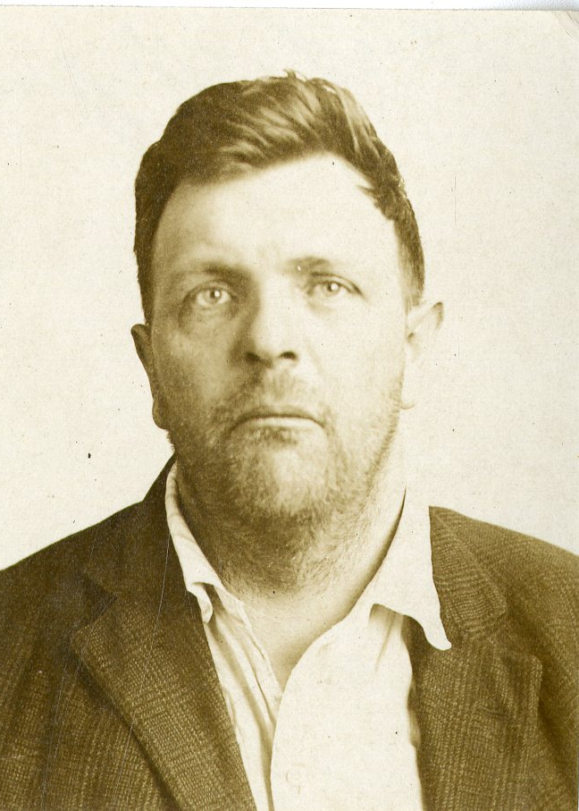

- Source: [National Archives catalog](https://catalog.archives.gov/id/117703381)
- Credit: U.S. Penitentiary, Leavenworth booking photograph; National Archives at Kansas City, Record Group 129, Inmate Case Files (series 571125), inmate 13157, catalog item 117703381.
- Identity: NARA individually catalogs this photograph as Photograph of C. R. Griffin, inmate 13157. The name, Leavenworth record and wartime context identify the Chicago IWW prisoner in the existing profile. The original photograph and available reverse were visually checked; the frontal view is on the right. The IWW inmate roster reproduced by NARA on page 6 independently pairs this name with inmate 13157: https://www.archives.gov/files/kansas-city/press/newsletter/2017-october.pdf#page=6 .
- Download: [original photograph](https://catalog.archives.gov/medialz/kansas-city/rg-129/571125/571125_13157-CRGriffin_001.jpg)
- Preserved original: [batch262-originals/571125_13157-CRGriffin_001.jpg](batch262-originals/571125_13157-CRGriffin_001.jpg)
- Crop box: `[647, 0, 1295, 907]` (left, top, exclusive right, exclusive bottom); original dimensions: `[1295, 907]`.
- Original SHA-256: `d7803af8ced1456a7f247fc2cf623d73fa9757627cbb64efddc6e17cdd1872a1`
- Portrait SHA-256: `6abef2e1ae140ddd0b431cd5bf9e925b7eb22656584006f4c21077055000852e`
- Identifying reverse: [batch262-originals/571125_13157-CRGriffin_002.jpg](batch262-originals/571125_13157-CRGriffin_002.jpg)

## C. W. Davis

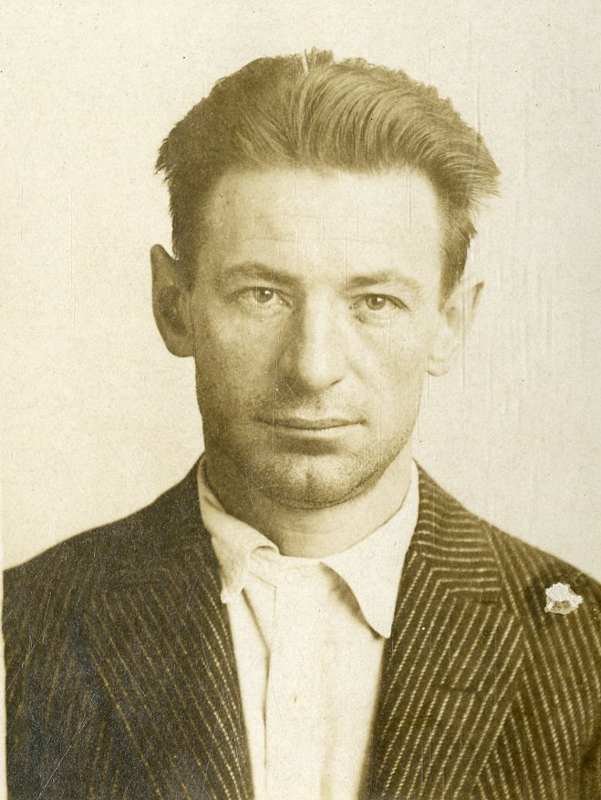

- Source: [National Archives catalog](https://catalog.archives.gov/id/117703301)
- Credit: U.S. Penitentiary, Leavenworth booking photograph; National Archives at Kansas City, Record Group 129, Inmate Case Files (series 571125), inmate 13124, catalog item 117703301.
- Identity: NARA individually catalogs this photograph as Photograph of C. W. Davis, inmate 13124. The name, Leavenworth record and wartime context identify the Chicago IWW prisoner in the existing profile. The original photograph and available reverse were visually checked; the frontal view is on the right. The IWW inmate roster reproduced by NARA on page 6 independently pairs this name with inmate 13124: https://www.archives.gov/files/kansas-city/press/newsletter/2017-october.pdf#page=6 .
- Download: [original photograph](https://catalog.archives.gov/medialz/kansas-city/rg-129/571125/571125_13124-CWDavis_001.jpg)
- Preserved original: [batch262-originals/571125_13124-CWDavis_001.jpg](batch262-originals/571125_13124-CWDavis_001.jpg)
- Crop box: `[658, 0, 1317, 878]` (left, top, exclusive right, exclusive bottom); original dimensions: `[1317, 878]`.
- Original SHA-256: `e2ea733c2e63ab40d78aff6501a758a8b18625e24bf70e97fdc4c71d752a9895`
- Portrait SHA-256: `ebb2e79017dad7814539b310543422d7cc244cab0f3e1a17e838129ebbadaa24`
- Identifying reverse: [batch262-originals/571125_13124-CWDavis_002.jpg](batch262-originals/571125_13124-CWDavis_002.jpg)

## Caesar Tabib

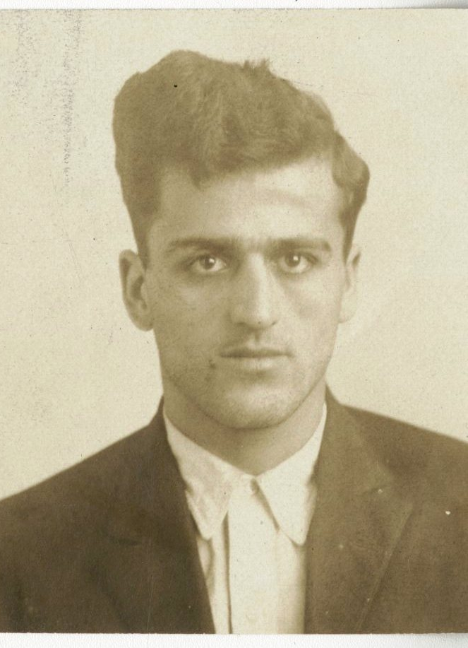

- Source: [National Archives catalog](https://catalog.archives.gov/id/117719365)
- Credit: U.S. Penitentiary, Leavenworth booking photograph; National Archives at Kansas City, Record Group 129, Inmate Case Files (series 571125), inmate 13582, catalog item 117719365.
- Identity: NARA individually catalogs this photograph as Photograph of Caesar Tabib, inmate 13582. The name, Leavenworth record and wartime context identify the IWW prisoner held at Leavenworth after the Sacramento prosecution in the existing profile. The original photograph and available reverse were visually checked; the frontal view is on the right.
- Download: [original photograph](https://catalog.archives.gov/medialz/kansas-city/rg-129/571125/571125_13582-CaesarTabib_001.jpg)
- Preserved original: [batch262-originals/571125_13582-CaesarTabib_001.jpg](batch262-originals/571125_13582-CaesarTabib_001.jpg)
- Crop box: `[663, 0, 1326, 917]` (left, top, exclusive right, exclusive bottom); original dimensions: `[1326, 917]`.
- Original SHA-256: `3831bb62f6d7ce538d46f57f8eb384d4a7a537bad253864bbf940680c77d9ca9`
- Portrait SHA-256: `697fe2e11aebd8b76df7dca58be4fbd5dad55a74db7feea5a54a963e06d1aa66`
- Identifying reverse: [batch262-originals/571125_13582-CaesarTabib_002.jpg](batch262-originals/571125_13582-CaesarTabib_002.jpg)

## Carl Schnell

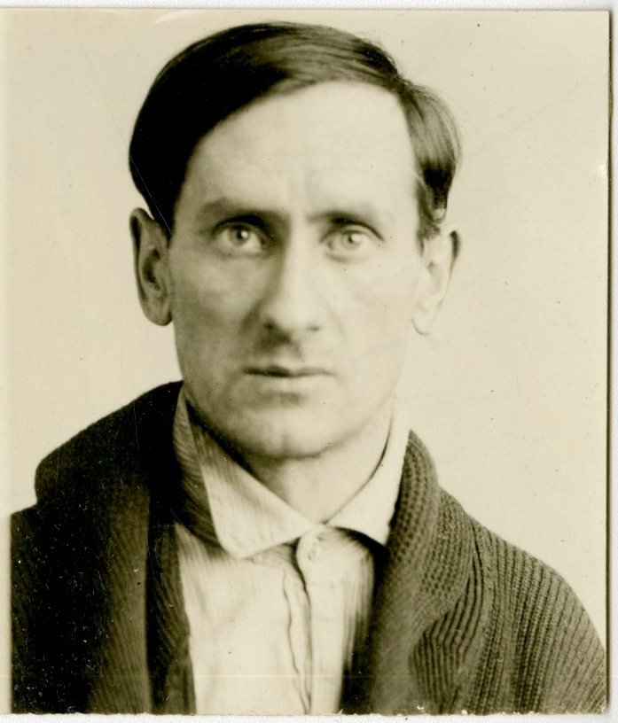

- Source: [National Archives catalog](https://catalog.archives.gov/id/28894498)
- Credit: U.S. Penitentiary, Leavenworth booking photograph; National Archives at Kansas City, Record Group 129, Inmate Case Files (series 571125), inmate 14825, catalog item 28894498.
- Identity: NARA individually catalogs this photograph as Photograph of Carl Schnell, inmate 14825. The name, Leavenworth record and wartime context identify the IWW prisoner in the December 1919 Wichita/Kansas group in the existing profile. The original photograph and available reverse were visually checked; the frontal view is on the right.
- Download: [original photograph](https://catalog.archives.gov/medialz/kansas-city/rg-129/571125/28894490_14825-CarlSchnell_001.jpg)
- Preserved original: [batch262-originals/28894490_14825-CarlSchnell_001.jpg](batch262-originals/28894490_14825-CarlSchnell_001.jpg)
- Crop box: `[696, 0, 1393, 816]` (left, top, exclusive right, exclusive bottom); original dimensions: `[1393, 816]`.
- Original SHA-256: `2708cfe7ed385763f3821bd4d8dc2bdfe4ffc67d1c2e9c71d5964dfa5d34ee0c`
- Portrait SHA-256: `3f1cdda51d334520be395f68224399bda7019deeb6c1ac4b4165f463703ce5dd`
- Identifying reverse: [batch262-originals/28894490_14825-CarlSchnell_002.jpg](batch262-originals/28894490_14825-CarlSchnell_002.jpg)

## Charles Bennett

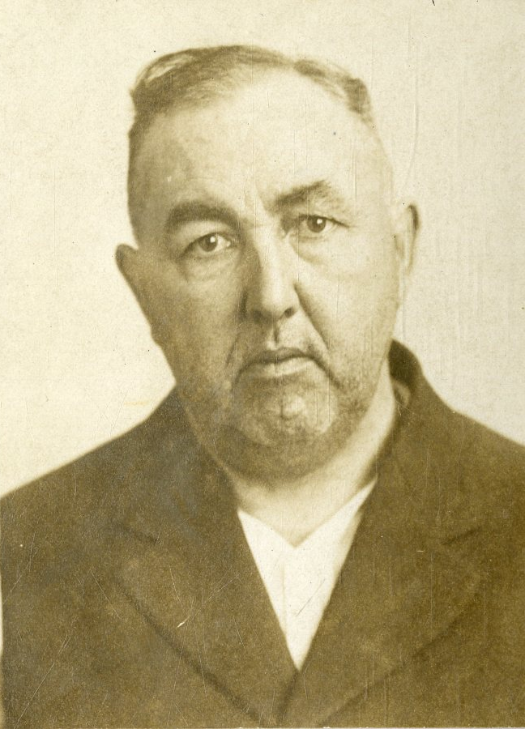

- Source: [National Archives catalog](https://catalog.archives.gov/id/117703283)
- Credit: U.S. Penitentiary, Leavenworth booking photograph; National Archives at Kansas City, Record Group 129, Inmate Case Files (series 571125), inmate 13117, catalog item 117703283.
- Identity: NARA individually catalogs this photograph as Photograph of Charles Bennett, inmate 13117. The name, Leavenworth record and wartime context identify the Chicago IWW prisoner in the existing profile. The original photograph and available reverse were visually checked; the frontal view is on the right. The IWW inmate roster reproduced by NARA on page 6 independently pairs this name with inmate 13117: https://www.archives.gov/files/kansas-city/press/newsletter/2017-october.pdf#page=6 .
- Download: [original photograph](https://catalog.archives.gov/medialz/kansas-city/rg-129/571125/571125_13117-CharlesBennett_001.jpg)
- Preserved original: [batch262-originals/571125_13117-CharlesBennett_001.jpg](batch262-originals/571125_13117-CharlesBennett_001.jpg)
- Crop box: `[647, 0, 1295, 900]` (left, top, exclusive right, exclusive bottom); original dimensions: `[1295, 900]`.
- Original SHA-256: `41d72d003cba55664bbc028d91cfbf000b6c17b12fd9f4cf1028d20317f5576f`
- Portrait SHA-256: `35aa3e7a9e6a2c10829d96c63b73af7954373528aee06e103664c3dece56d6fb`
- Identifying reverse: [batch262-originals/571125_13117-CharlesBennett_002.jpg](batch262-originals/571125_13117-CharlesBennett_002.jpg)

## Charles H. MacKinnon

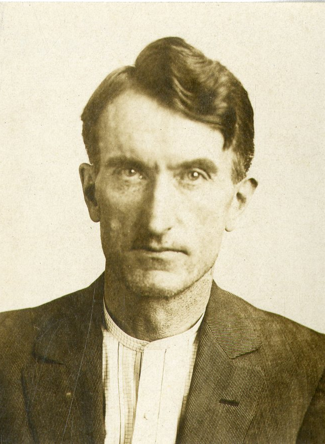

- Source: [National Archives catalog](https://catalog.archives.gov/id/117703403)
- Credit: U.S. Penitentiary, Leavenworth booking photograph; National Archives at Kansas City, Record Group 129, Inmate Case Files (series 571125), inmate 13165, catalog item 117703403.
- Identity: NARA individually catalogs this photograph as Photograph of Charles H. MacKinnon, inmate 13165. The name, Leavenworth record and wartime context identify the Chicago IWW prisoner in the existing profile. The original photograph and available reverse were visually checked; the frontal view is on the right. The IWW inmate roster reproduced by NARA on page 6 independently pairs this name with inmate 13165: https://www.archives.gov/files/kansas-city/press/newsletter/2017-october.pdf#page=6 .
- Download: [original photograph](https://catalog.archives.gov/medialz/kansas-city/rg-129/571125/571125_13165-CharlesHMacKinnon_001.jpg)
- Preserved original: [batch262-originals/571125_13165-CharlesHMacKinnon_001.jpg](batch262-originals/571125_13165-CharlesHMacKinnon_001.jpg)
- Crop box: `[647, 0, 1295, 885]` (left, top, exclusive right, exclusive bottom); original dimensions: `[1295, 885]`.
- Original SHA-256: `cff9b6483efa6a17adcc84cf8dd42a310e85745c04f66ba3bd319e5895e64b52`
- Portrait SHA-256: `32bc0abd56c508d1d5eba1aca822380da359947c4b3bb4ba5805f26b8bb17fcf`
- Identifying reverse: [batch262-originals/571125_13165-CharlesHMacKinnon_002.jpg](batch262-originals/571125_13165-CharlesHMacKinnon_002.jpg)

## Christian Yearous

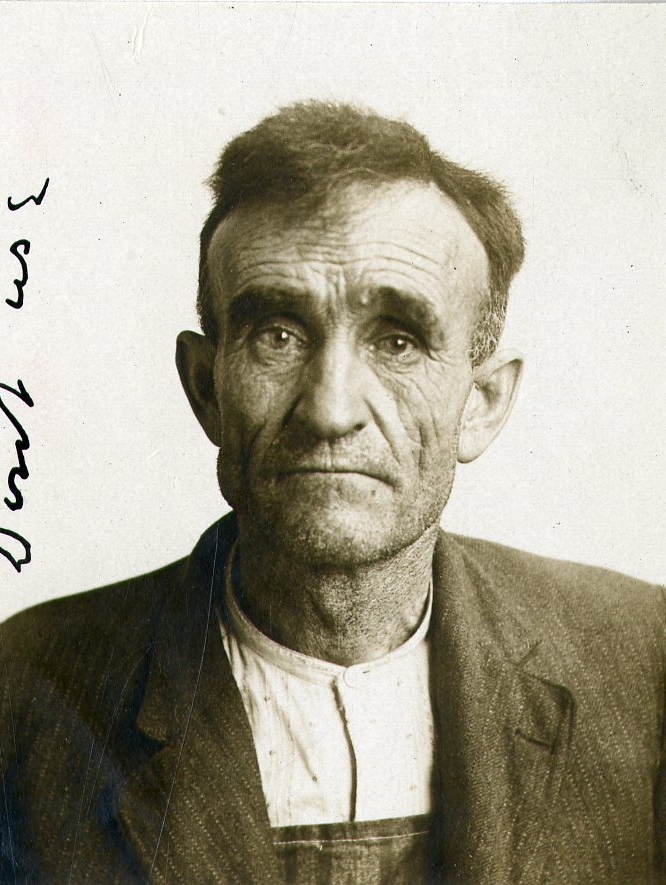

- Source: [National Archives catalog](https://catalog.archives.gov/id/117703181)
- Credit: U.S. Penitentiary, Leavenworth booking photograph; National Archives at Kansas City, Record Group 129, Inmate Case Files (series 571125), inmate 13080, catalog item 117703181.
- Identity: NARA individually catalogs this photograph as Photograph of Christian Yearous, inmate 13080. The name, Leavenworth record and wartime context identify the Wisconsin farmer imprisoned under the Espionage Act in the existing profile. The original photograph and available reverse were visually checked; the frontal view is on the right.
- Download: [original photograph](https://catalog.archives.gov/medialz/kansas-city/rg-129/571125/571125_13080-ChristianYearous_001.jpg)
- Preserved original: [batch262-originals/571125_13080-ChristianYearous_001.jpg](batch262-originals/571125_13080-ChristianYearous_001.jpg)
- Crop box: `[666, 0, 1332, 885]` (left, top, exclusive right, exclusive bottom); original dimensions: `[1332, 885]`.
- Original SHA-256: `90276e0c9c68f6279c5c45e25361c60498a37129317232b8708dde9088bce2d2`
- Portrait SHA-256: `1b9730430d46b9cef1a9351b81fd6ad165abbd53c451df9dd72bb582ed456cb9`
- Identifying reverse: [batch262-originals/571125_13080-ChristianYearous_002.jpg](batch262-originals/571125_13080-ChristianYearous_002.jpg)

## Clure Isenhouer

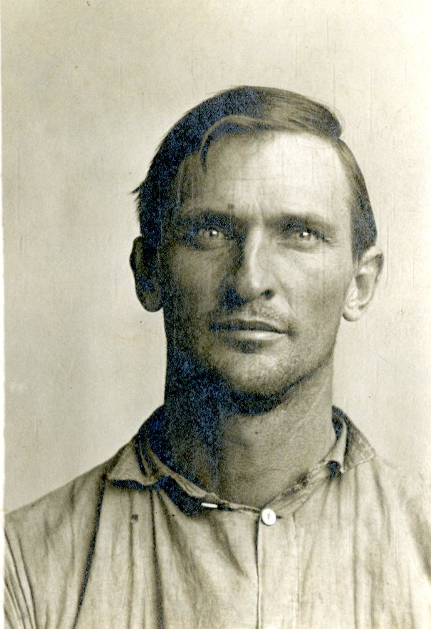

- Source: [National Archives catalog](https://catalog.archives.gov/id/83858428)
- Credit: U.S. Penitentiary, Leavenworth booking photograph; National Archives at Kansas City, Record Group 129, Inmate Case Files (series 571125), inmate 12002, catalog item 83858428.
- Identity: NARA individually catalogs this photograph as Photograph of Clure Isenhouer, inmate 12002. The name, Leavenworth record and wartime context identify the Oklahoma wartime conspiracy prisoner in the existing profile. The original photograph and available reverse were visually checked; the frontal view is on the right.
- Download: [original photograph](https://catalog.archives.gov/medialz/kansas-city/rg-129/571125/571125_12002-ClureIsenhouer_001.jpg)
- Preserved original: [batch262-originals/571125_12002-ClureIsenhouer_001.jpg](batch262-originals/571125_12002-ClureIsenhouer_001.jpg)
- Crop box: `[605, 0, 1210, 884]` (left, top, exclusive right, exclusive bottom); original dimensions: `[1210, 884]`.
- Original SHA-256: `0faa01b63d9fe313fa213093fd968c2934e12fbdae291704c7a15eb4e5cc5268`
- Portrait SHA-256: `5834c7dd9ee49d9cc8667d290b31ba1d2c42764745d24e31dc973a3286aac3c4`
- Identifying reverse: [batch262-originals/571125_12002-ClureIsenhouer_002.jpg](batch262-originals/571125_12002-ClureIsenhouer_002.jpg)

## Curt Von Einen

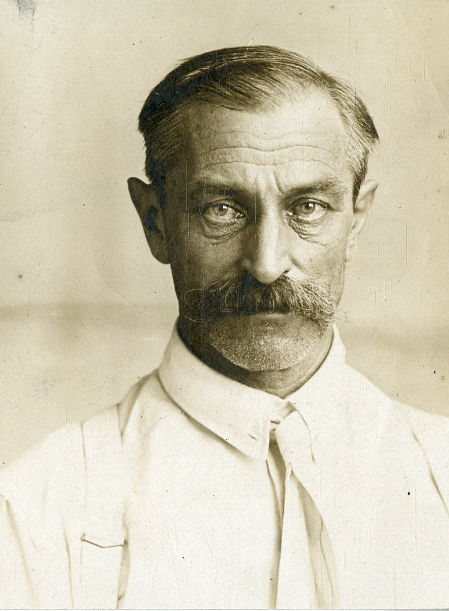

- Source: [National Archives catalog](https://catalog.archives.gov/id/117703077)
- Credit: U.S. Penitentiary, Leavenworth booking photograph; National Archives at Kansas City, Record Group 129, Inmate Case Files (series 571125), inmate 13048, catalog item 117703077.
- Identity: NARA individually catalogs this photograph as Photograph of Curt Von Einen, inmate 13048. The name, Leavenworth record and wartime context identify the wartime prisoner from Tucson, Arizona in the existing profile. The original photograph and available reverse were visually checked; the frontal view is on the right.
- Download: [original photograph](https://catalog.archives.gov/medialz/kansas-city/rg-129/571125/571125_13048-CurtVonEinen_001.jpg)
- Preserved original: [batch262-originals/571125_13048-CurtVonEinen_001.jpg](batch262-originals/571125_13048-CurtVonEinen_001.jpg)
- Crop box: `[651, 0, 1302, 885]` (left, top, exclusive right, exclusive bottom); original dimensions: `[1302, 885]`.
- Original SHA-256: `dc520ddf384cf3d6d2c7fd7c69c6b9a3181c581cb9edb539099931fb05f92e3a`
- Portrait SHA-256: `ef52525aed2d00c8071bd5a9f14d30003acdbd57d4a4b65c57c6f1a42b213229`
- Identifying reverse: [batch262-originals/571125_13048-CurtVonEinen_002.jpg](batch262-originals/571125_13048-CurtVonEinen_002.jpg)

## Dan Buckley

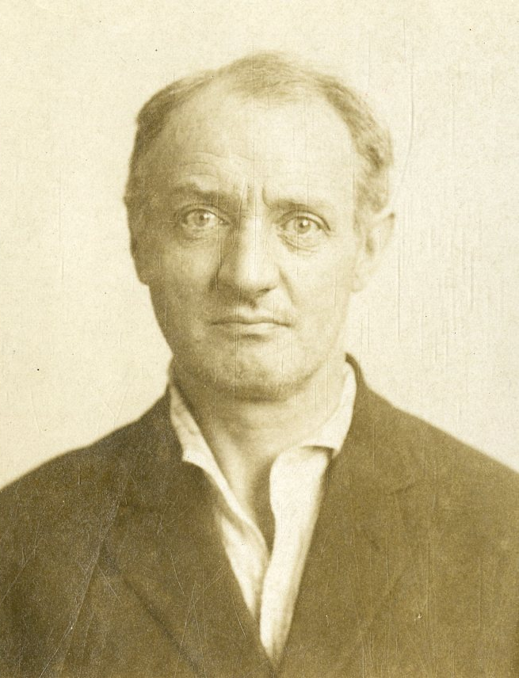

- Source: [National Archives catalog](https://catalog.archives.gov/id/117703289)
- Credit: U.S. Penitentiary, Leavenworth booking photograph; National Archives at Kansas City, Record Group 129, Inmate Case Files (series 571125), inmate 13119, catalog item 117703289.
- Identity: NARA individually catalogs this photograph as Photograph of Dan Buckley, inmate 13119. The name, Leavenworth record and wartime context identify the Chicago IWW prisoner in the existing profile. The original photograph and available reverse were visually checked; the frontal view is on the right. The IWW inmate roster reproduced by NARA on page 6 independently pairs this name with inmate 13119: https://www.archives.gov/files/kansas-city/press/newsletter/2017-october.pdf#page=6 .
- Download: [original photograph](https://catalog.archives.gov/medialz/kansas-city/rg-129/571125/571125_13119-DanBuckley_001.jpg)
- Preserved original: [batch262-originals/571125_13119-DanBuckley_001.jpg](batch262-originals/571125_13119-DanBuckley_001.jpg)
- Crop box: `[655, 0, 1310, 856]` (left, top, exclusive right, exclusive bottom); original dimensions: `[1310, 856]`.
- Original SHA-256: `2830171786b73b9a57d593ee1726d513b809562b4d65f5a7dc7d289bd18a589d`
- Portrait SHA-256: `55ebe9e7833f74392727ddff0691d52b20bd89ac9fd3f34727aa8b922b2cabc8`
- Identifying reverse: [batch262-originals/571125_13119-DanBuckley_002.jpg](batch262-originals/571125_13119-DanBuckley_002.jpg)

## Dave Ingar

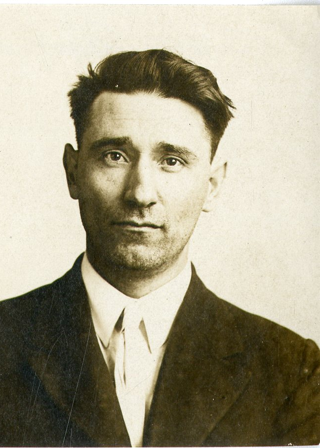

- Source: [National Archives catalog](https://catalog.archives.gov/id/117703387)
- Credit: U.S. Penitentiary, Leavenworth booking photograph; National Archives at Kansas City, Record Group 129, Inmate Case Files (series 571125), inmate 13160, catalog item 117703387.
- Identity: NARA individually catalogs this photograph as Photograph of Dave Ingar, inmate 13160. The name, Leavenworth record and wartime context identify the Chicago IWW prisoner in the existing profile. The original photograph and available reverse were visually checked; the frontal view is on the right. The IWW inmate roster reproduced by NARA on page 6 independently pairs this name with inmate 13160: https://www.archives.gov/files/kansas-city/press/newsletter/2017-october.pdf#page=6 .
- Download: [original photograph](https://catalog.archives.gov/medialz/kansas-city/rg-129/571125/571125_13160-DaveIngar_001.jpg)
- Preserved original: [batch262-originals/571125_13160-DaveIngar_001.jpg](batch262-originals/571125_13160-DaveIngar_001.jpg)
- Crop box: `[647, 0, 1295, 907]` (left, top, exclusive right, exclusive bottom); original dimensions: `[1295, 907]`.
- Original SHA-256: `2a877e842dbfed916e1cf8ca5bffb47f2d4874538953ac82b14f6f5a9eb5b56d`
- Portrait SHA-256: `44b8b3a4243d6d1d9b5f1ace7d5952fe409fc4202f43f50a75d8bc5feddcf336`
- Identifying reverse: [batch262-originals/571125_13160-DaveIngar_002.jpg](batch262-originals/571125_13160-DaveIngar_002.jpg)

## Don Sheridan

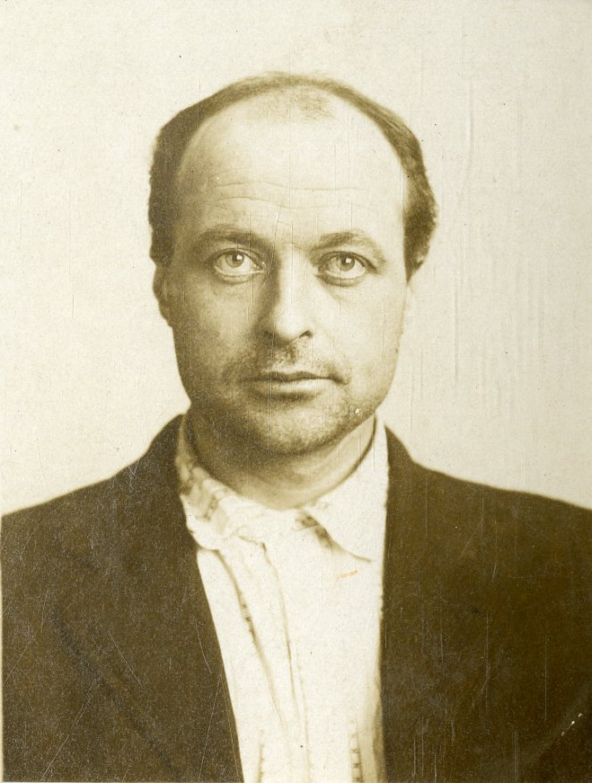

- Source: [National Archives catalog](https://catalog.archives.gov/id/117703346)
- Credit: U.S. Penitentiary, Leavenworth booking photograph; National Archives at Kansas City, Record Group 129, Inmate Case Files (series 571125), inmate 13140, catalog item 117703346.
- Identity: NARA individually catalogs this photograph as Photograph of Don Sheridan, inmate 13140. The name, Leavenworth record and wartime context identify the Chicago IWW prisoner in the existing profile. The original photograph and available reverse were visually checked; the frontal view is on the right. The IWW inmate roster reproduced by NARA on page 6 independently pairs this name with inmate 13140: https://www.archives.gov/files/kansas-city/press/newsletter/2017-october.pdf#page=6 .
- Download: [original photograph](https://catalog.archives.gov/medialz/kansas-city/rg-129/571125/571125_13140-DonSheridan_001.jpg)
- Preserved original: [batch262-originals/571125_13140-DonSheridan_001.jpg](batch262-originals/571125_13140-DonSheridan_001.jpg)
- Crop box: `[658, 0, 1317, 871]` (left, top, exclusive right, exclusive bottom); original dimensions: `[1317, 871]`.
- Original SHA-256: `8a84910ca34ba3ec88b020d4043e6f53ec154e37b0a91dacd02399bb267fc296`
- Portrait SHA-256: `2f789bf15d598f6cce00f01fcdba49cad5b6fc394a0d7dd03969897ce66dcfa0`
- Identifying reverse: [batch262-originals/571125_13140-DonSheridan_002.jpg](batch262-originals/571125_13140-DonSheridan_002.jpg)

## E. J. Huber

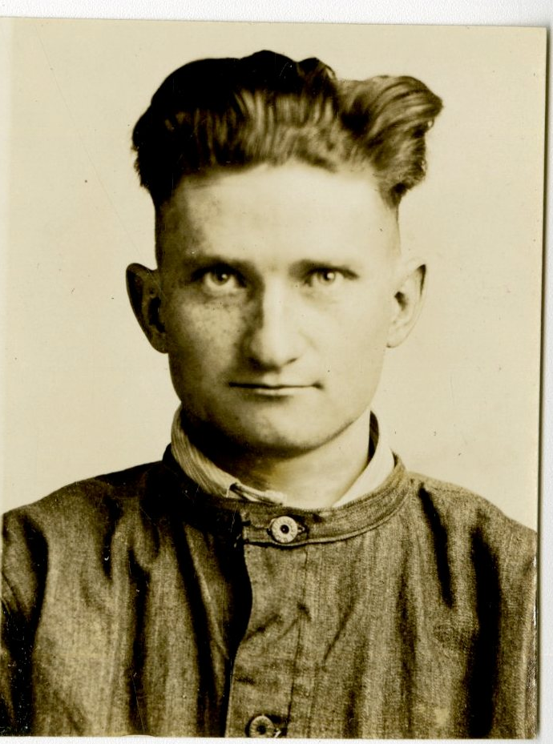

- Source: [National Archives catalog](https://catalog.archives.gov/id/160922113)
- Credit: U.S. Penitentiary, Leavenworth booking photograph; National Archives at Kansas City, Record Group 129, Inmate Case Files (series 571125), inmate 14817, catalog item 160922113.
- Identity: NARA individually catalogs this photograph as Photograph of E. J. Huber, inmate 14817. The name, Leavenworth record and wartime context identify the IWW prisoner in the December 1919 Wichita/Kansas group in the existing profile. The original photograph and available reverse were visually checked; the frontal view is on the right.
- Download: [original photograph](https://catalog.archives.gov/medialz/kansas-city/rg-129/571125/571125_14817-EJHuber_001.jpg)
- Preserved original: [batch262-originals/571125_14817-EJHuber_001.jpg](batch262-originals/571125_14817-EJHuber_001.jpg)
- Crop box: `[690, 0, 1380, 929]` (left, top, exclusive right, exclusive bottom); original dimensions: `[1380, 929]`.
- Original SHA-256: `afade92a51b78a9bf440d23af3bd281a715909dee945892d18dd72d2fd8572b8`
- Portrait SHA-256: `3186c102be112cbc03f96a6a122de2e2c32f13c39b3eaa589b25077c2143c130`
- Identifying reverse: [batch262-originals/571125_14817-EJHuber_002.jpg](batch262-originals/571125_14817-EJHuber_002.jpg)

## E. M. Boyd

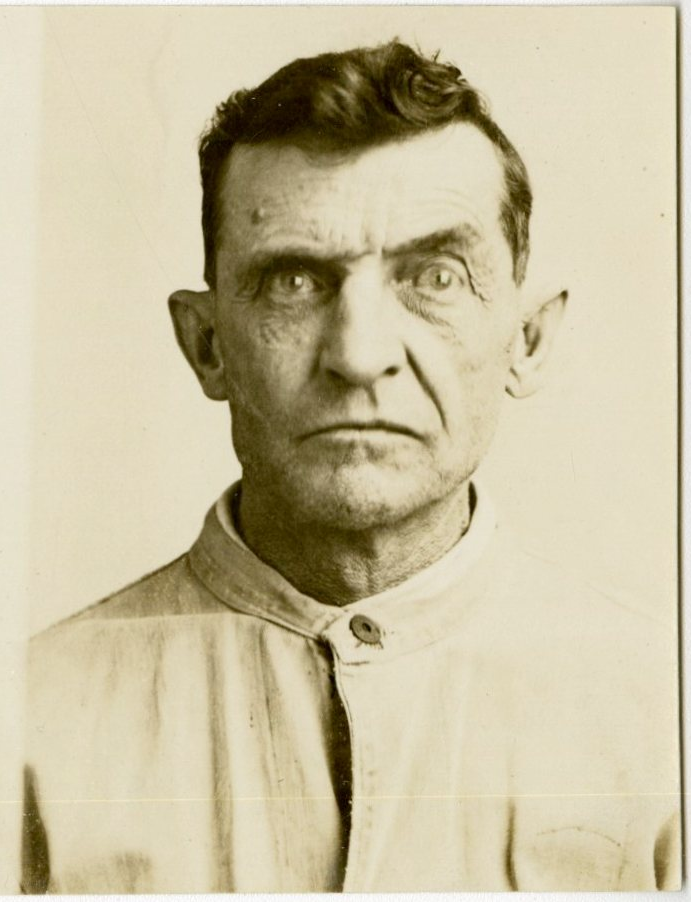

- Source: [National Archives catalog](https://catalog.archives.gov/id/160922092)
- Credit: U.S. Penitentiary, Leavenworth booking photograph; National Archives at Kansas City, Record Group 129, Inmate Case Files (series 571125), inmate 14808, catalog item 160922092.
- Identity: NARA individually catalogs this photograph as Photograph of E. M. Boyd, inmate 14808. The name, Leavenworth record and wartime context identify the IWW prisoner in the December 1919 Wichita/Kansas group in the existing profile. The original photograph and available reverse were visually checked; the frontal view is on the right.
- Download: [original photograph](https://catalog.archives.gov/medialz/kansas-city/rg-129/571125/571125_14808-EMBoyd_001.jpg)
- Preserved original: [batch262-originals/571125_14808-EMBoyd_001.jpg](batch262-originals/571125_14808-EMBoyd_001.jpg)
- Crop box: `[690, 0, 1381, 902]` (left, top, exclusive right, exclusive bottom); original dimensions: `[1381, 902]`.
- Original SHA-256: `0ad0c176727051a4488a21269d9e24a9edd59b9901775018d1c5efc9a6b186d6`
- Portrait SHA-256: `6d0fad0fcee99fbdec2343ff69f372ec51534ccfead379ef8e9ff5f524e0a680`
- Identifying reverse: [batch262-originals/571125_14808-EMBoyd_002.jpg](batch262-originals/571125_14808-EMBoyd_002.jpg)

## Earl Potter

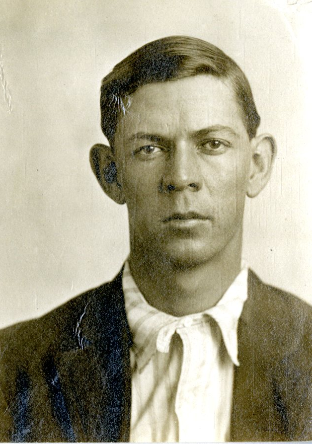

- Source: [National Archives catalog](https://catalog.archives.gov/id/83858541)
- Credit: U.S. Penitentiary, Leavenworth booking photograph; National Archives at Kansas City, Record Group 129, Inmate Case Files (series 571125), inmate 12036, catalog item 83858541.
- Identity: NARA individually catalogs this photograph as Photograph of Earl Potter, inmate 12036. The name, Leavenworth record and wartime context identify the Oklahoma wartime conspiracy prisoner in the existing profile. The original photograph and available reverse were visually checked; the frontal view is on the right.
- Download: [original photograph](https://catalog.archives.gov/medialz/kansas-city/rg-129/571125/571125_12036-EarlPotter_001.jpg)
- Preserved original: [batch262-originals/571125_12036-EarlPotter_001.jpg](batch262-originals/571125_12036-EarlPotter_001.jpg)
- Crop box: `[628, 0, 1256, 894]` (left, top, exclusive right, exclusive bottom); original dimensions: `[1256, 894]`.
- Original SHA-256: `8ff76cffc5b87cac715541be6a9f8bc2e58106d82c5f4388f52280556d37d230`
- Portrait SHA-256: `71adcf7d07d38c22197716c918fb0695be63ebd0a66f46e52ca4ac7879c9433d`
- Identifying reverse: [batch262-originals/571125_12036-EarlPotter_002.jpg](batch262-originals/571125_12036-EarlPotter_002.jpg)

## Edward F. Doree

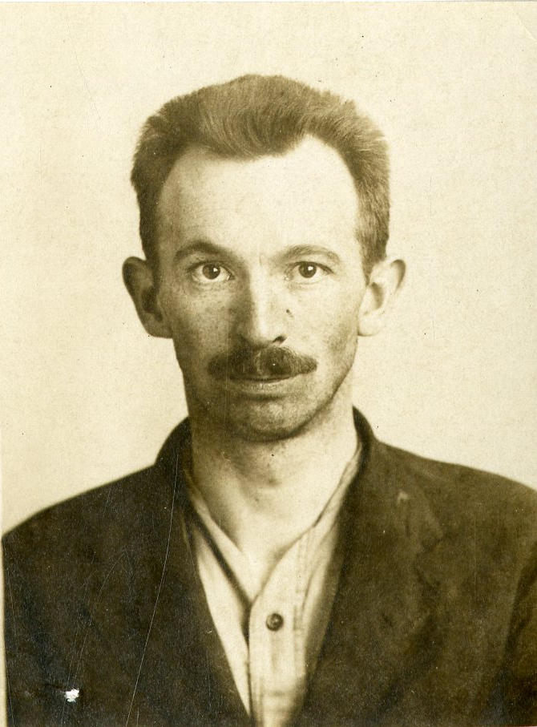

- Source: [National Archives catalog](https://catalog.archives.gov/id/117703304)
- Credit: U.S. Penitentiary, Leavenworth booking photograph; National Archives at Kansas City, Record Group 129, Inmate Case Files (series 571125), inmate 13125, catalog item 117703304.
- Identity: NARA individually catalogs this photograph as Photograph of Edward F. Doree, inmate 13125. The name, Leavenworth record and wartime context identify the Chicago IWW prisoner in the existing profile. The original photograph and available reverse were visually checked; the frontal view is on the right. The IWW inmate roster reproduced by NARA on page 6 independently pairs this name with inmate 13125: https://www.archives.gov/files/kansas-city/press/newsletter/2017-october.pdf#page=6 .
- Download: [original photograph](https://catalog.archives.gov/medialz/kansas-city/rg-129/571125/571125_13125-EdwardFDoree_001.jpg)
- Preserved original: [batch262-originals/571125_13125-EdwardFDoree_001.jpg](batch262-originals/571125_13125-EdwardFDoree_001.jpg)
- Crop box: `[669, 0, 1339, 907]` (left, top, exclusive right, exclusive bottom); original dimensions: `[1339, 907]`.
- Original SHA-256: `5691f686b7b468b60a2f090283c014b8b7531343930413224ff780e2a267fe7b`
- Portrait SHA-256: `08510742dbbfdab7db13405a1b3fdaba2d8880cfeea435a0546bbee29633e91b`
- Identifying reverse: [batch262-originals/571125_13125-EdwardFDoree_002.jpg](batch262-originals/571125_13125-EdwardFDoree_002.jpg)

## Edward Quigley

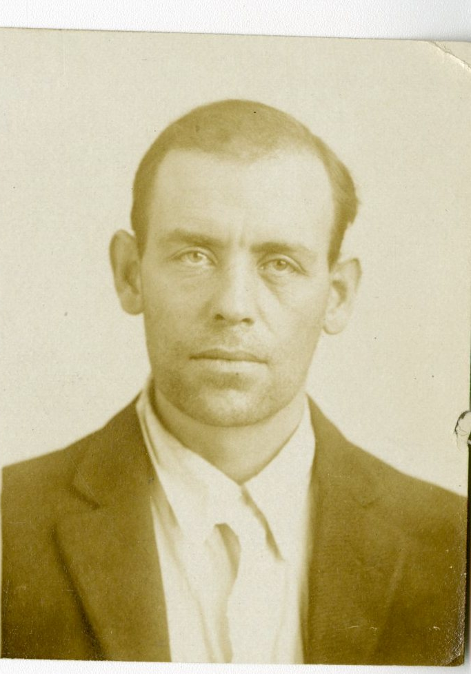

- Source: [National Archives catalog](https://catalog.archives.gov/id/117719353)
- Credit: U.S. Penitentiary, Leavenworth booking photograph; National Archives at Kansas City, Record Group 129, Inmate Case Files (series 571125), inmate 13578, catalog item 117719353.
- Identity: NARA individually catalogs this photograph as Photograph of Edward Quigley, inmate 13578. The name, Leavenworth record and wartime context identify the IWW prisoner held at Leavenworth after the Sacramento prosecution in the existing profile. The original photograph and available reverse were visually checked; the frontal view is on the right.
- Download: [original photograph](https://catalog.archives.gov/medialz/kansas-city/rg-129/571125/571125_13578-EdwardQuigley_001.jpg)
- Preserved original: [batch262-originals/571125_13578-EdwardQuigley_001.jpg](batch262-originals/571125_13578-EdwardQuigley_001.jpg)
- Crop box: `[683, 0, 1366, 978]` (left, top, exclusive right, exclusive bottom); original dimensions: `[1366, 978]`.
- Original SHA-256: `b93d4a8906f7d4e6edd4b7b98f82088917511793270b24589c61432803ca01fd`
- Portrait SHA-256: `3b97e3de400edc0cfd8928b403cf3d7773a2404f04576b1cb3a4f57d90288c9e`
- Identifying reverse: [batch262-originals/571125_13578-EdwardQuigley_002.jpg](batch262-originals/571125_13578-EdwardQuigley_002.jpg)

## Elmer Anderson

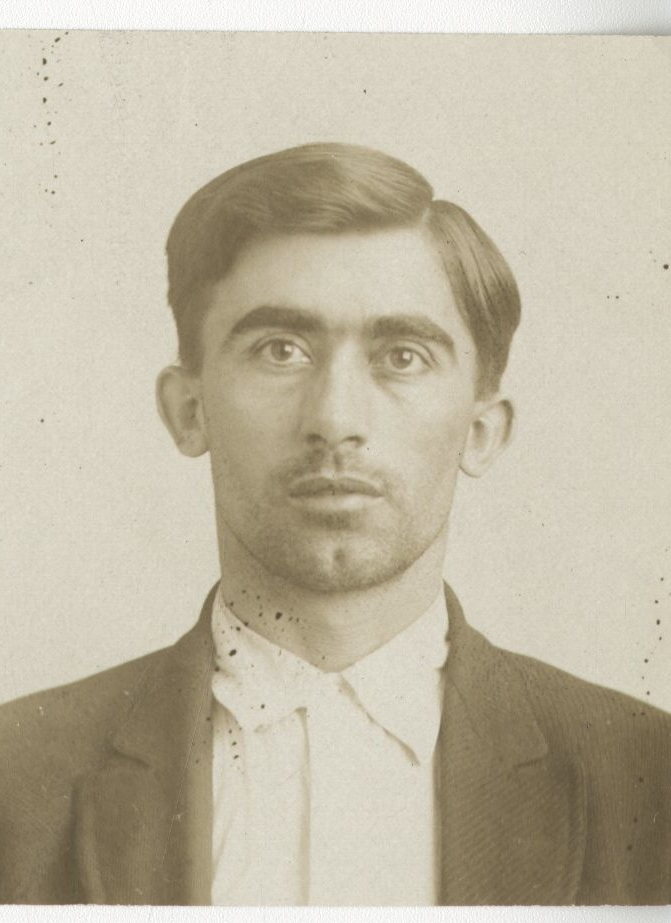

- Source: [National Archives catalog](https://catalog.archives.gov/id/117719301)
- Credit: U.S. Penitentiary, Leavenworth booking photograph; National Archives at Kansas City, Record Group 129, Inmate Case Files (series 571125), inmate 13561, catalog item 117719301.
- Identity: NARA individually catalogs this photograph as Photograph of Elmer Anderson, inmate 13561. The name, Leavenworth record and wartime context identify the IWW prisoner held at Leavenworth after the Sacramento prosecution in the existing profile. The original photograph and available reverse were visually checked; the frontal view is on the right.
- Download: [original photograph](https://catalog.archives.gov/medialz/kansas-city/rg-129/571125/571125_13561-ElmerAnderson_001.jpg)
- Preserved original: [batch262-originals/571125_13561-ElmerAnderson_001.jpg](batch262-originals/571125_13561-ElmerAnderson_001.jpg)
- Crop box: `[670, 0, 1341, 923]` (left, top, exclusive right, exclusive bottom); original dimensions: `[1341, 923]`.
- Original SHA-256: `3ffcf2d6e28d8d576796981ebfc297a09b44094df84732401a042a29f9fc50e2`
- Portrait SHA-256: `e20481c352bfde96ea69e68adddeecfe042a77ea3e5541bb26055449acfa8b08`
- Identifying reverse: [batch262-originals/571125_13561-ElmerAnderson_002.jpg](batch262-originals/571125_13561-ElmerAnderson_002.jpg)

## Ernest Henning

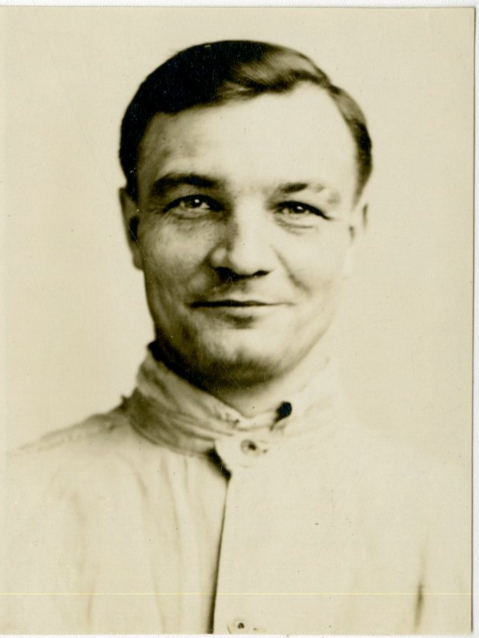

- Source: [National Archives catalog](https://catalog.archives.gov/id/160922131)
- Credit: U.S. Penitentiary, Leavenworth booking photograph; National Archives at Kansas City, Record Group 129, Inmate Case Files (series 571125), inmate 14823, catalog item 160922131.
- Identity: NARA individually catalogs this photograph as Photograph of Ernest Henning, inmate 14823. The name, Leavenworth record and wartime context identify the IWW prisoner in the December 1919 Wichita/Kansas group in the existing profile. The original photograph and available reverse were visually checked; the frontal view is on the right.
- Download: [original photograph](https://catalog.archives.gov/medialz/kansas-city/rg-129/571125/571125_14823-ErnestHenning_001.jpg)
- Preserved original: [batch262-originals/571125_14823-ErnestHenning_001.jpg](batch262-originals/571125_14823-ErnestHenning_001.jpg)
- Crop box: `[680, 0, 1360, 905]` (left, top, exclusive right, exclusive bottom); original dimensions: `[1360, 905]`.
- Original SHA-256: `c96f90d17335792dd622b369d96e840222f5fcfc11de06fc6b6365d87d80a10b`
- Portrait SHA-256: `bf08460f2af76e6c479141b2c31a9db1dd60449091a545ede95ad7b5a79a8f64`
- Identifying reverse: [batch262-originals/571125_14823-ErnestHenning_002.jpg](batch262-originals/571125_14823-ErnestHenning_002.jpg)

## Floyd Ramp

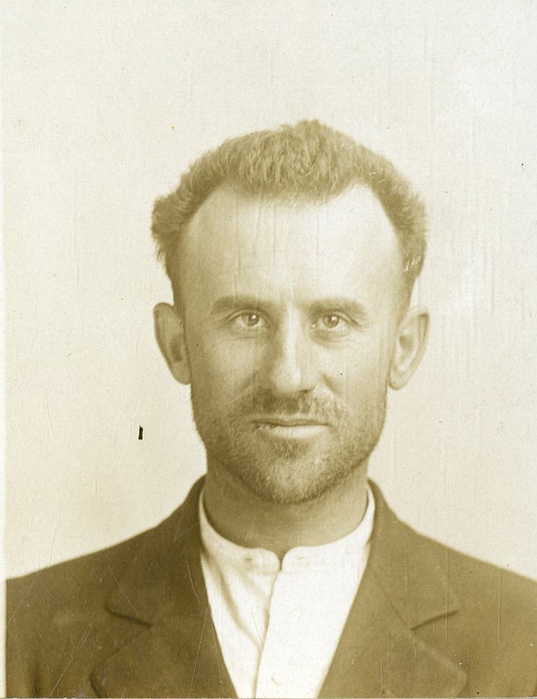

- Source: [National Archives catalog](https://catalog.archives.gov/id/117701941)
- Credit: U.S. Penitentiary, Leavenworth booking photograph; National Archives at Kansas City, Record Group 129, Inmate Case Files (series 571125), inmate 12702, catalog item 117701941.
- Identity: NARA individually catalogs this photograph as Photograph of Floyd Ramp, inmate 12702. The name, Leavenworth record and wartime context identify the Oregon Socialist and antiwar prisoner in the existing profile. The original photograph and available reverse were visually checked; the frontal view is on the right.
- Download: [original photograph](https://catalog.archives.gov/medialz/kansas-city/rg-129/571125/571125_12702-FloydRamp_001.jpg)
- Preserved original: [batch262-originals/571125_12702-FloydRamp_001.jpg](batch262-originals/571125_12702-FloydRamp_001.jpg)
- Crop box: `[669, 0, 1339, 871]` (left, top, exclusive right, exclusive bottom); original dimensions: `[1339, 871]`.
- Original SHA-256: `2ad58d9ecf6272959761946d661c5abcd034ac457c1f2a0820c4ee6caebf27fa`
- Portrait SHA-256: `21bda9fc994c009a9c173654b575345f4d0451cc9be6de600bd52f0ba2959bf8`
- Identifying reverse: [batch262-originals/571125_12702-FloydRamp_002.jpg](batch262-originals/571125_12702-FloydRamp_002.jpg)

## Forrest Edwards

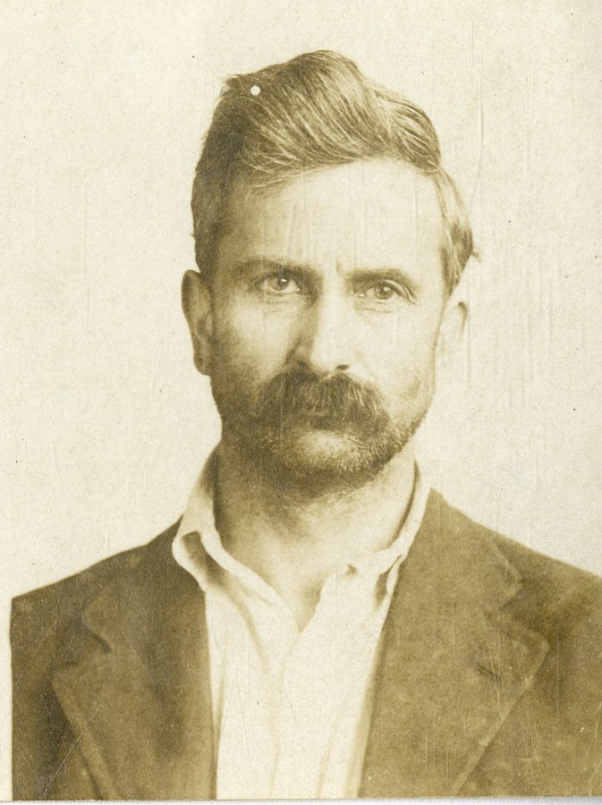

- Source: [National Archives catalog](https://catalog.archives.gov/id/117703258)
- Credit: U.S. Penitentiary, Leavenworth booking photograph; National Archives at Kansas City, Record Group 129, Inmate Case Files (series 571125), inmate 13105, catalog item 117703258.
- Identity: NARA individually catalogs this photograph as Photograph of Forrest Edwards, inmate 13105. The name, Leavenworth record and wartime context identify the Chicago IWW prisoner in the existing profile. The original photograph and available reverse were visually checked; the frontal view is on the right. The IWW inmate roster reproduced by NARA on page 6 independently pairs this name with inmate 13105: https://www.archives.gov/files/kansas-city/press/newsletter/2017-october.pdf#page=6 .
- Download: [original photograph](https://catalog.archives.gov/medialz/kansas-city/rg-129/571125/571125_13105-ForrestEdwards_001.jpg)
- Preserved original: [batch262-originals/571125_13105-ForrestEdwards_001.jpg](batch262-originals/571125_13105-ForrestEdwards_001.jpg)
- Crop box: `[673, 0, 1346, 900]` (left, top, exclusive right, exclusive bottom); original dimensions: `[1346, 900]`.
- Original SHA-256: `80fdd221febe8ba91099e6487d007bb41d7bfd91f3d9d0765623f0b70aa8638b`
- Portrait SHA-256: `61c3326a3727d6255790454489acabca995084980c9cd7ed9dccca9085ac2022`
- Identifying reverse: [batch262-originals/571125_13105-ForrestEdwards_002.jpg](batch262-originals/571125_13105-ForrestEdwards_002.jpg)

## Frank Geizler

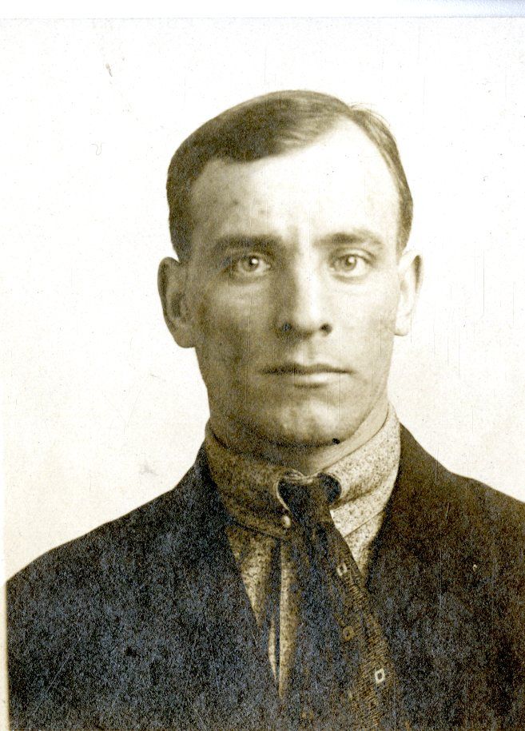

- Source: [National Archives catalog](https://catalog.archives.gov/id/83859916)
- Credit: U.S. Penitentiary, Leavenworth booking photograph; National Archives at Kansas City, Record Group 129, Inmate Case Files (series 571125), inmate 12495, catalog item 83859916.
- Identity: NARA individually catalogs this photograph as Photograph of Frank Geizler, inmate 12495. The name, Leavenworth record and wartime context identify the Austrian IWW prisoner prosecuted at Fargo in the existing profile. The original photograph and available reverse were visually checked; the frontal view is on the right. The existing record explicitly gives this same inmate number, 12495.
- Download: [original photograph](https://catalog.archives.gov/medialz/kansas-city/rg-129/571125/571125_12495-FrankGeizler_001.jpg)
- Preserved original: [batch262-originals/571125_12495-FrankGeizler_001.jpg](batch262-originals/571125_12495-FrankGeizler_001.jpg)
- Crop box: `[656, 0, 1313, 915]` (left, top, exclusive right, exclusive bottom); original dimensions: `[1313, 915]`.
- Original SHA-256: `8e29664e59267ab9bafe843996985cf3ed95c0263a19fed0b71c7ed860290bba`
- Portrait SHA-256: `c83771dc45b29ff98feed5081563bcda3eeacb72623e945764a995c84b424c46`
- Identifying reverse: [batch262-originals/571125_12495-FrankGeizler_002.jpg](batch262-originals/571125_12495-FrankGeizler_002.jpg)

## Frank Patton

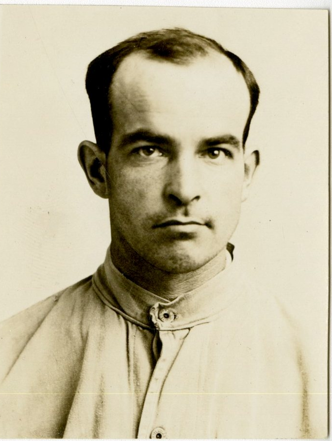

- Source: [National Archives catalog](https://catalog.archives.gov/id/160922119)
- Credit: U.S. Penitentiary, Leavenworth booking photograph; National Archives at Kansas City, Record Group 129, Inmate Case Files (series 571125), inmate 14819, catalog item 160922119.
- Identity: NARA individually catalogs this photograph as Photograph of Frank Patton, inmate 14819. The name, Leavenworth record and wartime context identify the IWW prisoner in the December 1919 Wichita/Kansas group in the existing profile. The original photograph and available reverse were visually checked; the frontal view is on the right.
- Download: [original photograph](https://catalog.archives.gov/medialz/kansas-city/rg-129/571125/571125_14819-FrankPatton_001.jpg)
- Preserved original: [batch262-originals/571125_14819-FrankPatton_001.jpg](batch262-originals/571125_14819-FrankPatton_001.jpg)
- Crop box: `[683, 0, 1367, 908]` (left, top, exclusive right, exclusive bottom); original dimensions: `[1367, 908]`.
- Original SHA-256: `bb698218630de7f56fc5a90aea52f82dfced7128fbb66e9b60ff2fed96f08dfe`
- Portrait SHA-256: `cac0f3a3b2c45a79e324dc6da475cb00b3c3eb5d82ee86f648d3b0cad1fc7c13`
- Identifying reverse: [batch262-originals/571125_14819-FrankPatton_002.jpg](batch262-originals/571125_14819-FrankPatton_002.jpg)

## Frank Westerlund

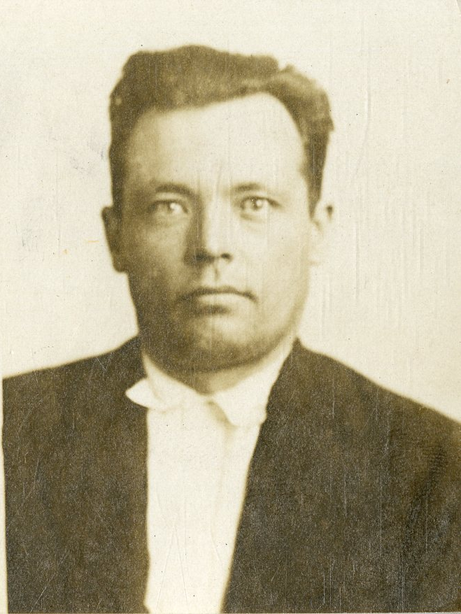

- Source: [National Archives catalog](https://catalog.archives.gov/id/117703439)
- Credit: U.S. Penitentiary, Leavenworth booking photograph; National Archives at Kansas City, Record Group 129, Inmate Case Files (series 571125), inmate 13178, catalog item 117703439.
- Identity: NARA individually catalogs this photograph as Photograph of Frank Westerlund, inmate 13178. The name, Leavenworth record and wartime context identify the Chicago IWW prisoner in the existing profile. The original photograph and available reverse were visually checked; the frontal view is on the right. The IWW inmate roster reproduced by NARA on page 6 independently pairs this name with inmate 13178: https://www.archives.gov/files/kansas-city/press/newsletter/2017-october.pdf#page=6 .
- Download: [original photograph](https://catalog.archives.gov/medialz/kansas-city/rg-129/571125/571125_13178-FrankWesterlund_001.jpg)
- Preserved original: [batch262-originals/571125_13178-FrankWesterlund_001.jpg](batch262-originals/571125_13178-FrankWesterlund_001.jpg)
- Crop box: `[658, 0, 1317, 878]` (left, top, exclusive right, exclusive bottom); original dimensions: `[1317, 878]`.
- Original SHA-256: `c2d25126900a24de1373b8bb3fa8227210f8d84133135157d22c9f96580e93a9`
- Portrait SHA-256: `fe0fc51295a43b23f305a72c6fd2b834afd838194387dd5a13955b97872c0108`
- Identifying reverse: [batch262-originals/571125_13178-FrankWesterlund_002.jpg](batch262-originals/571125_13178-FrankWesterlund_002.jpg)

## Fred Grau

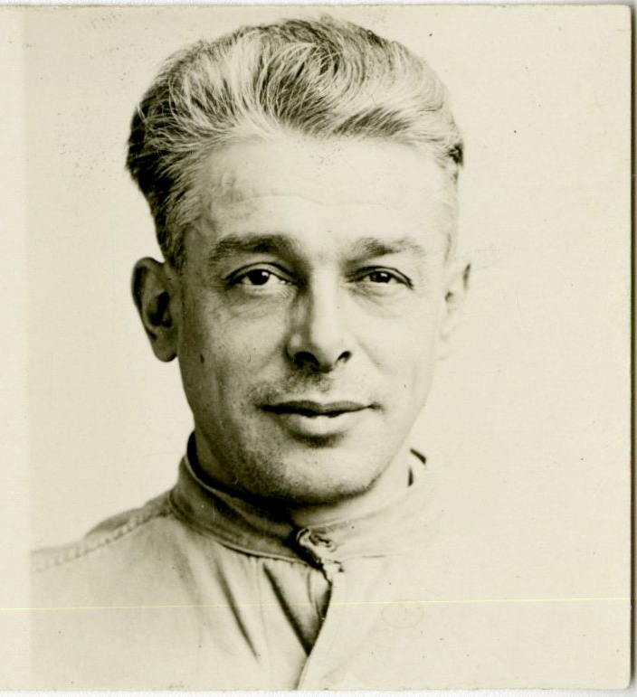

- Source: [National Archives catalog](https://catalog.archives.gov/id/160922128)
- Credit: U.S. Penitentiary, Leavenworth booking photograph; National Archives at Kansas City, Record Group 129, Inmate Case Files (series 571125), inmate 14822, catalog item 160922128.
- Identity: NARA individually catalogs this photograph as Photograph of Fred Grau, inmate 14822. The name, Leavenworth record and wartime context identify the IWW prisoner in the December 1919 Wichita/Kansas group in the existing profile. The original photograph and available reverse were visually checked; the frontal view is on the right.
- Download: [original photograph](https://catalog.archives.gov/medialz/kansas-city/rg-129/571125/571125_14822-FredGrau_001.jpg)
- Preserved original: [batch262-originals/571125_14822-FredGrau_001.jpg](batch262-originals/571125_14822-FredGrau_001.jpg)
- Crop box: `[703, 0, 1407, 771]` (left, top, exclusive right, exclusive bottom); original dimensions: `[1407, 771]`.
- Original SHA-256: `d3dff92000acb1fc68b6a86376afcebc0a8222db36a3576184aa6828eee9dfd6`
- Portrait SHA-256: `9536aca831d27bda3b7eb65f140e32d16a099862ae5f51c6426690669d9d5071`
- Identifying reverse: [batch262-originals/571125_14822-FredGrau_002.jpg](batch262-originals/571125_14822-FredGrau_002.jpg)

## Fred Jaakkola

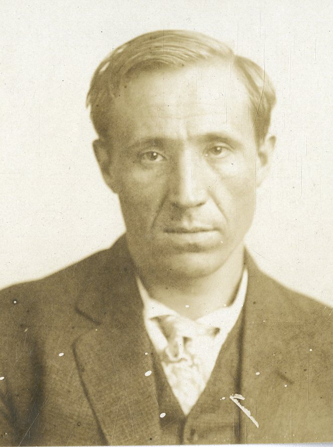

- Source: [National Archives catalog](https://catalog.archives.gov/id/117703320)
- Credit: U.S. Penitentiary, Leavenworth booking photograph; National Archives at Kansas City, Record Group 129, Inmate Case Files (series 571125), inmate 13129, catalog item 117703320.
- Identity: NARA individually catalogs this photograph as Photograph of Fred Jaakkola, inmate 13129. The name, Leavenworth record and wartime context identify the Chicago IWW prisoner in the existing profile. The original photograph and available reverse were visually checked; the frontal view is on the right. The IWW inmate roster reproduced by NARA on page 6 independently pairs this name with inmate 13129: https://www.archives.gov/files/kansas-city/press/newsletter/2017-october.pdf#page=6 .
- Download: [original photograph](https://catalog.archives.gov/medialz/kansas-city/rg-129/571125/571125_13129-FredJaakkola_001.jpg)
- Preserved original: [batch262-originals/571125_13129-FredJaakkola_001.jpg](batch262-originals/571125_13129-FredJaakkola_001.jpg)
- Crop box: `[658, 0, 1317, 885]` (left, top, exclusive right, exclusive bottom); original dimensions: `[1317, 885]`.
- Original SHA-256: `7359904cac627b06a636c0c8d5291b7fa7a49debd4663cdea247d879a51c4508`
- Portrait SHA-256: `2ff95fbb1ce5f29395d25eacb43bfcc1ba6728e4b11167947cb1814e7cafdeb5`
- Identifying reverse: [batch262-originals/571125_13129-FredJaakkola_002.jpg](batch262-originals/571125_13129-FredJaakkola_002.jpg)

## Frederick Esmond

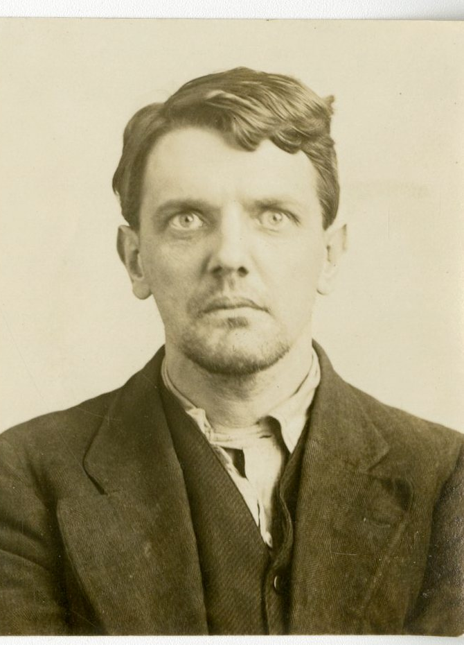

- Source: [National Archives catalog](https://catalog.archives.gov/id/117719324)
- Credit: U.S. Penitentiary, Leavenworth booking photograph; National Archives at Kansas City, Record Group 129, Inmate Case Files (series 571125), inmate 13569, catalog item 117719324.
- Identity: NARA individually catalogs this photograph as Photograph of Frederick Esmond, inmate 13569. The name, Leavenworth record and wartime context identify the IWW prisoner held at Leavenworth after the Sacramento prosecution in the existing profile. The original photograph and available reverse were visually checked; the frontal view is on the right.
- Download: [original photograph](https://catalog.archives.gov/medialz/kansas-city/rg-129/571125/571125_13569-FrederickEsmond_001.jpg)
- Preserved original: [batch262-originals/571125_13569-FrederickEsmond_001.jpg](batch262-originals/571125_13569-FrederickEsmond_001.jpg)
- Crop box: `[669, 0, 1339, 930]` (left, top, exclusive right, exclusive bottom); original dimensions: `[1339, 930]`.
- Original SHA-256: `f00ce31a64804d54d102b9814ee413460be11bf3ab876a656738cb558579d277`
- Portrait SHA-256: `cde084c381991be4f6924be8591d7d9a54fb257a928deb29b7934922e85e2618`
- Identifying reverse: [batch262-originals/571125_13569-FrederickEsmond_002.jpg](batch262-originals/571125_13569-FrederickEsmond_002.jpg)

## G. J. Bourg

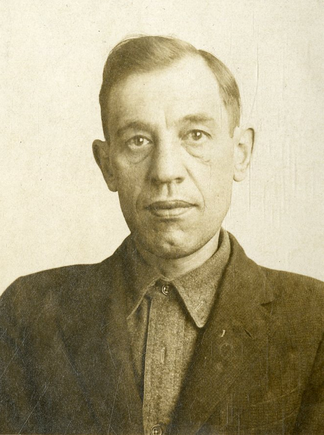

- Source: [National Archives catalog](https://catalog.archives.gov/id/117703286)
- Credit: U.S. Penitentiary, Leavenworth booking photograph; National Archives at Kansas City, Record Group 129, Inmate Case Files (series 571125), inmate 13118, catalog item 117703286.
- Identity: NARA individually catalogs this photograph as Photograph of G. J. Bourg, inmate 13118. The name, Leavenworth record and wartime context identify the Chicago IWW prisoner in the existing profile. The original photograph and available reverse were visually checked; the frontal view is on the right. The IWW inmate roster reproduced by NARA on page 6 independently pairs this name with inmate 13118: https://www.archives.gov/files/kansas-city/press/newsletter/2017-october.pdf#page=6 .
- Download: [original photograph](https://catalog.archives.gov/medialz/kansas-city/rg-129/571125/571125_13118-GJBourg_001.jpg)
- Preserved original: [batch262-originals/571125_13118-GJBourg_001.jpg](batch262-originals/571125_13118-GJBourg_001.jpg)
- Crop box: `[658, 0, 1317, 885]` (left, top, exclusive right, exclusive bottom); original dimensions: `[1317, 885]`.
- Original SHA-256: `1fc9dddccba8555a8261c9d0bca954afbfef7b40bdb79d30a929a144b115a368`
- Portrait SHA-256: `4831e356b1acbc409b0ea6be7b2b32cfe54eafed7dc1b04ebb822b2eaef8403a`
- Identifying reverse: [batch262-originals/571125_13118-GJBourg_002.jpg](batch262-originals/571125_13118-GJBourg_002.jpg)

## George F. Voetter

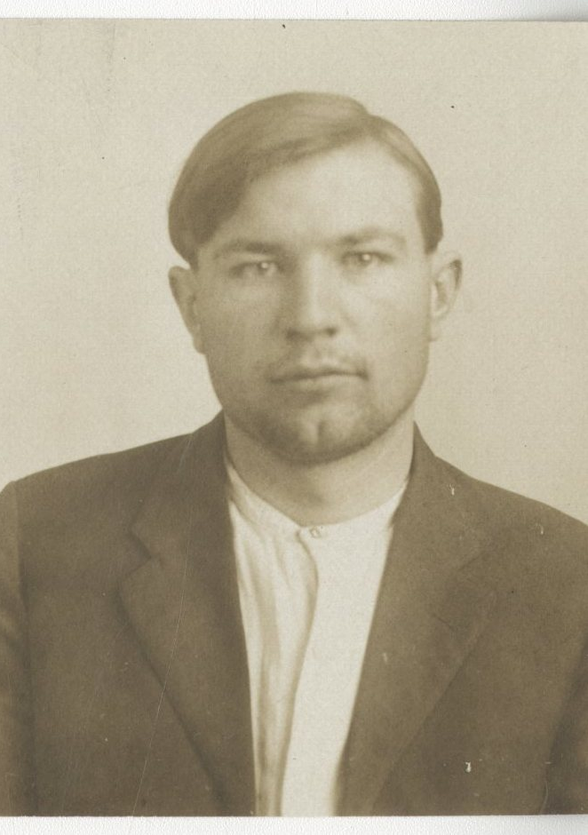

- Source: [National Archives catalog](https://catalog.archives.gov/id/117719371)
- Credit: U.S. Penitentiary, Leavenworth booking photograph; National Archives at Kansas City, Record Group 129, Inmate Case Files (series 571125), inmate 13584, catalog item 117719371.
- Identity: NARA individually catalogs this photograph as Photograph of George F. Voetter, inmate 13584. The name, Leavenworth record and wartime context identify the IWW prisoner held at Leavenworth after the Sacramento prosecution in the existing profile. The original photograph and available reverse were visually checked; the frontal view is on the right.
- Download: [original photograph](https://catalog.archives.gov/medialz/kansas-city/rg-129/571125/571125_13584-GeorgeVoetter_001.jpg)
- Preserved original: [batch262-originals/571125_13584-GeorgeVoetter_001.jpg](batch262-originals/571125_13584-GeorgeVoetter_001.jpg)
- Crop box: `[662, 0, 1324, 940]` (left, top, exclusive right, exclusive bottom); original dimensions: `[1324, 940]`.
- Original SHA-256: `204044bff57719bf37ba32fb45fcecf4bdcbd3b187655262202e4c44e381af39`
- Portrait SHA-256: `be327e308b79fc731a24643b0a37984fe0a97ca9a38bab35428f95964a130629`
- Identifying reverse: [batch262-originals/571125_13584-GeorgeVoetter_002.jpg](batch262-originals/571125_13584-GeorgeVoetter_002.jpg)

## George O'Connell

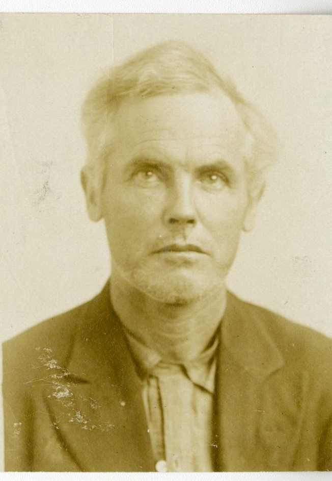

- Source: [National Archives catalog](https://catalog.archives.gov/id/117719347)
- Credit: U.S. Penitentiary, Leavenworth booking photograph; National Archives at Kansas City, Record Group 129, Inmate Case Files (series 571125), inmate 13576, catalog item 117719347.
- Identity: NARA individually catalogs this photograph as Photograph of George O'Connell, inmate 13576. The name, Leavenworth record and wartime context identify the IWW prisoner held at Leavenworth after the Sacramento prosecution in the existing profile. The original photograph and available reverse were visually checked; the frontal view is on the right.
- Download: [original photograph](https://catalog.archives.gov/medialz/kansas-city/rg-129/571125/571125_13576-GeorgeOConnell_001.jpg)
- Preserved original: [batch262-originals/571125_13576-GeorgeOConnell_001.jpg](batch262-originals/571125_13576-GeorgeOConnell_001.jpg)
- Crop box: `[651, 0, 1303, 943]` (left, top, exclusive right, exclusive bottom); original dimensions: `[1303, 943]`.
- Original SHA-256: `ac678075591bf11ad7f2533bb4e4e4c3c972beb841a4c6d8899ef61a4fd09a12`
- Portrait SHA-256: `b142fc1d9965c7aa88d7e6007c511cf076d7844e6be98e8ddd446f04294402a3`
- Identifying reverse: [batch262-originals/571125_13576-GeorgeOConnell_002.jpg](batch262-originals/571125_13576-GeorgeOConnell_002.jpg)

## Godfrey Ebel

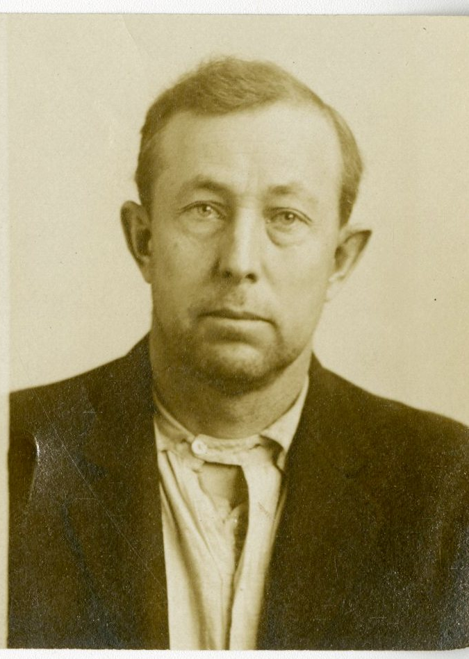

- Source: [National Archives catalog](https://catalog.archives.gov/id/117719321)
- Credit: U.S. Penitentiary, Leavenworth booking photograph; National Archives at Kansas City, Record Group 129, Inmate Case Files (series 571125), inmate 13567, catalog item 117719321.
- Identity: NARA individually catalogs this photograph as Photograph of Godfrey Ebel, inmate 13567. The name, Leavenworth record and wartime context identify the IWW prisoner held at Leavenworth after the Sacramento prosecution in the existing profile. The original photograph and available reverse were visually checked; the frontal view is on the right.
- Download: [original photograph](https://catalog.archives.gov/medialz/kansas-city/rg-129/571125/571125_13567-GodfreyEbel_001.jpg)
- Preserved original: [batch262-originals/571125_13567-GodfreyEbel_001.jpg](batch262-originals/571125_13567-GodfreyEbel_001.jpg)
- Crop box: `[675, 0, 1350, 949]` (left, top, exclusive right, exclusive bottom); original dimensions: `[1350, 949]`.
- Original SHA-256: `fc5a528fdb1cf200da2253662075ad9abc729a5409475da63256dfcd2cb4ac61`
- Portrait SHA-256: `bb6afe23807c7c1052607229cc516123720ebeb070d437ff62c501f873129832`
- Identifying reverse: [batch262-originals/571125_13567-GodfreyEbel_002.jpg](batch262-originals/571125_13567-GodfreyEbel_002.jpg)

## H. C. Spence

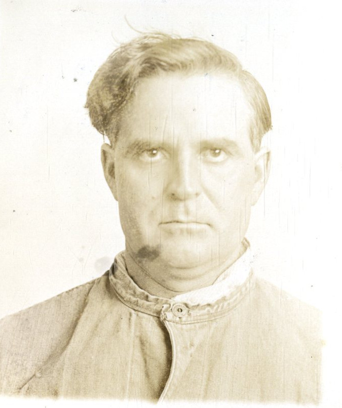

- Source: [National Archives catalog](https://catalog.archives.gov/id/83858509)
- Credit: U.S. Penitentiary, Leavenworth booking photograph; National Archives at Kansas City, Record Group 129, Inmate Case Files (series 571125), inmate 12027, catalog item 83858509.
- Identity: NARA individually catalogs this photograph as Photograph of H. C. Spence, inmate 12027. The name, Leavenworth record and wartime context identify the Oklahoma wartime conspiracy prisoner in the existing profile. The original photograph and available reverse were visually checked; the frontal view is on the right.
- Download: [original photograph](https://catalog.archives.gov/medialz/kansas-city/rg-129/571125/571125_12027-HCSpence_001.jpg)
- Preserved original: [batch262-originals/571125_12027-HCSpence_001.jpg](batch262-originals/571125_12027-HCSpence_001.jpg)
- Crop box: `[675, 0, 1350, 806]` (left, top, exclusive right, exclusive bottom); original dimensions: `[1350, 806]`.
- Original SHA-256: `42ad75a94fe6c37d64eaffea9ff70feb8da7ec5c54257adac58129a473e25261`
- Portrait SHA-256: `6547e778b8300d8b52198d864a6f775d3ab349529204696ec770891edc6cd553`
- Identifying reverse: [batch262-originals/571125_12027-HCSpence_002.jpg](batch262-originals/571125_12027-HCSpence_002.jpg)

## H. H. Munson

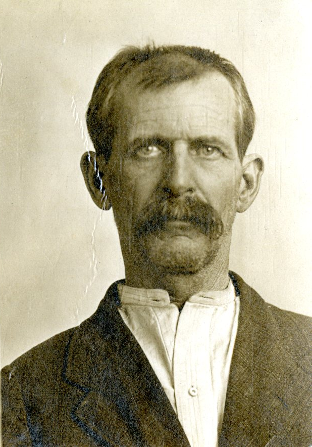

- Source: [National Archives catalog](https://catalog.archives.gov/id/83858506)
- Credit: U.S. Penitentiary, Leavenworth booking photograph; National Archives at Kansas City, Record Group 129, Inmate Case Files (series 571125), inmate 12026, catalog item 83858506.
- Identity: NARA individually catalogs this photograph as Photograph of H. H. Munson, inmate 12026. The name, Leavenworth record and wartime context identify the Oklahoma wartime conspiracy prisoner in the existing profile. The original photograph and available reverse were visually checked; the frontal view is on the right.
- Download: [original photograph](https://catalog.archives.gov/medialz/kansas-city/rg-129/571125/571125_12026-HHMunson_001.jpg)
- Preserved original: [batch262-originals/571125_12026-HHMunson_001.jpg](batch262-originals/571125_12026-HHMunson_001.jpg)
- Crop box: `[618, 0, 1236, 884]` (left, top, exclusive right, exclusive bottom); original dimensions: `[1236, 884]`.
- Original SHA-256: `6ca0ae4b3fceaad836f197890a98c076d0d627b4d8bd17b344a84eed3296c760`
- Portrait SHA-256: `316b66f43cb074e5ce874b069b2d5d5e5d8502267b04d2a1e5ec56d3ae4ab4da`
- Identifying reverse: [batch262-originals/571125_12026-HHMunson_002.jpg](batch262-originals/571125_12026-HHMunson_002.jpg)

## Harry Brewer

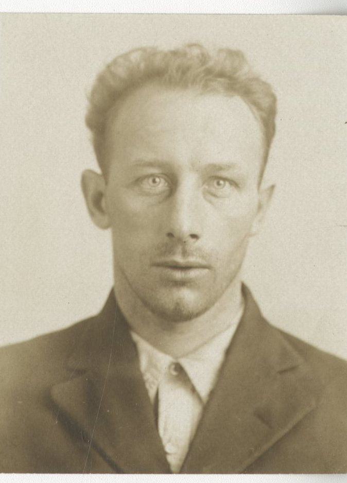

- Source: [National Archives catalog](https://catalog.archives.gov/id/117719304)
- Credit: U.S. Penitentiary, Leavenworth booking photograph; National Archives at Kansas City, Record Group 129, Inmate Case Files (series 571125), inmate 13562, catalog item 117719304.
- Identity: NARA individually catalogs this photograph as Photograph of Harry Brewer, inmate 13562. The name, Leavenworth record and wartime context identify the IWW prisoner held at Leavenworth after the Sacramento prosecution in the existing profile. The original photograph and available reverse were visually checked; the frontal view is on the right.
- Download: [original photograph](https://catalog.archives.gov/medialz/kansas-city/rg-129/571125/571125_13562-HarryBrewer_001.jpg)
- Preserved original: [batch262-originals/571125_13562-HarryBrewer_001.jpg](batch262-originals/571125_13562-HarryBrewer_001.jpg)
- Crop box: `[674, 0, 1348, 938]` (left, top, exclusive right, exclusive bottom); original dimensions: `[1348, 938]`.
- Original SHA-256: `b0108a5435954137b756c140a5da18e7dd494151a09fe35324f9d1d0abf0a2c8`
- Portrait SHA-256: `9fb28b22ab792abfb711333224340b4eba24907265f03e352975e92df753b274`
- Identifying reverse: [batch262-originals/571125_13562-HarryBrewer_002.jpg](batch262-originals/571125_13562-HarryBrewer_002.jpg)

## Harry Drew

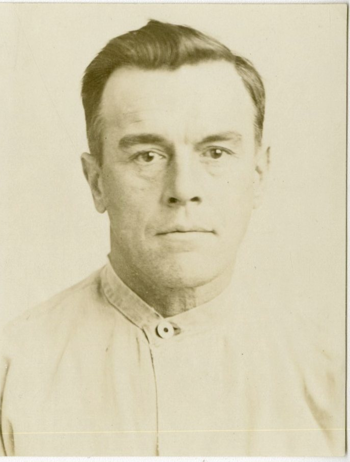

- Source: [National Archives catalog](https://catalog.archives.gov/id/160922104)
- Credit: U.S. Penitentiary, Leavenworth booking photograph; National Archives at Kansas City, Record Group 129, Inmate Case Files (series 571125), inmate 14814, catalog item 160922104.
- Identity: NARA individually catalogs this photograph as Photograph of Harry Drew, inmate 14814. The name, Leavenworth record and wartime context identify the IWW prisoner in the December 1919 Wichita/Kansas group in the existing profile. The original photograph and available reverse were visually checked; the frontal view is on the right.
- Download: [original photograph](https://catalog.archives.gov/medialz/kansas-city/rg-129/571125/571125_14814-HarryDrew_001.jpg)
- Preserved original: [batch262-originals/571125_14814-HarryDrew_001.jpg](batch262-originals/571125_14814-HarryDrew_001.jpg)
- Crop box: `[687, 0, 1375, 907]` (left, top, exclusive right, exclusive bottom); original dimensions: `[1375, 907]`.
- Original SHA-256: `d1700979377ef3dcccdde0fcead330dc602121014ec71a7422a6f00b415786c7`
- Portrait SHA-256: `e3721d50cdb88618c92dd9c9a5a7135519a4350499c869cbb0c4a027251e8f14`
- Identifying reverse: [batch262-originals/571125_14814-HarryDrew_002.jpg](batch262-originals/571125_14814-HarryDrew_002.jpg)

## Harry Gray

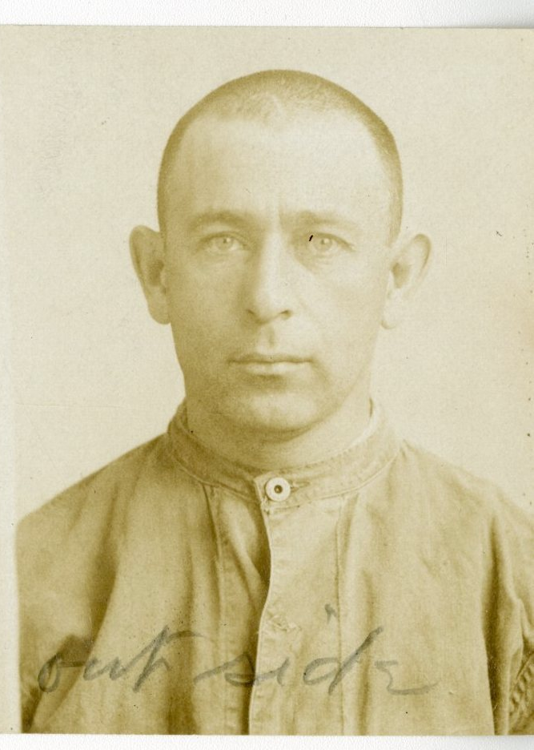

- Source: [National Archives catalog](https://catalog.archives.gov/id/117719330)
- Credit: U.S. Penitentiary, Leavenworth booking photograph; National Archives at Kansas City, Record Group 129, Inmate Case Files (series 571125), inmate 13571, catalog item 117719330.
- Identity: NARA individually catalogs this photograph as Photograph of Harry Gray, inmate 13571. The name, Leavenworth record and wartime context identify the IWW prisoner held at Leavenworth after the Sacramento prosecution in the existing profile. The original photograph and available reverse were visually checked; the frontal view is on the right.
- Download: [original photograph](https://catalog.archives.gov/medialz/kansas-city/rg-129/571125/571125_13571-HarryGray_001.jpg)
- Preserved original: [batch262-originals/571125_13571-HarryGray_001.jpg](batch262-originals/571125_13571-HarryGray_001.jpg)
- Crop box: `[666, 0, 1333, 936]` (left, top, exclusive right, exclusive bottom); original dimensions: `[1333, 936]`.
- Original SHA-256: `a853e84d6e3b16e5d4dd32ad42f19959afd906279856e2f627428d2f5bcc564d`
- Portrait SHA-256: `3dc8021ce79e27e422e00c5ba40f4b9022f3fea776f9f38e8bb12f20e02fe88d`
- Identifying reverse: [batch262-originals/571125_13571-HarryGray_002.jpg](batch262-originals/571125_13571-HarryGray_002.jpg)

## Harry Lloyd

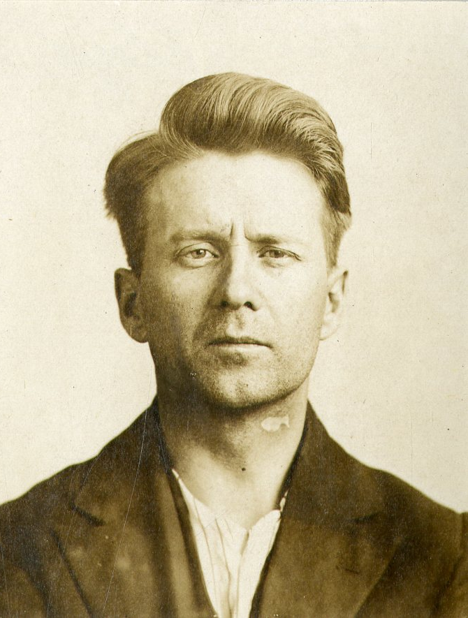

- Source: [National Archives catalog](https://catalog.archives.gov/id/117703398)
- Credit: U.S. Penitentiary, Leavenworth booking photograph; National Archives at Kansas City, Record Group 129, Inmate Case Files (series 571125), inmate 13164, catalog item 117703398.
- Identity: NARA individually catalogs this photograph as Photograph of Harry Lloyd, inmate 13164. The name, Leavenworth record and wartime context identify the Chicago IWW prisoner in the existing profile. The original photograph and available reverse were visually checked; the frontal view is on the right. The IWW inmate roster reproduced by NARA on page 6 independently pairs this name with inmate 13164: https://www.archives.gov/files/kansas-city/press/newsletter/2017-october.pdf#page=6 .
- Download: [original photograph](https://catalog.archives.gov/medialz/kansas-city/rg-129/571125/571125_13164-HarryLloyd_001.jpg)
- Preserved original: [batch262-originals/571125_13164-HarryLloyd_001.jpg](batch262-originals/571125_13164-HarryLloyd_001.jpg)
- Crop box: `[669, 0, 1339, 885]` (left, top, exclusive right, exclusive bottom); original dimensions: `[1339, 885]`.
- Original SHA-256: `b006dc64b3689c923bd2223be62571015ae4068f4946eeb9c883405985ec22c8`
- Portrait SHA-256: `ff99f73593a4fd9889762862e4ede92b668ee678b425c2ba5511f75a01af46b7`
- Identifying reverse: [batch262-originals/571125_13164-HarryLloyd_002.jpg](batch262-originals/571125_13164-HarryLloyd_002.jpg)

## Henry Hammer

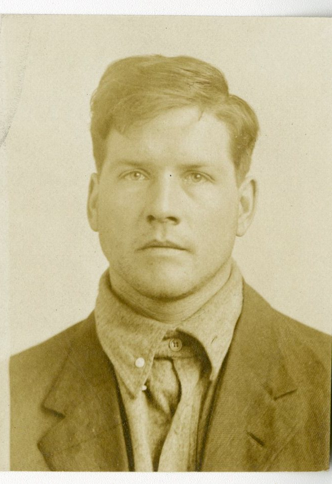

- Source: [National Archives catalog](https://catalog.archives.gov/id/117719333)
- Credit: U.S. Penitentiary, Leavenworth booking photograph; National Archives at Kansas City, Record Group 129, Inmate Case Files (series 571125), inmate 13572, catalog item 117719333.
- Identity: NARA individually catalogs this photograph as Photograph of Henry Hammer, inmate 13572. The name, Leavenworth record and wartime context identify the IWW prisoner held at Leavenworth after the Sacramento prosecution in the existing profile. The original photograph and available reverse were visually checked; the frontal view is on the right.
- Download: [original photograph](https://catalog.archives.gov/medialz/kansas-city/rg-129/571125/571125_13572-HenryHammer_001.jpg)
- Preserved original: [batch262-originals/571125_13572-HenryHammer_001.jpg](batch262-originals/571125_13572-HenryHammer_001.jpg)
- Crop box: `[661, 0, 1322, 963]` (left, top, exclusive right, exclusive bottom); original dimensions: `[1322, 963]`.
- Original SHA-256: `1da53a97b9ccead954eaece97b9c20f3e96a9ca99a3dc81d2f362842fcb97dcf`
- Portrait SHA-256: `64650d51c57c1cd963638485835589d48fdd3e833b077e0fbbf0ebf26fc7a58c`
- Identifying reverse: [batch262-originals/571125_13572-HenryHammer_002.jpg](batch262-originals/571125_13572-HenryHammer_002.jpg)

## Herbert Stredwick

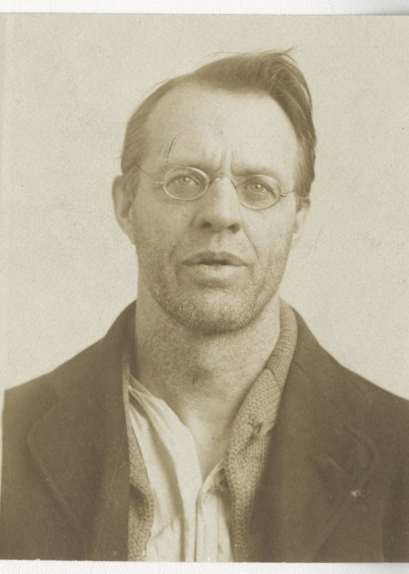

- Source: [National Archives catalog](https://catalog.archives.gov/id/117719380)
- Credit: U.S. Penitentiary, Leavenworth booking photograph; National Archives at Kansas City, Record Group 129, Inmate Case Files (series 571125), inmate 13587, catalog item 117719380.
- Identity: NARA individually catalogs this photograph as Photograph of Herbert Stredwick, inmate 13587. The name, Leavenworth record and wartime context identify the IWW prisoner held at Leavenworth after the Sacramento prosecution in the existing profile. The original photograph and available reverse were visually checked; the frontal view is on the right.
- Download: [original photograph](https://catalog.archives.gov/medialz/kansas-city/rg-129/571125/571125_13587-HerbertStredwick_001.jpg)
- Preserved original: [batch262-originals/571125_13587-HerbertStredwick_001.jpg](batch262-originals/571125_13587-HerbertStredwick_001.jpg)
- Crop box: `[666, 0, 1333, 935]` (left, top, exclusive right, exclusive bottom); original dimensions: `[1333, 935]`.
- Original SHA-256: `6acef9aaa5952ac4f44a061ececa90a6e10bc9912bec452a715f556d4ad8f4c2`
- Portrait SHA-256: `c17e38a9fe493b329547d100436a14116981e470439fa9389741d9484a89673c`
- Identifying reverse: [batch262-originals/571125_13587-HerbertStredwick_002.jpg](batch262-originals/571125_13587-HerbertStredwick_002.jpg)

## Ira Hardy

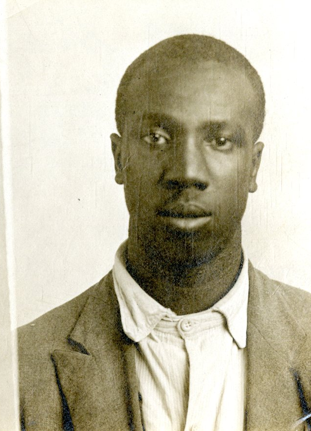

- Source: [National Archives catalog](https://catalog.archives.gov/id/83858529)
- Credit: U.S. Penitentiary, Leavenworth booking photograph; National Archives at Kansas City, Record Group 129, Inmate Case Files (series 571125), inmate 12032, catalog item 83858529.
- Identity: NARA individually catalogs this photograph as Photograph of Ira Hardy, inmate 12032. The name, Leavenworth record and wartime context identify the Oklahoma wartime conspiracy prisoner in the existing profile. The original photograph and available reverse were visually checked; the frontal view is on the right.
- Download: [original photograph](https://catalog.archives.gov/medialz/kansas-city/rg-129/571125/571125_12032-IraHardy_001.jpg)
- Preserved original: [batch262-originals/571125_12032-IraHardy_001.jpg](batch262-originals/571125_12032-IraHardy_001.jpg)
- Crop box: `[638, 0, 1277, 884]` (left, top, exclusive right, exclusive bottom); original dimensions: `[1277, 884]`.
- Original SHA-256: `3184cae934ecdb0fad935cfd4e15766404fe987462e8db59f77597cf5040318d`
- Portrait SHA-256: `bc0b1a892ef20030b7909382734a9b5385d547288c0321f64c75e3d1efa99b05`
- Identifying reverse: [batch262-originals/571125_12032-IraHardy_002.jpg](batch262-originals/571125_12032-IraHardy_002.jpg)

## J. A. Maxwell

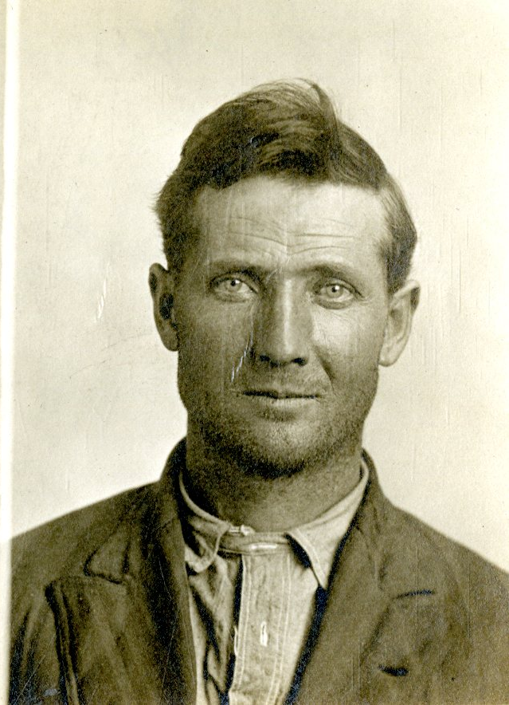

- Source: [National Archives catalog](https://catalog.archives.gov/id/83858535)
- Credit: U.S. Penitentiary, Leavenworth booking photograph; National Archives at Kansas City, Record Group 129, Inmate Case Files (series 571125), inmate 12034, catalog item 83858535.
- Identity: NARA individually catalogs this photograph as Photograph of J. A. Maxwell, inmate 12034. The name, Leavenworth record and wartime context identify the Oklahoma wartime conspiracy prisoner in the existing profile. The original photograph and available reverse were visually checked; the frontal view is on the right.
- Download: [original photograph](https://catalog.archives.gov/medialz/kansas-city/rg-129/571125/571125_12034-JAMaxwell_001.jpg)
- Preserved original: [batch262-originals/571125_12034-JAMaxwell_001.jpg](batch262-originals/571125_12034-JAMaxwell_001.jpg)
- Crop box: `[638, 0, 1277, 884]` (left, top, exclusive right, exclusive bottom); original dimensions: `[1277, 884]`.
- Original SHA-256: `eb5a0868c0f99adf63430a6977f1a70a79e4d9274b16bf1fabe9e673c44984c5`
- Portrait SHA-256: `53c49d0be688983135d02fe9113a800ded6e6911a2f57f72bd9a04f1ecd513d5`
- Identifying reverse: [batch262-originals/571125_12034-JAMaxwell_002.jpg](batch262-originals/571125_12034-JAMaxwell_002.jpg)

## J. E. Wiggins

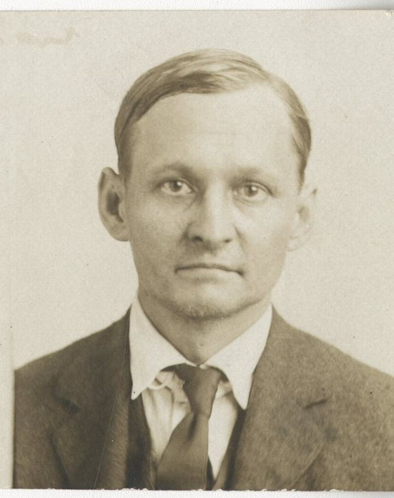

- Source: [National Archives catalog](https://catalog.archives.gov/id/117720213)
- Credit: U.S. Penitentiary, Leavenworth booking photograph; National Archives at Kansas City, Record Group 129, Inmate Case Files (series 571125), inmate 13843, catalog item 117720213.
- Identity: NARA individually catalogs this photograph as Photograph of J. E. Wiggins, inmate 13843. The name, Leavenworth record and wartime context identify the Oklahoma wartime prisoner in the existing profile. The original photograph and available reverse were visually checked; the frontal view is on the right.
- Download: [original photograph](https://catalog.archives.gov/medialz/kansas-city/rg-129/571125/571125_13843-JEWiggins_001.jpg)
- Preserved original: [batch262-originals/571125_13843-JEWiggins_001.jpg](batch262-originals/571125_13843-JEWiggins_001.jpg)
- Crop box: `[667, 0, 1335, 844]` (left, top, exclusive right, exclusive bottom); original dimensions: `[1335, 844]`.
- Original SHA-256: `ea3781c58fd3730798f72310f925b05b5437374f2649611a10da6357f4577bc4`
- Portrait SHA-256: `64654515e12848c679eb6d5683e64028bd86ddc5584dca68a76b2bcb737cf8f8`
- Identifying reverse: [batch262-originals/571125_13843-JEWiggins_002.jpg](batch262-originals/571125_13843-JEWiggins_002.jpg)

## J. H. Majors

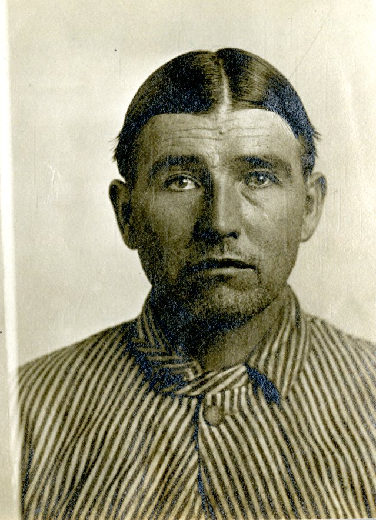

- Source: [National Archives catalog](https://catalog.archives.gov/id/83858532)
- Credit: U.S. Penitentiary, Leavenworth booking photograph; National Archives at Kansas City, Record Group 129, Inmate Case Files (series 571125), inmate 12033, catalog item 83858532.
- Identity: NARA individually catalogs this photograph as Photograph of J. H. Majors, inmate 12033. The name, Leavenworth record and wartime context identify the Oklahoma wartime conspiracy prisoner in the existing profile. The original photograph and available reverse were visually checked; the frontal view is on the right.
- Download: [original photograph](https://catalog.archives.gov/medialz/kansas-city/rg-129/571125/571125_12033-JHMajors_001.jpg)
- Preserved original: [batch262-originals/571125_12033-JHMajors_001.jpg](batch262-originals/571125_12033-JHMajors_001.jpg)
- Crop box: `[638, 0, 1277, 884]` (left, top, exclusive right, exclusive bottom); original dimensions: `[1277, 884]`.
- Original SHA-256: `88f939df0782c85786b08627c13d39ee39ac221da6923a4cf45862ba80093aac`
- Portrait SHA-256: `e00067b1b9a6aa8feb97510fe9f1e1365b7fa45cd1777125de8dfad012581c50`
- Identifying reverse: [batch262-originals/571125_12033-JHMajors_002.jpg](batch262-originals/571125_12033-JHMajors_002.jpg)

## J. M. Danley

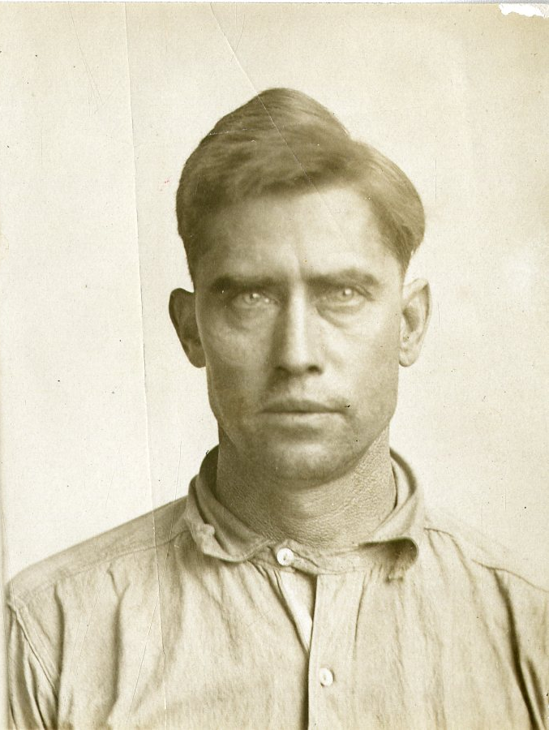

- Source: [National Archives catalog](https://catalog.archives.gov/id/117702728)
- Credit: U.S. Penitentiary, Leavenworth booking photograph; National Archives at Kansas City, Record Group 129, Inmate Case Files (series 571125), inmate 12941, catalog item 117702728.
- Identity: NARA individually catalogs this photograph as Photograph of J. M. Danley, inmate 12941. The name, Leavenworth record and wartime context identify the Arkansas farmer and Working Class Union prisoner in the existing profile. The original photograph and available reverse were visually checked; the frontal view is on the right.
- Download: [original photograph](https://catalog.archives.gov/medialz/kansas-city/rg-129/571125/571125_12941-JMDanley_001.jpg)
- Preserved original: [batch262-originals/571125_12941-JMDanley_001.jpg](batch262-originals/571125_12941-JMDanley_001.jpg)
- Crop box: `[677, 0, 1354, 900]` (left, top, exclusive right, exclusive bottom); original dimensions: `[1354, 900]`.
- Original SHA-256: `9ba0d3ec4528f69f660383225e8dd7fbbe0efab66823ed915ef23b7fc738931e`
- Portrait SHA-256: `81361c6b6cd8c6070fea608d63aa8934aa6d3deef94ea8330c705b1c293279dd`
- Identifying reverse: [batch262-originals/571125_12941-JMDanley_002.jpg](batch262-originals/571125_12941-JMDanley_002.jpg)

## J. R. Sparkman

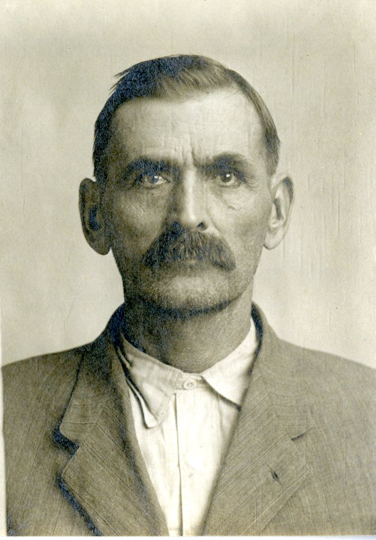

- Source: [National Archives catalog](https://catalog.archives.gov/id/83858439)
- Credit: U.S. Penitentiary, Leavenworth booking photograph; National Archives at Kansas City, Record Group 129, Inmate Case Files (series 571125), inmate 12005, catalog item 83858439.
- Identity: NARA individually catalogs this photograph as Photograph of J. R. Sparkman, inmate 12005. The name, Leavenworth record and wartime context identify the Oklahoma wartime conspiracy prisoner in the existing profile. The original photograph and available reverse were visually checked; the frontal view is on the right.
- Download: [original photograph](https://catalog.archives.gov/medialz/kansas-city/rg-129/571125/571125_12005-JRSparkman_001.jpg)
- Preserved original: [batch262-originals/571125_12005-JRSparkman_001.jpg](batch262-originals/571125_12005-JRSparkman_001.jpg)
- Crop box: `[615, 0, 1231, 884]` (left, top, exclusive right, exclusive bottom); original dimensions: `[1231, 884]`.
- Original SHA-256: `ec6b697ee01a28b72bcda08d04dcf4b7be3c66f9c8cdefc9d0053c8699577b06`
- Portrait SHA-256: `6f3d744ade600bd40ed7fe6287f30bf285b42f57f9528c9265b57cf78a632633`
- Identifying reverse: [batch262-originals/571125_12005-JRSparkman_002.jpg](batch262-originals/571125_12005-JRSparkman_002.jpg)

## J. T. Cumbie

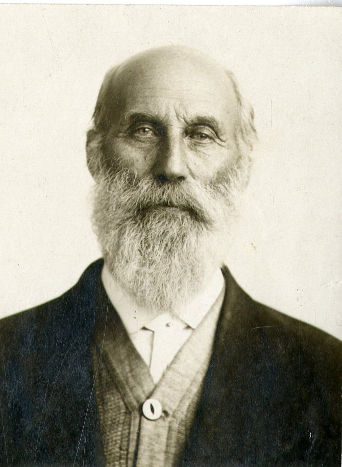

- Source: [National Archives catalog](https://catalog.archives.gov/id/117703948)
- Credit: U.S. Penitentiary, Leavenworth booking photograph; National Archives at Kansas City, Record Group 129, Inmate Case Files (series 571125), inmate 13340, catalog item 117703948.
- Identity: NARA individually catalogs this photograph as Photograph of J. T. Cumbie, inmate 13340. The name, Leavenworth record and wartime context identify the Oklahoma Universal Union prisoner in the existing profile. The original photograph and available reverse were visually checked; the frontal view is on the right.
- Download: [original photograph](https://catalog.archives.gov/medialz/kansas-city/rg-129/571125/571125_13340-JTCumbie_001.jpg)
- Preserved original: [batch262-originals/571125_13340-JTCumbie_001.jpg](batch262-originals/571125_13340-JTCumbie_001.jpg)
- Crop box: `[669, 0, 1339, 915]` (left, top, exclusive right, exclusive bottom); original dimensions: `[1339, 915]`.
- Original SHA-256: `ecf8179ef782ef88947fcf8b461eaed0fae72ea622a0e764ebbbe990e21d5865`
- Portrait SHA-256: `03b3ffd9f629bc88985c274155d0c6f2da2829a3305757e3b1676bff72718181`
- Identifying reverse: [batch262-originals/571125_13340-JTCumbie_002.jpg](batch262-originals/571125_13340-JTCumbie_002.jpg)

## Jack Law

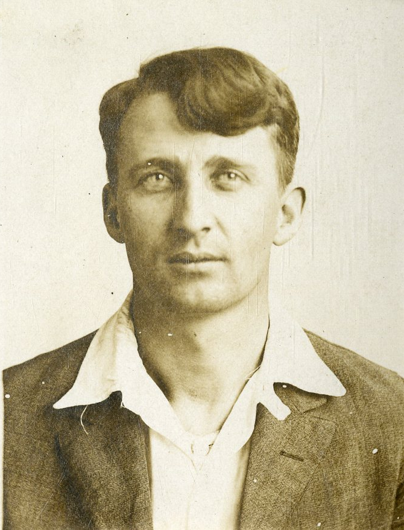

- Source: [National Archives catalog](https://catalog.archives.gov/id/117703326)
- Credit: U.S. Penitentiary, Leavenworth booking photograph; National Archives at Kansas City, Record Group 129, Inmate Case Files (series 571125), inmate 13131, catalog item 117703326.
- Identity: NARA individually catalogs this photograph as Photograph of Jack Law, inmate 13131. The name, Leavenworth record and wartime context identify the Chicago IWW prisoner in the existing profile. The original photograph and available reverse were visually checked; the frontal view is on the right. The IWW inmate roster reproduced by NARA on page 6 independently pairs this name with inmate 13131: https://www.archives.gov/files/kansas-city/press/newsletter/2017-october.pdf#page=6 .
- Download: [original photograph](https://catalog.archives.gov/medialz/kansas-city/rg-129/571125/571125_13131-JackLaw_001.jpg)
- Preserved original: [batch262-originals/571125_13131-JackLaw_001.jpg](batch262-originals/571125_13131-JackLaw_001.jpg)
- Crop box: `[669, 0, 1339, 878]` (left, top, exclusive right, exclusive bottom); original dimensions: `[1339, 878]`.
- Original SHA-256: `df4540999bfe1692a97adf7fddd304e23e8cc9689588c153430a0f6afa79e51a`
- Portrait SHA-256: `1c840f707fafe37ec50f5ef8c16c87de11d84c9fb0801cc434b340b0305bca25`
- Identifying reverse: [batch262-originals/571125_13131-JackLaw_002.jpg](batch262-originals/571125_13131-JackLaw_002.jpg)

## James Phillips

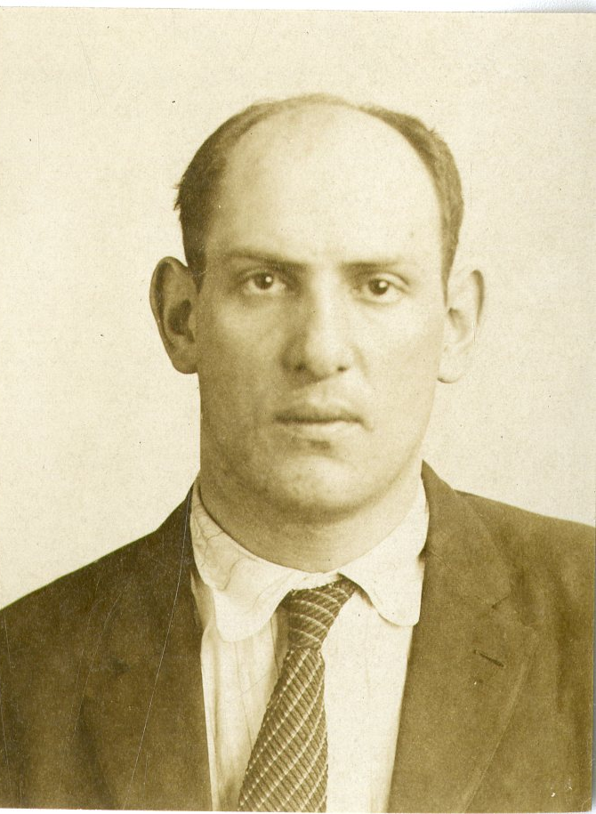

- Source: [National Archives catalog](https://catalog.archives.gov/id/117703430)
- Credit: U.S. Penitentiary, Leavenworth booking photograph; National Archives at Kansas City, Record Group 129, Inmate Case Files (series 571125), inmate 13175, catalog item 117703430.
- Identity: NARA individually catalogs this photograph as Photograph of James Phillips, inmate 13175. The name, Leavenworth record and wartime context identify the Chicago IWW prisoner in the existing profile. The original photograph and available reverse were visually checked; the frontal view is on the right. The IWW inmate roster reproduced by NARA on page 6 independently pairs this name with inmate 13175: https://www.archives.gov/files/kansas-city/press/newsletter/2017-october.pdf#page=6 .
- Download: [original photograph](https://catalog.archives.gov/medialz/kansas-city/rg-129/571125/571125_13175-JamesPhillips_001.jpg)
- Preserved original: [batch262-originals/571125_13175-JamesPhillips_001.jpg](batch262-originals/571125_13175-JamesPhillips_001.jpg)
- Crop box: `[669, 0, 1339, 915]` (left, top, exclusive right, exclusive bottom); original dimensions: `[1339, 915]`.
- Original SHA-256: `7eaaa16e3d00817f43373b10d887d298d7445afa04d838d2902c7c1075eaeb4d`
- Portrait SHA-256: `f8e403663b39bda2568d3699f5ce5d7470fd0cb7451abfbdfe253450a000c4cb`
- Identifying reverse: [batch262-originals/571125_13175-JamesPhillips_002.jpg](batch262-originals/571125_13175-JamesPhillips_002.jpg)

## James Quinlan

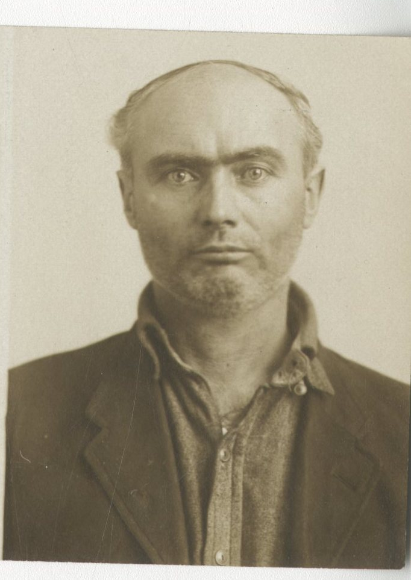

- Source: [National Archives catalog](https://catalog.archives.gov/id/117719356)
- Credit: U.S. Penitentiary, Leavenworth booking photograph; National Archives at Kansas City, Record Group 129, Inmate Case Files (series 571125), inmate 13579, catalog item 117719356.
- Identity: NARA individually catalogs this photograph as Photograph of James Quinlan, inmate 13579. The name, Leavenworth record and wartime context identify the IWW prisoner held at Leavenworth after the Sacramento prosecution in the existing profile. The original photograph and available reverse were visually checked; the frontal view is on the right.
- Download: [original photograph](https://catalog.archives.gov/medialz/kansas-city/rg-129/571125/571125_13579-JamesQuinlan_001.jpg)
- Preserved original: [batch262-originals/571125_13579-JamesQuinlan_001.jpg](batch262-originals/571125_13579-JamesQuinlan_001.jpg)
- Crop box: `[681, 0, 1363, 963]` (left, top, exclusive right, exclusive bottom); original dimensions: `[1363, 963]`.
- Original SHA-256: `c45032812935a47345b7babe1293af25cd7fabb8e08c2d8d731bde147b194359`
- Portrait SHA-256: `b1ceb044c1fa45238d0c3114e9832700a68447700f89bd63d84fce37cd08c694`
- Identifying reverse: [batch262-originals/571125_13579-JamesQuinlan_002.jpg](batch262-originals/571125_13579-JamesQuinlan_002.jpg)

## Joe Graber

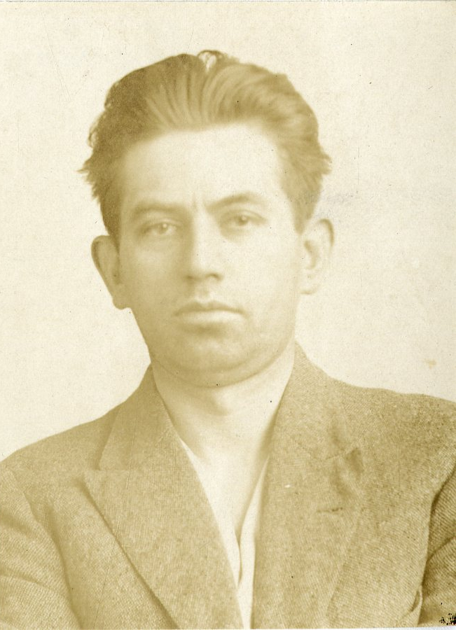

- Source: [National Archives catalog](https://catalog.archives.gov/id/117703378)
- Credit: U.S. Penitentiary, Leavenworth booking photograph; National Archives at Kansas City, Record Group 129, Inmate Case Files (series 571125), inmate 13156, catalog item 117703378.
- Identity: NARA individually catalogs this photograph as Photograph of Joe Graber, inmate 13156. The name, Leavenworth record and wartime context identify the Chicago IWW prisoner in the existing profile. The original photograph and available reverse were visually checked; the frontal view is on the right. The IWW inmate roster reproduced by NARA on page 6 independently pairs this name with inmate 13156: https://www.archives.gov/files/kansas-city/press/newsletter/2017-october.pdf#page=6 .
- Download: [original photograph](https://catalog.archives.gov/medialz/kansas-city/rg-129/571125/571125_13156-JoeGraber_001.jpg)
- Preserved original: [batch262-originals/571125_13156-JoeGraber_001.jpg](batch262-originals/571125_13156-JoeGraber_001.jpg)
- Crop box: `[651, 0, 1302, 900]` (left, top, exclusive right, exclusive bottom); original dimensions: `[1302, 900]`.
- Original SHA-256: `0fd524dd9f66cf88285017f8f7b751bc193e72b43f85d19311a3a2627c278b8c`
- Portrait SHA-256: `76992d798be34ff77d6f273cd6b8654953696cd8dc67e34230aa3b3d578309a1`
- Identifying reverse: [batch262-originals/571125_13156-JoeGraber_002.jpg](batch262-originals/571125_13156-JoeGraber_002.jpg)

## John Avila

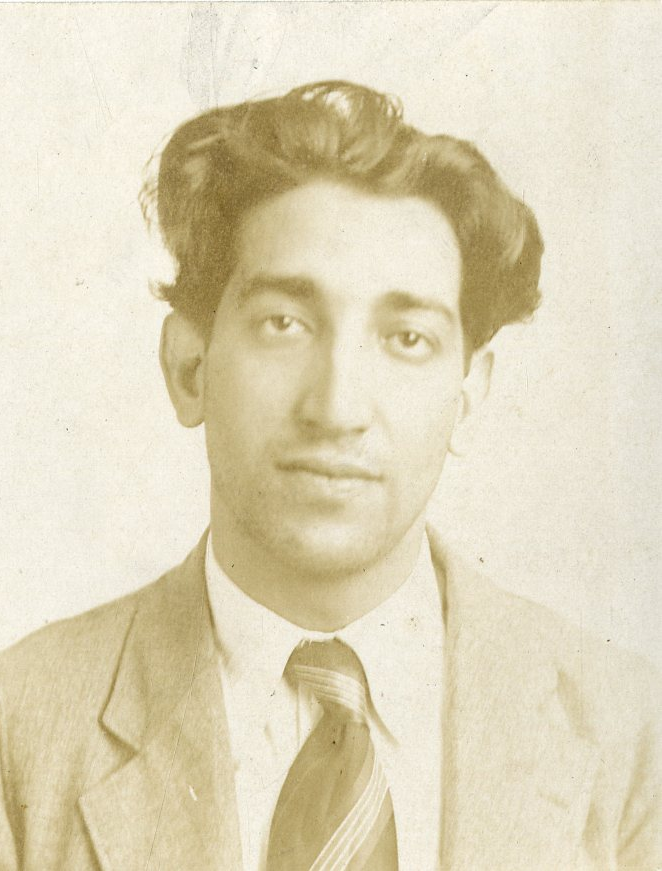

- Source: [National Archives catalog](https://catalog.archives.gov/id/117703366)
- Credit: U.S. Penitentiary, Leavenworth booking photograph; National Archives at Kansas City, Record Group 129, Inmate Case Files (series 571125), inmate 13148, catalog item 117703366.
- Identity: NARA individually catalogs this photograph as Photograph of John Avila, inmate 13148. The name, Leavenworth record and wartime context identify the Chicago IWW prisoner in the existing profile. The original photograph and available reverse were visually checked; the frontal view is on the right. The IWW inmate roster reproduced by NARA on page 6 independently pairs this name with inmate 13148: https://www.archives.gov/files/kansas-city/press/newsletter/2017-october.pdf#page=6 .
- Download: [original photograph](https://catalog.archives.gov/medialz/kansas-city/rg-129/571125/571125_13148-JohnAvila_001.jpg)
- Preserved original: [batch262-originals/571125_13148-JohnAvila_001.jpg](batch262-originals/571125_13148-JohnAvila_001.jpg)
- Crop box: `[662, 0, 1324, 871]` (left, top, exclusive right, exclusive bottom); original dimensions: `[1324, 871]`.
- Original SHA-256: `edf96398258c3bdabb725389b602df6fb8208a99675ade851510128a33126764`
- Portrait SHA-256: `5780716f54180aebfae0e9e7db8df6af369299e1921b2717eb21cd8dd967ecc3`
- Identifying reverse: [batch262-originals/571125_13148-JohnAvila_002.jpg](batch262-originals/571125_13148-JohnAvila_002.jpg)

## John Grave

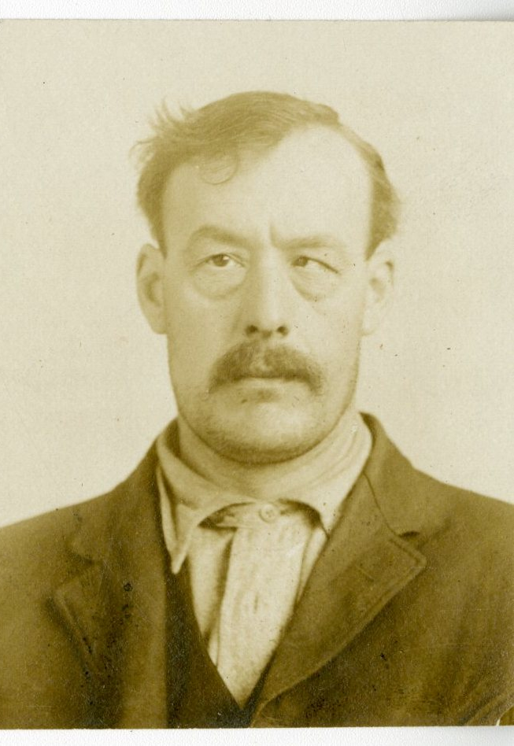

- Source: [National Archives catalog](https://catalog.archives.gov/id/117719327)
- Credit: U.S. Penitentiary, Leavenworth booking photograph; National Archives at Kansas City, Record Group 129, Inmate Case Files (series 571125), inmate 13570, catalog item 117719327.
- Identity: NARA individually catalogs this photograph as Photograph of John Grave, inmate 13570. The name, Leavenworth record and wartime context identify the IWW prisoner held at Leavenworth after the Sacramento prosecution in the existing profile. The original photograph and available reverse were visually checked; the frontal view is on the right.
- Download: [original photograph](https://catalog.archives.gov/medialz/kansas-city/rg-129/571125/571125_13570-JohnGrave_001.jpg)
- Preserved original: [batch262-originals/571125_13570-JohnGrave_001.jpg](batch262-originals/571125_13570-JohnGrave_001.jpg)
- Crop box: `[652, 0, 1305, 948]` (left, top, exclusive right, exclusive bottom); original dimensions: `[1305, 948]`.
- Original SHA-256: `7080d9de3b4ca1be2b791e7565d070e2b0403dcb98617195c877874cc1c00d3e`
- Portrait SHA-256: `fe4bc59b94199803005c2ba0e161202548615a7e037e6703a31aab12db1c255a`
- Identifying reverse: [batch262-originals/571125_13570-JohnGrave_002.jpg](batch262-originals/571125_13570-JohnGrave_002.jpg)

## John L. Murphy

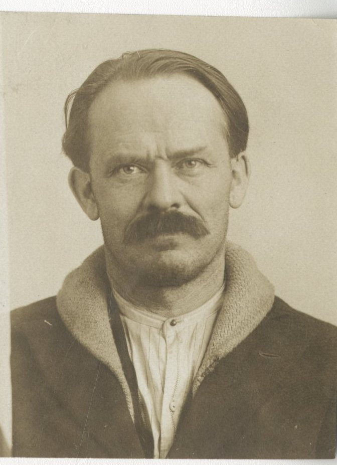

- Source: [National Archives catalog](https://catalog.archives.gov/id/117719377)
- Credit: U.S. Penitentiary, Leavenworth booking photograph; National Archives at Kansas City, Record Group 129, Inmate Case Files (series 571125), inmate 13586, catalog item 117719377.
- Identity: NARA individually catalogs this photograph as Photograph of John L. Murphy, inmate 13586. The name, Leavenworth record and wartime context identify the IWW prisoner held at Leavenworth after the Sacramento prosecution in the existing profile. The original photograph and available reverse were visually checked; the frontal view is on the right.
- Download: [original photograph](https://catalog.archives.gov/medialz/kansas-city/rg-129/571125/571125_13586-JohnMurphy_001.jpg)
- Preserved original: [batch262-originals/571125_13586-JohnMurphy_001.jpg](batch262-originals/571125_13586-JohnMurphy_001.jpg)
- Crop box: `[672, 0, 1344, 927]` (left, top, exclusive right, exclusive bottom); original dimensions: `[1344, 927]`.
- Original SHA-256: `04c5af13b77c5aac8d7272bca709552a9fe7068493e1b5a3215b4a397ad21cde`
- Portrait SHA-256: `9a44d59f391cf8151ca5f9e6e68964453bb11d80f9c7af3a4f702afc9805c5ad`
- Identifying reverse: [batch262-originals/571125_13586-JohnMurphy_002.jpg](batch262-originals/571125_13586-JohnMurphy_002.jpg)

## John Martin

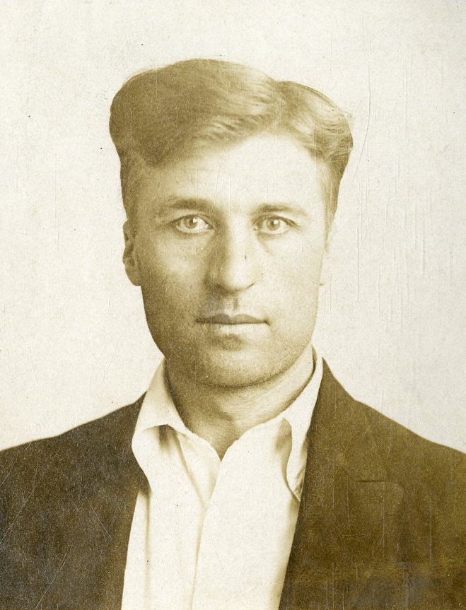

- Source: [National Archives catalog](https://catalog.archives.gov/id/117703337)
- Credit: U.S. Penitentiary, Leavenworth booking photograph; National Archives at Kansas City, Record Group 129, Inmate Case Files (series 571125), inmate 13134, catalog item 117703337.
- Identity: NARA individually catalogs this photograph as Photograph of John Martin, inmate 13134. The name, Leavenworth record and wartime context identify the Chicago IWW prisoner in the existing profile. The original photograph and available reverse were visually checked; the frontal view is on the right. The IWW inmate roster reproduced by NARA on page 6 independently pairs this name with inmate 13134: https://www.archives.gov/files/kansas-city/press/newsletter/2017-october.pdf#page=6 .
- Download: [original photograph](https://catalog.archives.gov/medialz/kansas-city/rg-129/571125/571125_13134-JohnMartin_001.jpg)
- Preserved original: [batch262-originals/571125_13134-JohnMartin_001.jpg](batch262-originals/571125_13134-JohnMartin_001.jpg)
- Crop box: `[658, 0, 1317, 863]` (left, top, exclusive right, exclusive bottom); original dimensions: `[1317, 863]`.
- Original SHA-256: `d980fd3a3c5bad3793cd1f0564636d657f9b240587457b300d4a09d9b35f19ff`
- Portrait SHA-256: `a29576cd0ab02d988369de120ef56e3c0b5d9e23999b6f8526ad721d3969868b`
- Identifying reverse: [batch262-originals/571125_13134-JohnMartin_002.jpg](batch262-originals/571125_13134-JohnMartin_002.jpg)

## John Pancner

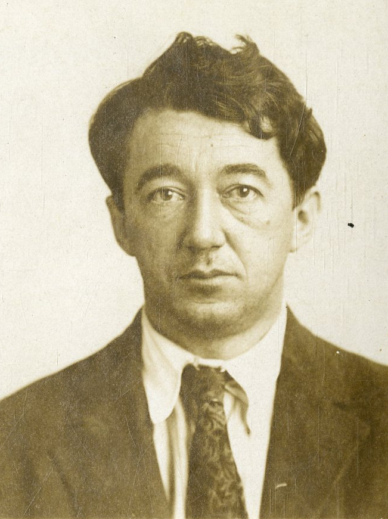

- Source: [National Archives catalog](https://catalog.archives.gov/id/117703343)
- Credit: U.S. Penitentiary, Leavenworth booking photograph; National Archives at Kansas City, Record Group 129, Inmate Case Files (series 571125), inmate 13136, catalog item 117703343.
- Identity: NARA individually catalogs this photograph as Photograph of John Pancner, inmate 13136. The name, Leavenworth record and wartime context identify the Chicago IWW prisoner in the existing profile. The original photograph and available reverse were visually checked; the frontal view is on the right. The IWW inmate roster reproduced by NARA on page 6 independently pairs this name with inmate 13136: https://www.archives.gov/files/kansas-city/press/newsletter/2017-october.pdf#page=6 .
- Download: [original photograph](https://catalog.archives.gov/medialz/kansas-city/rg-129/571125/571125_13136-JohnPancner_001.jpg)
- Preserved original: [batch262-originals/571125_13136-JohnPancner_001.jpg](batch262-originals/571125_13136-JohnPancner_001.jpg)
- Crop box: `[651, 0, 1302, 871]` (left, top, exclusive right, exclusive bottom); original dimensions: `[1302, 871]`.
- Original SHA-256: `22fb25823428cf9962ea49ef3aeb8f62aa5069f2d366322d5a264d6be288706e`
- Portrait SHA-256: `3c4caef648fa62edafbd1cf511788b36b3eaa5d16521b6a4376b6a7717445fbc`
- Identifying reverse: [batch262-originals/571125_13136-JohnPancner_002.jpg](batch262-originals/571125_13136-JohnPancner_002.jpg)

## John Shirey

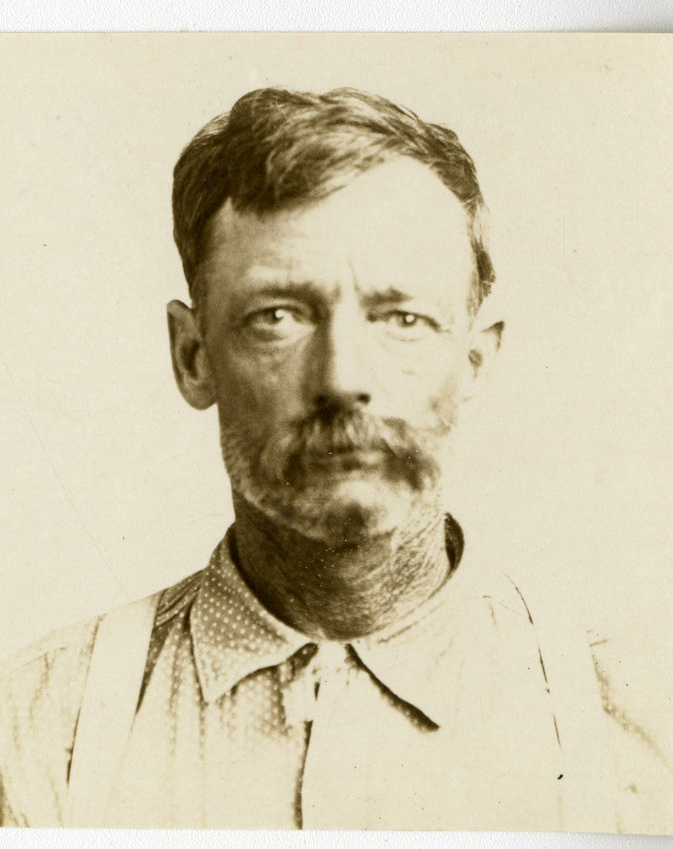

- Source: [National Archives catalog](https://catalog.archives.gov/id/117721521)
- Credit: U.S. Penitentiary, Leavenworth booking photograph; National Archives at Kansas City, Record Group 129, Inmate Case Files (series 571125), inmate 14229, catalog item 117721521.
- Identity: NARA individually catalogs this photograph as Photograph of John Shirey, inmate 14229. The name, Leavenworth record and wartime context identify the Oklahoma wartime conspiracy prisoner in the existing profile. The original photograph and available reverse were visually checked; the frontal view is on the right.
- Download: [original photograph](https://catalog.archives.gov/medialz/kansas-city/rg-129/571125/571125_14229-JohnShirey_001.jpg)
- Preserved original: [batch262-originals/571125_14229-JohnShirey_001.jpg](batch262-originals/571125_14229-JohnShirey_001.jpg)
- Crop box: `[673, 0, 1346, 849]` (left, top, exclusive right, exclusive bottom); original dimensions: `[1346, 849]`.
- Original SHA-256: `9aedb78887faacde7da16315e0ef510769c919e6c7e88272d7d593bde7b3ee84`
- Portrait SHA-256: `b370d4dae7ef4b1c3d584aee80d1055e6f1705d765fb3f4d9fbb061dc28caa67`
- Identifying reverse: [batch262-originals/571125_14229-JohnShirey_002.jpg](batch262-originals/571125_14229-JohnShirey_002.jpg)

## John Wallberg

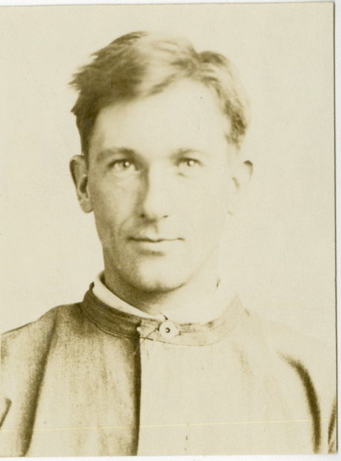

- Source: [National Archives catalog](https://catalog.archives.gov/id/160922125)
- Credit: U.S. Penitentiary, Leavenworth booking photograph; National Archives at Kansas City, Record Group 129, Inmate Case Files (series 571125), inmate 14821, catalog item 160922125.
- Identity: NARA individually catalogs this photograph as Photograph of John Wallberg, inmate 14821. The name, Leavenworth record and wartime context identify the IWW prisoner in the December 1919 Wichita/Kansas group in the existing profile. The original photograph and available reverse were visually checked; the frontal view is on the right.
- Download: [original photograph](https://catalog.archives.gov/medialz/kansas-city/rg-129/571125/571125_14821-JohnWallberg_001.jpg)
- Preserved original: [batch262-originals/571125_14821-JohnWallberg_001.jpg](batch262-originals/571125_14821-JohnWallberg_001.jpg)
- Crop box: `[682, 0, 1364, 921]` (left, top, exclusive right, exclusive bottom); original dimensions: `[1364, 921]`.
- Original SHA-256: `8afd789fa954886cf143aa4738dba27dc05968f8ee1c8dc5ebc37b448d66d7ac`
- Portrait SHA-256: `94537a81c7f3fe89e89dfc2ec3317a7e4e646f245fe2c6162846d6a516807218`
- Identifying reverse: [batch262-originals/571125_14821-JohnWallberg_002.jpg](batch262-originals/571125_14821-JohnWallberg_002.jpg)

## John Walsh

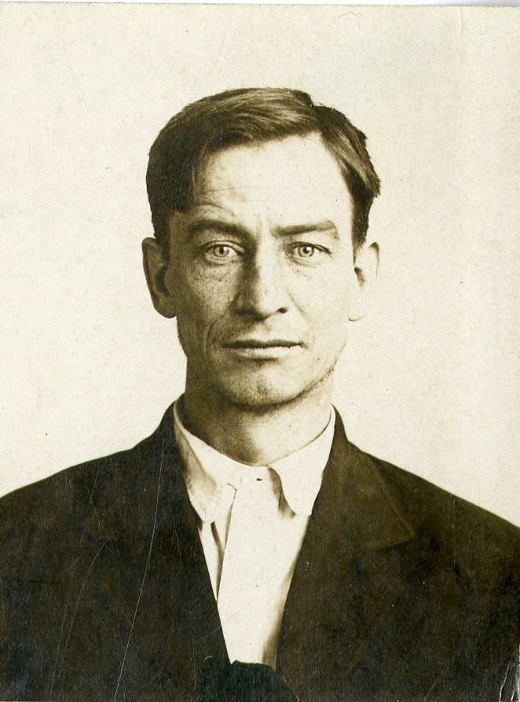

- Source: [National Archives catalog](https://catalog.archives.gov/id/117703363)
- Credit: U.S. Penitentiary, Leavenworth booking photograph; National Archives at Kansas City, Record Group 129, Inmate Case Files (series 571125), inmate 13147, catalog item 117703363.
- Identity: NARA individually catalogs this photograph as Photograph of John Walsh, inmate 13147. The name, Leavenworth record and wartime context identify the Chicago IWW prisoner in the existing profile. The original photograph and available reverse were visually checked; the frontal view is on the right. The IWW inmate roster reproduced by NARA on page 6 independently pairs this name with inmate 13147: https://www.archives.gov/files/kansas-city/press/newsletter/2017-october.pdf#page=6 .
- Download: [original photograph](https://catalog.archives.gov/medialz/kansas-city/rg-129/571125/571125_13147-JohnWalsh_001.jpg)
- Preserved original: [batch262-originals/571125_13147-JohnWalsh_001.jpg](batch262-originals/571125_13147-JohnWalsh_001.jpg)
- Crop box: `[662, 0, 1324, 893]` (left, top, exclusive right, exclusive bottom); original dimensions: `[1324, 893]`.
- Original SHA-256: `57642bac39b7d5c7d8d0378bde94e1e1772ac3f0cee357bfa6662c922a0b9787`
- Portrait SHA-256: `bbf8c8ca34eedf0a8eab310e881f98e2d9d99b522bda3a0b66ab7abfe58a5c23`
- Identifying reverse: [batch262-originals/571125_13147-JohnWalsh_002.jpg](batch262-originals/571125_13147-JohnWalsh_002.jpg)

## Joseph A. Oates

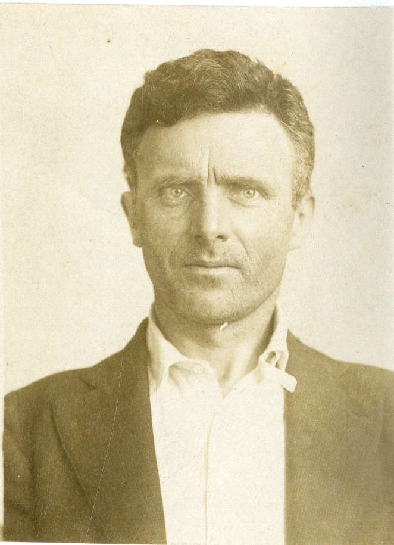

- Source: [National Archives catalog](https://catalog.archives.gov/id/117703421)
- Credit: U.S. Penitentiary, Leavenworth booking photograph; National Archives at Kansas City, Record Group 129, Inmate Case Files (series 571125), inmate 13172, catalog item 117703421.
- Identity: NARA individually catalogs this photograph as Photograph of Joseph A. Oates, inmate 13172. The name, Leavenworth record and wartime context identify the Chicago IWW prisoner in the existing profile. The original photograph and available reverse were visually checked; the frontal view is on the right. The IWW inmate roster reproduced by NARA on page 6 independently pairs this name with inmate 13172: https://www.archives.gov/files/kansas-city/press/newsletter/2017-october.pdf#page=6 .
- Download: [original photograph](https://catalog.archives.gov/medialz/kansas-city/rg-129/571125/571125_13172-JosephAOates_001.jpg)
- Preserved original: [batch262-originals/571125_13172-JosephAOates_001.jpg](batch262-originals/571125_13172-JosephAOates_001.jpg)
- Crop box: `[662, 0, 1324, 915]` (left, top, exclusive right, exclusive bottom); original dimensions: `[1324, 915]`.
- Original SHA-256: `91df4b045428c88bf52c5057bed73b39767f03454af47ff6236800ea0338f980`
- Portrait SHA-256: `5df0cc3009d24c6fd856684a539b22ced2944acb305aa0fe40e0397a12faa4f4`
- Identifying reverse: [batch262-originals/571125_13172-JosephAOates_002.jpg](batch262-originals/571125_13172-JosephAOates_002.jpg)

## Morris Hecht

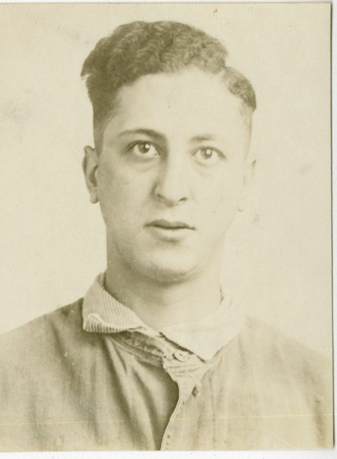

- Source: [National Archives catalog](https://catalog.archives.gov/id/160922098)
- Credit: U.S. Penitentiary, Leavenworth booking photograph; National Archives at Kansas City, Record Group 129, Inmate Case Files (series 571125), inmate 14810, catalog item 160922098.
- Identity: NARA individually catalogs this photograph as Photograph of Morris Hecht, inmate 14810. The name, Leavenworth record and wartime context identify the IWW prisoner in the December 1919 Wichita/Kansas group in the existing profile. The original photograph and available reverse were visually checked; the frontal view is on the right.
- Download: [original photograph](https://catalog.archives.gov/medialz/kansas-city/rg-129/571125/571125_14810-MorrisHecht_001.jpg)
- Preserved original: [batch262-originals/571125_14810-MorrisHecht_001.jpg](batch262-originals/571125_14810-MorrisHecht_001.jpg)
- Crop box: `[688, 0, 1376, 937]` (left, top, exclusive right, exclusive bottom); original dimensions: `[1376, 937]`.
- Original SHA-256: `aab645e870d841cb981d889c82d78263280579f66e4a85c4723b538e448fea1d`
- Portrait SHA-256: `af5dd12c84491df08c30c136eaaf6e31c758ac583fa777b6500779d0ea93a832`
- Identifying reverse: [batch262-originals/571125_14810-MorrisHecht_002.jpg](batch262-originals/571125_14810-MorrisHecht_002.jpg)

## Myron Sprague

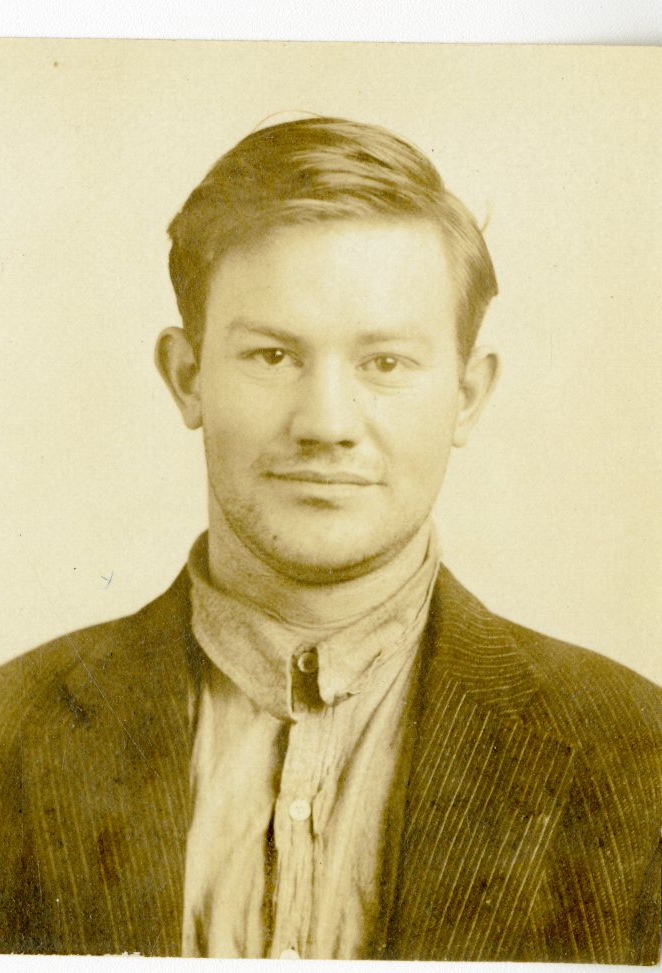

- Source: [National Archives catalog](https://catalog.archives.gov/id/117719362)
- Credit: U.S. Penitentiary, Leavenworth booking photograph; National Archives at Kansas City, Record Group 129, Inmate Case Files (series 571125), inmate 13581, catalog item 117719362.
- Identity: NARA individually catalogs this photograph as Photograph of Myron Sprague, inmate 13581. The name, Leavenworth record and wartime context identify the IWW prisoner held at Leavenworth after the Sacramento prosecution in the existing profile. The original photograph and available reverse were visually checked; the frontal view is on the right.
- Download: [original photograph](https://catalog.archives.gov/medialz/kansas-city/rg-129/571125/571125_13581-MyronSprague_001.jpg)
- Preserved original: [batch262-originals/571125_13581-MyronSprague_001.jpg](batch262-originals/571125_13581-MyronSprague_001.jpg)
- Crop box: `[662, 0, 1324, 973]` (left, top, exclusive right, exclusive bottom); original dimensions: `[1324, 973]`.
- Original SHA-256: `d8adede12bb3d87403b9a85384e2908d25f631728abdffa6ba3491f9b6c5f5ae`
- Portrait SHA-256: `1ae8e689ea539bf1d3886c60450b99a9cf631561d44b48e63aaee55235fdb448`
- Identifying reverse: [batch262-originals/571125_13581-MyronSprague_002.jpg](batch262-originals/571125_13581-MyronSprague_002.jpg)

## O. E. Gordon

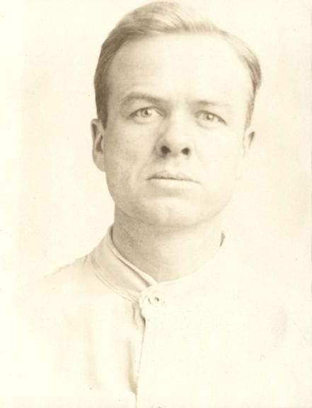

- Source: [National Archives catalog](https://catalog.archives.gov/id/28894495)
- Credit: U.S. Penitentiary, Leavenworth booking photograph; National Archives at Kansas City, Record Group 129, Inmate Case Files (series 571125), inmate 14805, catalog item 28894495.
- Identity: NARA individually catalogs this photograph as Photograph of O. E. Gordon, inmate 14805. The name, Leavenworth record and wartime context identify the IWW prisoner in the December 1919 Wichita/Kansas group in the existing profile. The original photograph and available reverse were visually checked; the frontal view is on the right.
- Download: [original photograph](https://catalog.archives.gov/medialz/kansas-city/rg-129/571125/14805_Gordon_O_E_001.jpg)
- Preserved original: [batch262-originals/14805_Gordon_O_E_001.jpg](batch262-originals/14805_Gordon_O_E_001.jpg)
- Crop box: `[440, 0, 881, 577]` (left, top, exclusive right, exclusive bottom); original dimensions: `[881, 577]`.
- Original SHA-256: `d52a7c98569d75790f68b0ad2ca7c3fe9ca57901c3ae7cfe3d7a3f993f37337a`
- Portrait SHA-256: `2eb4a4d1ded963088a473197a0332523cdee0d7cf7d655e0d90d189debf4f12f`
- Identifying reverse: [batch262-originals/28894487_14805-OEGordon_001.jpg](batch262-originals/28894487_14805-OEGordon_001.jpg)

## Obe Isenhouer

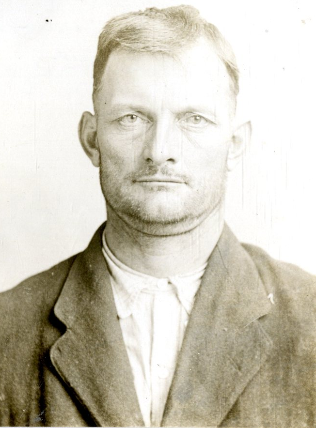

- Source: [National Archives catalog](https://catalog.archives.gov/id/83858431)
- Credit: U.S. Penitentiary, Leavenworth booking photograph; National Archives at Kansas City, Record Group 129, Inmate Case Files (series 571125), inmate 12003, catalog item 83858431.
- Identity: NARA individually catalogs this photograph as Photograph of Obe Isenhouer, inmate 12003. The name, Leavenworth record and wartime context identify the Oklahoma wartime conspiracy prisoner in the existing profile. The original photograph and available reverse were visually checked; the frontal view is on the right.
- Download: [original photograph](https://catalog.archives.gov/medialz/kansas-city/rg-129/571125/571125_12003-ObeIsenhouer_001.jpg)
- Preserved original: [batch262-originals/571125_12003-ObeIsenhouer_001.jpg](batch262-originals/571125_12003-ObeIsenhouer_001.jpg)
- Crop box: `[651, 0, 1303, 884]` (left, top, exclusive right, exclusive bottom); original dimensions: `[1303, 884]`.
- Original SHA-256: `c8036319b332e24fe93d25935a8cb3ebb594a311c6cebcf1f346abd7db5d7a25`
- Portrait SHA-256: `d4a88f23cbcc9fbd08ff185b1d91336eab2edcd1d1d13447a56e7bd1b44d34ba`
- Identifying reverse: [batch262-originals/571125_12003-ObeIsenhouer_002.jpg](batch262-originals/571125_12003-ObeIsenhouer_002.jpg)

## Olin B. Anderson

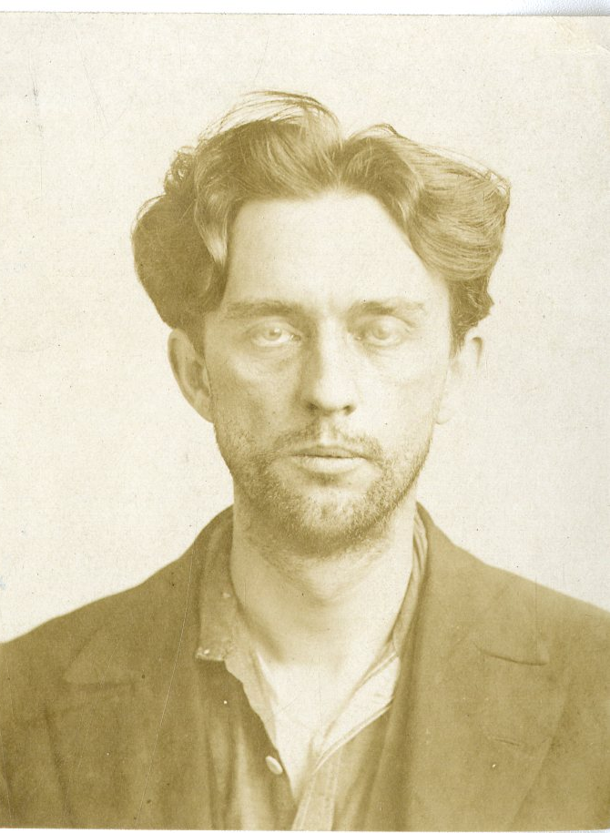

- Source: [National Archives catalog](https://catalog.archives.gov/id/117703369)
- Credit: U.S. Penitentiary, Leavenworth booking photograph; National Archives at Kansas City, Record Group 129, Inmate Case Files (series 571125), inmate 13149, catalog item 117703369.
- Identity: NARA individually catalogs this photograph as Photograph of Olin B. Anderson, inmate 13149. The name, Leavenworth record and wartime context identify the Chicago IWW prisoner in the existing profile. The original photograph and available reverse were visually checked; the frontal view is on the right. The IWW inmate roster reproduced by NARA on page 6 independently pairs this name with inmate 13149: https://www.archives.gov/files/kansas-city/press/newsletter/2017-october.pdf#page=6 .
- Download: [original photograph](https://catalog.archives.gov/medialz/kansas-city/rg-129/571125/571125_13149-OlinBAnderson_001.jpg)
- Preserved original: [batch262-originals/571125_13149-OlinBAnderson_001.jpg](batch262-originals/571125_13149-OlinBAnderson_001.jpg)
- Crop box: `[669, 0, 1339, 915]` (left, top, exclusive right, exclusive bottom); original dimensions: `[1339, 915]`.
- Original SHA-256: `c8a73e1088da39bc053ecb27b0324457781fe9b2db9b7d32014b742db398774c`
- Portrait SHA-256: `f976ebd3e1e59235f139a2f5d3989324fa8e4dc5b67a1b2d79504f032caeea96`
- Identifying reverse: [batch262-originals/571125_13149-OlinBAnderson_002.jpg](batch262-originals/571125_13149-OlinBAnderson_002.jpg)

## Paul Maihak

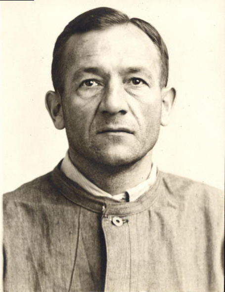

- Source: [National Archives catalog](https://catalog.archives.gov/id/28894497)
- Credit: U.S. Penitentiary, Leavenworth booking photograph; National Archives at Kansas City, Record Group 129, Inmate Case Files (series 571125), inmate 14824, catalog item 28894497.
- Identity: NARA individually catalogs this photograph as Photograph of Paul Maihak, inmate 14824. The name, Leavenworth record and wartime context identify the IWW prisoner in the December 1919 Wichita/Kansas group in the existing profile. The original photograph and available reverse were visually checked; the frontal view is on the right.
- Download: [original photograph](https://catalog.archives.gov/medialz/kansas-city/rg-129/571125/placeholder.jpg)
- Preserved original: [batch262-originals/placeholder.jpg](batch262-originals/placeholder.jpg)
- Crop box: `[454, 0, 909, 591]` (left, top, exclusive right, exclusive bottom); original dimensions: `[909, 591]`.
- Original SHA-256: `f4a934b25000d7c71f250bf039f5d02ed9a04ff376c38a4150764b9257e856f4`
- Portrait SHA-256: `a397613f0099cdbfef7d5f4089ccedd793aee307aebf91c47744b115319fae24`
- Identifying reverse: [batch262-originals/28894489_14824-PaulMaihak_001.jpg](batch262-originals/28894489_14824-PaulMaihak_001.jpg)

## Pete McEvoy

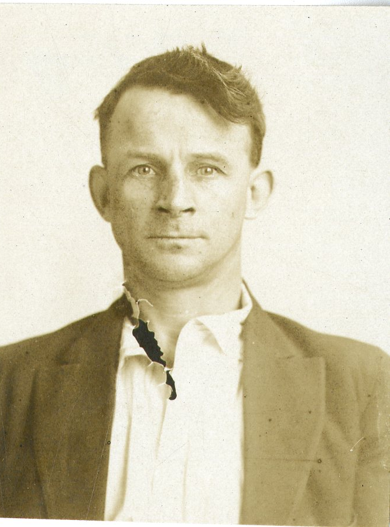

- Source: [National Archives catalog](https://catalog.archives.gov/id/117703415)
- Credit: U.S. Penitentiary, Leavenworth booking photograph; National Archives at Kansas City, Record Group 129, Inmate Case Files (series 571125), inmate 13170, catalog item 117703415.
- Identity: NARA individually catalogs this photograph as Photograph of Pete McEvoy, inmate 13170. The name, Leavenworth record and wartime context identify the Chicago IWW prisoner in the existing profile. The original photograph and available reverse were visually checked; the frontal view is on the right. The IWW inmate roster reproduced by NARA on page 6 independently pairs this name with inmate 13170: https://www.archives.gov/files/kansas-city/press/newsletter/2017-october.pdf#page=6 .
- Download: [original photograph](https://catalog.archives.gov/medialz/kansas-city/rg-129/571125/571125_13170-PeteMcEvoy_001.jpg)
- Preserved original: [batch262-originals/571125_13170-PeteMcEvoy_001.jpg](batch262-originals/571125_13170-PeteMcEvoy_001.jpg)
- Crop box: `[666, 0, 1332, 900]` (left, top, exclusive right, exclusive bottom); original dimensions: `[1332, 900]`.
- Original SHA-256: `2d6ae72ace6de97bb63d1ee2460eb6843122087b262642fd509fcd4eca61fcd7`
- Portrait SHA-256: `eb15f1f8bf6668e7723001b2a0682e31c1ce8c89f291062457b4f8e4c348c485`
- Identifying reverse: [batch262-originals/571125_13170-PeteMcEvoy_002.jpg](batch262-originals/571125_13170-PeteMcEvoy_002.jpg)

## Peter Green

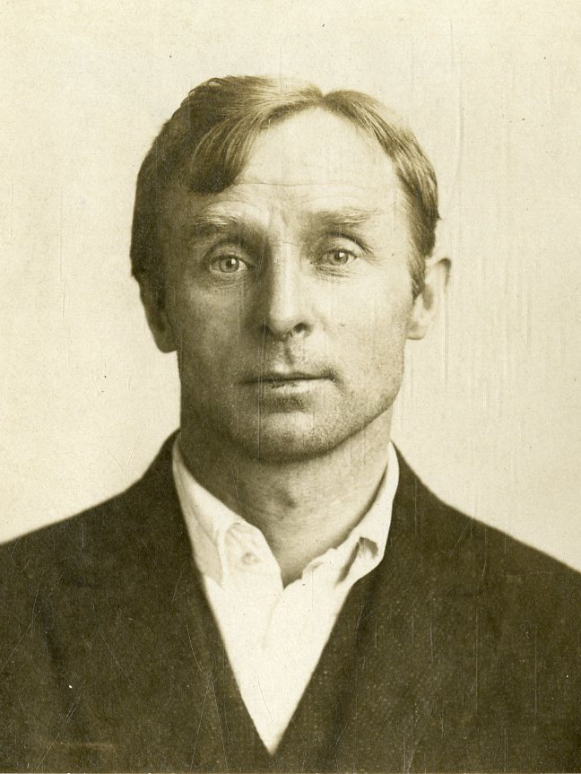

- Source: [National Archives catalog](https://catalog.archives.gov/id/117703312)
- Credit: U.S. Penitentiary, Leavenworth booking photograph; National Archives at Kansas City, Record Group 129, Inmate Case Files (series 571125), inmate 13127, catalog item 117703312.
- Identity: NARA individually catalogs this photograph as Photograph of Peter Green, inmate 13127. The name, Leavenworth record and wartime context identify the Chicago IWW prisoner in the existing profile. The original photograph and available reverse were visually checked; the frontal view is on the right. The IWW inmate roster reproduced by NARA on page 6 independently pairs this name with inmate 13127: https://www.archives.gov/files/kansas-city/press/newsletter/2017-october.pdf#page=6 .
- Download: [original photograph](https://catalog.archives.gov/medialz/kansas-city/rg-129/571125/571125_13127-PeterGreen_001.jpg)
- Preserved original: [batch262-originals/571125_13127-PeterGreen_001.jpg](batch262-originals/571125_13127-PeterGreen_001.jpg)
- Crop box: `[647, 0, 1295, 863]` (left, top, exclusive right, exclusive bottom); original dimensions: `[1295, 863]`.
- Original SHA-256: `8d8aa080e048a69a4d83eacd9059b53eaef2cb60ec92eeee472fff09e4113b8e`
- Portrait SHA-256: `3c78e46717a5239833591aac19df0c2901ea707a159eede79f4b7030220837f1`
- Identifying reverse: [batch262-originals/571125_13127-PeterGreen_002.jpg](batch262-originals/571125_13127-PeterGreen_002.jpg)

## Phil McLaughlin

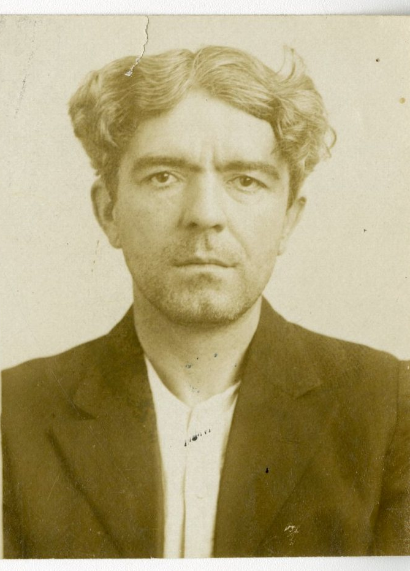

- Source: [National Archives catalog](https://catalog.archives.gov/id/117719342)
- Credit: U.S. Penitentiary, Leavenworth booking photograph; National Archives at Kansas City, Record Group 129, Inmate Case Files (series 571125), inmate 13575, catalog item 117719342.
- Identity: NARA individually catalogs this photograph as Photograph of Phil McLaughlin, inmate 13575. The name, Leavenworth record and wartime context identify the IWW prisoner held at Leavenworth after the Sacramento prosecution in the existing profile. The original photograph and available reverse were visually checked; the frontal view is on the right.
- Download: [original photograph](https://catalog.archives.gov/medialz/kansas-city/rg-129/571125/571125_13575-PhilMcLaughlin_001.jpg)
- Preserved original: [batch262-originals/571125_13575-PhilMcLaughlin_001.jpg](batch262-originals/571125_13575-PhilMcLaughlin_001.jpg)
- Crop box: `[668, 0, 1337, 931]` (left, top, exclusive right, exclusive bottom); original dimensions: `[1337, 931]`.
- Original SHA-256: `150f6d16bc3f3a27f012252b547566e7ebc06661dda049a2f532c13db768c98d`
- Portrait SHA-256: `15ba41555ae1182be6c1b9d2a90d8eec63c6d8311fe9cf7ca371d4594bc2856a`
- Identifying reverse: [batch262-originals/571125_13575-PhilMcLaughlin_002.jpg](batch262-originals/571125_13575-PhilMcLaughlin_002.jpg)

## Pietro Nigra

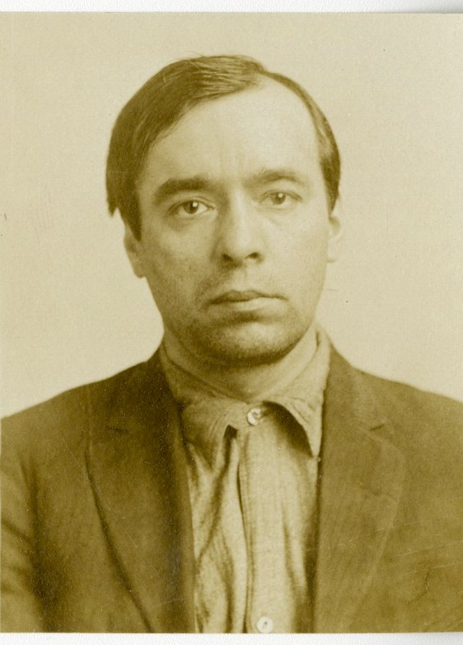

- Source: [National Archives catalog](https://catalog.archives.gov/id/117719759)
- Credit: U.S. Penitentiary, Leavenworth booking photograph; National Archives at Kansas City, Record Group 129, Inmate Case Files (series 571125), inmate 13704, catalog item 117719759.
- Identity: NARA individually catalogs this photograph as Photograph of Pietro Nigra, inmate 13704. The name, Leavenworth record and wartime context identify the Chicago IWW defendant who served several intervals at Leavenworth in the existing profile. The original photograph and available reverse were visually checked; the frontal view is on the right.
- Download: [original photograph](https://catalog.archives.gov/medialz/kansas-city/rg-129/571125/571125_13704-PietroNigra_001.jpg)
- Preserved original: [batch262-originals/571125_13704-PietroNigra_001.jpg](batch262-originals/571125_13704-PietroNigra_001.jpg)
- Crop box: `[668, 0, 1336, 929]` (left, top, exclusive right, exclusive bottom); original dimensions: `[1336, 929]`.
- Original SHA-256: `b39726ead003fd974f4ddf9b8979d38996707c27c055d2f56b7249999fba608b`
- Portrait SHA-256: `c8919b54e493429ed0fbe3b8ee08af09829afaced52b7a004fa77f350cff00a6`
- Identifying reverse: [batch262-originals/571125_13704-PietroNigra_002.jpg](batch262-originals/571125_13704-PietroNigra_002.jpg)

## Robert Connellan

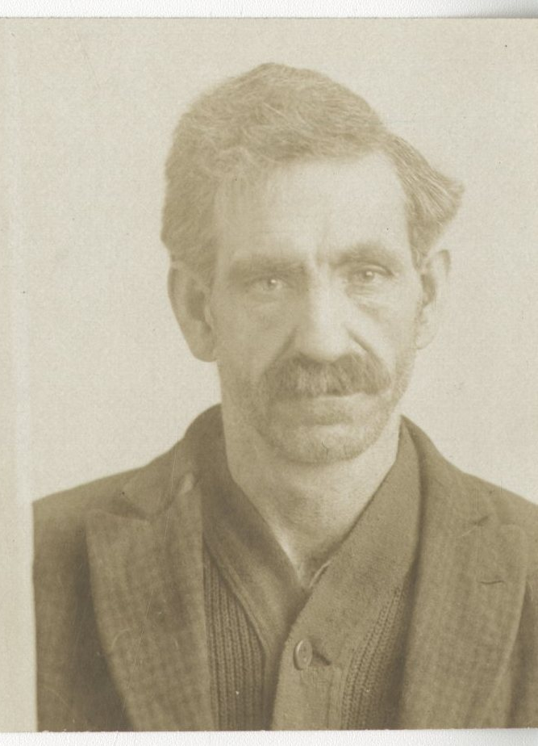

- Source: [National Archives catalog](https://catalog.archives.gov/id/117719307)
- Credit: U.S. Penitentiary, Leavenworth booking photograph; National Archives at Kansas City, Record Group 129, Inmate Case Files (series 571125), inmate 13563, catalog item 117719307.
- Identity: NARA individually catalogs this photograph as Photograph of Robert Connellan, inmate 13563. The name, Leavenworth record and wartime context identify the IWW prisoner held at Leavenworth after the Sacramento prosecution in the existing profile. The original photograph and available reverse were visually checked; the frontal view is on the right.
- Download: [original photograph](https://catalog.archives.gov/medialz/kansas-city/rg-129/571125/571125_13563-RobertConnellan_001.jpg)
- Preserved original: [batch262-originals/571125_13563-RobertConnellan_001.jpg](batch262-originals/571125_13563-RobertConnellan_001.jpg)
- Crop box: `[667, 0, 1334, 924]` (left, top, exclusive right, exclusive bottom); original dimensions: `[1334, 924]`.
- Original SHA-256: `b150348f135e086477d1b10606ac531deeda3193c8d5f66e6d2496837c45fde6`
- Portrait SHA-256: `ea4b5d7a0102eb82ccfba6c0d0da45db636d84fbc3cd03941100301467d2db6c`
- Identifying reverse: [batch262-originals/571125_13563-RobertConnellan_002.jpg](batch262-originals/571125_13563-RobertConnellan_002.jpg)

## Robert Feehan

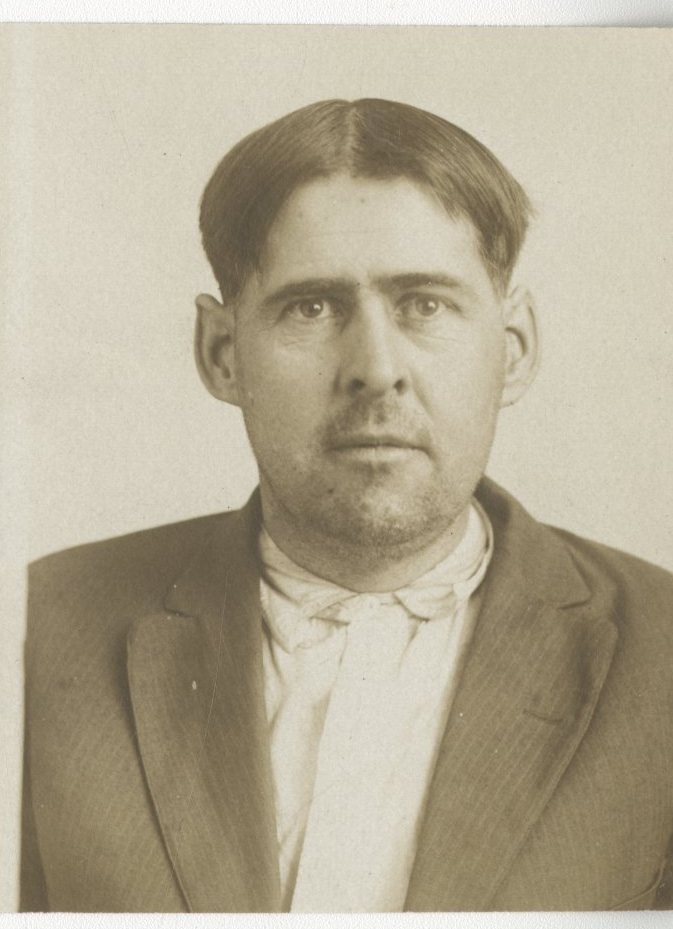

- Source: [National Archives catalog](https://catalog.archives.gov/id/117719383)
- Credit: U.S. Penitentiary, Leavenworth booking photograph; National Archives at Kansas City, Record Group 129, Inmate Case Files (series 571125), inmate 13588, catalog item 117719383.
- Identity: NARA individually catalogs this photograph as Photograph of Robert Feehan, inmate 13588. The name, Leavenworth record and wartime context identify the IWW prisoner held at Leavenworth after the Sacramento prosecution in the existing profile. The original photograph and available reverse were visually checked; the frontal view is on the right.
- Download: [original photograph](https://catalog.archives.gov/medialz/kansas-city/rg-129/571125/571125_13588-RobertFeehan_001.jpg)
- Preserved original: [batch262-originals/571125_13588-RobertFeehan_001.jpg](batch262-originals/571125_13588-RobertFeehan_001.jpg)
- Crop box: `[672, 0, 1345, 929]` (left, top, exclusive right, exclusive bottom); original dimensions: `[1345, 929]`.
- Original SHA-256: `ce85c0b52d0adb6d87919fda8cb562c697b896870ecaa53b82114b5131c3c05f`
- Portrait SHA-256: `7a2510920c4bd99e99e3692e3c14286e95c02cf214e1a6cab0b0bb88c50b939e`
- Identifying reverse: [batch262-originals/571125_13588-RobertFeehan_002.jpg](batch262-originals/571125_13588-RobertFeehan_002.jpg)

## Robert Harden

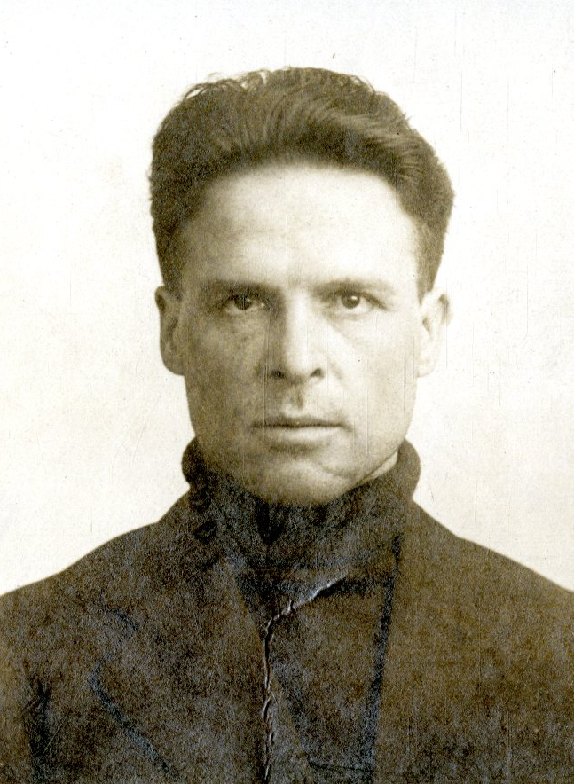

- Source: [National Archives catalog](https://catalog.archives.gov/id/83859919)
- Credit: U.S. Penitentiary, Leavenworth booking photograph; National Archives at Kansas City, Record Group 129, Inmate Case Files (series 571125), inmate 12496, catalog item 83859919.
- Identity: NARA individually catalogs this photograph as Photograph of Robert Harden, inmate 12496. The name, Leavenworth record and wartime context identify the Duluth IWW prisoner convicted of threatening the president in the existing profile. The original photograph and available reverse were visually checked; the frontal view is on the right.
- Download: [original photograph](https://catalog.archives.gov/medialz/kansas-city/rg-129/571125/571125_12496-RobertHarden_001.jpg)
- Preserved original: [batch262-originals/571125_12496-RobertHarden_001.jpg](batch262-originals/571125_12496-RobertHarden_001.jpg)
- Crop box: `[646, 0, 1293, 884]` (left, top, exclusive right, exclusive bottom); original dimensions: `[1293, 884]`.
- Original SHA-256: `3d3d1ec62fa9b94fc11a8dc01705f65450c8889661ad5ef2b616d6b755976ac5`
- Portrait SHA-256: `069f5ef7ae637f3ccbbfa39b8d6f6b67c85ab524943dad4eaadcda10f2e4bdf3`
- Identifying reverse: [batch262-originals/571125_12496-RobertHarden_002.jpg](batch262-originals/571125_12496-RobertHarden_002.jpg)

## Robert Poe

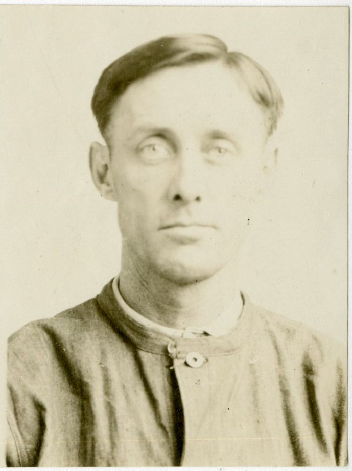

- Source: [National Archives catalog](https://catalog.archives.gov/id/160922122)
- Credit: U.S. Penitentiary, Leavenworth booking photograph; National Archives at Kansas City, Record Group 129, Inmate Case Files (series 571125), inmate 14820, catalog item 160922122.
- Identity: NARA individually catalogs this photograph as Photograph of Robert Poe, inmate 14820. The name, Leavenworth record and wartime context identify the IWW prisoner in the December 1919 Wichita/Kansas group in the existing profile. The original photograph and available reverse were visually checked; the frontal view is on the right.
- Download: [original photograph](https://catalog.archives.gov/medialz/kansas-city/rg-129/571125/571125_14820-RobertPoe_001.jpg)
- Preserved original: [batch262-originals/571125_14820-RobertPoe_001.jpg](batch262-originals/571125_14820-RobertPoe_001.jpg)
- Crop box: `[689, 0, 1378, 923]` (left, top, exclusive right, exclusive bottom); original dimensions: `[1378, 923]`.
- Original SHA-256: `5fe1dd328b80dd19a71e04e0003a9347c79744cf220e59dbb176b308d09a7be0`
- Portrait SHA-256: `c9a25860eddb85de3c4af53e430a7052de7c0e435aec41fd75da7349ef838959`
- Identifying reverse: [batch262-originals/571125_14820-RobertPoe_002.jpg](batch262-originals/571125_14820-RobertPoe_002.jpg)

## Roy Crane

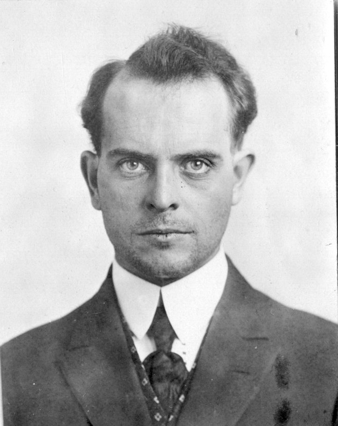

- Source: [National Archives catalog](https://catalog.archives.gov/id/7861615)
- Credit: U.S. Penitentiary, Leavenworth booking photograph; National Archives at Kansas City, Record Group 129, Inmate Case Files (series 571125), inmate 12028, catalog item 7861615.
- Identity: NARA individually catalogs this photograph as Photograph of Roy Crane, inmate 12028. The name, Leavenworth record and wartime context identify the Oklahoma wartime conspiracy prisoner in the existing profile. The original photograph and available reverse were visually checked; the frontal view is on the right.
- Download: [original photograph](https://catalog.archives.gov/medialive/15/8616/7861615/content/arcmedia/central-plains/kansas-city/571125/12028-Roy_Crane_a.jpg)
- Preserved original: [batch262-originals/12028-Roy_Crane_a.jpg](batch262-originals/12028-Roy_Crane_a.jpg)
- Crop box: `[661, 0, 1322, 832]` (left, top, exclusive right, exclusive bottom); original dimensions: `[1322, 832]`.
- Original SHA-256: `2a5d3b5d82394f3e9fdc6eb50c93dd1bbf9823d0d1408efa3b0e72573c99445e`
- Portrait SHA-256: `c65da995d5ee407f4ef9adced44c23e6c53ff6200be8dc491bbfc61c1f58aee0`
- Identifying reverse: [batch262-originals/7861615_12028-RoyCrane_002.jpg](batch262-originals/7861615_12028-RoyCrane_002.jpg)

## S. J. Powell

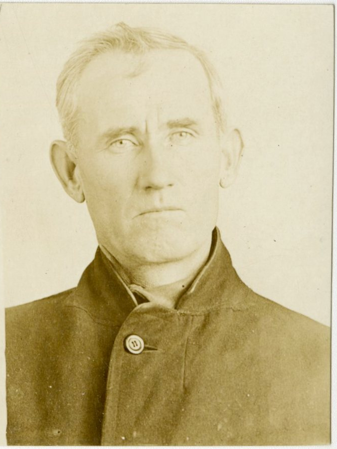

- Source: [National Archives catalog](https://catalog.archives.gov/id/160921966)
- Credit: U.S. Penitentiary, Leavenworth booking photograph; National Archives at Kansas City, Record Group 129, Inmate Case Files (series 571125), inmate 14765, catalog item 160921966.
- Identity: NARA individually catalogs this photograph as Photograph of S. J. Powell, inmate 14765. The name, Leavenworth record and wartime context identify the Texas Farmers and Laborers Protective Association prisoner in the existing profile. The original photograph and available reverse were visually checked; the frontal view is on the right.
- Download: [original photograph](https://catalog.archives.gov/medialz/kansas-city/rg-129/571125/571125_14765-SJPowell_001.jpg)
- Preserved original: [batch262-originals/571125_14765-SJPowell_001.jpg](batch262-originals/571125_14765-SJPowell_001.jpg)
- Crop box: `[669, 0, 1339, 894]` (left, top, exclusive right, exclusive bottom); original dimensions: `[1339, 894]`.
- Original SHA-256: `fab60ff71c02a12ba184e0398b1556117c3c22b27bce73f4615d3a79504f58db`
- Portrait SHA-256: `6edc9e43765f765d0e51ee213e8bb39c8dedbcfed947b03f5937949302ff915c`
- Identifying reverse: [batch262-originals/571125_14765-SJPowell_002.jpg](batch262-originals/571125_14765-SJPowell_002.jpg)

## Sam Forbes

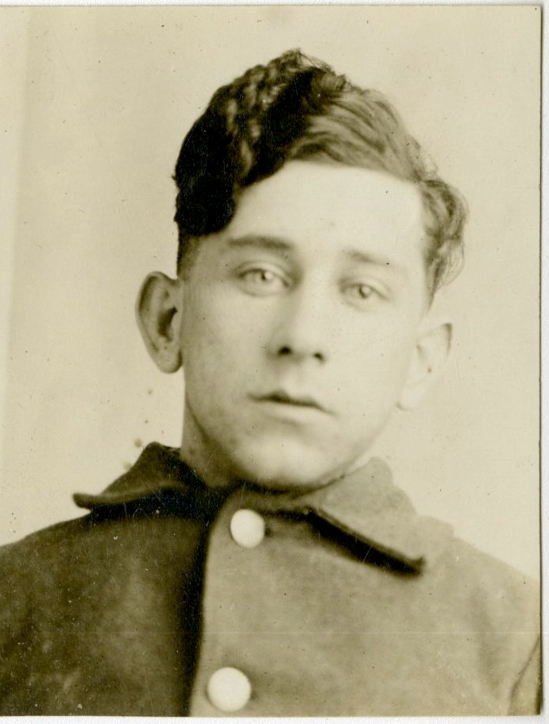

- Source: [National Archives catalog](https://catalog.archives.gov/id/160922095)
- Credit: U.S. Penitentiary, Leavenworth booking photograph; National Archives at Kansas City, Record Group 129, Inmate Case Files (series 571125), inmate 14809, catalog item 160922095.
- Identity: NARA individually catalogs this photograph as Photograph of Sam Forbes, inmate 14809. The name, Leavenworth record and wartime context identify the IWW prisoner in the December 1919 Wichita/Kansas group in the existing profile. The original photograph and available reverse were visually checked; the frontal view is on the right.
- Download: [original photograph](https://catalog.archives.gov/medialz/kansas-city/rg-129/571125/571125_14809-SamForbes_001.jpg)
- Preserved original: [batch262-originals/571125_14809-SamForbes_001.jpg](batch262-originals/571125_14809-SamForbes_001.jpg)
- Crop box: `[690, 0, 1381, 911]` (left, top, exclusive right, exclusive bottom); original dimensions: `[1381, 911]`.
- Original SHA-256: `f124f7852bee90481761d0d61fff7e1562b3dfd4ca1bac8a7a26c3d465180b50`
- Portrait SHA-256: `3b0f5f9763b20a3e5f440b7edc300ecdbc9a1ee3c4d848e66ae4ebe9f8571f3d`
- Identifying reverse: [batch262-originals/571125_14809-SamForbes_002.jpg](batch262-originals/571125_14809-SamForbes_002.jpg)

## Stanley J. Clark

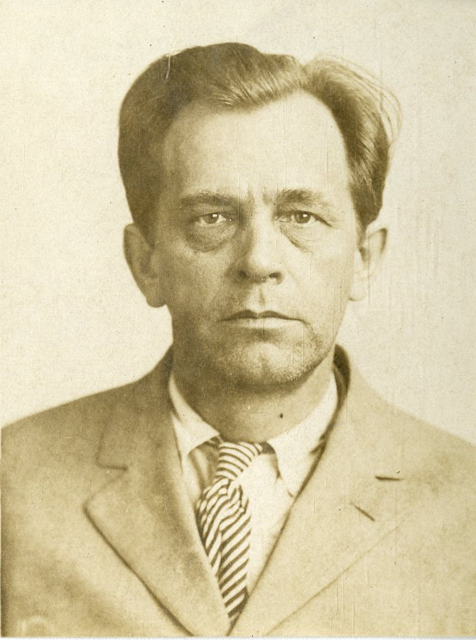

- Source: [National Archives catalog](https://catalog.archives.gov/id/117703292)
- Credit: U.S. Penitentiary, Leavenworth booking photograph; National Archives at Kansas City, Record Group 129, Inmate Case Files (series 571125), inmate 13121, catalog item 117703292.
- Identity: NARA individually catalogs this photograph as Photograph of Stanley J. Clark, inmate 13121. The name, Leavenworth record and wartime context identify the Chicago IWW prisoner in the existing profile. The original photograph and available reverse were visually checked; the frontal view is on the right. The IWW inmate roster reproduced by NARA on page 6 independently pairs this name with inmate 13121: https://www.archives.gov/files/kansas-city/press/newsletter/2017-october.pdf#page=6 .
- Download: [original photograph](https://catalog.archives.gov/medialz/kansas-city/rg-129/571125/571125_13121-StanleyJClark_001.jpg)
- Preserved original: [batch262-originals/571125_13121-StanleyJClark_001.jpg](batch262-originals/571125_13121-StanleyJClark_001.jpg)
- Crop box: `[669, 0, 1339, 900]` (left, top, exclusive right, exclusive bottom); original dimensions: `[1339, 900]`.
- Original SHA-256: `f691f490ea132614f539218a8bdc230b8b610bf3b79d97d1f428a8b41f573dcf`
- Portrait SHA-256: `231d361e81b2d784adf84d645eaedf5f37c512c2c9bd30e625259f349af5c6ad`
- Identifying reverse: [batch262-originals/571125_13121-StanleyJClark_002.jpg](batch262-originals/571125_13121-StanleyJClark_002.jpg)

## T. A. Harris

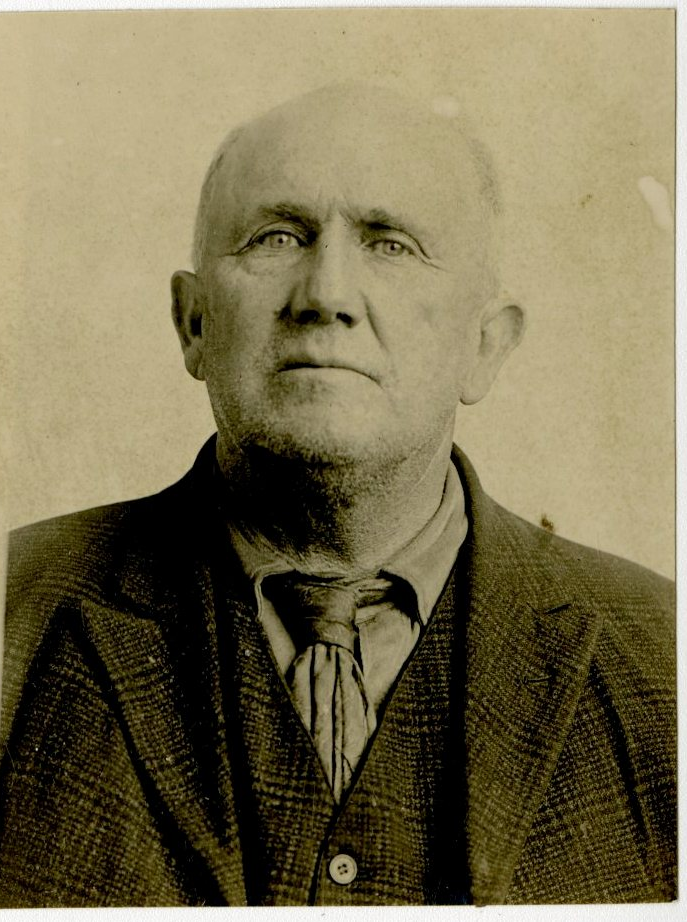

- Source: [National Archives catalog](https://catalog.archives.gov/id/160923281)
- Credit: U.S. Penitentiary, Leavenworth booking photograph; National Archives at Kansas City, Record Group 129, Inmate Case Files (series 571125), inmate 15122, catalog item 160923281.
- Identity: NARA individually catalogs this photograph as Photograph of T. A. Harris, inmate 15122. The name, Leavenworth record and wartime context identify the Oklahoma Universal Union prisoner in the existing profile. The original photograph and available reverse were visually checked; the frontal view is on the right.
- Download: [original photograph](https://catalog.archives.gov/medialz/kansas-city/rg-129/571125/571125_15122-TAHarris_001.jpg)
- Preserved original: [batch262-originals/571125_15122-TAHarris_001.jpg](batch262-originals/571125_15122-TAHarris_001.jpg)
- Crop box: `[686, 0, 1373, 922]` (left, top, exclusive right, exclusive bottom); original dimensions: `[1373, 922]`.
- Original SHA-256: `7bafb6ee0c15b9843038836efe0bf3f72f98018ef995a00c26d176333a407581`
- Portrait SHA-256: `6c22305c57a86c57dfae5203b00edcc94daa9810c22e8aa1afd209f075f9813e`
- Identifying reverse: [batch262-originals/571125_15122-TAHarris_002.jpg](batch262-originals/571125_15122-TAHarris_002.jpg)

## Ted Fraser

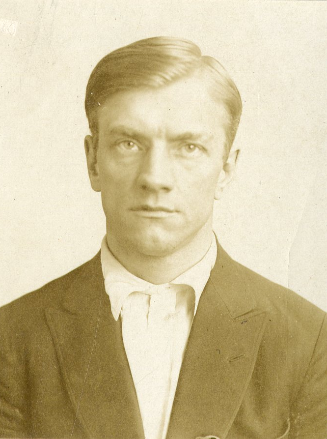

- Source: [National Archives catalog](https://catalog.archives.gov/id/7861621)
- Credit: U.S. Penitentiary, Leavenworth booking photograph; National Archives at Kansas City, Record Group 129, Inmate Case Files (series 571125), inmate 13155, catalog item 7861621.
- Identity: NARA individually catalogs this photograph as Photograph of Ted Fraser, inmate 13155. The name, Leavenworth record and wartime context identify the Chicago IWW prisoner in the existing profile. The original photograph and available reverse were visually checked; the frontal view is on the right. The IWW inmate roster reproduced by NARA on page 6 independently pairs this name with inmate 13155: https://www.archives.gov/files/kansas-city/press/newsletter/2017-october.pdf#page=6 .
- Download: [original photograph](https://catalog.archives.gov/medialz/kansas-city/rg-129/571125/7861621_13155-TedFraser_001.jpg)
- Preserved original: [batch262-originals/7861621_13155-TedFraser_001.jpg](batch262-originals/7861621_13155-TedFraser_001.jpg)
- Crop box: `[666, 0, 1332, 893]` (left, top, exclusive right, exclusive bottom); original dimensions: `[1332, 893]`.
- Original SHA-256: `3d467c9335893fadae0c9022f103d2cf941a1cc44eb429db029991f13cd6c519`
- Portrait SHA-256: `96201d625f0a14176c0fac5cba8ec4278b1ec62b06ca8f0cb6469df81107df7f`
- Identifying reverse: [batch262-originals/7861621_13155-TedFraser_002.jpg](batch262-originals/7861621_13155-TedFraser_002.jpg)

## Tobe Simons

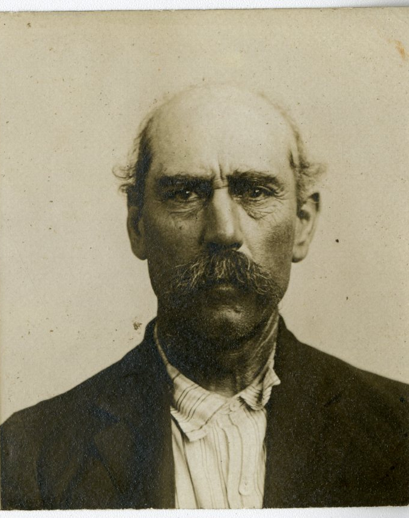

- Source: [National Archives catalog](https://catalog.archives.gov/id/117721530)
- Credit: U.S. Penitentiary, Leavenworth booking photograph; National Archives at Kansas City, Record Group 129, Inmate Case Files (series 571125), inmate 14230, catalog item 117721530.
- Identity: NARA individually catalogs this photograph as Photograph of Tobe Simons, inmate 14230. The name, Leavenworth record and wartime context identify the Oklahoma wartime conspiracy prisoner in the existing profile. The original photograph and available reverse were visually checked; the frontal view is on the right.
- Download: [original photograph](https://catalog.archives.gov/medialz/kansas-city/rg-129/571125/571125_14230-TobeSimons_001.jpg)
- Preserved original: [batch262-originals/571125_14230-TobeSimons_001.jpg](batch262-originals/571125_14230-TobeSimons_001.jpg)
- Crop box: `[680, 0, 1361, 863]` (left, top, exclusive right, exclusive bottom); original dimensions: `[1361, 863]`.
- Original SHA-256: `faf00a0f662671723285218cd25ee67e060518446f533af8dce67dcfae812e0c`
- Portrait SHA-256: `a30eb18ed0830b00757bfbad236ae07056295f676df3e36fae5617a2f4c6916e`
- Identifying reverse: [batch262-originals/571125_14230-TobeSimons_002.jpg](batch262-originals/571125_14230-TobeSimons_002.jpg)

## V. V. O'Hare

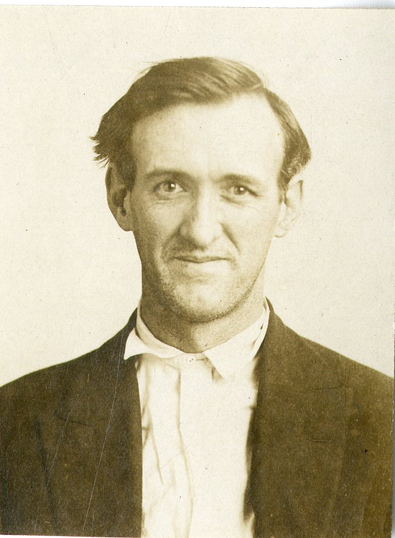

- Source: [National Archives catalog](https://catalog.archives.gov/id/117703424)
- Credit: U.S. Penitentiary, Leavenworth booking photograph; National Archives at Kansas City, Record Group 129, Inmate Case Files (series 571125), inmate 13173, catalog item 117703424.
- Identity: NARA individually catalogs this photograph as Photograph of V. V. O'Hare, inmate 13173. The name, Leavenworth record and wartime context identify the Chicago IWW prisoner in the existing profile. The original photograph and available reverse were visually checked; the frontal view is on the right. The IWW inmate roster reproduced by NARA on page 6 independently pairs this name with inmate 13173: https://www.archives.gov/files/kansas-city/press/newsletter/2017-october.pdf#page=6 .
- Download: [original photograph](https://catalog.archives.gov/medialz/kansas-city/rg-129/571125/571125_13173-VVOHare_001.jpg)
- Preserved original: [batch262-originals/571125_13173-VVOHare_001.jpg](batch262-originals/571125_13173-VVOHare_001.jpg)
- Crop box: `[662, 0, 1324, 900]` (left, top, exclusive right, exclusive bottom); original dimensions: `[1324, 900]`.
- Original SHA-256: `dbae974eacb22c47653bba6e681950cdcdd76c4e5e6eaaa85628561319121483`
- Portrait SHA-256: `49bd899bd29ab57bc85acc5459205a61598c4fb870398906b9f4a45e2f05b744`
- Identifying reverse: [batch262-originals/571125_13173-VVOHare_002.jpg](batch262-originals/571125_13173-VVOHare_002.jpg)

## Victor Privat

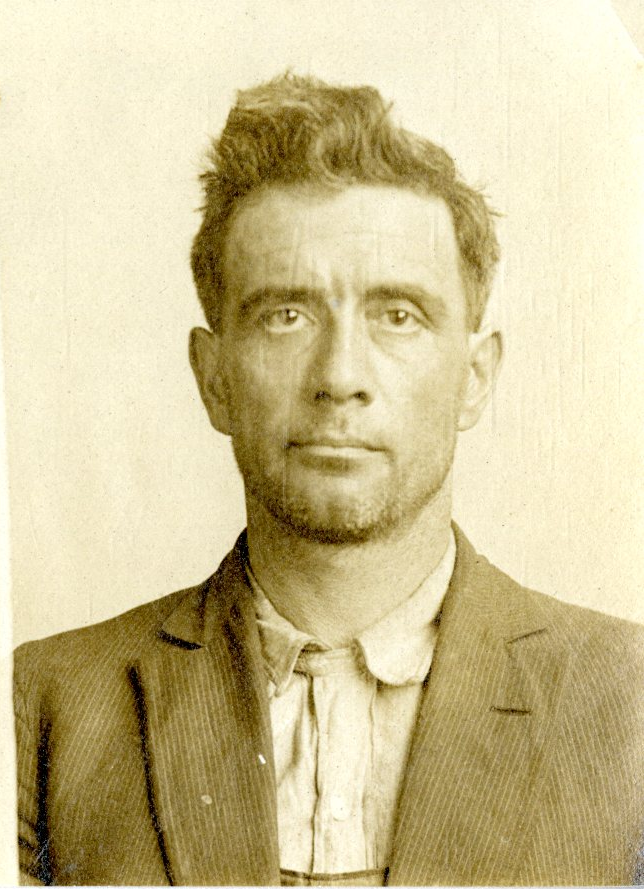

- Source: [National Archives catalog](https://catalog.archives.gov/id/83859347)
- Credit: U.S. Penitentiary, Leavenworth booking photograph; National Archives at Kansas City, Record Group 129, Inmate Case Files (series 571125), inmate 12320, catalog item 83859347.
- Identity: NARA individually catalogs this photograph as Photograph of Victor Privat, inmate 12320. The name, Leavenworth record and wartime context identify the wartime prisoner from Ketchum, Oklahoma in the existing profile. The original photograph and available reverse were visually checked; the frontal view is on the right.
- Download: [original photograph](https://catalog.archives.gov/medialz/kansas-city/rg-129/571125/571125_12320-VictorPrivat_001.jpg)
- Preserved original: [batch262-originals/571125_12320-VictorPrivat_001.jpg](batch262-originals/571125_12320-VictorPrivat_001.jpg)
- Crop box: `[643, 0, 1287, 889]` (left, top, exclusive right, exclusive bottom); original dimensions: `[1287, 889]`.
- Original SHA-256: `2cc31f0dfb17397c2d41c86d483c6db7ecf0a682e4fb44d5ce6a8d466cd601e1`
- Portrait SHA-256: `271b625c784e0a3550ccab7ff42a0ce65beabef81ee658e1e0646596a46992e3`
- Identifying reverse: [batch262-originals/571125_12320-VictorPrivat_002.jpg](batch262-originals/571125_12320-VictorPrivat_002.jpg)

## Vincent Santilli

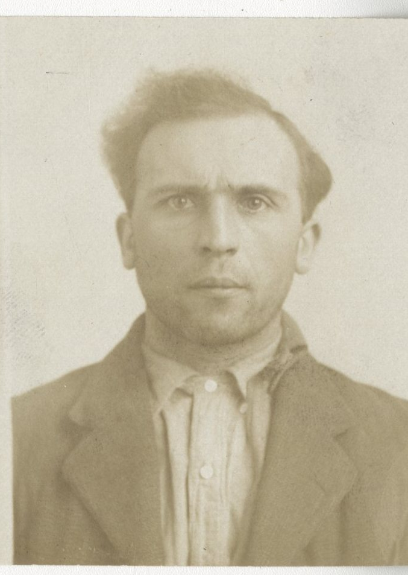

- Source: [National Archives catalog](https://catalog.archives.gov/id/117719359)
- Credit: U.S. Penitentiary, Leavenworth booking photograph; National Archives at Kansas City, Record Group 129, Inmate Case Files (series 571125), inmate 13580, catalog item 117719359.
- Identity: NARA individually catalogs this photograph as Photograph of Vincent Santilli, inmate 13580. The name, Leavenworth record and wartime context identify the IWW prisoner held at Leavenworth after the Sacramento prosecution in the existing profile. The original photograph and available reverse were visually checked; the frontal view is on the right.
- Download: [original photograph](https://catalog.archives.gov/medialz/kansas-city/rg-129/571125/571125_13580-VincentSantilli_001.jpg)
- Preserved original: [batch262-originals/571125_13580-VincentSantilli_001.jpg](batch262-originals/571125_13580-VincentSantilli_001.jpg)
- Crop box: `[676, 0, 1353, 953]` (left, top, exclusive right, exclusive bottom); original dimensions: `[1353, 953]`.
- Original SHA-256: `58b3b834109a84151613d5bc11f57acdd30c5fe828a1e0e480f2ed70ce535110`
- Portrait SHA-256: `ea91b1237127dc3c638f53373f555fd129056fa293dc494284a60683b8988eb3`
- Identifying reverse: [batch262-originals/571125_13580-VincentSantilli_002.jpg](batch262-originals/571125_13580-VincentSantilli_002.jpg)

## Vladimir Lossieff

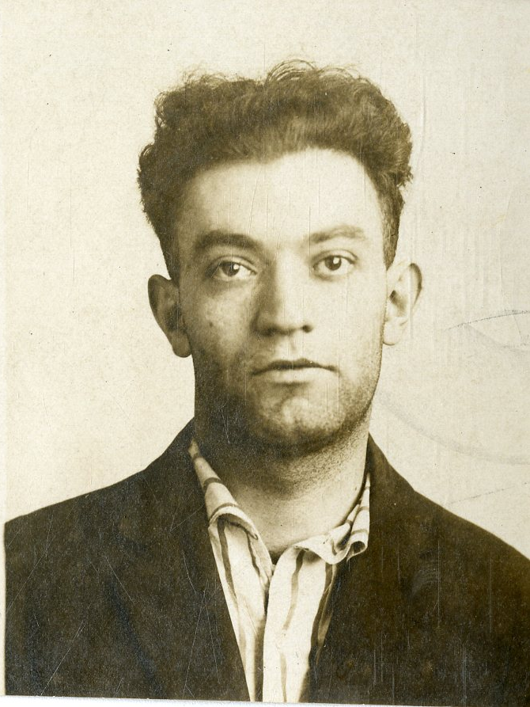

- Source: [National Archives catalog](https://catalog.archives.gov/id/117703266)
- Credit: U.S. Penitentiary, Leavenworth booking photograph; National Archives at Kansas City, Record Group 129, Inmate Case Files (series 571125), inmate 13109, catalog item 117703266.
- Identity: NARA individually catalogs this photograph as Photograph of Vladimir Lossieff, inmate 13109. The name, Leavenworth record and wartime context identify the Chicago IWW prisoner in the existing profile. The original photograph and available reverse were visually checked; the frontal view is on the right. The IWW inmate roster reproduced by NARA on page 6 independently pairs this name with inmate 13109: https://www.archives.gov/files/kansas-city/press/newsletter/2017-october.pdf#page=6 .
- Download: [original photograph](https://catalog.archives.gov/medialz/kansas-city/rg-129/571125/571125_13109-VladimirLossieff_001.jpg)
- Preserved original: [batch262-originals/571125_13109-VladimirLossieff_001.jpg](batch262-originals/571125_13109-VladimirLossieff_001.jpg)
- Crop box: `[669, 0, 1339, 893]` (left, top, exclusive right, exclusive bottom); original dimensions: `[1339, 893]`.
- Original SHA-256: `45ad20285d8e0d684ea6d2d04e8f7c65e2ad45507c716505b1923c95c5312434`
- Portrait SHA-256: `a88b728c5766f7ab797d02090760106075a9c1562a84560c5699421a5137eb72`
- Identifying reverse: [batch262-originals/571125_13109-VladimirLossieff_002.jpg](batch262-originals/571125_13109-VladimirLossieff_002.jpg)

## W. H. Lewis

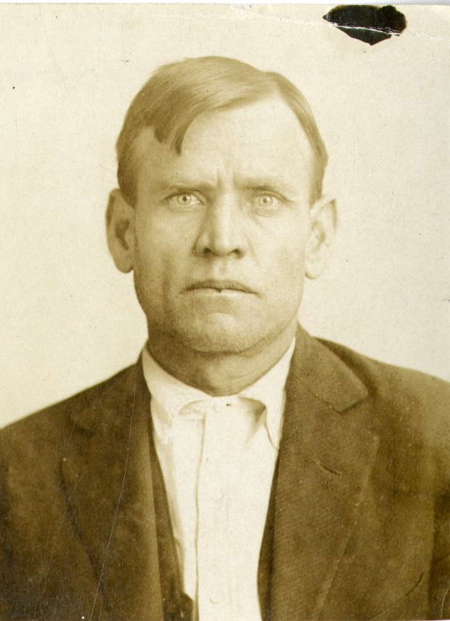

- Source: [National Archives catalog](https://catalog.archives.gov/id/117703395)
- Credit: U.S. Penitentiary, Leavenworth booking photograph; National Archives at Kansas City, Record Group 129, Inmate Case Files (series 571125), inmate 13163, catalog item 117703395.
- Identity: NARA individually catalogs this photograph as Photograph of W. H. Lewis, inmate 13163. The name, Leavenworth record and wartime context identify the Chicago IWW prisoner in the existing profile. The original photograph and available reverse were visually checked; the frontal view is on the right. The IWW inmate roster reproduced by NARA on page 6 independently pairs this name with inmate 13163: https://www.archives.gov/files/kansas-city/press/newsletter/2017-october.pdf#page=6 .
- Download: [original photograph](https://catalog.archives.gov/medialz/kansas-city/rg-129/571125/571125_13163-WHLewis_001.jpg)
- Preserved original: [batch262-originals/571125_13163-WHLewis_001.jpg](batch262-originals/571125_13163-WHLewis_001.jpg)
- Crop box: `[647, 0, 1295, 893]` (left, top, exclusive right, exclusive bottom); original dimensions: `[1295, 893]`.
- Original SHA-256: `dd91afb8936449d711fba2578fd7773fb3765681bcc9b5e3c743590f8798b24d`
- Portrait SHA-256: `52744ba08766f6b68c89c990e708b1d53a252ee3c19f30b372b2bc357a55d1a9`
- Identifying reverse: [batch262-originals/571125_13163-WHLewis_002.jpg](batch262-originals/571125_13163-WHLewis_002.jpg)

## W. L. Bennefield

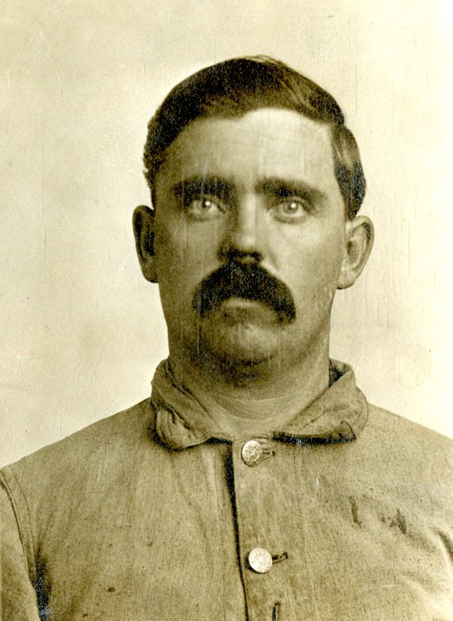

- Source: [National Archives catalog](https://catalog.archives.gov/id/83858503)
- Credit: U.S. Penitentiary, Leavenworth booking photograph; National Archives at Kansas City, Record Group 129, Inmate Case Files (series 571125), inmate 12025, catalog item 83858503.
- Identity: NARA individually catalogs this photograph as Photograph of W. L. Bennefield, inmate 12025. The name, Leavenworth record and wartime context identify the Oklahoma wartime conspiracy prisoner in the existing profile. The original photograph and available reverse were visually checked; the frontal view is on the right.
- Download: [original photograph](https://catalog.archives.gov/medialz/kansas-city/rg-129/571125/571125_12025-WLBennefield_001.jpg)
- Preserved original: [batch262-originals/571125_12025-WLBennefield_001.jpg](batch262-originals/571125_12025-WLBennefield_001.jpg)
- Crop box: `[641, 0, 1282, 879]` (left, top, exclusive right, exclusive bottom); original dimensions: `[1282, 879]`.
- Original SHA-256: `9e72de376b0d841dba65e9f0e4a74a855936e98d50dc18f10faa2fd18c588c41`
- Portrait SHA-256: `faa4efd3fbda1e469b4cffa1236e4f686c033dd0c64926e8b0dfb4bd5eddb648`
- Identifying reverse: [batch262-originals/571125_12025-WLBennefield_002.jpg](batch262-originals/571125_12025-WLBennefield_002.jpg)

## Walter M. Reeder

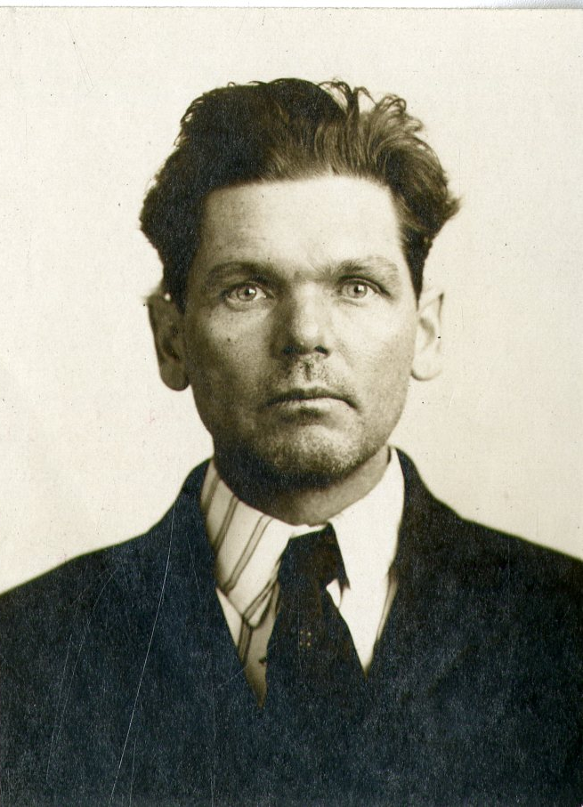

- Source: [National Archives catalog](https://catalog.archives.gov/id/117703951)
- Credit: U.S. Penitentiary, Leavenworth booking photograph; National Archives at Kansas City, Record Group 129, Inmate Case Files (series 571125), inmate 13341, catalog item 117703951.
- Identity: NARA individually catalogs this photograph as Photograph of Walter M. Reeder, inmate 13341. The name, Leavenworth record and wartime context identify the Oklahoma Universal Union prisoner in the existing profile. The original photograph and available reverse were visually checked; the frontal view is on the right.
- Download: [original photograph](https://catalog.archives.gov/medialz/kansas-city/rg-129/571125/571125_13341-WalterMReeder_001.jpg)
- Preserved original: [batch262-originals/571125_13341-WalterMReeder_001.jpg](batch262-originals/571125_13341-WalterMReeder_001.jpg)
- Crop box: `[655, 0, 1310, 907]` (left, top, exclusive right, exclusive bottom); original dimensions: `[1310, 907]`.
- Original SHA-256: `f655e703964de1899cdfb37bf70545e6aee462c35c34480c7b5a076f2abb8357`
- Portrait SHA-256: `0c0a90df06a7b9e274aff03a1d6fdacc49150bcfe93679e89ad5a632c3f94f0e`
- Identifying reverse: [batch262-originals/571125_13341-WalterMReeder_002.jpg](batch262-originals/571125_13341-WalterMReeder_002.jpg)

## Walter Phillips

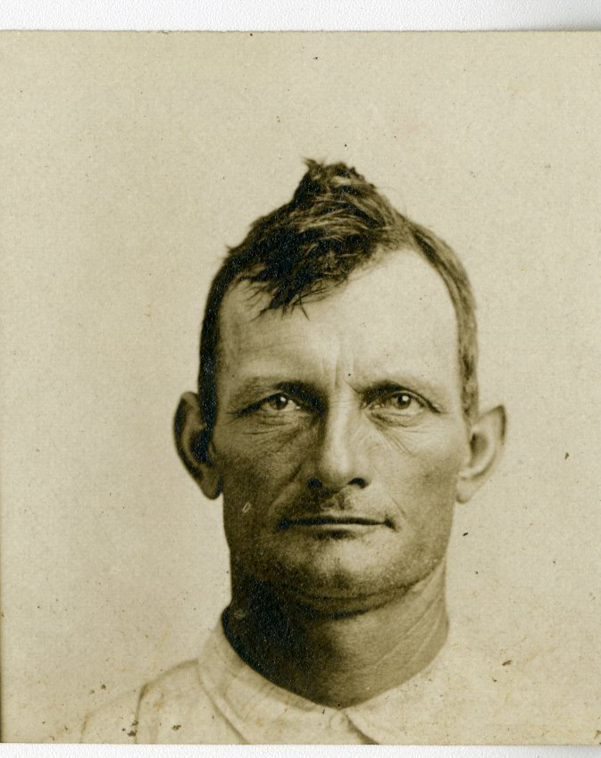

- Source: [National Archives catalog](https://catalog.archives.gov/id/117721518)
- Credit: U.S. Penitentiary, Leavenworth booking photograph; National Archives at Kansas City, Record Group 129, Inmate Case Files (series 571125), inmate 14228, catalog item 117721518.
- Identity: NARA individually catalogs this photograph as Photograph of Walter Phillips, inmate 14228. The name, Leavenworth record and wartime context identify the Oklahoma wartime conspiracy prisoner in the existing profile. The original photograph and available reverse were visually checked; the frontal view is on the right.
- Download: [original photograph](https://catalog.archives.gov/medialz/kansas-city/rg-129/571125/571125_14228-WalterPhillips_001.jpg)
- Preserved original: [batch262-originals/571125_14228-WalterPhillips_001.jpg](batch262-originals/571125_14228-WalterPhillips_001.jpg)
- Crop box: `[673, 0, 1346, 849]` (left, top, exclusive right, exclusive bottom); original dimensions: `[1346, 849]`.
- Original SHA-256: `6bfd2498213d94d11062fe1f65cc2ad5b382e3c93f033c810dae166ee57836cf`
- Portrait SHA-256: `470acd1bf1b00f92eeff6a632e4af3d85b1fd67f6a491c95574e99a7ff770185`
- Identifying reverse: [batch262-originals/571125_14228-WalterPhillips_002.jpg](batch262-originals/571125_14228-WalterPhillips_002.jpg)

## Walter T. Nef

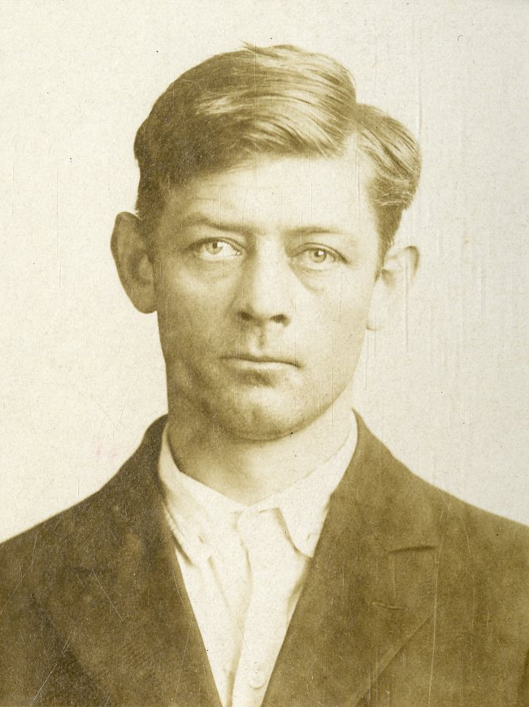

- Source: [National Archives catalog](https://catalog.archives.gov/id/117703269)
- Credit: U.S. Penitentiary, Leavenworth booking photograph; National Archives at Kansas City, Record Group 129, Inmate Case Files (series 571125), inmate 13110, catalog item 117703269.
- Identity: NARA individually catalogs this photograph as Photograph of Walter T. Nef, inmate 13110. The name, Leavenworth record and wartime context identify the Chicago IWW prisoner in the existing profile. The original photograph and available reverse were visually checked; the frontal view is on the right. The IWW inmate roster reproduced by NARA on page 6 independently pairs this name with inmate 13110: https://www.archives.gov/files/kansas-city/press/newsletter/2017-october.pdf#page=6 .
- Download: [original photograph](https://catalog.archives.gov/medialz/kansas-city/rg-129/571125/571125_13110-WalterTNef_001.jpg)
- Preserved original: [batch262-originals/571125_13110-WalterTNef_001.jpg](batch262-originals/571125_13110-WalterTNef_001.jpg)
- Crop box: `[651, 0, 1302, 871]` (left, top, exclusive right, exclusive bottom); original dimensions: `[1302, 871]`.
- Original SHA-256: `847933e2b3e59e4306bb29784ef97f25f55bbc4e04094c0451d6f78abba71e80`
- Portrait SHA-256: `37cf750176c67cd6f1e5ac4166e5c8540e0c340ed23a8dbe3b45c5e6ad9a0ada`
- Identifying reverse: [batch262-originals/571125_13110-WalterTNef_002.jpg](batch262-originals/571125_13110-WalterTNef_002.jpg)

## William Hood

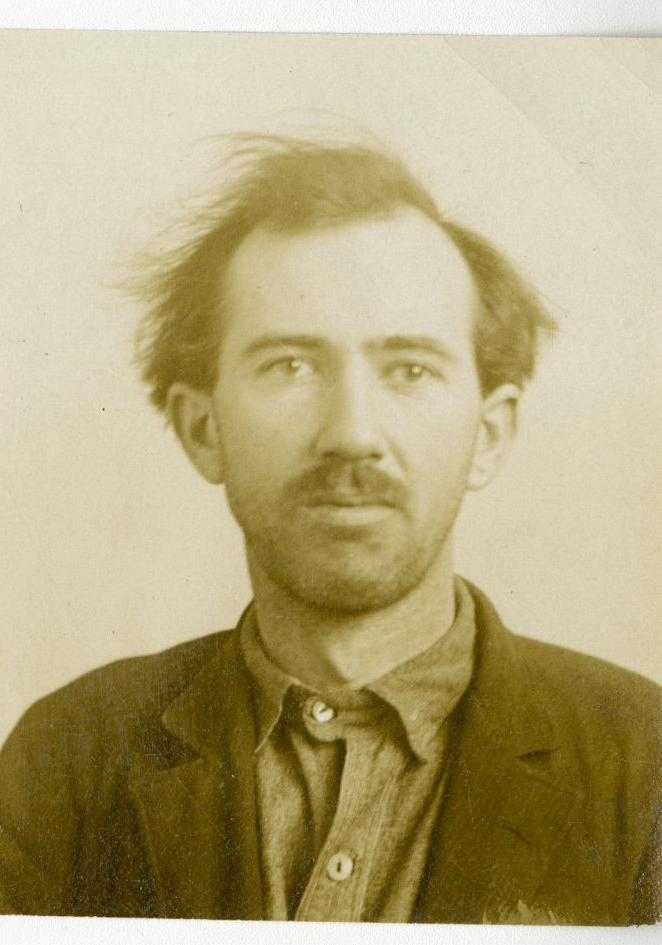

- Source: [National Archives catalog](https://catalog.archives.gov/id/117719336)
- Credit: U.S. Penitentiary, Leavenworth booking photograph; National Archives at Kansas City, Record Group 129, Inmate Case Files (series 571125), inmate 13573, catalog item 117719336.
- Identity: NARA individually catalogs this photograph as Photograph of William Hood, inmate 13573. The name, Leavenworth record and wartime context identify the IWW prisoner held at Leavenworth after the Sacramento prosecution in the existing profile. The original photograph and available reverse were visually checked; the frontal view is on the right.
- Download: [original photograph](https://catalog.archives.gov/medialz/kansas-city/rg-129/571125/571125_13573-WilliamHood_001.jpg)
- Preserved original: [batch262-originals/571125_13573-WilliamHood_001.jpg](batch262-originals/571125_13573-WilliamHood_001.jpg)
- Crop box: `[662, 0, 1324, 945]` (left, top, exclusive right, exclusive bottom); original dimensions: `[1324, 945]`.
- Original SHA-256: `43411f9b6ff3d937ed3bc07089ad9d868044033a6faf6de42965c732e6574157`
- Portrait SHA-256: `ca2402b7ad6159da4b7b09e94d0455efbef50b5e98be893d7b700b8c54d97993`
- Identifying reverse: [batch262-originals/571125_13573-WilliamHood_002.jpg](batch262-originals/571125_13573-WilliamHood_002.jpg)

## Z. L. Risley

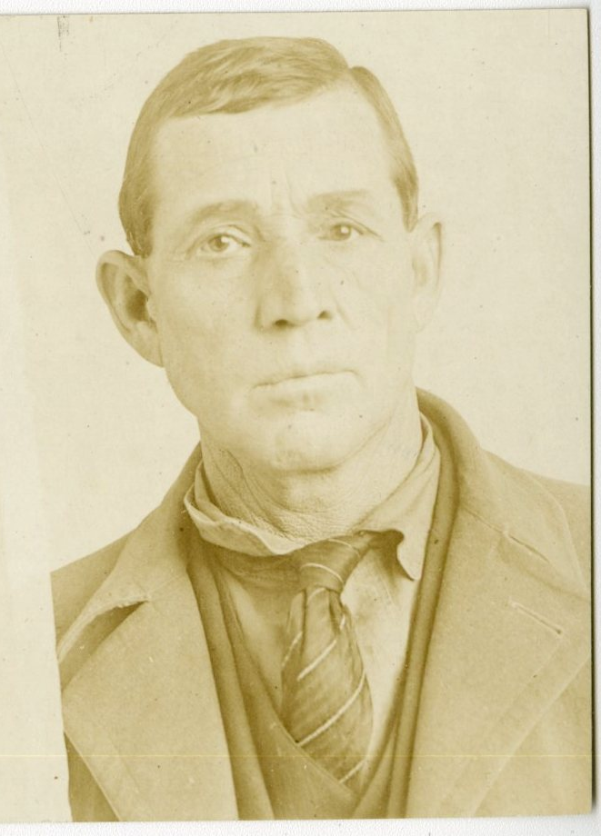

- Source: [National Archives catalog](https://catalog.archives.gov/id/160921969)
- Credit: U.S. Penitentiary, Leavenworth booking photograph; National Archives at Kansas City, Record Group 129, Inmate Case Files (series 571125), inmate 14766, catalog item 160921969.
- Identity: NARA individually catalogs this photograph as Photograph of Z. L. Risley, inmate 14766. The name, Leavenworth record and wartime context identify the Texas Farmers and Laborers Protective Association prisoner in the existing profile. The original photograph and available reverse were visually checked; the frontal view is on the right.
- Download: [original photograph](https://catalog.archives.gov/medialz/kansas-city/rg-129/571125/571125_14766-ZLRisley_001.jpg)
- Preserved original: [batch262-originals/571125_14766-ZLRisley_001.jpg](batch262-originals/571125_14766-ZLRisley_001.jpg)
- Crop box: `[661, 0, 1322, 920]` (left, top, exclusive right, exclusive bottom); original dimensions: `[1322, 920]`.
- Original SHA-256: `50fb2668c090707b91bf7b7c1ab0a389e02e30a6eb5913d02d86f094487f802d`
- Portrait SHA-256: `365397b0e89877f1c293f140ecfc1724b01d91dafd3a48e9ecd6dfcbe52a9e9b`
- Identifying reverse: [batch262-originals/571125_14766-ZLRisley_002.jpg](batch262-originals/571125_14766-ZLRisley_002.jpg)
