# Batch 263 — 100 portrait previews and credits

100 missing portraits: 66 National Archives prison photographs, 33 named photographs in Labor Defender (1926 and 1930), and one Bain News Service photograph from the Library of Congress. Existing photos, biographies, cases, dates and support websites are preserved.

The user authorized exact rectangular crops. These PNGs retain the original pixels, including grain, fading and historical printing. Scans may receive a lossless right-angle rotation before cropping. No AI reconstruction or retouching. [Original files and identifying captions](batch263-originals/) are retained.

## Abraham Cisneros

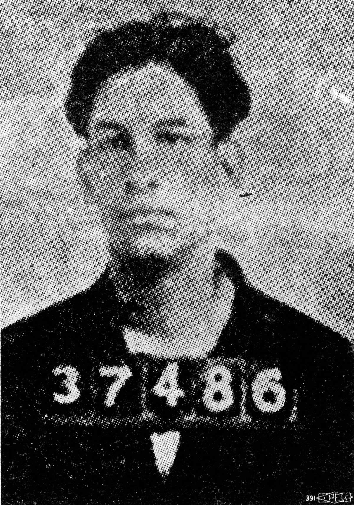

- Source: [archival record or issue](https://www.marxists.org/history/usa/pubs/labordefender/1926/v01n08-aug-1926-LD.pdf#page=23)
- Credit: Labor Defender, Aug 1926, PDF page 23; International Labor Defense, publisher. Digitized issue supplied by Marxists Internet Archive / Riazanov Library; individual photographer not identified.
- Rights: Photograph published in the United States in 1926; public domain in the United States by 2026. This statement concerns the historical published image, not newly authored archive website material.
- Identity: Caption identifies Abraham Cisneros, prisoner 37486, August 1926 PDF page 23; adjoining prisoner letter on PDF page 22 identifies the Rangel-Cline prisoner.
- Download: [original source](https://www.marxists.org/history/usa/pubs/labordefender/1926/v01n08-aug-1926-LD.pdf)
- Preserved original: [batch263-originals/aug-p23-Im0.jpg](batch263-originals/aug-p23-Im0.jpg)
- Counterclockwise rotation before crop: 90 degrees. Crop box: `[161, 94, 1359, 1802]` (left, top, exclusive right, exclusive bottom in rotated image); source dimensions: `[2013, 1428]`.
- Source SHA-256: `05c2bc337ab485a33f9d66893866655b3565773dfc67ddb94a6b832fde1d9959`
- Portrait SHA-256: `547fee0123a6a29521fab2c2ca98ee78d2d04ad3e61f531ef85ed0c538948f48`

## Albert J. Bloss

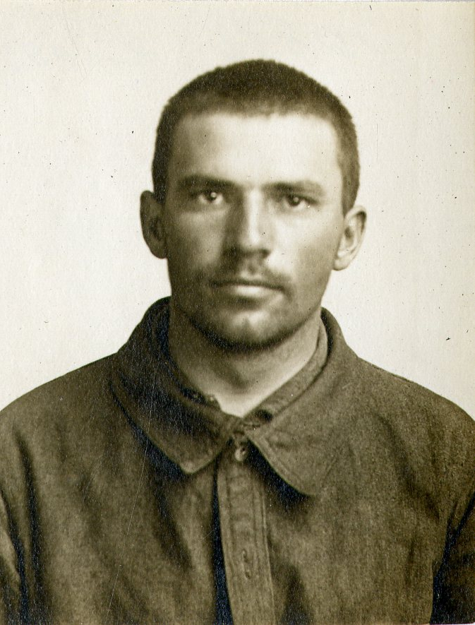

- Source: [archival record or issue](https://catalog.archives.gov/id/117702447)
- Credit: U.S. Penitentiary, Leavenworth booking photograph; National Archives at Kansas City, Record Group 129, series 571125, inmate 12856.
- Rights: U.S. federal-government prison photograph, public domain in the United States. NARA catalogs this photographic item as Unrestricted for use and access; individual photographer not identified.
- Identity: NARA catalogs this image as Photograph of Albert Bloss, Jr., Leavenworth inmate 12856. The named photographic record and identifying inscriptions were checked against the existing wartime prisoner profile. The frontal image is cropped from the right. NARA uses Albert Bloss, Jr.; the profile uses Albert J. Bloss. The wartime conscientious-objector context and adjacent inmate Walfred E. Marker (12857) support the identification. University of Washington ACLU finding aid records the Fort Worden objector as Alfred Bloss, Jr., alongside the same wartime correspondence: https://static.lib.uw.edu/static/public/specialcollections/findingaids/1177-014.pdf . The spelling discrepancy is documented, not applied to the profile.
- Download: [original source](https://catalog.archives.gov/medialz/kansas-city/rg-129/571125/571125_12856-AlbertBlossJr_001.jpg)
- Preserved original: [batch263-originals/571125_12856-AlbertBlossJr_001.jpg](batch263-originals/571125_12856-AlbertBlossJr_001.jpg)
- Counterclockwise rotation before crop: 0 degrees. Crop box: `[673, 0, 1346, 885]` (left, top, exclusive right, exclusive bottom in rotated image); source dimensions: `[1346, 885]`.
- Source SHA-256: `258c37bbe82eaab585dd9df177237034a0ae33a53e106a54c1c2498149abdd10`
- Portrait SHA-256: `6cd6e65bfdc8fc60540574c3247f9d12a5b2202c033e463f8a7284a20d3ab172`
- Identifying reverse: [batch263-originals/571125_12856-AlbertBlossJr_002.jpg](batch263-originals/571125_12856-AlbertBlossJr_002.jpg)

## Andrew F. Busch

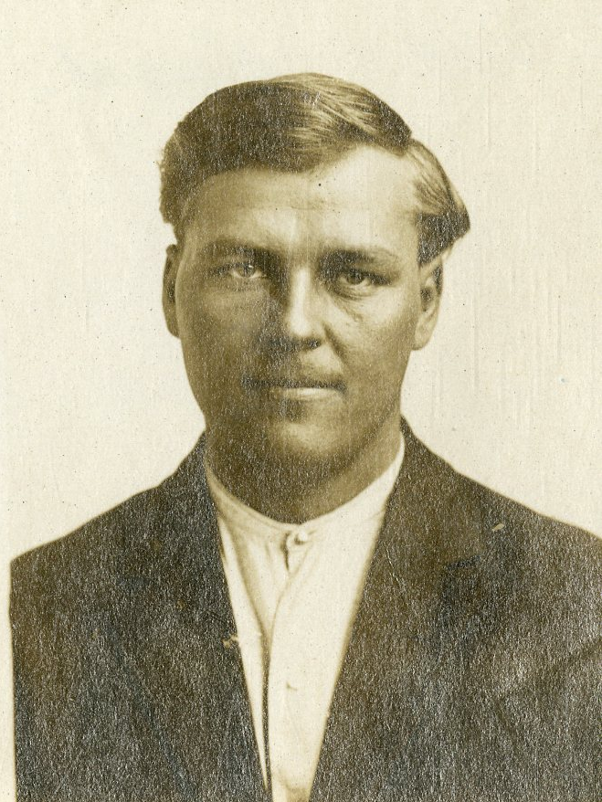

- Source: [archival record or issue](https://catalog.archives.gov/id/117702221)
- Credit: U.S. Penitentiary, Leavenworth booking photograph; National Archives at Kansas City, Record Group 129, series 571125, inmate 12790.
- Rights: U.S. federal-government prison photograph, public domain in the United States. NARA catalogs this photographic item as Unrestricted for use and access; individual photographer not identified.
- Identity: NARA catalogs this image as Photograph of Andrew F. Busch, Leavenworth inmate 12790. The named photographic record and identifying inscriptions were checked against the existing wartime prisoner profile. The frontal image is cropped from the right.
- Download: [original source](https://catalog.archives.gov/medialz/kansas-city/rg-129/571125/571125_12790-AndrewFBusch_001.jpg)
- Preserved original: [batch263-originals/571125_12790-AndrewFBusch_001.jpg](batch263-originals/571125_12790-AndrewFBusch_001.jpg)
- Counterclockwise rotation before crop: 0 degrees. Crop box: `[658, 0, 1317, 878]` (left, top, exclusive right, exclusive bottom in rotated image); source dimensions: `[1317, 878]`.
- Source SHA-256: `e6f95ebb136ff6bd0241419ebcfea02d20cfe25e7bce67ca844c54aa615229a6`
- Portrait SHA-256: `38a8e117f13860a5b2b40051450bdc55f68495d2a0d487ae4f73e831993c039d`
- Identifying reverse: [batch263-originals/571125_12790-AndrewFBusch_002.jpg](batch263-originals/571125_12790-AndrewFBusch_002.jpg)

## Anna Burlak

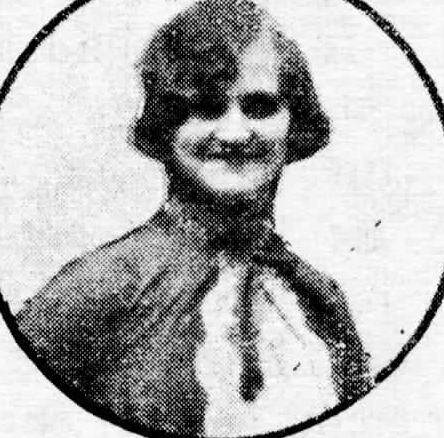

- Source: [archival record or issue](https://www.marxists.org/history/usa/pubs/labordefender/1930/v05n03-mar-1930-LD.pdf#page=9)
- Credit: Labor Defender, Mar 1930, PDF page 9; International Labor Defense, publisher. Digitized issue supplied by Marxists Internet Archive / Riazanov Library; individual photographer not identified.
- Rights: Photograph published in the United States in 1930; public domain in the United States by 2026. This statement concerns the historical published image, not newly authored archive website material.
- Identity: March 1930 printed page 47 (PDF page 9), 1105 Years in Prison. Individual caption identifies Anna Burlack, Bethlehem textile worker; organizational and geographic context agrees with the existing profile.
- Download: [original source](https://www.marxists.org/history/usa/pubs/labordefender/1930/v05n03-mar-1930-LD.pdf)
- Preserved original: [batch263-originals/1930-mar-p9-Im0.jpg](batch263-originals/1930-mar-p9-Im0.jpg)
- Counterclockwise rotation before crop: 270 degrees. Crop box: `[1176, 3841, 1620, 4279]` (left, top, exclusive right, exclusive bottom in rotated image); source dimensions: `[4764, 3469]`.
- Source SHA-256: `2a7a6874381e99c73733507aebe9015508a17e3c4fa2f756b247093b2fd75a86`
- Portrait SHA-256: `d07b040e4d493bedad5d24e9d7ff2687f93f0e13e8a65fd37dd2bed19bebbf55`

## Becky Edelsohn

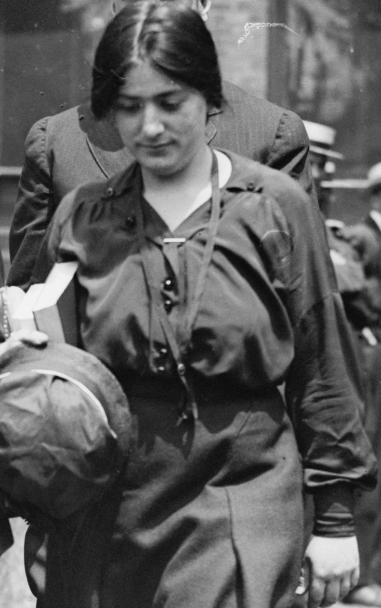

- Source: [archival record or issue](https://www.loc.gov/item/2014696217/)
- Credit: Bain News Service, publisher; Library of Congress, George Grantham Bain Collection, ggbain.16241, Becky Edelson under arrest, Tarrytown, June 6, 1914. Original downloaded from Wikimedia Commons.
- Rights: Public domain Bain News Service photograph. Library of Congress collection is identified as having no known copyright restrictions; Commons metadata marks this image public domain.
- Identity: The original glass-negative inscription names Becky Edelson under arrest, Tarrytown, 6/6/14. The woman at center-right is isolated in the crop; the Tarrytown anti-Rockefeller arrest agrees with the existing Becky Edelsohn profile.
- Download: [original source](https://upload.wikimedia.org/wikipedia/commons/e/ea/Becky_Edelson_under_arrest%2C_Tarrytown_%28LOC_ggbain.16241%29.jpg?utm_source=commons.wikimedia.org&utm_campaign=imageinfo&utm_content=original)
- Preserved original: [batch263-originals/becky-original.jpg](batch263-originals/becky-original.jpg)
- Counterclockwise rotation before crop: 0 degrees. Crop box: `[2934, 959, 3725, 2218]` (left, top, exclusive right, exclusive bottom in rotated image); source dimensions: `[5544, 3984]`.
- Source SHA-256: `27b4aa733d6455c1ea0be1cbeb3191e979ef59f10c42d9cda6fc01e4c2fdc16d`
- Portrait SHA-256: `576824ddcd3bbeb9e7e820ac50c7861d42fc6c6d2dba7ec5ac4d7c5a16843814`

## Bill Lawrence

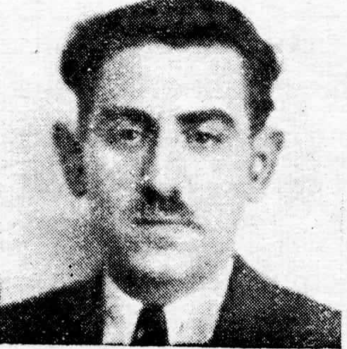

- Source: [archival record or issue](https://www.marxists.org/history/usa/pubs/labordefender/1930/v05n03-mar-1930-LD.pdf#page=9)
- Credit: Labor Defender, Mar 1930, PDF page 9; International Labor Defense, publisher. Digitized issue supplied by Marxists Internet Archive / Riazanov Library; individual photographer not identified.
- Rights: Photograph published in the United States in 1930; public domain in the United States by 2026. This statement concerns the historical published image, not newly authored archive website material.
- Identity: March 1930 printed page 47 (PDF page 9), 1105 Years in Prison. Individual caption identifies Bill Lawrence, Philadelphia Communist organizer; organizational and geographic context agrees with the existing profile. Contemporary reporting connects Bill Lawrence with the Philadelphia sedition prosecution: https://www.themilitant.com/1931/0405/MIL0405.pdf .
- Download: [original source](https://www.marxists.org/history/usa/pubs/labordefender/1930/v05n03-mar-1930-LD.pdf)
- Preserved original: [batch263-originals/1930-mar-p9-Im0.jpg](batch263-originals/1930-mar-p9-Im0.jpg)
- Counterclockwise rotation before crop: 270 degrees. Crop box: `[2203, 3802, 2695, 4297]` (left, top, exclusive right, exclusive bottom in rotated image); source dimensions: `[4764, 3469]`.
- Source SHA-256: `2a7a6874381e99c73733507aebe9015508a17e3c4fa2f756b247093b2fd75a86`
- Portrait SHA-256: `297db583ebe45f47e1cabee0c09bb1638721a9c69644b468799c313a452de86a`

## Bill Murdock

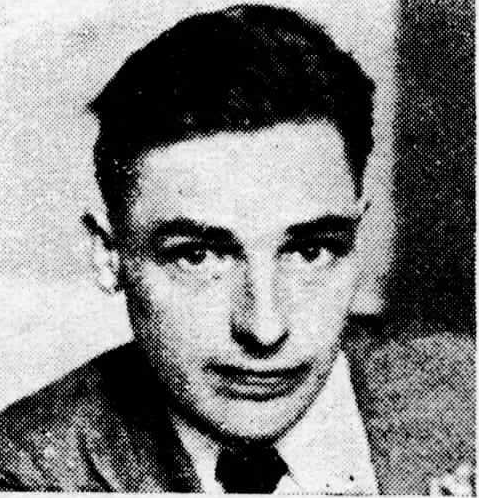

- Source: [archival record or issue](https://www.marxists.org/history/usa/pubs/labordefender/1930/v05n03-mar-1930-LD.pdf#page=9)
- Credit: Labor Defender, Mar 1930, PDF page 9; International Labor Defense, publisher. Digitized issue supplied by Marxists Internet Archive / Riazanov Library; individual photographer not identified.
- Rights: Photograph published in the United States in 1930; public domain in the United States by 2026. This statement concerns the historical published image, not newly authored archive website material.
- Identity: March 1930 printed page 47 (PDF page 9), 1105 Years in Prison. Individual caption identifies Bill Murdock, TUUL organizer; organizational and geographic context agrees with the existing profile. Contemporary reporting also names William Murdock among the National Textile Workers Union organizers detained in the 1931 Lawrence strike: https://www.marxists.org/history/usa/pubs/new-leader/1931/v12n10-mar-07-1931-NL.pdf .
- Download: [original source](https://www.marxists.org/history/usa/pubs/labordefender/1930/v05n03-mar-1930-LD.pdf)
- Preserved original: [batch263-originals/1930-mar-p9-Im0.jpg](batch263-originals/1930-mar-p9-Im0.jpg)
- Counterclockwise rotation before crop: 270 degrees. Crop box: `[2799, 1009, 3278, 1507]` (left, top, exclusive right, exclusive bottom in rotated image); source dimensions: `[4764, 3469]`.
- Source SHA-256: `2a7a6874381e99c73733507aebe9015508a17e3c4fa2f756b247093b2fd75a86`
- Portrait SHA-256: `92e8491f64359f7cf7a62f7f68cc86562b5befca04243c0180a8d112cc3d5284`

## Brent Dow Allinson

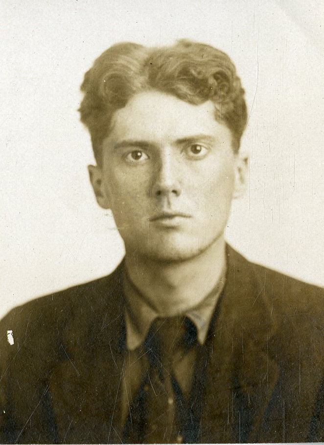

- Source: [archival record or issue](https://catalog.archives.gov/id/117703002)
- Credit: U.S. Penitentiary, Leavenworth booking photograph; National Archives at Kansas City, Record Group 129, series 571125, inmate 13031.
- Rights: U.S. federal-government prison photograph, public domain in the United States. NARA catalogs this photographic item as Unrestricted for use and access; individual photographer not identified.
- Identity: NARA catalogs this image as Photograph of Brent Dow Allinson, Leavenworth inmate 13031. The named photographic record and identifying inscriptions were checked against the existing wartime prisoner profile. The frontal image is cropped from the right.
- Download: [original source](https://catalog.archives.gov/medialz/kansas-city/rg-129/571125/571125_13031-BrentDowAllinson_001.jpg)
- Preserved original: [batch263-originals/571125_13031-BrentDowAllinson_001.jpg](batch263-originals/571125_13031-BrentDowAllinson_001.jpg)
- Counterclockwise rotation before crop: 0 degrees. Crop box: `[662, 0, 1324, 907]` (left, top, exclusive right, exclusive bottom in rotated image); source dimensions: `[1324, 907]`.
- Source SHA-256: `2e991ebb02eeae554ff8608c52d94c398311e839dca77dd73f3cb7cea47c6099`
- Portrait SHA-256: `4aef57d69cab44e4b2a61e718b857758561079da2a8faf9ea0e636ba7ddb7ee9`
- Identifying reverse: [batch263-originals/571125_13031-BrentDowAllinson_002.jpg](batch263-originals/571125_13031-BrentDowAllinson_002.jpg)

## Carl Larson

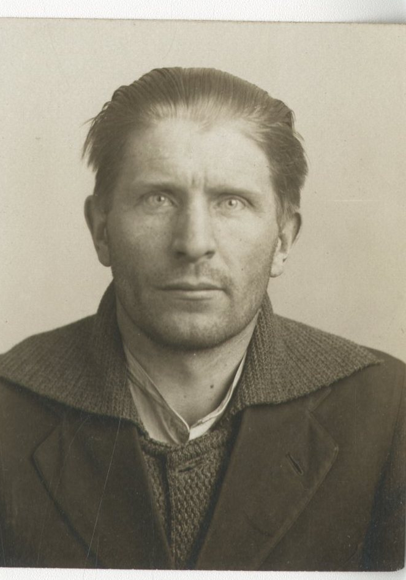

- Source: [archival record or issue](https://catalog.archives.gov/id/117719694)
- Credit: U.S. Penitentiary, Leavenworth booking photograph; National Archives at Kansas City, Record Group 129, series 571125, inmate 13682.
- Rights: U.S. federal-government prison photograph, public domain in the United States. NARA catalogs this photographic item as Unrestricted for use and access; individual photographer not identified.
- Identity: NARA catalogs this image as Photograph of Carl Larson, Leavenworth inmate 13682. The named photographic record and identifying inscriptions were checked against the existing wartime prisoner profile. The frontal image is cropped from the right. This is the Swedish deportee profile, not the separate Buffalo 1930 organizer with slug carl-larson.
- Download: [original source](https://catalog.archives.gov/medialz/kansas-city/rg-129/571125/571125_13682-CarlLarson_001.jpg)
- Preserved original: [batch263-originals/571125_13682-CarlLarson_001.jpg](batch263-originals/571125_13682-CarlLarson_001.jpg)
- Counterclockwise rotation before crop: 0 degrees. Crop box: `[663, 0, 1326, 946]` (left, top, exclusive right, exclusive bottom in rotated image); source dimensions: `[1326, 946]`.
- Source SHA-256: `d076faa01597ab02c804f513f798183a171df84d014dd995aa98c253ccc301d6`
- Portrait SHA-256: `49fbc4a4133f92da1a89ada8b15b5d902f5bc9cf5acd3e2197499b9784673eef`
- Identifying reverse: [batch263-originals/571125_13682-CarlLarson_002.jpg](batch263-originals/571125_13682-CarlLarson_002.jpg)

## Carl Larson

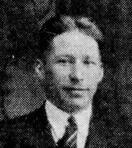

- Source: [archival record or issue](https://www.marxists.org/history/usa/pubs/labordefender/1930/v05n05-may-1930-LD.pdf#page=12)
- Credit: Labor Defender, May 1930, PDF page 12; International Labor Defense, publisher. Digitized issue supplied by Marxists Internet Archive / Riazanov Library; individual photographer not identified. Group photograph credited in print to Buffalo ILD.
- Rights: Photograph published in the United States in 1930; public domain in the United States by 2026. This statement concerns the historical published image, not newly authored archive website material.
- Identity: May 1930 printed page 89 (PDF page 12), A Reply to Hunger. Caption explicitly identifies Carl Larson, first in the rear row of the Buffalo group; the locality and 1930 prosecution agree with the existing profile. This Buffalo 1930 organizer is distinct from the Swedish deportee profile carl-larson-2.
- Download: [original source](https://www.marxists.org/history/usa/pubs/labordefender/1930/v05n05-may-1930-LD.pdf)
- Preserved original: [batch263-originals/1930-may-p12-Im0.jpg](batch263-originals/1930-may-p12-Im0.jpg)
- Counterclockwise rotation before crop: 270 degrees. Crop box: `[339, 1596, 606, 1896]` (left, top, exclusive right, exclusive bottom in rotated image); source dimensions: `[4755, 3523]`.
- Source SHA-256: `b6d73d1ebeb39ce3d2edc7c0c1f7bbcc1fdc57860052e5f10e6660cbd06b198a`
- Portrait SHA-256: `ee8a951d86ee89136131da040974112e9bb03eafcdc99912ffc9af94da480d3e`

## Charles Bernal

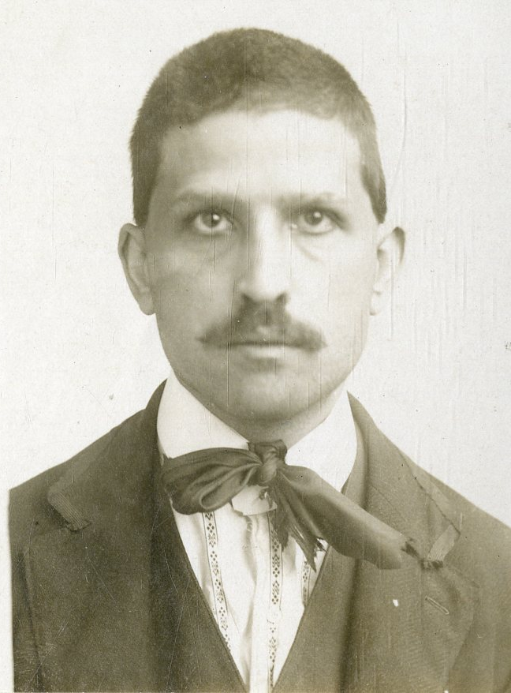

- Source: [archival record or issue](https://catalog.archives.gov/id/117704040)
- Credit: U.S. Penitentiary, Leavenworth booking photograph; National Archives at Kansas City, Record Group 129, series 571125, inmate 13372.
- Rights: U.S. federal-government prison photograph, public domain in the United States. NARA catalogs this photographic item as Unrestricted for use and access; individual photographer not identified.
- Identity: NARA catalogs this image as Photograph of Charles Bernal, Leavenworth inmate 13372. The named photographic record and identifying inscriptions were checked against the existing wartime prisoner profile. The frontal image is cropped from the right.
- Download: [original source](https://catalog.archives.gov/medialz/kansas-city/rg-129/571125/571125_13372-CharlesBernal_001.jpg)
- Preserved original: [batch263-originals/571125_13372-CharlesBernal_001.jpg](batch263-originals/571125_13372-CharlesBernal_001.jpg)
- Counterclockwise rotation before crop: 0 degrees. Crop box: `[647, 0, 1295, 878]` (left, top, exclusive right, exclusive bottom in rotated image); source dimensions: `[1295, 878]`.
- Source SHA-256: `7af0dcc7cb1217310d91c770d793c0d1f29103dbfed1b1a3f35cf70f537b15d3`
- Portrait SHA-256: `7935403435469931c62c116a40baed9c141f6016c8ee99befad2dd76e51311f3`
- Identifying reverse: [batch263-originals/571125_13372-CharlesBernal_002.jpg](batch263-originals/571125_13372-CharlesBernal_002.jpg)

## Charles Jacobs

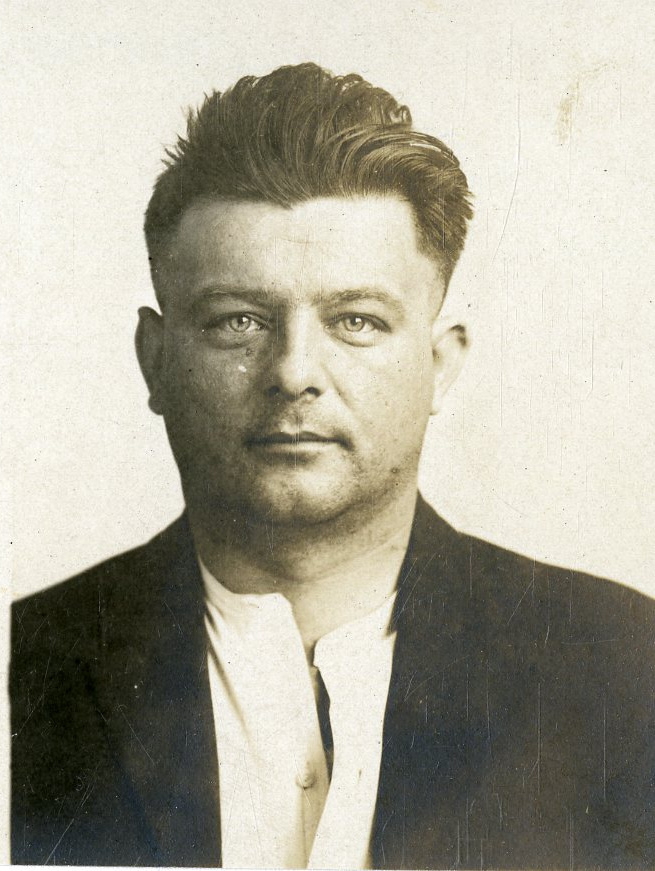

- Source: [archival record or issue](https://catalog.archives.gov/id/117703465)
- Credit: U.S. Penitentiary, Leavenworth booking photograph; National Archives at Kansas City, Record Group 129, series 571125, inmate 13188.
- Rights: U.S. federal-government prison photograph, public domain in the United States. NARA catalogs this photographic item as Unrestricted for use and access; individual photographer not identified.
- Identity: NARA catalogs this image as Photograph of Charles Jacobs, Leavenworth inmate 13188. The named photographic record and identifying inscriptions were checked against the existing wartime prisoner profile. The frontal image is cropped from the right. The Chicago IWW name/inmate-number roster reproduced by NARA in its October 2017 newsletter corroborates this group: https://www.archives.gov/files/kansas-city/press/newsletter/2017-october.pdf#page=6 .
- Download: [original source](https://catalog.archives.gov/medialz/kansas-city/rg-129/571125/571125_13188-CharlesJacobs_001.jpg)
- Preserved original: [batch263-originals/571125_13188-CharlesJacobs_001.jpg](batch263-originals/571125_13188-CharlesJacobs_001.jpg)
- Counterclockwise rotation before crop: 0 degrees. Crop box: `[655, 0, 1310, 871]` (left, top, exclusive right, exclusive bottom in rotated image); source dimensions: `[1310, 871]`.
- Source SHA-256: `80050c4ca08905e798f1194d08e3934312c3383f973429d5649cfae8794e4ba6`
- Portrait SHA-256: `e4be92ec0ca0e8827778d4244721428ef2c0869be2213833348d0e9adab505c8`
- Identifying reverse: [batch263-originals/571125_13188-CharlesJacobs_002.jpg](batch263-originals/571125_13188-CharlesJacobs_002.jpg)

## Charles McWhirt

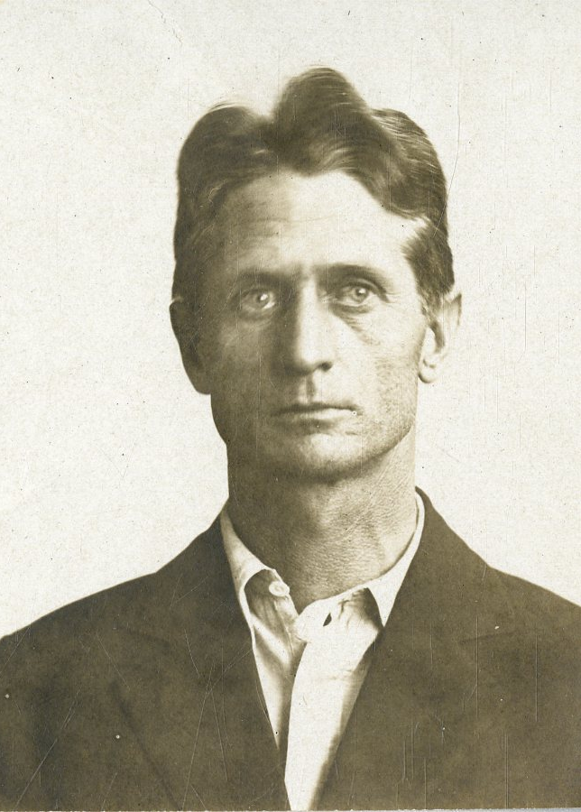

- Source: [archival record or issue](https://catalog.archives.gov/id/117703473)
- Credit: U.S. Penitentiary, Leavenworth booking photograph; National Archives at Kansas City, Record Group 129, series 571125, inmate 13190.
- Rights: U.S. federal-government prison photograph, public domain in the United States. NARA catalogs this photographic item as Unrestricted for use and access; individual photographer not identified.
- Identity: NARA catalogs this image as Photograph of Charles McWhirt, Leavenworth inmate 13190. The named photographic record and identifying inscriptions were checked against the existing wartime prisoner profile. The frontal image is cropped from the right. The Chicago IWW name/inmate-number roster reproduced by NARA in its October 2017 newsletter corroborates this group: https://www.archives.gov/files/kansas-city/press/newsletter/2017-october.pdf#page=6 .
- Download: [original source](https://catalog.archives.gov/medialz/kansas-city/rg-129/571125/571125_13190-CharlesMcWhirt_001.jpg)
- Preserved original: [batch263-originals/571125_13190-CharlesMcWhirt_001.jpg](batch263-originals/571125_13190-CharlesMcWhirt_001.jpg)
- Counterclockwise rotation before crop: 0 degrees. Crop box: `[644, 0, 1288, 900]` (left, top, exclusive right, exclusive bottom in rotated image); source dimensions: `[1288, 900]`.
- Source SHA-256: `343d0ebd511e61c210887521fc746e6b50965912edf1a6aeaea783f429ef5d3b`
- Portrait SHA-256: `f2f4edbbbcfe1d419ae7bf4a145aea7441f5fe0ef59ce016472e26dd156d8e9f`
- Identifying reverse: [batch263-originals/571125_13190-CharlesMcWhirt_002.jpg](batch263-originals/571125_13190-CharlesMcWhirt_002.jpg)

## Christian Seeger

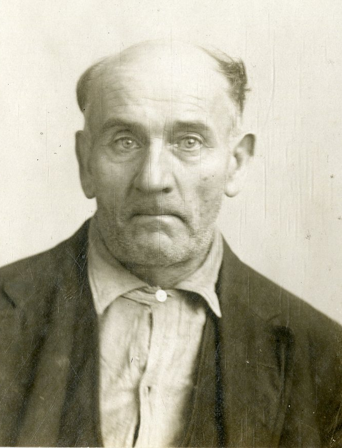

- Source: [archival record or issue](https://catalog.archives.gov/id/117704045)
- Credit: U.S. Penitentiary, Leavenworth booking photograph; National Archives at Kansas City, Record Group 129, series 571125, inmate 13373.
- Rights: U.S. federal-government prison photograph, public domain in the United States. NARA catalogs this photographic item as Unrestricted for use and access; individual photographer not identified.
- Identity: NARA catalogs this image as Photograph of Christ Seeger, Leavenworth inmate 13373. The named photographic record and identifying inscriptions were checked against the existing wartime prisoner profile. The frontal image is cropped from the right. Catalog spelling/expanded name is preserved in the source title; existing display name Christian Seeger remains unchanged. The matching incarceration context was checked before selecting the portrait.
- Download: [original source](https://catalog.archives.gov/medialz/kansas-city/rg-129/571125/571125_13373-ChristSeeger_001.jpg)
- Preserved original: [batch263-originals/571125_13373-ChristSeeger_001.jpg](batch263-originals/571125_13373-ChristSeeger_001.jpg)
- Counterclockwise rotation before crop: 0 degrees. Crop box: `[669, 0, 1339, 878]` (left, top, exclusive right, exclusive bottom in rotated image); source dimensions: `[1339, 878]`.
- Source SHA-256: `677b317ebcb2df66208977009fb95ab3436e8719fefdca134da6163682016426`
- Portrait SHA-256: `9b65d407f8dd54be0daf16e85a7ebd875c477d3292cb320a1e7dec00b53859f8`
- Identifying reverse: [batch263-originals/571125_13373-ChristSeeger_002.jpg](batch263-originals/571125_13373-ChristSeeger_002.jpg)

## Clyde Hough

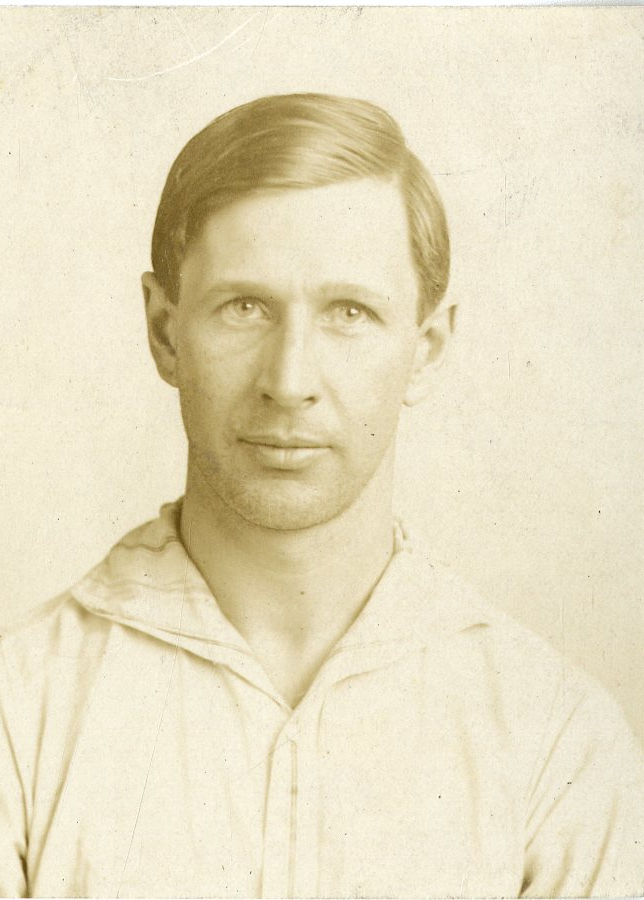

- Source: [archival record or issue](https://catalog.archives.gov/id/117703384)
- Credit: U.S. Penitentiary, Leavenworth booking photograph; National Archives at Kansas City, Record Group 129, series 571125, inmate 13159.
- Rights: U.S. federal-government prison photograph, public domain in the United States. NARA catalogs this photographic item as Unrestricted for use and access; individual photographer not identified.
- Identity: NARA catalogs this image as Photograph of Clyde Hough, Leavenworth inmate 13159. The named photographic record and identifying inscriptions were checked against the existing wartime prisoner profile. The frontal image is cropped from the right. The Chicago IWW name/inmate-number roster reproduced by NARA in its October 2017 newsletter corroborates this group: https://www.archives.gov/files/kansas-city/press/newsletter/2017-october.pdf#page=6 .
- Download: [original source](https://catalog.archives.gov/medialz/kansas-city/rg-129/571125/571125_13159-ClydeHough_001.jpg)
- Preserved original: [batch263-originals/571125_13159-ClydeHough_001.jpg](batch263-originals/571125_13159-ClydeHough_001.jpg)
- Counterclockwise rotation before crop: 0 degrees. Crop box: `[644, 0, 1288, 900]` (left, top, exclusive right, exclusive bottom in rotated image); source dimensions: `[1288, 900]`.
- Source SHA-256: `53d1909786fcdf1347fca1f8a8a7f78fd6f41119a29402438ba2a8f4d13999eb`
- Portrait SHA-256: `e5d1b745582a6812a02966e0e06d61aebe6a23c2443337325d0903f75b5d8117`
- Identifying reverse: [batch263-originals/571125_13159-ClydeHough_002.jpg](batch263-originals/571125_13159-ClydeHough_002.jpg)

## Dan Fallon

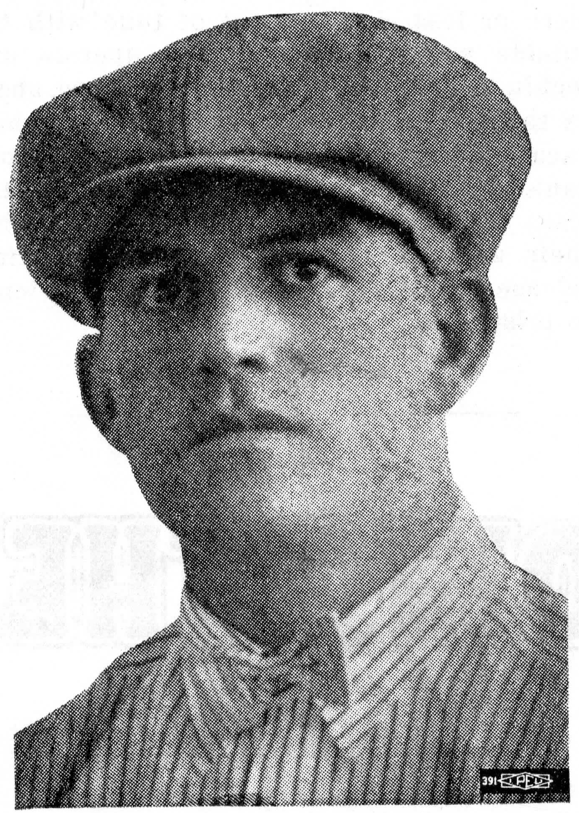

- Source: [archival record or issue](https://www.marxists.org/history/usa/pubs/labordefender/1926/v01n07-jul-1926-ORIG-LD.pdf#page=28)
- Credit: Labor Defender, Jul 1926, PDF page 28; International Labor Defense, publisher. Digitized issue supplied by Marxists Internet Archive / Riazanov Library; individual photographer not identified.
- Rights: Photograph published in the United States in 1926; public domain in the United States by 2026. This statement concerns the historical published image, not newly authored archive website material.
- Identity: Individually captioned Danny Fallon, July 1926 PDF page 28. His letter on page 27 identifies Maine State Prison, Thomaston, matching the existing prisoner case.
- Download: [original source](https://www.marxists.org/history/usa/pubs/labordefender/1926/v01n07-jul-1926-ORIG-LD.pdf)
- Preserved original: [batch263-originals/jul-p28-Im0.jpg](batch263-originals/jul-p28-Im0.jpg)
- Counterclockwise rotation before crop: 270 degrees. Crop box: `[72, 16, 1448, 1948]` (left, top, exclusive right, exclusive bottom in rotated image); source dimensions: `[2106, 1534]`.
- Source SHA-256: `97a5aca8a9b0f79766ab7edf5c18e786daf1cde8c16c2ef3530e7ac5c2aa1aa4`
- Portrait SHA-256: `1fb2feab4e9afb597b2e7a34600146650e23f3772c0a71c0c5c0c098551cb836`

## Daniel Mahoney

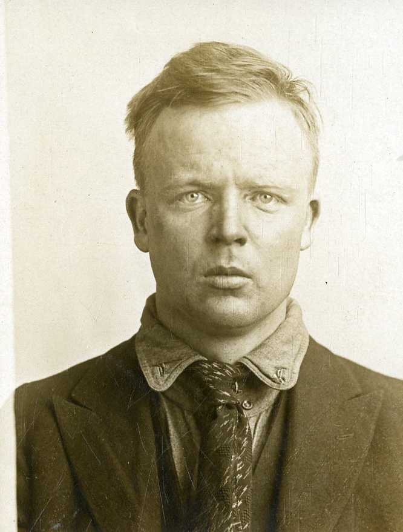

- Source: [archival record or issue](https://catalog.archives.gov/id/117702001)
- Credit: U.S. Penitentiary, Leavenworth booking photograph; National Archives at Kansas City, Record Group 129, series 571125, inmate 12722.
- Rights: U.S. federal-government prison photograph, public domain in the United States. NARA catalogs this photographic item as Unrestricted for use and access; individual photographer not identified.
- Identity: NARA catalogs this image as Photograph of Daniel Mahoney, Leavenworth inmate 12722. The named photographic record and identifying inscriptions were checked against the existing wartime prisoner profile. The frontal image is cropped from the right.
- Download: [original source](https://catalog.archives.gov/medialz/kansas-city/rg-129/571125/571125_12722-DanielMahoney_001.jpg)
- Preserved original: [batch263-originals/571125_12722-DanielMahoney_001.jpg](batch263-originals/571125_12722-DanielMahoney_001.jpg)
- Counterclockwise rotation before crop: 0 degrees. Crop box: `[666, 0, 1332, 878]` (left, top, exclusive right, exclusive bottom in rotated image); source dimensions: `[1332, 878]`.
- Source SHA-256: `76e5cc4b9c14cece5a042c3197fcb869d5a3bb8e5df9e0156448d03b31833d11`
- Portrait SHA-256: `4cc4cfc72a22e6ccdfd42b92413e21db626b0f176ecd7b102209c38c1dea1862`
- Identifying reverse: [batch263-originals/571125_12722-DanielMahoney_002.jpg](batch263-originals/571125_12722-DanielMahoney_002.jpg)

## Demetrius Ppapgeorge

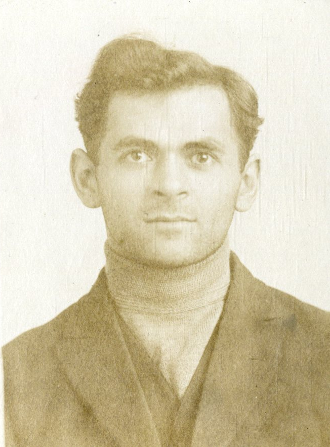

- Source: [archival record or issue](https://catalog.archives.gov/id/83859854)
- Credit: U.S. Penitentiary, Leavenworth booking photograph; National Archives at Kansas City, Record Group 129, series 571125, inmate 12475.
- Rights: U.S. federal-government prison photograph, public domain in the United States. NARA catalogs this photographic item as Unrestricted for use and access; individual photographer not identified.
- Identity: NARA catalogs this image as Photograph of Demetrius Papageorge, Leavenworth inmate 12475. The named photographic record and identifying inscriptions were checked against the existing wartime prisoner profile. The frontal image is cropped from the right. Catalog spelling/expanded name is preserved in the source title; existing display name Demetrius Ppapgeorge remains unchanged. The matching incarceration context was checked before selecting the portrait.
- Download: [original source](https://catalog.archives.gov/medialz/kansas-city/rg-129/571125/571125_12475-DemetriusPapageorge_001.jpg)
- Preserved original: [batch263-originals/571125_12475-DemetriusPapageorge_001.jpg](batch263-originals/571125_12475-DemetriusPapageorge_001.jpg)
- Counterclockwise rotation before crop: 0 degrees. Crop box: `[651, 0, 1303, 884]` (left, top, exclusive right, exclusive bottom in rotated image); source dimensions: `[1303, 884]`.
- Source SHA-256: `fda8bbda297f7b7a9c0b9c9709c1bbc32893221cdef79c985c45443a2f7fdba4`
- Portrait SHA-256: `089e149044a6b44c2b4cb9ca80a4e5a1b0edfe18715d2fb191db69eb229faa58`
- Identifying reverse: [batch263-originals/571125_12475-DemetriusPapageorge_002.jpg](batch263-originals/571125_12475-DemetriusPapageorge_002.jpg)

## Dominick Flaiani

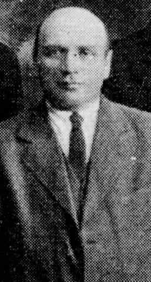

- Source: [archival record or issue](https://www.marxists.org/history/usa/pubs/labordefender/1930/v05n05-may-1930-LD.pdf#page=12)
- Credit: Labor Defender, May 1930, PDF page 12; International Labor Defense, publisher. Digitized issue supplied by Marxists Internet Archive / Riazanov Library; individual photographer not identified. Group photograph credited in print to Newark ILD.
- Rights: Photograph published in the United States in 1930; public domain in the United States by 2026. This statement concerns the historical published image, not newly authored archive website material.
- Identity: May 1930 printed page 89 (PDF page 12), A Reply to Hunger. Caption explicitly identifies Dominick Flaiani, fourth in the front row of the Newark group; the locality and 1930 prosecution agree with the existing profile.
- Download: [original source](https://www.marxists.org/history/usa/pubs/labordefender/1930/v05n05-may-1930-LD.pdf)
- Preserved original: [batch263-originals/1930-may-p12-Im0.jpg](batch263-originals/1930-may-p12-Im0.jpg)
- Counterclockwise rotation before crop: 270 degrees. Crop box: `[2132, 2642, 2387, 3117]` (left, top, exclusive right, exclusive bottom in rotated image); source dimensions: `[4755, 3523]`.
- Source SHA-256: `b6d73d1ebeb39ce3d2edc7c0c1f7bbcc1fdc57860052e5f10e6660cbd06b198a`
- Portrait SHA-256: `d7b1b14bee8a3db4e8881ce8d0c4e30eae5f592995ba70484fde83fc17a3d05c`

## Dozier Will Graham

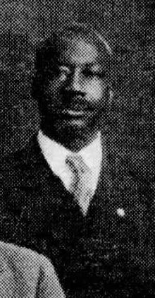

- Source: [archival record or issue](https://www.marxists.org/history/usa/pubs/labordefender/1930/v05n05-may-1930-LD.pdf#page=12)
- Credit: Labor Defender, May 1930, PDF page 12; International Labor Defense, publisher. Digitized issue supplied by Marxists Internet Archive / Riazanov Library; individual photographer not identified. Group photograph credited in print to Newark ILD.
- Rights: Photograph published in the United States in 1930; public domain in the United States by 2026. This statement concerns the historical published image, not newly authored archive website material.
- Identity: May 1930 printed page 89 (PDF page 12), A Reply to Hunger. Caption explicitly identifies D. W. Graham, third in the rear row of the Newark group; the locality and 1930 prosecution agree with the existing profile.
- Download: [original source](https://www.marxists.org/history/usa/pubs/labordefender/1930/v05n05-may-1930-LD.pdf)
- Preserved original: [batch263-originals/1930-may-p12-Im0.jpg](batch263-originals/1930-may-p12-Im0.jpg)
- Counterclockwise rotation before crop: 270 degrees. Crop box: `[2343, 2479, 2563, 2901]` (left, top, exclusive right, exclusive bottom in rotated image); source dimensions: `[4755, 3523]`.
- Source SHA-256: `b6d73d1ebeb39ce3d2edc7c0c1f7bbcc1fdc57860052e5f10e6660cbd06b198a`
- Portrait SHA-256: `b6e5db591ffeadd1680c4bfabdeb3a774a3623f023a2937a655c4ff13caeb821`

## Earl Whitten

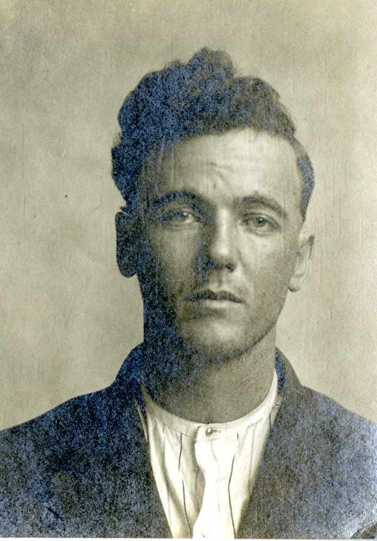

- Source: [archival record or issue](https://catalog.archives.gov/id/83858442)
- Credit: U.S. Penitentiary, Leavenworth booking photograph; National Archives at Kansas City, Record Group 129, series 571125, inmate 12006.
- Rights: U.S. federal-government prison photograph, public domain in the United States. NARA catalogs this photographic item as Unrestricted for use and access; individual photographer not identified.
- Identity: NARA catalogs this image as Photograph of Earl Whitten, Leavenworth inmate 12006. The named photographic record and identifying inscriptions were checked against the existing wartime prisoner profile. The frontal image is cropped from the right.
- Download: [original source](https://catalog.archives.gov/medialz/kansas-city/rg-129/571125/571125_12006-EarlWhitten_001.jpg)
- Preserved original: [batch263-originals/571125_12006-EarlWhitten_001.jpg](batch263-originals/571125_12006-EarlWhitten_001.jpg)
- Counterclockwise rotation before crop: 0 degrees. Crop box: `[615, 0, 1231, 884]` (left, top, exclusive right, exclusive bottom in rotated image); source dimensions: `[1231, 884]`.
- Source SHA-256: `1c67860dc57303a5713dde2b7d61e6052f67cd94535abd64393c723ae4aefdf1`
- Portrait SHA-256: `8e81112019e2f7e86549b8df8797c6fb70fe3b0da34b4d847e0c35cada594450`
- Identifying reverse: [batch263-originals/571125_12006-EarlWhitten_002.jpg](batch263-originals/571125_12006-EarlWhitten_002.jpg)

## Eddie Maleski

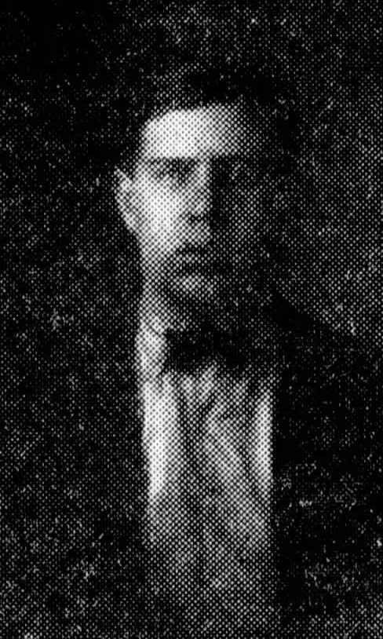

- Source: [archival record or issue](https://www.marxists.org/history/usa/pubs/labordefender/1926/v01n04-apr-1926-ORIG-LD.pdf#page=5)
- Credit: Labor Defender, Apr 1926, PDF page 5; International Labor Defense, publisher. Digitized issue supplied by Marxists Internet Archive / Riazanov Library; individual photographer not identified.
- Rights: Photograph published in the United States in 1926; public domain in the United States by 2026. This statement concerns the historical published image, not newly authored archive website material.
- Identity: Caption identifies this miner as fifth from the left in Six of the Convicted Miners, April 1926 printed page 53 (PDF page 5). Name and Zeigler case agree with the existing profile.
- Download: [original source](https://www.marxists.org/history/usa/pubs/labordefender/1926/v01n04-apr-1926-ORIG-LD.pdf)
- Preserved original: [batch263-originals/apr-p5-Im0.jpg](batch263-originals/apr-p5-Im0.jpg)
- Counterclockwise rotation before crop: 90 degrees. Crop box: `[2968, 4977, 3456, 5791]` (left, top, exclusive right, exclusive bottom in rotated image); source dimensions: `[7239, 5311]`.
- Source SHA-256: `6a4678663b1289d15bbae60fddcbf9d0527e88ee651613822f328b30ce93977c`
- Portrait SHA-256: `0e0b34316973721649e04c02f5ddb42a1ba8c387a489284034425dd351d1c898`

## Edgar Combs

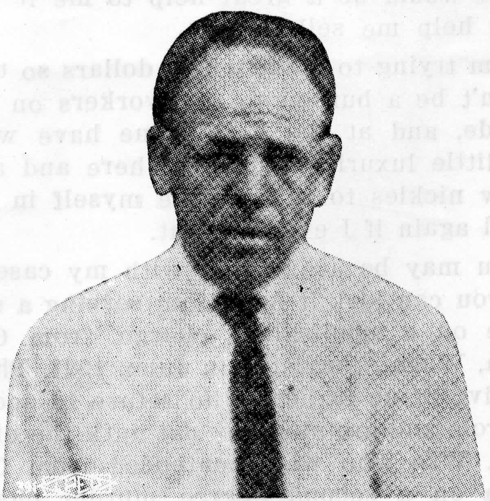

- Source: [archival record or issue](https://www.marxists.org/history/usa/pubs/labordefender/1926/v01n09-sep-1926-ORIG-LD.pdf#page=25)
- Credit: Labor Defender, Sep 1926, PDF page 25; International Labor Defense, publisher. Digitized issue supplied by Marxists Internet Archive / Riazanov Library; individual photographer not identified.
- Rights: Photograph published in the United States in 1926; public domain in the United States by 2026. This statement concerns the historical published image, not newly authored archive website material.
- Identity: Individually captioned Edgar Combs, September 1926 PDF page 25. The accompanying letter identifies Moundsville, West Virginia, matching the existing case.
- Download: [original source](https://www.marxists.org/history/usa/pubs/labordefender/1926/v01n09-sep-1926-ORIG-LD.pdf)
- Preserved original: [batch263-originals/sep-p25-Im0.jpg](batch263-originals/sep-p25-Im0.jpg)
- Counterclockwise rotation before crop: 270 degrees. Crop box: `[155, 72, 1360, 1304]` (left, top, exclusive right, exclusive bottom in rotated image); source dimensions: `[1520, 1548]`.
- Source SHA-256: `8ca4f28b1d0590e6b306c0dea711ff135b1712d330fa37c39d08b392be507115`
- Portrait SHA-256: `42089fa4d750c4c97892c0cf34b12ea4cc96f7c8640ed79290b5865f6f07e653`

## Edward Hamilton

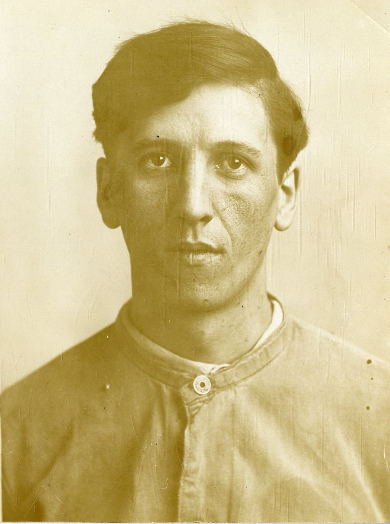

- Source: [archival record or issue](https://catalog.archives.gov/id/117703317)
- Credit: U.S. Penitentiary, Leavenworth booking photograph; National Archives at Kansas City, Record Group 129, series 571125, inmate 13128.
- Rights: U.S. federal-government prison photograph, public domain in the United States. NARA catalogs this photographic item as Unrestricted for use and access; individual photographer not identified.
- Identity: NARA catalogs this image as Photograph of Ed Hamilton, Leavenworth inmate 13128. The named photographic record and identifying inscriptions were checked against the existing wartime prisoner profile. The frontal image is cropped from the right. The Chicago IWW name/inmate-number roster reproduced by NARA in its October 2017 newsletter corroborates this group: https://www.archives.gov/files/kansas-city/press/newsletter/2017-october.pdf#page=6 . Catalog spelling/expanded name is preserved in the source title; existing display name Edward Hamilton remains unchanged. The matching incarceration context was checked before selecting the portrait.
- Download: [original source](https://catalog.archives.gov/medialz/kansas-city/rg-129/571125/571125_13128-EdHamilton_001.jpg)
- Preserved original: [batch263-originals/571125_13128-EdHamilton_001.jpg](batch263-originals/571125_13128-EdHamilton_001.jpg)
- Counterclockwise rotation before crop: 0 degrees. Crop box: `[658, 0, 1317, 885]` (left, top, exclusive right, exclusive bottom in rotated image); source dimensions: `[1317, 885]`.
- Source SHA-256: `fb448ac82cabe1f845b33fb7b4ee1a9c5fe545ce8a8261bb3cbc47a609174b41`
- Portrait SHA-256: `2e4e6ee9bc3f4022a2a810bbecc139797ee3f79e33bddefb906ac7901be02cfe`
- Identifying reverse: [batch263-originals/571125_13128-EdHamilton_002.jpg](batch263-originals/571125_13128-EdHamilton_002.jpg)

## Edward S. Carey

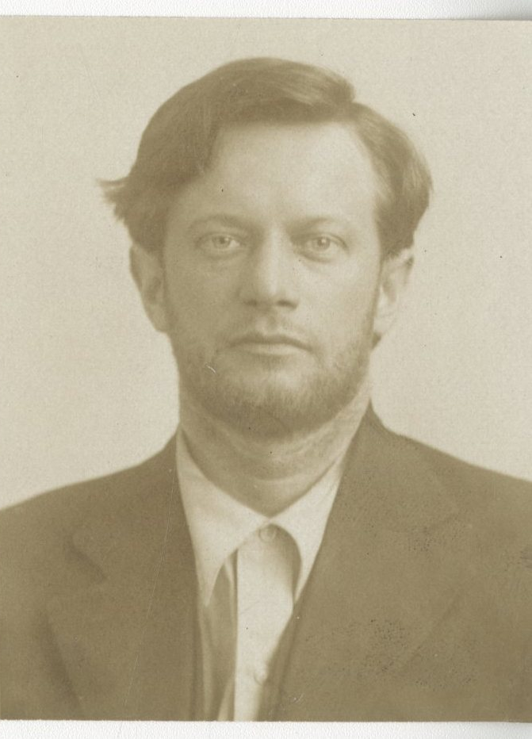

- Source: [archival record or issue](https://catalog.archives.gov/id/117719374)
- Credit: U.S. Penitentiary, Leavenworth booking photograph; National Archives at Kansas City, Record Group 129, series 571125, inmate 13585.
- Rights: U.S. federal-government prison photograph, public domain in the United States. NARA catalogs this photographic item as Unrestricted for use and access; individual photographer not identified.
- Identity: NARA catalogs this image as Photograph of Edward S. Carey, Leavenworth inmate 13585. The named photographic record and identifying inscriptions were checked against the existing wartime prisoner profile. The frontal image is cropped from the right.
- Download: [original source](https://catalog.archives.gov/medialz/kansas-city/rg-129/571125/571125_13585-EdwardCarey_001.jpg)
- Preserved original: [batch263-originals/571125_13585-EdwardCarey_001.jpg](batch263-originals/571125_13585-EdwardCarey_001.jpg)
- Counterclockwise rotation before crop: 0 degrees. Crop box: `[670, 0, 1341, 932]` (left, top, exclusive right, exclusive bottom in rotated image); source dimensions: `[1341, 932]`.
- Source SHA-256: `c0178f0bd211bebe17f02a148a1dcdc4c4452c21cb137de1d64f6e34d3c4f64f`
- Portrait SHA-256: `aa049432dad315428950550b66fd183c9c50bd4bdbfe7a030e544a7a2bdf138a`
- Identifying reverse: [batch263-originals/571125_13585-EdwardCarey_002.jpg](batch263-originals/571125_13585-EdwardCarey_002.jpg)

## Edward Salzer

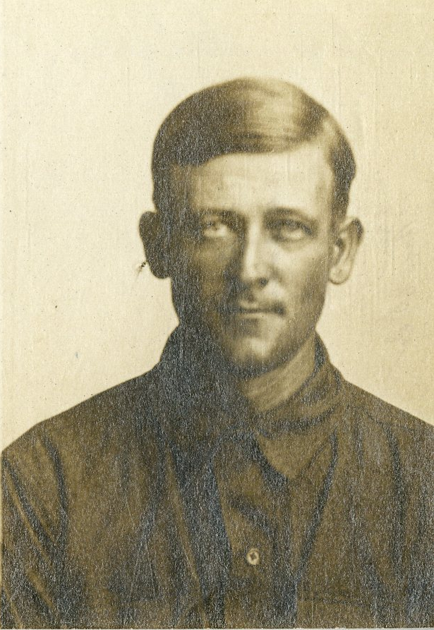

- Source: [archival record or issue](https://catalog.archives.gov/id/117702618)
- Credit: U.S. Penitentiary, Leavenworth booking photograph; National Archives at Kansas City, Record Group 129, series 571125, inmate 12906.
- Rights: U.S. federal-government prison photograph, public domain in the United States. NARA catalogs this photographic item as Unrestricted for use and access; individual photographer not identified.
- Identity: NARA catalogs this image as Photograph of Edward Salzer, Leavenworth inmate 12906. The named photographic record and identifying inscriptions were checked against the existing wartime prisoner profile. The frontal image is cropped from the right.
- Download: [original source](https://catalog.archives.gov/medialz/kansas-city/rg-129/571125/571125_12906-EdwardSalzer_001.jpg)
- Preserved original: [batch263-originals/571125_12906-EdwardSalzer_001.jpg](batch263-originals/571125_12906-EdwardSalzer_001.jpg)
- Counterclockwise rotation before crop: 0 degrees. Crop box: `[614, 0, 1229, 893]` (left, top, exclusive right, exclusive bottom in rotated image); source dimensions: `[1229, 893]`.
- Source SHA-256: `993bbb9a6374fa75282d12b7f8171f2af51b63d44d9c0a2c132c0ece476b2e83`
- Portrait SHA-256: `57c4f3ee9c8dcadb9f344cb9d4dc0df868b4bf127f4d964de1b226fb2e8094d7`
- Identifying reverse: [batch263-originals/571125_12906-EdwardSalzer_002.jpg](batch263-originals/571125_12906-EdwardSalzer_002.jpg)

## Emil Schiller

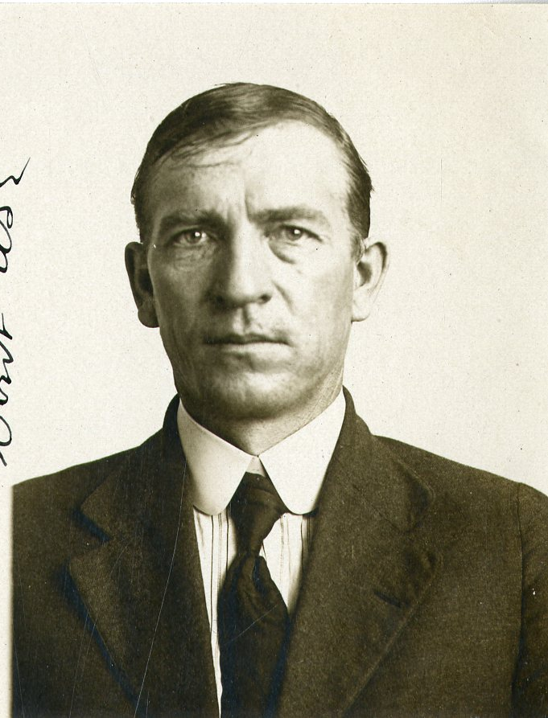

- Source: [archival record or issue](https://catalog.archives.gov/id/117703151)
- Credit: U.S. Penitentiary, Leavenworth booking photograph; National Archives at Kansas City, Record Group 129, series 571125, inmate 13070.
- Rights: U.S. federal-government prison photograph, public domain in the United States. NARA catalogs this photographic item as Unrestricted for use and access; individual photographer not identified.
- Identity: NARA catalogs this image as Photograph of Emil Schiller, Leavenworth inmate 13070. The named photographic record and identifying inscriptions were checked against the existing wartime prisoner profile. The frontal image is cropped from the right.
- Download: [original source](https://catalog.archives.gov/medialz/kansas-city/rg-129/571125/571125_13070-EmilSchiller_001.jpg)
- Preserved original: [batch263-originals/571125_13070-EmilSchiller_001.jpg](batch263-originals/571125_13070-EmilSchiller_001.jpg)
- Counterclockwise rotation before crop: 0 degrees. Crop box: `[680, 0, 1361, 893]` (left, top, exclusive right, exclusive bottom in rotated image); source dimensions: `[1361, 893]`.
- Source SHA-256: `421f60f165739fbc2c2235f7aee529e62d9f9789f48b10cc30e3425ba07e3ac5`
- Portrait SHA-256: `e4974e52bc14f89f3ad5750a729bfd82686304dc03bf7ab4f6a7f906aeaf2399`
- Identifying reverse: [batch263-originals/571125_13070-EmilSchiller_002.jpg](batch263-originals/571125_13070-EmilSchiller_002.jpg)

## Erwin Schwaer

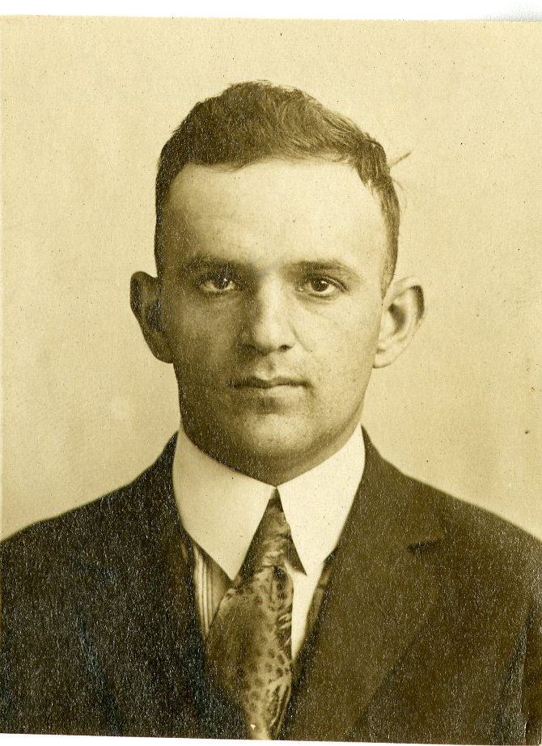

- Source: [archival record or issue](https://catalog.archives.gov/id/117701758)
- Credit: U.S. Penitentiary, Leavenworth booking photograph; National Archives at Kansas City, Record Group 129, series 571125, inmate 12648.
- Rights: U.S. federal-government prison photograph, public domain in the United States. NARA catalogs this photographic item as Unrestricted for use and access; individual photographer not identified.
- Identity: NARA catalogs this image as Photograph of Erwin Schwaer, Leavenworth inmate 12648. The named photographic record and identifying inscriptions were checked against the existing wartime prisoner profile. The frontal image is cropped from the right.
- Download: [original source](https://catalog.archives.gov/medialz/kansas-city/rg-129/571125/571125_12648-ErwinSchwaer_001.jpg)
- Preserved original: [batch263-originals/571125_12648-ErwinSchwaer_001.jpg](batch263-originals/571125_12648-ErwinSchwaer_001.jpg)
- Counterclockwise rotation before crop: 0 degrees. Crop box: `[669, 0, 1339, 922]` (left, top, exclusive right, exclusive bottom in rotated image); source dimensions: `[1339, 922]`.
- Source SHA-256: `27e4a5e9d5d10fd14675fd4c5498722bf93720ca53abedaa68c346c7ccf3e949`
- Portrait SHA-256: `ba0dd9b13af01121117998018ef5859abfec5ba6e8a44962aed88756bcfd355b`
- Identifying reverse: [batch263-originals/571125_12648-ErwinSchwaer_002.jpg](batch263-originals/571125_12648-ErwinSchwaer_002.jpg)

## Everett G. Engelin

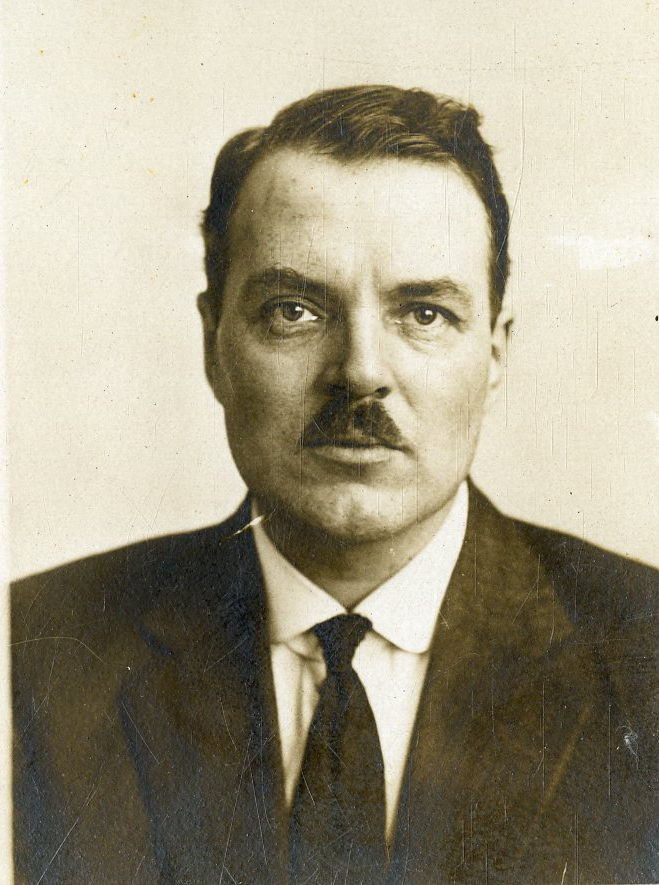

- Source: [archival record or issue](https://catalog.archives.gov/id/117703072)
- Credit: U.S. Penitentiary, Leavenworth booking photograph; National Archives at Kansas City, Record Group 129, series 571125, inmate 13047.
- Rights: U.S. federal-government prison photograph, public domain in the United States. NARA catalogs this photographic item as Unrestricted for use and access; individual photographer not identified.
- Identity: NARA catalogs this image as Photograph of Everett G. Engelin, Leavenworth inmate 13047. The named photographic record and identifying inscriptions were checked against the existing wartime prisoner profile. The frontal image is cropped from the right.
- Download: [original source](https://catalog.archives.gov/medialz/kansas-city/rg-129/571125/571125_13047-EverettGEngelin_001.jpg)
- Preserved original: [batch263-originals/571125_13047-EverettGEngelin_001.jpg](batch263-originals/571125_13047-EverettGEngelin_001.jpg)
- Counterclockwise rotation before crop: 0 degrees. Crop box: `[658, 0, 1317, 885]` (left, top, exclusive right, exclusive bottom in rotated image); source dimensions: `[1317, 885]`.
- Source SHA-256: `f129ac80f07b03fa8e59db1abf1235800d09389e4c66042963c9538e27d6a84c`
- Portrait SHA-256: `3323e7244ead1e303cc8deb84db2d784451234ab147698f6ff8785f0c298122d`
- Identifying reverse: [batch263-originals/571125_13047-EverettGEngelin_002.jpg](batch263-originals/571125_13047-EverettGEngelin_002.jpg)

## Felix Cedene

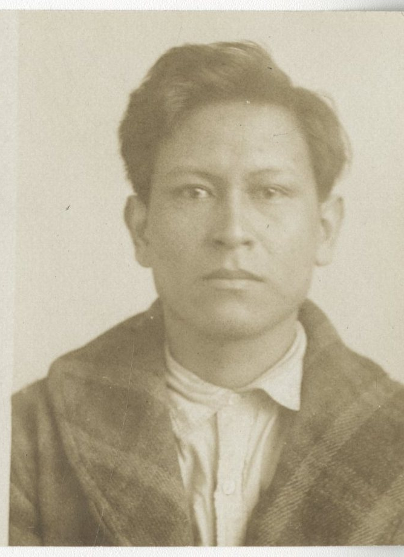

- Source: [archival record or issue](https://catalog.archives.gov/id/117719398)
- Credit: U.S. Penitentiary, Leavenworth booking photograph; National Archives at Kansas City, Record Group 129, series 571125, inmate 13594.
- Rights: U.S. federal-government prison photograph, public domain in the United States. NARA catalogs this photographic item as Unrestricted for use and access; individual photographer not identified.
- Identity: NARA catalogs this image as Photograph of Felix Cedeno, Leavenworth inmate 13594. The named photographic record and identifying inscriptions were checked against the existing wartime prisoner profile. The frontal image is cropped from the right. Catalog spelling/expanded name is preserved in the source title; existing display name Felix Cedene remains unchanged. The matching incarceration context was checked before selecting the portrait.
- Download: [original source](https://catalog.archives.gov/medialz/kansas-city/rg-129/571125/571125_13594-FelixCedeno_001.jpg)
- Preserved original: [batch263-originals/571125_13594-FelixCedeno_001.jpg](batch263-originals/571125_13594-FelixCedeno_001.jpg)
- Counterclockwise rotation before crop: 0 degrees. Crop box: `[667, 0, 1335, 921]` (left, top, exclusive right, exclusive bottom in rotated image); source dimensions: `[1335, 921]`.
- Source SHA-256: `dd349a8ecb268e5446226b95676235e2e3bb54cc8f88068598edbbb1ce0e863f`
- Portrait SHA-256: `7a19d393f4f8bf002160dd7670adb18978e8959b1145b1de6baed2d611faee5b`
- Identifying reverse: [batch263-originals/571125_13594-FelixCedeno_002.jpg](batch263-originals/571125_13594-FelixCedeno_002.jpg)

## Francis X. Schilling

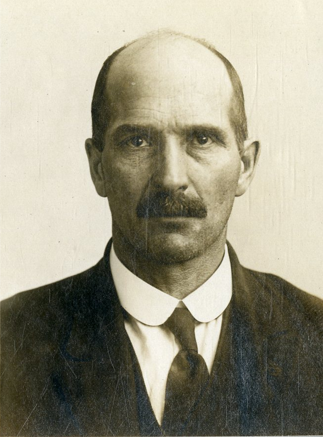

- Source: [archival record or issue](https://catalog.archives.gov/id/117704018)
- Credit: U.S. Penitentiary, Leavenworth booking photograph; National Archives at Kansas City, Record Group 129, series 571125, inmate 13366.
- Rights: U.S. federal-government prison photograph, public domain in the United States. NARA catalogs this photographic item as Unrestricted for use and access; individual photographer not identified.
- Identity: NARA catalogs this image as Photograph of Francis Xavier Schilling, Leavenworth inmate 13366. The named photographic record and identifying inscriptions were checked against the existing wartime prisoner profile. The frontal image is cropped from the right. Catalog spelling/expanded name is preserved in the source title; existing display name Francis X. Schilling remains unchanged. The matching incarceration context was checked before selecting the portrait.
- Download: [original source](https://catalog.archives.gov/medialz/kansas-city/rg-129/571125/571125_13366-FrancisXavierSchilling_001.jpg)
- Preserved original: [batch263-originals/571125_13366-FrancisXavierSchilling_001.jpg](batch263-originals/571125_13366-FrancisXavierSchilling_001.jpg)
- Counterclockwise rotation before crop: 0 degrees. Crop box: `[655, 0, 1310, 885]` (left, top, exclusive right, exclusive bottom in rotated image); source dimensions: `[1310, 885]`.
- Source SHA-256: `fee9371409dbe81c61fa98a441d0db15967a626df1b60f966458336a3eee5aed`
- Portrait SHA-256: `4693b961315bd9d2a86c83c0016979a2b24eec3f357bf8ba936979c6c4258c4a`
- Identifying reverse: [batch263-originals/571125_13366-FrancisXavierSchilling_002.jpg](batch263-originals/571125_13366-FrancisXavierSchilling_002.jpg)

## Frank Corbishley

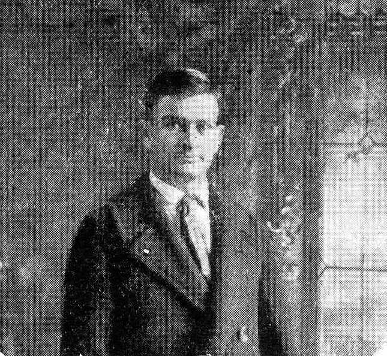

- Source: [archival record or issue](https://www.marxists.org/history/usa/pubs/labordefender/1926/v01n01-jan-1926-LD.pdf#page=6)
- Credit: Labor Defender, Jan 1926, PDF page 6; International Labor Defense, publisher. Digitized issue supplied by Marxists Internet Archive / Riazanov Library; individual photographer not identified.
- Rights: Photograph published in the United States in 1926; public domain in the United States by 2026. This statement concerns the historical published image, not newly authored archive website material.
- Identity: Individually captioned Frank Corbishley, Framed Up on Murder Charge, January 1926 printed page 5 (PDF page 6).
- Download: [original source](https://www.marxists.org/history/usa/pubs/labordefender/1926/v01n01-jan-1926-LD.pdf)
- Preserved original: [batch263-originals/jan-p6-Im0.jpg](batch263-originals/jan-p6-Im0.jpg)
- Counterclockwise rotation before crop: 270 degrees. Crop box: `[1781, 498, 2426, 1092]` (left, top, exclusive right, exclusive bottom in rotated image); source dimensions: `[3560, 2642]`.
- Source SHA-256: `b59208a4bd1e79c27babc8b249bdf05b8466de357dd081f36c96c2bf49fe631c`
- Portrait SHA-256: `354d5c1318aba907fcc7214b51674b66352c58f09bfbf05fd311fb79fcd62c4f`

## Frank Knapp

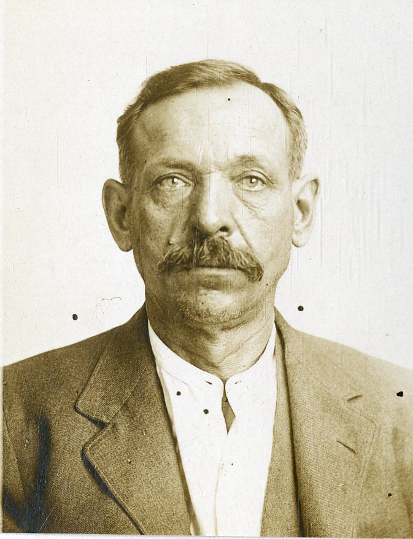

- Source: [archival record or issue](https://catalog.archives.gov/id/117702563)
- Credit: U.S. Penitentiary, Leavenworth booking photograph; National Archives at Kansas City, Record Group 129, series 571125, inmate 12890.
- Rights: U.S. federal-government prison photograph, public domain in the United States. NARA catalogs this photographic item as Unrestricted for use and access; individual photographer not identified.
- Identity: NARA catalogs this image as Photograph of Frank Knapp, Leavenworth inmate 12890. The named photographic record and identifying inscriptions were checked against the existing wartime prisoner profile. The frontal image is cropped from the right.
- Download: [original source](https://catalog.archives.gov/medialz/kansas-city/rg-129/571125/571125_12890-FrankKnapp_001.jpg)
- Preserved original: [batch263-originals/571125_12890-FrankKnapp_001.jpg](batch263-originals/571125_12890-FrankKnapp_001.jpg)
- Counterclockwise rotation before crop: 0 degrees. Crop box: `[673, 0, 1346, 878]` (left, top, exclusive right, exclusive bottom in rotated image); source dimensions: `[1346, 878]`.
- Source SHA-256: `ed7d77324b64eb236f095198a34874353fc13575eb694bfab5d1f334d75970fc`
- Portrait SHA-256: `5ea472eb7540567406f94e5689da79433906202c5807a613ee390e65d16b7d54`
- Identifying reverse: [batch263-originals/571125_12890-FrankKnapp_002.jpg](batch263-originals/571125_12890-FrankKnapp_002.jpg)

## Frank Monparler

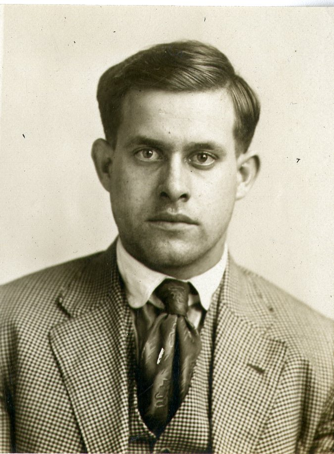

- Source: [archival record or issue](https://catalog.archives.gov/id/117703118)
- Credit: U.S. Penitentiary, Leavenworth booking photograph; National Archives at Kansas City, Record Group 129, series 571125, inmate 13061.
- Rights: U.S. federal-government prison photograph, public domain in the United States. NARA catalogs this photographic item as Unrestricted for use and access; individual photographer not identified.
- Identity: NARA catalogs this image as Photograph of Frank Monparler, Leavenworth inmate 13061. The named photographic record and identifying inscriptions were checked against the existing wartime prisoner profile. The frontal image is cropped from the right.
- Download: [original source](https://catalog.archives.gov/medialz/kansas-city/rg-129/571125/571125_13061-FrankMonparler_001.jpg)
- Preserved original: [batch263-originals/571125_13061-FrankMonparler_001.jpg](batch263-originals/571125_13061-FrankMonparler_001.jpg)
- Counterclockwise rotation before crop: 0 degrees. Crop box: `[673, 0, 1346, 915]` (left, top, exclusive right, exclusive bottom in rotated image); source dimensions: `[1346, 915]`.
- Source SHA-256: `93579153699d57a96f21cd7b666b50194b8b224d431cccb4ef49a9f9b85484e3`
- Portrait SHA-256: `4e42fe95936441eccdfb7899c74e446f8788fc95ef096282f23341dac990e4c7`
- Identifying reverse: [batch263-originals/571125_13061-FrankMonparler_002.jpg](batch263-originals/571125_13061-FrankMonparler_002.jpg)

## Frank Moran

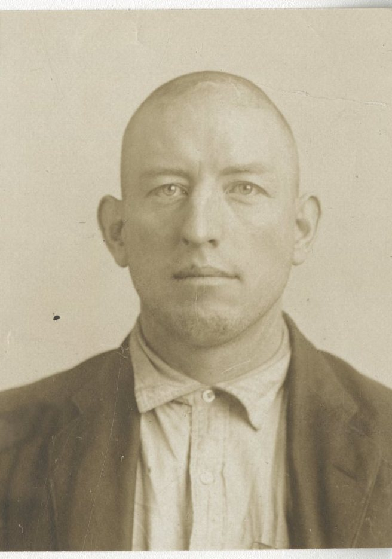

- Source: [archival record or issue](https://catalog.archives.gov/id/117719413)
- Credit: U.S. Penitentiary, Leavenworth booking photograph; National Archives at Kansas City, Record Group 129, series 571125, inmate 13597.
- Rights: U.S. federal-government prison photograph, public domain in the United States. NARA catalogs this photographic item as Unrestricted for use and access; individual photographer not identified.
- Identity: NARA catalogs this image as Photograph of Frank Moran, Leavenworth inmate 13597. The named photographic record and identifying inscriptions were checked against the existing wartime prisoner profile. The frontal image is cropped from the right. Catalog and front identify inmate 13597; the reverse appears to read 13599, an archival numbering discrepancy retained for review. Both name Frank Moran; the January 1919 admission cohort agrees with the existing January 17, 1919 incarceration.
- Download: [original source](https://catalog.archives.gov/medialz/kansas-city/rg-129/571125/571125_13597-FrankMoran_001.jpg)
- Preserved original: [batch263-originals/571125_13597-FrankMoran_001.jpg](batch263-originals/571125_13597-FrankMoran_001.jpg)
- Counterclockwise rotation before crop: 0 degrees. Crop box: `[656, 0, 1312, 935]` (left, top, exclusive right, exclusive bottom in rotated image); source dimensions: `[1312, 935]`.
- Source SHA-256: `a10ff3b7fd1bd38ca31b9920fac3057117917237f4812828a28dd974da8a58eb`
- Portrait SHA-256: `88d163551c1b1ceb371f432b65e1f993f44f8c6b96df0e2c2a62cde084a80b80`
- Identifying reverse: [batch263-originals/571125_13597-FrankMoran_002.jpg](batch263-originals/571125_13597-FrankMoran_002.jpg)

## Frank Reilly

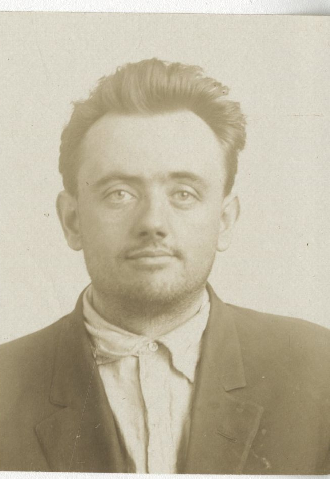

- Source: [archival record or issue](https://catalog.archives.gov/id/117719416)
- Credit: U.S. Penitentiary, Leavenworth booking photograph; National Archives at Kansas City, Record Group 129, series 571125, inmate 13598.
- Rights: U.S. federal-government prison photograph, public domain in the United States. NARA catalogs this photographic item as Unrestricted for use and access; individual photographer not identified.
- Identity: NARA catalogs this image as Photograph of Frank Reilly, Leavenworth inmate 13598. The named photographic record and identifying inscriptions were checked against the existing wartime prisoner profile. The frontal image is cropped from the right.
- Download: [original source](https://catalog.archives.gov/medialz/kansas-city/rg-129/571125/571125_13598-FrakReilly_001.jpg)
- Preserved original: [batch263-originals/571125_13598-FrakReilly_001.jpg](batch263-originals/571125_13598-FrakReilly_001.jpg)
- Counterclockwise rotation before crop: 0 degrees. Crop box: `[655, 0, 1310, 949]` (left, top, exclusive right, exclusive bottom in rotated image); source dimensions: `[1310, 949]`.
- Source SHA-256: `7a4a5ff1702ff228b582459955d728d9cbf6d4819cbb6281ca41cdcdebcf2b04`
- Portrait SHA-256: `92a903147e4b10e5c34eb7db483e3aa3b9349b6f262c2fce39f6c3d7c7845ddc`
- Identifying reverse: [batch263-originals/571125_13598-FrakReilly_002.jpg](batch263-originals/571125_13598-FrakReilly_002.jpg)

## Fred Nelson

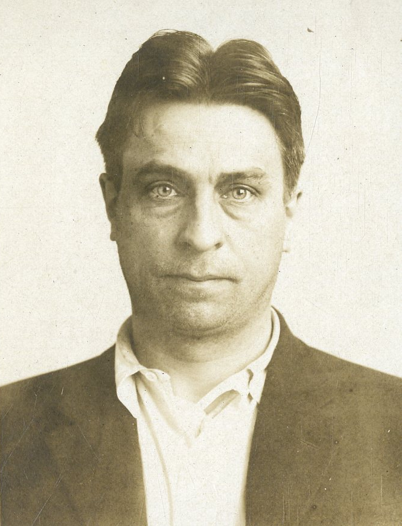

- Source: [archival record or issue](https://catalog.archives.gov/id/117703482)
- Credit: U.S. Penitentiary, Leavenworth booking photograph; National Archives at Kansas City, Record Group 129, series 571125, inmate 13191.
- Rights: U.S. federal-government prison photograph, public domain in the United States. NARA catalogs this photographic item as Unrestricted for use and access; individual photographer not identified.
- Identity: NARA catalogs this image as Photograph of Fred Nelson, Leavenworth inmate 13191. The named photographic record and identifying inscriptions were checked against the existing wartime prisoner profile. The frontal image is cropped from the right. The Chicago IWW name/inmate-number roster reproduced by NARA in its October 2017 newsletter corroborates this group: https://www.archives.gov/files/kansas-city/press/newsletter/2017-october.pdf#page=6 .
- Download: [original source](https://catalog.archives.gov/medialz/kansas-city/rg-129/571125/571125_13191-FredNelson_001.jpg)
- Preserved original: [batch263-originals/571125_13191-FredNelson_001.jpg](batch263-originals/571125_13191-FredNelson_001.jpg)
- Counterclockwise rotation before crop: 0 degrees. Crop box: `[666, 0, 1332, 871]` (left, top, exclusive right, exclusive bottom in rotated image); source dimensions: `[1332, 871]`.
- Source SHA-256: `161f8175c5a07724fbf53af6021fba5f706d56e65e40f7fce29d3843adfda1e8`
- Portrait SHA-256: `31a63d2ba0fb7648902dd4060f6c37347b5ed816b45deba38d1346fb7dc641f8`
- Identifying reverse: [batch263-originals/571125_13191-FredNelson_002.jpg](batch263-originals/571125_13191-FredNelson_002.jpg)

## G. A. Fanning

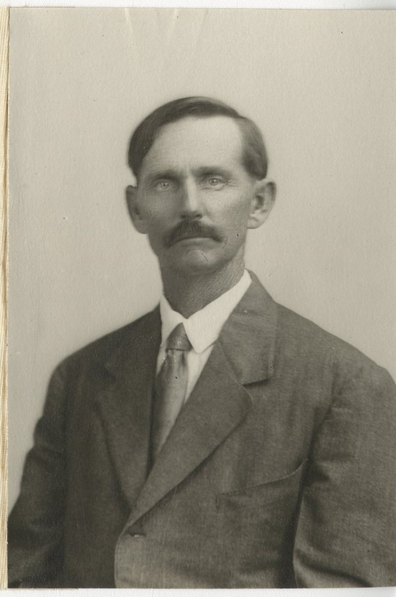

- Source: [archival record or issue](https://catalog.archives.gov/id/117719715)
- Credit: U.S. Penitentiary, Leavenworth booking photograph; National Archives at Kansas City, Record Group 129, series 571125, inmate 13689.
- Rights: U.S. federal-government prison photograph, public domain in the United States. NARA catalogs this photographic item as Unrestricted for use and access; individual photographer not identified.
- Identity: NARA catalogs this image as Photograph of G. A. Fanning, Leavenworth inmate 13689. The named photographic record and identifying inscriptions were checked against the existing wartime prisoner profile. The frontal image is cropped from the right.
- Download: [original source](https://catalog.archives.gov/medialz/kansas-city/rg-129/571125/571125_13689-GAFanning_001.jpg)
- Preserved original: [batch263-originals/571125_13689-GAFanning_001.jpg](batch263-originals/571125_13689-GAFanning_001.jpg)
- Counterclockwise rotation before crop: 0 degrees. Crop box: `[837, 0, 1675, 1263]` (left, top, exclusive right, exclusive bottom in rotated image); source dimensions: `[1675, 1263]`.
- Source SHA-256: `3449e3ac4c2eb173e95b97c3404cf4e7155bd58a95e6340fe5d7da943aa46211`
- Portrait SHA-256: `70bfe794ebe9a0f89a24bde2062ca1d3abc7777dcf726300672b2a612f9c5e8d`
- Identifying reverse: [batch263-originals/571125_13689-GAFanning_002.jpg](batch263-originals/571125_13689-GAFanning_002.jpg)

## G. W. Bouldin

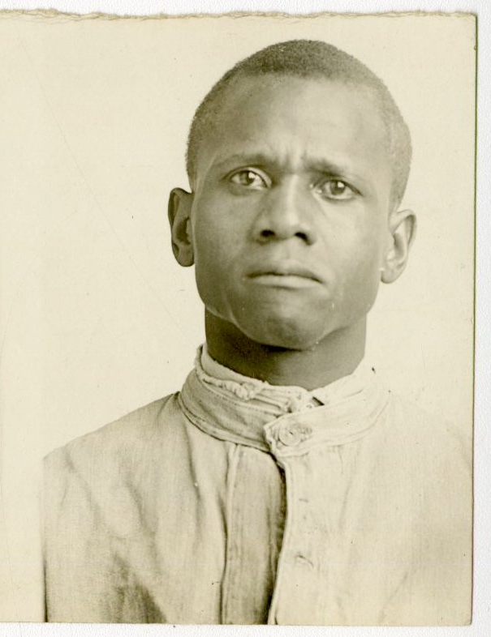

- Source: [archival record or issue](https://catalog.archives.gov/id/160924311)
- Credit: U.S. Penitentiary, Leavenworth booking photograph; National Archives at Kansas City, Record Group 129, series 571125, inmate 15402.
- Rights: U.S. federal-government prison photograph, public domain in the United States. NARA catalogs this photographic item as Unrestricted for use and access; individual photographer not identified.
- Identity: NARA catalogs this image as Photograph of G. W. Bouldin, Leavenworth inmate 15402. The named photographic record and identifying inscriptions were checked against the existing wartime prisoner profile. The frontal image is cropped from the right.
- Download: [original source](https://catalog.archives.gov/medialz/kansas-city/rg-129/571125/571125_15402-GWBouldin_001.jpg)
- Preserved original: [batch263-originals/571125_15402-GWBouldin_001.jpg](batch263-originals/571125_15402-GWBouldin_001.jpg)
- Counterclockwise rotation before crop: 0 degrees. Crop box: `[604, 0, 1209, 786]` (left, top, exclusive right, exclusive bottom in rotated image); source dimensions: `[1209, 786]`.
- Source SHA-256: `e8b47239344658ddd7ca240ed0606b93221c31eb19cdc1aacde36f49c937c405`
- Portrait SHA-256: `281116de5a0ffb716621291f3182214bb41dd972bd9655e650b007f306f6c316`
- Identifying reverse: [batch263-originals/571125_15402-GWBouldin_002.jpg](batch263-originals/571125_15402-GWBouldin_002.jpg)

## George Hardy

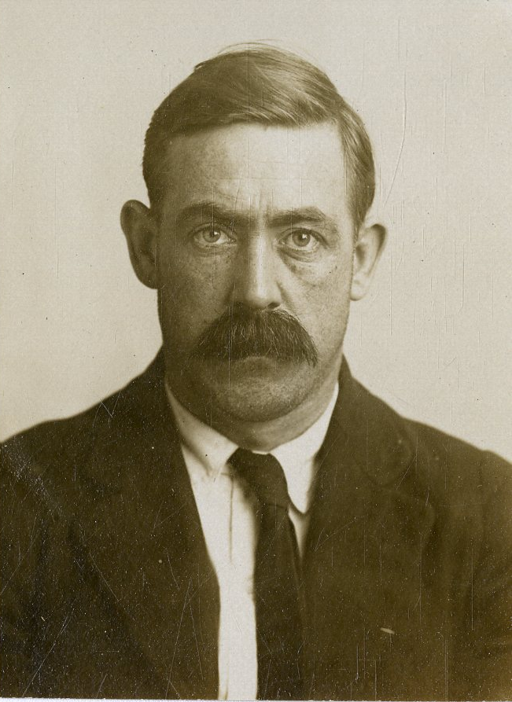

- Source: [archival record or issue](https://catalog.archives.gov/id/117703462)
- Credit: U.S. Penitentiary, Leavenworth booking photograph; National Archives at Kansas City, Record Group 129, series 571125, inmate 13187.
- Rights: U.S. federal-government prison photograph, public domain in the United States. NARA catalogs this photographic item as Unrestricted for use and access; individual photographer not identified.
- Identity: NARA catalogs this image as Photograph of George Hardy, Leavenworth inmate 13187. The named photographic record and identifying inscriptions were checked against the existing wartime prisoner profile. The frontal image is cropped from the right. The Chicago IWW name/inmate-number roster reproduced by NARA in its October 2017 newsletter corroborates this group: https://www.archives.gov/files/kansas-city/press/newsletter/2017-october.pdf#page=6 .
- Download: [original source](https://catalog.archives.gov/medialz/kansas-city/rg-129/571125/571125_13187-GeorgeHardy_001.jpg)
- Preserved original: [batch263-originals/571125_13187-GeorgeHardy_001.jpg](batch263-originals/571125_13187-GeorgeHardy_001.jpg)
- Counterclockwise rotation before crop: 0 degrees. Crop box: `[651, 0, 1302, 893]` (left, top, exclusive right, exclusive bottom in rotated image); source dimensions: `[1302, 893]`.
- Source SHA-256: `71fd552623d7308abb90b2713931e745f014a45979b5c99d3d35191d6743f645`
- Portrait SHA-256: `59dc7fe7ec6e63c447b94e5bd9007fad82c32f57308de40fd9b1e5653540ddfc`
- Identifying reverse: [batch263-originals/571125_13187-GeorgeHardy_002.jpg](batch263-originals/571125_13187-GeorgeHardy_002.jpg)

## George Speed

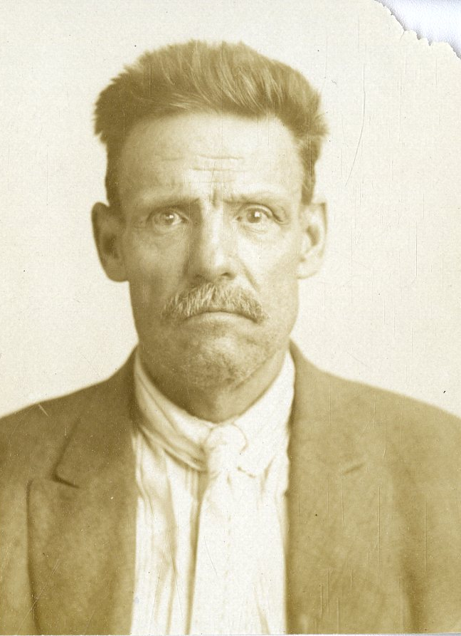

- Source: [archival record or issue](https://catalog.archives.gov/id/117703493)
- Credit: U.S. Penitentiary, Leavenworth booking photograph; National Archives at Kansas City, Record Group 129, series 571125, inmate 13194.
- Rights: U.S. federal-government prison photograph, public domain in the United States. NARA catalogs this photographic item as Unrestricted for use and access; individual photographer not identified.
- Identity: NARA catalogs this image as Photograph of George Speed, Leavenworth inmate 13194. The named photographic record and identifying inscriptions were checked against the existing wartime prisoner profile. The frontal image is cropped from the right. The Chicago IWW name/inmate-number roster reproduced by NARA in its October 2017 newsletter corroborates this group: https://www.archives.gov/files/kansas-city/press/newsletter/2017-october.pdf#page=6 .
- Download: [original source](https://catalog.archives.gov/medialz/kansas-city/rg-129/571125/571125_13194-GeorgeSpeed_001.jpg)
- Preserved original: [batch263-originals/571125_13194-GeorgeSpeed_001.jpg](batch263-originals/571125_13194-GeorgeSpeed_001.jpg)
- Counterclockwise rotation before crop: 0 degrees. Crop box: `[647, 0, 1295, 893]` (left, top, exclusive right, exclusive bottom in rotated image); source dimensions: `[1295, 893]`.
- Source SHA-256: `31a91ee65c40d724908d9195abd33dc8a35aa3e01762b85a16f2a4179ea21417`
- Portrait SHA-256: `17e5f3f923c347630807dc46d58aba0dfa556182860a1d0eb44cad460fcfa575`
- Identifying reverse: [batch263-originals/571125_13194-GeorgeSpeed_002.jpg](batch263-originals/571125_13194-GeorgeSpeed_002.jpg)

## George Yaeger

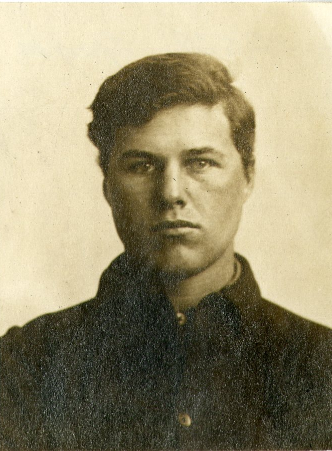

- Source: [archival record or issue](https://catalog.archives.gov/id/117701475)
- Credit: U.S. Penitentiary, Leavenworth booking photograph; National Archives at Kansas City, Record Group 129, series 571125, inmate 12569.
- Rights: U.S. federal-government prison photograph, public domain in the United States. NARA catalogs this photographic item as Unrestricted for use and access; individual photographer not identified.
- Identity: NARA catalogs this image as Photograph of George Yager, Leavenworth inmate 12569. The named photographic record and identifying inscriptions were checked against the existing wartime prisoner profile. The frontal image is cropped from the right. Catalog spelling/expanded name is preserved in the source title; existing display name George Yaeger remains unchanged. The matching incarceration context was checked before selecting the portrait.
- Download: [original source](https://catalog.archives.gov/medialz/kansas-city/rg-129/571125/571125_12569-GeorgeYager_001.jpg)
- Preserved original: [batch263-originals/571125_12569-GeorgeYager_001.jpg](batch263-originals/571125_12569-GeorgeYager_001.jpg)
- Counterclockwise rotation before crop: 0 degrees. Crop box: `[662, 0, 1324, 900]` (left, top, exclusive right, exclusive bottom in rotated image); source dimensions: `[1324, 900]`.
- Source SHA-256: `4489b5da995756a4daff5ca18c8522ea6adb1b2ea07049c69b6fb6dd14f472e1`
- Portrait SHA-256: `83c03b204fa2065ef175cfb355c50902e5749ecb17ded51925de994e4f5eb045`
- Identifying reverse: [batch263-originals/571125_12569-GeorgeYager_002.jpg](batch263-originals/571125_12569-GeorgeYager_002.jpg)

## H. F. Kane

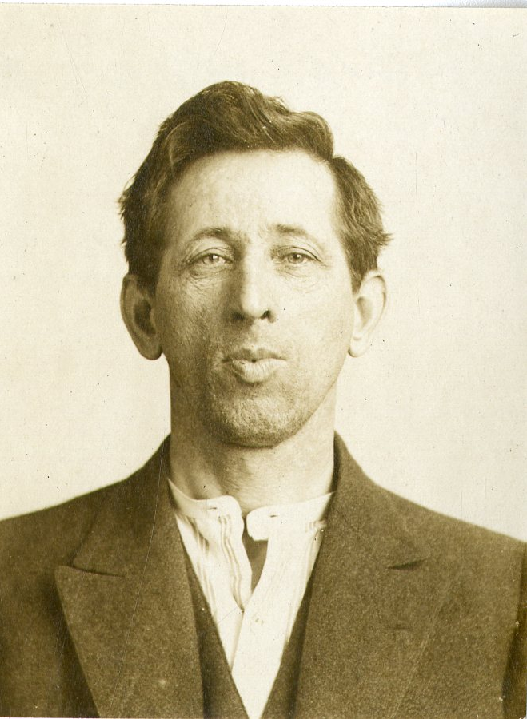

- Source: [archival record or issue](https://catalog.archives.gov/id/117703392)
- Credit: U.S. Penitentiary, Leavenworth booking photograph; National Archives at Kansas City, Record Group 129, series 571125, inmate 13161.
- Rights: U.S. federal-government prison photograph, public domain in the United States. NARA catalogs this photographic item as Unrestricted for use and access; individual photographer not identified.
- Identity: NARA catalogs this image as Photograph of H. F. Kane, Leavenworth inmate 13161. The named photographic record and identifying inscriptions were checked against the existing wartime prisoner profile. The frontal image is cropped from the right. The Chicago IWW name/inmate-number roster reproduced by NARA in its October 2017 newsletter corroborates this group: https://www.archives.gov/files/kansas-city/press/newsletter/2017-october.pdf#page=6 .
- Download: [original source](https://catalog.archives.gov/medialz/kansas-city/rg-129/571125/571125_13161-HFKane_001.jpg)
- Preserved original: [batch263-originals/571125_13161-HFKane_001.jpg](batch263-originals/571125_13161-HFKane_001.jpg)
- Counterclockwise rotation before crop: 0 degrees. Crop box: `[658, 0, 1317, 900]` (left, top, exclusive right, exclusive bottom in rotated image); source dimensions: `[1317, 900]`.
- Source SHA-256: `dea6d4d2a752f84616ee0b8360bd0171976bae8121c4423992d80b8410ba3fb3`
- Portrait SHA-256: `4292f819e1d82f63b5e2cb4d6044206b479014980d24609a42762557de4188e7`
- Identifying reverse: [batch263-originals/571125_13161-HFKane_002.jpg](batch263-originals/571125_13161-HFKane_002.jpg)

## Harold E. Bruber

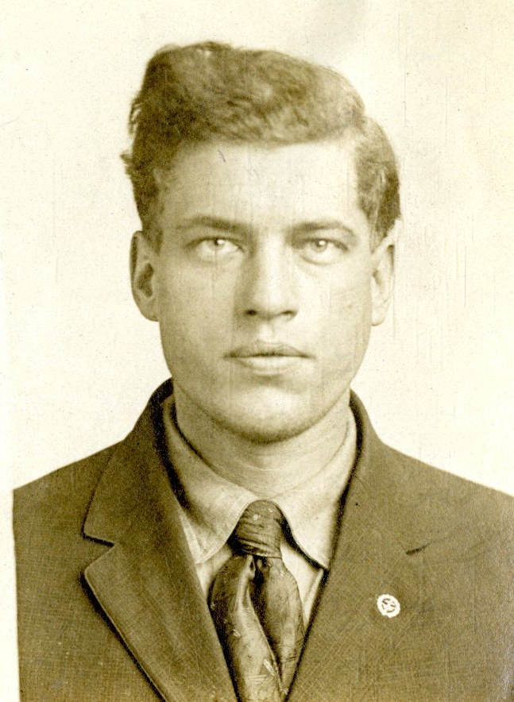

- Source: [archival record or issue](https://catalog.archives.gov/id/83859327)
- Credit: U.S. Penitentiary, Leavenworth booking photograph; National Archives at Kansas City, Record Group 129, series 571125, inmate 12314.
- Rights: U.S. federal-government prison photograph, public domain in the United States. NARA catalogs this photographic item as Unrestricted for use and access; individual photographer not identified.
- Identity: NARA catalogs this image as Photograph of Harold E. Bruder, Leavenworth inmate 12314. The named photographic record and identifying inscriptions were checked against the existing wartime prisoner profile. The frontal image is cropped from the right. Catalog spelling/expanded name is preserved in the source title; existing display name Harold E. Bruber remains unchanged. The matching incarceration context was checked before selecting the portrait.
- Download: [original source](https://catalog.archives.gov/medialz/kansas-city/rg-129/571125/571125_12314-HaroldEBruder_001.jpg)
- Preserved original: [batch263-originals/571125_12314-HaroldEBruder_001.jpg](batch263-originals/571125_12314-HaroldEBruder_001.jpg)
- Counterclockwise rotation before crop: 0 degrees. Crop box: `[646, 0, 1293, 884]` (left, top, exclusive right, exclusive bottom in rotated image); source dimensions: `[1293, 884]`.
- Source SHA-256: `10e4ae1716e244144f027472991a044a9b7ba0e515333ed530e6ceb637f520dc`
- Portrait SHA-256: `910697c279f9caa089c27bcc6eb9c8721a9825569751ed71878063ef4153e184`
- Identifying reverse: [batch263-originals/571125_12314-HaroldEBruder_002.jpg](batch263-originals/571125_12314-HaroldEBruder_002.jpg)

## Harry A. Latour

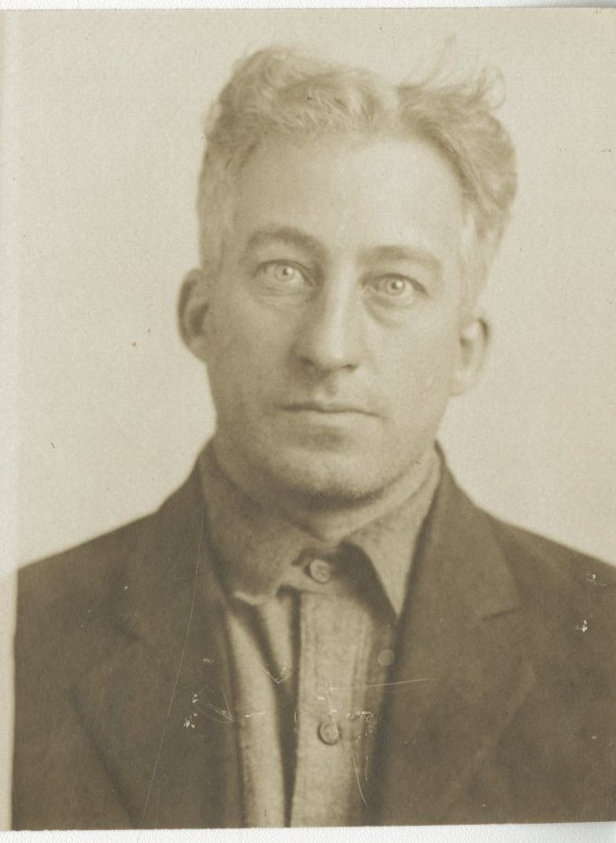

- Source: [archival record or issue](https://catalog.archives.gov/id/117719410)
- Credit: U.S. Penitentiary, Leavenworth booking photograph; National Archives at Kansas City, Record Group 129, series 571125, inmate 13596.
- Rights: U.S. federal-government prison photograph, public domain in the United States. NARA catalogs this photographic item as Unrestricted for use and access; individual photographer not identified.
- Identity: NARA catalogs this image as Photograph of Harry A. Latour, Leavenworth inmate 13596. The named photographic record and identifying inscriptions were checked against the existing wartime prisoner profile. The frontal image is cropped from the right.
- Download: [original source](https://catalog.archives.gov/medialz/kansas-city/rg-129/571125/571125_13596-HarryLatour_001.jpg)
- Preserved original: [batch263-originals/571125_13596-HarryLatour_001.jpg](batch263-originals/571125_13596-HarryLatour_001.jpg)
- Counterclockwise rotation before crop: 0 degrees. Crop box: `[675, 0, 1350, 923]` (left, top, exclusive right, exclusive bottom in rotated image); source dimensions: `[1350, 923]`.
- Source SHA-256: `be25bc0d4a99bcea39fcddc9813b48eab5e07387fddc75d484e576dd31e5d102`
- Portrait SHA-256: `8f189826da9b608396864eedfba3e16bad9f7eafefda6916f9aea924b94a2f25`
- Identifying reverse: [batch263-originals/571125_13596-HarryLatour_002.jpg](batch263-originals/571125_13596-HarryLatour_002.jpg)

## Henry Brinkman

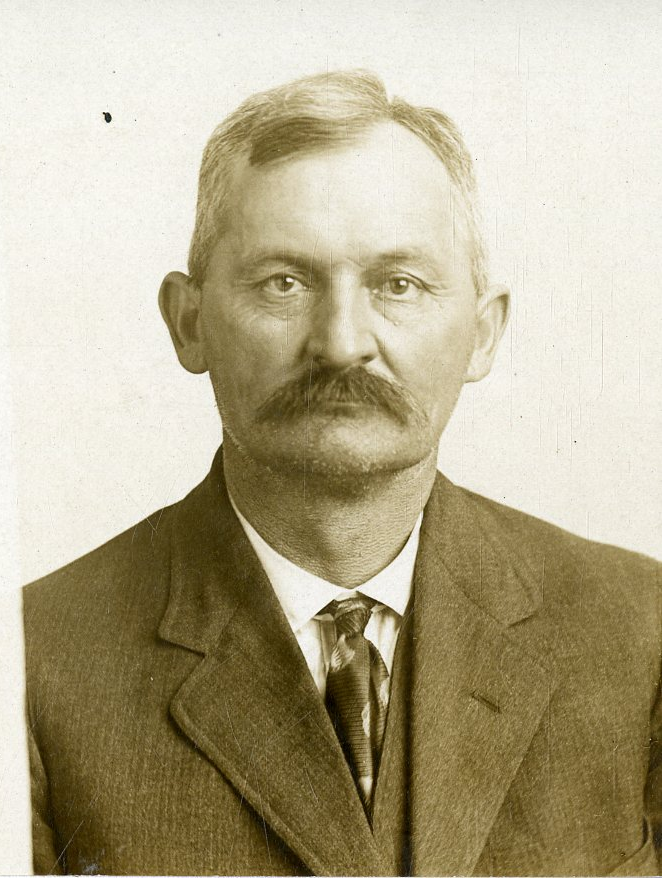

- Source: [archival record or issue](https://catalog.archives.gov/id/117701959)
- Credit: U.S. Penitentiary, Leavenworth booking photograph; National Archives at Kansas City, Record Group 129, series 571125, inmate 12708.
- Rights: U.S. federal-government prison photograph, public domain in the United States. NARA catalogs this photographic item as Unrestricted for use and access; individual photographer not identified.
- Identity: NARA catalogs this image as Photograph of Henry Brinkman, Leavenworth inmate 12708. The named photographic record and identifying inscriptions were checked against the existing wartime prisoner profile. The frontal image is cropped from the right.
- Download: [original source](https://catalog.archives.gov/medialz/kansas-city/rg-129/571125/571125_12708-HenryBrinkman_001.jpg)
- Preserved original: [batch263-originals/571125_12708-HenryBrinkman_001.jpg](batch263-originals/571125_12708-HenryBrinkman_001.jpg)
- Counterclockwise rotation before crop: 0 degrees. Crop box: `[662, 0, 1324, 878]` (left, top, exclusive right, exclusive bottom in rotated image); source dimensions: `[1324, 878]`.
- Source SHA-256: `43c336f8429861cd861b1ff8aa329beb9d29196459f18572a18c830c2b5ba4a8`
- Portrait SHA-256: `d0b698890476500a53b09bc03bc0f79284a5601913b379f433b3d07f6f3eab62`
- Identifying reverse: [batch263-originals/571125_12708-HenryBrinkman_002.jpg](batch263-originals/571125_12708-HenryBrinkman_002.jpg)

## Henry Corbishley

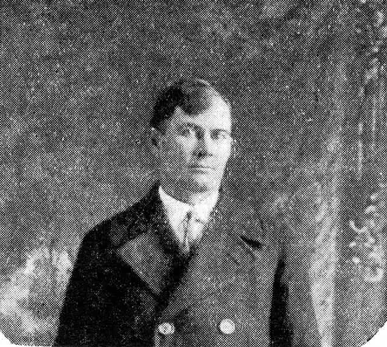

- Source: [archival record or issue](https://www.marxists.org/history/usa/pubs/labordefender/1926/v01n01-jan-1926-LD.pdf#page=6)
- Credit: Labor Defender, Jan 1926, PDF page 6; International Labor Defense, publisher. Digitized issue supplied by Marxists Internet Archive / Riazanov Library; individual photographer not identified.
- Rights: Photograph published in the United States in 1926; public domain in the United States by 2026. This statement concerns the historical published image, not newly authored archive website material.
- Identity: Individually captioned Henry Corbishley, Progressive Mine Union Leader, January 1926 printed page 5 (PDF page 6).
- Download: [original source](https://www.marxists.org/history/usa/pubs/labordefender/1926/v01n01-jan-1926-LD.pdf)
- Preserved original: [batch263-originals/jan-p6-Im0.jpg](batch263-originals/jan-p6-Im0.jpg)
- Counterclockwise rotation before crop: 270 degrees. Crop box: `[183, 512, 830, 1092]` (left, top, exclusive right, exclusive bottom in rotated image); source dimensions: `[3560, 2642]`.
- Source SHA-256: `b59208a4bd1e79c27babc8b249bdf05b8466de357dd081f36c96c2bf49fe631c`
- Portrait SHA-256: `1fae211e0fb6490bc2fb84fc0776bb234676a44a79dd73b20ac3a654d7ae7bcf`

## Henry Purcell

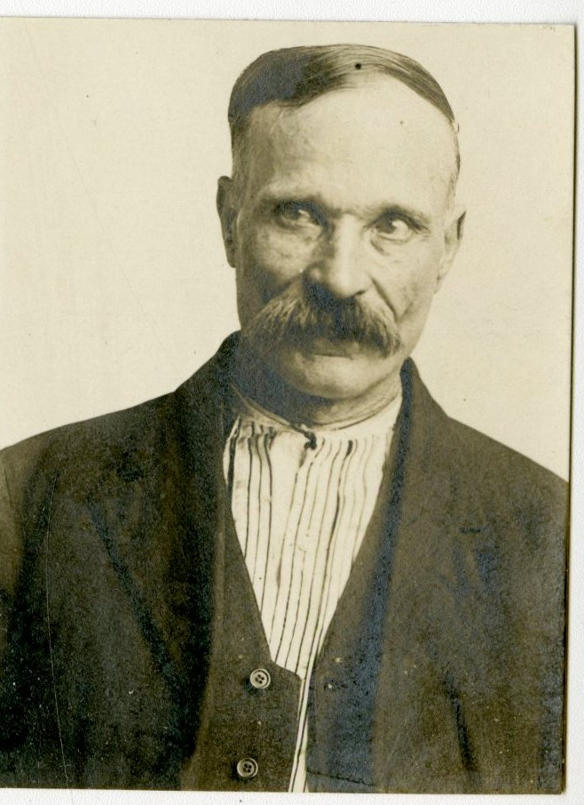

- Source: [archival record or issue](https://catalog.archives.gov/id/160923741)
- Credit: U.S. Penitentiary, Leavenworth booking photograph; National Archives at Kansas City, Record Group 129, series 571125, inmate 15245.
- Rights: U.S. federal-government prison photograph, public domain in the United States. NARA catalogs this photographic item as Unrestricted for use and access; individual photographer not identified.
- Identity: NARA catalogs this image as Photograph of Henry Purcell, Leavenworth inmate 15245. The named photographic record and identifying inscriptions were checked against the existing wartime prisoner profile. The frontal image is cropped from the right.
- Download: [original source](https://catalog.archives.gov/medialz/kansas-city/rg-129/571125/571125_15245-HenryPurcell_001.jpg)
- Preserved original: [batch263-originals/571125_15245-HenryPurcell_001.jpg](batch263-originals/571125_15245-HenryPurcell_001.jpg)
- Counterclockwise rotation before crop: 0 degrees. Crop box: `[658, 0, 1316, 906]` (left, top, exclusive right, exclusive bottom in rotated image); source dimensions: `[1316, 906]`.
- Source SHA-256: `aec6e8316f6269f50337ca5f6108eb4e7c1ff062ffa4cd570dd13cd4ff585b25`
- Portrait SHA-256: `01cae4cfe40937d101f5035857f515ffbc63ea2746791de2de3744db9d6c06d4`
- Identifying reverse: [batch263-originals/571125_15245-HenryPurcell_002.jpg](batch263-originals/571125_15245-HenryPurcell_002.jpg)

## Herbert Mahler

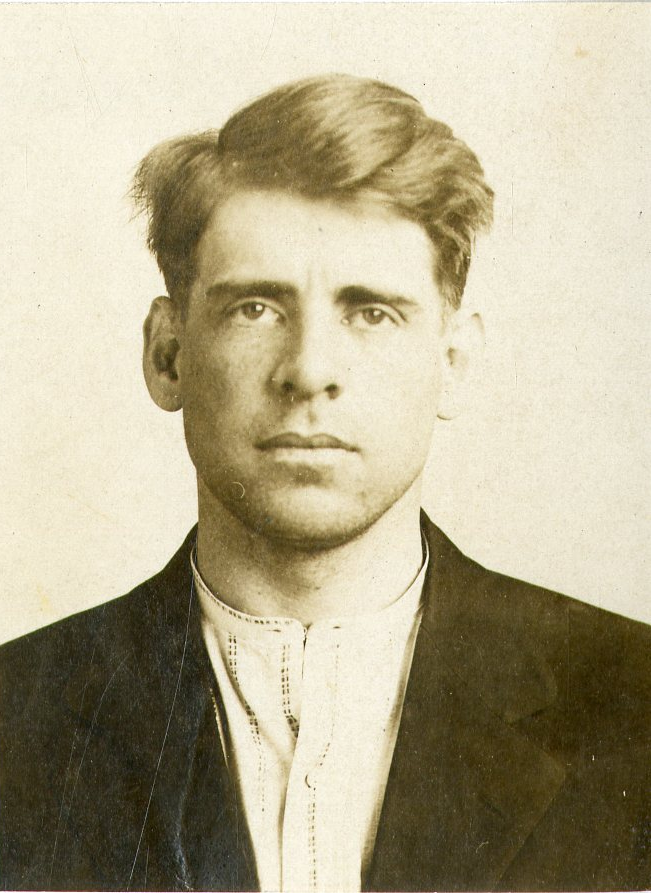

- Source: [archival record or issue](https://catalog.archives.gov/id/7260779)
- Credit: U.S. Penitentiary, Leavenworth booking photograph; National Archives at Kansas City, Record Group 129, series 571125, inmate 13166.
- Rights: U.S. federal-government prison photograph, public domain in the United States. NARA catalogs this photographic item as Unrestricted for use and access; individual photographer not identified.
- Identity: NARA catalogs this image as Photograph of Herbert Mahler, Leavenworth inmate 13166. The named photographic record and identifying inscriptions were checked against the existing wartime prisoner profile. The frontal image is cropped from the right. The Chicago IWW name/inmate-number roster reproduced by NARA in its October 2017 newsletter corroborates this group: https://www.archives.gov/files/kansas-city/press/newsletter/2017-october.pdf#page=6 .
- Download: [original source](https://catalog.archives.gov/medialz/kansas-city/rg-129/571125/7260779_13166-HerbertMahler_001.jpg)
- Preserved original: [batch263-originals/7260779_13166-HerbertMahler_001.jpg](batch263-originals/7260779_13166-HerbertMahler_001.jpg)
- Counterclockwise rotation before crop: 0 degrees. Crop box: `[651, 0, 1302, 893]` (left, top, exclusive right, exclusive bottom in rotated image); source dimensions: `[1302, 893]`.
- Source SHA-256: `5b98df39990f47748fc978b1ba53f543f734ec2be8dc8b8dddfd35fac60833c2`
- Portrait SHA-256: `49dc7c59c2ea6d3e2654420ae4ac45332d7a40fcba3970dfc579ea95c8d5336f`
- Identifying reverse: [batch263-originals/7260779_13166-HerbertMahler_002.jpg](batch263-originals/7260779_13166-HerbertMahler_002.jpg)

## Herbert McCutcheon

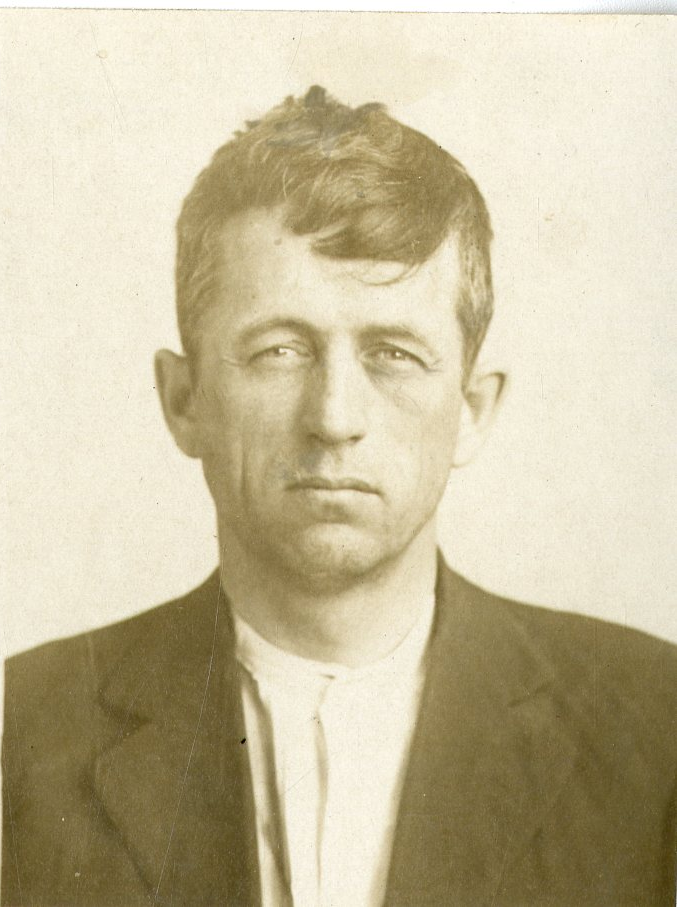

- Source: [archival record or issue](https://catalog.archives.gov/id/117703412)
- Credit: U.S. Penitentiary, Leavenworth booking photograph; National Archives at Kansas City, Record Group 129, series 571125, inmate 13169.
- Rights: U.S. federal-government prison photograph, public domain in the United States. NARA catalogs this photographic item as Unrestricted for use and access; individual photographer not identified.
- Identity: NARA catalogs this image as Photograph of Herbert McCutcheon, Leavenworth inmate 13169. The named photographic record and identifying inscriptions were checked against the existing wartime prisoner profile. The frontal image is cropped from the right. The Chicago IWW name/inmate-number roster reproduced by NARA in its October 2017 newsletter corroborates this group: https://www.archives.gov/files/kansas-city/press/newsletter/2017-october.pdf#page=6 .
- Download: [original source](https://catalog.archives.gov/medialz/kansas-city/rg-129/571125/571125_13169-HerbertMcCutcheon_001.jpg)
- Preserved original: [batch263-originals/571125_13169-HerbertMcCutcheon_001.jpg](batch263-originals/571125_13169-HerbertMcCutcheon_001.jpg)
- Counterclockwise rotation before crop: 0 degrees. Crop box: `[677, 0, 1354, 907]` (left, top, exclusive right, exclusive bottom in rotated image); source dimensions: `[1354, 907]`.
- Source SHA-256: `3951cd1969513a6508f1276461b91de065b4c152b8e8d6376816a056c0749416`
- Portrait SHA-256: `28a44f0015ac3e1f61fca761c4f08497749fdad988ffc158f41352e0ca404783`
- Identifying reverse: [batch263-originals/571125_13169-HerbertMcCutcheon_002.jpg](batch263-originals/571125_13169-HerbertMcCutcheon_002.jpg)

## Ignatz Simich

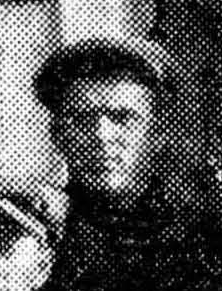

- Source: [archival record or issue](https://www.marxists.org/history/usa/pubs/labordefender/1926/v01n01-jan-1926-LD.pdf#page=8)
- Credit: Labor Defender, Jan 1926, PDF page 8; International Labor Defense, publisher. Digitized issue supplied by Marxists Internet Archive / Riazanov Library; individual photographer not identified.
- Rights: Photograph published in the United States in 1926; public domain in the United States by 2026. This statement concerns the historical published image, not newly authored archive website material.
- Identity: Caption identifies Ignatz Simich as third from left in the rear row of the Zeigler miners photograph, January 1926 PDF page 8.
- Download: [original source](https://www.marxists.org/history/usa/pubs/labordefender/1926/v01n01-jan-1926-LD.pdf)
- Preserved original: [batch263-originals/jan-p8-Im0.jpg](batch263-originals/jan-p8-Im0.jpg)
- Counterclockwise rotation before crop: 0 degrees. Crop box: `[1670, 559, 1892, 850]` (left, top, exclusive right, exclusive bottom in rotated image); source dimensions: `[2754, 2655]`.
- Source SHA-256: `0fe640c0cf60c91a1701ee80b59d8ce7b964d199e981b6c0b631c22438dba53d`
- Portrait SHA-256: `0d428544f858a5fb0faf361b7b70e3c09f97540908750f6b416aef697fa40dfa`

## J. A. Miller

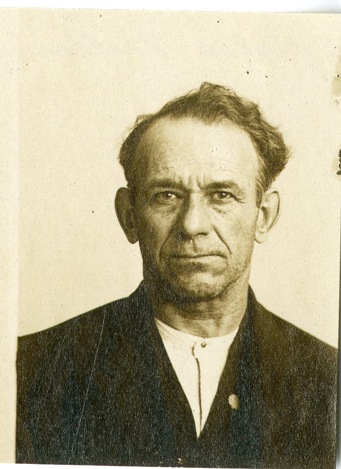

- Source: [archival record or issue](https://catalog.archives.gov/id/117702250)
- Credit: U.S. Penitentiary, Leavenworth booking photograph; National Archives at Kansas City, Record Group 129, series 571125, inmate 12800.
- Rights: U.S. federal-government prison photograph, public domain in the United States. NARA catalogs this photographic item as Unrestricted for use and access; individual photographer not identified.
- Identity: NARA catalogs this image as Photograph of J. A. Miller, Leavenworth inmate 12800. The named photographic record and identifying inscriptions were checked against the existing wartime prisoner profile. The frontal image is cropped from the right.
- Download: [original source](https://catalog.archives.gov/medialz/kansas-city/rg-129/571125/571125_12800-JAMiller_001.jpg)
- Preserved original: [batch263-originals/571125_12800-JAMiller_001.jpg](batch263-originals/571125_12800-JAMiller_001.jpg)
- Counterclockwise rotation before crop: 0 degrees. Crop box: `[669, 0, 1339, 922]` (left, top, exclusive right, exclusive bottom in rotated image); source dimensions: `[1339, 922]`.
- Source SHA-256: `bf4aece52f34a27a8349781ad4966ea2479e31caecfc078a7514fbb5e90377b6`
- Portrait SHA-256: `87a1223f7fc22eefa9e971f58db824ea2f1950bc3bcc636bcbb3c840a3f2675a`
- Identifying reverse: [batch263-originals/571125_12800-JAMiller_002.jpg](batch263-originals/571125_12800-JAMiller_002.jpg)

## J. Gresbach

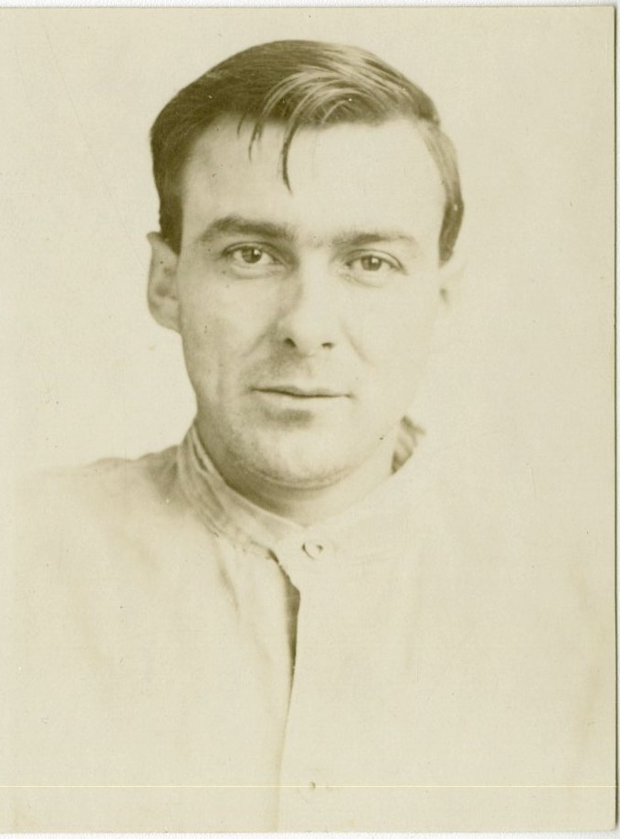

- Source: [archival record or issue](https://catalog.archives.gov/id/160922107)
- Credit: U.S. Penitentiary, Leavenworth booking photograph; National Archives at Kansas City, Record Group 129, series 571125, inmate 14815.
- Rights: U.S. federal-government prison photograph, public domain in the United States. NARA catalogs this photographic item as Unrestricted for use and access; individual photographer not identified.
- Identity: NARA catalogs this image as Photograph of Joseph Gresbach, Leavenworth inmate 14815. The named photographic record and identifying inscriptions were checked against the existing wartime prisoner profile. The frontal image is cropped from the right. Catalog spelling/expanded name is preserved in the source title; existing display name J. Gresbach remains unchanged. The matching incarceration context was checked before selecting the portrait.
- Download: [original source](https://catalog.archives.gov/medialz/kansas-city/rg-129/571125/571125_14815-JosephGresbach_001.jpg)
- Preserved original: [batch263-originals/571125_14815-JosephGresbach_001.jpg](batch263-originals/571125_14815-JosephGresbach_001.jpg)
- Counterclockwise rotation before crop: 0 degrees. Crop box: `[679, 0, 1358, 918]` (left, top, exclusive right, exclusive bottom in rotated image); source dimensions: `[1358, 918]`.
- Source SHA-256: `680667dfc3233c33abae4902f35167611d7c99dde833c5e1ff6692905b9c96c0`
- Portrait SHA-256: `419ae3c81bb948bb4d7419c5254ca97d13c6f0a418b3542524981a2e80be6e22`
- Identifying reverse: [batch263-originals/571125_14815-JosephGresbach_002.jpg](batch263-originals/571125_14815-JosephGresbach_002.jpg)

## J. R. Baskett

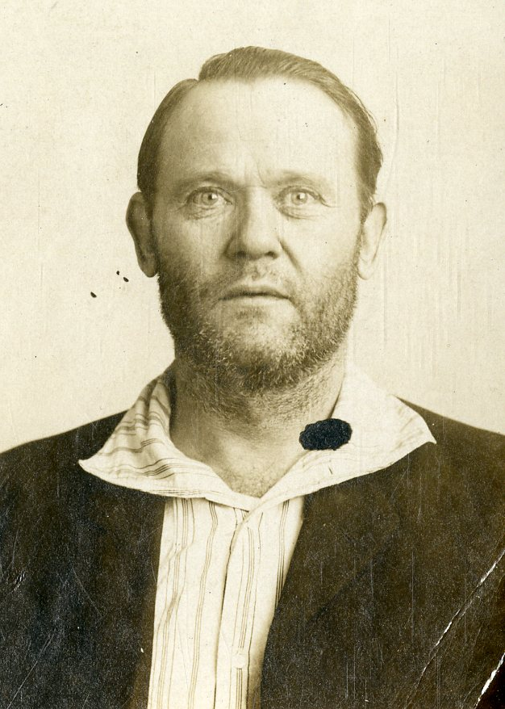

- Source: [archival record or issue](https://catalog.archives.gov/id/117703448)
- Credit: U.S. Penitentiary, Leavenworth booking photograph; National Archives at Kansas City, Record Group 129, series 571125, inmate 13183.
- Rights: U.S. federal-government prison photograph, public domain in the United States. NARA catalogs this photographic item as Unrestricted for use and access; individual photographer not identified.
- Identity: NARA catalogs this image as Photograph of J. R. Baskett, Leavenworth inmate 13183. The named photographic record and identifying inscriptions were checked against the existing wartime prisoner profile. The frontal image is cropped from the right. The Chicago IWW name/inmate-number roster reproduced by NARA in its October 2017 newsletter corroborates this group: https://www.archives.gov/files/kansas-city/press/newsletter/2017-october.pdf#page=6 .
- Download: [original source](https://catalog.archives.gov/medialz/kansas-city/rg-129/571125/571125_13183-JRBaskett_001.jpg)
- Preserved original: [batch263-originals/571125_13183-JRBaskett_001.jpg](batch263-originals/571125_13183-JRBaskett_001.jpg)
- Counterclockwise rotation before crop: 0 degrees. Crop box: `[625, 0, 1251, 878]` (left, top, exclusive right, exclusive bottom in rotated image); source dimensions: `[1251, 878]`.
- Source SHA-256: `d7ba2e553a53de707745e2061b504ccf4eac87a326c3fa9a650ffb160d6c97af`
- Portrait SHA-256: `47cad16dbef74dfce887af80d8dae47060e4fe99830313834770c7b1c7a89be9`
- Identifying reverse: [batch263-originals/571125_13183-JRBaskett_002.jpg](batch263-originals/571125_13183-JRBaskett_002.jpg)

## Jack Donald

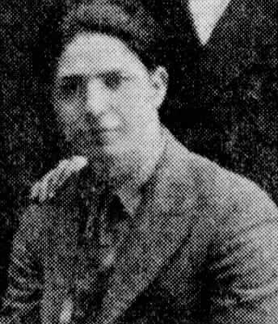

- Source: [archival record or issue](https://www.marxists.org/history/usa/pubs/labordefender/1930/v05n05-may-1930-LD.pdf#page=12)
- Credit: Labor Defender, May 1930, PDF page 12; International Labor Defense, publisher. Digitized issue supplied by Marxists Internet Archive / Riazanov Library; individual photographer not identified. Group photograph credited in print to Buffalo ILD.
- Rights: Photograph published in the United States in 1930; public domain in the United States by 2026. This statement concerns the historical published image, not newly authored archive website material.
- Identity: May 1930 printed page 89 (PDF page 12), A Reply to Hunger. Caption explicitly identifies Jack Donald, fifth in the front row of the Buffalo group; the locality and 1930 prosecution agree with the existing profile.
- Download: [original source](https://www.marxists.org/history/usa/pubs/labordefender/1930/v05n05-may-1930-LD.pdf)
- Preserved original: [batch263-originals/1930-may-p12-Im0.jpg](batch263-originals/1930-may-p12-Im0.jpg)
- Counterclockwise rotation before crop: 270 degrees. Crop box: `[1475, 1905, 1819, 2306]` (left, top, exclusive right, exclusive bottom in rotated image); source dimensions: `[4755, 3523]`.
- Source SHA-256: `b6d73d1ebeb39ce3d2edc7c0c1f7bbcc1fdc57860052e5f10e6660cbd06b198a`
- Portrait SHA-256: `9798a20676be71b17c6e304a4cfaefab6f564f58e03bce58f16d9884690ec908`

## Jacob O. Bentall

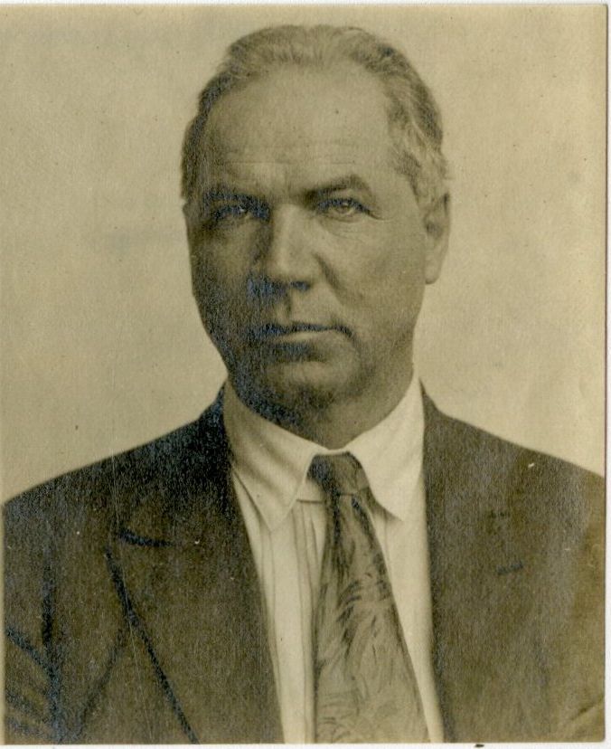

- Source: [archival record or issue](https://catalog.archives.gov/id/120345662)
- Credit: U.S. Penitentiary, Leavenworth booking photograph; National Archives at Kansas City, Record Group 129, series 571125, inmate 17289.
- Rights: U.S. federal-government prison photograph, public domain in the United States. NARA catalogs this photographic item as Unrestricted for use and access; individual photographer not identified.
- Identity: NARA catalogs this image as Photograph of Jacob O. Bentall, Leavenworth inmate 17289. The named photographic record and identifying inscriptions were checked against the existing wartime prisoner profile. The frontal image is cropped from the right.
- Download: [original source](https://catalog.archives.gov/medialz/kansas-city/rg-129/571125/571125_17289-JacobOBentall_001.jpg)
- Preserved original: [batch263-originals/571125_17289-JacobOBentall_001.jpg](batch263-originals/571125_17289-JacobOBentall_001.jpg)
- Counterclockwise rotation before crop: 0 degrees. Crop box: `[675, 0, 1351, 828]` (left, top, exclusive right, exclusive bottom in rotated image); source dimensions: `[1351, 828]`.
- Source SHA-256: `904fe4e739dade1a79062ac929054e1621a36dbafb7c9b9ad301bf8087a25158`
- Portrait SHA-256: `d1da1146c32b5bbebf2b30e0086933551b9da4e987d1ec252bf27a91ac0029d5`
- Identifying reverse: [batch263-originals/571125_17289-JacobOBentall_002.jpg](batch263-originals/571125_17289-JacobOBentall_002.jpg)

## James Hanaman

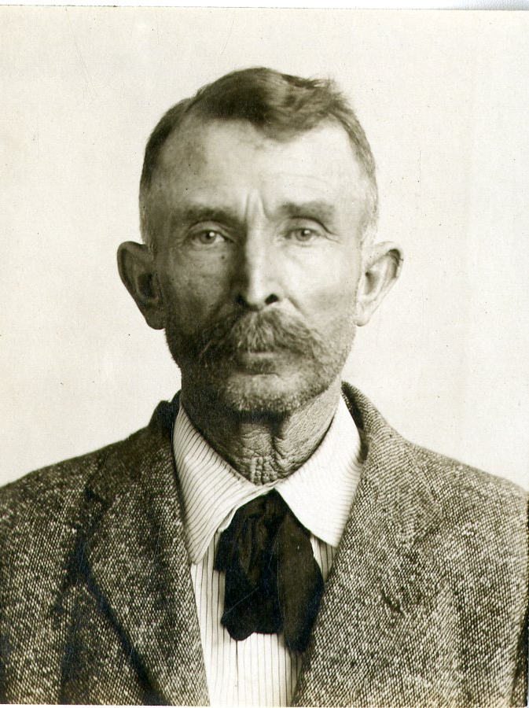

- Source: [archival record or issue](https://catalog.archives.gov/id/117703742)
- Credit: U.S. Penitentiary, Leavenworth booking photograph; National Archives at Kansas City, Record Group 129, series 571125, inmate 13280.
- Rights: U.S. federal-government prison photograph, public domain in the United States. NARA catalogs this photographic item as Unrestricted for use and access; individual photographer not identified.
- Identity: NARA catalogs this image as Photograph of James Hanaman, Leavenworth inmate 13280. The named photographic record and identifying inscriptions were checked against the existing wartime prisoner profile. The frontal image is cropped from the right.
- Download: [original source](https://catalog.archives.gov/medialz/kansas-city/rg-129/571125/571125_13280-JamesHanaman_001.jpg)
- Preserved original: [batch263-originals/571125_13280-JamesHanaman_001.jpg](batch263-originals/571125_13280-JamesHanaman_001.jpg)
- Counterclockwise rotation before crop: 0 degrees. Crop box: `[673, 0, 1346, 900]` (left, top, exclusive right, exclusive bottom in rotated image); source dimensions: `[1346, 900]`.
- Source SHA-256: `c5097d240c739cd54b49a4b2c3a81eb26ce0bf43c538027d99998bf490ce6111`
- Portrait SHA-256: `6cf23fe95969fac9dd727d99eeccf0a9b40bfb8ed4d0b015737fa07b2b8cfeb1`
- Identifying reverse: [batch263-originals/571125_13280-JamesHanaman_002.jpg](batch263-originals/571125_13280-JamesHanaman_002.jpg)

## James Mulrooney

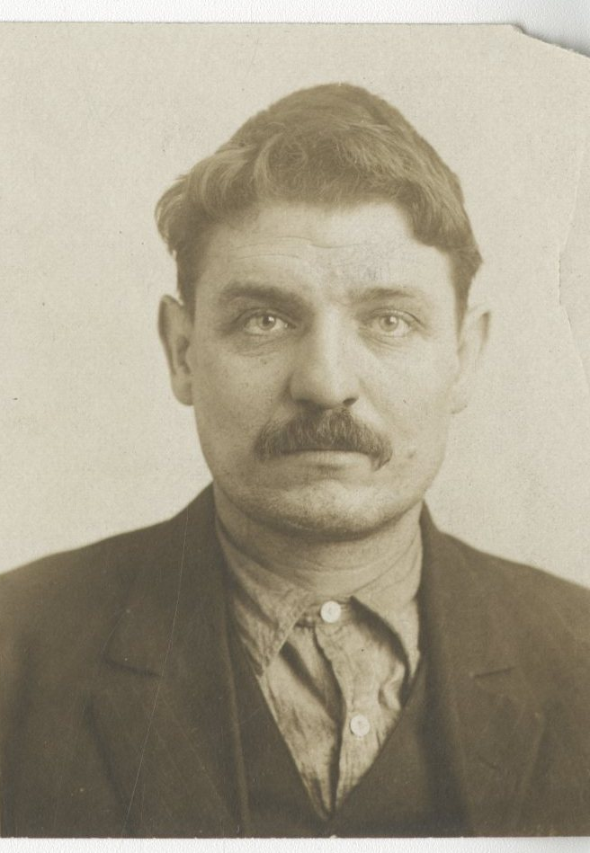

- Source: [archival record or issue](https://catalog.archives.gov/id/117719386)
- Credit: U.S. Penitentiary, Leavenworth booking photograph; National Archives at Kansas City, Record Group 129, series 571125, inmate 13589.
- Rights: U.S. federal-government prison photograph, public domain in the United States. NARA catalogs this photographic item as Unrestricted for use and access; individual photographer not identified.
- Identity: NARA catalogs this image as Photograph of James Malrooney, Leavenworth inmate 13589. The named photographic record and identifying inscriptions were checked against the existing wartime prisoner profile. The frontal image is cropped from the right. Catalog spelling/expanded name is preserved in the source title; existing display name James Mulrooney remains unchanged. The matching incarceration context was checked before selecting the portrait.
- Download: [original source](https://catalog.archives.gov/medialz/kansas-city/rg-129/571125/571125_13589-JamesMalrooney_001.jpg)
- Preserved original: [batch263-originals/571125_13589-JamesMalrooney_001.jpg](batch263-originals/571125_13589-JamesMalrooney_001.jpg)
- Counterclockwise rotation before crop: 0 degrees. Crop box: `[656, 0, 1312, 949]` (left, top, exclusive right, exclusive bottom in rotated image); source dimensions: `[1312, 949]`.
- Source SHA-256: `e94f232b91c3b764b237a6d2b59a2438d4d6e52894e67047f7e4e16f2ed33cf4`
- Portrait SHA-256: `637c69868be3f5011eb7376703296fb4576775dec6857223543e28fc44998d06`
- Identifying reverse: [batch263-originals/571125_13589-JamesMalrooney_002.jpg](batch263-originals/571125_13589-JamesMalrooney_002.jpg)

## James Slovik

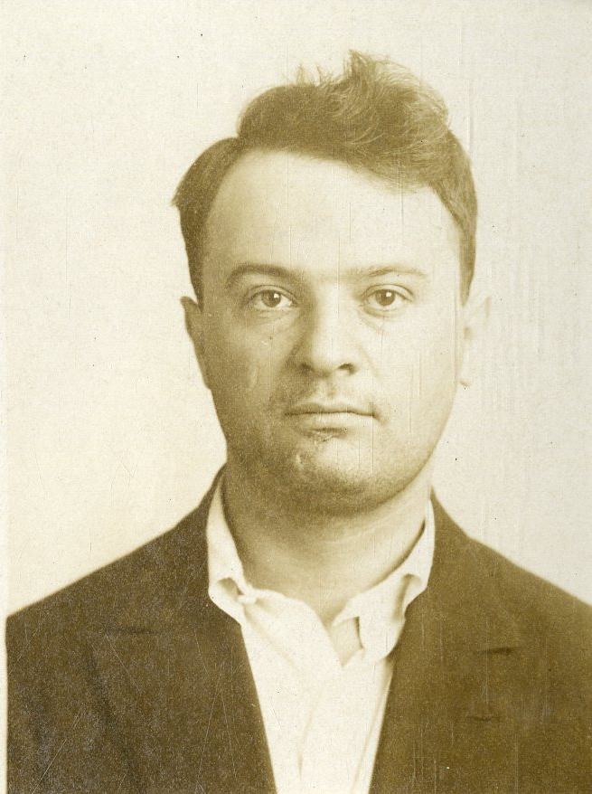

- Source: [archival record or issue](https://catalog.archives.gov/id/117703354)
- Credit: U.S. Penitentiary, Leavenworth booking photograph; National Archives at Kansas City, Record Group 129, series 571125, inmate 13142.
- Rights: U.S. federal-government prison photograph, public domain in the United States. NARA catalogs this photographic item as Unrestricted for use and access; individual photographer not identified.
- Identity: NARA catalogs this image as Photograph of James Slovik, Leavenworth inmate 13142. The named photographic record and identifying inscriptions were checked against the existing wartime prisoner profile. The frontal image is cropped from the right. The Chicago IWW name/inmate-number roster reproduced by NARA in its October 2017 newsletter corroborates this group: https://www.archives.gov/files/kansas-city/press/newsletter/2017-october.pdf#page=6 .
- Download: [original source](https://catalog.archives.gov/medialz/kansas-city/rg-129/571125/571125_13142-JamesSlovik_001.jpg)
- Preserved original: [batch263-originals/571125_13142-JamesSlovik_001.jpg](batch263-originals/571125_13142-JamesSlovik_001.jpg)
- Counterclockwise rotation before crop: 0 degrees. Crop box: `[655, 0, 1310, 878]` (left, top, exclusive right, exclusive bottom in rotated image); source dimensions: `[1310, 878]`.
- Source SHA-256: `006dfbfc6c43994b7b4ccb7efba0315a2e720226f93a0cecc5f9f3e376c6e402`
- Portrait SHA-256: `383d4d70b254ffd2d6ee47e0b1a987620c98b6bdf2827770af06c415c2b4bb1c`
- Identifying reverse: [batch263-originals/571125_13142-JamesSlovik_002.jpg](batch263-originals/571125_13142-JamesSlovik_002.jpg)

## Joe Carroll

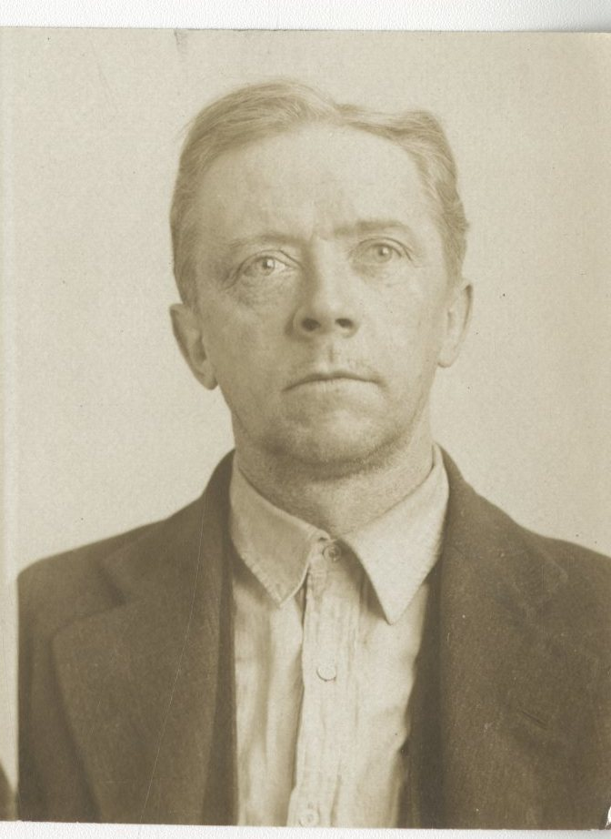

- Source: [archival record or issue](https://catalog.archives.gov/id/117719389)
- Credit: U.S. Penitentiary, Leavenworth booking photograph; National Archives at Kansas City, Record Group 129, series 571125, inmate 13591.
- Rights: U.S. federal-government prison photograph, public domain in the United States. NARA catalogs this photographic item as Unrestricted for use and access; individual photographer not identified.
- Identity: NARA catalogs this image as Photograph of Joseph Carroll, Leavenworth inmate 13591. The named photographic record and identifying inscriptions were checked against the existing wartime prisoner profile. The frontal image is cropped from the right.
- Download: [original source](https://catalog.archives.gov/medialz/kansas-city/rg-129/571125/571125_13591-JosephCarroll_001.jpg)
- Preserved original: [batch263-originals/571125_13591-JosephCarroll_001.jpg](batch263-originals/571125_13591-JosephCarroll_001.jpg)
- Counterclockwise rotation before crop: 0 degrees. Crop box: `[672, 0, 1344, 922]` (left, top, exclusive right, exclusive bottom in rotated image); source dimensions: `[1344, 922]`.
- Source SHA-256: `1a557243b8d53f1ea7a509abe26493883221a44cf42ac0137ec68ce3e0969493`
- Portrait SHA-256: `013194c2feaeafb58e0885b1ed7d530febe3a7d484ebb0f9e0a2864508c4ada9`
- Identifying reverse: [batch263-originals/571125_13591-JosephCarroll_002.jpg](batch263-originals/571125_13591-JosephCarroll_002.jpg)

## John M. Foss

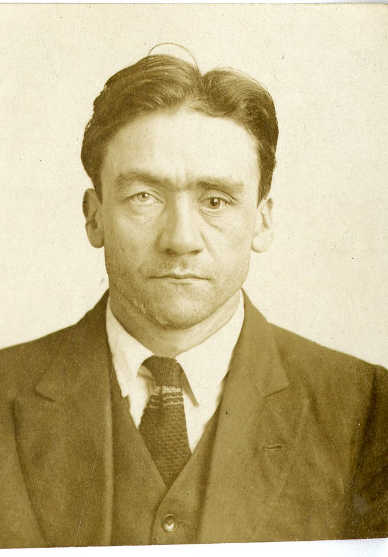

- Source: [archival record or issue](https://catalog.archives.gov/id/117703375)
- Credit: U.S. Penitentiary, Leavenworth booking photograph; National Archives at Kansas City, Record Group 129, series 571125, inmate 13154.
- Rights: U.S. federal-government prison photograph, public domain in the United States. NARA catalogs this photographic item as Unrestricted for use and access; individual photographer not identified.
- Identity: NARA catalogs this image as Photograph of John M. Foss, Leavenworth inmate 13154. The named photographic record and identifying inscriptions were checked against the existing wartime prisoner profile. The frontal image is cropped from the right. The Chicago IWW name/inmate-number roster reproduced by NARA in its October 2017 newsletter corroborates this group: https://www.archives.gov/files/kansas-city/press/newsletter/2017-october.pdf#page=6 .
- Download: [original source](https://catalog.archives.gov/medialz/kansas-city/rg-129/571125/571125_13154-JohnMFoss_001.jpg)
- Preserved original: [batch263-originals/571125_13154-JohnMFoss_001.jpg](batch263-originals/571125_13154-JohnMFoss_001.jpg)
- Counterclockwise rotation before crop: 0 degrees. Crop box: `[647, 0, 1295, 929]` (left, top, exclusive right, exclusive bottom in rotated image); source dimensions: `[1295, 929]`.
- Source SHA-256: `47545ba3060322b0dd554af480cda588666e4c3609ae3153946999e40f7ad4fa`
- Portrait SHA-256: `e30d7f4659d7f4369a1362fc63acd5941f014cb2e5918bbfc11b03c0d5a16ed0`
- Identifying reverse: [batch263-originals/571125_13154-JohnMFoss_002.jpg](batch263-originals/571125_13154-JohnMFoss_002.jpg)

## John Merrick

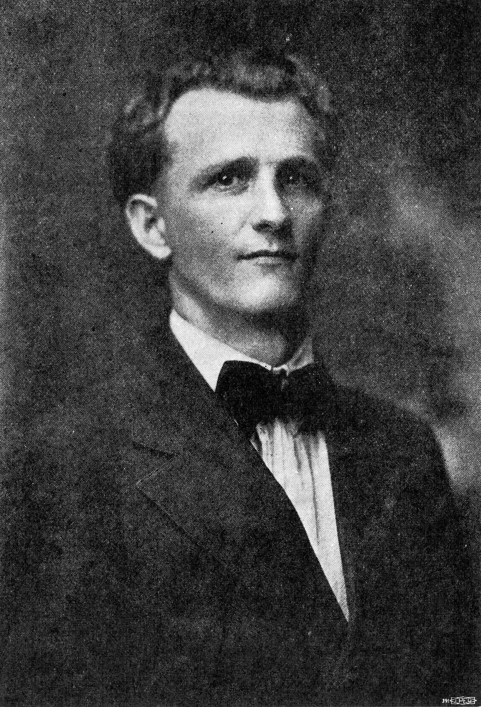

- Source: [archival record or issue](https://www.marxists.org/history/usa/pubs/labordefender/1926/v01n08-aug-1926-LD.pdf#page=15)
- Credit: Labor Defender, Aug 1926, PDF page 15; International Labor Defense, publisher. Digitized issue supplied by Marxists Internet Archive / Riazanov Library; individual photographer not identified.
- Rights: Photograph published in the United States in 1926; public domain in the United States by 2026. This statement concerns the historical published image, not newly authored archive website material.
- Identity: Individually captioned John E. Merrick, August 1926 PDF page 15; accompanying article John Merrick Goes to Prison on PDF page 14 identifies the Haverhill shoe worker case.
- Download: [original source](https://www.marxists.org/history/usa/pubs/labordefender/1926/v01n08-aug-1926-LD.pdf)
- Preserved original: [batch263-originals/aug-p15-Im0.jpg](batch263-originals/aug-p15-Im0.jpg)
- Counterclockwise rotation before crop: 90 degrees. Crop box: `[105, 93, 2434, 3514]` (left, top, exclusive right, exclusive bottom in rotated image); source dimensions: `[3719, 2562]`.
- Source SHA-256: `461a2f3ad45fd61c5fd273e74cf9f837bcf14af82dcb5f9dd4313dfaa5ae6d6b`
- Portrait SHA-256: `217c0f27a5321ad4d9be43312e606134ee9cd4832ced793bf14b72085fdd3cdb`

## John Robbins

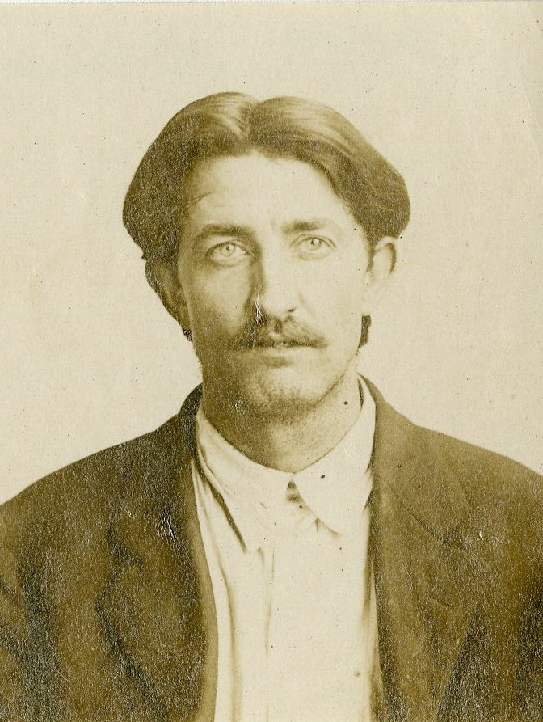

- Source: [archival record or issue](https://catalog.archives.gov/id/117702607)
- Credit: U.S. Penitentiary, Leavenworth booking photograph; National Archives at Kansas City, Record Group 129, series 571125, inmate 12903.
- Rights: U.S. federal-government prison photograph, public domain in the United States. NARA catalogs this photographic item as Unrestricted for use and access; individual photographer not identified.
- Identity: NARA catalogs this image as Photograph of John Robbins, Leavenworth inmate 12903. The named photographic record and identifying inscriptions were checked against the existing wartime prisoner profile. The frontal image is cropped from the right.
- Download: [original source](https://catalog.archives.gov/medialz/kansas-city/rg-129/571125/571125_12903-JohnRobbins_001.jpg)
- Preserved original: [batch263-originals/571125_12903-JohnRobbins_001.jpg](batch263-originals/571125_12903-JohnRobbins_001.jpg)
- Counterclockwise rotation before crop: 0 degrees. Crop box: `[671, 0, 1343, 893]` (left, top, exclusive right, exclusive bottom in rotated image); source dimensions: `[1343, 893]`.
- Source SHA-256: `3396baa9c4b93729910dc29f0cd2b1acccb636e4df784b38a7f1f46b194e1310`
- Portrait SHA-256: `a806fc3c50287591f761e409fa7609282971057e7ceccaa2841af648d242a741`
- Identifying reverse: [batch263-originals/571125_12903-JohnRobbins_002.jpg](batch263-originals/571125_12903-JohnRobbins_002.jpg)

## Joseph Basor

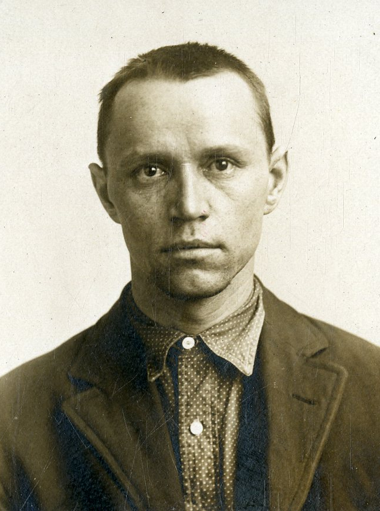

- Source: [archival record or issue](https://catalog.archives.gov/id/117703097)
- Credit: U.S. Penitentiary, Leavenworth booking photograph; National Archives at Kansas City, Record Group 129, series 571125, inmate 13054.
- Rights: U.S. federal-government prison photograph, public domain in the United States. NARA catalogs this photographic item as Unrestricted for use and access; individual photographer not identified.
- Identity: NARA catalogs this image as Photograph of Joseph Basor, Leavenworth inmate 13054. The named photographic record and identifying inscriptions were checked against the existing wartime prisoner profile. The frontal image is cropped from the right.
- Download: [original source](https://catalog.archives.gov/medialz/kansas-city/rg-129/571125/571125_13054-JosephBasor_001.jpg)
- Preserved original: [batch263-originals/571125_13054-JosephBasor_001.jpg](batch263-originals/571125_13054-JosephBasor_001.jpg)
- Counterclockwise rotation before crop: 0 degrees. Crop box: `[647, 0, 1295, 871]` (left, top, exclusive right, exclusive bottom in rotated image); source dimensions: `[1295, 871]`.
- Source SHA-256: `2479830b9ca81a41669994415daea628ad8fd0f51ed2c8598bfee6ebb138c89f`
- Portrait SHA-256: `4abf861c9dc4b83cd25908ba606b47cb63d271ffffe13d42432ce0ad398fe060`
- Identifying reverse: [batch263-originals/571125_13054-JosephBasor_002.jpg](batch263-originals/571125_13054-JosephBasor_002.jpg)

## Joseph Harper

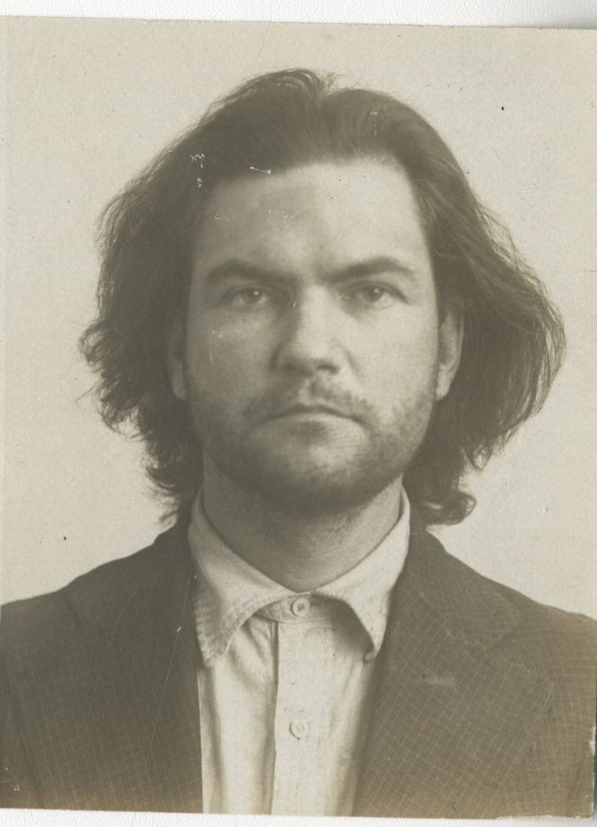

- Source: [archival record or issue](https://catalog.archives.gov/id/117719401)
- Credit: U.S. Penitentiary, Leavenworth booking photograph; National Archives at Kansas City, Record Group 129, series 571125, inmate 13595.
- Rights: U.S. federal-government prison photograph, public domain in the United States. NARA catalogs this photographic item as Unrestricted for use and access; individual photographer not identified.
- Identity: NARA catalogs this image as Photograph of Joseph Harper, Leavenworth inmate 13595. The named photographic record and identifying inscriptions were checked against the existing wartime prisoner profile. The frontal image is cropped from the right.
- Download: [original source](https://catalog.archives.gov/medialz/kansas-city/rg-129/571125/571125_13595-JosephHarper_001.jpg)
- Preserved original: [batch263-originals/571125_13595-JosephHarper_001.jpg](batch263-originals/571125_13595-JosephHarper_001.jpg)
- Counterclockwise rotation before crop: 0 degrees. Crop box: `[671, 0, 1342, 930]` (left, top, exclusive right, exclusive bottom in rotated image); source dimensions: `[1342, 930]`.
- Source SHA-256: `68d72d642d235ff2423f42cf77db7b4194b9b95cb9064133df7c65511f88c04d`
- Portrait SHA-256: `ee6f8bd70784da350e73720f56902f2de393543df28902856144f7b02b73b0ed`
- Identifying reverse: [batch263-originals/571125_13595-JosephHarper_002.jpg](batch263-originals/571125_13595-JosephHarper_002.jpg)

## Joseph Harrison

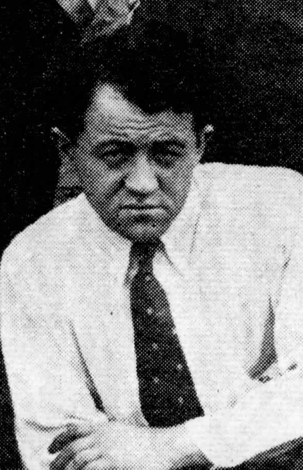

- Source: [archival record or issue](https://www.marxists.org/history/usa/pubs/labordefender/1930/v05n04-apr-1930-LD.pdf#page=10)
- Credit: Labor Defender, Apr 1930, PDF page 10; International Labor Defense, publisher. Digitized issue supplied by Marxists Internet Archive / Riazanov Library; individual photographer not identified.
- Rights: Photograph published in the United States in 1930; public domain in the United States by 2026. This statement concerns the historical published image, not newly authored archive website material.
- Identity: April 1930 PDF page 10, The Gastonia 7. Caption identifies the person as third kneeling; name and Gastonia prosecution agree with the existing profile.
- Download: [original source](https://www.marxists.org/history/usa/pubs/labordefender/1930/v05n04-apr-1930-LD.pdf)
- Preserved original: [batch263-originals/1930-apr-p10-Im0.jpg](batch263-originals/1930-apr-p10-Im0.jpg)
- Counterclockwise rotation before crop: 90 degrees. Crop box: `[2101, 1319, 2696, 2241]` (left, top, exclusive right, exclusive bottom in rotated image); source dimensions: `[2986, 3229]`.
- Source SHA-256: `80328ef158deb231fe8adb45447274de24c8c9c9c8057090bc95fcf7a6fc535c`
- Portrait SHA-256: `07b70435bd10a03f9f3c606fd85c9c6337d277a5369485496bc662d70fc4ef28`

## K. Y. Hendricks

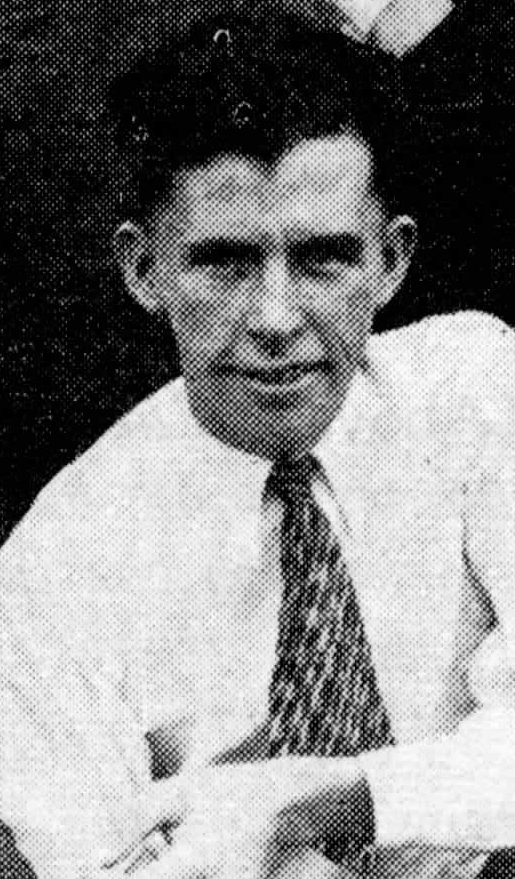

- Source: [archival record or issue](https://www.marxists.org/history/usa/pubs/labordefender/1930/v05n04-apr-1930-LD.pdf#page=10)
- Credit: Labor Defender, Apr 1930, PDF page 10; International Labor Defense, publisher. Digitized issue supplied by Marxists Internet Archive / Riazanov Library; individual photographer not identified.
- Rights: Photograph published in the United States in 1930; public domain in the United States by 2026. This statement concerns the historical published image, not newly authored archive website material.
- Identity: April 1930 PDF page 10, The Gastonia 7. Caption identifies the person as second kneeling; name and Gastonia prosecution agree with the existing profile.
- Download: [original source](https://www.marxists.org/history/usa/pubs/labordefender/1930/v05n04-apr-1930-LD.pdf)
- Preserved original: [batch263-originals/1930-apr-p10-Im0.jpg](batch263-originals/1930-apr-p10-Im0.jpg)
- Counterclockwise rotation before crop: 90 degrees. Crop box: `[1349, 1305, 1864, 2184]` (left, top, exclusive right, exclusive bottom in rotated image); source dimensions: `[2986, 3229]`.
- Source SHA-256: `80328ef158deb231fe8adb45447274de24c8c9c9c8057090bc95fcf7a6fc535c`
- Portrait SHA-256: `138a8ab3317c994efbd73d5cb74a823fc558fe5badd81db807f783db8df743d0`

## Lee Lang

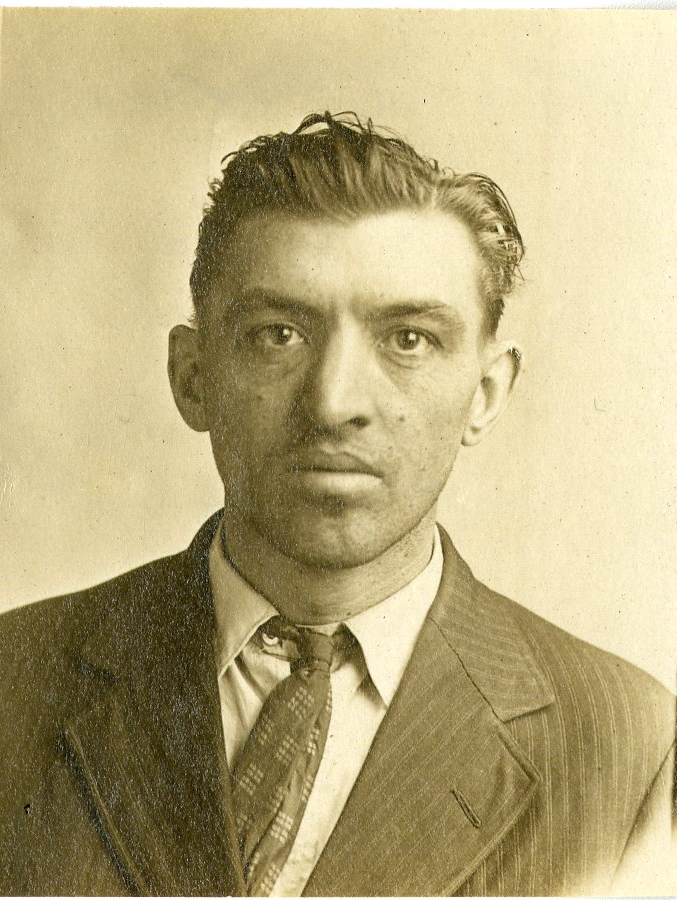

- Source: [archival record or issue](https://catalog.archives.gov/id/117701764)
- Credit: U.S. Penitentiary, Leavenworth booking photograph; National Archives at Kansas City, Record Group 129, series 571125, inmate 12650.
- Rights: U.S. federal-government prison photograph, public domain in the United States. NARA catalogs this photographic item as Unrestricted for use and access; individual photographer not identified.
- Identity: NARA catalogs this image as Photograph of Lee Lang, Leavenworth inmate 12650. The named photographic record and identifying inscriptions were checked against the existing wartime prisoner profile. The frontal image is cropped from the right.
- Download: [original source](https://catalog.archives.gov/medialz/kansas-city/rg-129/571125/571125_12650-LeeLang_001.jpg)
- Preserved original: [batch263-originals/571125_12650-LeeLang_001.jpg](batch263-originals/571125_12650-LeeLang_001.jpg)
- Counterclockwise rotation before crop: 0 degrees. Crop box: `[677, 0, 1354, 900]` (left, top, exclusive right, exclusive bottom in rotated image); source dimensions: `[1354, 900]`.
- Source SHA-256: `8bbcaccecff8b0ce8a093135dfcaae06f824cfd6170ac6f5e0adddf0597ecf5d`
- Portrait SHA-256: `c233806fa88ff4f96054628de2c63fffb4b927fd40000f3fb950e9f338cfcd76`
- Identifying reverse: [batch263-originals/571125_12650-LeeLang_002.jpg](batch263-originals/571125_12650-LeeLang_002.jpg)

## LeRoy Pinkett

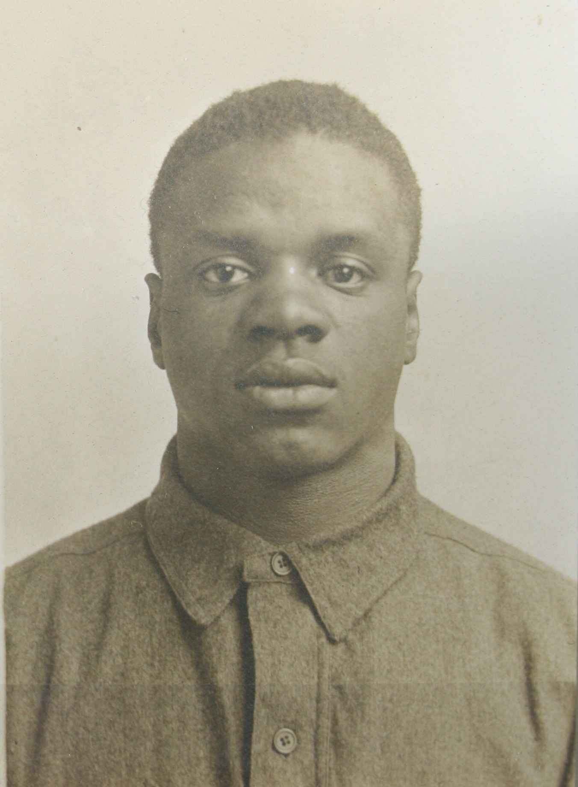

- Source: [archival record or issue](https://catalog.archives.gov/id/7788818)
- Credit: U.S. Penitentiary, Leavenworth booking photograph; National Archives at Kansas City, Record Group 129, series 571125, inmate 12272.
- Rights: U.S. federal-government prison photograph, public domain in the United States. NARA catalogs this photographic item as Unrestricted for use and access; individual photographer not identified.
- Identity: NARA catalogs this image as Photograph of Leroy Pinkett, Leavenworth inmate 12272. The named photographic record and identifying inscriptions were checked against the existing wartime prisoner profile. The frontal image is cropped from the right.
- Download: [original source](https://catalog.archives.gov/medialive/18/7888/7788818/content/arcmedia/central-plains/kansas-city/571125/12272_Pinkett_Leroy.JPG)
- Preserved original: [batch263-originals/12272_Pinkett_Leroy.JPG](batch263-originals/12272_Pinkett_Leroy.JPG)
- Counterclockwise rotation before crop: 0 degrees. Crop box: `[1351, 0, 2703, 1841]` (left, top, exclusive right, exclusive bottom in rotated image); source dimensions: `[2703, 1841]`.
- Source SHA-256: `abe8c3add215731448419c95dd5d752562aeb9502ac8ebdb176052c4a834f920`
- Portrait SHA-256: `ffdf7e7ab8ca9552f419f52593fdef311f6bbf82e2a361461e1980788b9d0d50`
- Identifying reverse: [batch263-originals/7788818_12272-LeRoyPinkett_002.jpg](batch263-originals/7788818_12272-LeRoyPinkett_002.jpg)

## Lil Andrews

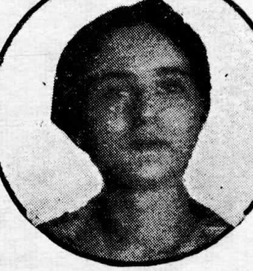

- Source: [archival record or issue](https://www.marxists.org/history/usa/pubs/labordefender/1930/v05n03-mar-1930-LD.pdf#page=9)
- Credit: Labor Defender, Mar 1930, PDF page 9; International Labor Defense, publisher. Digitized issue supplied by Marxists Internet Archive / Riazanov Library; individual photographer not identified.
- Rights: Photograph published in the United States in 1930; public domain in the United States by 2026. This statement concerns the historical published image, not newly authored archive website material.
- Identity: March 1930 printed page 47 (PDF page 9), 1105 Years in Prison. Individual caption identifies Lil Andrews, Ohio YCL organizer; organizational and geographic context agrees with the existing profile.
- Download: [original source](https://www.marxists.org/history/usa/pubs/labordefender/1930/v05n03-mar-1930-LD.pdf)
- Preserved original: [batch263-originals/1930-mar-p9-Im0.jpg](batch263-originals/1930-mar-p9-Im0.jpg)
- Counterclockwise rotation before crop: 270 degrees. Crop box: `[2814, 1891, 3228, 2334]` (left, top, exclusive right, exclusive bottom in rotated image); source dimensions: `[4764, 3469]`.
- Source SHA-256: `2a7a6874381e99c73733507aebe9015508a17e3c4fa2f756b247093b2fd75a86`
- Portrait SHA-256: `9b7ade2084f4c14667abf07b06ec0e87f528d89aa64a3be033f586df4f8e4b90`

## Louis McLaughlin

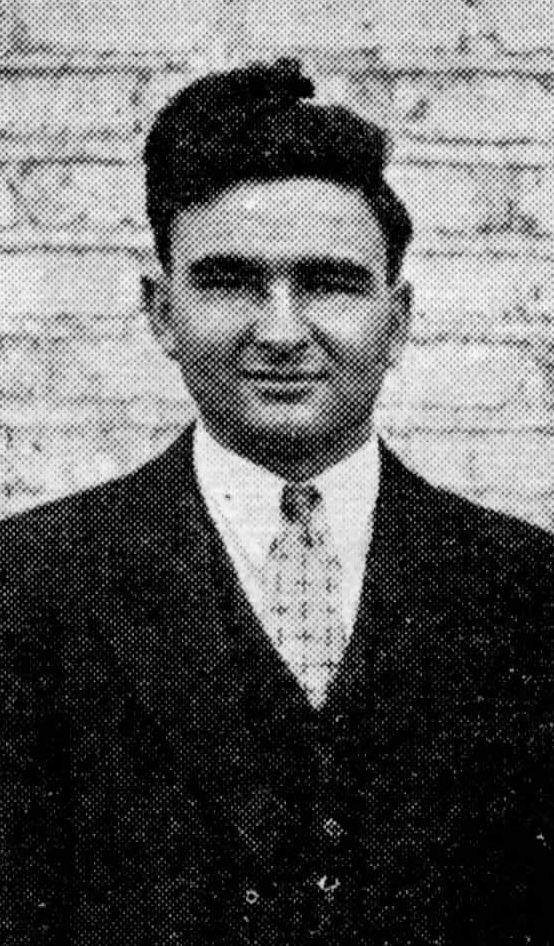

- Source: [archival record or issue](https://www.marxists.org/history/usa/pubs/labordefender/1930/v05n04-apr-1930-LD.pdf#page=10)
- Credit: Labor Defender, Apr 1930, PDF page 10; International Labor Defense, publisher. Digitized issue supplied by Marxists Internet Archive / Riazanov Library; individual photographer not identified.
- Rights: Photograph published in the United States in 1930; public domain in the United States by 2026. This statement concerns the historical published image, not newly authored archive website material.
- Identity: April 1930 PDF page 10, The Gastonia 7. Caption identifies the person as first standing; name and Gastonia prosecution agree with the existing profile.
- Download: [original source](https://www.marxists.org/history/usa/pubs/labordefender/1930/v05n04-apr-1930-LD.pdf)
- Preserved original: [batch263-originals/1930-apr-p10-Im0.jpg](batch263-originals/1930-apr-p10-Im0.jpg)
- Counterclockwise rotation before crop: 90 degrees. Crop box: `[226, 184, 780, 1130]` (left, top, exclusive right, exclusive bottom in rotated image); source dimensions: `[2986, 3229]`.
- Source SHA-256: `80328ef158deb231fe8adb45447274de24c8c9c9c8057090bc95fcf7a6fc535c`
- Portrait SHA-256: `351befc946d887f271f3b771f96a4c8877b1412bc4107095fa65e992b59bfc22`

## Martin Johnson

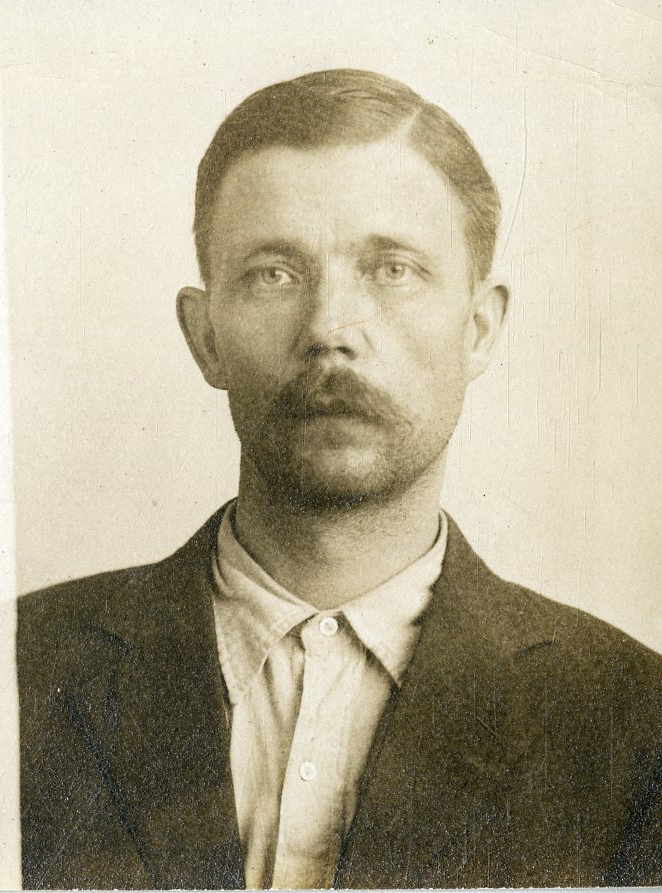

- Source: [archival record or issue](https://catalog.archives.gov/id/117704073)
- Credit: U.S. Penitentiary, Leavenworth booking photograph; National Archives at Kansas City, Record Group 129, series 571125, inmate 13383.
- Rights: U.S. federal-government prison photograph, public domain in the United States. NARA catalogs this photographic item as Unrestricted for use and access; individual photographer not identified.
- Identity: NARA catalogs this image as Photograph of Martin Johnson, Leavenworth inmate 13383. The named photographic record and identifying inscriptions were checked against the existing wartime prisoner profile. The frontal image is cropped from the right.
- Download: [original source](https://catalog.archives.gov/medialz/kansas-city/rg-129/571125/571125_13383-MartinJohnson_001.jpg)
- Preserved original: [batch263-originals/571125_13383-MartinJohnson_001.jpg](batch263-originals/571125_13383-MartinJohnson_001.jpg)
- Counterclockwise rotation before crop: 0 degrees. Crop box: `[662, 0, 1324, 893]` (left, top, exclusive right, exclusive bottom in rotated image); source dimensions: `[1324, 893]`.
- Source SHA-256: `c99cc115e10a03f42e7e0cc30b8affc4b2970e15ba378308235558d77f323a8c`
- Portrait SHA-256: `b015d4d10909a65ddddbdd186115bb5a8fae8f54beda46c048011d3cbed7e82a`
- Identifying reverse: [batch263-originals/571125_13383-MartinJohnson_002.jpg](batch263-originals/571125_13383-MartinJohnson_002.jpg)

## Martin Simich

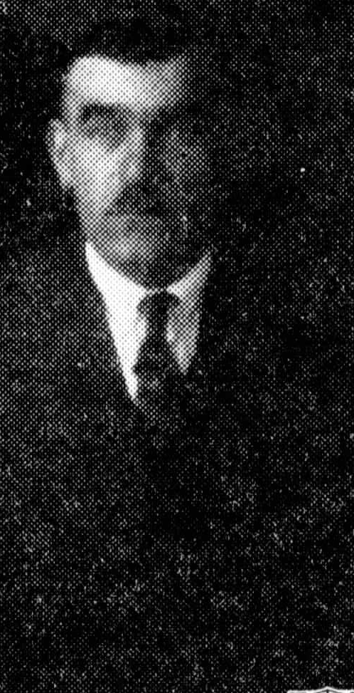

- Source: [archival record or issue](https://www.marxists.org/history/usa/pubs/labordefender/1926/v01n04-apr-1926-ORIG-LD.pdf#page=5)
- Credit: Labor Defender, Apr 1926, PDF page 5; International Labor Defense, publisher. Digitized issue supplied by Marxists Internet Archive / Riazanov Library; individual photographer not identified.
- Rights: Photograph published in the United States in 1926; public domain in the United States by 2026. This statement concerns the historical published image, not newly authored archive website material.
- Identity: Caption identifies this miner as sixth from the left in Six of the Convicted Miners, April 1926 printed page 53 (PDF page 5). Name and Zeigler case agree with the existing profile.
- Download: [original source](https://www.marxists.org/history/usa/pubs/labordefender/1926/v01n04-apr-1926-ORIG-LD.pdf)
- Preserved original: [batch263-originals/apr-p5-Im0.jpg](batch263-originals/apr-p5-Im0.jpg)
- Counterclockwise rotation before crop: 90 degrees. Crop box: `[3411, 5384, 3909, 6357]` (left, top, exclusive right, exclusive bottom in rotated image); source dimensions: `[7239, 5311]`.
- Source SHA-256: `6a4678663b1289d15bbae60fddcbf9d0527e88ee651613822f328b30ce93977c`
- Portrait SHA-256: `d0d6714ab6b13a3ee7f420c2209eeb082331f235361554e3801e75aca07a8239`

## Mike Karadich

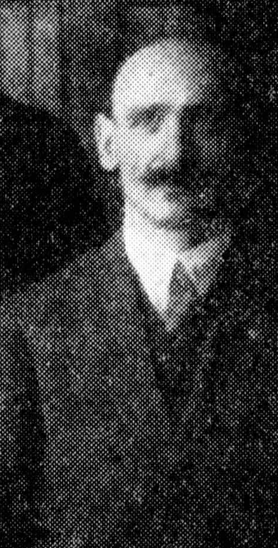

- Source: [archival record or issue](https://www.marxists.org/history/usa/pubs/labordefender/1926/v01n04-apr-1926-ORIG-LD.pdf#page=5)
- Credit: Labor Defender, Apr 1926, PDF page 5; International Labor Defense, publisher. Digitized issue supplied by Marxists Internet Archive / Riazanov Library; individual photographer not identified.
- Rights: Photograph published in the United States in 1926; public domain in the United States by 2026. This statement concerns the historical published image, not newly authored archive website material.
- Identity: Caption identifies this miner as fourth from the left in Six of the Convicted Miners, April 1926 printed page 53 (PDF page 5). Name and Zeigler case agree with the existing profile.
- Download: [original source](https://www.marxists.org/history/usa/pubs/labordefender/1926/v01n04-apr-1926-ORIG-LD.pdf)
- Preserved original: [batch263-originals/apr-p5-Im0.jpg](batch263-originals/apr-p5-Im0.jpg)
- Counterclockwise rotation before crop: 90 degrees. Crop box: `[2579, 5226, 3049, 6153]` (left, top, exclusive right, exclusive bottom in rotated image); source dimensions: `[7239, 5311]`.
- Source SHA-256: `6a4678663b1289d15bbae60fddcbf9d0527e88ee651613822f328b30ce93977c`
- Portrait SHA-256: `afe74d85d708fd32e6b7384247f820ca8a6253c3befa692c0dd937843d4cfc48`

## Morris Langer

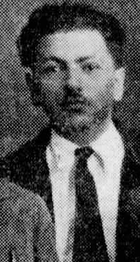

- Source: [archival record or issue](https://www.marxists.org/history/usa/pubs/labordefender/1930/v05n05-may-1930-LD.pdf#page=12)
- Credit: Labor Defender, May 1930, PDF page 12; International Labor Defense, publisher. Digitized issue supplied by Marxists Internet Archive / Riazanov Library; individual photographer not identified. Group photograph credited in print to Newark ILD.
- Rights: Photograph published in the United States in 1930; public domain in the United States by 2026. This statement concerns the historical published image, not newly authored archive website material.
- Identity: May 1930 printed page 89 (PDF page 12), A Reply to Hunger. Caption explicitly identifies Morris Langer, first in the rear row of the Newark group; the locality and 1930 prosecution agree with the existing profile.
- Download: [original source](https://www.marxists.org/history/usa/pubs/labordefender/1930/v05n05-may-1930-LD.pdf)
- Preserved original: [batch263-originals/1930-may-p12-Im0.jpg](batch263-originals/1930-may-p12-Im0.jpg)
- Counterclockwise rotation before crop: 270 degrees. Crop box: `[1504, 2559, 1706, 2936]` (left, top, exclusive right, exclusive bottom in rotated image); source dimensions: `[4755, 3523]`.
- Source SHA-256: `b6d73d1ebeb39ce3d2edc7c0c1f7bbcc1fdc57860052e5f10e6660cbd06b198a`
- Portrait SHA-256: `f26b62d67a1dfac74132e591f9ce20aa08972afba29a1847ecac631a8940643b`

## Murry Melvin

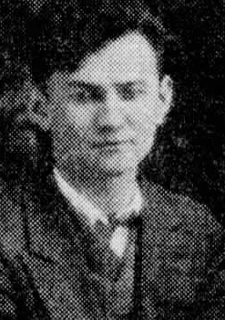

- Source: [archival record or issue](https://www.marxists.org/history/usa/pubs/labordefender/1930/v05n05-may-1930-LD.pdf#page=12)
- Credit: Labor Defender, May 1930, PDF page 12; International Labor Defense, publisher. Digitized issue supplied by Marxists Internet Archive / Riazanov Library; individual photographer not identified. Group photograph credited in print to Buffalo ILD.
- Rights: Photograph published in the United States in 1930; public domain in the United States by 2026. This statement concerns the historical published image, not newly authored archive website material.
- Identity: May 1930 printed page 89 (PDF page 12), A Reply to Hunger. Caption explicitly identifies Murry Melvin, first in the front row of the Buffalo group; the locality and 1930 prosecution agree with the existing profile.
- Download: [original source](https://www.marxists.org/history/usa/pubs/labordefender/1930/v05n05-may-1930-LD.pdf)
- Preserved original: [batch263-originals/1930-may-p12-Im0.jpg](batch263-originals/1930-may-p12-Im0.jpg)
- Counterclockwise rotation before crop: 270 degrees. Crop box: `[223, 1953, 470, 2303]` (left, top, exclusive right, exclusive bottom in rotated image); source dimensions: `[4755, 3523]`.
- Source SHA-256: `b6d73d1ebeb39ce3d2edc7c0c1f7bbcc1fdc57860052e5f10e6660cbd06b198a`
- Portrait SHA-256: `9daccd26d269909425b0c242e1dced728fbf6d377074f21af4dd677234d7a15a`

## Otto Eisner

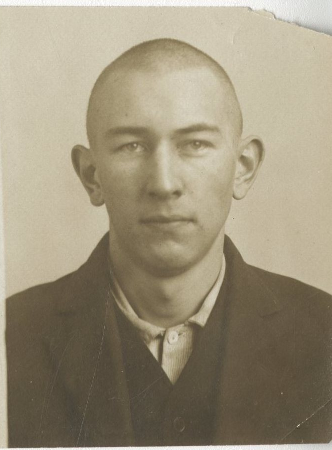

- Source: [archival record or issue](https://catalog.archives.gov/id/117719392)
- Credit: U.S. Penitentiary, Leavenworth booking photograph; National Archives at Kansas City, Record Group 129, series 571125, inmate 13592.
- Rights: U.S. federal-government prison photograph, public domain in the United States. NARA catalogs this photographic item as Unrestricted for use and access; individual photographer not identified.
- Identity: NARA catalogs this image as Photograph of Otto Elsner, Leavenworth inmate 13592. The named photographic record and identifying inscriptions were checked against the existing wartime prisoner profile. The frontal image is cropped from the right. Catalog spelling/expanded name is preserved in the source title; existing display name Otto Eisner remains unchanged. The matching incarceration context was checked before selecting the portrait.
- Download: [original source](https://catalog.archives.gov/medialz/kansas-city/rg-129/571125/571125_13592-OttoElsner_001.jpg)
- Preserved original: [batch263-originals/571125_13592-OttoElsner_001.jpg](batch263-originals/571125_13592-OttoElsner_001.jpg)
- Counterclockwise rotation before crop: 0 degrees. Crop box: `[668, 0, 1337, 906]` (left, top, exclusive right, exclusive bottom in rotated image); source dimensions: `[1337, 906]`.
- Source SHA-256: `9ca46531899265fea296325bffd9487737778a3605cc1fbf531d073f582cc9d4`
- Portrait SHA-256: `fd9f106876d09d70442cd370668171e0e2de6e477b107cd38b357fe9e439947b`
- Identifying reverse: [batch263-originals/571125_13592-OttoElsner_002.jpg](batch263-originals/571125_13592-OttoElsner_002.jpg)

## P. J. Higgins

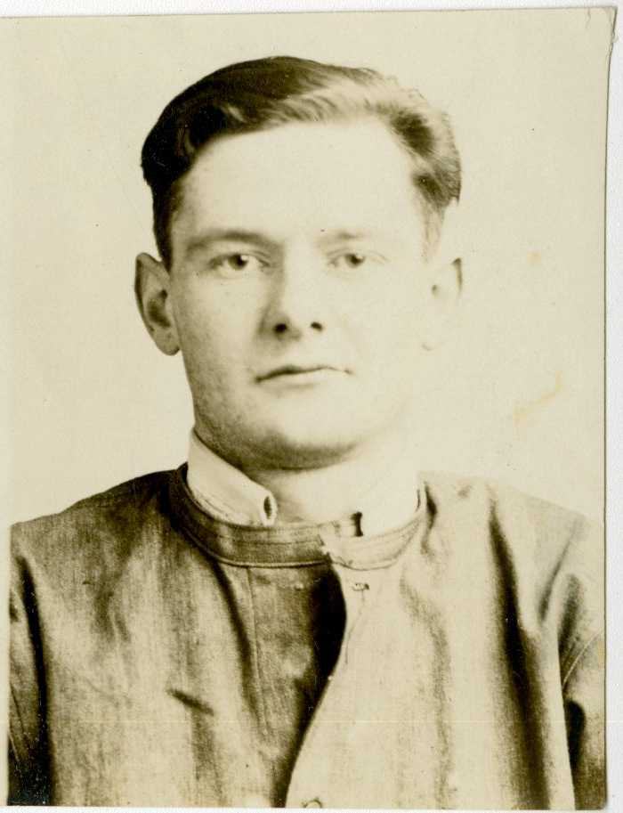

- Source: [archival record or issue](https://catalog.archives.gov/id/160922110)
- Credit: U.S. Penitentiary, Leavenworth booking photograph; National Archives at Kansas City, Record Group 129, series 571125, inmate 14816.
- Rights: U.S. federal-government prison photograph, public domain in the United States. NARA catalogs this photographic item as Unrestricted for use and access; individual photographer not identified.
- Identity: NARA catalogs this image as Photograph of Peter J. Higgins, Leavenworth inmate 14816. The named photographic record and identifying inscriptions were checked against the existing wartime prisoner profile. The frontal image is cropped from the right. Catalog spelling/expanded name is preserved in the source title; existing display name P. J. Higgins remains unchanged. The matching incarceration context was checked before selecting the portrait.
- Download: [original source](https://catalog.archives.gov/medialz/kansas-city/rg-129/571125/571125_14816-PeterJHiggins_001.jpg)
- Preserved original: [batch263-originals/571125_14816-PeterJHiggins_001.jpg](batch263-originals/571125_14816-PeterJHiggins_001.jpg)
- Counterclockwise rotation before crop: 0 degrees. Crop box: `[700, 0, 1400, 913]` (left, top, exclusive right, exclusive bottom in rotated image); source dimensions: `[1400, 913]`.
- Source SHA-256: `f58b82b5e071aded26756b00d5019eccaf88040a7a72119df5be07308a86502e`
- Portrait SHA-256: `6dffe365c2bdd912be22d60afb920fbba7d8a2d9c508ce0955a3f3fdd2d944b8`
- Identifying reverse: [batch263-originals/571125_14816-PeterJHiggins_002.jpg](batch263-originals/571125_14816-PeterJHiggins_002.jpg)

## Perley J. Burns

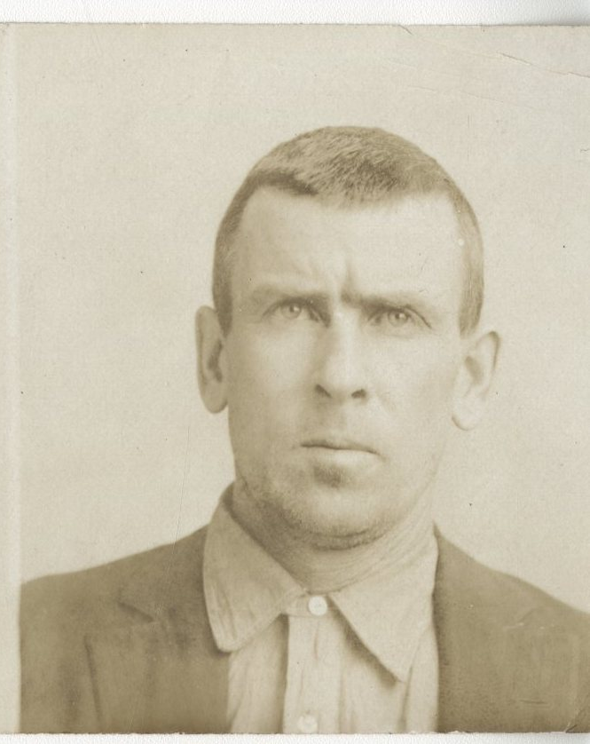

- Source: [archival record or issue](https://catalog.archives.gov/id/117719965)
- Credit: U.S. Penitentiary, Leavenworth booking photograph; National Archives at Kansas City, Record Group 129, series 571125, inmate 13768.
- Rights: U.S. federal-government prison photograph, public domain in the United States. NARA catalogs this photographic item as Unrestricted for use and access; individual photographer not identified.
- Identity: NARA catalogs this image as Photograph of Perley J. Burns, Leavenworth inmate 13768. The named photographic record and identifying inscriptions were checked against the existing wartime prisoner profile. The frontal image is cropped from the right. The reverse numeral is ambiguous (13748/13768); catalog and front identify 13768. The distinctive full name and wartime Espionage Act context agree; no existing case data is changed.
- Download: [original source](https://catalog.archives.gov/medialz/kansas-city/rg-129/571125/571125_13768-PerleyBurns_001.jpg)
- Preserved original: [batch263-originals/571125_13768-PerleyBurns_001.jpg](batch263-originals/571125_13768-PerleyBurns_001.jpg)
- Counterclockwise rotation before crop: 0 degrees. Crop box: `[665, 0, 1330, 838]` (left, top, exclusive right, exclusive bottom in rotated image); source dimensions: `[1330, 838]`.
- Source SHA-256: `1e2c04a0b87734b767843a3ea87b9f868dbcba69f10c1420e0ca5398ebfd9f73`
- Portrait SHA-256: `2f5a2874b1260cd216748c79c53c240f1bfcc4f2bfc88b204b9c2770b8d2653d`
- Identifying reverse: [batch263-originals/571125_13768-PerleyBurns_002.jpg](batch263-originals/571125_13768-PerleyBurns_002.jpg)

## Peter Perruchon

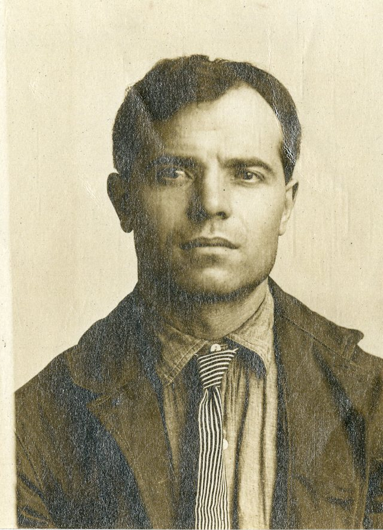

- Source: [archival record or issue](https://catalog.archives.gov/id/117702583)
- Credit: U.S. Penitentiary, Leavenworth booking photograph; National Archives at Kansas City, Record Group 129, series 571125, inmate 12896.
- Rights: U.S. federal-government prison photograph, public domain in the United States. NARA catalogs this photographic item as Unrestricted for use and access; individual photographer not identified.
- Identity: NARA catalogs this image as Photograph of Peter Perruchon, Leavenworth inmate 12896. The named photographic record and identifying inscriptions were checked against the existing wartime prisoner profile. The frontal image is cropped from the right.
- Download: [original source](https://catalog.archives.gov/medialz/kansas-city/rg-129/571125/571125_12896-PeterPerruchon_001.jpg)
- Preserved original: [batch263-originals/571125_12896-PeterPerruchon_001.jpg](batch263-originals/571125_12896-PeterPerruchon_001.jpg)
- Counterclockwise rotation before crop: 0 degrees. Crop box: `[640, 0, 1280, 885]` (left, top, exclusive right, exclusive bottom in rotated image); source dimensions: `[1280, 885]`.
- Source SHA-256: `b3ec951fdb6548f2cd73474e75e996bc4ea18168329d5b58b3cfc342f2533e5e`
- Portrait SHA-256: `8e03e7ebfde7d1065d9bc66e946911c2d2a724f7d29ce4941c385384009ee2ca`
- Identifying reverse: [batch263-originals/571125_12896-PeterPerruchon_002.jpg](batch263-originals/571125_12896-PeterPerruchon_002.jpg)

## R. J. Bobba

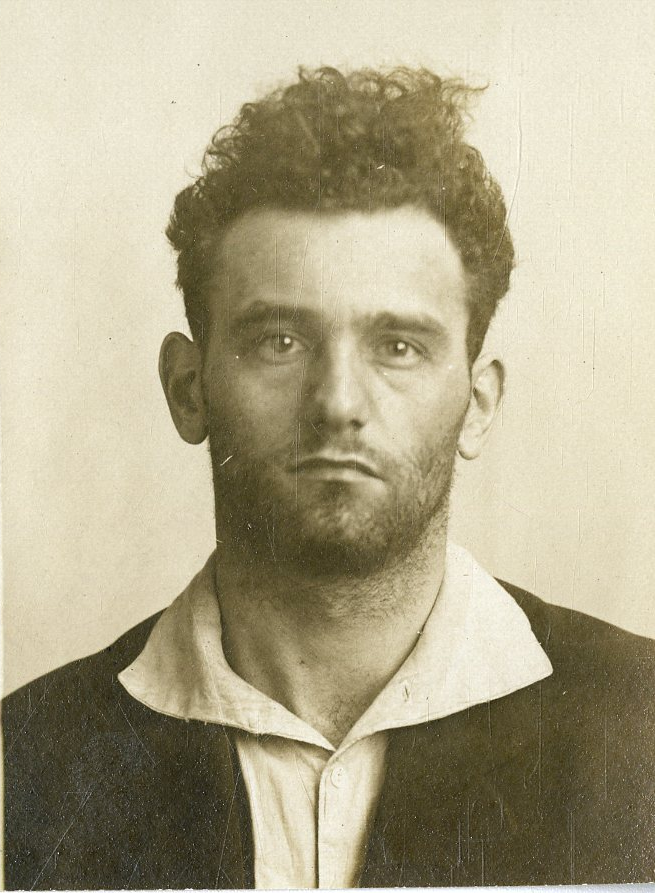

- Source: [archival record or issue](https://catalog.archives.gov/id/117703451)
- Credit: U.S. Penitentiary, Leavenworth booking photograph; National Archives at Kansas City, Record Group 129, series 571125, inmate 13184.
- Rights: U.S. federal-government prison photograph, public domain in the United States. NARA catalogs this photographic item as Unrestricted for use and access; individual photographer not identified.
- Identity: NARA catalogs this image as Photograph of R. J. Bobba, Leavenworth inmate 13184. The named photographic record and identifying inscriptions were checked against the existing wartime prisoner profile. The frontal image is cropped from the right. The Chicago IWW name/inmate-number roster reproduced by NARA in its October 2017 newsletter corroborates this group: https://www.archives.gov/files/kansas-city/press/newsletter/2017-october.pdf#page=6 .
- Download: [original source](https://catalog.archives.gov/medialz/kansas-city/rg-129/571125/571125_13184-RJBobba_001.jpg)
- Preserved original: [batch263-originals/571125_13184-RJBobba_001.jpg](batch263-originals/571125_13184-RJBobba_001.jpg)
- Counterclockwise rotation before crop: 0 degrees. Crop box: `[655, 0, 1310, 893]` (left, top, exclusive right, exclusive bottom in rotated image); source dimensions: `[1310, 893]`.
- Source SHA-256: `51947ab83ea40fc44363ae989ad4337fef301629386cade3602747554a56105d`
- Portrait SHA-256: `5e1b14288174faf1e31ec422c7a4401edfade36370cf55a04aca59a7d29e00ee`
- Identifying reverse: [batch263-originals/571125_13184-RJBobba_002.jpg](batch263-originals/571125_13184-RJBobba_002.jpg)

## Ray Corder

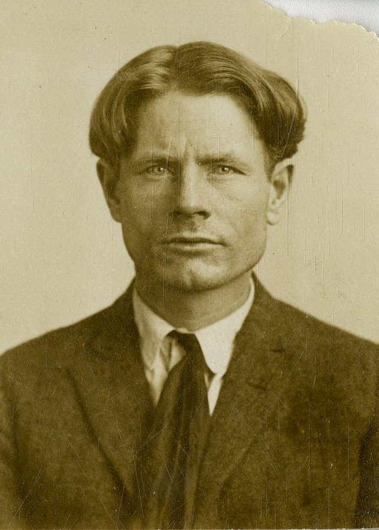

- Source: [archival record or issue](https://catalog.archives.gov/id/117703459)
- Credit: U.S. Penitentiary, Leavenworth booking photograph; National Archives at Kansas City, Record Group 129, series 571125, inmate 13186.
- Rights: U.S. federal-government prison photograph, public domain in the United States. NARA catalogs this photographic item as Unrestricted for use and access; individual photographer not identified.
- Identity: NARA catalogs this image as Photograph of Ray Corder, Leavenworth inmate 13186. The named photographic record and identifying inscriptions were checked against the existing wartime prisoner profile. The frontal image is cropped from the right. The Chicago IWW name/inmate-number roster reproduced by NARA in its October 2017 newsletter corroborates this group: https://www.archives.gov/files/kansas-city/press/newsletter/2017-october.pdf#page=6 .
- Download: [original source](https://catalog.archives.gov/medialz/kansas-city/rg-129/571125/571125_13186-RayCorder_001.jpg)
- Preserved original: [batch263-originals/571125_13186-RayCorder_001.jpg](batch263-originals/571125_13186-RayCorder_001.jpg)
- Counterclockwise rotation before crop: 0 degrees. Crop box: `[633, 0, 1266, 885]` (left, top, exclusive right, exclusive bottom in rotated image); source dimensions: `[1266, 885]`.
- Source SHA-256: `540e82375730ad3d25fa0760ecda293a3ca010aa4ace6d0bfe65c4d931e08f68`
- Portrait SHA-256: `0cb4fafcdbf6468fe0a7f147b636e42f3ceb520bcc3be206da8df79d9768041b`
- Identifying reverse: [batch263-originals/571125_13186-RayCorder_002.jpg](batch263-originals/571125_13186-RayCorder_002.jpg)

## Ray Peltz

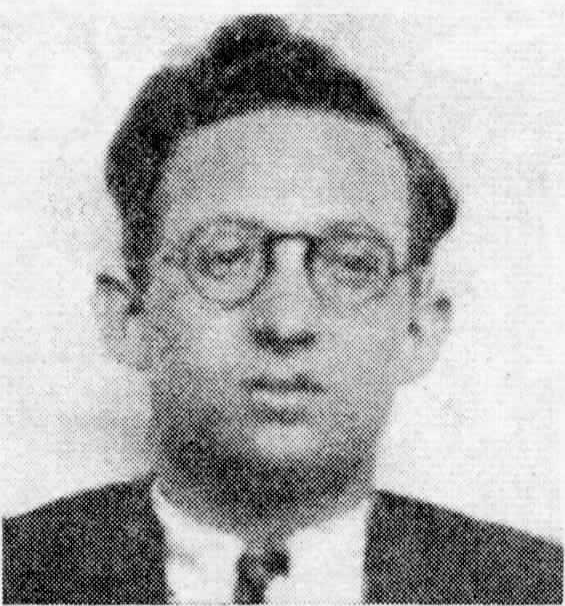

- Source: [archival record or issue](https://www.marxists.org/history/usa/pubs/labordefender/1930/v05n05-may-1930-LD.pdf#page=12)
- Credit: Labor Defender, May 1930, PDF page 12; International Labor Defense, publisher. Digitized issue supplied by Marxists Internet Archive / Riazanov Library; individual photographer not identified.
- Rights: Photograph published in the United States in 1930; public domain in the United States by 2026. This statement concerns the historical published image, not newly authored archive website material.
- Identity: May 1930 printed page 89 (PDF page 12), A Reply to Hunger. Caption explicitly identifies Ray Pelz, individual photograph; Chester textile-union sedition case; the locality and 1930 prosecution agree with the existing profile.
- Download: [original source](https://www.marxists.org/history/usa/pubs/labordefender/1930/v05n05-may-1930-LD.pdf)
- Preserved original: [batch263-originals/1930-may-p12-Im0.jpg](batch263-originals/1930-may-p12-Im0.jpg)
- Counterclockwise rotation before crop: 270 degrees. Crop box: `[187, 434, 752, 1040]` (left, top, exclusive right, exclusive bottom in rotated image); source dimensions: `[4755, 3523]`.
- Source SHA-256: `b6d73d1ebeb39ce3d2edc7c0c1f7bbcc1fdc57860052e5f10e6660cbd06b198a`
- Portrait SHA-256: `a9228092771064e7e698ddb7a90e57b8d6eb770c6280ee3574828c8ed92f40a5`

## Roy A. Brown

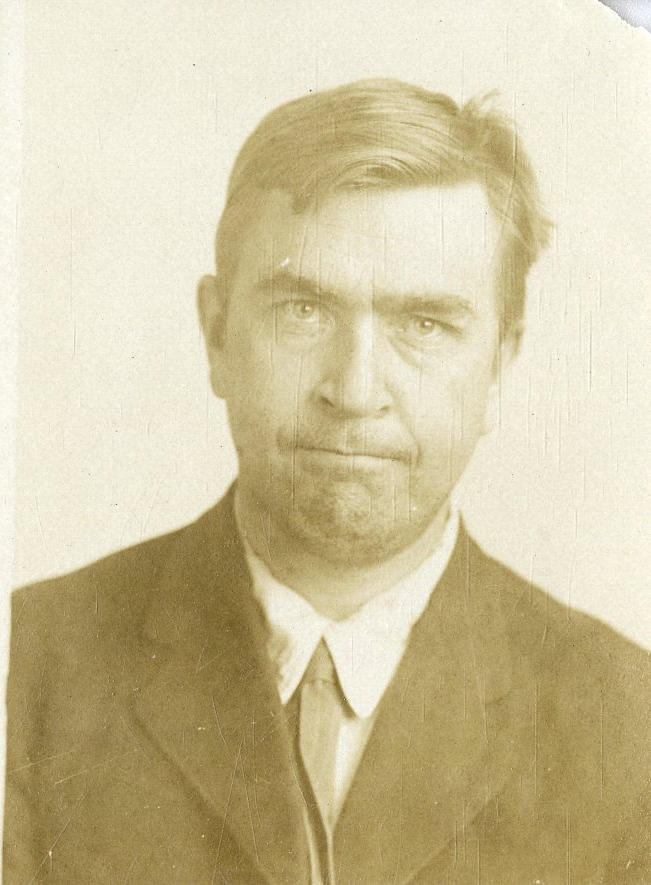

- Source: [archival record or issue](https://catalog.archives.gov/id/117703456)
- Credit: U.S. Penitentiary, Leavenworth booking photograph; National Archives at Kansas City, Record Group 129, series 571125, inmate 13185.
- Rights: U.S. federal-government prison photograph, public domain in the United States. NARA catalogs this photographic item as Unrestricted for use and access; individual photographer not identified.
- Identity: NARA catalogs this image as Photograph of Roy A. Brown, Leavenworth inmate 13185. The named photographic record and identifying inscriptions were checked against the existing wartime prisoner profile. The frontal image is cropped from the right. The Chicago IWW name/inmate-number roster reproduced by NARA in its October 2017 newsletter corroborates this group: https://www.archives.gov/files/kansas-city/press/newsletter/2017-october.pdf#page=6 .
- Download: [original source](https://catalog.archives.gov/medialz/kansas-city/rg-129/571125/571125_13185-RoyABrown_001.jpg)
- Preserved original: [batch263-originals/571125_13185-RoyABrown_001.jpg](batch263-originals/571125_13185-RoyABrown_001.jpg)
- Counterclockwise rotation before crop: 0 degrees. Crop box: `[651, 0, 1302, 885]` (left, top, exclusive right, exclusive bottom in rotated image); source dimensions: `[1302, 885]`.
- Source SHA-256: `98f648e104a07d5bc564a19e90b06995bdded429b13193e41d4dbc02e0b97f22`
- Portrait SHA-256: `80273b3f5bce40d26d9f57dcebd45b53089df29b02329caba833f0a52c35d80c`
- Identifying reverse: [batch263-originals/571125_13185-RoyABrown_002.jpg](batch263-originals/571125_13185-RoyABrown_002.jpg)

## Roy P. Connor

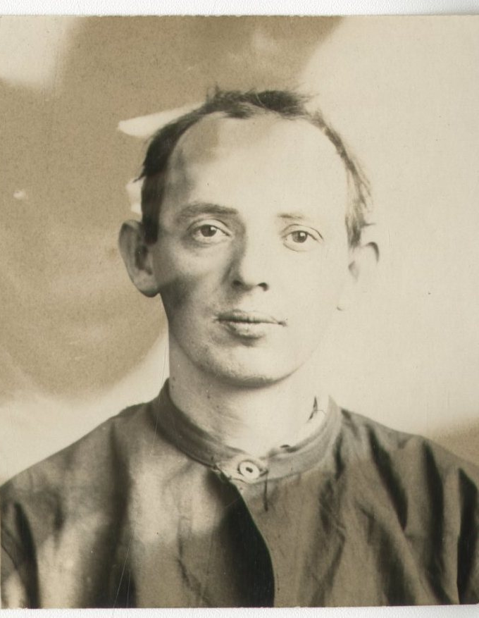

- Source: [archival record or issue](https://catalog.archives.gov/id/117719310)
- Credit: U.S. Penitentiary, Leavenworth booking photograph; National Archives at Kansas City, Record Group 129, series 571125, inmate 13564.
- Rights: U.S. federal-government prison photograph, public domain in the United States. NARA catalogs this photographic item as Unrestricted for use and access; individual photographer not identified.
- Identity: NARA catalogs this image as Photograph of Roy P. Connor, Leavenworth inmate 13564. The named photographic record and identifying inscriptions were checked against the existing wartime prisoner profile. The frontal image is cropped from the right.
- Download: [original source](https://catalog.archives.gov/medialz/kansas-city/rg-129/571125/571125_13564-RoyConnor_001.jpg)
- Preserved original: [batch263-originals/571125_13564-RoyConnor_001.jpg](batch263-originals/571125_13564-RoyConnor_001.jpg)
- Counterclockwise rotation before crop: 0 degrees. Crop box: `[679, 0, 1359, 877]` (left, top, exclusive right, exclusive bottom in rotated image); source dimensions: `[1359, 877]`.
- Source SHA-256: `05d1aeed35926355b7aecc8ae7bb18953dd82cd08039e34c57cfc15602950938`
- Portrait SHA-256: `76b535301277b7b0dfae516a874a3f0900380811749f0f04dbde3697d388e8b6`
- Identifying reverse: [batch263-originals/571125_13564-RoyConnor_002.jpg](batch263-originals/571125_13564-RoyConnor_002.jpg)

## Ruth Williams

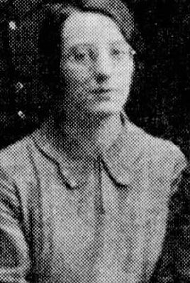

- Source: [archival record or issue](https://www.marxists.org/history/usa/pubs/labordefender/1930/v05n05-may-1930-LD.pdf#page=12)
- Credit: Labor Defender, May 1930, PDF page 12; International Labor Defense, publisher. Digitized issue supplied by Marxists Internet Archive / Riazanov Library; individual photographer not identified. Group photograph credited in print to Buffalo ILD.
- Rights: Photograph published in the United States in 1930; public domain in the United States by 2026. This statement concerns the historical published image, not newly authored archive website material.
- Identity: May 1930 printed page 89 (PDF page 12), A Reply to Hunger. Caption explicitly identifies Ruth Williams, third in the front row of the Buffalo group; the locality and 1930 prosecution agree with the existing profile.
- Download: [original source](https://www.marxists.org/history/usa/pubs/labordefender/1930/v05n05-may-1930-LD.pdf)
- Preserved original: [batch263-originals/1930-may-p12-Im0.jpg](batch263-originals/1930-may-p12-Im0.jpg)
- Counterclockwise rotation before crop: 270 degrees. Crop box: `[862, 1908, 1130, 2306]` (left, top, exclusive right, exclusive bottom in rotated image); source dimensions: `[4755, 3523]`.
- Source SHA-256: `b6d73d1ebeb39ce3d2edc7c0c1f7bbcc1fdc57860052e5f10e6660cbd06b198a`
- Portrait SHA-256: `0cbb18c7994d6a85d35f6fb6e07cac50b506e7012a59291c406b226d25334a7f`

## Sam Jacobs

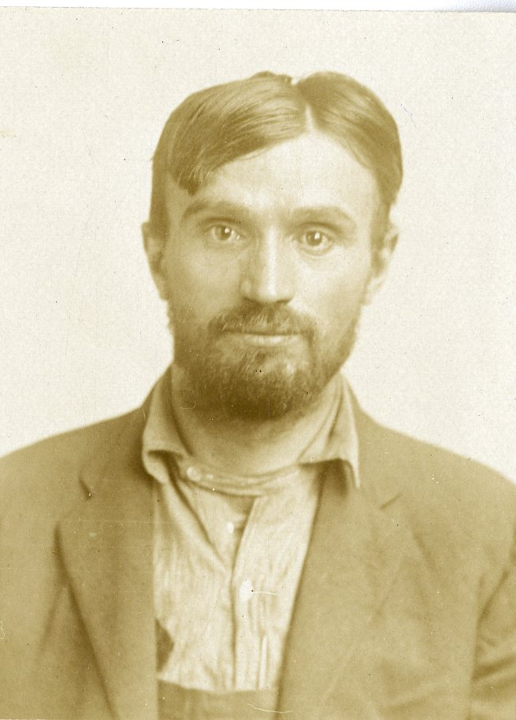

- Source: [archival record or issue](https://catalog.archives.gov/id/117702041)
- Credit: U.S. Penitentiary, Leavenworth booking photograph; National Archives at Kansas City, Record Group 129, series 571125, inmate 12735.
- Rights: U.S. federal-government prison photograph, public domain in the United States. NARA catalogs this photographic item as Unrestricted for use and access; individual photographer not identified.
- Identity: NARA catalogs this image as Photograph of Sam Jacobs, Leavenworth inmate 12735. The named photographic record and identifying inscriptions were checked against the existing wartime prisoner profile. The frontal image is cropped from the right.
- Download: [original source](https://catalog.archives.gov/medialz/kansas-city/rg-129/571125/571125_12735-SamJacobs_001.jpg)
- Preserved original: [batch263-originals/571125_12735-SamJacobs_001.jpg](batch263-originals/571125_12735-SamJacobs_001.jpg)
- Counterclockwise rotation before crop: 0 degrees. Crop box: `[655, 0, 1310, 914]` (left, top, exclusive right, exclusive bottom in rotated image); source dimensions: `[1310, 914]`.
- Source SHA-256: `56c5b74682f52f2af380c907aca1f77952c51fde0939a8934d0559a986dd4652`
- Portrait SHA-256: `4928546a8cfa2dc135e39a9ed6352b833ec0d84f3d0e1ec7a302cc41aa01a8e4`
- Identifying reverse: [batch263-originals/571125_12735-SamJacobs_002.jpg](batch263-originals/571125_12735-SamJacobs_002.jpg)

## Samuel D. Levine

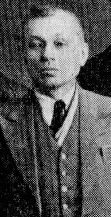

- Source: [archival record or issue](https://www.marxists.org/history/usa/pubs/labordefender/1930/v05n05-may-1930-LD.pdf#page=12)
- Credit: Labor Defender, May 1930, PDF page 12; International Labor Defense, publisher. Digitized issue supplied by Marxists Internet Archive / Riazanov Library; individual photographer not identified. Group photograph credited in print to Newark ILD.
- Rights: Photograph published in the United States in 1930; public domain in the United States by 2026. This statement concerns the historical published image, not newly authored archive website material.
- Identity: May 1930 printed page 89 (PDF page 12), A Reply to Hunger. Caption explicitly identifies Samuel D. Levine, third in the front row of the Newark group; the locality and 1930 prosecution agree with the existing profile.
- Download: [original source](https://www.marxists.org/history/usa/pubs/labordefender/1930/v05n05-may-1930-LD.pdf)
- Preserved original: [batch263-originals/1930-may-p12-Im0.jpg](batch263-originals/1930-may-p12-Im0.jpg)
- Counterclockwise rotation before crop: 270 degrees. Crop box: `[1718, 2606, 1947, 3052]` (left, top, exclusive right, exclusive bottom in rotated image); source dimensions: `[4755, 3523]`.
- Source SHA-256: `b6d73d1ebeb39ce3d2edc7c0c1f7bbcc1fdc57860052e5f10e6660cbd06b198a`
- Portrait SHA-256: `cd29748e6d8f1bd1e3d2b0385fcdf569ba6b1d2be2285cea8f4e34141ac40ea5`

## Stanley Paurez

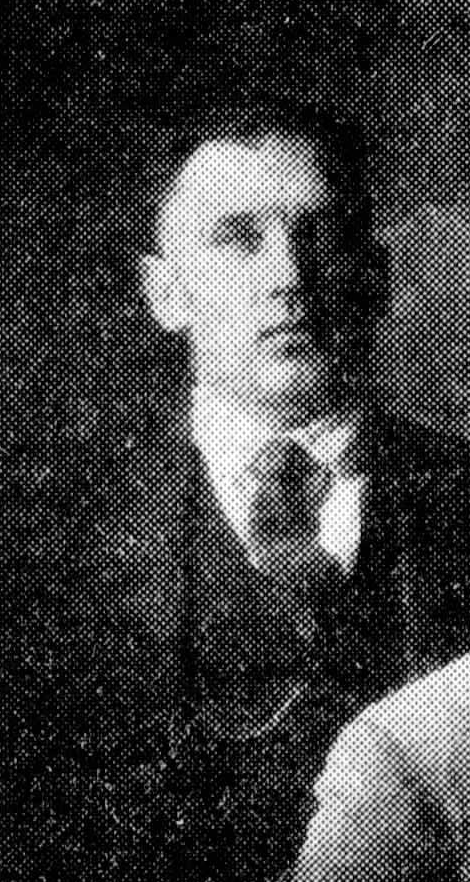

- Source: [archival record or issue](https://www.marxists.org/history/usa/pubs/labordefender/1926/v01n04-apr-1926-ORIG-LD.pdf#page=5)
- Credit: Labor Defender, Apr 1926, PDF page 5; International Labor Defense, publisher. Digitized issue supplied by Marxists Internet Archive / Riazanov Library; individual photographer not identified.
- Rights: Photograph published in the United States in 1926; public domain in the United States by 2026. This statement concerns the historical published image, not newly authored archive website material.
- Identity: Caption identifies this miner as first from the left in Six of the Convicted Miners, April 1926 printed page 53 (PDF page 5). Name and Zeigler case agree with the existing profile.
- Download: [original source](https://www.marxists.org/history/usa/pubs/labordefender/1926/v01n04-apr-1926-ORIG-LD.pdf)
- Preserved original: [batch263-originals/apr-p5-Im0.jpg](batch263-originals/apr-p5-Im0.jpg)
- Counterclockwise rotation before crop: 90 degrees. Crop box: `[1303, 5090, 1773, 5972]` (left, top, exclusive right, exclusive bottom in rotated image); source dimensions: `[7239, 5311]`.
- Source SHA-256: `6a4678663b1289d15bbae60fddcbf9d0527e88ee651613822f328b30ce93977c`
- Portrait SHA-256: `77cd3df400dd420572ed2e65304b83a855496bbfb42b51a83b260493545cfaa0`

## Stephan Graham

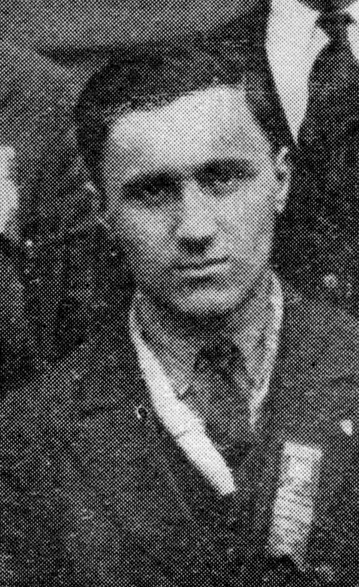

- Source: [archival record or issue](https://www.marxists.org/history/usa/pubs/labordefender/1930/v05n02-feb-1930-ORIG-LD.pdf#page=6)
- Credit: Labor Defender, Feb 1930, PDF page 6; International Labor Defense, publisher. Digitized issue supplied by Marxists Internet Archive / Riazanov Library; individual photographer not identified.
- Rights: Photograph published in the United States in 1930; public domain in the United States by 2026. This statement concerns the historical published image, not newly authored archive website material.
- Identity: February 1930 PDF page 6, Some of our best fighters. The caption explicitly identifies the person as second in the front row.
- Download: [original source](https://www.marxists.org/history/usa/pubs/labordefender/1930/v05n02-feb-1930-ORIG-LD.pdf)
- Preserved original: [batch263-originals/1930-feb-p6-Im0.jpg](batch263-originals/1930-feb-p6-Im0.jpg)
- Counterclockwise rotation before crop: 90 degrees. Crop box: `[1605, 932, 2244, 1977]` (left, top, exclusive right, exclusive bottom in rotated image); source dimensions: `[3639, 5325]`.
- Source SHA-256: `64c3c4e3964444951523a5b68a50bc4d637102ba06122c0a5f6a671c057c180a`
- Portrait SHA-256: `687aec8c1b3c42011b01daeca26c97868918e3f086ab3ce5ffb53a9b1b676b97`

## Steve Meanovich

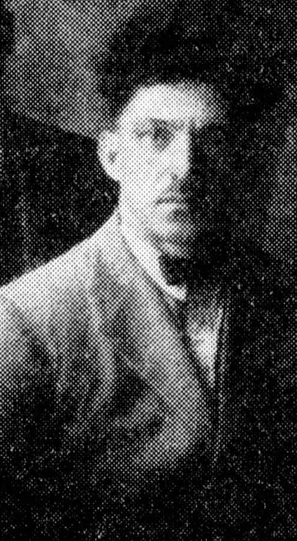

- Source: [archival record or issue](https://www.marxists.org/history/usa/pubs/labordefender/1926/v01n04-apr-1926-ORIG-LD.pdf#page=5)
- Credit: Labor Defender, Apr 1926, PDF page 5; International Labor Defense, publisher. Digitized issue supplied by Marxists Internet Archive / Riazanov Library; individual photographer not identified.
- Rights: Photograph published in the United States in 1926; public domain in the United States by 2026. This statement concerns the historical published image, not newly authored archive website material.
- Identity: Caption identifies this miner as second from the left in Six of the Convicted Miners, April 1926 printed page 53 (PDF page 5). Name and Zeigler case agree with the existing profile.
- Download: [original source](https://www.marxists.org/history/usa/pubs/labordefender/1926/v01n04-apr-1926-ORIG-LD.pdf)
- Preserved original: [batch263-originals/apr-p5-Im0.jpg](batch263-originals/apr-p5-Im0.jpg)
- Counterclockwise rotation before crop: 90 degrees. Crop box: `[1669, 5316, 2167, 6221]` (left, top, exclusive right, exclusive bottom in rotated image); source dimensions: `[7239, 5311]`.
- Source SHA-256: `6a4678663b1289d15bbae60fddcbf9d0527e88ee651613822f328b30ce93977c`
- Portrait SHA-256: `a17e8e5487a40809eb1804a0e152aa4073c06955e23e7e44bd5ed40053876821`

## Tom Johnson

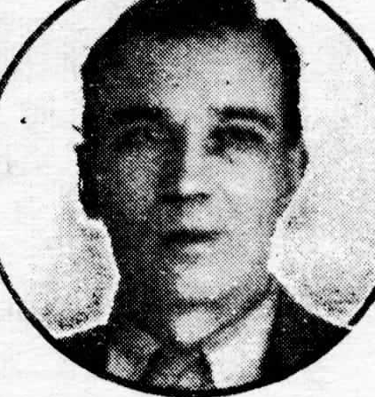

- Source: [archival record or issue](https://www.marxists.org/history/usa/pubs/labordefender/1930/v05n03-mar-1930-LD.pdf#page=9)
- Credit: Labor Defender, Mar 1930, PDF page 9; International Labor Defense, publisher. Digitized issue supplied by Marxists Internet Archive / Riazanov Library; individual photographer not identified.
- Rights: Photograph published in the United States in 1930; public domain in the United States by 2026. This statement concerns the historical published image, not newly authored archive website material.
- Identity: March 1930 printed page 47 (PDF page 9), 1105 Years in Prison. Individual caption identifies Tom Johnson, Cleveland Communist organizer; organizational and geographic context agrees with the existing profile.
- Download: [original source](https://www.marxists.org/history/usa/pubs/labordefender/1930/v05n03-mar-1930-LD.pdf)
- Preserved original: [batch263-originals/1930-mar-p9-Im0.jpg](batch263-originals/1930-mar-p9-Im0.jpg)
- Counterclockwise rotation before crop: 270 degrees. Crop box: `[2814, 3516, 3237, 3963]` (left, top, exclusive right, exclusive bottom in rotated image); source dimensions: `[4764, 3469]`.
- Source SHA-256: `2a7a6874381e99c73733507aebe9015508a17e3c4fa2f756b247093b2fd75a86`
- Portrait SHA-256: `8c14c1ac1becebd4fd856ca3f6a4041c683eefaabcf83df3051c51702d81353a`

## W. M. McGinnis

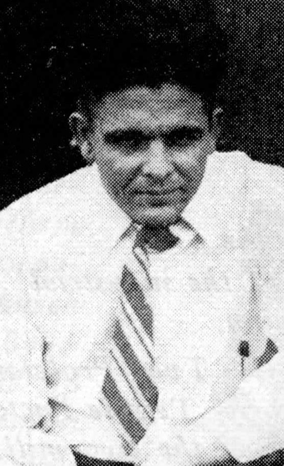

- Source: [archival record or issue](https://www.marxists.org/history/usa/pubs/labordefender/1930/v05n04-apr-1930-LD.pdf#page=10)
- Credit: Labor Defender, Apr 1930, PDF page 10; International Labor Defense, publisher. Digitized issue supplied by Marxists Internet Archive / Riazanov Library; individual photographer not identified.
- Rights: Photograph published in the United States in 1930; public domain in the United States by 2026. This statement concerns the historical published image, not newly authored archive website material.
- Identity: April 1930 PDF page 10, The Gastonia 7. Caption identifies the person as first kneeling; name and Gastonia prosecution agree with the existing profile.
- Download: [original source](https://www.marxists.org/history/usa/pubs/labordefender/1930/v05n04-apr-1930-LD.pdf)
- Preserved original: [batch263-originals/1930-apr-p10-Im0.jpg](batch263-originals/1930-apr-p10-Im0.jpg)
- Counterclockwise rotation before crop: 90 degrees. Crop box: `[609, 1326, 1165, 2237]` (left, top, exclusive right, exclusive bottom in rotated image); source dimensions: `[2986, 3229]`.
- Source SHA-256: `80328ef158deb231fe8adb45447274de24c8c9c9c8057090bc95fcf7a6fc535c`
- Portrait SHA-256: `c6ca6d27fc0766cd3897a8e7cc6753e02f65809d97bf7aa827e3d7643f0c1ba3`

## Walfred E. Marker

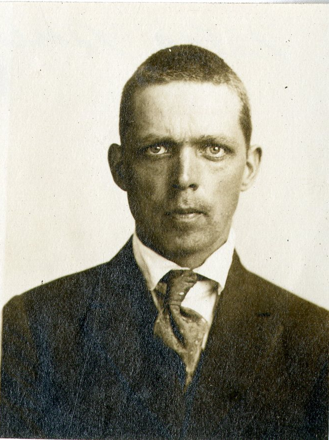

- Source: [archival record or issue](https://catalog.archives.gov/id/117702450)
- Credit: U.S. Penitentiary, Leavenworth booking photograph; National Archives at Kansas City, Record Group 129, series 571125, inmate 12857.
- Rights: U.S. federal-government prison photograph, public domain in the United States. NARA catalogs this photographic item as Unrestricted for use and access; individual photographer not identified.
- Identity: NARA catalogs this image as Photograph of Walfred E. Marker, Leavenworth inmate 12857. The named photographic record and identifying inscriptions were checked against the existing wartime prisoner profile. The frontal image is cropped from the right.
- Download: [original source](https://catalog.archives.gov/medialz/kansas-city/rg-129/571125/571125_12857-WalfredEMarker_001.jpg)
- Preserved original: [batch263-originals/571125_12857-WalfredEMarker_001.jpg](batch263-originals/571125_12857-WalfredEMarker_001.jpg)
- Counterclockwise rotation before crop: 0 degrees. Crop box: `[662, 0, 1324, 885]` (left, top, exclusive right, exclusive bottom in rotated image); source dimensions: `[1324, 885]`.
- Source SHA-256: `b9583a02dbefe223181fc65f9a4b723d51aa31fc5396016b3901d767ae54ef3a`
- Portrait SHA-256: `3b753d45338b0b37eb90246a23ba755409ede35ab30d144f3f6caceb1c8e637f`
- Identifying reverse: [batch263-originals/571125_12857-WalfredEMarker_002.jpg](batch263-originals/571125_12857-WalfredEMarker_002.jpg)

## Walter Smith

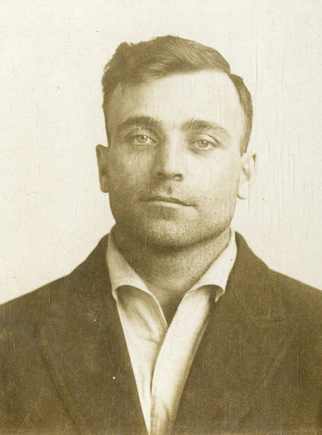

- Source: [archival record or issue](https://catalog.archives.gov/id/117703485)
- Credit: U.S. Penitentiary, Leavenworth booking photograph; National Archives at Kansas City, Record Group 129, series 571125, inmate 13192.
- Rights: U.S. federal-government prison photograph, public domain in the United States. NARA catalogs this photographic item as Unrestricted for use and access; individual photographer not identified.
- Identity: NARA catalogs this image as Photograph of Walter Smith, Leavenworth inmate 13192. The named photographic record and identifying inscriptions were checked against the existing wartime prisoner profile. The frontal image is cropped from the right. The Chicago IWW name/inmate-number roster reproduced by NARA in its October 2017 newsletter corroborates this group: https://www.archives.gov/files/kansas-city/press/newsletter/2017-october.pdf#page=6 .
- Download: [original source](https://catalog.archives.gov/medialz/kansas-city/rg-129/571125/571125_13192-WalterSmith_001.jpg)
- Preserved original: [batch263-originals/571125_13192-WalterSmith_001.jpg](batch263-originals/571125_13192-WalterSmith_001.jpg)
- Counterclockwise rotation before crop: 0 degrees. Crop box: `[655, 0, 1310, 885]` (left, top, exclusive right, exclusive bottom in rotated image); source dimensions: `[1310, 885]`.
- Source SHA-256: `80b3560da1e4cbbe95a899561b1ff09ca7bb47734f14a5a28840abb3401d2646`
- Portrait SHA-256: `b980af3b00101e82b04e4bd552fdfae518ed6ff8fa18a4bd1903f7fda33352be`
- Identifying reverse: [batch263-originals/571125_13192-WalterSmith_002.jpg](batch263-originals/571125_13192-WalterSmith_002.jpg)

## Walter Trumbull

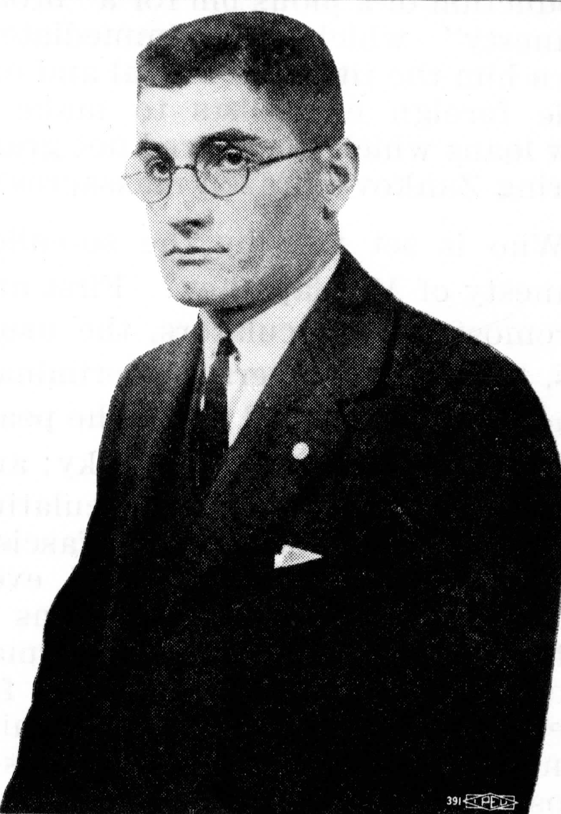

- Source: [archival record or issue](https://www.marxists.org/history/usa/pubs/labordefender/1926/v01n04-apr-1926-ORIG-LD.pdf#page=9)
- Credit: Labor Defender, Apr 1926, PDF page 9; International Labor Defense, publisher. Digitized issue supplied by Marxists Internet Archive / Riazanov Library; individual photographer not identified.
- Rights: Photograph published in the United States in 1926; public domain in the United States by 2026. This statement concerns the historical published image, not newly authored archive website material.
- Identity: The individual portrait is explicitly captioned Walter M. Trumbull in Chicago Greets Trumbull, April 1926 printed page 56 (PDF page 9). The accompanying story describes his release from Alcatraz.
- Download: [original source](https://www.marxists.org/history/usa/pubs/labordefender/1926/v01n04-apr-1926-ORIG-LD.pdf)
- Preserved original: [batch263-originals/apr-p9-Im0.jpg](batch263-originals/apr-p9-Im0.jpg)
- Counterclockwise rotation before crop: 90 degrees. Crop box: `[3669, 2493, 4985, 4398]` (left, top, exclusive right, exclusive bottom in rotated image); source dimensions: `[7239, 5311]`.
- Source SHA-256: `2e49c999de96b8f1ef131dbf0a97f37fb6483d83db295a9dcf74f0a21e1428c2`
- Portrait SHA-256: `d9b0f6cd58ad0542ce9f09e432c7bdee5cc44ca611c4fae7fa34a0849248e8f8`

## William Moran

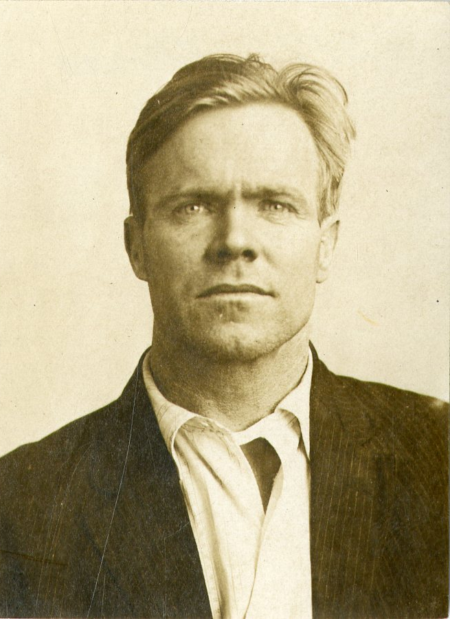

- Source: [archival record or issue](https://catalog.archives.gov/id/117703418)
- Credit: U.S. Penitentiary, Leavenworth booking photograph; National Archives at Kansas City, Record Group 129, series 571125, inmate 13171.
- Rights: U.S. federal-government prison photograph, public domain in the United States. NARA catalogs this photographic item as Unrestricted for use and access; individual photographer not identified.
- Identity: NARA catalogs this image as Photograph of William Moran, Leavenworth inmate 13171. The named photographic record and identifying inscriptions were checked against the existing wartime prisoner profile. The frontal image is cropped from the right. The Chicago IWW name/inmate-number roster reproduced by NARA in its October 2017 newsletter corroborates this group: https://www.archives.gov/files/kansas-city/press/newsletter/2017-october.pdf#page=6 .
- Download: [original source](https://catalog.archives.gov/medialz/kansas-city/rg-129/571125/571125_13171-WilliamMoran_001.jpg)
- Preserved original: [batch263-originals/571125_13171-WilliamMoran_001.jpg](batch263-originals/571125_13171-WilliamMoran_001.jpg)
- Counterclockwise rotation before crop: 0 degrees. Crop box: `[655, 0, 1310, 900]` (left, top, exclusive right, exclusive bottom in rotated image); source dimensions: `[1310, 900]`.
- Source SHA-256: `0e8f8e7db24e51fff505a37101b7703b82cca2036fd8131e36308fdf23d2387e`
- Portrait SHA-256: `51034fee34bd49940d7212c35abbf1d45eb366703cca54efb330dc1dcae908d7`
- Identifying reverse: [batch263-originals/571125_13171-WilliamMoran_002.jpg](batch263-originals/571125_13171-WilliamMoran_002.jpg)

## William Powell

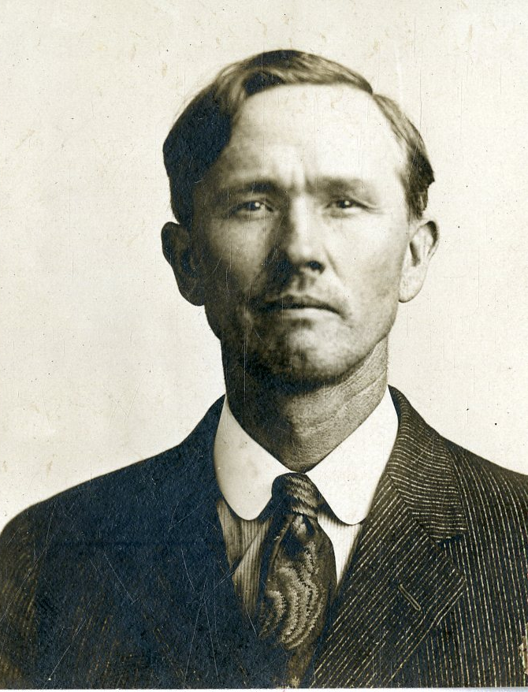

- Source: [archival record or issue](https://catalog.archives.gov/id/117703092)
- Credit: U.S. Penitentiary, Leavenworth booking photograph; National Archives at Kansas City, Record Group 129, series 571125, inmate 13053.
- Rights: U.S. federal-government prison photograph, public domain in the United States. NARA catalogs this photographic item as Unrestricted for use and access; individual photographer not identified.
- Identity: NARA catalogs this image as Photograph of William Powell, Leavenworth inmate 13053. The named photographic record and identifying inscriptions were checked against the existing wartime prisoner profile. The frontal image is cropped from the right.
- Download: [original source](https://catalog.archives.gov/medialz/kansas-city/rg-129/571125/571125_13053-WilliamPowell_001.jpg)
- Preserved original: [batch263-originals/571125_13053-WilliamPowell_001.jpg](batch263-originals/571125_13053-WilliamPowell_001.jpg)
- Counterclockwise rotation before crop: 0 degrees. Crop box: `[669, 0, 1339, 878]` (left, top, exclusive right, exclusive bottom in rotated image); source dimensions: `[1339, 878]`.
- Source SHA-256: `82f968551ed667507af19250bacab28e5e1e3ae31f1d9422c9433c904706c3ab`
- Portrait SHA-256: `a5c9392b61c91e7162c215aee0b929e6f07c81ca99d895c8212c68a97d017a48`
- Identifying reverse: [batch263-originals/571125_13053-WilliamPowell_002.jpg](batch263-originals/571125_13053-WilliamPowell_002.jpg)

## William T. Walker

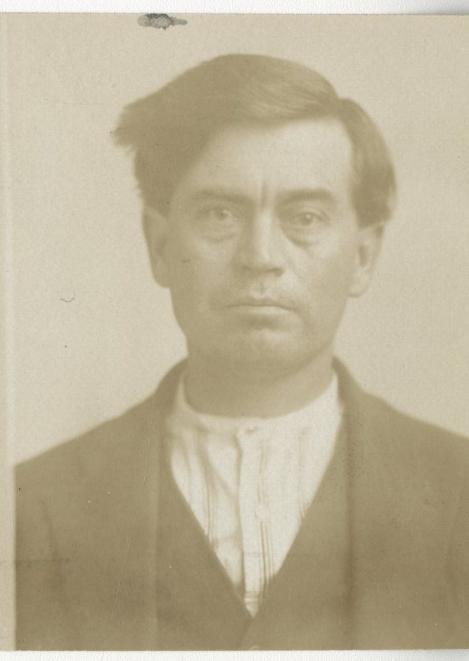

- Source: [archival record or issue](https://catalog.archives.gov/id/117719221)
- Credit: U.S. Penitentiary, Leavenworth booking photograph; National Archives at Kansas City, Record Group 129, series 571125, inmate 13534.
- Rights: U.S. federal-government prison photograph, public domain in the United States. NARA catalogs this photographic item as Unrestricted for use and access; individual photographer not identified.
- Identity: NARA catalogs this image as Photograph of William T. Walker, Leavenworth inmate 13534. The named photographic record and identifying inscriptions were checked against the existing wartime prisoner profile. The frontal image is cropped from the right.
- Download: [original source](https://catalog.archives.gov/medialz/kansas-city/rg-129/571125/571125_13534-WilliamWalker_001.jpg)
- Preserved original: [batch263-originals/571125_13534-WilliamWalker_001.jpg](batch263-originals/571125_13534-WilliamWalker_001.jpg)
- Counterclockwise rotation before crop: 0 degrees. Crop box: `[667, 0, 1334, 940]` (left, top, exclusive right, exclusive bottom in rotated image); source dimensions: `[1334, 940]`.
- Source SHA-256: `d23d7cb94216d7588508af93aba0a3c5d295bae16c84328496e0f16359939a5e`
- Portrait SHA-256: `fe64be188aaa341d5cb4fdb50b94496dd2779bdbef94b5d8f22b0e8496b92043`
- Identifying reverse: [batch263-originals/571125_13534-WilliamWalker_002.jpg](batch263-originals/571125_13534-WilliamWalker_002.jpg)

## Yetta Stromberg

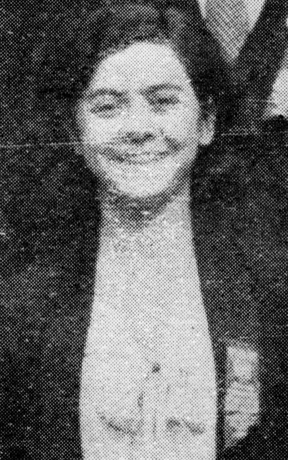

- Source: [archival record or issue](https://www.marxists.org/history/usa/pubs/labordefender/1930/v05n02-feb-1930-ORIG-LD.pdf#page=6)
- Credit: Labor Defender, Feb 1930, PDF page 6; International Labor Defense, publisher. Digitized issue supplied by Marxists Internet Archive / Riazanov Library; individual photographer not identified.
- Rights: Photograph published in the United States in 1930; public domain in the United States by 2026. This statement concerns the historical published image, not newly authored archive website material.
- Identity: February 1930 PDF page 6, Some of our best fighters. The caption explicitly identifies the person as third in the front row.
- Download: [original source](https://www.marxists.org/history/usa/pubs/labordefender/1930/v05n02-feb-1930-ORIG-LD.pdf)
- Preserved original: [batch263-originals/1930-feb-p6-Im0.jpg](batch263-originals/1930-feb-p6-Im0.jpg)
- Counterclockwise rotation before crop: 90 degrees. Crop box: `[2438, 1137, 3031, 2084]` (left, top, exclusive right, exclusive bottom in rotated image); source dimensions: `[3639, 5325]`.
- Source SHA-256: `64c3c4e3964444951523a5b68a50bc4d637102ba06122c0a5f6a671c057c180a`
- Portrait SHA-256: `f18d998d4bbda046da9adc2326f60aaac67257d2df4290643ca1bc986988e612`
