# 100 chronological prisoner images

Sources, identity evidence, and original files for 100 entries whose photo fields were empty in the baseline. Photographs, historical portraits, silhouettes, and narrative depictions are distinguished below. Some images restore previously removed attachments.

Only simple rectangular crops, lossless right-angle rotations, and ordinary file/PDF conversions were used. No AI editing, reconstruction, colorization, or retouching. Some originals are small or faded. Rights claims are recorded individually; historical age alone is not treated as proof of public-domain status.

## James Franklin

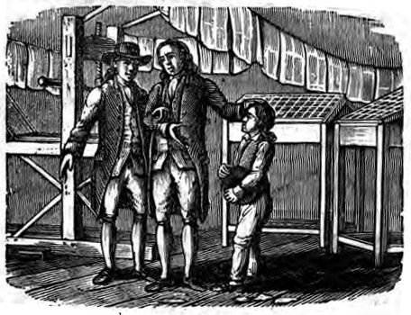

- Entry: `/prisoner/james-franklin`
- Source: [record/publication](https://www.gutenberg.org/cache/epub/38469/pg38469-images.html)
- Credit: Samuel G. Goodrich, The Life of Benjamin Franklin, illustrated historical biography; Project Gutenberg ebook 38469.
- Identity: Book caption identifies the reconciliation of Benjamin Franklin with his brother James, the printer. Historical narrative illustration, not an authenticated life portrait. Entire scene retained.
- Rights: Historical artwork published before 1931; public domain in the United States.
- Original: [chronological-originals/franklin-reconciliation.jpg](chronological-originals/franklin-reconciliation.jpg)
- Edit: unmodified_download; rotation 0 degrees; crop None.
- Original SHA-256: `892617b9a82d8ecfe300fe89783d8956857d10d01c039e200e21da8cd4bb02a8`
- Entry image SHA-256: `892617b9a82d8ecfe300fe89783d8956857d10d01c039e200e21da8cd4bb02a8`

## John Peter Zenger

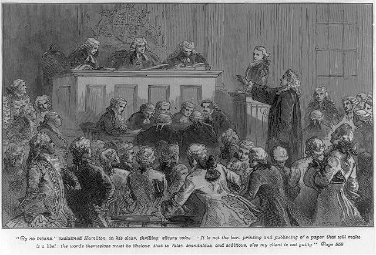

- Entry: `/prisoner/john-peter-zenger`
- Source: [record/publication](https://www.loc.gov/item/2006687175/)
- Credit: Library of Congress LC-USZ62-49739; wood engraving published in Martha J. Lamb, History of the City of New York, vol. 1 (1877), p.552.
- Identity: LOC identifies the scene as Andrew Hamilton defending John Peter Zenger in court, 1734-1735. Historical trial depiction; does not claim an individual figure is an authenticated portrait of Zenger.
- Rights: LOC: No known restrictions on publication. Wood engraving published in 1877, public domain in the United States.
- Original: [chronological-originals/zenger-trial.jpg](chronological-originals/zenger-trial.jpg)
- Edit: unmodified_download; rotation 0 degrees; crop None.
- Original SHA-256: `24cf59a88a21bdce00f2ba364dca77934893f23af36e550cbc711c69ccdf2f24`
- Entry image SHA-256: `24cf59a88a21bdce00f2ba364dca77934893f23af36e550cbc711c69ccdf2f24`

## Miers Fisher

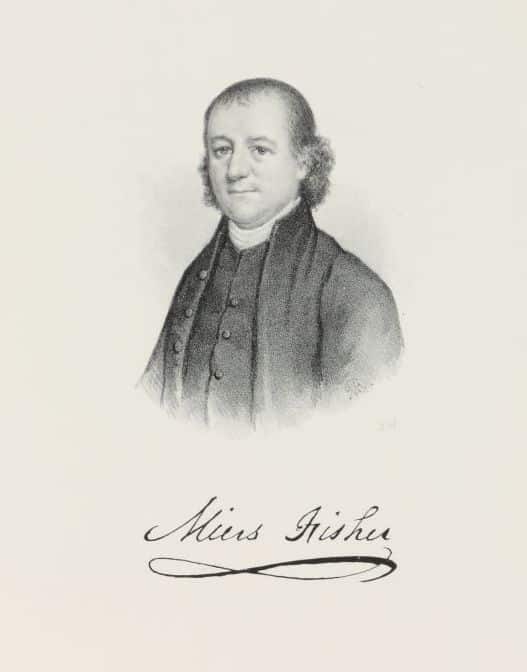

- Entry: `/prisoner/miers-fisher`
- Source: [record/publication](https://librarycompany.org/2024/04/16/shareholder-spotlight-miers-fisher/)
- Credit: Max Rosenthal, Miers Fisher, Philadelphia, circa 1850-1890; Library Company of Philadelphia.
- Identity: Repository identifies Miers Fisher (1748-1819), Quaker lawyer exiled to Virginia in 1777. Printed signature retained. His dates and exile match the profile.
- Rights: Historical artwork published before 1931; public domain in the United States.
- Original: [chronological-originals/miers-fisher.jpg](chronological-originals/miers-fisher.jpg)
- Edit: unmodified_download; rotation 0 degrees; crop None.
- Original SHA-256: `fece55646b16d07abef251b1b6496c7e4577b5a1c19678330ba72c82afdf96bd`
- Entry image SHA-256: `fece55646b16d07abef251b1b6496c7e4577b5a1c19678330ba72c82afdf96bd`

## Henry Drinker

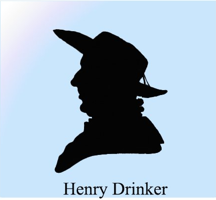

- Entry: `/prisoner/henry-drinker`
- Source: [record/publication](https://www.quakerhouses.com/drinkers-court)
- Credit: Period cut-paper silhouette reproduced in Norman E. Donoghue II, Prisoners of Congress (2023), via Historic Quaker Houses of Southeast Pennsylvania.
- Identity: Left caption names Henry Drinker. Smithsonian Catalog of American Portraits EXH.1823 identifies the 1734-1809 sitter and Joseph Sansom, circa 1791: https://npg.si.edu/object/npg_EXH.1823 . Restores a previously cleared field after confirming this is an identified period likeness, not a generic avatar. Crop retains the name caption.
- Rights: Underlying eighteenth/early nineteenth-century silhouette is public domain in the United States. Modern source layout and book text are not asserted to be public domain.
- Original: [chronological-originals/silhouettes-group.jpg](chronological-originals/silhouettes-group.jpg)
- Edit: exact_rectangular_crop; rotation 0 degrees; crop [29, 29, 466, 433].
- Original SHA-256: `9fceb15c8fc7f528c7c74dbe74836c4189d477e8c3218729c9cadc470a978366`
- Entry image SHA-256: `07eb549aac89dc72e586866c96db7f5cc3bbc9a86c87c923d76a22fbd83e4227`

## John Pemberton

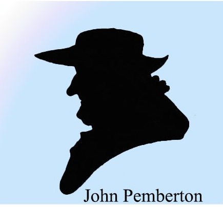

- Entry: `/prisoner/john-pemberton`
- Source: [record/publication](https://www.quakerhouses.com/drinkers-court)
- Credit: Period cut-paper silhouette reproduced in Norman E. Donoghue II, Prisoners of Congress (2023), via Historic Quaker Houses of Southeast Pennsylvania.
- Identity: Center caption names John Pemberton. Smithsonian Catalog of American Portraits MS 190 identifies the Quaker minister, 1727-1795: https://npg.si.edu/object/npg_MS_190 . HSP silhouette inventory V87 also identifies this minister with headwear. Restores a previously cleared field after confirming this is an identified period likeness, not a generic avatar. Crop retains the name caption.
- Rights: Underlying eighteenth/early nineteenth-century silhouette is public domain in the United States. Modern source layout and book text are not asserted to be public domain.
- Original: [chronological-originals/silhouettes-group.jpg](chronological-originals/silhouettes-group.jpg)
- Edit: exact_rectangular_crop; rotation 0 degrees; crop [490, 29, 925, 433].
- Original SHA-256: `9fceb15c8fc7f528c7c74dbe74836c4189d477e8c3218729c9cadc470a978366`
- Entry image SHA-256: `ee70d34a177ce594903ecb850d22cbe477717e1d3014b447f6d68fbc703c9ca8`

## Samuel Pleasants

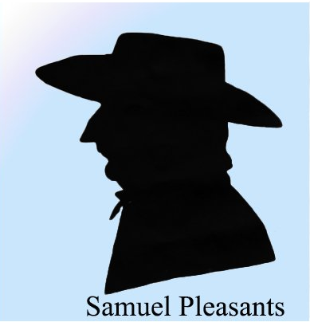

- Entry: `/prisoner/samuel-pleasants`
- Source: [record/publication](https://www.quakerhouses.com/drinkers-court)
- Credit: Period cut-paper silhouette reproduced in Norman E. Donoghue II, Prisoners of Congress (2023), via Historic Quaker Houses of Southeast Pennsylvania.
- Identity: Right caption names Samuel Pleasants. HSP silhouette inventory V87 identifies Samuel Pleasants (1737-1807), by Amy Coates (1765-1838), bust to left with headwear: https://www2.hsp.org/collections/manuscripts/s/SilhouetteInventoryV87.pdf . Restores a previously cleared field after confirming this is an identified period likeness, not a generic avatar. Crop retains the name caption.
- Rights: Underlying eighteenth/early nineteenth-century silhouette is public domain in the United States. Modern source layout and book text are not asserted to be public domain.
- Original: [chronological-originals/silhouettes-group.jpg](chronological-originals/silhouettes-group.jpg)
- Edit: exact_rectangular_crop; rotation 0 degrees; crop [952, 29, 1341, 433].
- Original SHA-256: `9fceb15c8fc7f528c7c74dbe74836c4189d477e8c3218729c9cadc470a978366`
- Entry image SHA-256: `6d08e57fbbc0ead4fdfa562962d8d87a16bee9884c18ec58f806956eded2f93a`

## Edward Pennington

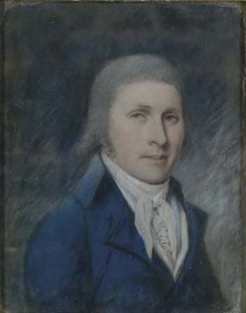

- Entry: `/prisoner/edward-pennington`
- Source: [record/publication](https://www.christies.com/lot/lot-4645715)
- Credit: James Sharples, pastel portrait of Edward Pennington (1726-1796), circa 1793-1796; Christie's lot 809, January 20-21, 2006; image reproduced in Neil Jeffares, Dictionary of Pastellists before 1800, entry J.675.514.
- Identity: Christie's identifies Edward Pennington (1726-1796), the Philadelphia merchant, and his wife Sarah Shoemaker. Jeffares page 5 places this portrait directly below J.675.514. Original embedded image extracted without pixel editing.
- Rights: Underlying historical image is public domain in the United States; no claim is made to the copyright of surrounding modern text or page layout.
- Original: [chronological-originals/pennington-pastels.pdf-page5-2.jpg](chronological-originals/pennington-pastels.pdf-page5-2.jpg)
- Edit: unmodified_download; rotation 0 degrees; crop None.
- Original SHA-256: `58f93a007de1d5956aa73ac84ee15aec215c54cd64037b2b1ce9e0b7ce33d125`
- Entry image SHA-256: `58f93a007de1d5956aa73ac84ee15aec215c54cd64037b2b1ce9e0b7ce33d125`

## Charles Holt

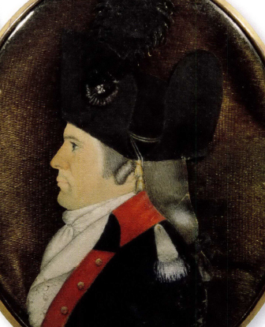

- Entry: `/prisoner/charles-holt`
- Source: [record/publication](https://www.themagazineantiques.com/article/from-the-archives-freedom-in-miniature-mary-ways-coded-portrait-of-charles-holt/)
- Credit: Mary Way (1769-1823), Charles Holt, February 18, 1800; private collection, reproduced by Brian Ehrlich in The Magazine Antiques.
- Identity: Signed and dated miniature; source identifies the sitter as the Bee publisher awaiting imprisonment under the Sedition Act. Rectangular crop isolates the historical portrait inside the locket.
- Rights: Underlying historical image is public domain in the United States; no claim is made to the copyright of surrounding modern text or page layout.
- Original: [chronological-originals/charles-holt.jpg](chronological-originals/charles-holt.jpg)
- Edit: exact_rectangular_crop; rotation 0 degrees; crop [190, 170, 526, 584].
- Original SHA-256: `2f02ec288529413a5a826331a6995479424ab81fbe3bdab6cecfd5a3b5211245`
- Entry image SHA-256: `d94ccdab8a741a53c74c60883d03385465ae115fef609a2609f18ad8e487ac3a`

## John Dick

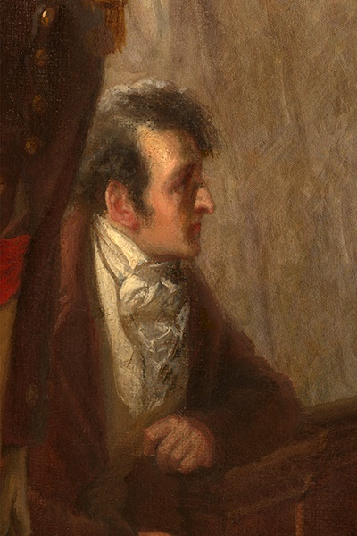

- Entry: `/prisoner/john-dick`
- Source: [record/publication](https://www.laed.uscourts.gov/court-history/judges/dick)
- Credit: Christian Schussele (1824-1879), detail depicting John Dick from Andrew Jackson Before Judge Hall; U.S. District Court for the Eastern District of Louisiana, via Wikimedia Commons.
- Identity: Court biography identifies John Dick (1788-1824), the Louisiana federal attorney arrested during Jackson's martial law; Commons uses the same court-sourced detail. Later historical depiction, not a photograph.
- Rights: Underlying historical image is public domain in the United States; no claim is made to the copyright of surrounding modern text or page layout.
- Original: [chronological-originals/john-dick.jpg](chronological-originals/john-dick.jpg)
- Edit: unmodified_download; rotation 0 degrees; crop None.
- Original SHA-256: `68747bc4981301cfeb8820651619eac5ed7c4e15e5387f2b35ecbccd3fd34ae9`
- Entry image SHA-256: `68747bc4981301cfeb8820651619eac5ed7c4e15e5387f2b35ecbccd3fd34ae9`

## John Cross

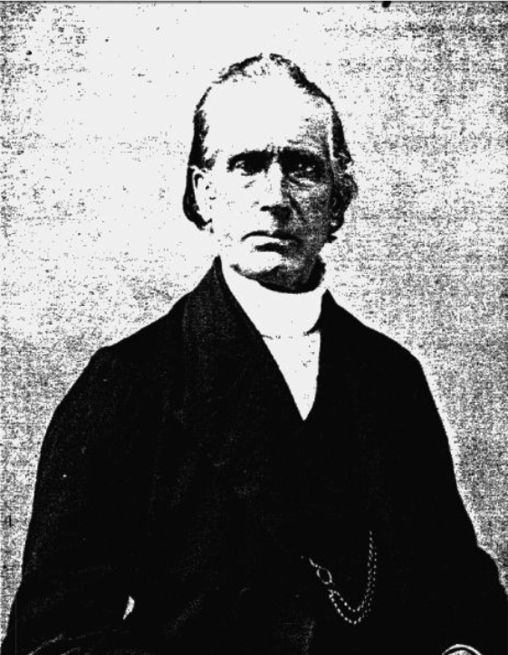

- Entry: `/prisoner/john-cross`
- Source: [record/publication](https://queeringtheburbs.substack.com/p/when-the-history-comes-right-to-your)
- Credit: Historical portrait of Rev. John Cross, reproduced alongside contemporary newspaper coverage of his imprisonment by Joe Erbentraut.
- Identity: Source identifies the abolitionist pastor at left; adjacent historical article describes Rev. John Cross jailed at Knoxville for harboring children escaping slavery. Matches the Illinois pastor and case in the profile. Modern layout excluded.
- Rights: Underlying historical image is public domain in the United States; no claim is made to the copyright of surrounding modern text or page layout.
- Original: [chronological-originals/john-cross-group.png](chronological-originals/john-cross-group.png)
- Edit: exact_rectangular_crop; rotation 0 degrees; crop [0, 0, 561, 722].
- Original SHA-256: `69a37fd2f013ef0bc39730389396a9d18584f310d6cc13944a53ef616516dbf8`
- Entry image SHA-256: `cea6530cb371255beadbef12a36e73a0a5ddfeb341a0c2e06bdfd19e649084ce`

## John Hunn

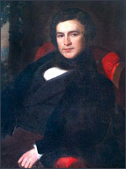

- Entry: `/prisoner/john-hunn`
- Source: [record/publication](https://history.delaware.gov/flight-to-freedom/people_hunn/)
- Credit: Historical painted portrait of John Hunn (1818–1894), supplied and identified by the Delaware Division of Historical and Cultural Affairs; artist and exact date not stated by source.
- Identity: Delaware historical agency explicitly identifies the Quaker abolitionist and Underground Railroad stationmaster born in 1818, distinct from his son the governor.
- Rights: Underlying historical image is public domain in the United States; no claim is made to the copyright of surrounding modern text or page layout.
- Original: [chronological-originals/john-hunn.jpg](chronological-originals/john-hunn.jpg)
- Edit: unmodified_download; rotation 0 degrees; crop None.
- Original SHA-256: `be10185da827a649fa08cba095bed5c378c604525ce27dc45bf11b118fa7ac5d`
- Entry image SHA-256: `be10185da827a649fa08cba095bed5c378c604525ce27dc45bf11b118fa7ac5d`

## Martin Stowell

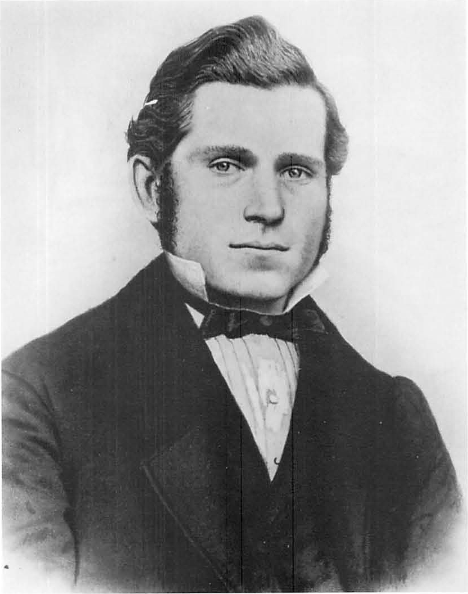

- Entry: `/prisoner/martin-stowell`
- Source: [record/publication](https://history.nebraska.gov/wp-content/uploads/2017/11/doc_publications_NH1993Martin_Stowell.pdf)
- Credit: Historical portrait of Martin Stowell (1824-1862), NSHS-P853; reproduced in James E. Potter, A Nebraska Cavalryman in Dixie, Nebraska History 74 (1993), p.22.
- Identity: Caption identifies Martin Stowell; same page describes his 1854 imprisonment after the Anthony Burns rescue attempt. Crop includes only the nineteenth-century portrait, excluding modern article text.
- Rights: Underlying historical image is public domain in the United States; no claim is made to the copyright of surrounding modern text or page layout.
- Original: [chronological-originals/martin-stowell.pdf-page2-0.jpg](chronological-originals/martin-stowell.pdf-page2-0.jpg)
- Edit: exact_rectangular_crop; rotation 0 degrees; crop [166, 940, 999, 1996].
- Original SHA-256: `38306f6f88c9c64deef8fb0a3ec67f917847f20ec2dd365f30d13ae6406d740d`
- Entry image SHA-256: `d31fd7a9d2b680f4174513002bbe136cbc523c7b36c9c7dd5bb67c55cf37a5cd`

## Jacob R. Shipherd

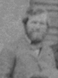

- Entry: `/prisoner/jacob-r-shipherd`
- Source: [record/publication](https://www.loc.gov/pictures/item/2003669978/)
- Credit: T. J. Rice, The Oberlin rescuers at Cuyahoga Co. jail, April 1859; Library of Congress LC-USZ62-73349.
- Identity: Identified as person 1 by the numbered name key on the original print, corroborated by Oberlin College: https://www2.oberlin.edu/external/EOG/Oberlin-Wellington_Rescue/the_rescuers.htm . Exact rectangular crop isolates the identified sitter. The historical master has limited facial resolution; no enhancement or synthesized pixels.
- Rights: Library of Congress: No known restrictions on publication. Photograph published in Frank Leslie's Illustrated Newspaper, May 7, 1859, p.351; public domain.
- Original: [chronological-originals/oberlin-loc.tif](chronological-originals/oberlin-loc.tif)
- Edit: exact_rectangular_crop; rotation 0 degrees; crop [126, 483, 244, 642].
- Original SHA-256: `af64b5dbff98ea11eb6694d94aac92014ad3de8154d3195b7231f46986df499f`
- Entry image SHA-256: `aea7b551bf676170bec7a9ecf9690bf7b7d197050918387c83e3fe4be30def10`

## Orindatus Simon Bolivar Wall

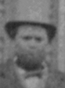

- Entry: `/prisoner/orindatus-simon-bolivar-wall`
- Source: [record/publication](https://www.loc.gov/pictures/item/2003669978/)
- Credit: T. J. Rice, The Oberlin rescuers at Cuyahoga Co. jail, April 1859; Library of Congress LC-USZ62-73349.
- Identity: Identified as person 2 by the numbered name key on the original print, corroborated by Oberlin College: https://www2.oberlin.edu/external/EOG/Oberlin-Wellington_Rescue/the_rescuers.htm . Exact rectangular crop isolates the identified sitter. The historical master has limited facial resolution; no enhancement or synthesized pixels.
- Rights: Library of Congress: No known restrictions on publication. Photograph published in Frank Leslie's Illustrated Newspaper, May 7, 1859, p.351; public domain.
- Original: [chronological-originals/oberlin-loc.tif](chronological-originals/oberlin-loc.tif)
- Edit: exact_rectangular_crop; rotation 0 degrees; crop [241, 491, 324, 603].
- Original SHA-256: `af64b5dbff98ea11eb6694d94aac92014ad3de8154d3195b7231f46986df499f`
- Entry image SHA-256: `1aa76348894330cb4998da70967fdd97c4c8823711fde526af23202db027fa25`

## Loring Wadsworth

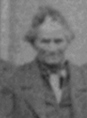

- Entry: `/prisoner/loring-wadsworth`
- Source: [record/publication](https://www.loc.gov/pictures/item/2003669978/)
- Credit: T. J. Rice, The Oberlin rescuers at Cuyahoga Co. jail, April 1859; Library of Congress LC-USZ62-73349.
- Identity: Identified as person 3 by the numbered name key on the original print, corroborated by Oberlin College: https://www2.oberlin.edu/external/EOG/Oberlin-Wellington_Rescue/the_rescuers.htm . Exact rectangular crop isolates the identified sitter. The historical master has limited facial resolution; no enhancement or synthesized pixels.
- Rights: Library of Congress: No known restrictions on publication. Photograph published in Frank Leslie's Illustrated Newspaper, May 7, 1859, p.351; public domain.
- Original: [chronological-originals/oberlin-loc.tif](chronological-originals/oberlin-loc.tif)
- Edit: exact_rectangular_crop; rotation 0 degrees; crop [315, 515, 413, 647].
- Original SHA-256: `af64b5dbff98ea11eb6694d94aac92014ad3de8154d3195b7231f46986df499f`
- Entry image SHA-256: `2d4cc7f267fc1054e0ef31153aca0454a8e5e49669c0bb0be5164c41a5844b21`

## David Watson

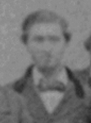

- Entry: `/prisoner/david-watson`
- Source: [record/publication](https://www.loc.gov/pictures/item/2003669978/)
- Credit: T. J. Rice, The Oberlin rescuers at Cuyahoga Co. jail, April 1859; Library of Congress LC-USZ62-73349.
- Identity: Identified as person 4 by the numbered name key on the original print, corroborated by Oberlin College: https://www2.oberlin.edu/external/EOG/Oberlin-Wellington_Rescue/the_rescuers.htm . Exact rectangular crop isolates the identified sitter. The historical master has limited facial resolution; no enhancement or synthesized pixels.
- Rights: Library of Congress: No known restrictions on publication. Photograph published in Frank Leslie's Illustrated Newspaper, May 7, 1859, p.351; public domain.
- Original: [chronological-originals/oberlin-loc.tif](chronological-originals/oberlin-loc.tif)
- Edit: exact_rectangular_crop; rotation 0 degrees; crop [402, 503, 493, 626].
- Original SHA-256: `af64b5dbff98ea11eb6694d94aac92014ad3de8154d3195b7231f46986df499f`
- Entry image SHA-256: `47873f4a46884f93e2916643de1254d5e1db93834e64e549d73aa5427bca1063`

## Wilson Bruce Evans

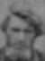

- Entry: `/prisoner/wilson-bruce-evans`
- Source: [record/publication](https://www.loc.gov/pictures/item/2003669978/)
- Credit: T. J. Rice, The Oberlin rescuers at Cuyahoga Co. jail, April 1859; Library of Congress LC-USZ62-73349.
- Identity: Identified as person 5 by the numbered name key on the original print, corroborated by Oberlin College: https://www2.oberlin.edu/external/EOG/Oberlin-Wellington_Rescue/the_rescuers.htm . Exact rectangular crop isolates the identified sitter. The historical master has limited facial resolution; no enhancement or synthesized pixels.
- Rights: Library of Congress: No known restrictions on publication. Photograph published in Frank Leslie's Illustrated Newspaper, May 7, 1859, p.351; public domain.
- Original: [chronological-originals/oberlin-loc.tif](chronological-originals/oberlin-loc.tif)
- Edit: exact_rectangular_crop; rotation 0 degrees; crop [486, 518, 536, 586].
- Original SHA-256: `af64b5dbff98ea11eb6694d94aac92014ad3de8154d3195b7231f46986df499f`
- Entry image SHA-256: `8bd9a5e9b60b762e43cd6640a85eae37a7c2b408229cbf7b2cf8145701306a98`

## Eli Boies

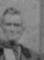

- Entry: `/prisoner/eli-boies`
- Source: [record/publication](https://www.loc.gov/pictures/item/2003669978/)
- Credit: T. J. Rice, The Oberlin rescuers at Cuyahoga Co. jail, April 1859; Library of Congress LC-USZ62-73349.
- Identity: Identified as person 6 by the numbered name key on the original print, corroborated by Oberlin College: https://www2.oberlin.edu/external/EOG/Oberlin-Wellington_Rescue/the_rescuers.htm . Exact rectangular crop isolates the identified sitter. The historical master has limited facial resolution; no enhancement or synthesized pixels.
- Rights: Library of Congress: No known restrictions on publication. Photograph published in Frank Leslie's Illustrated Newspaper, May 7, 1859, p.351; public domain.
- Original: [chronological-originals/oberlin-loc.tif](chronological-originals/oberlin-loc.tif)
- Edit: exact_rectangular_crop; rotation 0 degrees; crop [534, 512, 609, 613].
- Original SHA-256: `af64b5dbff98ea11eb6694d94aac92014ad3de8154d3195b7231f46986df499f`
- Entry image SHA-256: `c414b575ead96a4c6895adf8d442d2a944f4117c9f2d82bbc556cd8b06f2893e`

## Henry Evans

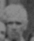

- Entry: `/prisoner/henry-evans`
- Source: [record/publication](https://www.loc.gov/pictures/item/2003669978/)
- Credit: T. J. Rice, The Oberlin rescuers at Cuyahoga Co. jail, April 1859; Library of Congress LC-USZ62-73349.
- Identity: Identified as person 8 by the numbered name key on the original print, corroborated by Oberlin College: https://www2.oberlin.edu/external/EOG/Oberlin-Wellington_Rescue/the_rescuers.htm . Exact rectangular crop isolates the identified sitter. The historical master has limited facial resolution; no enhancement or synthesized pixels.
- Rights: Library of Congress: No known restrictions on publication. Photograph published in Frank Leslie's Illustrated Newspaper, May 7, 1859, p.351; public domain.
- Original: [chronological-originals/oberlin-loc.tif](chronological-originals/oberlin-loc.tif)
- Edit: exact_rectangular_crop; rotation 0 degrees; crop [658, 512, 715, 582].
- Original SHA-256: `af64b5dbff98ea11eb6694d94aac92014ad3de8154d3195b7231f46986df499f`
- Entry image SHA-256: `21ef90f103f4a1c1d28ccbbe808c89f3f542b8f5899cc10c2ae4b5e231887286`

## Simeon Bushnell

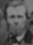

- Entry: `/prisoner/simeon-bushnell`
- Source: [record/publication](https://www.loc.gov/pictures/item/2003669978/)
- Credit: T. J. Rice, The Oberlin rescuers at Cuyahoga Co. jail, April 1859; Library of Congress LC-USZ62-73349.
- Identity: Identified as person 9 by the numbered name key on the original print, corroborated by Oberlin College: https://www2.oberlin.edu/external/EOG/Oberlin-Wellington_Rescue/the_rescuers.htm . Exact rectangular crop isolates the identified sitter. The historical master has limited facial resolution; no enhancement or synthesized pixels.
- Rights: Library of Congress: No known restrictions on publication. Photograph published in Frank Leslie's Illustrated Newspaper, May 7, 1859, p.351; public domain.
- Original: [chronological-originals/oberlin-loc.tif](chronological-originals/oberlin-loc.tif)
- Edit: exact_rectangular_crop; rotation 0 degrees; crop [698, 564, 753, 638].
- Original SHA-256: `af64b5dbff98ea11eb6694d94aac92014ad3de8154d3195b7231f46986df499f`
- Entry image SHA-256: `36341541b115820c7a0d703acff316d0a27b6f717cc5e158037727b95552903d`

## John H. Scott

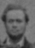

- Entry: `/prisoner/john-h-scott`
- Source: [record/publication](https://www.loc.gov/pictures/item/2003669978/)
- Credit: T. J. Rice, The Oberlin rescuers at Cuyahoga Co. jail, April 1859; Library of Congress LC-USZ62-73349.
- Identity: Identified as person 10 by the numbered name key on the original print, corroborated by Oberlin College: https://www2.oberlin.edu/external/EOG/Oberlin-Wellington_Rescue/the_rescuers.htm . Exact rectangular crop isolates the identified sitter. The historical master has limited facial resolution; no enhancement or synthesized pixels.
- Rights: Library of Congress: No known restrictions on publication. Photograph published in Frank Leslie's Illustrated Newspaper, May 7, 1859, p.351; public domain.
- Original: [chronological-originals/oberlin-loc.tif](chronological-originals/oberlin-loc.tif)
- Edit: exact_rectangular_crop; rotation 0 degrees; crop [744, 515, 804, 596].
- Original SHA-256: `af64b5dbff98ea11eb6694d94aac92014ad3de8154d3195b7231f46986df499f`
- Entry image SHA-256: `f8e67ccaf999a4968a895648943913680f3168997b45a247a44aafdd9d302857`

## Matthew Gillett

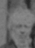

- Entry: `/prisoner/matthew-gillett`
- Source: [record/publication](https://www.loc.gov/pictures/item/2003669978/)
- Credit: T. J. Rice, The Oberlin rescuers at Cuyahoga Co. jail, April 1859; Library of Congress LC-USZ62-73349.
- Identity: Identified as person 11 by the numbered name key on the original print, corroborated by Oberlin College: https://www2.oberlin.edu/external/EOG/Oberlin-Wellington_Rescue/the_rescuers.htm . Exact rectangular crop isolates the identified sitter. The historical master has limited facial resolution; no enhancement or synthesized pixels.
- Rights: Library of Congress: No known restrictions on publication. Photograph published in Frank Leslie's Illustrated Newspaper, May 7, 1859, p.351; public domain.
- Original: [chronological-originals/oberlin-loc.tif](chronological-originals/oberlin-loc.tif)
- Edit: exact_rectangular_crop; rotation 0 degrees; crop [800, 511, 859, 591].
- Original SHA-256: `af64b5dbff98ea11eb6694d94aac92014ad3de8154d3195b7231f46986df499f`
- Entry image SHA-256: `bfe39b3e555a5b869d9de5f70de66c3601074f482fade8f15d30622eba73ed4d`

## Ansel W. Lyman

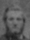

- Entry: `/prisoner/ansel-w-lyman`
- Source: [record/publication](https://www.loc.gov/pictures/item/2003669978/)
- Credit: T. J. Rice, The Oberlin rescuers at Cuyahoga Co. jail, April 1859; Library of Congress LC-USZ62-73349.
- Identity: Identified as person 13 by the numbered name key on the original print, corroborated by Oberlin College: https://www2.oberlin.edu/external/EOG/Oberlin-Wellington_Rescue/the_rescuers.htm . Exact rectangular crop isolates the identified sitter. The historical master has limited facial resolution; no enhancement or synthesized pixels.
- Rights: Library of Congress: No known restrictions on publication. Photograph published in Frank Leslie's Illustrated Newspaper, May 7, 1859, p.351; public domain.
- Original: [chronological-originals/oberlin-loc.tif](chronological-originals/oberlin-loc.tif)
- Edit: exact_rectangular_crop; rotation 0 degrees; crop [899, 498, 959, 579].
- Original SHA-256: `af64b5dbff98ea11eb6694d94aac92014ad3de8154d3195b7231f46986df499f`
- Entry image SHA-256: `b76f1d1344cedcc9fe902a00cb2d5c63024e568befbf546e2e86bbd6caf3cad8`

## William E. Lincoln

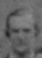

- Entry: `/prisoner/william-e-lincoln`
- Source: [record/publication](https://www.loc.gov/pictures/item/2003669978/)
- Credit: T. J. Rice, The Oberlin rescuers at Cuyahoga Co. jail, April 1859; Library of Congress LC-USZ62-73349.
- Identity: Identified as person 15 by the numbered name key on the original print, corroborated by Oberlin College: https://www2.oberlin.edu/external/EOG/Oberlin-Wellington_Rescue/the_rescuers.htm . Exact rectangular crop isolates the identified sitter. The historical master has limited facial resolution; no enhancement or synthesized pixels.
- Rights: Library of Congress: No known restrictions on publication. Photograph published in Frank Leslie's Illustrated Newspaper, May 7, 1859, p.351; public domain.
- Original: [chronological-originals/oberlin-loc.tif](chronological-originals/oberlin-loc.tif)
- Edit: exact_rectangular_crop; rotation 0 degrees; crop [993, 497, 1046, 569].
- Original SHA-256: `af64b5dbff98ea11eb6694d94aac92014ad3de8154d3195b7231f46986df499f`
- Entry image SHA-256: `f08c47ffa2c744614e2615cb51e74080cc4ae8bd9da0eef30a127404a71a164a`

## Richard Winsor

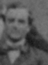

- Entry: `/prisoner/richard-winsor`
- Source: [record/publication](https://www.loc.gov/pictures/item/2003669978/)
- Credit: T. J. Rice, The Oberlin rescuers at Cuyahoga Co. jail, April 1859; Library of Congress LC-USZ62-73349.
- Identity: Identified as person 16 by the numbered name key on the original print, corroborated by Oberlin College: https://www2.oberlin.edu/external/EOG/Oberlin-Wellington_Rescue/the_rescuers.htm . Exact rectangular crop isolates the identified sitter. The historical master has limited facial resolution; no enhancement or synthesized pixels.
- Rights: Library of Congress: No known restrictions on publication. Photograph published in Frank Leslie's Illustrated Newspaper, May 7, 1859, p.351; public domain.
- Original: [chronological-originals/oberlin-loc.tif](chronological-originals/oberlin-loc.tif)
- Edit: exact_rectangular_crop; rotation 0 degrees; crop [1027, 551, 1096, 644].
- Original SHA-256: `af64b5dbff98ea11eb6694d94aac92014ad3de8154d3195b7231f46986df499f`
- Entry image SHA-256: `23db02bcf970b6e55ab17fecf45a9db988373264bfb57e12bc669fa03167190f`

## John Watson

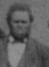

- Entry: `/prisoner/john-watson`
- Source: [record/publication](https://www.loc.gov/pictures/item/2003669978/)
- Credit: T. J. Rice, The Oberlin rescuers at Cuyahoga Co. jail, April 1859; Library of Congress LC-USZ62-73349.
- Identity: Identified as person 17 by the numbered name key on the original print, corroborated by Oberlin College: https://www2.oberlin.edu/external/EOG/Oberlin-Wellington_Rescue/the_rescuers.htm . Exact rectangular crop isolates the identified sitter. The historical master has limited facial resolution; no enhancement or synthesized pixels.
- Rights: Library of Congress: No known restrictions on publication. Photograph published in Frank Leslie's Illustrated Newspaper, May 7, 1859, p.351; public domain.
- Original: [chronological-originals/oberlin-loc.tif](chronological-originals/oberlin-loc.tif)
- Edit: exact_rectangular_crop; rotation 0 degrees; crop [1093, 562, 1175, 673].
- Original SHA-256: `af64b5dbff98ea11eb6694d94aac92014ad3de8154d3195b7231f46986df499f`
- Entry image SHA-256: `d6eb8d2d81624f0ad418955655584e1532eae3d995ef06a2f29900c09600b6fb`

## James M. Fitch

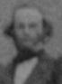

- Entry: `/prisoner/james-m-fitch`
- Source: [record/publication](https://www.loc.gov/pictures/item/2003669978/)
- Credit: T. J. Rice, The Oberlin rescuers at Cuyahoga Co. jail, April 1859; Library of Congress LC-USZ62-73349.
- Identity: Identified as person 18 by the numbered name key on the original print, corroborated by Oberlin College: https://www2.oberlin.edu/external/EOG/Oberlin-Wellington_Rescue/the_rescuers.htm . Exact rectangular crop isolates the identified sitter. The historical master has limited facial resolution; no enhancement or synthesized pixels.
- Rights: Library of Congress: No known restrictions on publication. Photograph published in Frank Leslie's Illustrated Newspaper, May 7, 1859, p.351; public domain.
- Original: [chronological-originals/oberlin-loc.tif](chronological-originals/oberlin-loc.tif)
- Edit: exact_rectangular_crop; rotation 0 degrees; crop [1170, 568, 1239, 661].
- Original SHA-256: `af64b5dbff98ea11eb6694d94aac92014ad3de8154d3195b7231f46986df499f`
- Entry image SHA-256: `a31f2845594d6493aaa2c2c7a9acf884c13fd787cf42509f896e6732a16938eb`

## Henry E. Peck

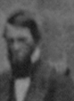

- Entry: `/prisoner/henry-e-peck`
- Source: [record/publication](https://www.loc.gov/pictures/item/2003669978/)
- Credit: T. J. Rice, The Oberlin rescuers at Cuyahoga Co. jail, April 1859; Library of Congress LC-USZ62-73349.
- Identity: Identified as person 19 by the numbered name key on the original print, corroborated by Oberlin College: https://www2.oberlin.edu/external/EOG/Oberlin-Wellington_Rescue/the_rescuers.htm . Exact rectangular crop isolates the identified sitter. The historical master has limited facial resolution; no enhancement or synthesized pixels.
- Rights: Library of Congress: No known restrictions on publication. Photograph published in Frank Leslie's Illustrated Newspaper, May 7, 1859, p.351; public domain.
- Original: [chronological-originals/oberlin-loc.tif](chronological-originals/oberlin-loc.tif)
- Edit: exact_rectangular_crop; rotation 0 degrees; crop [1237, 548, 1320, 660].
- Original SHA-256: `af64b5dbff98ea11eb6694d94aac92014ad3de8154d3195b7231f46986df499f`
- Entry image SHA-256: `f17e50e0c717c2a2254d36753608a3e8316512b346939b0af884663d24f632bf`

## Daniel Williams

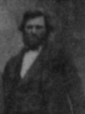

- Entry: `/prisoner/daniel-williams`
- Source: [record/publication](https://www.loc.gov/pictures/item/2003669978/)
- Credit: T. J. Rice, The Oberlin rescuers at Cuyahoga Co. jail, April 1859; Library of Congress LC-USZ62-73349.
- Identity: Identified as person 20 by the numbered name key on the original print, corroborated by Oberlin College: https://www2.oberlin.edu/external/EOG/Oberlin-Wellington_Rescue/the_rescuers.htm . Exact rectangular crop isolates the identified sitter. The historical master has limited facial resolution; no enhancement or synthesized pixels.
- Rights: Library of Congress: No known restrictions on publication. Photograph published in Frank Leslie's Illustrated Newspaper, May 7, 1859, p.351; public domain.
- Original: [chronological-originals/oberlin-loc.tif](chronological-originals/oberlin-loc.tif)
- Edit: exact_rectangular_crop; rotation 0 degrees; crop [1320, 525, 1459, 713].
- Original SHA-256: `af64b5dbff98ea11eb6694d94aac92014ad3de8154d3195b7231f46986df499f`
- Entry image SHA-256: `0d9a5a23c0584f58aaa94686bebef458fe3b5eac316709818d195a4942242fe3`

## Dominick A. Hall

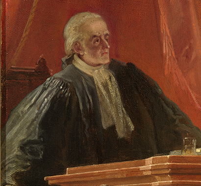

- Entry: `/prisoner/dominick-a-hall`
- Source: [record/publication](https://www.lasc.org/bicentennial/justices/hall_dominick.html)
- Credit: Christian Schussele, Andrew Jackson before Judge Hall, 1859; Gilcrease Museum, reproduced by Louisiana Supreme Court.
- Identity: Court biography identifies Dominick Augustin Hall (1765–1820); later historical depiction, not a photograph or authenticated life portrait.
- Rights: Underlying historical image is public domain in the United States; no claim is made to the copyright of surrounding modern text or page layout.
- Original: [chronological-originals/dominick-hall.jpg](chronological-originals/dominick-hall.jpg)
- Edit: exact_rectangular_crop; rotation 0 degrees; crop [65, 25, 475, 405].
- Original SHA-256: `9d68386b378bbd8b540229cff8b3dffff37223bebf737447cbe3eff8b4cfdcb6`
- Entry image SHA-256: `43f6c2714aa1d41b6f2bec93334702ea368edcce04a980613ecbba3bb79511cc`

## Chief Leschi

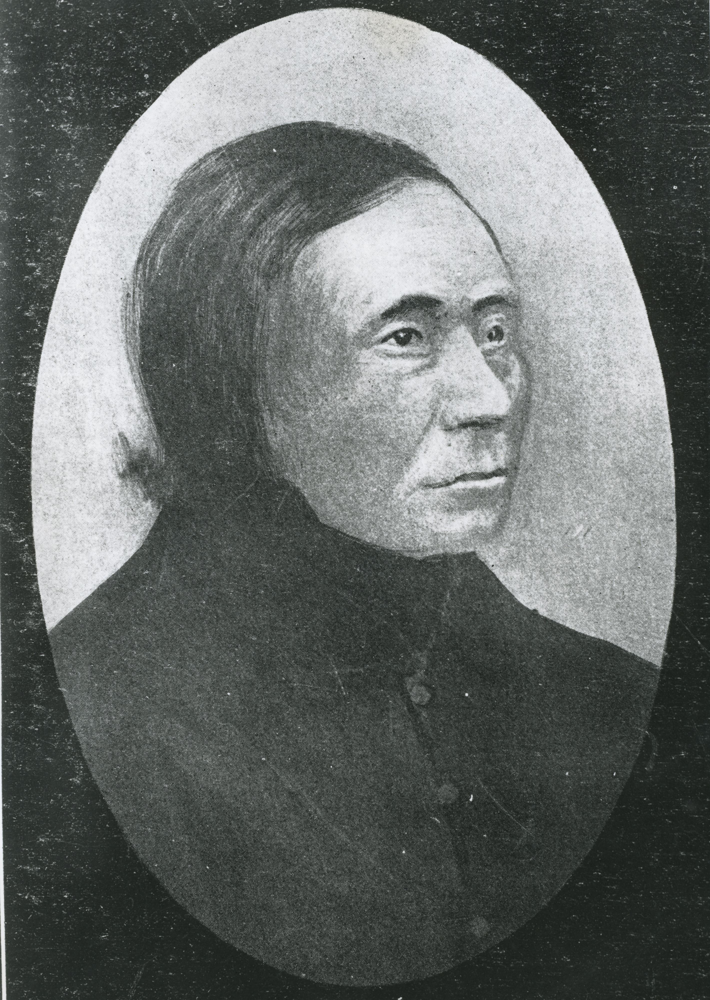

- Entry: `/prisoner/chief-leschi`
- Source: [record/publication](https://commons.wikimedia.org/wiki/File:Chief_Leschi.jpg)
- Credit: Unknown historical artist; Chief Leschi, Washington archival portrait reproduced by Wikimedia Commons.
- Identity: Catalog explicitly identifies Nisqually Chief Leschi (1808–1858), matching the prisoner tried and executed in Washington Territory. Historical drawing, not a photograph.
- Rights: Underlying historical image is public domain in the United States; no claim is made to the copyright of surrounding modern text or page layout.
- Original: [chronological-originals/chief-leschi.jpg](chronological-originals/chief-leschi.jpg)
- Edit: unmodified_download; rotation 0 degrees; crop None.
- Original SHA-256: `6764850a77d378527f237f05975db802d93aba36732e3592572ef17fa7c4192e`
- Entry image SHA-256: `6764850a77d378527f237f05975db802d93aba36732e3592572ef17fa7c4192e`

## Alexander H. Jones

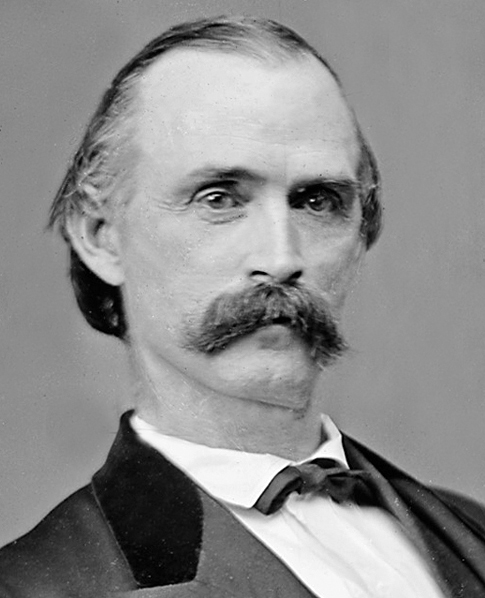

- Entry: `/prisoner/alexander-h-jones`
- Source: [record/publication](https://hd.housedivided.dickinson.edu/node/47107)
- Credit: National Archives, Mathew Brady Civil War Era Photographs; supplied by Dickinson College House Divided.
- Identity: Dickinson identifies Alexander Hamilton Jones (1822–1901), the North Carolina Unionist and later congressman. Archive-supplied portrait downloaded unchanged.
- Rights: Underlying historical image is public domain in the United States; no claim is made to the copyright of surrounding modern text or page layout.
- Original: [chronological-originals/alexander-jones.jpg](chronological-originals/alexander-jones.jpg)
- Edit: unmodified_download; rotation 0 degrees; crop None.
- Original SHA-256: `d43a7a417fecffe972714a20bb4ddcd26e63bd6759aa820d60044905d7b93e96`
- Entry image SHA-256: `d43a7a417fecffe972714a20bb4ddcd26e63bd6759aa820d60044905d7b93e96`

## Christopher Haun

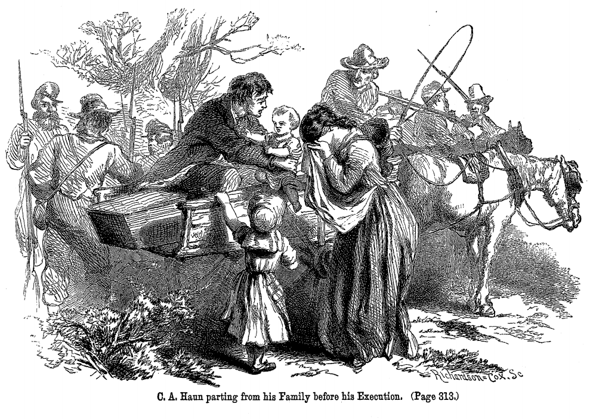

- Entry: `/prisoner/christopher-haun`
- Source: [record/publication](https://commons.wikimedia.org/wiki/File:Christopher_Haun.png)
- Credit: Cox & Richardson, engravers; William G. Brownlow, Sketches of the Rise, Progress, and Decline of Secession, 1862, p.313.
- Identity: Printed caption identifies C. A. Haun parting with his family before execution. Contemporary historical scene depicts the East Tennessee bridge burner; entire scene and caption retained.
- Rights: Underlying historical image is public domain in the United States; no claim is made to the copyright of surrounding modern text or page layout.
- Original: [chronological-originals/christopher-haun.png](chronological-originals/christopher-haun.png)
- Edit: unmodified_download; rotation 0 degrees; crop None.
- Original SHA-256: `9655b85ad58d1e5a1481cbfae485a902710f068f62fcfc0b6dc5ec1ebe2f71ce`
- Entry image SHA-256: `9655b85ad58d1e5a1481cbfae485a902710f068f62fcfc0b6dc5ec1ebe2f71ce`

## Eugene Debs

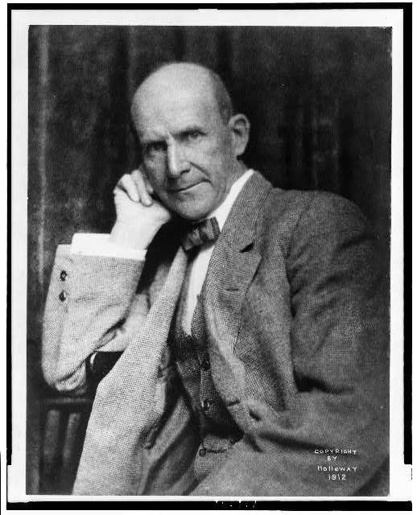

- Entry: `/prisoner/eugene-debs`
- Source: [record/publication](https://www.loc.gov/item/92519594/)
- Credit: Holloway, 1912; Library of Congress LC-USZ62-106026.
- Identity: Library of Congress explicitly names Eugene Victor Debs (1855–1926). Replaces an empty field after an earlier broken portrait reference.
- Rights: Photograph copyrighted in 1912; public domain in the United States by expiration.
- Original: [chronological-originals/debs.jpg](chronological-originals/debs.jpg)
- Edit: unmodified_download; rotation 0 degrees; crop None.
- Original SHA-256: `440f4b4656da38578aad64c14929682c37a35db23aae2b85fa12a74c0375d477`
- Entry image SHA-256: `440f4b4656da38578aad64c14929682c37a35db23aae2b85fa12a74c0375d477`

## Hugh McGehan

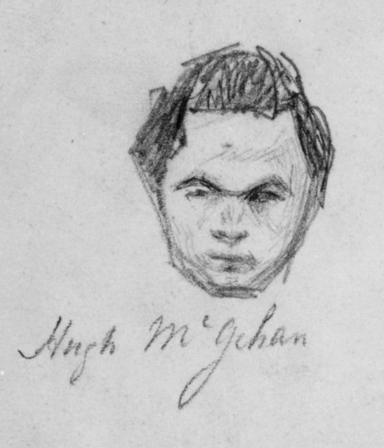

- Entry: `/prisoner/hugh-mcgehan`
- Source: [record/publication](https://commons.wikimedia.org/wiki/File:Hugh_McGehan_and_James_Roarity_MET_217575.jpg)
- Credit: John Singer Sargent, Hugh McGehan and James Roarity, circa 1876; Metropolitan Museum of Art, accession 50.130.141n, gift of Mrs. Francis Ormond, 1950.
- Identity: Museum catalog and handwritten name beneath the head identify Hugh McGehan, a Pennsylvania Molly Maguire defendant. The named head and original inscription are retained.
- Rights: Metropolitan Museum of Art Open Access, CC0; underlying Sargent drawing is public domain.
- Original: [chronological-originals/molly-sargent.jpg](chronological-originals/molly-sargent.jpg)
- Edit: exact_rectangular_crop; rotation 0 degrees; crop [235, 165, 720, 730].
- Original SHA-256: `bf9158441357c24aa7a1cebe3c3ce4c27699c405f32a4ef31a474718df1233cc`
- Entry image SHA-256: `e75ddac6ce2164e26e828441ef95aa8b46c1cf6f647f08922567f01d5990a309`

## James Roarity

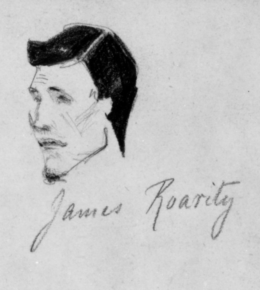

- Entry: `/prisoner/james-roarity`
- Source: [record/publication](https://commons.wikimedia.org/wiki/File:Hugh_McGehan_and_James_Roarity_MET_217575.jpg)
- Credit: John Singer Sargent, Hugh McGehan and James Roarity, circa 1876; Metropolitan Museum of Art, accession 50.130.141n, gift of Mrs. Francis Ormond, 1950.
- Identity: Museum catalog and handwritten name beneath the head identify James Roarity, a Pennsylvania Molly Maguire defendant. The named head and original inscription are retained.
- Rights: Metropolitan Museum of Art Open Access, CC0; underlying Sargent drawing is public domain.
- Original: [chronological-originals/molly-sargent.jpg](chronological-originals/molly-sargent.jpg)
- Edit: exact_rectangular_crop; rotation 0 degrees; crop [740, 140, 1260, 720].
- Original SHA-256: `bf9158441357c24aa7a1cebe3c3ce4c27699c405f32a4ef31a474718df1233cc`
- Entry image SHA-256: `2739a14ff6f488cdabbed1fcd8ff87fa17237367e543689a807ec58144dbc4a2`

## Alexander Campbell

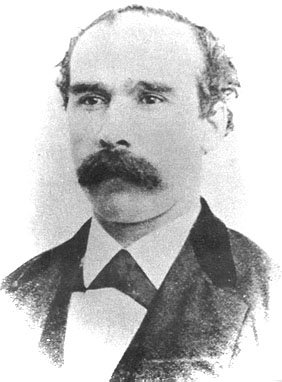

- Entry: `/prisoner/alexander-campbell`
- Source: [record/publication](https://wynninghistory.com/2025/03/26/alexander-campbell-dungloe/)
- Credit: Historical portrait of Alexander Campbell, reproduced by historian Jake Wynn in Wynning History.
- Identity: Article explicitly identifies Alexander Campbell, the Donegal-born Pennsylvania miner executed at Mauch Chunk in 1877. Historical portrait downloaded unchanged.
- Rights: Underlying historical image is public domain in the United States; no claim is made to the copyright of surrounding modern text or page layout.
- Original: [chronological-originals/campbell.jpg](chronological-originals/campbell.jpg)
- Edit: unmodified_download; rotation 0 degrees; crop None.
- Original SHA-256: `7acf746fc7393611d989304f24ebc634165bdb15beb0e598b435efe05ecaae7e`
- Entry image SHA-256: `7acf746fc7393611d989304f24ebc634165bdb15beb0e598b435efe05ecaae7e`

## Ralph Plumb

- Entry: `/prisoner/ralph-plumb`
- Source: [record/publication](https://commons.wikimedia.org/wiki/File:Ralph_Plumb_(1816%E2%80%931903).png)
- Credit: Biographical Dictionary and Portrait Gallery of Representative Men of the United States: Illinois volume, 1895.
- Identity: Book portrait identifies Ralph Plumb (1816–1903), Oberlin-Wellington rescuer, Union officer and Illinois congressman. A clearer individual portrait replaces this task’s provisional group crop.
- Rights: Underlying historical image is public domain in the United States; no claim is made to the copyright of surrounding modern text or page layout.
- Original: [chronological-originals/ralph-plumb.png](chronological-originals/ralph-plumb.png)
- Edit: unmodified_download; rotation 0 degrees; crop None.
- Original SHA-256: `9360a0dd748dc4def31ed5ae27cab41b50b73c08c6b42704f0124b4bb9a448f8`
- Entry image SHA-256: `9360a0dd748dc4def31ed5ae27cab41b50b73c08c6b42704f0124b4bb9a448f8`

## James Carroll

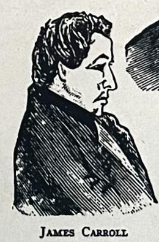

- Entry: `/prisoner/james-carroll`
- Source: [record/publication](https://republicanarchive.com/wp-content/uploads/2025/09/rising-of-the-moon-august-1969.pdf#page=15)
- Credit: Nineteenth-century engraved portraits of executed Molly Maguire defendants, reproduced in The Rising of the Moon, August 1969, p.15; Republican Archive scan.
- Identity: Original printed name immediately below the portrait identifies James Carroll; execution context agrees with the Pennsylvania Molly Maguire profile. Only the historical portrait and its name are cropped from the later page.
- Rights: Historical nineteenth-century engraving reproduced in The Rising of the Moon, August 1969. Original engraving publication and artist not established; no claim is made to the modern issue layout.
- Original: [chronological-originals/molly-p15-0.jpg](chronological-originals/molly-p15-0.jpg)
- Edit: exact_rectangular_crop; rotation 0 degrees; crop [1210, 2250, 1470, 2645].
- Original SHA-256: `0a18931de658b64d72a6f82752ba1a244159fa2e468cff87524fc33c4ec93132`
- Entry image SHA-256: `89bd77a8103f9429f9cdb5fae3a0dc430978a75e7214c5f3cea2a0bdfd503098`

## Edward J. Kelly

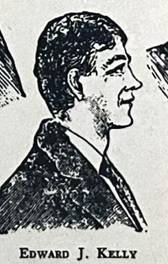

- Entry: `/prisoner/edward-j-kelly`
- Source: [record/publication](https://republicanarchive.com/wp-content/uploads/2025/09/rising-of-the-moon-august-1969.pdf#page=15)
- Credit: Nineteenth-century engraved portraits of executed Molly Maguire defendants, reproduced in The Rising of the Moon, August 1969, p.15; Republican Archive scan.
- Identity: Original printed name immediately below the portrait identifies Edward J. Kelly; execution context agrees with the Pennsylvania Molly Maguire profile. Only the historical portrait and its name are cropped from the later page.
- Rights: Historical nineteenth-century engraving reproduced in The Rising of the Moon, August 1969. Original engraving publication and artist not established; no claim is made to the modern issue layout.
- Original: [chronological-originals/molly-p15-0.jpg](chronological-originals/molly-p15-0.jpg)
- Edit: exact_rectangular_crop; rotation 0 degrees; crop [1430, 2440, 1675, 2825].
- Original SHA-256: `0a18931de658b64d72a6f82752ba1a244159fa2e468cff87524fc33c4ec93132`
- Entry image SHA-256: `621dab3a01d2a0531af7c6de90482e73b373ee19818b0d45040358e677df65f9`

## Michael Doyle

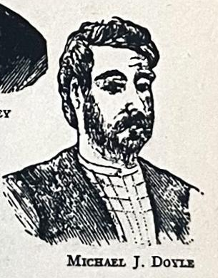

- Entry: `/prisoner/michael-doyle`
- Source: [record/publication](https://republicanarchive.com/wp-content/uploads/2025/09/rising-of-the-moon-august-1969.pdf#page=15)
- Credit: Nineteenth-century engraved portraits of executed Molly Maguire defendants, reproduced in The Rising of the Moon, August 1969, p.15; Republican Archive scan.
- Identity: Original printed name immediately below the portrait identifies Michael J. Doyle; execution context agrees with the Pennsylvania Molly Maguire profile. Only the historical portrait and its name are cropped from the later page.
- Rights: Historical nineteenth-century engraving reproduced in The Rising of the Moon, August 1969. Original engraving publication and artist not established; no claim is made to the modern issue layout.
- Original: [chronological-originals/molly-p15-0.jpg](chronological-originals/molly-p15-0.jpg)
- Edit: exact_rectangular_crop; rotation 0 degrees; crop [1640, 2265, 1945, 2655].
- Original SHA-256: `0a18931de658b64d72a6f82752ba1a244159fa2e468cff87524fc33c4ec93132`
- Entry image SHA-256: `64e6c283b0f74ca560a9162c429ba05404e7df6a73d34778f5c4dd439b817f71`

## E. Cousins

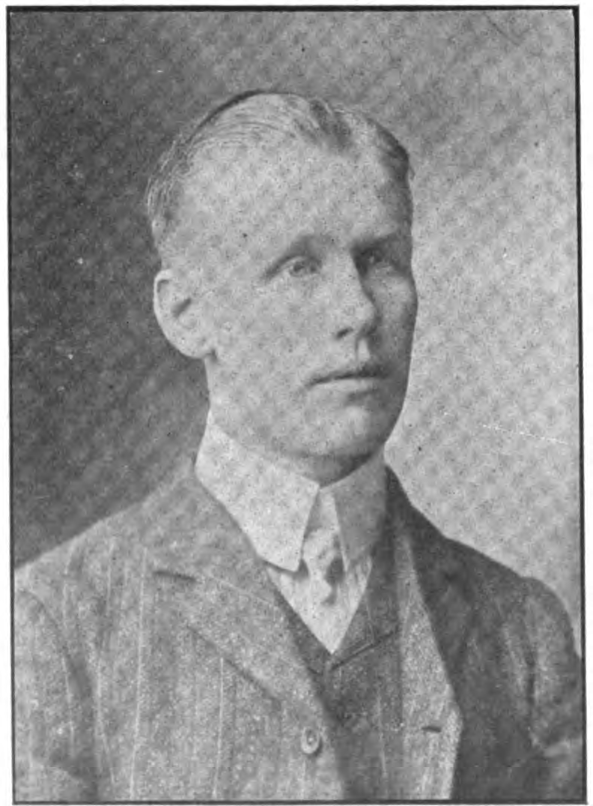

- Entry: `/prisoner/e-cousins`
- Source: [record/publication](https://www.marxists.org/history/usa/pubs/isr/v10n06-dec-1909-ISR-gog.pdf#page=2)
- Credit: International Socialist Review, December 1909, p.484; individual photographer unidentified.
- Identity: Named caption identifies A. E. Cousins; the surrounding contemporary article The Free Speech Fight at Spokane identifies his editorial/organizing role and arrest. Extracted embedded portrait; lossless conversion to PNG. Existing shorter name retained.
- Rights: Photograph published in the United States in 1909; public domain by expiration.
- Original: [chronological-originals/isr-dec1909.pdf-p2-0.jp2](chronological-originals/isr-dec1909.pdf-p2-0.jp2)
- Edit: lossless_format_conversion; rotation 0 degrees; crop None.
- Original SHA-256: `2b7cb9b976c5da2e490fae797f45f029623f516d92bd21af188f43ec2d71d566`
- Entry image SHA-256: `96493c2d8ef2bfcead9082b23df2a7c88a47ae1e42d03ae3f0f59d421fb58eca`

## James P. Wilson

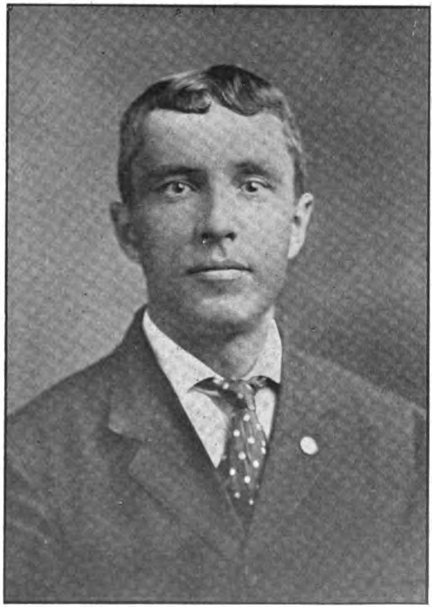

- Entry: `/prisoner/james-p-wilson`
- Source: [record/publication](https://www.marxists.org/history/usa/pubs/isr/v10n06-dec-1909-ISR-gog.pdf#page=3)
- Credit: International Socialist Review, December 1909, p.485; individual photographer unidentified.
- Identity: Named caption identifies James Wilson; the surrounding contemporary article The Free Speech Fight at Spokane identifies his editorial/organizing role and arrest. Extracted embedded portrait; lossless conversion to PNG. Existing shorter name retained.
- Rights: Photograph published in the United States in 1909; public domain by expiration.
- Original: [chronological-originals/isr-dec1909.pdf-p3-0.jp2](chronological-originals/isr-dec1909.pdf-p3-0.jp2)
- Edit: lossless_format_conversion; rotation 0 degrees; crop None.
- Original SHA-256: `8cb76d185566788623d1b5480acec93ecb48d4d0d31d9c7e7b6bd8e8847ed2e5`
- Entry image SHA-256: `a2d2ab65eb8d6453009a41251e4159432989be5ff30c02b6acfc5fe680fb7e6b`

## E. J. Foote

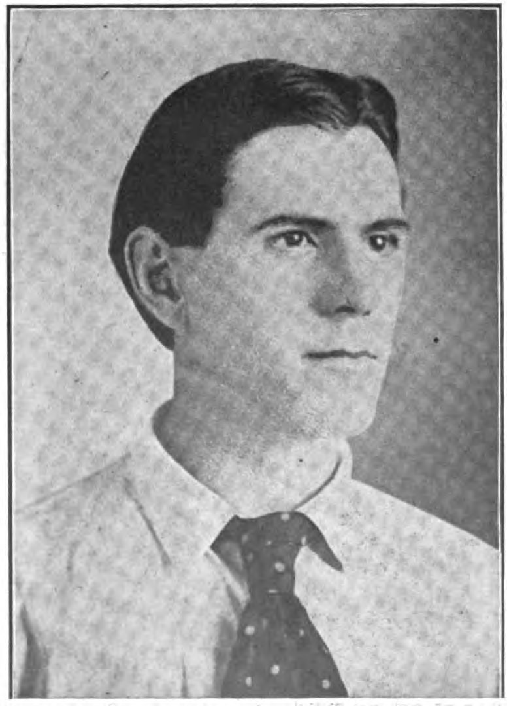

- Entry: `/prisoner/e-j-foote`
- Source: [record/publication](https://www.marxists.org/history/usa/pubs/isr/v10n06-dec-1909-ISR-gog.pdf#page=4)
- Credit: International Socialist Review, December 1909, p.486; individual photographer unidentified.
- Identity: Named caption identifies E. J. Foote; the surrounding contemporary article The Free Speech Fight at Spokane identifies his editorial/organizing role and arrest. Extracted embedded portrait; lossless conversion to PNG. Existing shorter name retained.
- Rights: Photograph published in the United States in 1909; public domain by expiration.
- Original: [chronological-originals/isr-dec1909.pdf-p4-0.jp2](chronological-originals/isr-dec1909.pdf-p4-0.jp2)
- Edit: lossless_format_conversion; rotation 0 degrees; crop None.
- Original SHA-256: `ea74bdc05529b8f3e95e7efc797b7392c43627c3adf18f362445233e69846bb5`
- Entry image SHA-256: `a67656b0f88eee8bbfab0d3791997795ea3389ef5e2368356d5d1cffbbe1afda`

## C. L. Filigno

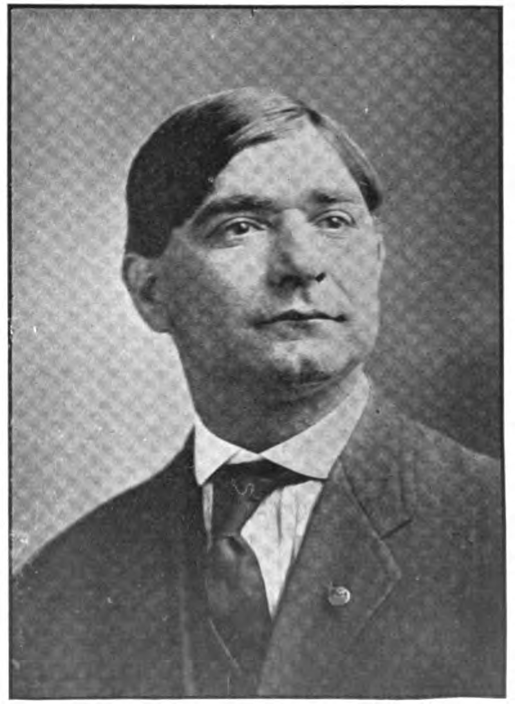

- Entry: `/prisoner/c-l-filigno`
- Source: [record/publication](https://www.marxists.org/history/usa/pubs/isr/v10n06-dec-1909-ISR-gog.pdf#page=5)
- Credit: International Socialist Review, December 1909, p.487; individual photographer unidentified.
- Identity: Named caption identifies C. L. Filigno; the surrounding contemporary article The Free Speech Fight at Spokane identifies his editorial/organizing role and arrest. Extracted embedded portrait; lossless conversion to PNG. Existing shorter name retained.
- Rights: Photograph published in the United States in 1909; public domain by expiration.
- Original: [chronological-originals/isr-dec1909.pdf-p5-0.jp2](chronological-originals/isr-dec1909.pdf-p5-0.jp2)
- Edit: lossless_format_conversion; rotation 0 degrees; crop None.
- Original SHA-256: `3469ab4235f52732d4ee74cd75b957091f810e36ee182d445173f5f28409f1c9`
- Entry image SHA-256: `4fb14096dbaea1372010643237eea8d43772988e4a9104c201507a29f3c61fe7`

## Frank Little

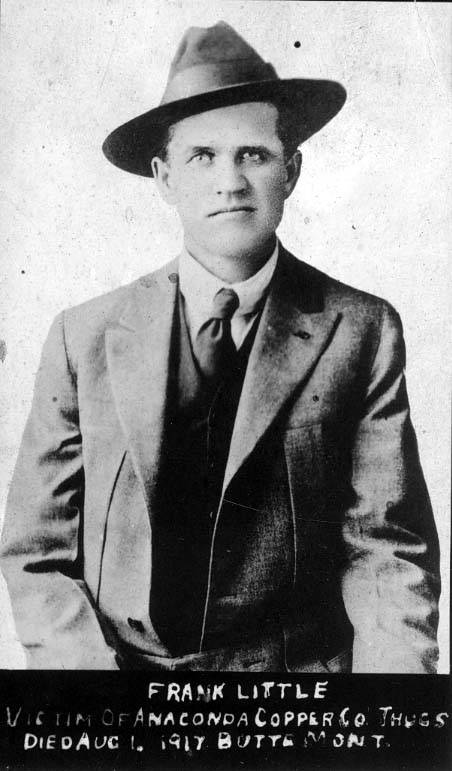

- Entry: `/prisoner/frank-little`
- Source: [record/publication](https://commons.wikimedia.org/wiki/File:IWW_organizer_Frank_Little,_c._1917.jpg)
- Credit: Unknown photographer, circa 1917; University of Washington Labor Archives, Industrial Workers of the World Photograph Collection.
- Identity: Archive description and original caption explicitly identify organizer Frank Little and his death in Butte on August 1, 1917.
- Rights: University of Washington institutional Flickr Commons: no known copyright restrictions.
- Original: [chronological-originals/little.jpg](chronological-originals/little.jpg)
- Edit: unmodified_download; rotation 0 degrees; crop None.
- Original SHA-256: `38fe1b828c8d45bcdcf9d98890a49695c785db3a0761a513f039d7791122dd96`
- Entry image SHA-256: `38fe1b828c8d45bcdcf9d98890a49695c785db3a0761a513f039d7791122dd96`

## Lázaro Gutiérrez de Lara

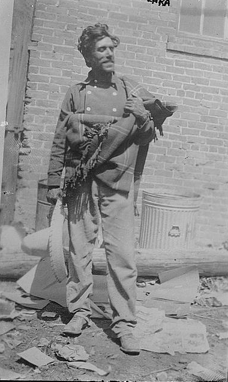

- Entry: `/prisoner/lazaro-gutierrez-de-lara`
- Source: [record/publication](https://www.loc.gov/item/2014686180/)
- Credit: Bain News Service; Library of Congress, George Grantham Bain Collection, ggbain.06187.
- Identity: Original negative names Gutierrez de Lara above both views. Catalog and Commons identify Mexican journalist and revolutionary Lázaro Gutiérrez de Lara; crop isolates the left view.
- Rights: Library of Congress Bain Collection: no known copyright restrictions.
- Original: [chronological-originals/lara.jpg](chronological-originals/lara.jpg)
- Edit: exact_rectangular_crop; rotation 0 degrees; crop [90, 75, 470, 710].
- Original SHA-256: `03da669dea69d76b4ee94e42f2b90f3868e87479f4f8018d1254901b7d731169`
- Entry image SHA-256: `ff4ad331c697e1d26b18959d5739ea9042be0488e05f6a084b036a867cc9b6d8`

## Faustino Adiarte

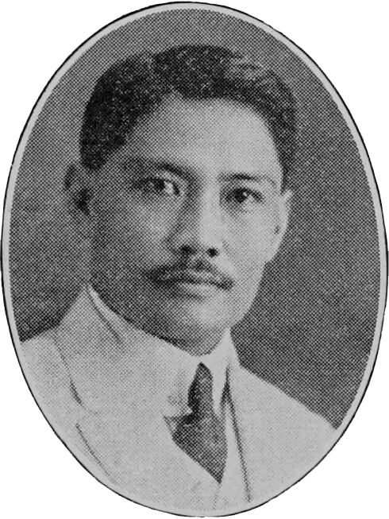

- Entry: `/prisoner/faustino-adiarte`
- Source: [record/publication](https://archive.org/details/directoriooficia5319phil/page/52/mode/2up)
- Credit: Bureau of Printing, Directorio oficial de la Cámara de Representantes, 1921; official portrait of Faustino Adiarte y Delgado.
- Identity: Official directory pp.54–55 identifies the Ilocos Norte lawyer born July 25, 1882 and explicitly says he was deported to Guam with his father Pancracio, Mabini and other political prisoners. The portrait is from the same directory.
- Rights: Philippine government official portrait published in 1921; public domain in the United States.
- Original: [chronological-originals/faustino.jpg](chronological-originals/faustino.jpg)
- Edit: unmodified_download; rotation 0 degrees; crop None.
- Original SHA-256: `40e3121b2001ea14c783e7af64eeb69ab7bfb66c2b4ee9bc656188026a51826d`
- Entry image SHA-256: `40e3121b2001ea14c783e7af64eeb69ab7bfb66c2b4ee9bc656188026a51826d`

## Antonio de Pío Araujo

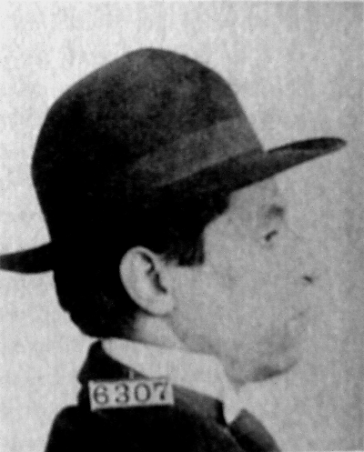

- Entry: `/prisoner/antonio-de-pio-araujo`
- Source: [record/publication](https://commons.wikimedia.org/wiki/File:Antonio_de_Pio_Araujo_1908.png)
- Credit: United States federal prison booking photograph, 1908, reproduced in Ward S. Albro, To Die on Your Feet.
- Identity: Source names Antonio de Pío Araujo, imprisoned in 1908; original prisoner number 6307 is visible.
- Rights: U.S. federal-government booking photograph; public domain in the United States.
- Original: [chronological-originals/araujo.png](chronological-originals/araujo.png)
- Edit: unmodified_download; rotation 0 degrees; crop None.
- Original SHA-256: `7431b46f4c94d0f7c9b20418b85cd41165315d6460d3aeefa57ee832e697fccb`
- Entry image SHA-256: `7431b46f4c94d0f7c9b20418b85cd41165315d6460d3aeefa57ee832e697fccb`

## Jesús M. Rangel

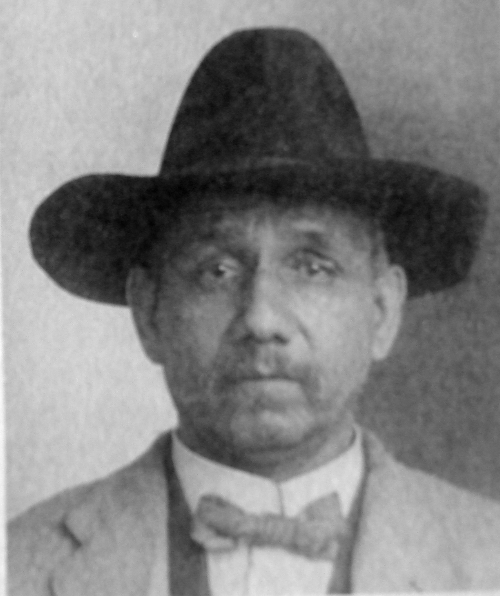

- Entry: `/prisoner/jesus-m-rangel`
- Source: [record/publication](https://commons.wikimedia.org/wiki/File:Jesus_Maria_Rangel.png)
- Credit: United States federal prison booking photograph, cataloged 1908, reproduced in Ward S. Albro, To Die on Your Feet.
- Identity: Source names Jesús María Rangel, PLM militant. Earlier federal booking photo; existing entry describes his later Rangel–Cline prosecution. Crop isolates frontal portrait.
- Rights: U.S. federal-government booking photograph; public domain in the United States.
- Original: [chronological-originals/rangel.png](chronological-originals/rangel.png)
- Edit: exact_rectangular_crop; rotation 0 degrees; crop [500, 0, 1000, 596].
- Original SHA-256: `f1c1e5f08ff03831a34097740df97c13212e9d82c17607ed5710eb2cdeda249f`
- Entry image SHA-256: `dd19595cd007a0dafa55813442dc1d76521c3690ccf4713cb25998b38a9252f8`

## Charles Plunkett

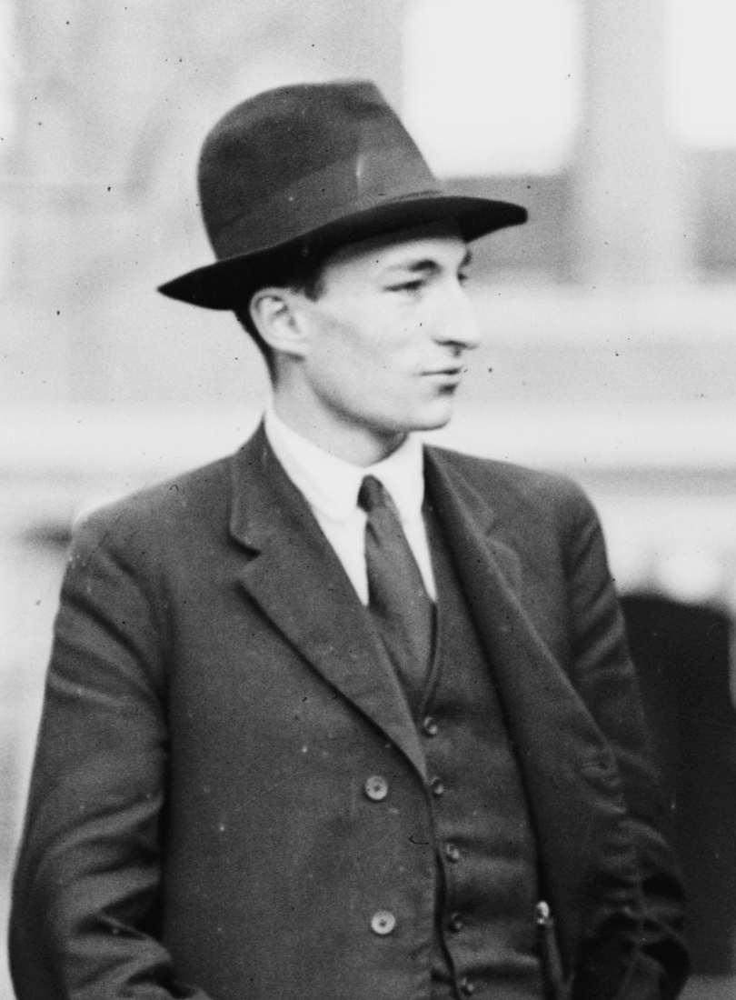

- Entry: `/prisoner/charles-plunkett`
- Source: [record/publication](https://www.loc.gov/item/2014695864/)
- Credit: Bain News Service, I.W.W. Committee—Sullivan, Caron, Plunkett, Turner, Woolman; Library of Congress.
- Identity: Negative inscription identifies Plunkett, third man from left. The IWW committee context agrees with Charles Robert Plunkett’s 1914 activism. Exact crop isolates the named sitter.
- Rights: Library of Congress Bain Collection: no known copyright restrictions.
- Original: [chronological-originals/plunkett-group.jpg](chronological-originals/plunkett-group.jpg)
- Edit: exact_rectangular_crop; rotation 0 degrees; crop [2130, 1000, 2940, 2100].
- Original SHA-256: `74bce7ab65c51bedc21c7ff10c8a8880afe9a9a52a403b851b7d3741e48b3910`
- Entry image SHA-256: `ded8a2ee7c6c6a43e88d70a67a18ebbc63cf1f59629ef4ee1477ad25932b20ee`

## Julián Montalan

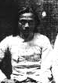

- Entry: `/prisoner/julian-montalan`
- Source: [record/publication](https://history.com.ph/People_Filipinos_Sakay_Macario_MacarioSakayWithOthers)
- Credit: Historical group portrait of Macario Sakay and fellow leaders, circa 1906–1907; Philippine History Resources.
- Identity: Named group caption and published identification key place the sitter seated at far left. This is the original historical group photograph, with limited source resolution.
- Rights: Source explicitly labels the historical photograph public domain.
- Original: [chronological-originals/sakay-group.jpg](chronological-originals/sakay-group.jpg)
- Edit: exact_rectangular_crop; rotation 0 degrees; crop [1, 46, 75, 151].
- Original SHA-256: `c68bc86bc14d962bfcc05ecbff210b040ae92bb0f853b964c327d3bf16ec1fba`
- Entry image SHA-256: `a1c94426343708ea5407ca539306a715cfed5a3a0fd7b5354859b3693fe39b79`

## Lucio de Vega

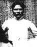

- Entry: `/prisoner/lucio-de-vega`
- Source: [record/publication](https://history.com.ph/People_Filipinos_Sakay_Macario_MacarioSakayWithOthers)
- Credit: Historical group portrait of Macario Sakay and fellow leaders, circa 1906–1907; Philippine History Resources.
- Identity: Named group caption and published identification key place the sitter standing at right. This is the original historical group photograph, with limited source resolution.
- Rights: Source explicitly labels the historical photograph public domain.
- Original: [chronological-originals/sakay-group.jpg](chronological-originals/sakay-group.jpg)
- Edit: exact_rectangular_crop; rotation 0 degrees; crop [204, 0, 277, 94].
- Original SHA-256: `c68bc86bc14d962bfcc05ecbff210b040ae92bb0f853b964c327d3bf16ec1fba`
- Entry image SHA-256: `bec5f4fbcfc07df6250c4dfbbfa4d7c21a816757c8fd27d33eaa9e6bc84780ec`

## Leonardo Vásquez

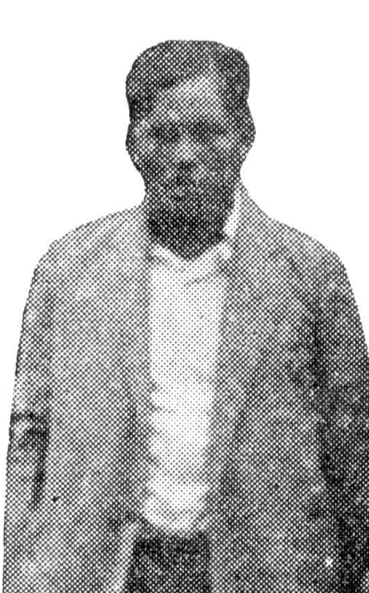

- Entry: `/prisoner/leonardo-vasquez`
- Source: [record/publication](https://www.marxists.org/history/usa/pubs/labordefender/1926/v01n10-oct-1926-ORIG-LD.pdf#page=11)
- Credit: Group photograph of the released Rangel–Cline prisoners, Labor Defender, October 1926; scan from Marxists Internet Archive.
- Identity: Original printed caption identifies L. L. Vasquez, first from left. Article concerns release of the same Texas Rangel–Cline prisoners as the database case.
- Rights: Underlying historical image is public domain in the United States; no claim is made to the copyright of surrounding modern text or page layout.
- Original: [chronological-originals/rangel-cline-original.jpg](chronological-originals/rangel-cline-original.jpg)
- Edit: exact_rectangular_crop; rotation 90 degrees; crop [45, 980, 580, 1840].
- Original SHA-256: `afa5fd9a5a96105a7f8619cfc666b8fcf3505183a1b5f0f302e32ce8adc961de`
- Entry image SHA-256: `c6076d365dd16538115490ae6bccafd650dcc8bd1a9228887fa2a102887a1500`

## Pedro Perales

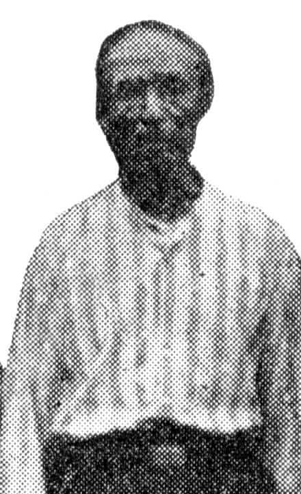

- Entry: `/prisoner/pedro-perales`
- Source: [record/publication](https://www.marxists.org/history/usa/pubs/labordefender/1926/v01n10-oct-1926-ORIG-LD.pdf#page=11)
- Credit: Group photograph of the released Rangel–Cline prisoners, Labor Defender, October 1926; scan from Marxists Internet Archive.
- Identity: Original printed caption identifies Pedro Perales, second from left. Article concerns release of the same Texas Rangel–Cline prisoners as the database case.
- Rights: Underlying historical image is public domain in the United States; no claim is made to the copyright of surrounding modern text or page layout.
- Original: [chronological-originals/rangel-cline-original.jpg](chronological-originals/rangel-cline-original.jpg)
- Edit: exact_rectangular_crop; rotation 90 degrees; crop [600, 1050, 1040, 1770].
- Original SHA-256: `afa5fd9a5a96105a7f8619cfc666b8fcf3505183a1b5f0f302e32ce8adc961de`
- Entry image SHA-256: `f8236e372b7c0b9ac6e8db3dd9ce98960c0e03533453338e46386351a22960d7`

## Jesús González

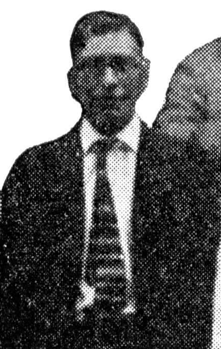

- Entry: `/prisoner/jesus-gonzalez`
- Source: [record/publication](https://www.marxists.org/history/usa/pubs/labordefender/1926/v01n10-oct-1926-ORIG-LD.pdf#page=11)
- Credit: Group photograph of the released Rangel–Cline prisoners, Labor Defender, October 1926; scan from Marxists Internet Archive.
- Identity: Original printed caption identifies Jesus Gonzales, fourth from left. Article concerns release of the same Texas Rangel–Cline prisoners as the database case.
- Rights: Underlying historical image is public domain in the United States; no claim is made to the copyright of surrounding modern text or page layout.
- Original: [chronological-originals/rangel-cline-original.jpg](chronological-originals/rangel-cline-original.jpg)
- Edit: exact_rectangular_crop; rotation 90 degrees; crop [1530, 1060, 1960, 1740].
- Original SHA-256: `afa5fd9a5a96105a7f8619cfc666b8fcf3505183a1b5f0f302e32ce8adc961de`
- Entry image SHA-256: `1ddac8fc31daea3acb2c567f894e73d9e92065a1c955206fa7c3533fc90c0540`

## Charles Cline

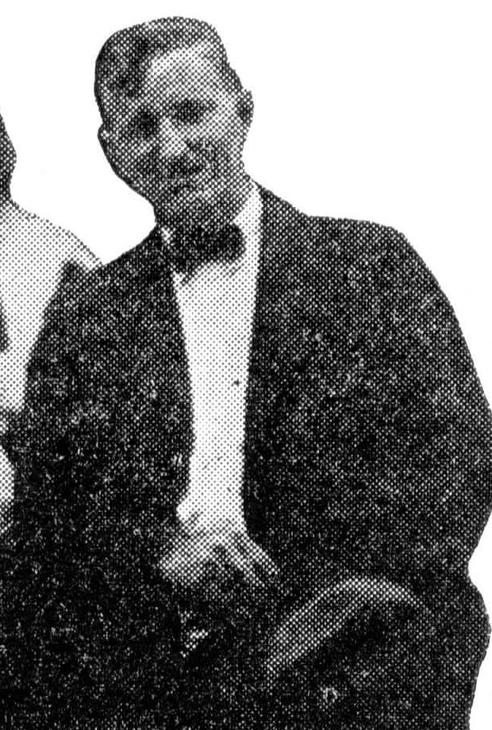

- Entry: `/prisoner/charles-cline`
- Source: [record/publication](https://www.marxists.org/history/usa/pubs/labordefender/1926/v01n10-oct-1926-ORIG-LD.pdf#page=11)
- Credit: Group photograph of the released Rangel–Cline prisoners, Labor Defender, October 1926; scan from Marxists Internet Archive.
- Identity: Original printed caption identifies Charles Cline, sixth from left. Article concerns release of the same Texas Rangel–Cline prisoners as the database case.
- Rights: Underlying historical image is public domain in the United States; no claim is made to the copyright of surrounding modern text or page layout.
- Original: [chronological-originals/rangel-cline-original.jpg](chronological-originals/rangel-cline-original.jpg)
- Edit: exact_rectangular_crop; rotation 90 degrees; crop [2430, 850, 3050, 1770].
- Original SHA-256: `afa5fd9a5a96105a7f8619cfc666b8fcf3505183a1b5f0f302e32ce8adc961de`
- Entry image SHA-256: `ac60f1d48ba738c27138046df27c9a058a2c50be6d72520389c2d9aa21ba0303`

## Rena Mooney

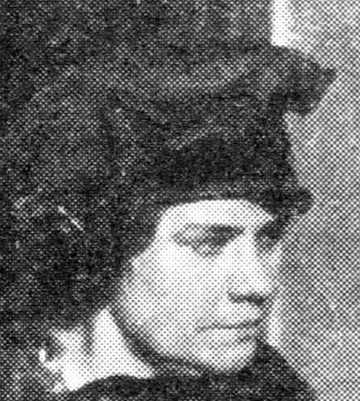

- Entry: `/prisoner/rena-mooney`
- Source: [record/publication](https://www.marxists.org/history/usa/pubs/isr/v18n01-jul-1917-ISR-riaz-ocr.pdf#page=31)
- Credit: Photograph of the five Preparedness Day defendants, International Socialist Review, July 1917; scan from Marxists Internet Archive.
- Identity: Original printed left-to-right caption identifies Rena Mooney, woman standing at back left. Same five defendants and 1916 prosecution as the database case.
- Rights: Underlying historical image is public domain in the United States; no claim is made to the copyright of surrounding modern text or page layout.
- Original: [chronological-originals/mooney-group-original.jpg](chronological-originals/mooney-group-original.jpg)
- Edit: exact_rectangular_crop; rotation 0 degrees; crop [870, 170, 1320, 670].
- Original SHA-256: `b817c7d9ed3104a998f368971432b76f3979ba9a2177c06b94d0f8df9e07bc40`
- Entry image SHA-256: `fdb666af31ce636f8ba8f5c7439b3ac37890d8bb8eb8505792947e0f3865fed0`

## Edward D. Nolan

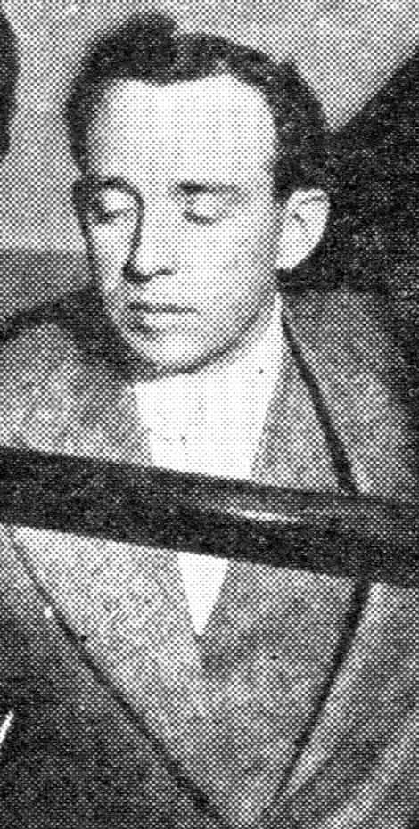

- Entry: `/prisoner/edward-d-nolan`
- Source: [record/publication](https://www.marxists.org/history/usa/pubs/isr/v18n01-jul-1917-ISR-riaz-ocr.pdf#page=31)
- Credit: Photograph of the five Preparedness Day defendants, International Socialist Review, July 1917; scan from Marxists Internet Archive.
- Identity: Original printed left-to-right caption identifies Ed. Nolan, third named subject and seated center-left. Same five defendants and 1916 prosecution as the database case.
- Rights: Underlying historical image is public domain in the United States; no claim is made to the copyright of surrounding modern text or page layout.
- Original: [chronological-originals/mooney-group-original.jpg](chronological-originals/mooney-group-original.jpg)
- Edit: exact_rectangular_crop; rotation 0 degrees; crop [1280, 700, 1750, 1630].
- Original SHA-256: `b817c7d9ed3104a998f368971432b76f3979ba9a2177c06b94d0f8df9e07bc40`
- Entry image SHA-256: `400a7c5ccf52b918f050d4d6933a0b0c83f647aaecaa2fb35124341a3d1d87e3`

## Israel Weinberg

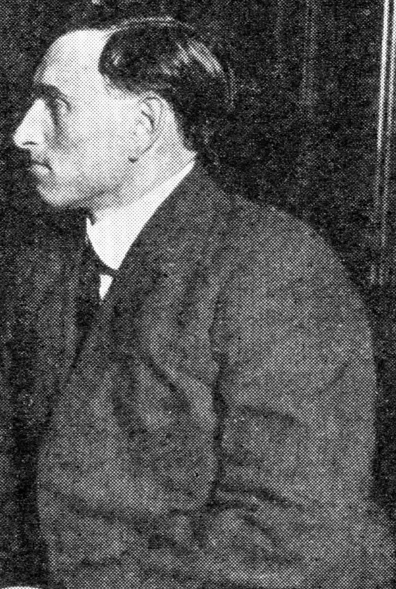

- Entry: `/prisoner/israel-weinberg`
- Source: [record/publication](https://www.marxists.org/history/usa/pubs/isr/v18n01-jul-1917-ISR-riaz-ocr.pdf#page=31)
- Credit: Photograph of the five Preparedness Day defendants, International Socialist Review, July 1917; scan from Marxists Internet Archive.
- Identity: Original printed left-to-right caption identifies Israel Weinberg, far right. Same five defendants and 1916 prosecution as the database case.
- Rights: Underlying historical image is public domain in the United States; no claim is made to the copyright of surrounding modern text or page layout.
- Original: [chronological-originals/mooney-group-original.jpg](chronological-originals/mooney-group-original.jpg)
- Edit: exact_rectangular_crop; rotation 0 degrees; crop [2420, 780, 3240, 2000].
- Original SHA-256: `b817c7d9ed3104a998f368971432b76f3979ba9a2177c06b94d0f8df9e07bc40`
- Entry image SHA-256: `75838918c81d5885b53c91f4697ae7fc438e155cb37c607080a2c7a8c487fed4`

## Vincent Buccafori

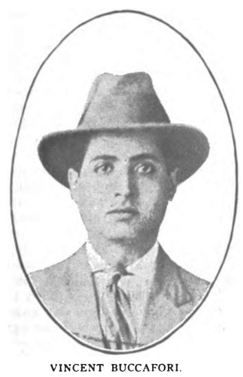

- Entry: `/prisoner/vincent-buccafori`
- Source: [record/publication](https://revolutionsnewsstand.com/2024/07/24/an-i-w-w-man-needs-aid-by-joseph-j-ettor-from-industrial-worker-vol-3-no-1-march-23-1911/)
- Credit: Photograph of Vincent Buccafori, International Socialist Review, May 1911, reproduced by Revolutions Newsstand.
- Identity: Original printed name below portrait; associated appeal concerns the same IWW member sentenced to Sing Sing in 1911.
- Rights: Underlying historical image is public domain in the United States; no claim is made to the copyright of surrounding modern text or page layout.
- Original: [chronological-originals/buccafori-source.jpg](chronological-originals/buccafori-source.jpg)
- Edit: exact_rectangular_crop; rotation 0 degrees; crop [80, 12, 433, 560].
- Original SHA-256: `6d6b842bd7778a5282e9d62571f7d4371d273a1857f065a600c290fe8fa3dcbd`
- Entry image SHA-256: `af59673f98ab76197109b10a4559ff2812fb8ad9c53d983fa86dd3776e4bab4d`

## Clarence Cyphert

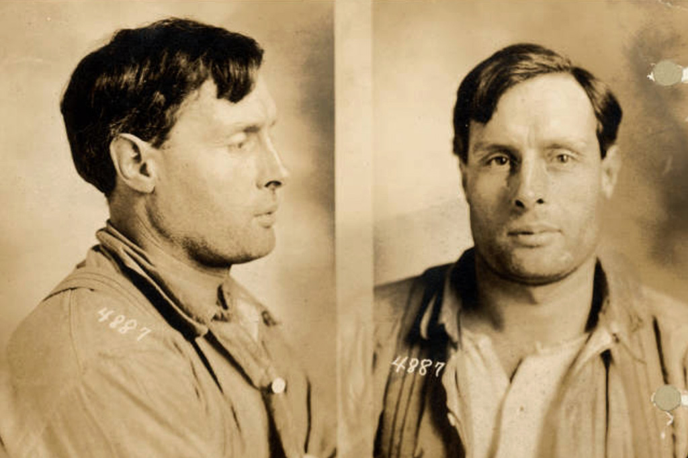

- Entry: `/prisoner/clarence-cyphert`
- Source: [record/publication](https://www.historylink.org/File/21167)
- Credit: Clarence Cyphert, Snohomish County Jail, 1916, prisoner 4887. Courtesy Everett Public Library, reproduced in Denise Ohio, HistoryLink essay 21167.
- Identity: Source caption and biography identify Cyphert and the Everett Massacre case; both original booking views bear 4887.
- Rights: Used unmodified under the source page’s Creative Commons Attribution-NonCommercial-NoDerivs 3.0 Unported notice (https://creativecommons.org/licenses/by-nc-nd/3.0/), with source and institutional credit retained.
- Original: [chronological-originals/cyphert1916.jpg](chronological-originals/cyphert1916.jpg)
- Edit: unmodified_download; rotation 0 degrees; crop None.
- Original SHA-256: `c95aabd087b618946d419c7de16acd3b82c466e32e2a351a0d90e4c67584d677`
- Entry image SHA-256: `c95aabd087b618946d419c7de16acd3b82c466e32e2a351a0d90e4c67584d677`

## Prisciliano G. Silva

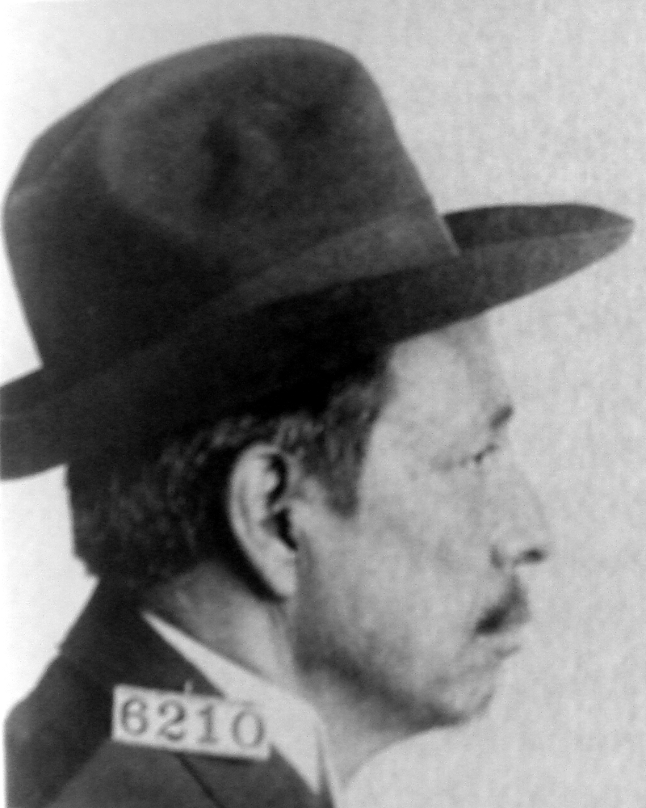

- Entry: `/prisoner/prisciliano-g-silva`
- Source: [record/publication](https://commons.wikimedia.org/wiki/File:Prisciliano_G_Silva.png)
- Credit: United States federal prison booking photograph, circa 1908; reproduced in Ward S. Albro, To Die on Your Feet, and Wikimedia Commons.
- Identity: File description names the PLM member imprisoned for neutrality-law violations. Original booking number 6210 is visible; matches the person and prosecution described in the database.
- Rights: Public domain: photograph created by a United States federal prison employee as part of official duties; Commons PD-US-DOJ / PD-US-Gov designation.
- Original: [chronological-originals/Prisciliano_G_Silva.png](chronological-originals/Prisciliano_G_Silva.png)
- Edit: unmodified_download; rotation 0 degrees; crop None.
- Original SHA-256: `7a2a5144405738082757ac6473421bbfa832fd8e68629c95daa279005d76dca0`
- Entry image SHA-256: `7a2a5144405738082757ac6473421bbfa832fd8e68629c95daa279005d76dca0`

## Leocadio Treviño

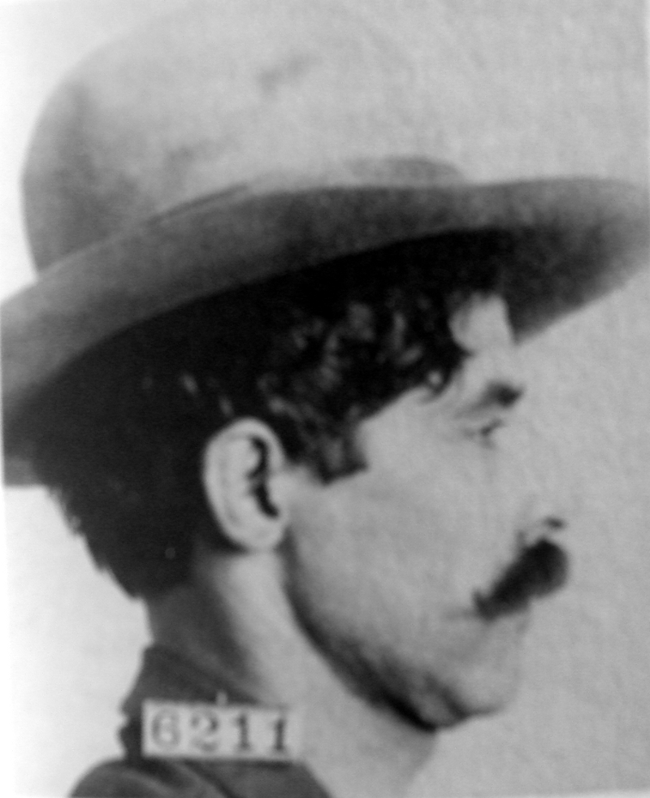

- Entry: `/prisoner/leocadio-trevino`
- Source: [record/publication](https://commons.wikimedia.org/wiki/File:Leocardio_B_Trevino.png)
- Credit: United States federal prison booking photograph, circa 1908; reproduced in Ward S. Albro, To Die on Your Feet, and Wikimedia Commons.
- Identity: File description names the PLM member imprisoned for neutrality-law violations. Original booking number 6211 is visible; matches the person and prosecution described in the database.
- Rights: Public domain: photograph created by a United States federal prison employee as part of official duties; Commons PD-US-DOJ / PD-US-Gov designation.
- Original: [chronological-originals/Leocardio_B_Trevino.png](chronological-originals/Leocardio_B_Trevino.png)
- Edit: unmodified_download; rotation 0 degrees; crop None.
- Original SHA-256: `ef28cb35ea957fc50f0b97163a134457b5f4ba534a5d212f73e8da2c45afccf3`
- Entry image SHA-256: `ef28cb35ea957fc50f0b97163a134457b5f4ba534a5d212f73e8da2c45afccf3`

## Encarnación Díaz Guerra

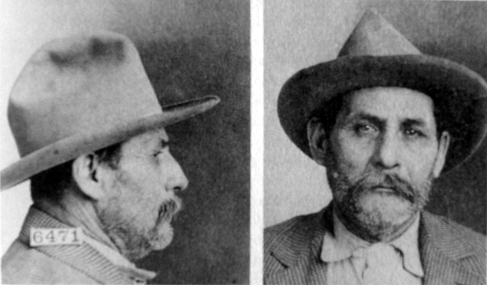

- Entry: `/prisoner/encarnacion-diaz-guerra`
- Source: [record/publication](https://commons.wikimedia.org/wiki/File:Encarnacion_Diaz_Guerra.png)
- Credit: United States federal prison booking photograph, circa 1908; reproduced in Ward S. Albro, To Die on Your Feet, and Wikimedia Commons.
- Identity: File description names the PLM member imprisoned for neutrality-law violations. Original booking number 6471 is visible; matches the person and prosecution described in the database.
- Rights: Public domain: photograph created by a United States federal prison employee as part of official duties; Commons PD-US-DOJ / PD-US-Gov designation.
- Original: [chronological-originals/Encarnacion_Diaz_Guerra.png](chronological-originals/Encarnacion_Diaz_Guerra.png)
- Edit: unmodified_download; rotation 0 degrees; crop None.
- Original SHA-256: `6191f127988a052c884a13b2de5b2e2f9da0ca6fa5e1fcc2da83bcd9669c45e7`
- Entry image SHA-256: `6191f127988a052c884a13b2de5b2e2f9da0ca6fa5e1fcc2da83bcd9669c45e7`

## Maud Jamison

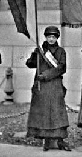

- Entry: `/prisoner/maud-jamison`
- Source: [record/publication](https://suffragistmemorial.org/maud-jamison/)
- Credit: Maud Jamison on the suffrage picket line, circa 1917. Photograph courtesy Library of Congress, reproduced by Turning Point Suffragist Memorial.
- Identity: Memorial biography explicitly identifies the pictured Maud Jamison of Norfolk and her repeated arrests from June 1917 onward.
- Rights: Underlying historical image is public domain in the United States; no claim is made to the copyright of surrounding modern text or page layout.
- Original: [chronological-originals/jamison.jpg](chronological-originals/jamison.jpg)
- Edit: unmodified_download; rotation 0 degrees; crop None.
- Original SHA-256: `85cf699aab2cead925ad826642e6b1ac35072937959975e7b0aeec5bd7908526`
- Entry image SHA-256: `85cf699aab2cead925ad826642e6b1ac35072937959975e7b0aeec5bd7908526`

## Mary Ingham

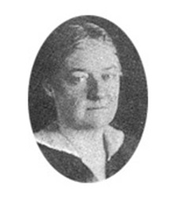

- Entry: `/prisoner/mary-ingham`
- Source: [record/publication](https://suffragistmemorial.org/mary-h-ingham/)
- Credit: Historical portrait of Mary H. Ingham, reproduced by Turning Point Suffragist Memorial; portrait also associated with contemporary Bryn Mawr suffrage accounts.
- Identity: Portrait is explicitly captioned Mary H. Ingham; biography identifies the Philadelphia NWP chair and the 1917 Occoquan case.
- Rights: Historical portrait reproduced by Turning Point Suffragist Memorial. Original photographer, publication date, and separate image-rights statement not supplied.
- Original: [chronological-originals/ingham.jpg](chronological-originals/ingham.jpg)
- Edit: unmodified_download; rotation 0 degrees; crop None.
- Original SHA-256: `3506a645b18b70f3eee27eabe2741e181cf9a87d66d21edf78f4e9598514bad0`
- Entry image SHA-256: `3506a645b18b70f3eee27eabe2741e181cf9a87d66d21edf78f4e9598514bad0`

## John J. McNamara

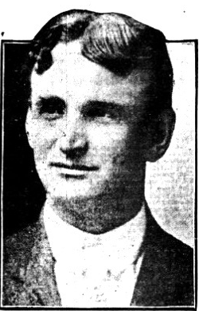

- Entry: `/prisoner/john-j-mcnamara`
- Source: [record/publication](https://lawesterners.org/wp-content/uploads/2022/11/Branding-Iron-298-Spring-2020.pdf#page=4)
- Credit: John J. McNamara, right-hand portrait in The Washington Times, April 25, 1911, front page; reproduced in The Branding Iron 298, Spring 2020, p. 4, from Library of Congress.
- Identity: Figure 2 caption explicitly identifies John J. McNamara as the right-hand brother. Article describes the same 1911 Los Angeles bombing prosecution.
- Rights: Underlying historical image is public domain in the United States; no claim is made to the copyright of surrounding modern text or page layout.
- Original: [chronological-originals/mcnamara-p4-0.jpg](chronological-originals/mcnamara-p4-0.jpg)
- Edit: exact_rectangular_crop; rotation 0 degrees; crop [269, 50, 519, 440].
- Original SHA-256: `d7860800f9a4b1125500b0015ab9160db7ae23881739c32689675dd2ad2ab0a6`
- Entry image SHA-256: `b9a81494a1bb8da9110a818dd74ac3ca1788862db5dc5ab5fe1f08205b636fa1`

## Lucille Shields

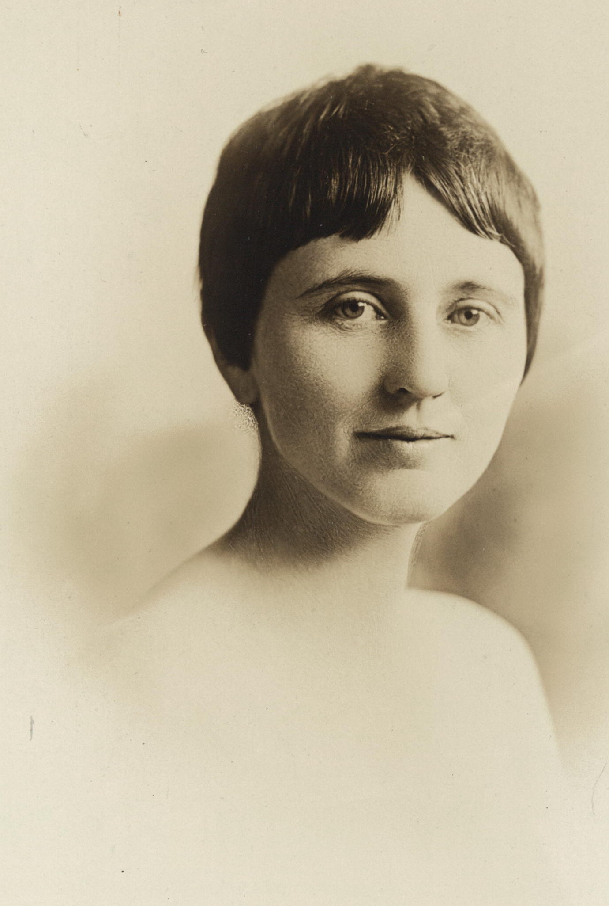

- Entry: `/prisoner/lucille-shields`
- Source: [record/publication](https://www.loc.gov/item/mnwp000164/)
- Credit: Portrait of Lucille Shields, catalogued as Mrs. Alexandra Shields; National Woman’s Party records, Manuscript Division, Library of Congress, mnwp000164.
- Identity: LOC identifies her West Point birthplace, Amarillo home, and July 1917 picket-line activity. Taylor Stewart’s biographical sketch (https://www.documents.alexanderstreet.com/d/1008297964) explicitly resolves Lucille / Mrs. Alexander / Mrs. Alexandra Shields and cites this exact photo.
- Rights: Library of Congress National Woman’s Party collection: no known restrictions on publication.
- Original: [chronological-originals/shields.jpg](chronological-originals/shields.jpg)
- Edit: exact_rectangular_crop; rotation 0 degrees; crop [410, 620, 1790, 2670].
- Original SHA-256: `cc851ba7a053756aa40b4c7f1f0c6a9e8382303a06c8589bb2ce3d868eb83d1c`
- Entry image SHA-256: `0d2b7d93a46b8e2a4f75eae988e2b1ec69fda57a02f5843cc52e02872f9e88c1`

## Margaret Whittemore

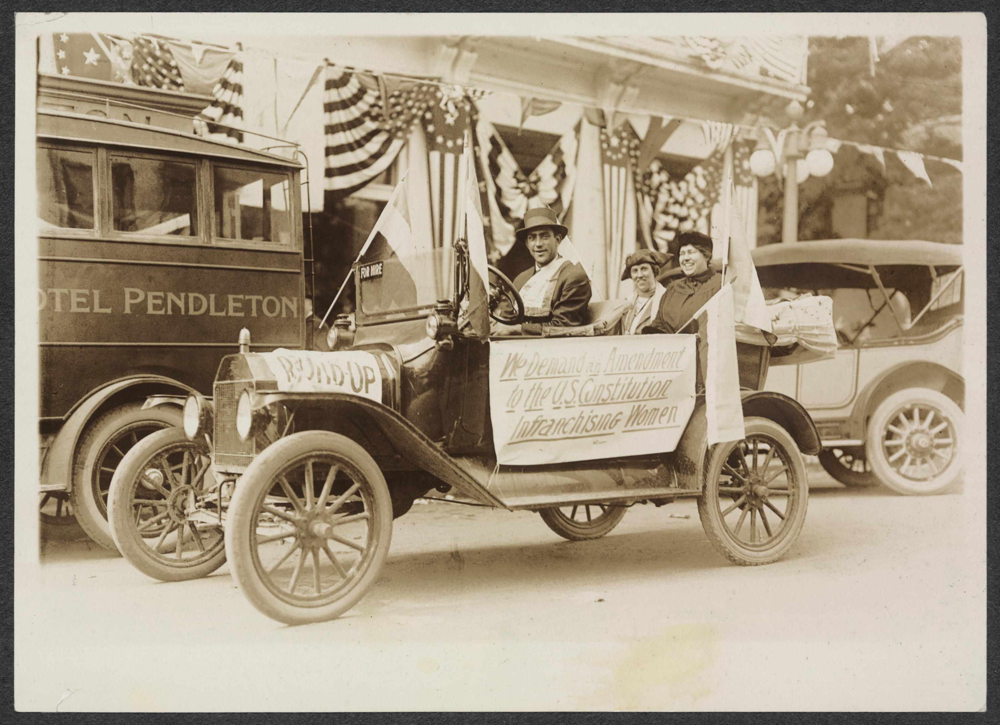

- Entry: `/prisoner/margaret-whittemore`
- Source: [record/publication](https://www.loc.gov/item/mnwp000348/)
- Credit: Margaret Fay Whittemore and Mary Gertrude Fendall campaigning in Pendleton, Oregon, September 23, 1916. National Woman’s Party records, Library of Congress, mnwp000348.
- Identity: LOC title identifies both women. The complete photograph is retained because the catalogue title does not explicitly distinguish their positions.
- Rights: Library of Congress National Woman’s Party collection: no known restrictions on publication.
- Original: [chronological-originals/whittemore.jpg](chronological-originals/whittemore.jpg)
- Edit: unmodified_download; rotation 0 degrees; crop None.
- Original SHA-256: `f40f0d6ddaa1eaf77fe2cd8c982db811c7cd1bf3b929466c15356c430405eb70`
- Entry image SHA-256: `f40f0d6ddaa1eaf77fe2cd8c982db811c7cd1bf3b929466c15356c430405eb70`

## Louise Parker Mayo

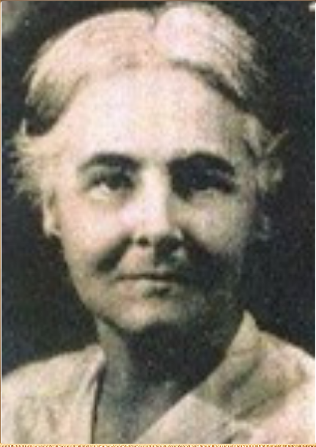

- Entry: `/prisoner/louise-parker-mayo`
- Source: [record/publication](https://www.framinghamma.gov/3980/Louise-Parker-Mayo)
- Credit: Historical portrait of Louise Parker Mayo supplied by the City of Framingham; modern decorative frame excluded from crop.
- Identity: City profile explicitly names the pictured Framingham suffragist and describes her 1917 imprisonment.
- Rights: Historical photograph reproduced by the City of Framingham. Photographer, original publication date, and a separate image rights statement are not supplied by that page; modern decorative framing is excluded.
- Original: [chronological-originals/mayo-city.jpg](chronological-originals/mayo-city.jpg)
- Edit: exact_rectangular_crop; rotation 0 degrees; crop [281, 176, 798, 907].
- Original SHA-256: `ba90d00bcfe30f04912189eec440ddcd3bd866e30d2cea7673ee63c65b3e7bcb`
- Entry image SHA-256: `714df68d7a3673395d256a38242d2c2a746193b4c9f1e017d228fee3b22448cc`

## Beatrice Kinkead

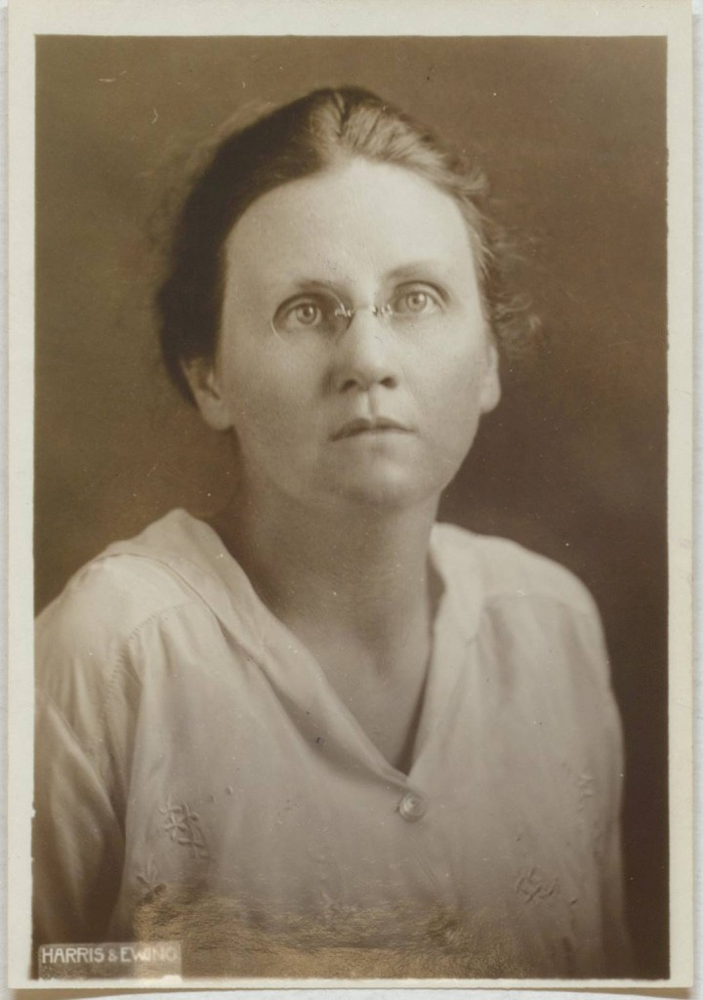

- Entry: `/prisoner/beatrice-kinkead`
- Source: [record/publication](https://suffragistmemorial.org/beatrice-reynolds-kinkead-november-8-1874-november-11-1947/)
- Credit: Harris & Ewing, portrait of Beatrice Reynolds Kinkead. National Woman’s Party records, Part I, Box 153, Manuscript Division, Library of Congress; reproduced by Turning Point Suffragist Memorial.
- Identity: Source captions the portrait as Beatrice Kinkead and documents her July 14, 1917 arrest and imprisonment.
- Rights: Underlying historical image is public domain in the United States; no claim is made to the copyright of surrounding modern text or page layout.
- Original: [chronological-originals/kinkead-large.jpg](chronological-originals/kinkead-large.jpg)
- Edit: unmodified_download; rotation 0 degrees; crop None.
- Original SHA-256: `b8c98626da0081905ef729da840e2ded97e07c2275c43e629d1a48e596aec909`
- Entry image SHA-256: `b8c98626da0081905ef729da840e2ded97e07c2275c43e629d1a48e596aec909`

## Lotta Burke

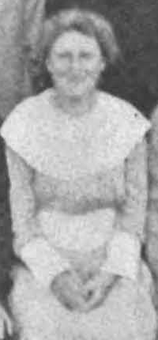

- Entry: `/prisoner/lotta-burke`
- Source: [record/publication](https://www.marxists.org/history/usa/pubs/isr/v18n07-jan-1918-ISR-gog-UC.pdf#page=59)
- Credit: International Socialist Review, January 1918, p. 379, Cincinnati defendants photograph.
- Identity: Original caption identifies third person in seated front row from left. Names and Cincinnati anti-conscription prosecution match the prisoner; contemporary American Socialist June 28, 1917 also names both defendants.
- Rights: Underlying historical image is public domain in the United States; no claim is made to the copyright of surrounding modern text or page layout.
- Original: [chronological-originals/cincinnati-p59-0.jpg](chronological-originals/cincinnati-p59-0.jpg)
- Edit: exact_rectangular_crop; rotation 0 degrees; crop [810, 570, 1010, 1000].
- Original SHA-256: `63c60af09e41da6a8d36959a1406097777e5dbcc530ffcdcb0574e97906a83c1`
- Entry image SHA-256: `e8ec0fe2ebbd703c8bd088df013aeabb1bb1f9d0f817f6f6427b5b5529b9fde3`

## Joseph Geier

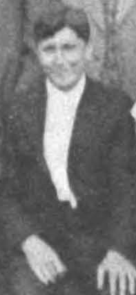

- Entry: `/prisoner/joseph-geier`
- Source: [record/publication](https://www.marxists.org/history/usa/pubs/isr/v18n07-jan-1918-ISR-gog-UC.pdf#page=59)
- Credit: International Socialist Review, January 1918, p. 379, Cincinnati defendants photograph.
- Identity: Original caption identifies second person in seated front row from left. Names and Cincinnati anti-conscription prosecution match the prisoner; contemporary American Socialist June 28, 1917 also names both defendants.
- Rights: Underlying historical image is public domain in the United States; no claim is made to the copyright of surrounding modern text or page layout.
- Original: [chronological-originals/cincinnati-p59-0.jpg](chronological-originals/cincinnati-p59-0.jpg)
- Edit: exact_rectangular_crop; rotation 0 degrees; crop [620, 575, 817, 1000].
- Original SHA-256: `63c60af09e41da6a8d36959a1406097777e5dbcc530ffcdcb0574e97906a83c1`
- Entry image SHA-256: `70d00a5bc48f7dce80172b0cbb2ce10206c161d125968d5414510962c6a0dd2b`

## Mrs. C. T. Robertson

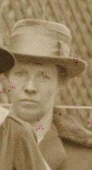

- Entry: `/prisoner/mrs-c-t-robertson`
- Source: [record/publication](https://www.loc.gov/item/mnwp000296/)
- Credit: Harris & Ewing, November 10, 1917; National Woman's Party Records, Library of Congress, mnwp000296.
- Identity: LOC full caption identifies fourth woman from left by name; published in The Suffragist, November 17, 1917.
- Rights: Underlying historical image is public domain in the United States; no claim is made to the copyright of surrounding modern text or page layout.
- Original: [chronological-originals/pickets-nov1917.jpg](chronological-originals/pickets-nov1917.jpg)
- Edit: exact_rectangular_crop; rotation 0 degrees; crop [1320, 400, 1510, 750].
- Original SHA-256: `9e49ce416b2a114be2d6d1138b582ee11fdb95e9d80e2737fb431a95a4b9af1c`
- Entry image SHA-256: `79c128a60b4ee87a4167099200f1e0e938af595eb896fb0a3475703f97440562`

## Cora Week

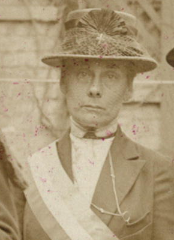

- Entry: `/prisoner/cora-week`
- Source: [record/publication](https://www.loc.gov/item/mnwp000296/)
- Credit: Harris & Ewing, November 10, 1917; National Woman's Party Records, Library of Congress, mnwp000296.
- Identity: LOC full caption identifies fifth woman from left by name; published in The Suffragist, November 17, 1917.
- Rights: Underlying historical image is public domain in the United States; no claim is made to the copyright of surrounding modern text or page layout.
- Original: [chronological-originals/pickets-nov1917.jpg](chronological-originals/pickets-nov1917.jpg)
- Edit: exact_rectangular_crop; rotation 0 degrees; crop [1550, 490, 1840, 890].
- Original SHA-256: `9e49ce416b2a114be2d6d1138b582ee11fdb95e9d80e2737fb431a95a4b9af1c`
- Entry image SHA-256: `a57c620b4ece8c2e1176220c2d29a1907100e90c516967e4aba8e0b97d59cbb0`

## Hattie Kruger

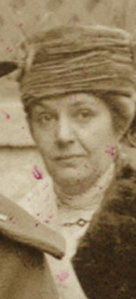

- Entry: `/prisoner/hattie-kruger`
- Source: [record/publication](https://www.loc.gov/item/mnwp000296/)
- Credit: Harris & Ewing, November 10, 1917; National Woman's Party Records, Library of Congress, mnwp000296.
- Identity: LOC full caption identifies seventh woman from left by name; published in The Suffragist, November 17, 1917.
- Rights: Underlying historical image is public domain in the United States; no claim is made to the copyright of surrounding modern text or page layout.
- Original: [chronological-originals/pickets-nov1917.jpg](chronological-originals/pickets-nov1917.jpg)
- Edit: exact_rectangular_crop; rotation 0 degrees; crop [2050, 510, 2200, 840].
- Original SHA-256: `9e49ce416b2a114be2d6d1138b582ee11fdb95e9d80e2737fb431a95a4b9af1c`
- Entry image SHA-256: `4d4fa8a3744a7dd3961bf2d64ad005018cd46aed082b06697714b2a4a0aa6560`

## Betty Gram

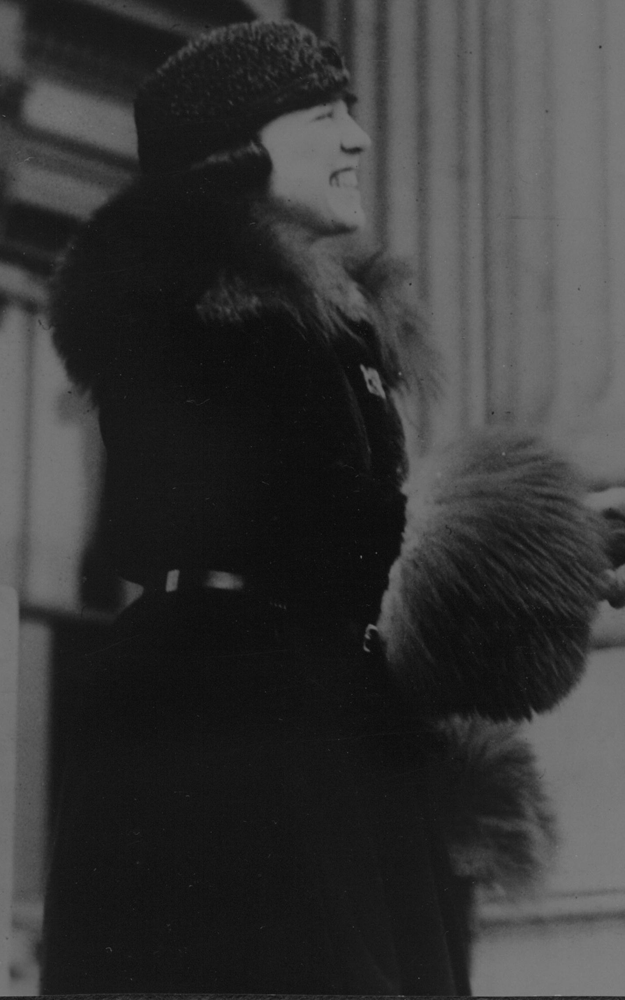

- Entry: `/prisoner/betty-gram`
- Source: [record/publication](https://www.loc.gov/item/mnwp000387/)
- Credit: Senator Freylinghuysen congratulates Betty Gram on New Jersey ratification, February 1920; LOC NWP mnwp000387.
- Identity: Catalog identifies Betty Gram as the woman shaking hands with Senator Frelinghuysen. Crop isolates the woman on the left.
- Rights: Underlying historical image is public domain in the United States; no claim is made to the copyright of surrounding modern text or page layout.
- Original: [chronological-originals/betty-congratulated.jpg](chronological-originals/betty-congratulated.jpg)
- Edit: exact_rectangular_crop; rotation 0 degrees; crop [690, 720, 2110, 2990].
- Original SHA-256: `11f32ada2ea0081711d5dda1d9151667c7b293abcda6d114ade8f10d9d43b4cc`
- Entry image SHA-256: `ab300c57b0a449a5133c6b224b1d5da67cbb04003cec610d15459de04155eb50`

## Paula Jakobi

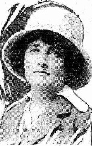

- Entry: `/prisoner/paula-jakobi`
- Source: [record/publication](https://suffragistmemorial.org/paula-o-jakobi-1870-july-12-1960/)
- Credit: New York Tribune, January 11, 1914, reproduced by Turning Point Suffragist Memorial.
- Identity: Named portrait on biographical page for Paula O. Jakobi, playwright and 1917 suffrage prisoner; source explicitly credits 1914 newspaper.
- Rights: Underlying historical image is public domain in the United States; no claim is made to the copyright of surrounding modern text or page layout.
- Original: [chronological-originals/paula.jpg](chronological-originals/paula.jpg)
- Edit: unmodified_download; rotation 0 degrees; crop None.
- Original SHA-256: `b1762438d4128842b1171a7b366675221d8e21e82941b12482c42a3589f50ed4`
- Entry image SHA-256: `b1762438d4128842b1171a7b366675221d8e21e82941b12482c42a3589f50ed4`

## Richard Brazier

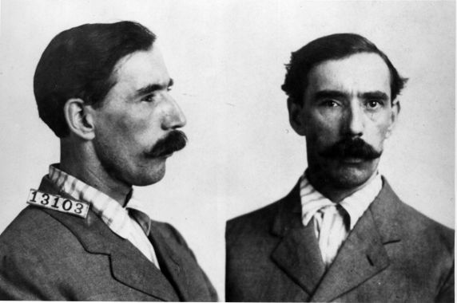

- Entry: `/prisoner/richard-brazier`
- Source: [record/publication](https://reuther.wayne.edu/node/13451)
- Credit: Federal Leavenworth booking photograph, inmate 13103; Walter P. Reuther Library image 5491.
- Identity: Institutional catalog explicitly names Richard Brazier, IWW musician and General Executive Board member. Visible inmate number 13103 exactly matches the database and National Archives inmate index.
- Rights: Federal prison identification photograph, U.S. government work; public domain in the United States. Institutional website text is separately copyrighted.
- Original: [chronological-originals/brazier.jpg](chronological-originals/brazier.jpg)
- Edit: unmodified_download; rotation 0 degrees; crop None.
- Original SHA-256: `38e19b856ae097b4eeb6c6299aa93ce73e79038f973e1b488dd87204bf17f77c`
- Entry image SHA-256: `38e19b856ae097b4eeb6c6299aa93ce73e79038f973e1b488dd87204bf17f77c`

## Vincente Balbas Capo

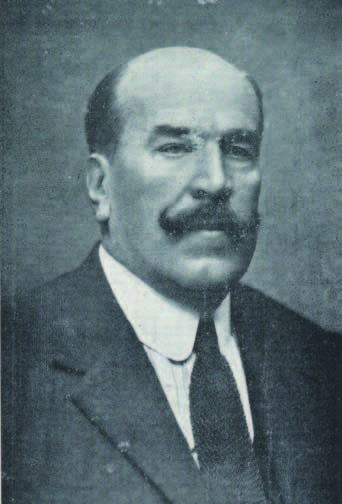

- Entry: `/prisoner/vincente-balbas-capo`
- Source: [record/publication](https://dspace.unia.es/bitstream/10334/7341/1/07_Pozo.pdf#page=4)
- Credit: La Rabida, no. 100, November 1922, p. 8; reprinted no. 150, January 1927, p. 3. Reproduced in Felipe del Pozo Redondo, Universidad Internacional de Andalucia, 2014, p. 177.
- Identity: University study explicitly identifies this portrait of the Puerto Rican journalist Vicente Balbas Capo (1864-1926), documents his 1917 prosecution, and traces this exact photograph to its 1922 first publication. Database spelling Vincente is retained.
- Rights: Underlying historical image is public domain in the United States; no claim is made to the copyright of surrounding modern text or page layout.
- Original: [chronological-originals/balbas-p4-0.jpg](chronological-originals/balbas-p4-0.jpg)
- Edit: unmodified_download; rotation 0 degrees; crop None.
- Original SHA-256: `0162904d81ca48cd31d103d9785a97e344f68c24242f7fbb76258cb93f0fe32e`
- Entry image SHA-256: `0162904d81ca48cd31d103d9785a97e344f68c24242f7fbb76258cb93f0fe32e`

## Merrill Rogers

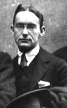

- Entry: `/prisoner/merrill-rogers`
- Source: [record/publication](https://revolutionsnewsstand.com/2026/07/09/the-second-masses-trial-by-john-reed-from-the-liberator-vol-1-no-10-december-1918/)
- Credit: Historical photograph after the first Masses trial, April 1918; reproduced by Revolution's Newsstand.
- Identity: Caption names all six participants from left: Crystal Eastman, Arthur Young, Max Eastman, Morris Hillquit, Merrill Rogers Jr., Floyd Dell. Crop isolates fifth person.
- Rights: Underlying historical image is public domain in the United States; no claim is made to the copyright of surrounding modern text or page layout.
- Original: [chronological-originals/merrill-group.jpg](chronological-originals/merrill-group.jpg)
- Edit: exact_rectangular_crop; rotation 0 degrees; crop [732, 111, 867, 327].
- Original SHA-256: `c912dba4f881b265550b135de931ee5185b5dfe7efdbea3b97e5c36f70a7bb10`
- Entry image SHA-256: `7ffb8d4a1d65de3037703e8244a292e78d6f05c21af3100c07f7c77430594f99`

## Mary Carroll Dowell

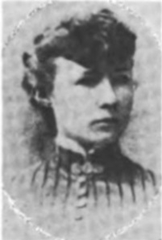

- Entry: `/prisoner/mary-carroll-dowell`
- Source: [record/publication](https://documents.alexanderstreet.com/d/1008297963)
- Credit: Historical portrait reproduced in Robert Thames, Biographical Sketch of Mary Carroll Dowell, Alexander Street suffrage database.
- Identity: Portrait embedded in the biography of Mary Carroll Dowell, born 1866, Philadelphia NWP officer and January 1919 prisoner. Original photographer and date not supplied.
- Rights: Historical portrait; source supplies no separate image-rights statement or original publication date. Credit retained; no claim is made to the surrounding modern biography.
- Original: [chronological-originals/dowell.jpg](chronological-originals/dowell.jpg)
- Edit: unmodified_download; rotation 0 degrees; crop None.
- Original SHA-256: `54544b3bc43e590064b6fba1b0d219fbbcf91a6012113eb01cb177cc92da58c7`
- Entry image SHA-256: `54544b3bc43e590064b6fba1b0d219fbbcf91a6012113eb01cb177cc92da58c7`

## Edna Dixon

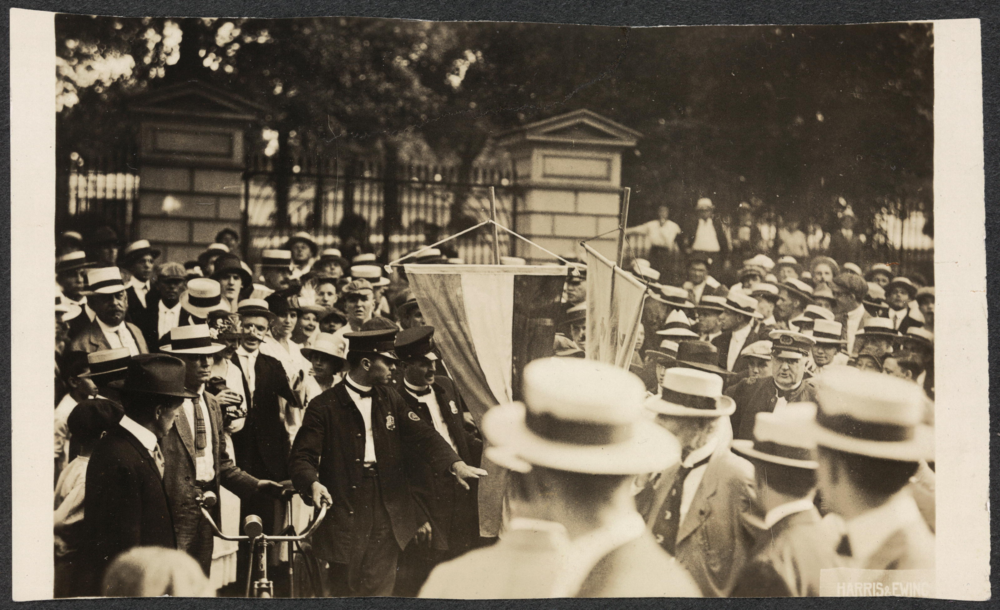

- Entry: `/prisoner/edna-dixon`
- Source: [record/publication](https://www.loc.gov/item/mnwp000230/)
- Credit: Harris & Ewing, August 17, 1917; The Suffragist, August 25, 1917, p. 7; LOC mnwp000230.
- Identity: Original 1917 publication caption explicitly names Edna Dixon and Lavinia Dock being arrested at the West Gate. Full scene retained because individual position is not specified. LOC heading Mary Bartlett Dixon conflicts with its title; the contemporary caption and National Park Service both identify Edna Dixon.
- Rights: Underlying historical image is public domain in the United States; no claim is made to the copyright of surrounding modern text or page layout.
- Original: [chronological-originals/dixon-arrest.jpg](chronological-originals/dixon-arrest.jpg)
- Edit: unmodified_download; rotation 0 degrees; crop None.
- Original SHA-256: `c1c570379cf49a3b31ecc7f1bc51ddd5c535c162f65fd2c8c165cab49ce17de7`
- Entry image SHA-256: `c1c570379cf49a3b31ecc7f1bc51ddd5c535c162f65fd2c8c165cab49ce17de7`

## Mary Dubrow

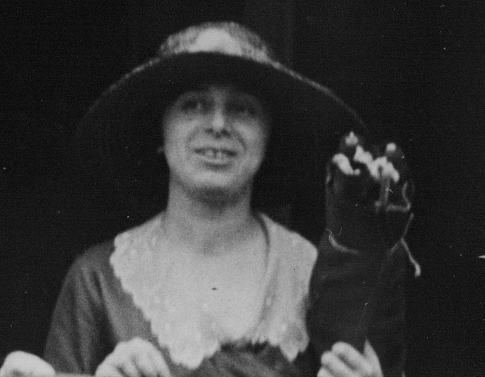

- Entry: `/prisoner/mary-dubrow`
- Source: [record/publication](https://www.loc.gov/item/mnwp000264/)
- Credit: Republican Convention, June 1920; National Woman's Party Records, Library of Congress, mnwp000264.
- Identity: LOC caption explicitly names left to right Mrs. James Rector, Mary Dubrow, and Alice Paul. Crop isolates Mary Dubrow in center.
- Rights: Underlying historical image is public domain in the United States; no claim is made to the copyright of surrounding modern text or page layout.
- Original: [chronological-originals/dubrow-republican.jpg](chronological-originals/dubrow-republican.jpg)
- Edit: exact_rectangular_crop; rotation 0 degrees; crop [1200, 660, 2390, 1585].
- Original SHA-256: `00929a1b679f00de81fcfc3de802255c3b3f8e2dbc9d7f1bae0b100c056db393`
- Entry image SHA-256: `2ce39f7bbf7dd7980295f58d3cc53578161c5bcf6419c95c1f9c627cd38cacb2`

## Roderick Seidenberg

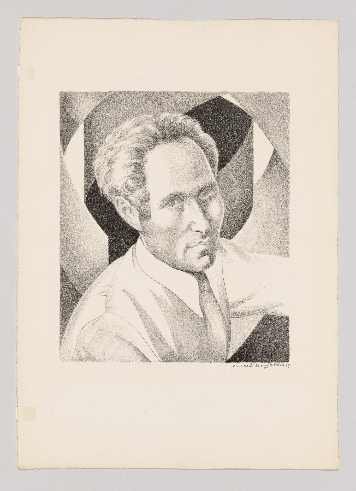

- Entry: `/prisoner/roderick-seidenberg`
- Source: [record/publication](https://whitney.org/collection/works/67177)
- Credit: Mabel Dwight, Portrait of Roderick Seidenberg, 1928, lithograph. Whitney Museum of American Art, 2023.69, gift of Monroe E. Price and Aimee Brown Price.
- Identity: Named museum portrait of architect and writer Roderick Seidenberg, the absolutist conscientious objector. Artist and sitter relationship corroborated by Brier Hill Gallery biographical catalog.
- Rights: Whitney Museum explicitly states that Mabel Dwight works are in the public domain in the United States; 1928 lithograph.
- Original: [chronological-originals/seidenberg.jpg](chronological-originals/seidenberg.jpg)
- Edit: unmodified_download; rotation 0 degrees; crop None.
- Original SHA-256: `f16a0f215044ed997ead39a1a1cef1cd321a2ecbf2202c6c66d6eda8b2fe9e58`
- Entry image SHA-256: `f16a0f215044ed997ead39a1a1cef1cd321a2ecbf2202c6c66d6eda8b2fe9e58`

## William E. Van Amburgh

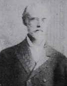

- Entry: `/prisoner/william-e-van-amburgh`
- Source: [record/publication](https://watchtowerdocuments.org/wp-content/documents/1918_Rutherford_Trial_Part_One.pdf#page=6)
- Credit: Historical group photograph of the eight Watch Tower defendants, circa 1918-1919; reproduced with ordered name key in Rutherford trial compilation, p. 6.
- Identity: Printed caption identifies first man from left by matching initials and surname. These are the eight 1918 Brooklyn defendants; date of photograph not independently established. Fred H. Robison is distinct from the military prisoner Fred H. Robinson.
- Rights: Underlying historical photograph from circa 1918-1919; same group reproduced as public domain on Wikimedia Commons, File:Consiglio Direttivo - 1918.JPG. No claim is made to the modern compilation.
- Original: [chronological-originals/jw-p6-0.jpg](chronological-originals/jw-p6-0.jpg)
- Edit: exact_rectangular_crop; rotation 0 degrees; crop [95, 279, 231, 454].
- Original SHA-256: `739ac48c864e641a594b70940698405b8b5b4096d8c40b5631b00ca567aae9f9`
- Entry image SHA-256: `e160ecfa0e973ef026e6f532f399beff583eb68aac2c57d8a7b76fd8648c1439`

## Alexander H. Macmillan

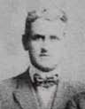

- Entry: `/prisoner/alexander-h-macmillan`
- Source: [record/publication](https://watchtowerdocuments.org/wp-content/documents/1918_Rutherford_Trial_Part_One.pdf#page=6)
- Credit: Historical group photograph of the eight Watch Tower defendants, circa 1918-1919; reproduced with ordered name key in Rutherford trial compilation, p. 6.
- Identity: Printed caption identifies third man from left by matching initials and surname. These are the eight 1918 Brooklyn defendants; date of photograph not independently established. Fred H. Robison is distinct from the military prisoner Fred H. Robinson.
- Rights: Underlying historical photograph from circa 1918-1919; same group reproduced as public domain on Wikimedia Commons, File:Consiglio Direttivo - 1918.JPG. No claim is made to the modern compilation.
- Original: [chronological-originals/jw-p6-0.jpg](chronological-originals/jw-p6-0.jpg)
- Edit: exact_rectangular_crop; rotation 0 degrees; crop [336, 312, 432, 435].
- Original SHA-256: `739ac48c864e641a594b70940698405b8b5b4096d8c40b5631b00ca567aae9f9`
- Entry image SHA-256: `9bb309f12f72da327bfb0e3f6e5411dfb85e1b5c9e1c68fb210648e86ba12431`

## Robert J. Martin

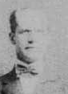

- Entry: `/prisoner/robert-j-martin`
- Source: [record/publication](https://watchtowerdocuments.org/wp-content/documents/1918_Rutherford_Trial_Part_One.pdf#page=6)
- Credit: Historical group photograph of the eight Watch Tower defendants, circa 1918-1919; reproduced with ordered name key in Rutherford trial compilation, p. 6.
- Identity: Printed caption identifies fourth man from left by matching initials and surname. These are the eight 1918 Brooklyn defendants; date of photograph not independently established. Fred H. Robison is distinct from the military prisoner Fred H. Robinson.
- Rights: Underlying historical photograph from circa 1918-1919; same group reproduced as public domain on Wikimedia Commons, File:Consiglio Direttivo - 1918.JPG. No claim is made to the modern compilation.
- Original: [chronological-originals/jw-p6-0.jpg](chronological-originals/jw-p6-0.jpg)
- Edit: exact_rectangular_crop; rotation 0 degrees; crop [435, 318, 520, 435].
- Original SHA-256: `739ac48c864e641a594b70940698405b8b5b4096d8c40b5631b00ca567aae9f9`
- Entry image SHA-256: `f5c7a17995b08c962cb8e61111ba8a52f0e243c80333689118e092ddd3bcd2a7`

## Fred H. Robison

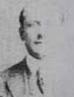

- Entry: `/prisoner/fred-h-robison`
- Source: [record/publication](https://watchtowerdocuments.org/wp-content/documents/1918_Rutherford_Trial_Part_One.pdf#page=6)
- Credit: Historical group photograph of the eight Watch Tower defendants, circa 1918-1919; reproduced with ordered name key in Rutherford trial compilation, p. 6.
- Identity: Printed caption identifies fifth man from left by matching initials and surname. These are the eight 1918 Brooklyn defendants; date of photograph not independently established. Fred H. Robison is distinct from the military prisoner Fred H. Robinson.
- Rights: Underlying historical photograph from circa 1918-1919; same group reproduced as public domain on Wikimedia Commons, File:Consiglio Direttivo - 1918.JPG. No claim is made to the modern compilation.
- Original: [chronological-originals/jw-p6-0.jpg](chronological-originals/jw-p6-0.jpg)
- Edit: exact_rectangular_crop; rotation 0 degrees; crop [531, 336, 612, 443].
- Original SHA-256: `739ac48c864e641a594b70940698405b8b5b4096d8c40b5631b00ca567aae9f9`
- Entry image SHA-256: `687c01bc65345f7f69f1d515664603ffdd908295cb797bf976b53145abca4f67`

## George H. Fisher

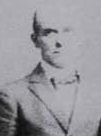

- Entry: `/prisoner/george-h-fisher`
- Source: [record/publication](https://watchtowerdocuments.org/wp-content/documents/1918_Rutherford_Trial_Part_One.pdf#page=6)
- Credit: Historical group photograph of the eight Watch Tower defendants, circa 1918-1919; reproduced with ordered name key in Rutherford trial compilation, p. 6.
- Identity: Printed caption identifies seventh man from left by matching initials and surname. These are the eight 1918 Brooklyn defendants; date of photograph not independently established. Fred H. Robison is distinct from the military prisoner Fred H. Robinson.
- Rights: Underlying historical photograph from circa 1918-1919; same group reproduced as public domain on Wikimedia Commons, File:Consiglio Direttivo - 1918.JPG. No claim is made to the modern compilation.
- Original: [chronological-originals/jw-p6-0.jpg](chronological-originals/jw-p6-0.jpg)
- Edit: exact_rectangular_crop; rotation 0 degrees; crop [716, 370, 817, 506].
- Original SHA-256: `739ac48c864e641a594b70940698405b8b5b4096d8c40b5631b00ca567aae9f9`
- Entry image SHA-256: `15024a1cbe42124ea68818ac3b65d3d91467e18657cafd8d7f88f378c0bf123b`

## Giovanni De Cecca

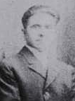

- Entry: `/prisoner/giovanni-de-cecca`
- Source: [record/publication](https://watchtowerdocuments.org/wp-content/documents/1918_Rutherford_Trial_Part_One.pdf#page=6)
- Credit: Historical group photograph of the eight Watch Tower defendants, circa 1918-1919; reproduced with ordered name key in Rutherford trial compilation, p. 6.
- Identity: Printed caption identifies eighth man from left by matching initials and surname. These are the eight 1918 Brooklyn defendants; date of photograph not independently established. Fred H. Robison is distinct from the military prisoner Fred H. Robinson.
- Rights: Underlying historical photograph from circa 1918-1919; same group reproduced as public domain on Wikimedia Commons, File:Consiglio Direttivo - 1918.JPG. No claim is made to the modern compilation.
- Original: [chronological-originals/jw-p6-0.jpg](chronological-originals/jw-p6-0.jpg)
- Edit: exact_rectangular_crop; rotation 0 degrees; crop [823, 397, 930, 540].
- Original SHA-256: `739ac48c864e641a594b70940698405b8b5b4096d8c40b5631b00ca567aae9f9`
- Entry image SHA-256: `f0253b31f74339f9baf169f7bb3b78714db2c2847a1a3cdfd46b8a92bae8f8ae`

## Amos Martin Showalter

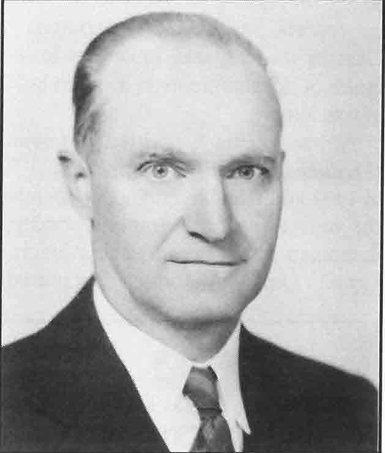

- Entry: `/prisoner/amos-martin-showalter`
- Source: [record/publication](https://www.mennonitehistorian.ca/17.3.MHSep91.pdf#page=5)
- Credit: Amos Showalter portrait, reproduced in Gerlof Homan, A CO on Trial: The Court-martial of Amos M. Showalter, Mennonite Historian 17(3), September 1991, p. 5.
- Identity: Original printed caption names Amos Showalter (1891-?), and the accompanying archival study identifies Amos Martin Showalter, his Goshen education, Camp Funston court-martial, and religious objection.
- Rights: Historical portrait reproduced by Mennonite Historian; original photographer, image date and separate image-rights statement not supplied. Modern article and page layout excluded.
- Original: [chronological-originals/showalter-p5-0.jpg](chronological-originals/showalter-p5-0.jpg)
- Edit: exact_rectangular_crop; rotation 0 degrees; crop [896, 2320, 1525, 3060].
- Original SHA-256: `8a64a6c817c538b76e2ba616fbc2da628844a51a83e2ed0dda908848252f8abf`
- Entry image SHA-256: `eb61884ecd0cbb3b137a29000d4f8274409618756b9b2b40cd7202a5be6f8ded`

## Howard Wilbur Moore

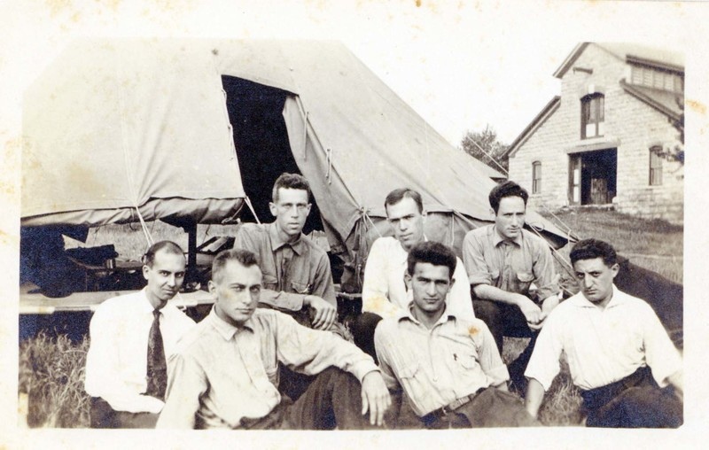

- Entry: `/prisoner/howard-wilbur-moore`
- Source: [record/publication](https://cosandgreatwar.swarthmore.edu/exhibits/show/biographical-notes/howard-moore)
- Credit: Swarthmore College Peace Collection, Conscientious Objection and the Great War, Howard Wilbur Moore biography; Caplovitz collection photograph.
- Identity: Institutional biography explicitly identifies Howard Moore at front row left with fellow conscientious objectors, including Harold Studley Gray in the back row. Whole seven-person historical group retained rather than guessing at overlapping row positions.
- Rights: Historical First World War photograph in Swarthmore College Peace Collection. Source supplies educational access; photographer and separate item-rights statement not supplied.
- Original: [chronological-originals/howard-moore-group.jpg](chronological-originals/howard-moore-group.jpg)
- Edit: unmodified_download; rotation 0 degrees; crop None.
- Original SHA-256: `6a2eeae6e948cd92e99f9394057d7d7f6afef08b7d051b549964bdec80a224b6`
- Entry image SHA-256: `6a2eeae6e948cd92e99f9394057d7d7f6afef08b7d051b549964bdec80a224b6`

## C. J. Woodworth

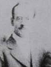

- Entry: `/prisoner/c-j-woodworth`
- Source: [record/publication](https://watchtowerdocuments.org/wp-content/documents/1918_Rutherford_Trial_Part_One.pdf#page=6)
- Credit: Historical group photograph of eight Watch Tower defendants, circa 1918-1919; Rutherford trial compilation, p. 6.
- Identity: Printed caption identifies sixth man from left as C. J. Woodworth, the co-author of The Finished Mystery and 1918 Brooklyn defendant.
- Rights: Underlying historical photograph from circa 1918-1919; same group reproduced as public domain on Wikimedia Commons, File:Consiglio Direttivo - 1918.JPG. No claim is made to the modern compilation.
- Original: [chronological-originals/jw-p6-0.jpg](chronological-originals/jw-p6-0.jpg)
- Edit: exact_rectangular_crop; rotation 0 degrees; crop [620, 358, 721, 492].
- Original SHA-256: `739ac48c864e641a594b70940698405b8b5b4096d8c40b5631b00ca567aae9f9`
- Entry image SHA-256: `7ba47b98bea9b3d43516da9b9ce59e38e0b0d467a89be98b06944f0d10bd1c6f`

## Harold Studley Gray

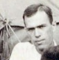

- Entry: `/prisoner/harold-studley-gray`
- Source: [record/publication](https://cosandgreatwar.swarthmore.edu/exhibits/show/biographical-notes/howard-moore)
- Credit: Swarthmore College Peace Collection, First World War conscientious objectors group photograph.
- Identity: Institutional caption identifies Harold Studley Gray in back row, second from right; his separate Swarthmore biography confirms the 1918 military imprisonment. Crop isolates that position.
- Rights: Historical First World War photograph in Swarthmore College Peace Collection. Source supplies educational access; photographer and separate item-rights statement not supplied.
- Original: [chronological-originals/howard-moore-group.jpg](chronological-originals/howard-moore-group.jpg)
- Edit: exact_rectangular_crop; rotation 0 degrees; crop [401, 207, 486, 293].
- Original SHA-256: `6a2eeae6e948cd92e99f9394057d7d7f6afef08b7d051b549964bdec80a224b6`
- Entry image SHA-256: `51b359c832de3cfa7e031adac51369161d6ad48758785d80515358dc64ff82f6`

## William Kantor

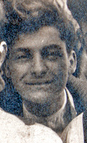

- Entry: `/prisoner/william-kantor`
- Source: [record/publication](https://cosandgreatwar.swarthmore.edu/exhibits/show/biographical-notes/william-kantor)
- Credit: Swarthmore College Peace Collection, William Marx Kantor biography and wartime group photograph.
- Identity: Institutional biographical page explicitly identifies Kantor in middle (front), distinguishing him from the man directly behind him. Database prisoner matches full name, imprisonment at Camp Meade and conscientious objection.
- Rights: Historical First World War photograph in Swarthmore College Peace Collection. Source supplies educational access; photographer and separate item-rights statement not supplied.
- Original: [chronological-originals/kantor-group.jpg](chronological-originals/kantor-group.jpg)
- Edit: exact_rectangular_crop; rotation 0 degrees; crop [205, 92, 292, 235].
- Original SHA-256: `be40381b8895b29f67a9383a7a9f2a72e0a7862c2d42daf7c039e88551b826a2`
- Entry image SHA-256: `f61c8d2292dfa5cb728cde229139e62068c1f0a69ca4f47ae8da840ed0d54205`

## Philip Grosser

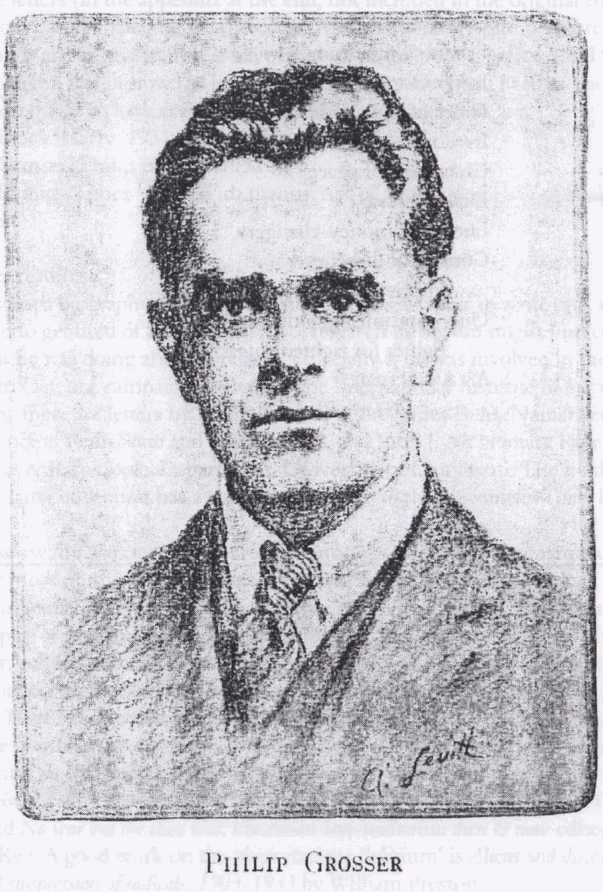

- Entry: `/prisoner/philip-grosser`
- Source: [record/publication](https://www.thesparrowsnest.org.uk/collections/public_archive/1120.pdf#page=5)
- Credit: Philip Grosser, Alcatraz: Uncle Sam's Devil's Island, original Boston edition 1933; historical illustrated frontispiece reproduced in Kate Sharpley Library expanded edition, 2007, PDF p. 5.
- Identity: Frontispiece explicitly captioned Philip Grosser beside his autobiographical account of First World War military imprisonment. Historical drawn portrait, not a photograph. PDF page rendered to combine its segmented scan images before a simple rectangular crop.
- Rights: Historical portrait reproduced in 1933 pamphlet and 2007 Kate Sharpley Library edition; original artist and image-specific rights not established. No copyright claim is made to modern editorial matter.
- Original: [chronological-originals/grosser-page5-native-render.png](chronological-originals/grosser-page5-native-render.png)
- Edit: exact_rectangular_crop; rotation 0 degrees; crop [275, 290, 1510, 2115].
- Original SHA-256: `3e7e1afcbcbb6e88a86fda7aa74b9a9cfdec96be35a9d8f2cafd45f695d80bdf`
- Entry image SHA-256: `d928960d4b2348143400f12491edfe5f3c93775345638dbfd0aba6167d013c14`

## J. T. Doran

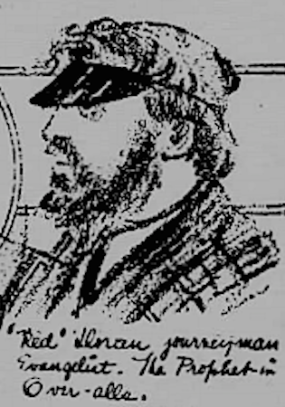

- Entry: `/prisoner/j-t-doran`
- Source: [record/publication](https://www.loc.gov/resource/sn83030214/1918-04-14/ed-1/?sp=28)
- Credit: Maude Martin Evers, courtroom sketch of Red Doran, New York Tribune, April 14, 1918, part III p. 6 (scan 28); reproduced by We Never Forget.
- Identity: Original sketch is captioned Red Doran, missionary evangelist, the prophet in overalls; accompanying trial report identifies the IWW speaker. J. T. (John T.) Doran is the Chicago defendant known as Third Rail Red. Contemporary courtroom drawing, not a photograph.
- Rights: Newspaper drawing published in 1918; public domain in the United States.
- Original: [chronological-originals/doran.png](chronological-originals/doran.png)
- Edit: unmodified_download; rotation 0 degrees; crop None.
- Original SHA-256: `a4046acceae53ab84ae9bf1a35ff34b791da8cea4ec5209d4daf30a424985b58`
- Entry image SHA-256: `a4046acceae53ab84ae9bf1a35ff34b791da8cea4ec5209d4daf30a424985b58`

## Max Sandin

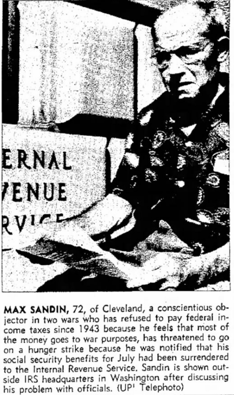

- Entry: `/prisoner/max-sandin`
- Source: [record/publication](https://sniggle.net/TPL/index5.php?entry=30Aug16)
- Credit: UPI Telephoto, August 1961, Max Sandin outside IRS headquarters; newspaper clipping reproduced by David Gross, The Picket Line.
- Identity: Original printed caption names Max Sandin, 72, Cleveland conscientious objector in both world wars and tax resister. These details match this prisoner and distinguish him from modern namesakes. Original photo and full caption retained.
- Rights: UPI Telephoto newspaper photograph, 1961. No public-domain or open-license claim; original rights and any renewal have not been established. Small historical clipping retained unmodified for documented biographical identification.
- Original: [chronological-originals/max-sandin.png](chronological-originals/max-sandin.png)
- Edit: unmodified_download; rotation 0 degrees; crop None.
- Original SHA-256: `035b227096ec02b23966da04bf49f9519be28859d23ba5a5069d39cd11056f91`
- Entry image SHA-256: `035b227096ec02b23966da04bf49f9519be28859d23ba5a5069d39cd11056f91`
